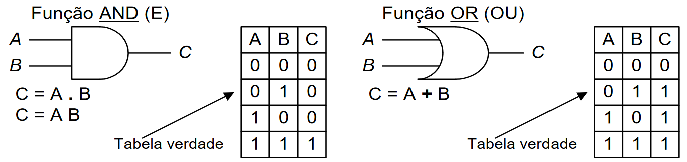
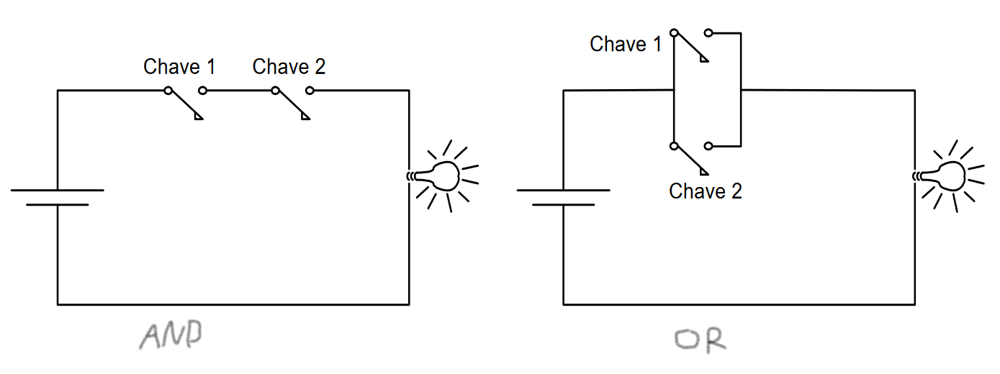
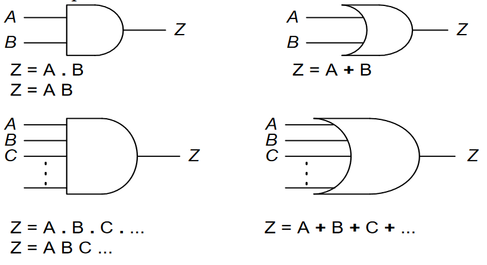
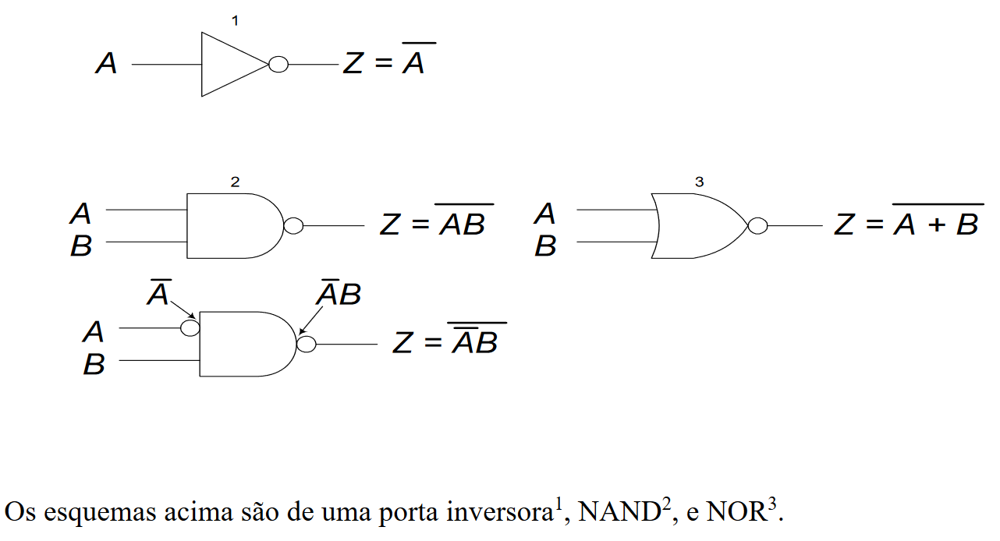
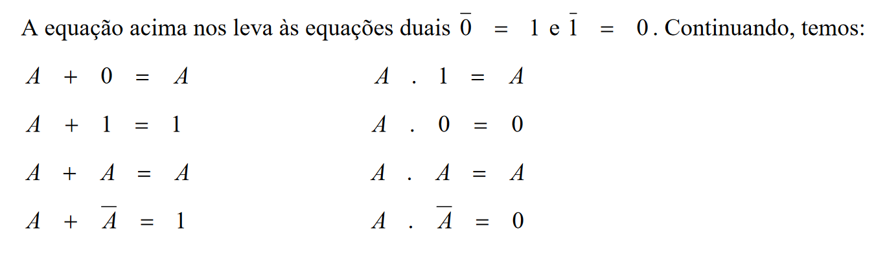
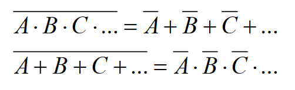

# Sistemas Digitais

## Representação de Quantidades Binárias

- Nos sistemas digitais eletrônicos, a informação binária é representada por tensões que estão presentes no circuito eletrônico

## Portas Lógicas e Álgebra Booleana

- Uma relação funcional acaba tornando-se uma tabela verdade

| A | Z = f(A) |
| - | -------- |
| F |     F    |
| V |     V    |

| A | Z = f(A) |
| - | -------- |
| F |     V    |
| V |     F    |

- Existem relações do tipo Z = f(A, B) dependente de duas variáveis lógicas A e B. Sendo os exemplos:

  
  

- Estas relações podem ser estendidas da forma Z = f(A, B, ..., Y). Ex:
  
  

- Além do AND e OR, há a existência do inversor no qual terá como saída o complemento lógico da entrada. F -> V e V -> F

  

## Teoremas da Álgebra de Boole

- O fato de uma variável só poder assumir um de dois valores nos conduz ao complemento do complemento de uma variável A ser a própria variável A, isto é: A = ~~A

  

### Provas (Tarefa)

- Obs: X' = complemento de X

1. A + AB = A
   - A + AB = A(1 + B)
   - = A.1 [teo - A + 1 = 1]
   - = A [teo - A.1 = A]

2. A(A + B) = A
   - A(A + B) = AA + AB
   - = A + AB [teo - A.A = A]
   - = A [teo ex.1 - A + AB = A]

3. AB + A(B') = A
   - AB + A(B') = A(B + B')
   - = A.1 [teo - A + A' = 1]
   - = A [teo - ]

4. (A + B)(A + B') = A
   - (A + B)(A + B') = AA + AB' + AB + BB'
   - = A + AB' + AB + 0 [teo - A.A' = 0 e A.A = A]
   - = A + A + 0 [teo ex.3 - AB + AB' = A]
   - = A + 0 [teo - A + A = A]
   - = A [teo - A + 0 = A]

5. A + A'B = A + B
   - A + A'B = A.1 + A'B
   - = A(B + 1) + A'B
   - = AB + A.1 + A'B
   - = B(A + A') + A
   - = B + A
   - = A + B

6. A(A' + B) = AB
   - A(A' + B) = AA' + AB
   - = 0 + AB [teo - A.A' = 0]
   - = AB [teo - A + 0 = A]

7. A + BC = (A + B)(A + C)
   - A + BC = A.1 + BC
   - = A(1 + (B + C)) + BC
   - = A + A(B + C) + BC
   - = A + AB + AC + BC
   - = A.A + AB + AC + BC
   - = A(A + B) + C(A + B)
   - = (A + C)(A + B)
   - = (A + B)(A + C)

8. A(B + C) = AB + AC
   - A(B + C) = AB + AC

9. AB + A'C = (A + C)(A' + B)
   - AB + A'C = AB + A'C.1
   - = AB + A'C(1 + (A + B))
   - = AB + A'C + AA'C + A'BC
   - = B(A'C + A) + A'(AC + C)

10. (A + B)(A' + C) = AC + A'B (INVERSO DA ANTERIOR)
    - (A + B)(A' + C) = AA' + AC + A'B + BC

11. AB + A'C + BC = AB + A'C
    - AB + A'C + BC = 0 + AB + A'C + BC
    - = A.A' + AB + A'C + BC
    - = A(A' + B) + C(A' + B)
    - = (A + C)(A' + B) = AB + A'C (teo ex.9)

12. (A + B)(A' + C)(B + C) = (A + B)(A' + C)
    - (A + B)(A' + C)(B + C) = (A + B)(A' + C)((B + C) + A.A')

## O Teorema de Morgan

  

- O complemento de vários ANDs é igual a vários ORs do complemento das variáveis
- O complemento de vários ORs é igual a vários ANDs do complemento das variáveis

## Funções Lógicas

- Para o desenvolvimento de um processo de simplificação das funções lógicas, há duas formas padrão nas quais as funções lógicas podem ser expressas:
  1. Forma padrão de soma de produtos
  2. Forma de produto padrão de somas

- Exemplo: Dada a funções lógica de quatro variáveis
  - F(A,B,C,D) = (A' + BC)(B + C'D)
  - expressar como uma soma de produtos
    - A'B + A'C'D + BBC + BCC'D
    - A'B + A'C'D + BC
- Exemplo: Dada a função lógica de cinco variáveis
  - F(A,B,C,D,E) = (A + (BC)')(D + BE)'
  - expressar a função como uma soma de produtos
    - (A + B' + C')(D'(B' + E'))
    - (A + B' + C')(D'(B' + E'))
    - (A + B' + C')((BD)' + (DE)')
    - A(BD)' + A(DE)' + (BD)' + (BDE)' + (BCD)' + (CDE)'
