# MIPS Assembly

## Estrutura

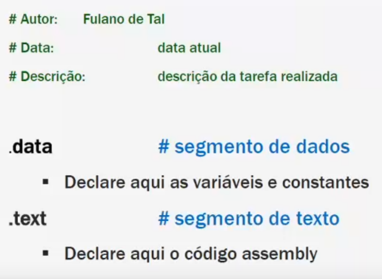

## Tipos de dados

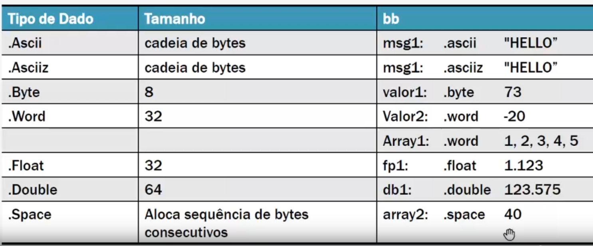

## System calls

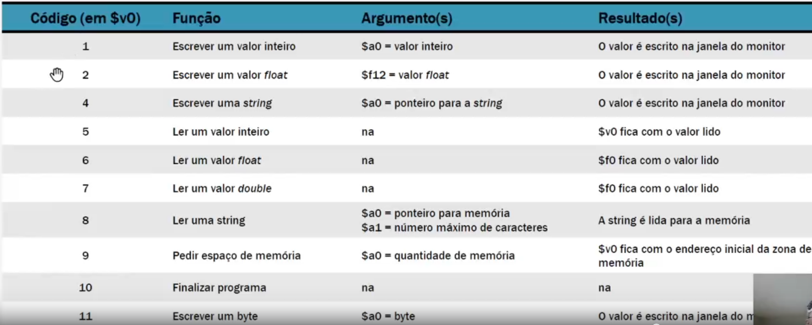

## Componentes de programa assembly

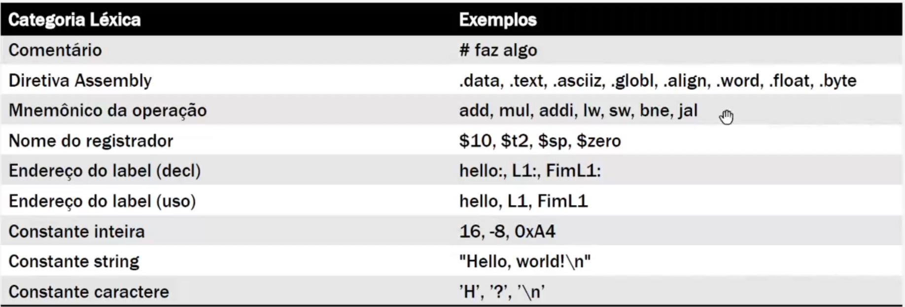

## Load and Stores

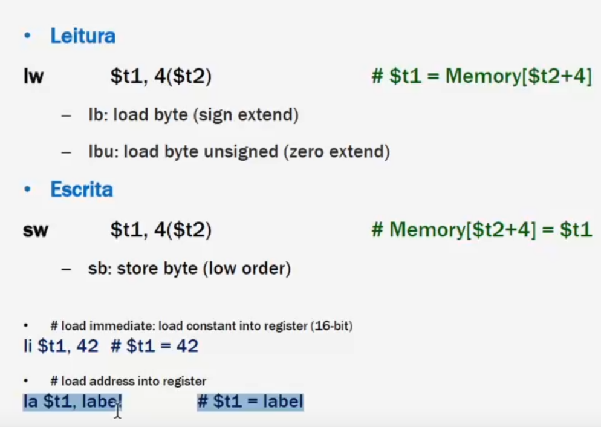

## Logic/Arithmetic Ops

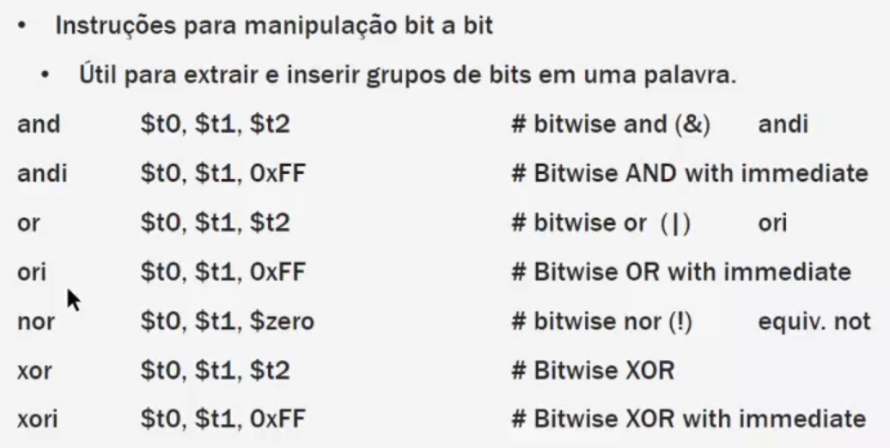
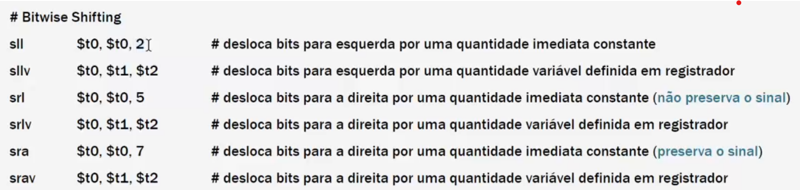

## Logic Expressions

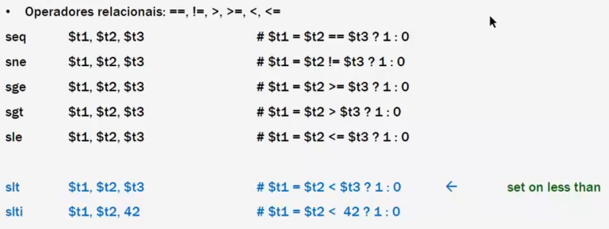

## Controle de Fluxo

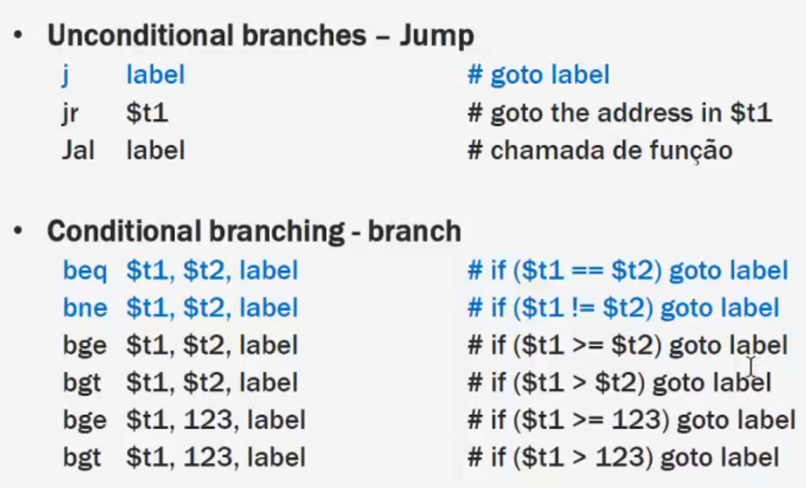

## if-then-else

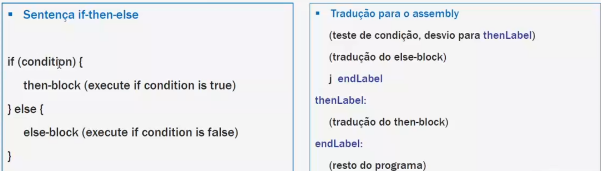

## while

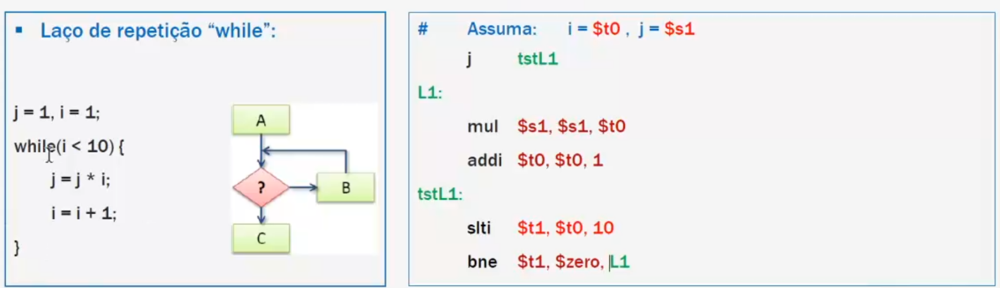

## do-while

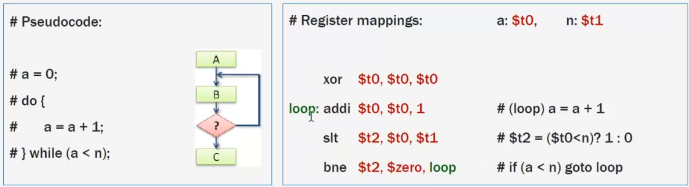

## MIPS Addressing Modes

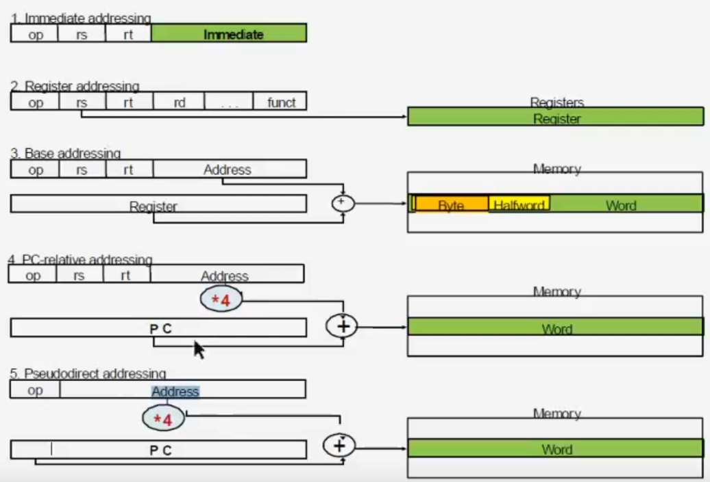

## Percorrendo elementos de array 2D

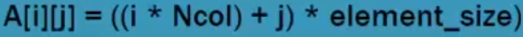

- Row-major order
- Column-major order

## Floating Point I/0

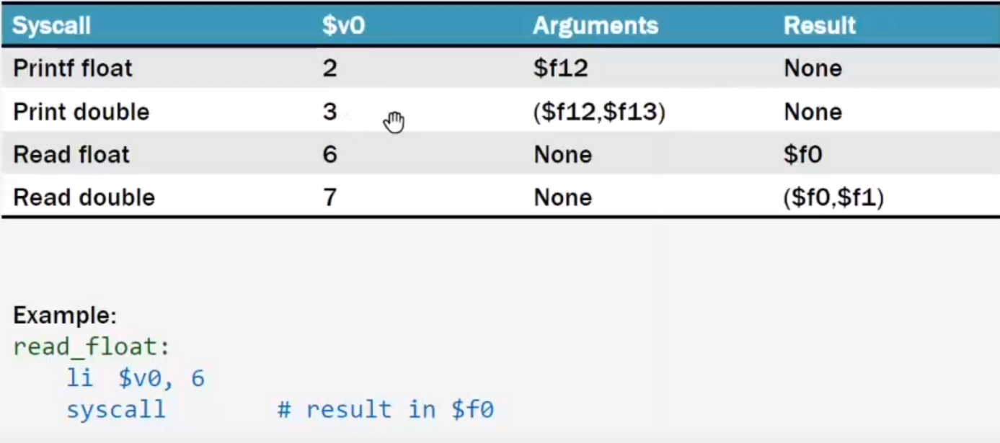

## Floating Point Registers

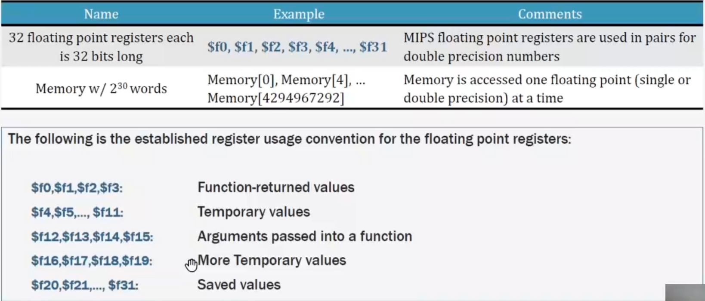

## Floating Point Instructions

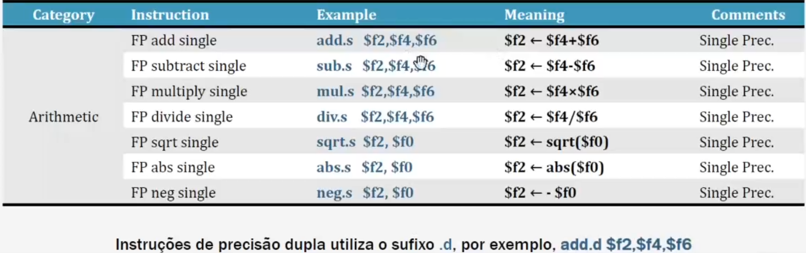

## Floating Point Load/Store Instructions

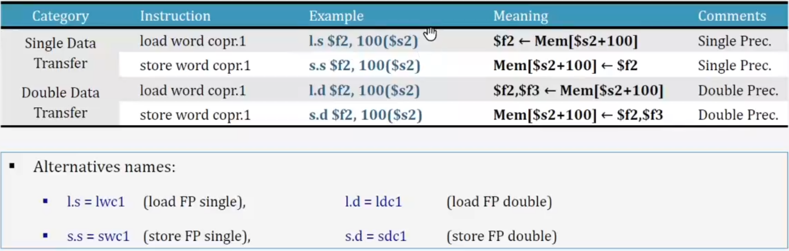

## Floating Point Conditional Instructions

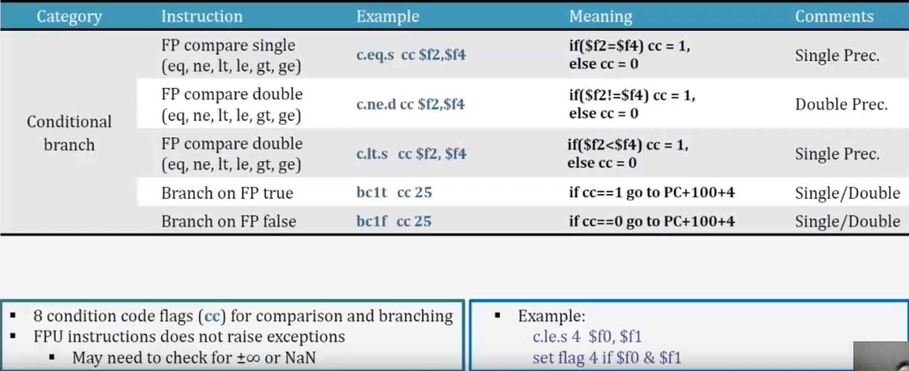

## Floating Point Data Movement Instructions

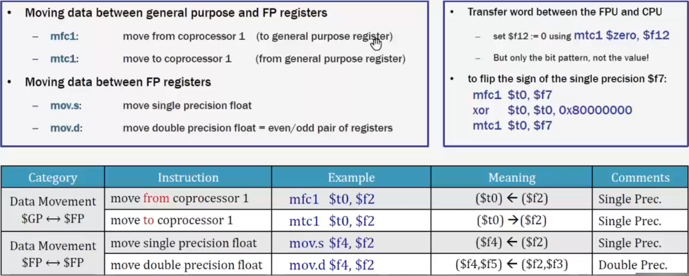

## Floating Point Convert Instructions

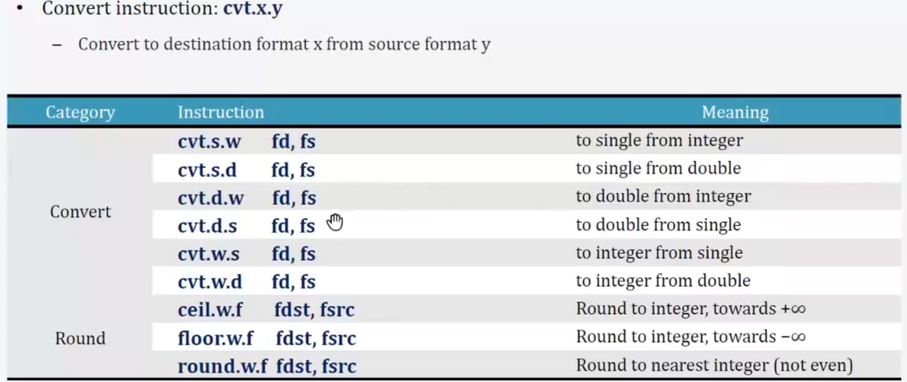

### Example 1

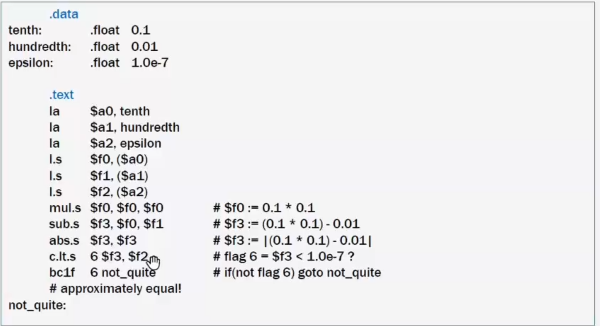

### Example 2

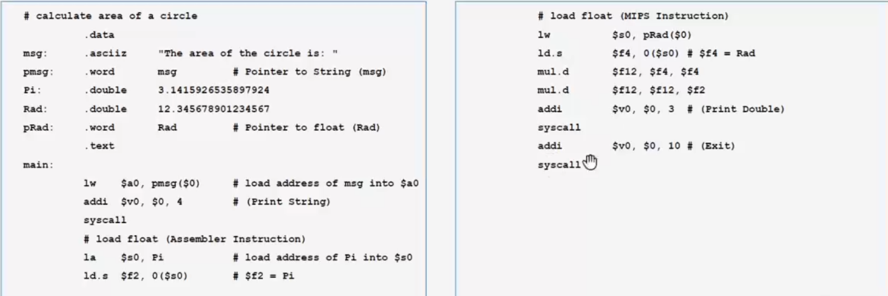

### Example 3

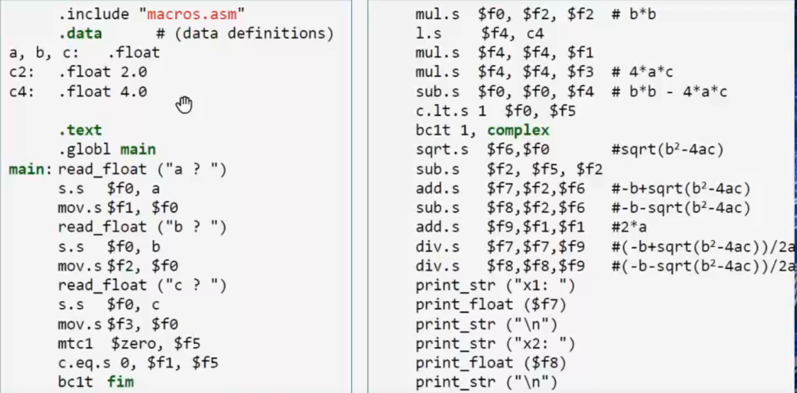
