# Arquitetura e Organização de Computadores 1

## Objetivo

- Estudo de um sistema de computação sob dois pontos de vista:
  - **Arquitetural** - se refere aos atributos do sistema visíveis a uma programador de linguagem de máquina e
  - **Organizacional** - as unidades operacionais e sua interconexão que realizam a arquitetura
- Vamos estudar a estrutura e a função de um computador
  - **estrutura** - a forma em que os componentes estão interconectados e
  - **função** - o comportamento de cada componente individualmente
  - Cada componente pode, por sua vez, de forma hierárquica, se decomposto em subcomponentes, descrevendo a sua estrutura e função

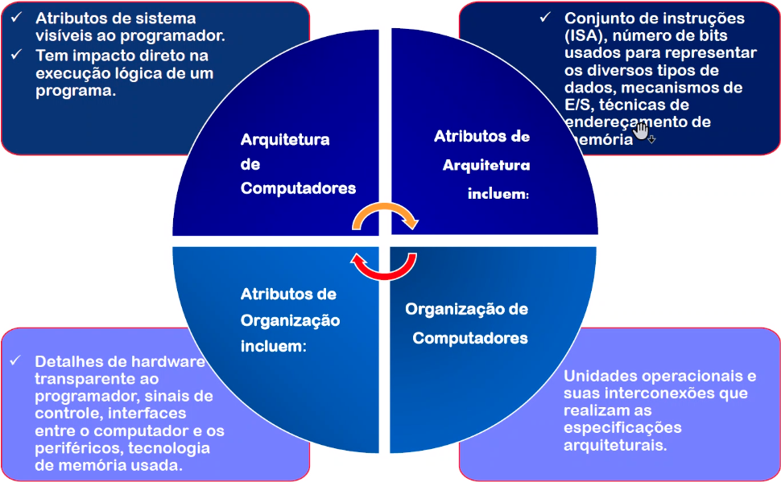

## Arquitetura & Organização

- Exemplo:
- É uma questão de projeto arquitetural se o computador deve ter uma instrução de multiplicação. Mas é uma questão organizacional se a instrução deve ser implementada com uma unidade de multiplicação ou através de repetidas somas
  - Muitas fabricantes oferecem uma família de modelos de computadores, todos com a mesma arquitetura, mas com diferenças na parte organizacional. Resultam assim em modelos com preços e desempenhos diferentes, mas podendo executar os mesmos programas escritos
  - Toda a família Intel x86 compartilha a mesma arquitetura básica
  - A família IBM System/370 compartilha a mesma arquitetura básica
    - Isto determina a compatibilidade de código - pelo menos para as versões anteriores
  - A organização difere entre diferentes versões

## Estrutura & Função

- Em cada nível o projetista se preocupa com a estrutura e a função
  - Estrutura: a maneira em que os componentes são interelacionados
  - Função: a operação de cada componente, individualmente

## Visão Funcional

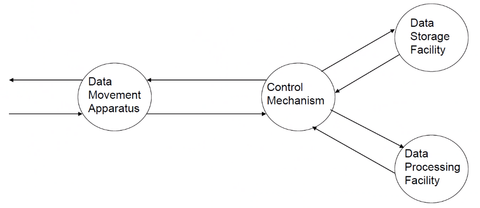

### Operações (1)

- Data movement
  - ex., teclado para vídeo (keyboard to screen)

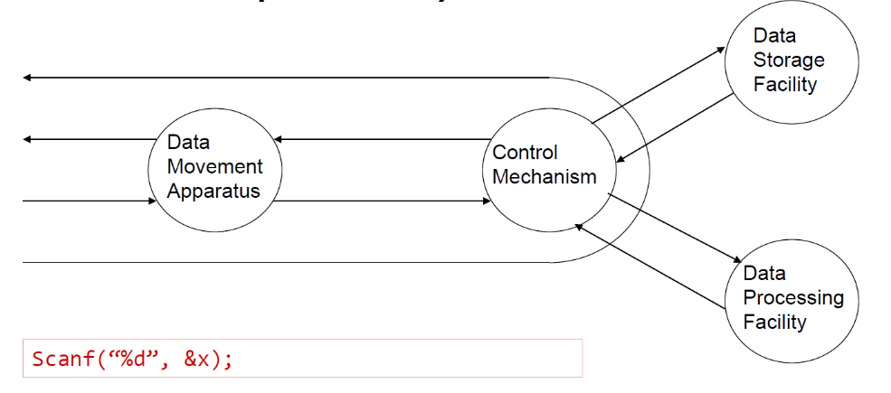

### Operações (2)

- Storage
  - internet download para unidade de disco

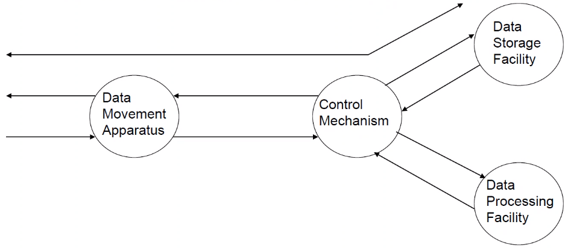

### Operações (3)

- Processamento de/para memória
  - ex., atualizando saldo bancário

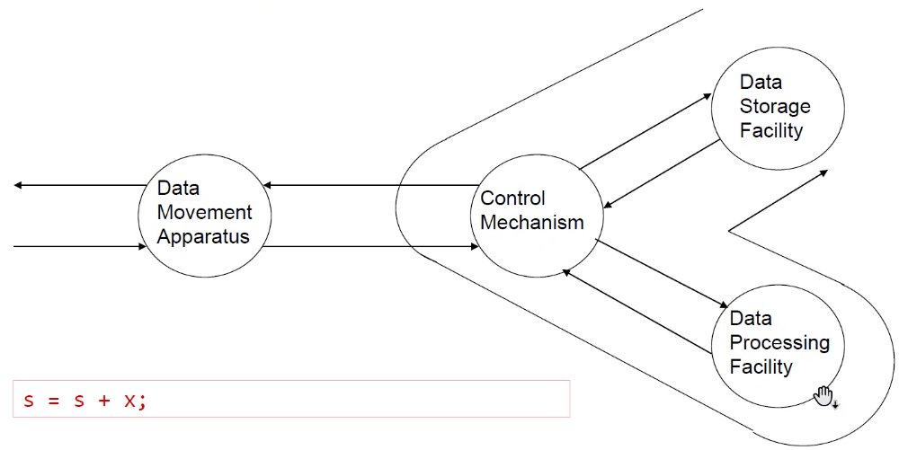

### Operações (4)

- Processamento da memória para E/S
  - impressão do saldo bancário

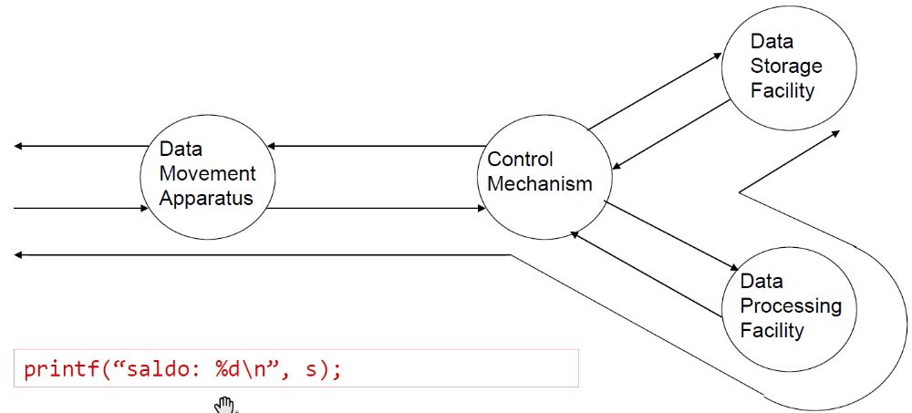

## Estrutura de um Computador - Visão Top-Down

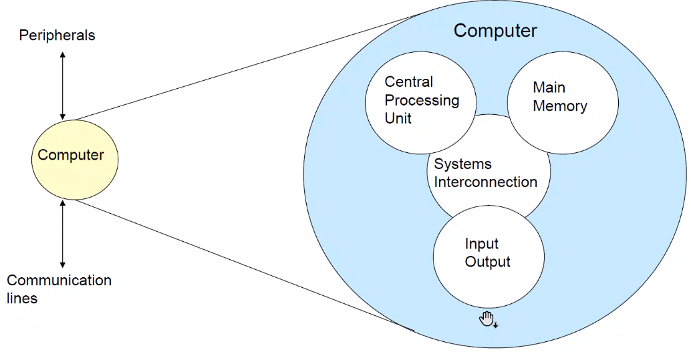

## Estrutura - A Unidade de Processamento

## Estrutura - A Unidade de Controle

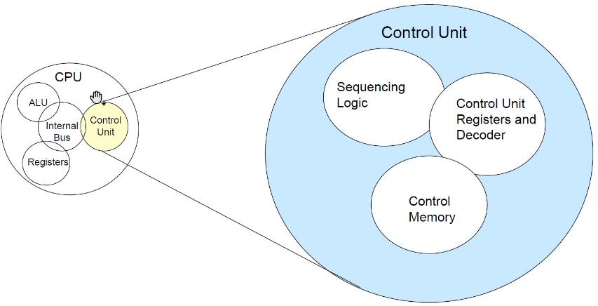

## Evolução dos Computadores e Desempenho

### História dos Computadores

#### A Era Mecânica (1600s-1940s)

- Wilhelm Schickhard (1623)
  - Astrônomo e Matemático
  - Cálculos de adição, subtração, multiplicação e divisão
- Blaise Pascal (1642)
  - Matemático
  - Primeira máquina operacional de produção em série
    - 50 cópias
  - Somente somava e subtraia
  - Apresentou problemas operacionais e de manutenção
- Gottfried Liebniz (1673)
  - Filósofo, cientista, matemático e inventor
  - Melhorou a máquina de Pascal
  - somava, subtraia, multiplicava e dividia
- Charles Babbage (1822)
  - Matemático - "Pai do computador moderno"
  - Buscava mais precisão nos cálculos
  - Máquina de Diferenças (Difference engine)
    - Primeiro acordo científico governamental
    - Cálculo automático de tabelas matemáticas
    - *Primeira máquina utilizada para resolver um problema*
  - Máquina Analítica (Analytic engine)
    - Realizava qualquer operação matemática
    - Dados em cartões perfurados
    - Estrutura moderna: E/S, armazenadores, ALU
    - Adição em 1 segundo, multiplicação em 1 minuto
  - Estas máquinas sofriam de problemas mecânicos
- George Boole (1847)
  - Análise matemática da Lógica (Mathematical analysis of logic)
  - Investigou as Leis do Pensamento
- Herman Hollerith (1889)
  - Fundou *Tabulating Machine Company* (tornou-se a IBM)
  - Em 1880 o censo gastou 5 anos para tabular os dados (montar em forma de tabela)
  - Estimativas de tabulação
    - 1890: 7,5 anos
    - 1900: 10+ anos
  - A máquina de Tabulação de Hollerith reduziu as estimativas de 7,5 anos para 2 meses
- Konrad Zuse (1938)
  - Construiu o primeiro computador mecânico operacional, o Z1
    - Máquina binária (Binary machine)
  - O governo alemão não deu continuidade ao desenvolvimento
    - W.W.W.II já tinha começado
  - Howard Aiken (1943)
    - Projetou o Harvard Mark I
    - Implementação da máquina de Babbage

#### A Era Eletrônica

- Geração 1 (1945 - 1958)
  - ENIAC - Mauchly e Echert - University of Pennsylvania
  - Desenvolvido para calcular tabelas de disparos de artilharia
  - Considerado o primeiro computador eletrônico
    - O Colossus provavelmente é o primeiro, mas foi reconhecido recentemente
  - Processava 5000 adições por segundo
  - Detalhes:
    - 18000 válvulas
    - 70000 resistores
    - 10000 capacitores
    - 6000 chaves
    - 30 x 50 feets
    - 140 kW de potência
    - Sistema Númerico Decimal
    - Programado manualmente através de chaves e plugges
- IAS (Institute for Advanced Studies)
  - John von Neumann e Goldstine
  - A partir da ideia do ENIAC desenvolveram o conceito de programa armazenado em memória
  - Esta arquitetura é conhecida como "Von Neumann architecture" e tem sidoo a base para o projeto de computadores desde então
  - Aspectos
    - Processamento em representação binária
    - Dados e instruções (programas) são armazenados em uma única memória de leitura e escrita
    - Conteúdos de memória são endereçados por posição, sem considerar o conteúdo ele próprio
    - Execução sequencial
- Este período é o início das longas disputas por patentes, direitos autorais, créditos, etc. Disputa John Von Neumann vs. Alan Turing
- Geração 2 (1958 - 1964)
  - Mudança tecnológica
  - Transistores
  - Linguagens de Alto Nível
  - Aritmética de Ponto Flutuante
- Geração 3 (1964 - 1974)
  - Surgimento do Circuito Integrado
  - Memória de Semicondutor
  - Microprogramming
  - Multiprogramming
- Geração 4 (1974 - presente)
  - Large scale integration / VLSI
  - Single board computers
- Geração 5 (? - ?)
  - VLSI / ULSI
  - Computer communications networks
  - Inteligência Artificial
  - Máquina massivamente parelelas

#### Resumo: gerações de computadores

- Válvulas - 1946 - 1957
- Transistor - 1958 - 1964
- Small Scale Integration - 1965 on
  - Up to 100 devices on a chip
- Medium Scale Integration - to 1971
  - 100 - 3000 devices on a chip
- Large Scale Integration - 1971 - 1977
  - 3000 - 100000 device on a chip
- Very Large Scale Integration - 1978
  - 100000 = 1000000000 device on a chip
- Ultra Large Scale Integration
  - Over 1000000000 devices on a chip

### Estrutura da Máquina IAS - John von Neumann

  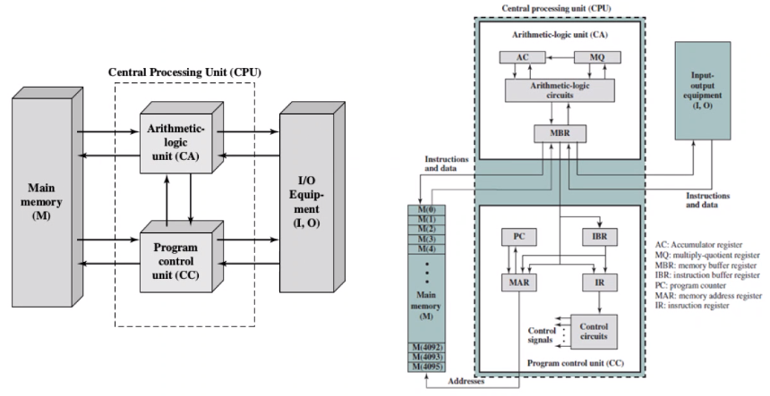

#### IAS - detalhes

- 1000 x 40 bit words
  - Binary number
  - 2 x 20 bit instructions
- Set of Registers (storage in CPU)
  - Memory Buffer Register
  - Memory Address Register
  - Instruction Register
  - Instruction Buffer Register
  - Program Counter
  - Accumulator
  - Multiplier Quotient

#### Fetch Execution Cycle

  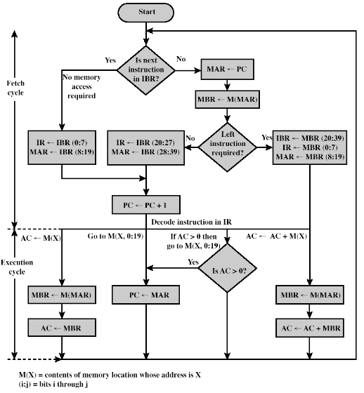

#### IAS - Conjunto de Instruções

  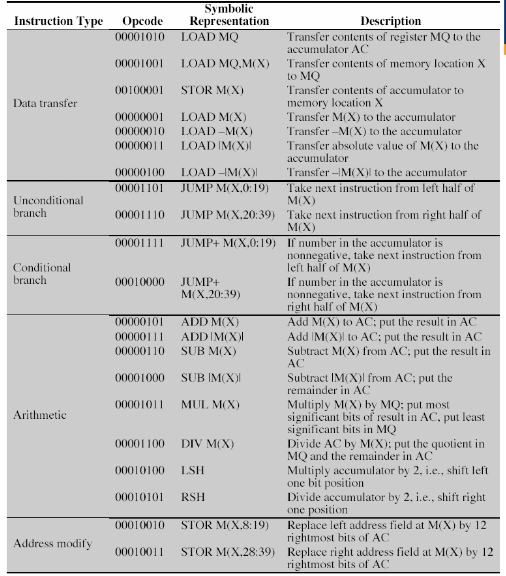

### Mudança Tecnológica: Transistores

- Substituiram as válvulas
- Menor
- Mais barato
- Menor dissipação de calor
- Dispositivos de estado sólido
- Fabricado com o material silício (Sand)
- Desenvolvido em 1947 no Bell Labs
- William Shockley et al.

### Mudança Tecnológica: Microelectrônica

- Literalmente - "small elctronics"
- Um computador é feito de portar lógicas (gates), células de memória (memory cells) e interconexões (interconnections)
- Isto pode ser feito em semicondutor
  - ex. silicon wafer

### Moore's Law

- Gordon Moore - cofundador da Intel
- A lei de Moore está relacionada com o aumento da densidade de componentes de um chip
- Previsões de Moore:
  - Número de transistores dobrará num período de 18 meses
  - O custo de um chip permanecerá o mesmo
- Densidades maiores de integração significa caminhos elétricos menores, resultando em maior desempenho
- Tamanho menores resulta em aumento da flexibilidade
- Redução das necessidades por potência elétrica e refrigeração
- Um número menor de interconexões aumenta a confiabilidade

### Crescimento na quantidade de transistores na CPU

  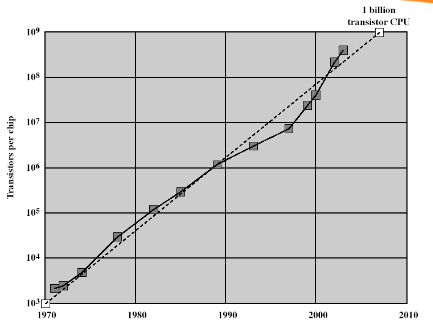

### Gargalo da Arquitetura de Von Neumann

- Aumento da velocidade do processador
- Aumento da capacidade de memória
- Velocidade da memória é inferior a velocidade do precessador

  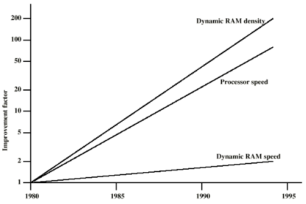

### Trends in DRAM use

  

### Soluções para a perda de desempenho

- Aumentar o número de bits recuperados a cada acesso
  - Make DRAM "wider" rather than "deeper"
- Mudar a interface DRAM
  - Cache
- Reduzir frequência de acesso à memória
  - Cache mais complexa e cache no chip
- Aumentar largura debanda de interconexão
  - Barramentos de alta velocidade
  - Caching
  - Buffering
  - Hierarquia de barramentos - Estruturas de barramentos mais elaborados
  - Configurações com múltiplos de processadores

### Melhorias na organização e na arquitetura do chip

- Aumentar velocidade de hardware do processador
  - Deve-se fundamentalmente a redução do tamanho das portas lógicas no chip
    - Mais portas, empacotamento mais próximo, aumento na taxa de clock
    - Redução no tempo de propagação dos sinais
- Aumentar tamanho e velocidade das caches
  - Dedicando parte do chip do processador para cache
  - Tempos de acesso à cache caem significamente
- Mudar organização e arquitetura do processador
  - Aumenta velocidade de execução efetiva
  - Paralelismo

### Problemas associados com a velocidade do relógio e a densidade lógica

- Potência
  - A densidade de potência (Watts/cm²) aumenta com a densidade da lógica e da velocidade do relógio
  - Dissipação do calor
- Atraso do circuito RC
  - Velocidade em que os elétrons fuem são limitados pela resistência e capacitância dos fios metálicos que os conectam
  - O atraso aumenta à medida que o produto RC aumenta
  - Fiação de interligação mais fina, aumenta a resistência
  - Fiação mais próxima, aumenta a capacitância
- Latência da memória
  - Velocidade da memória impacta a velocidade do processador
- Solução:
  - Dar mais ênfase nas abordagens de organização e arquiteturas para melhorar o desempenho

### Ténicas Avançadas para Ganhos de Desempenho

- Pipelining
- On board cache
- On board l1 & l2 cache
- Branch prediction
- Data flow analysis
- Speculative execution
- Superscalar architectures
- Multi-Threading

### Aumento da capacidade de cache

- Normalmente, dois ou três níveis de cache entre processador e memória principal
- Densidade de chip aumentada
  - Mais memória cache no chip
  - Acesso mais rápico à cache
- Chip Pentium dedicou cerca de 10% da área do chip à cache
- Pentium 4 dedica cerca de 50%

### Lógica de execução mais complexa

- Explorar o Paralelismo em Nível de Instruções
- Pipeline funciona como linha de montagem
  - Diferentes estágios de execução de diferentes instruções ao mesmo tempo ao longo do pipeline
- Superscalar permite múltiplos pipelines dentro de um único processador
  - Instruções que não dependem uma da outra podem ser executadas em paralelo

  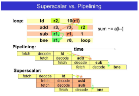

### Intel: melhorias na performance

  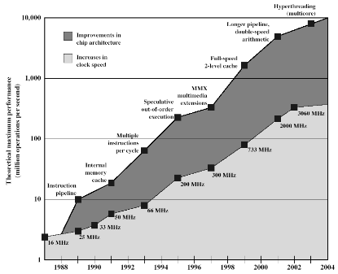

### Tendência

- Múltiplos cores
  - Múltiplos processadores em único chip
    - Grande cache compartilhada
  - Se o software puder usar múltiplos processadores, dobrar o número de processadores quase dobra o desempenho
  - Assim, use dois processadores mais simples no chip ao invés de um processador mais complexo
  - Com dois processadores, caches maiores são justificados
    - Consumo de potência da lógica de memória menor que lógica do processamento

### Lei de Amdahl

- Gene Amdahl (AMDA 67)
  - A lei de Amdahl é usada para encontrar a máxima melhora esperada para um sistema em geral quando apenas uma única parte do mesmo é melhorada
- *Speedup* em potencial do programa usando múltiplos processadores
- Concluiu que
  - Código precisa ser paralelizável
  - *Speedup* é limitado, gerando retornos decrescentes para uso de mais processadores
- Dependente da tarefa:
  - Servidores ganham mantendo múltiplas conexões em múltiplos processadores
  - Bancos de dados podem ser divididos em tarefas paralelas

### Dicas importantes para um bom projeto

1. Projetar dando atenção a Lei de Moore
2. Usar abstração para simplificar o projeto
3. Tornar o caso comum mais rápico
4. Melhorar o desempenho explorando o paralelismo
5. Melhorar o desempenho explorando o pipelining
6. Melhorar o desempenho aplicando a predição
7. Empregar sistema hierárquico de memórias
8. Obter estabilidade pelo emprego de redundância

## IAS MACHINE (Programming) - Von Neumann Architecture

### IAS HARDWARE

- Principais conceitos
  1. Conceito de programa armazenado
  2. Os dados e instruções são armazenados em uma única memória de leitura e gravação
  3. A Unidade Lógica e Aritmética (ALU) é capaz de operar com dados binários
  4. O conteúdo desta memória é endereçavel por local, sem se referira ao tipo de dados contido nela
  5. Unidade de controle, que interpreta e executa as instruções na memória
  6. A execução ocorre de maneira sequencial de uam instrução para a próxima, a menos que seja explicitamente modificada
  7. Os equipamentos de entrada/saída são operados pela unidade de controle
- Dispões de 4 regristadores
  - PC = Program Counter
  - IR = Instruction Register
  - AC = Accumulator Register
  - MQ = Multiplier Quotient Register
    - Used in Multiplication and division
  
### ORGANIZAÇÃO DA MEMÓRIA E FORMATO DA INSTRUÇÃO

  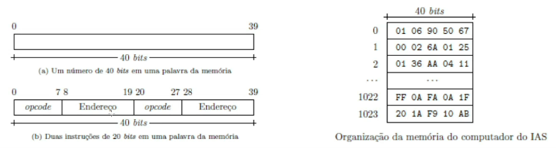

### FETCH-DECODE-EXECUTE CYCLE

- Existem seis fases fundamentais do ciclo de execução de instruções:
  1. Buscar instrução (também conhecida como pré-busca)
  2. decodificação de instrução
  3. avaliar endereço (geração de endereço)
  4. buscar operandos (ler dados da memória)
  5. executar (acesso ALU)
  6. armazenar resultado (dados da memória de write-back)

### IAS CODE CHEAT SHEET

- O IAS tem [códigos](IAS/IAS-refcard.pdf) de [comandos](IAS/ISA_IASmach.pdf) que são codificados em binário, mas para melhor interpretação, são escritos em símbolos, convertidos para hexadecimal

#### EXEMPLO 1

  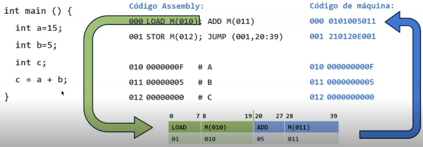

### Desvio De Fluxo

- Como expressar comandos de seleção condicional como if-then-else ou comandos de repetição for e while
- A implementação destes comando é feita através de saltos no código da aplicação. No caso do computador do IAS, a instrução JUMP+ M(X) pode ser utilizada para desvia o fluxo de execução, ou saltar, para instrução no endereço X da memória

## Como o Processador Funciona

### Arquitetura von Neumann

- Como discutido anteriormente, os projetos dos computadores modernos são baseados na Arquitetura de John von Neumaan
- A Arquitetura von Neumaan se fundamenta em três conceitos chaves:
  - Dados e Instruções são armazenados em uma única memória de leitura-escrita
  - Os conteúdos da memória são endereçados por posição, sem considerar o tipo de dados armazenado
  - A execução ocorre em modo sequencial

### Aboordagens de Hardware e Software

  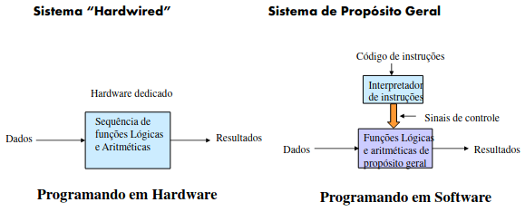

### O que é um programa?

- Uma sequência de passoa
- Em cada passo, uma operação lógica ou aritmética é realizada
- Em cada operação, um conjunto diferente de sinais de controle são necessários

### Função da Unidade de Controle

- Para cada operação é provido um código único
  - ex. ADD, MOV
- Um módulo de hardware interpreta o código e fornece os sinais de controle
- Assim, temos um computador

### Componentes Básicos de um Computador

- A Unidade de Controle e a Unidade Lógica e Aritmética constituem a Unidade Central de Processamento (CPU)
- Dados e instruções precisam entrar no sistema e os resultados, sairem
  - Via mecanismos de Entrada/Saída
- Armazenagem temporária do código e resultados se faz necessária
  - Memória principal

### Componentes do Computador (Top Level View)

  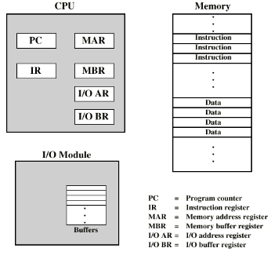

### Ciclo de Execução de Instruções

- Ciclo de dois estágios
  - Busca (fetch)
  - Executa

    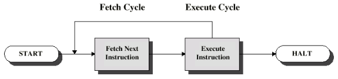

### Ciclo de Busca (Fetch Cycle)

- O Contador de Programa (PC) mantém o endereço da próxima instrução na memória
- O processador busca (fetch) a instrução armazenada na posição de memória referênciada por PC
- Realiza o incremento do PC
  - Se não houver comando indicando o contrário
- A instrução é carregada no Registrador de Instrução (IR)
- O processador interpreta a instrução e realiza as ações requeridas

### Ciclo de Execução (Execute Cycle)

- Movimentação Processador - Memória
  - transferência de dados entre CPU e memória principal
- Movimentação Processador - E/S
  - transferência de dados entre CPU e módulo de E/S
- Processamento de Dados
  - Realiza alguma operação lógica ou aritmética nos dados
- Operações de Controle
  - Alteração da sequência da execução de instruções
  - ex.: desvios condicionais e não-condicionais (jump)
- Combinação das operações listadas anteriormente

### Execução de um Programa (Máquina Hipotética)

  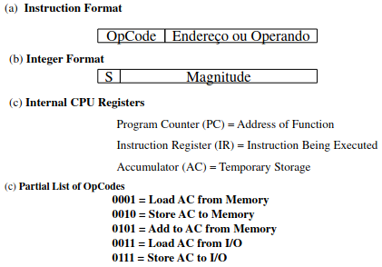

### Exemplo de Execução de um Programa (Processando a expressão: B = B + A)

  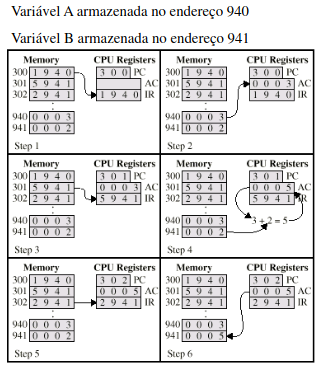

### Ciclo de Instrução - Diagrama de Estados

  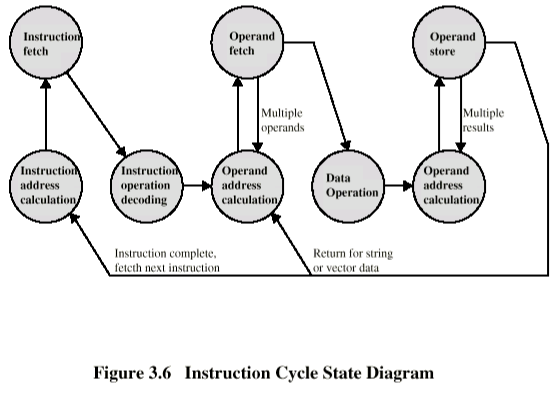

### Interrupções

- Mecanismos pelos quais outros módulos (ex. E/S) podem interromper a sequência normal de processamento
- Fontes de interrupções:
  - Programa
    - ex. overflow, division by zero
  - Timer
    - Gerado pelo processamento interno do relógio (timer)
    - Usado em sistema multi-tarefa preemptivos
  - E/S
    - a partir do controlador de E/S
  - Falha de Hardware
    - ex. memory parity error

### Fluxo de Controle do Programa

  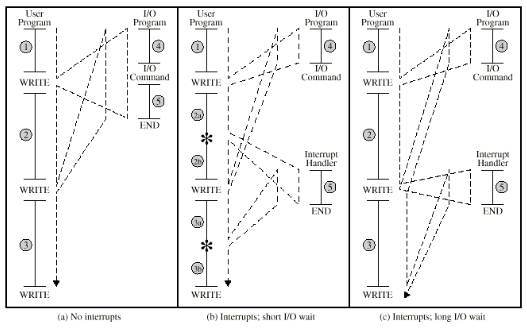

### Interrupt Cycle (ciclo de interrupção)

- Acrescentado ao ciclo de instrução
- Processador verifica se há interrupção
  - Indicado por um sinal de interrupção
- Se não há interrupção, busca a próxima instrução na memória
- Se houver interrupções pendente:
  - Suspende a execução do programa corrente
  - Salva o contexto
  - Configura PC com o endereço de início da rotina de tratamento da interrupção (interrupt handler routine)
  - Processamento da interrupção
  - Restaura o contexto e contiuna com o programa interrompido

### Ciclo de Instruções (com interrupções) - Diagrama de Estado

  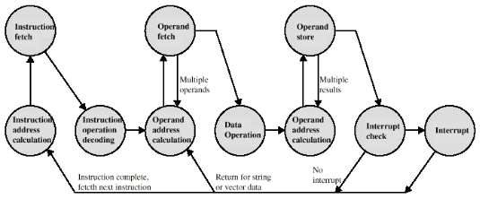

### Cenário com Múltiplas Interrupções

- Desabilitar Interrupções
  - O processador ignorará futuras interrupções enquanto processa uma interrupção
  - Interrupções permanecem pendentes e serão conferidas a primeira interrupção ter sido processada
  - Interrupção são manipuladas na sequência que elas acontecem
- Definir Prioridades
  - Interrupções de baixa prioridade são interrompidas por interrupções de alta prioridade
  - Quando a interrupção de mais alta prioridade foi processada, o processador retorna a interrupção anterior

### Múltiplas Interrupções - Sequencial

  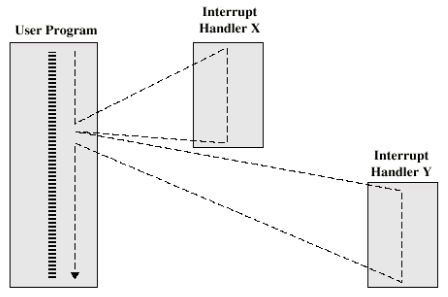

### Múltiplas Interrupções - Aninhadas (nested)

  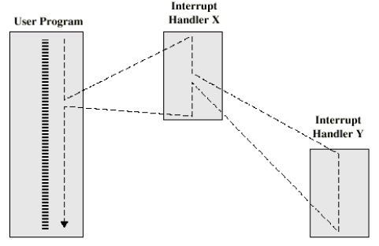

## Aritmética Computacional

### Unidade Lógica e Aritmética

- Faz os cálculos lógicos e aritméticos
- Tudo, num sistema computador, está lá para servir esta unidade
- Manipula valores inteiros (ponto fixo)
- Manipula valores reais (ponto flutuante)
- A FPU pode ser uma unidade separada
  - Co-processador matemático (maths co-processor)
  - A FPU pode ser um chip separado (486DX +)

### Interface da ULA: entradas e saídas

  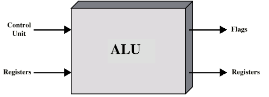

### Representação Inteira

- Utiliza os símbolos 0 e 1 para representar todas as coisas
- Números positivos são armazenados no formato binário
  - Exemplo: 41 = 00101001
  - Sem sinal de negativo
  - Sem vírgula
- Representações de valores sinalizados:
  - Sinal-magnitude (Sign-Magnitude)
  - Complemento-a-dois (Two's compliment)
- De modo geral, se a sequência de n dígitos binários a_(n-1)a_(n-2)...a1a0 for interpretada como um número inteiro sem sinal A, seu valor será dado por:

  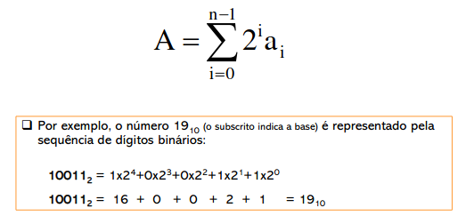

### Representação Sinal-Magnitude (Sign-Magnitude)

  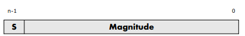

- O bit mais a esquerda é o bit de sinal
  - 0 significa que o valor é positivo
  - 1 significa que o valor é negativo
  - +18 = 00010010
  - -18 = 10010010
- Problemas:
  - É necessário considerar o sinal e a magnitude nas operações aritméticas
  - Duas representações para o zero (+0 and -0)
- Expressão geral:

  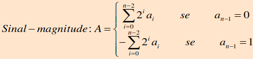

### Representação em Complemento-de-Dois

- Benefícios:
  - Uma única representação para o zero
  - As operações aritméticas são simples
    - (mais tarde, veremos mais detalhes)
  - A negação é aparentemente simples
    - 3 = 00000011
    - Fazendo a complementação booleana, temos:
      - 11111100
      - Adicionando 1 ao LSB, temos:
        - 11111101 = -3

| Características importantes: | |
|------------|-----------|
| Faixa de Valores representáveis | -2^(n-1) a 2^(n-1)-1 |
| Representações para o zero | 1 |
| Negação | Pegue o complemento booleando de cada bit do número positivo correspondente e então some 1 ao padrão de bits resultante, tratado como um número inteiro sem sinal |
| Expansão do número de bits | Acrescente posições de bit à esquerda  e preencha esses bits com o valor do bit de sinal original |
| Regra de overflow | Se dois número com o mesmo sinal forem somados, ocorrerá overflow apenas se o resultado tiver sinal oposto |
| Regra de subtração | Para subtrair B de A, pegue o complemento de dois de B e some-o com A |

- Expressão Analítica

  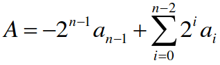
- Caso especial 1 - Negar o zero
  - Ignorando o overflow, temos:
    - -0 = 0

    
- Caso especial 2 - Negar o -128
  - -(-128) = -128 ... Monitorar o MSB(Sign bit)
  - O valor deveria mudar durante a negação

    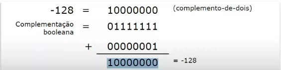
- Representação geométrica de inteiros

  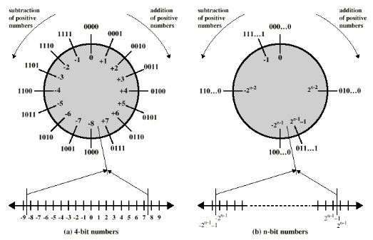

### Aritmética de Inteiros

- Adição de Inteiros

  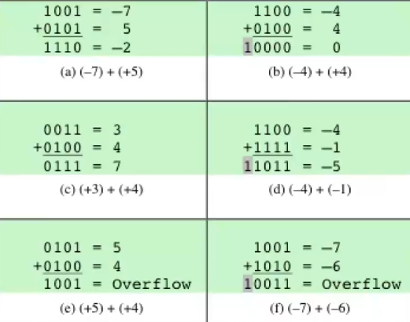
- Subtração de Inteiros

  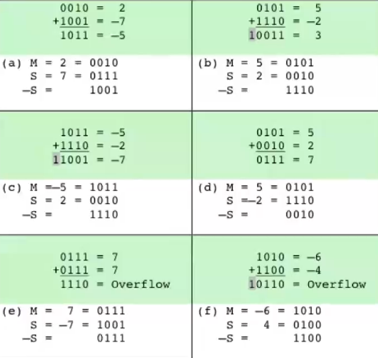
- Aritmética de Números Inteiros (Adição e Subtração)
  - Adição:
    - Operação aritmética binária normal
    - Monitora o bite de sinal para overflow
  - Subtração:
    - Realiza o complemento-dois do subtraendo e adiciona ao minuendo
    - Isto é, a - b = a + (-b)
  - Precisamos, somente, dos circuitos de complemento e de adição

- Hardware para Adição e Subtração
  
  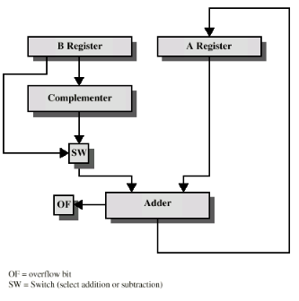
- Aritmética de Números Inteiros:
  - Multiplicação
    - Comparada as operações de adição e subtração, a operação de multiplicação é de maior complexidade
    - Realizar produtos parciais para cada dígito
    - Tomar cuidado com a posição do valor (coluna)
    - Adicionar os produtos parciais
    - O resultado terá o dobro do tamanho (em bits) dos operandos

      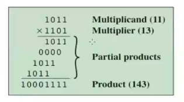

- Unsigned Binary:

  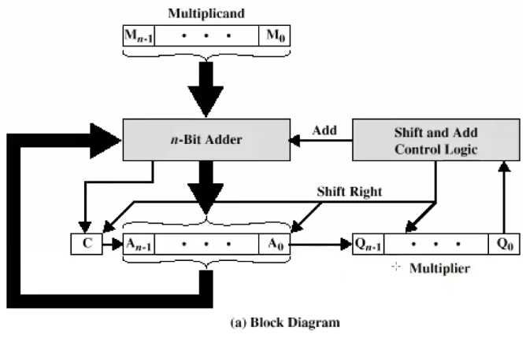
- Diagrama para multiplicação não sinalizada

  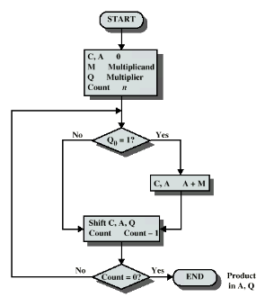
- Execução de multiplicação não sinalizada

  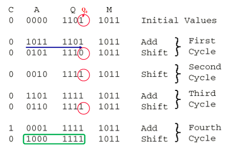
- Multiplicação de Números sinalizados
  - O método anterior não funciona para valores sinalizados (representados em complemento-dois)
  - Solução #1
    - Converter para positivo
    - Multiplicar, como feito anteriormente
    - Se os sinais forem diferentes, negar o resultado
  - Solução #2
    - Booth's algorithm
- Booth's Algorithm
  - Multiplicador e multiplicando armazenados nos registradores Q e M respectivamente.
  - O resultado da multiplicação é guardado nos registradores A e Q
  - Existe um registrador de um bit adicional, colocado a direda do LSB de Q, denominado Q(-1)
  - A e Q(-1) serão inicializados com o valor 0 (zero)
  - Como antes, a lógica de controle examina os bits do multiplicando, um de cada vez
  - Quando cada bit for examinado, também será examinado o bit a sua direita
    - Se esses dois bits forem iguais (1-1 ou 0-0), então todos os bits dos regs. A, Q, Q(-1) serão deslocados 1 bit a direita
    - Se eles forem diferentes, o multiplicando será somado ou subtraído do registrador A, dependendo se os dois bits forem (0-1 ou 1-0), respectivamente. Após a adição ou subtração, ocorre o deslocamento aritmético de um bit a direita

    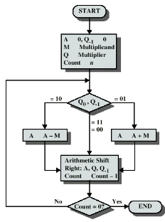
- Exemplo do Booth's Algorithm

  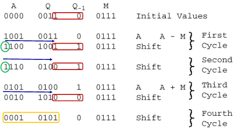

### Aritmética de Ponto Flutuante

#### Como representar números reais?

- Notação de Ponto Fixo
  - Utiliza um ponto que funciona da mesma forma que o ponto da notação decimal. Dígitos à esquerda do ponto representam a parte inteira do valor, e os dígitos à direita do ponto representam a parte fracionária.
  - 010.101 = 0 x 2² + 1 x 2¹ + 0 x 2⁰ + 1 x 2⁻¹ + 0 x 2⁻² + 1 x 2⁻³
- Notação de Ponto Flutuante
  - O problema do Ponto Fixo, é que o tamanho da parte inteira e da fracionária fica fixo com relação a seu armazenamento em memória
  - Para números com a parte apenas inteira, a região alocada para tratar a parte fracionária será inutilizada e vice-versa
- Notação Ciêntífica:
  - 976,000,000,00,000
    - 9.76 * 10¹⁴
  - 0.0000000000000976
    - 9.76 * 10⁻¹⁴
  - Mover dinamicamente o ponto decimal para uma posição conveniente e usar o exponente para assegurar o valor original
  - Um número pode ser representado na forma:
    - +- M . B^(+-E)
- Representação em Ponto-flutuante

  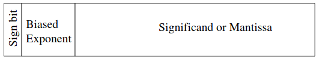
  - +/- 1.mantissa x 2^(exponente)
  - O nome (PF) não expressa a representação
  - O ponto é fixo entre o bit de sinal e o corpo da mantissa
  - O valor do exponente (polarizado) indica a posição do ponto
- Ponto Flutuante: exemplos

  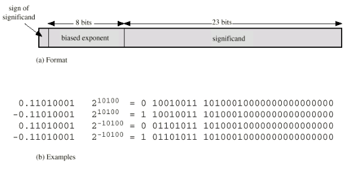
- Sinais para o Ponto Flutuante
  - A mantissa é armazenada em complemento-dois
  - O expoente é representado na notação excess ou biased (polarizado)
    - Exemplo:
      - Excess (bias) 127 significa
      - Campo exponente de 8 bit
      - Faixa de valores puros 0-255
      - Subtraia 127 para obter o valor correto
      - Nova faixa -127 to +128
- Normalização
  - Números em FP são frequentemente normalizados 
  - i.e., o expoente é ajustado para que o bit mais significativo (leading bit) da mantissa seja 1
  - Sendo ele (leading bit) sempre 1, não há necessidade de armazená-lo
  - Considerando a notação científica, os números são normalizados para terem somente um dígito antes do ponto decimal
    - Exemplo: 3.123 x 10³
- Valores representáveis:

  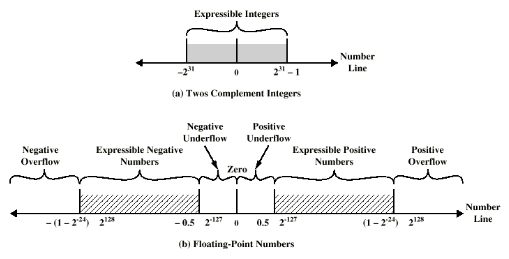
- Density of Floating-Point Numbers

  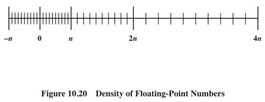

- IEEE754 Formats

  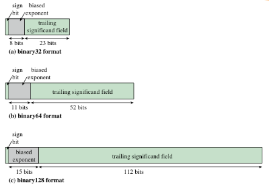

- Floating-Point Numbers and Arithmetic Operations

  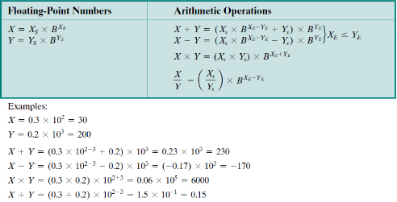
- Floating-Point Addition and Subtraction

  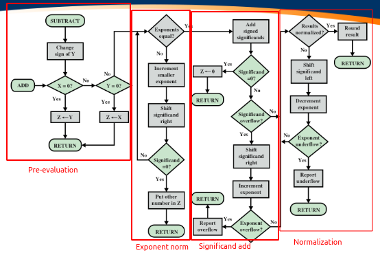
- Floating-Point Multiplication

  
- Floating-Point Division

  
- Considerações sobre Precisão - Guard Bits
  - Considere dois números nos formato normalizado IEEE, com valores muito próximos
  - x = 1,00 ... 00 * 2¹ e y = 1,11 ... 11 * 2⁰
  - Se o número menor foir subtraído do maior, ele deve ser deslocado 1 bit para a direita para alinhar os expoentes

    
- Considerações sobre Precisão - Arredondamentos
  - IEEE standard approaches:
    - Round to nearest:
      - The result is rounded up to the nearest representable number
    - Round toward +infinity:
      - The result is rounded up toward plus infinity
    - Round toward -infinity:
      - The result is rounded down toward negativa infinity
    - Round toward 0:
      - The result is rounded toward zero
- Intervalo Aritmético
  - Fornece um método eficiente para monitorar e controlar erros em cálculos de ponto flutuante, produzindo dois valores para cada resultado
  - Os dois valores correspondem aos pontos limite inferior e superior de um intervalo que contém o resultado verdadeiro
  - A largura do intervalo indica a precisão do resultado
    - Se os pontos de extremidade não puderem ser representados, os pontos de extremidade do intervalo serão arredondados para baixo e para cima, respectivamente
    - Se o intervalo entre os limites superior e inferior for suficentemente estreito, obtém-se um resultado suficientemente preciso
  - Arredondamento para Menos infinito e arredondamento para o Maior são úteis na implementação do intervalo aritmético
  - Truncamento:
    - Round em direção a zero
    - Bits extras são ignorados
    - Técnica mais simples
    - Um bias consistente em direção a zero na operação
      - Bias grave porque afeta todas as operações para as quais existem bits extras diferentes de zero

## Sistema de Memória

### Características do Sistema de Memória

- Localização (CPU, Interna, externa)
- Capacidade (Tamanho da palavra, número de palavras)
- Unidade de Transferência (palavra, bloco)
- Método de Acesso (sequencial, direto, aleatório, associativo)
- Desempenho (tempo de acesso, tempo de ciclo, taxa de transferência)
- Tipo Físico (semicondutor, superfície magnética)
- Características Físicas (volátil, não volátil, apagável ou não)
- Organização

### Localização

- Do ponto de vista do processador a memória pode ser vista como interna ou externa
  - A memória interna é frequentemente denominada como memória principal ou primária
    - O processador requer a sua própria memória local, na forma de registradores
    - Caches é outra forma de memória interna
  - A memória externa consiste em dispositivos de armazenamneto periféricos acessíveis ao processador por meio de controladores de E/S
    - Solid State Disks, Hard Disks, e Optical Disks

### Capacidade

- Tamanho da palavra
  - A unidade natural da organização
- Quantidade de palavras
  - ou Bytes

### Unidade de Transferência

- Interna
  - Usualmente governada pela largura do barramento de dados
- Externa
  - Usualmente um bloco que é muito maior que uma palavra
- Unidade Endereçável
  - Menor localização que pode ser unicamente endereçada
  - Internamente o endereçamento é feito por palavras
  - Em unidades de discos - blocos denominados clusters

### Métodos de Acesso (1)

- Sequencial
  - O acesso deve ser feito em uma sequencia linear específica
  - O tempo de acesso depende da localização dos dados e da localização anterior
  - ex. unidade de fita (tape)
- Direto
  - Blocos individuais tem endereços únicos
  - O acesso é feito por um salto de aproximação seguido por acesso sequencial
  - O tempo de acesso depende da localização de da localização anterior
  - ex. discos

### Métodos de Acesso (2)

- Aleatório (Random)
  - Endereços individuais identificam localizações de maneira exata
  - O tempo de acesso é independente da localização ou do acesso anterior
  - ex. RAM
- Associativa
  - Dados são localizados atráves de uma comparação com o conteúdo de uma porção do armazenador
  - O tempo de acesso é independente da localização ou do acesso anterior
  - ex. cache

### Hierarquia de Memória

- Registradores
  - na CPU
- Interna ou Memória principal
  - Pode incluir um ou mais níveis de cache
  - "RAM"
- Memória Externa
  - Armazenador secundário (backing store)

### Parâmetros de Desempenho

- Tempo de Acesso (latência)
  - Tempo decorrido entre a apresentação do endereço e a obtenção do dado válido
    - Para memória de acesso aleatório (RAM), é o tempo necessário para executar uma operação de leitura ou gravação
    - Para memória de acesso não aleatório, é o tempo que leva para posicionar o mecanismo de leitura-gravação no local desejado
- Tempo do Ciclo de Memória
  - Tempo de acesso mais qualquer tempo adicional necessário antes que o segundo acesso possa ser iniciado
    - Tempo adicional pode ser necessário para que os transientes desapareçam nas linhas de sinal ou para regenerar os dados se eles forem lidos destrutivamente
    - Tempo de ciclo é:
      - Tempo de acesso + recuperação
- Taxa de Transferência
  - A taxa na qual os dados podem ser transferidos para dentro ou para fora de uma unidade de memória
    - Para memória de acesso aleatório é igual a 1/(tempo de ciclo)

### Tipos Físicos

- Semicondutor
  - RAM
- Magnético
  - Disk & Tape, flash memory
- Ótico
  - CD & DVD
- Outros
  - Magneto-optical
  - Bubble
  - Hologram

### Características Físicas

- Declínio (Decay)
- Volatilidade (Volatility)
- Apagável (Erasable)
- Consumo de Energia

### Processor x Memory - Performance Gap

## Organização Hierárquica de Memória

### Objetivos do projeto de um Sistema de memória

- Prover capacidade de armazenagem
- com nível de desempenho aceitável
- a um custo razoável

  

### Quatro maneiras para alcançar o objetivo

- Usar umas estrutura hierárquica de módulos de armazenagem
- Desenvolver métodos de alocação onde espaço automático para uso eficiente da memória
- Atráves de técnicas de memória virtual, liberar o  usuário das tarefas de gerenciamento de memória
- Projetar a memória e sua estrutura de interconexão relacionada de maneira que o processador possa operar a uma máxima ou próxima

### Estrutura Hierárquica

- Core Registers
- L1 Cache
- L2 Cache
- L3 Cache
- Main memory
- Disk cache
- Disk
- Optical
- Tape

### Organização hierárquica de memória em dois níveis

- Tempo de acesso do nível 1 é de 1 us
- Tempo de acesso do nível 2 é de 10 us
- teff = H.tcache + (1 - H).tmem
- teff = H.(1) + (1 - H).(10) us
- Onde:
  - teff = effective access time
  - H = probability of a cache hit (hit rate)
  - tcache = cache access time
  - tmem = main memory access time

### Organização hierárquica: Cache & RAM

- Pequena quantidade de memória rápida
- Localizado entre a memória principal e a CPU
- Pode estar localizado internamente ao chip da CPU ou, em um módulo externo

  
  

### Estrutura RAM/Cache

### Operação de leitura do cache

### Operação do Cache - Revisão

- CPU faz referência ao conteúdo (dados) de uma determinada posição de memória
- Primeiro, efetua consulta no cache
- Se presente, obtém do cache (rápido)
- Se não presente, transfere o bloco requerido da memória principal para o cache
- Finalmente, transfere do cache para a CPU
- O cache inclui etiquetas para identificar qual bloco de memória principal está em cada seção do cache

### Organização Típica do Cache

### Memória Virtual

- Facilidade que permite aos programas endereçar memória de um ponto de vista lógico, sem considerar a quantidade de memória física disponível
- Quando usada, os campos de endereços de uma instrução de máquina(assembly) conterá endereços virtuais
- Nas operações de leitura e escrita da memória, um mecanismo de hardware(memory management unit - MMU) traduz cada endereço virtual para um endereço físico da memória principal

### Logical and Physical Caches

### Exemplo: Hierarquia de Memória

### Elementos de Projeto da Memória Hierárquica

- Tamanho da cache - Cache Size
- Função de Mapeamento - Mapping Function
  - Direto
  - Associativo
  - Associativo por Conjuntos
- Algoritmo de Substituição - Replacement Algorithm
  - LRU, FIFO, LFU, Random
- Política de Escrita - Write Policy 
  - Write Through
  - Write back
  - Write once
- Tamanho do Bloco - Block Size
- Número de Caches - Number of Caches
  - Single- or two-level
  - Unified or split

### O tamanho importa

- Custo
  - Mais cache, maior é o custo
- Velocidade
  - Quando maior for o cache, maior é a velocidade obtida (até certo ponto)
  - Efetuar consultas de dados no cache consome tempo

> Nota: gostaríamos que o tamanho da cache seja suficientemente pequeno, de forma que, o custo médio global por bit esteja próximo do custo da memória principal (DRAM), com capacidade grande o suficiente, e que o tempo mério de acesso efetivo esteja próximo ao tempo do cache

### Função de Mapeamento

- Como há um número menor de linhas cache me relação ao número de blocos sda memória principal, um algoritmo faz-se necessário para mapear blocos de memória para linhas cache. Além de uma maneira para descobrir qual bloco da memória principal, em determinado momento, ocupa uma linha cache
- A escolha da função de mapemanto determina como o cache está organizado
- Três técnicas podem ser utilizadas:
  - direto, associativo e associativo por conjuntos
- Configuração para análise:
  - Cache de 64 KBytes
  - Bloco Cache de 4 bytes
    - isto é, o cache tem 16k (2¹⁴) linhas de 4 bytes
  - Memória principal de 16MBytes
  - Endereços de 24 bits
    - (2²⁴ = 16M)

### Função de Mapeamento: Direto ou Associativo

### Mapeamento Direto - Direct Mapping

- Cada bloco da memória principal mapeia sempre em uma única linha cache
  - isto é, se um bloco está no cache, ele deve estar em um local específico
- O endereço é dividido em duas partes
- Os w bites menos significativos indentificam uma única palavra
- Os s bits mais significativos especificam um bloco de memória
- Os MSBs são divididos em um campo r na linha de cache e uma etiquta (tag) com os s-r bits (mais significativos)

### Mapeamento Direto - Estrutura do Endereço

- Endereço de 24 bits
- Identificador de palavra -> 2 bits (4 bytes por bloco)
- Identificador de bloco -> 22 bits
  - 8 bit tag (= 22 - 14)
  - 14 bits slot ou linha
- Dois blocos na mesma linha não tem a mesma etiqueta (tag)
- A consulta à um conteúdo da cache é feita em dois passos: primeiro, identifica a linha cache e, segundo, testa a etiqueta(tag)

### Mapeamento Direto - Cache Line Table

- O mapeamento é expresso como:
  - i = j módulo m
  - onde
    - i = número da linha cache
    - j = número do bloco da memória principal
    - m = número de linhas cache
- Cache line  Main Memory blocks held
- 0           0, m, 2m, 3m ... 2^s-m
- 1           1, m + 1, 2+ + 1, 2^s-m+1
- ...
- m-1         m-1, 2m-1, 3m-1 ... 2^s - 1

### Organização do Cache com Mapeamento Direto

### Exemplo de Mapeamento Direto

### Mapeamento Direto (pros & cons)

- Simples
- Baixo custo (Inexpensive)
- Localização fixa para um dado bloco
  - Se um programa acessa dois blocos que mapeiam para a mesma linha cache repetidamente, é grande o número de faltas de cache

### Mapeamento Associativo - Associative Mapping

- Um bloco de memória principal pode ser carregado em qualquer linha cache
- Endereços de memória são interpretados como uma etiqueta (tag) e palavra
- A etiqueta unicamente identifica um bloco de memória
- Toda etiqueta (tag) da linha cache é examinada por comparação (match)
- Pesquisar o cache é uma operação de alto custo

### Organização do cache totalmente Associativo

### Exemplo do Mapemanto Associativo

### Mapeamento Associativo - Estrutura de Endereço

- Etiqueta (tag) de 22 bites armazenada em cada bloco de dados de 32 bits
- Compara o campo Tag com cada entrada no cache para verificar se há um acerto (hit)
- Os dois bits menos significativos do endereço identificam qual palavra de 16 bits é requerida do bloco de dados de 32 bits
- exemplo:
  - Address       Tag       Data      Cache line
  - FFFFFC        FFFFFC    24682468  3FFF

### Mapeamento Associativo por Conjuntos

- O cache é dividido em conjuntos
- Cada conjunto contém um certo número de linhas
- Um determinado bloco mapeia para qualquer linha de um conjunto
  - ex. o bloco Bi pode estar em qualqer linha do conjunto i
  - ex. 2 linhas por conjunto
    - 2 way associative mapping
    - Um dado bloco pode estar em uma linha de duas possíveis de um determinado conjunto

### Two Way Set Associative Cache Organization

### Set Associative Mapping - Address Structure

- Utiliza o Set field para determinar o conjunto cache alvo da busca
- Compara o campo tag para verificar a presença
- exemplo:

| Address | Tag |   Data   | Set number |
|---------|-----|----------|------------|
| 1FF7FFC | 1FF | 12345678 | 1FFF       |
| 0017FFC | 001 | 11223344 | 1FFF       |

### Two Way Set Associative Mapping Example

### Algoritmo de Substituição - Mapeamento Direto

- Nenhuma escolha
- Cada bloco tem mapeamento em uma única linha cache
- Substitua esta linha

### Algoritmo de Substituição - Associativo & Associativo por Conjuntos

- Algoritmo implementado em hardware (speed)
- Least Recently Used (LRU) - **mais usado**
  - ex.: 2-way set associative
  - qual dos dois blocos é o menos recentemente usado (lru)
- First-in, first-out (FIFO)
  - substitua o bloco que está no cache a mais tempo
- Least frequently used
  - substitua o bloco que teve poucas referências no último intervalo de tempo
- Random

### Tratamento de falhas de cache

- O tratamento de falhas de cache é feito em colaboração com a unidade de controle do processador. O processamento de um erro de cache paralisa todo o processador, essencialmente congelando o conteúdo de todos os registradores enquanto espera pela memória
- As etapas executadas em uma falha de cache são:
  - Instrua o próxima nível de memória para ler o valor ausente
  - Aguarde a resposta da memória (pode levar vários ciclos de clock)
  - Atualiza a linha de cache correspondente com os dados recebidos da memória
  - Refetch e reinicie a execução da instrução, desta vez encontrando-a no cache
- Processadores mais sofisticados podem permitir a execução fora de ordem de outras instruções enquanto aguardam uma falha no cache

### Política de Escrita - Write Policy

- Não deve sobrescrever o bloco cache a não ser que a memória principal esteja atualizada
- Múltiplas CPUs devem ter módulos caches próprios
- Controladoras de I/0 podem endereçar memória principal diretamente

### Tratamento de Escritas (atualizações)

- Como lidar com write hits - considere uma instrução de armazenamento em que uma ocorrência de atualização de dados é apenas escrita no cache, sem alterar a memória principal
- Então, o cache e a memória teriam valores diferentes
  - Nesse caso, o cache e a memória são considerados inconsistentes
- Como lidar com write misses - devemos buscar o bloco correspondente da memória para o cache e, em seguida, sobrescrever com a palavra que causou a falha(chamada de "write allocate") ou devemos simplesmente escrever a palavra na memória principal (chamada de "no write allocate") ?

### Política de Escrita: write through

- Todas as escritas são efetuadas simultaneamente na cache e memória principal
- Múltiplas CPUs podem monitorar o tráfego da memória principal para manter a cache local (a CPU) atualizada
- Gera muito tráfego
- Atrasa as escritas

### Política de Escrita: write back

- Inicialmente, as atualizações são realizadas somente na cache
- Cada slot cache possui um update bit que são configurados quando uma atualização ocorre
- Caso o bloco venha ser substituido, uma escrita na memória principal é feita se o update bit sinalizar
- Outras caches estarão fora de sincronismo
- E/S deverá acessar memória principal através da cache
- Nota: 15% das referências a memória são escritas

### Tamanho da Linha Cache (slot)

### Multilevel Caches

- Com o aumento da densidade lógica, foi possível ter um cache no mesmo chip do processador
- O cache on-chip reduz a atividade de barramento externo do processador e acelera o tempo de execução e aumenta o desempenho geral do sistema
  - Quando a instrução ou os dados solicitados são encontrados no cache on-chip, o acesso ao barramento é eliminado
  - Os acessos ao cache no chip serão concluídos consideravelmente mais rápido do que os ciclos de barramento de estado de espera zero
  - Durante este período, o barramento é liberado para atender outras transferências
- Cache de dois níveis:
  - Cache interno designado como nível 1 (L1)
  - Cache externo designado como nível 2 (L2)
  - A economia potencial devido ao uso de um cache L2 depende das taxas de acerto em ambos os cache L1 e L2
- O uso de caches multiníveis complica todos os problemas de design relacionados aos caches, incluindo tamanho, algoritmo de substituição e política de gravação

### Hit Ratio (L1 & L2) - For 6Kbyte and 16Kbyte L1

### Unified Versus Split Caches

- Tornou-se comum dividir o cache:
  - Um dedicado a instruções
  - Um dedicado a dados
  - Ambos existem no mesmo nível, normalmente como dois caches L1
- Vantagens do cache unificado:
  - Maior taxa de acerto
    - Equilibra a carga de instruções e busca de dados automaticamente
    - Apenas um cache precisa ser projetado e implementado
- A tendência é dividir caches no L1 e caches unificados para níveis mais altos
- Vantagens do cache dividido:
  - Elimina a contenção de cache entre a unidade de busca / decodificação de instrução e a unidade de execução
    - Importante em pipelining

### Pentium 4 - Cache

### Pentium 4 - Block Diagram

### Pentium 4 - Cache Operationg Modes

### ARM Cache Features

### ARM Cache and Write Buffer Organization

## Sistema de Interconexão

### Estrutura de Interconexão

- Todas as unidades devem estar conectadas
- Cada Unidade com seu tipo de conexão:
  - Memória
  - Entrada/Saída
  - CPU

### Conexões de Memória

- Tipicamente, memória consistirá de N palavras de mesmo comprimento. Cada palavra tem um endereço numérico único (0, 1, ..., N-1)
- Transmite e recebe dados (send/receive)
- Requer endereços (localidade do conteúdo)
- Requer sinais de controle
  - Read
  - Write
  - Timing

### Conexões de Entrada/Saída

- Similar a memória do ponto de vista do computador
- Saída (output)
  - Recebe dados do computador
  - Envia dados para os periféricos
- Entrada (input)
  - Recebe dados dos periféricos
  - Envia dados para o computador

- Recebe sinais de controle do computador
- Envia sinais de controle para perféricos
  - Por exemplo: spin disk (rotação do disco)
- Recebe endereços do computador
  - Por exemplo: número da porta para identificar o periférico
- Envia sinais de interrupção (control)

### Conexões da CPU

- Leitura de instruções e dados
- Escrita de dados (após processamento)
- Envia sinais de controle para outras unidades
- Recebe (& reage em) sinais de interrupções
- Conclusão
  - A estrutura de interconexão deve dar suporte aos seguintes tipos de transferências:
    - CPU = Memória
    - CPU = I/O
    - Memória = I/O (DMA)

### Barramentos de Sistema (Buses)

- Há inúmeros sistemas de interconexão
- Estruturas de um único barramento ou múltiplos barramentos são as mais comuns
  - ex. Control/Address/Data bus (PC)
  - ex. Unibus (DEC-PDP)

### O que é um barramento

- Um caminho de comunicação conectando dois ou mais componentes
- Usualmente por difusão (broadcast)
- Frequentemente agrupados
  - Diversos canais em um barramento
  - Exemplo:
    - barramentos de dados de 32 bits existe 32 vias de comunicação separadas, uma para cada bit
- Linhas de energia podem não ser mostradas

### Barramentos de dados (Data bus)

- Transporta dados
  - Lembre que não há diferênça entre "dados" e "instruções" neste nível
- Largura do barramento é um fator determinante para o desempenho
  - 8, 16, 32, 64 bit

### Barramento de endereço (Address bus)

- Identifica a fonte ou origem dos dados
- Exemplo:
  - CPU precisa ler uma instrução (ou dado) de uma dada localalização de memória
- Largura do barramento determina a capacidade máxima da memória do sistema
  - Por exemplo: o 8086 tem barramento de endereço de 20 bits determinando um espaço de endereçamento de 1024k (1M)

### Barramento de Controle (Control bus)

- Informações de Controle e Temporização (Control and timing)
  - Memory read/write
    - causes dad on the bus to be read/written into the addressed location
  - I/O read/write
    - causes data on the bus to be input/ouput from/to the addressed I/O port
  - Transfer ACK
    - indicates that data have been accepted from or placed on the bus
  - Bus request
    - indicates that a module needs to gain control of the bus
  - Bus grant
    - indicates that a requesting module has been granted control of the bus
  - Interrup request
    - indicates that an interrupt is pending
  - Interrupt ACK
    - acknowledges that the pending has been recognized
  - Clock signal
    - is used to synchronize operations
  - Reset
    - initializes all modules

### Bus Interconnection Scheme

### Big and Yellow?

- O que os barramentos parecem?
  - Linhas paralelas em circuito impresso
  - Ribbon cables
  - Strip connector on mother boards
    - ex. PCI, ISA, AGP
  - Conjunto de fios

### Problemas: Single Bus

- Muitos dispositivos em um barramento acarretam:
  - Atraso de propagação
    - Quanto maior o número de dispositivos, maior é o atraso de propagação
    - O atraso determina o tempo gasto para a coordenar o uso do barramento, caso a transferência de dados total se aproximar da capacidade máxima
- A maioria dos sistemas utilizam múltiplos barramentos para superar estes problemas

### Traditional (ISA) (with cache)

### High Performance Bus

### Elementos de Projeto de Barramentos

1. Tipo
   - Dedicado
   - Multiplexado
2. Tipo de Transferência de Dados
   - Leitura
   - Escrita
   - Leitura-modificação-escrita
   - Leitura-após-escrita
   - Em bloco
3. Método de Arbitração
   - Centralizado
   - Distribuído
4. Temporização
   - Síncrona
   - Assíncrona
5. Largura do Barramento
   - Endereço
   - Dados

### Tipos de Barramentos (Bus Types)

- Dedicados
  - Linhas de Dados & endereços separadas
- Multiplexados
  - Linhas compartilhadas
  - Linha de controle de endereços válidos ou dados válidos
  - Vantagem - poucas linhas
  - Desvantagem
    - Controle mais complexo
    - Redução potencial de desempenho, desde que certos eventos que compartilham as mesmas linhas não podem ser realizadas em paralelo

### Tipos de Transferência de Dados

### Arbitragem de Barramento (Bus Arbitration)

- Diversos dispositivos podem precisar usar o barramento ao mesmo tempo, portanto deve haver uma maneira de arbitrar várias solicitações
- Esquemas de arbitragem de barramento geralmente tentam equilibrar
  - Prioridade - o dispositivo de maior prioridade deve ser atendido primeiro
  - Justiça (fairness) - mesmo o dispositivo de prioridade mais baixa nunca deve ser completamente impedido de usar o barramento
- Os esquemas de arbitragem de barramento podem ser divididos em quatro classes:
  - Daisy chain arbitration
  - Arbitragem centralizada e paralela
  - Arbitragem distribuída por auto seleção - cada dispositivo que deseja ganhar acesso ao barramento coloca um código indicando sua identidade
  - Arbitragem distribuída por detecção de colisão - o dispositivo usa o barramento quando não está ocupado e se ocorrer uma colisão (porque algum outro dispositivo também decide usar o barramento), o dispositivo tenta novamente mais tarde (Ethernet)

### Daisy Chain Bus Arbitration

- Vantagem: simples
- Desvantagem:
  - Não garante justiça - dispositivos de baixa prioridade podem ter o acesso impedido indefinidamente
  - Lentidão - o sinal daisy chain grant limita a velocidade do barramento

### Arbitragem (Bus Arbitration)

- Arbitragem Centralizada
  - Um único dispositivo de hardware controlando o acesso ao barramento
    - Bus Controller
    - Arbiter
  - Pode ser parte da CPU ou separado dela
- Arbitragem Distribuída
  - Cada módulo pode reivindicar o barramento
  - Controle lógico em todos os módulos

### Temporização (Timing)

- Coordenação de eventos no barramento
  - Síncrono (Synchronous)
    - Eventos determinados pelo sinal do relógio (clock)
    - Barramento de controle inclui linha de clock
    - Uma transição de 0-1 é definida como ciclo de barramento
    - Todos os dipositivos podem ler a linha de clock
    - Usualmente sincronizados na transição
    - Usualmente um único ciclo por evento
  - Assíncrono
    - Ciclos de barramento com duração variável (sem clock)
    - Ocorrência de um novo evento depende de um evento anterior
    - Controle por sinais específicos: MSYN E SSYN
    - Usado tipicamente em barramento de E/S
      - Vantagens: mais adaptável e suporta barramentos mais compridos
      - Desvantagens: maior overhead e necessita de lógica dedicada
  
### Timing of Synchronous Bus Operations

### Asynchronous Timing Diagram

### Timing of Asynchronous Bus Operations

### Asynchronous Bus Handshaking Protocol

- Output (read) data from memory to an I/O device

    
  - I/O device signals a request by raising ReadReq and putting the addr on the data lines

1. Memory sees ReadReq, read addr from data lines, and raises Ack
2. I/O device sees Ack and realeases the ReadReq and data lines
3. Memory sees ReadReq go low and drops Ack
4. When memory has data ready, It places it on data lines and raises DataRdy
5. I/O device sees DataRdy, reads the data from data lines, and raises Ack
6. Memory sees Ack, releases the data lines, and drops DataRdy
7. I/O device sees DataRdy go low and drops Ack

### Desempenho do Sistema de Entrada/Saída

- Projetar um sistema de E/S para atender a um conjunto de restrições de largura de banda e/ou latência significa
  - Encontrar o elo mais fraco no sistema de E/S - identificar o componente que restringe o projeto
    - O processador e o sistema de memória
    - A interconxão subjacente (por exemplo, barramento)
    - Os controladores de E/S
    - Os próprios dispositivos de E/S
- (Re) configurar o elo mais fraco para atender aos requisitos de largura de banda e/ou latência
- Determinar os requisitos para os componentes restantes e (re) configurá-los para suportar esta latência e/ou largura de banda

### Estudo de Caso (QPI & PCIe)

#### Point-to-Point Interconnect

- Prinpal razão para a mudança foram as restrições elétricas encontradas com o aumento da frequência em barramentos síncronos largos
- Com taxas de dados cada vez mais altas, torna-se cada vez mais difícil realizar as funções de sincronização e arbitragem em tempo hábil
- Um barramento compartilhado convencional no mesmo chip ampliou as dificuldades de aumentar a taxa de dados de barramento e reduzir a latência do barramento para acompanhar a velocidade dos processadores
- Reduzir a latência, aumentar a taxa de dados e melhorar escalabilidade

#### Quick Path Interconnect (QPI)

- Introduced in 2008
- Multiple direct connections
  - Direct pairwise connections to other components eliminating the need for arbitration found in shared transmission systems
- Layered protocol architecture
  - These processor level interconnects use a layered protocol architecture rather than the simple use of control signals found in shared bus arrangements
- Packetized data transfer
  - Data are sent as a sequence of packets each of which includes control headers and errors control codes

#### Multicore Configuration Using QPI

#### QPI Layers

#### Physical Interface of the Intel QPI Interconnect

#### QPI Multilane Distribution

#### QPI Link Layer

- Performs two key functions: flow control and error control
  - Operate on the level of the flit (flow control unit)
  - Each flit consists of a 72-bit message payload and a 8-bit error control code called a cyclic redundancy check (CRC)
- Flow control function
  - Needed to ensure that a sending QPI entity does not overwhelm a receiving QPI entity by sending data faster than the receiver can process the data and clear buffers for more incoming data
- Error control function
  - Detects and recovers from bit errors, and so isolates higher layers from expericencing bit errors

#### QPI Routing and Protocol Layers

- Routing Layer
  - Used to determine the course that a packet will traverse across the available system interconnects
  - Defined by firmware and describe possible paths that a packet can follow
- Protocol Layer
  - Packet is defined as the unit of transfer
  - One key function performed at this level is a cache coherency protocol which deals with making sure that main memory values held in multiple caches are consistent
  - A typical data packet payload is a block of data being sent to or from a cache

#### Peripheral Component Interconnect (PCI)

- A popular high bandwith, processor independent bus that can function as a mezzanine or peripheral bus
- Delivers better system performance for high speed I/O subsystems
- PCI Special Interest Group (SIG)
  - Created to delevop further and maintain the compatibility of the PCI specifications
- PCI Express (PCIe)
  - Point-to-point interconnect scheme intended to replace bus-based schemes such as PCI
  - Key requirement is high capacity to support the needs of higher data rate I/O devices, such as Gigabit Ethernet
  - Another requirement deals with the need to support time dependent data streams

#### PCIe Configuration

#### PCIe Protocol Layers

#### PCIe Multilane Distribution

#### PCIe Transmit and Receive Block Diagrams

#### PCIe Transaction Layer (TL)

- Receives read and write requests from the software above the TL and creates request packets for transmition to a destination via the link layer
- Most transactions use a split transaction technique
  - A request packet is sent out by a source PCIe device which then waits for a response called a completion packet
- TL messages and some write transactions are posted transactions (meaning that no response is expected)
- TL packet format supports 32-bit memory addressing and extended 64-bit memory addressing

#### The TL supports four address spaces

- Memory
  - The memory space includes system main memory and PCIe I/O devices
- Configuration
  - This address space enables the TL to read/write configuration registers associated with I/O devices
- I/O
  - This address space is used for legacy PCI devices, with reserverd address ranges used to address legacy I/O devices
- Message
  - This address space is for control signals related to interrupts, error handling, and power management

#### PCIe TLP Transaction Types

#### PCIe Protocol Data Unit Format

#### TLP Memory Request Format

