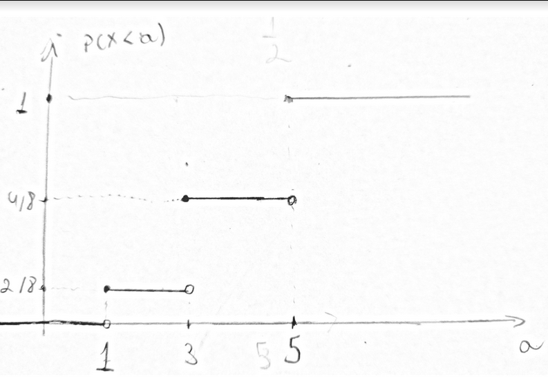
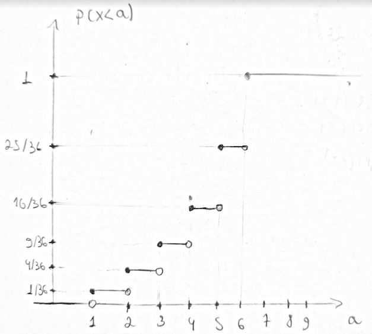
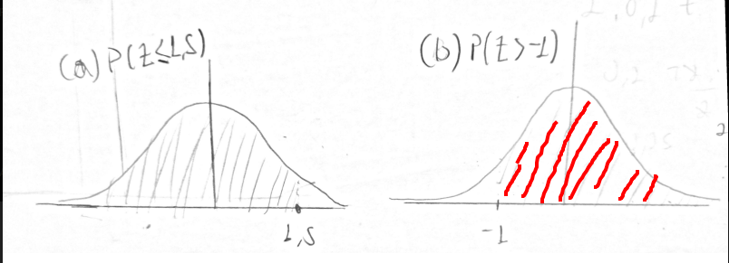

# Primeira Lista de Exercícios: Revisao de Probabilidade

## Exercícios

1. Um dado equilibrado é lançado 2 vezes e os números obtidos nos dois lançamentos são registrados. Considere os seguintes eventos aleatórios:
   - A = soma maior ou igual a 9.
   - B = soma ı́mpar.
   - C = um dos lançamentos foi 5.
   - D = o mı́nimo entre as duas faces é 4.

   - Calcule as seguinte probabilidades: P(A), P(B|C), $P(A \cap B), P(C \cup D)$
     - P(A) - Para calcular P(A) devemos calcular a probabilidade da soma do lançamento de dois dados ser maior ou igual que 9.
       - A probabilidade de ser igual a 9 é $4 \over 36$ (6, 3) (5, 4), (4, 5), (3,6)
       - A probabilidade de ser maior que 9 é a probabilidade de no primeiro e no segundo lançamento sair um número maior igual 5, ou seja, (6, 4), (6, 5), (6, 6), (4, 6), (5,6), (6, 6) que gera a probabilidade $6 \over 36$
       - Dessa forma o resultado é $4 \over 36$ + $6 \over 36$ = $10 \over 36$
     - P(B|C) - Para calcular P(B|C), devemos calcular a probabilide da soma ser impar, dado que um dos lançamentos foi 5
       - Devemos calcular $P(B \cap C) \over P(C)$, pois sabemos que, condicionalmente, o espaço amostral é C, e que um evento deste espaço é P(B $\cap$ C)
       - P(B $\cap$ C): $6 \over 36$ (5, 2), (2, 5), (5, 4), (4, 5), (6, 5), (5, 6)
       - P(C): $11 \over 36$ (5, 1), (1, 5), (5, 2), (2, 5), (5, 3), (3, 5), (5, 4), (4, 5), (5, 5), (6, 5), (5, 6)
       - Então P(B|C) = $6 \over 36$/$11 \over 36$ = $6 \over 11$
     - P(A $\cap$ D) - Devemos calcular a probabilidade de, entre a soma das faces ser 9, o mínimo entre as faces dos dados seja 4, ou seja, probabilidade dos eventos dentro de A onde 4 seja o menor resultado dentre as faces dos lançamentos
       - Sabendo que os eventos de P(A) são: (6, 3), (3, 6), (5, 4), (4, 5), (6, 4), (6, 5), (6, 6), (4, 6), (5, 6), (6, 6)
       - Os eventos válidos são: (5, 4), (4, 5), (4, 6), (6, 4)
       - Logo P(A $\cap$ D) = $4 \over 36$ = $1 \over 9$
     - P(C $\cup$ D) - Devemos calcular a probabilidade de um dos lançamentos ser 5 ou o mínimo entre duas faces ser 4
       - Devemos calcular P(C) + P(D) - P(C $\cap$ D)
       - P(D) = $5 \over 36$ (4, 4), (5, 4), (4, 5), (6, 4), (4, 6)
       - P(C) + P(D) = $11 \over 36$ + $5 \over 36$
       - P(C $\cap$ D) = $2 \over 36$ (5, 4), (4, 5)
       - Portanto, P(C $\cup$ D) = $11 \over 36$ + $5 \over 36$ - $2 \over 36$ = $14 \over 36$

2. Um exame de sangue feito por um laboratório tem eficiência de 94% para detectar uma certa doença quando ela de fato existe. Entretanto, o teste aponta um resultado falso-positivo para 1% das pessoas sadias testadas (isto é, se uma pessoa testada for saudável, então, com probabilidade 0,01, o teste indicará que a pessoa sadia tem a doença). Se 0,4% da população tem a doença, qual é a probabilidade de uma pessoa ter a doença dado que o resultado de seu exame foi positivo?
   - P = positivo, D = doente, ND = não doente
   - P(P|D) = 0.94
   - P(P|ND) = 0.01
   - P(D) = 0.004
   - P(ND) = 0.996
   - P(P) = P(P $\cap$ D) + P(P $\cap$ ND) = P(D)P(P|D) + P(ND)P(P|ND)
   - P(D|P) = $P(D \cap P)\over P(P)$ = $P(D)P(P|D)\over P(P)$ = $P(D)P(P|D)\over P(D)P(P|D) + P(ND)P(P|ND)$ = $0,004.0,94\over 0,004.0,94 + 0,996.0,01$ = $376 \over 1372$ = $\approx 27,4\%$

3. Considere três urnas com as seguintes configurações: a urna I contém 6 bolas pretas, 3 brancas e 5 vermelhas; a urna II contém 4 bolas pretas, 4 brancas e 2 vermelhas; a urna III contém 4 bolas pretas, 2 brancas e 7 vermelhas. Lança-se um dado equilibrado.  Se sair 5, uma bola da urna I é retirada; se sair 1, 4, então uma bola da urna II é retirada; se sair 2, 3 ou 6, então uma bola da urna III é retirada
   - (a) Calcule a probabilidade da bola retirada ser vermelha.
     - Devemos calcular a P(V)
     - Sabemos pelo teorema da probabilidade total que: P(V) = P(V$\cap U_{1}$) + P(V$\cap U_{2}$) + P(V$\cap U_{3}$) = P($U_{1}$)P(V|$U_{1}$) + P($U_{2}$)P(V|$U_{2}$) + P($U_{3}$)P(V|$U_{3}$)
     - Subsituindo temos: $1 \over 6$$5 \over 14$ + $1 \over 3$$1 \over 5$ + $1 \over 2$$7 \over 13$
     - Portanto, P(V) = 0.395424245 ~= 39,5% 
   - (b) Calcule a probabilidade de ter sido sorteada a urna III, sabendo-se que a bola retirada foi vermelha.
     - Queremos calcular P($U_{3}|V$)
     - Sabemos que P($U_{3}|V$) = $P(U_{3} \cap V) \over P(V)$
     - Sabemos da alternativa A que P(V) = 0.395424245, então temos: $P(U_{3} \cap V) \over 0.395424245$
     - Também $P(U_{3} \cap V)$ pode ser escrito como, $P(U_{3})P(V|U_{3})$
     - Concluimos com, $P(U_{3})P(V|U_{3}) \over 0.395424245$, e substituindo temos: ${0.269230769}\over{0.395424245}$ = 0.680865608 $\approx 68,1\%$

4. Os amigos David Gilmour, Robert Plant, Nick Manson e Jimmy Page desejam fazer um *amigo oculto* entre eles. Calcule a probabilidade de que este amigo oculto não dê errado. Obs: um amigo oculto dá errado quando uma pessoa sorteia ela mesma
   - P(E) = 1 - P(NE), Probabilidade de um amigo oculto não dar errado é 1 menos a probabilidade de dar errado
   - A cardinalidade do espaço amostral é 24, (4!)
   - P(NE) é a soma das probabilidades de cada um escolher ele mesmo
   - Evento em que todos sorteiam eles mesmos: (1,2,3,4)
   - O evento em que 3 sorteiam eles mesmos cai no anterior, pois se três itens estão em seus respectivos índices, o último também estará
   - Os evento em que 2 sorteiam eles mesmos são: (1,2,4,3), (1,4,3,2), (1,3,2,4), (4,2,3,1), (3,2,1,4), (2,1,3,4)
   - Os eventos em que 1 sorteia ele mesmo são: (1,4,2,3), (1,3,4,2), (3,2,4,1), (4,2,1,3), (4,1,3,2), (2,4,3,1), (3,1,2,4), (2,3,1,4)
   - Ou seja, a probabilidade de dar errado é a probabilidade de pelo menos um amigo sortear ele mesmo, que é a soma da probabilidade dos eventos calculados anteriormente: $8 + 6 + 1 \over 24$ = $15 \over 24$ = 0,625
   - Como a probabilidade de não dar errado é um menos a probabilidade de dar errado, temos: 1 - 0,625 = 0,375 = 37,5% do amigo secreto não dar errado

5. Luke Skywalker está na origem de uma reta. Um esboço da situação pode ser visto na Figura 1. Luke lança uma moeda honesta; se sair coroa, ele dá um passo para a esquerda (e termina na posição -1 da reta); se sair cara, ele dá um passo para a direita (e termina na posição 1 da reta). Suponha que no primeiro lançamento tenha saído cara.  Aí, agora na posição
1, ele lança novamente a moeda: se cara, um passo para a direita; se coroa um passo para a esquerda. Suponha que novamente tenha saído cara. Na posição 2 da reta ele irá jogar novamente a moeda e irá proceder da mesma forma que nos dois passos anteriores.

    (a) Yoda diz: Luke à origem só pode voltar depois de um número par de rodadas. Você concorda com Yoda? Justifique sua resposta.
     - Ao luke partir da origem, supondo que ao deslocar a direita some um e deslocar a esquerda subtraia um, ao deslocar ***n*** à direita, ele deve retornar ***n*** esquerda, totalizando ***2n*** rodadas para que o mesmo retorne à origem. Portanto ele só retornará à origem após um número par de rodadas

    (b) Luke está na origem da reta. Calcule a probabilidade dele retornar à origem depois de 4 passos.
      - Considerando a 4-upla (D,E,E,D) os 4 passos de luke e D (direita) e E (esquerda), os movimentos dele temos 2⁴ = 16 possibilidades de movimentos
      - Dentre esses queremos aqueles em que a quantidade D é igual a de E
      - Logo essa probabilidade é a probabilidade de escolher 2 posições dentro as 4 para d C(4, 2) = 4!/(2!2!) = 6
      - Logo a probabilidade dele retornar a origem é 6/16 = 3/8 = 37,5%

6. Seja X uma variável aleatória tal que
    - P(X = 1) = $2 \over 8$, P(X = 3) = $2 \over 8$ e P(X = 5) = $4 \over 8$.
    - (a) Calcule P(X < 4).
      - O resultado é: P(X = 1) + P(X = 3) = $2 \over 8$ + $2 \over 8$ = $1 \over 2$
    - (b) CalculeP(X ≥ 4).
      - O resultado é: P(X = 5) = $1 \over 2$
    - (c) Calcule a esperança e a variância de X.
      - E(X) = 1.P(X = 1) + 3.P(X = 3) + 5.P(X = 5) = $2 \over 8$ + 3$2 \over 8$ + 5$4 \over 8$ = $2 + 6 + 20 \over 8$ = $28 \over 8$ = 3,5
      - Var(X) = E(x²) - (E(X))² = 1.P(X = 1) + 9.P(X = 3) + 25.P(X = 5) - 3,5² = $2 \over 8$ + 9$2 \over 8$ + 25$4 \over 8$ = $2 + 18 + 100 \over 8$ - 3,5² = 15 - 12,25 = 2,75
    - (d) Esboce o gráfico da função de distribuição acumulada de X.
    

7. Consideremos o lançamento de dois dados equilibrados. O espaço amostral desse experimento é formado pelos pares ordenados (i, j), emque i, j= 1,2,3,4,5,6.  Suponhamos que nosso interesse esteja no máximo das faces dos dois dados, isto é, vamos considerar a variável aleatória X que é dada por:

    X = o máximo das faces dos dois dados.

    Assim, por exemplo, se o resultado do  experimento foi (2,4), teremos que o valor de X neste ponto será 4, pois

    X(2,4) = máximo{2,4}= 4.

    Análise similar nos permite afirmar que se o resultado do experimento foi (5,5), então X assumirá, neste ponto, o valor 5. Em relação a esta variável aleatória X, responda:

    (a) Quais os valores que X assume?
      - X assume os valores {1, 2, 3 ,4 ,5 ,6}, que são os valores máximos em duas faces

    (b) Para cada valor k que X assume, determine P(X = k).
      - P(1) = $1 \over 36$
      - P(2) = $3 \over 36$
      - P(3) = $5 \over 36$
      - P(4) = $7 \over 36$
      - P(5) = $9 \over 36$
      - P(6) = $11 \over 36$

    (c) Calcule P(X < 3) e P(X ≥ 3).
      - P(X < 3) = P(1) + P(2) = $4 \over 36$ = $1 \over 9$
      - P(X ≥ 3) = 1 - P(X < 3) = 1 - $4 \over 36$ = $8 \over 9$

    (d) Calcule P(X > 2|X < 5).
      - Devemos calcular $P(X > 2 \cap X < 5) \over P(X < 5)$
      - Logo, $P(3) + P(4) \over P(X < 3) + P(3) + P(4)$ = $12/36 \over 16/36$ = $12 \over 16$ = $3 \over 4$

    (e) Esboce o gráfico da função de distribuição acumulada de X.

    

8. Seja X ∼ N(7,4). Obtenha:
    - z = $X - 7 \over 2$
    - (a) P(X ≤ 10).
      - O valor é P(Z ≤ 1,5) = 0,5 + 0,4332 (tabelado) = 0,9332
    - (b) P(X > 5).
      - O valor é P(Z > -1) = 0,5 + 0,3413 (tabelado) = 0,8413

    - (c) Represente graficamente as probabilidades obtidas em (a) e (b).

      
    - (d) O valor de a tal que P(X ≤ a) = 0.04
      - 0,5 - 0,04 = 0,46, onde P(Z ≤ -1,75)
      - (-1,75).2 = a - 7, a = 3,5

9. Num teste educacional com crianças, o tempo para a realização de uma bateria de questões de raciocínio verbal e lógico é medido e anotado para ser comparado  com um modelo teórico. Este teste é utilizado  para identificar o desenvolvimento das crianças e auxiliar a aplicação de medidas corretivas. O modelo teórico considera T, tempo de teste em minutos, como uma variável aleatória contínua com função densidade de probabilidade dada por:
  $$f(t) =
    \begin{cases}
      1(t - 40)\over40, & 8 \leq t \leq 10;\\
      3\over20, & 10 \leq t \leq 15;\\
      0, & \text{caso contrário.}
    \end{cases}$$

   - (a) Esboce o gráfico de f.
    
   - (b) Prove que f é, de fato, uma função densidade.
     - Para f ser uma função densidade, devemos provar que f(t) >= 0, para todo x, e que $\int_{-\infty}^{+\infty}f(t)dt=1$
     - f(t) >= 0, para todo x. Para t < 8 e t > 15, f(t) = 0. Já para t >= 8 e t <= 15, ambas funções são positivas.
     - $\int_{-\infty}^{+\infty}f(t)dt=1$. Para f(t), $\int_{-\infty}^{+\infty}f(t)dt$ = $\int_{8}^{10}(t-4)/40dt$ + $\int_{10}^{15}3/20dt$ = 0,25 + 0,75 = 1
     - Logo, f(t) é uma função densidade
   - (c) Calcule P(1 < T ≤ 13).
     - $\int_{1}^{13}f(t)dt$ = 0 + $\int_{8}^{13}f(t)dt$ = $\int_{8}^{10}(t-4)/40dt$ + $\int_{10}^{13}3/20dt$ = 0,25 + 0,45 = 0,65
   - (d) Calcule P(10 < T ≤ 12).
     - $\int_{10}^{12}f(t)dt$ = $\int_{10}^{12}3/20dt$ = 0,3
