# Linguagens Formais e Autômatos

## __*Teoria da Linguagens Formais*__

- Originada em 1950.

- Objetivo inicial
  - Desenvolver teorias relacionadas com as linguagens naturais (representar idiomas).

- Hoje
  - Importante para lingugagens artificiais.
  - Principalmente, linguagens da Ciência da Computação.

- Tipos de Formalismos usados
  - Operacional
  - Axiomático
  - Denotacional (Extra)

### **_Operacional_**

- Autômato ou máquina abstrata
  - estados
  - instruções primitivas
  - como cada intrução modifica cada estado

- Máquina abstrata
  - suficietemente simples
    - não deve permitir dúvidas sobre o seu funcionamento
  
  - também é dito um **Formalismo Reconhecedor**
    - análise de uma entrada para verificar

  - Exemplos
    - Autômato Finito
    - Autômato com Pilha
    - Máquina de Turing

### _**Axiomático**_

- Associam-se regras às componentes da linguagem

- Regras
  - permitem afirmar o que será verdadeiro
  - após a ocorrência de cada cláusula
  - considerando oq era verdadeiro antes da ocorrência

- Formalismos axiomáticos
  - Gramáticas Regulares
  - Gramáticas Livre do Contexto
  - Gramáticas Sensíveis ao Contexto
  - Gramáticas Irrestritas

- Gramática tabmém é dita um _Formalismo Gerador_
  - permite verificar se um determinado elemento da linguagem é _gerado_

### _**Denotacional**_ (ou _Formalismo Funcional_)

- Domínio (sintático)
  - que permite a caracterização do conjunto de palavras admissíveis na linguagem
  - tratam-se de funções, as quais são, em geral, composicionais (horizontalmente)
    - o valor denotado por uma construção é especificado em termos dos valores denotados por suas subcomponentes

- Formalismo Denotacional
  - Expressões Regulares
    - é simples inferir (gerar) aos elementos da linguagem.
    - asim, frequentemente também é denominado como um Formalismo Gerador.

### _**Hierarquia de Chomsky**_

- classifica as diversas classes de linguagens em uma ordem hierárquica.
- inclusão própria entre as classes.

## **_1. Revisão de Conceitos Básicos_**

- **Conjuntos** - OK
- **Relações** - OK
- **Funções** - OK
- **Lógica** - OK
- **Técnicas de Demonstração** - OK

## _**2. Linguagens, Gramáticas e Reconhecedores**_

### _Símbolo, Caractere_

- entidades abstratas básicas
- não definida formalmente
- Exemplo: Símbolo
  - letras
  - dígitos

### *Alfabeto*

- conjunto finito de símbolos
- Exemplo: Alfabeto
  - $\Sigma_{1}$ = {a, b, c}
  - $\Sigma_{2}$ = {0, 1, ..., 9}
  - $\Sigma_{3}$ = { }

### *Palavra, Cadeia de Caracteres, Sentença*

- sobre um alfabeto (pode ser binário)
- sequência finita de símbolos justapostos (concatenados)
- Exemplo: Palavra
  - **a, abcb** são palavras sobre {a, b, c}
  - $\varepsilon$
    - palavra vazia - sem símbolos
    - é palavra sobre qualquer alfabeto

### *Tamanho, Comprimento de uma palavra*

- número de símbolos que compõem a palavra
- representação
  - | w |
  - w denota uma palavra
- Exemplo
  - | wafda | = 5
  - | $\varepsilon$ | = 0

### *Concatenação*

- operação binária em uma linguagem
- justaposição dos símbolos que representam as palavras componentes
- propriedades:
  - associatividade: w(wt) = (vw)t
  - elemento neutro (palavra vazia): $\varepsilon$**w** = **w** = **w**$\varepsilon$
- Exemplo: concatenação
  - para **v = ab** e **w = cd**
    - vw = abcd

### *Prefixo, Sufixo, Subpalavra*

- prefixo (sufixo)
  - qualquer sequência de símbolos inicial (final) de uma palavra

- subpalavra
  - qualquer sequência de símbolos contígua de uma palavra

- Exemplo: para a palavra abcb
  - prefixos: $\varepsilon$, a, ab, abc, abcb
  - sufixos: $\varepsilon$, b, cb, bcb, abcb
  - prefixos e sufixos são subpalavras

### *Concatenação Sucessiva*

- concatenação sucessiva de uma palavra com ela mesma
- indefinida para $\varepsilon$⁰
- $w^n$: concatenação sucessiva de w, por ela mesma, onde n indica o número de concatenações.
- Exemplo:
  - w³ = www
  - w¹ = w
  - a⁵ = aaaaa
  - $a^n$ = aaa...aa (a repetido n vezes)
  - w⁰ = $\varepsilon$, para w != $\varepsilon$

### *Produto de Conjunto de Palavras*

- Sejam V e W conjuntos de palavras de $\Sigma$.
  - VW = { vw / v $\in$ V e w $\in$ W }
- Exemplo:
  - $\Sigma$ = {0, 1, 2, 3}, V = {00, 11}, W = {222, 333}
  - VW = {00222, 00333, 11222, 11333}
  - VV = V² = {0000, 0011, 1100, 1111}
  - V⁰ = { $\varepsilon$ }, por definição (não é um conjunto vazio)
  - V³ = { 000000, ..., 111111 }
  - V⁴ = { 00000000, ..., 1⁸ }

### *Fechamento de Kleene*

- Seja W um conjunto de palavras sobre $\Sigma$
- W* = $\cup_{i \geq 0 }$($W^i$)
- W* = W⁰ $\cup$ W¹ $\cup$ W² $\cup$ W³ ...
- Conjunto de todas as concateanções possíveis de W, incluindo $\varepsilon$
- Exemplos:
  - V = {00, 11}, V* = { $\varepsilon$, 00, 11, 0000, 0011, 1100, 1111, 000000, ... }
  - $\Sigma$ = {0, 1}, $\Sigma$* = { $\varepsilon$, 0, 1, 00, 01, 10, 11, ... }

### *Fechamento Positivo*

- Seja W um conjunto de palavras sobre $\Sigma$,
- $W^+$ = $\cup_{i \geq 1} W^i \rArr$ igual a $W^*$, exceto $\varepsilon$.
- $W^+$ = W¹ $\cup$ W² $\cup$ W³ ...
- Conjunto de todas as concatenações possíveis de W, excluindo $\varepsilon$
  - _Note que W⁰ = {$\varepsilon$} não está incluso, mas se, $\varepsilon \in W \rArr \varepsilon \in W^+$_
- Exemplos: 
- V = {00, 11}, $V^+$ = {00, 11, 0000, 0011, 1100, 1111, ...}
- $\Sigma$ = {0, 1}, $\Sigma^+$ = {0, 1,00, 11, 01, 10, 0000, ...}
  
### *Linguagem Formal*

- Uma linguagem L é um conjunto de palavras sbore um alfabeto $\Sigma$, ou seja, L $\subset \Sigma^*$
- Exemplo: Ling. Formal sobre $\Sigma$ = {a, b}
  - conjunto vazio
  - conjunto formado pela palavra vazia
    - note-se que {} $\neq$ {$\varepsilon$}
  - conjunto das palíndromos
    - palavras que têm a mesma leitura da esquerda para a direita e vice-versa
    - linguagem infinita
    - $\varepsilon$, a, b, aa, bb, aaa, aba, bab, bbb, aaaa, ... são palíndromos

### **Como representar uma linguagem formal L?**

- Se L é finito, basta listar todas as palavras.
- se L é infinito, existem 2 formalismos principais:
  - _Formalismo Gerador: Gramática_
  - _Formalismo Reconhecedor: Autômato_
  
### *Gramática*

- G = (V, T, P, S):
- V (símbolos **V**ariáveis - não-terminais)
  - conjunto finito de símbolos
  - variáveis ou não-terminais
- T (símbolos **T**erminais)
  - conjunto finito de símbolos
  - terminais
  - disjunto de V
- P
  - conjunto finito de pares ($\alpha$, $\beta$)
  - regra de produção
  - $\alpha$ é a palavra de (V $\cup$ T)$^+$
  - $\beta$ é a **palavra** de (V $\cup$ T)$^*$
- S
  - elemento de V
  - variável inicial
- Notação de ($\alpha$, $\beta$)
  - $\alpha \rArr \beta$
  - notação abreviada para $\alpha \rArr \beta_{1}, ..., \alpha \rArr \beta_{n}$
    - $\alpha \beta_{1} | ... | \beta_{n}$

### *Derivação*

- G = (V, T, P, S) uma gramática
- _Derivação_ é um par da relação denotada por $\rArr$
  - com domínio em (V $\cup$ U)$^+$
  - contra-domínio em (V $\cup$ U)$^*$
  - representação de forma infixada
    - $\alpha \rArr \beta$
- $\rArr$ é indutivamente definida
- para qualquer produção S $\rArr \beta$
  - S é o símbolo inicial 
- para qualquer par $\alpha \rArr \beta$
  - onde $\beta = \beta_{u}\beta_{v}\beta_{w}$
  - se $\beta_{v} \rArr \beta_{t}$ é regra de P então
    - $\beta \rArr \beta_{u}\beta_{t}\beta_{w}$

### *Sucessivos Passos de Derivações*

- $\rArr^*$
  - fecho transitivo e reflexivo da relação $\rArr$
  - zero ou mais passos de derivações sucessivos
- $\rArr^+$
  - fecho transitivo da relação $\rArr$
  - zero ou mais passos de derivações sucessivos
- $\rArr^i$
  - exatos **i** passos de derivações sucessivos
  - **i** é número natural

### *Gramática é um formalismo*

- Axiomático
- de Geração
  - permite derivar ("gerar") todas as palavras da linguagem que representa

### *Linguagem Gerada*

- G = (V, T, P, S) uma gramática
- Linguagem Gerada por G
  - L(G) ou GERA(G)
- todas as palavras de símbolos terminais deriváveis a partir do símbolo inicial S
  - $L(G) = {W \in T^* | S \rArr^+ w}$

### *Exemplo: números naturais*

- G = (V, T, P, S)
  - V = {S, D}
  - T = {0, 1, 2, ..., 9}
  - P = {S $\rArr$ D, S $\rArr$ DS, D $\rArr$ 0|1|...}
- uma derivação do número
  - S => DS => 2S => 2DS => 24S => 24D => 243
- portanto
  - S $\rArr^*$ 243
  - S $\rArr^+$ 243
  - S $\rArr^6$ 243
- logo GERA(G)
  - o conjunto dos números naturais
  
### *Equivalência de Gramáticas*

- $G_{1}$ e $G_{2}$ são equivalentes se
  - GERA($G_{1}$) = GERA($G_{2}$)

### *Convenções:*

- A, B, C, ..., S, T símbolos variáveis
- a, b, c, ..., s, t símbolos terminais
- u, v, w, x, y, z   palavras de símbolos terminais
- $\alpha$, $\beta$, ... palavras de símbolos variáveis e/ou terminais

### *Hierarquia de Chomsky*

- Define 4 tipos de gramática:
  - Gramática tipo 3 (regular)
  - Gramática tipo 2 (livre de contexto)
  - Gramática tipo 1 (sensíveis ao contexto)
  - Gramática tipo 0 (irrestrita)
  
  

### *Gramática tipo 3 (regular)*

- G(V, T, P, S) é do tipo 3, se toda produção em P é da forma:
  - A => wB ou A => Bw ou A => w com A $\in$ V, B $\in$ V e w $\in$ T$^*$, ou seja:
    - Uma variável na esquerda e no máximo uma variável à direita (a variável a direita não pode ser precedida e sucedida ao mesmo tempo por terminais)
- Ex1. Seja G1 = (V, T, P, S) com:
  - V = {S, A, B}
  - T = {a, b}
  - P = {S => aA, A => bB|$\varepsilon$, B => aA}
  - Derivações
    - S => aA => a ou S $\rArr^2$ ou S $\rArr^*$ a ou S $\rArr^+$ a 
    - S => aA => abB => abaA => aba
  - Linguagem Gerada
    - L(G1) = {a, aba, ababa, abababa, ...}
    - L(G1) = {w $\in$ {a, b}$^*$ | w tem prefixo "a" seguido de 0 ou mais ba's}
  - Hierarquia: Tipo 3 ou Regular

- Ex2. Seja G2 = (V, T, P, S) com:
  - V = {S}
  - T = {a, b}
  - P = {S => Sba | a}
  - Derivações
    - S => a
    - S => Sba => Sbaba => Sbababa => abababa
    - S => Sba => aba
  - Linguagem Gerada
    - L(G2) = {a, aba, ababa, abababa, ...}
    - L(G2) = {w $\in$ {a, b}$^*$ | w tem prefixo "a" seguido de 0 ou mais ba's}
  - Portanto, a gramática do ex2 gera a exatamente a mesma linguagem da gramática do ex1 (são linguagens equivalentes pela definição de _Equivalência de Gramáticas_)
  - Hierarquia: Tipo 3 ou Regular

### *Gramática tipo 2 (livre de contexto)*

- G(V, T, P, S) é do tipo 2, se toda produção em P é da forma:
  - A => $\alpha$,  com A $\in$ V e $\alpha$ $\in$ (V $\cup$ T)*, ou seja:
    - basta uma variável na esquerda
- Ex3. Seja G3 = (V, T, P, S) com:
  - V = {S, B}
  - T = {0, 1}
  - P = {S -> 0B | OSB, B -> 1}
  - Derivações
    - S => 0B => 1
    - S => 0SB => 00BB => 001B => 0011
  - Linguagem Gerada
    - L(G3) = {01, 0011, 000111, ..., 0¹⁰⁰1¹⁰⁰}
    - L(G3) = {w $\in$ {0, 1}* | w possui N 0's concatenados com N 1's, para N >= 1}
    - L(G3) = {w $\in$ {0, 1}* | w = $0^n1^n$, N >= 1}
  - Hierarquia: Tipo 2 ou Livre de Contexto
- Ex4. Seja G4 = (V, T, P, S) com:
  - V = {S, V, U}
  - T = {0, 1}
  - P = {S -> $\varepsilon$ | Z | U | 0SZ | 1SU, Z -> 0, U -> 1}
  - Derivações
    - S => $\varepsilon$
    - S => Z => 0
    - S => U => 1
    - S => 0SZ => 01SUZ => 01UUZ => 01110
  - Linguagem Gerada
    - L(G4) = {$\varepsilon$, 0, 1, 00, 11, 000, 010, 101, 111, 0000, 0110, 1001, 1111, ....}
    - L(G4) = {w $\in$ {0, 1}* | w é uma palíndrome}
  - Hierarquia: Tipo 2 ou Livre de Contexto
- Ex5. Seja G5 = (V, T, P, E) com:
  - V = {E}
  - T = {+, *, (,), x}
  - P = {E => E+E | E*E | (E) | x}
  - Derivações
    - E => x
    - E => (E) => (x)
    - E => E + E => x + x
    - E => E * E => x * x
    - E => E + E => (E) + x => (x) + x
  - Linguagem Gerada
    - L(G5) = {x, (x), x + x, x * x, (x) + x, ...}
    - L(G5) = { w $\in$ {+, *, (,), x}⁺ | w é um polinômio de grau n > 0 sem termos constantes, na variável x }
  - Hierarquia:
    - Tipo 2 ou Livre de Contexto (pois nas produções, na esquerda da seta se tem uma variável, e do lado direito se tem combinação de variáveis e terminais)
    - Não é regular, possui mais de uma variável a esquerda de outra na produção

### *Gramática tipo 1 (sensíveis ao contexto)*

- G(V, T, P, S) é do tipo 1, se P é da forma:
  - S -> $\varepsilon$ ou $\alpha$ -> $\beta$, com $|\beta| \geq |\alpha|, \alpha \in (V \cup T)^+$ e $\beta \in (V \cup T)^*$
  - Existe uma forma normal dessa gramática, de onde deriva o nome da mesma, onde P é da forma:
    - S -> $\varepsilon$ ou
    - $\alpha A \phi$ -> $\alpha \beta \phi$, sendo $\alpha \in (V \cup T)^+$, $\phi \in (V \cup T)^*$ e $\beta \in (V \cup T)^*$
    - Dizemos que a variável A é substituida por $\beta$, no contexto $\alpha A \phi$
- Ex6. Seja G6 = (V, T, P, S) com:
  - V = {S, X, Y, A, B, C, D, E, F}
  - T = {a, b}
  - P = {S -> XY | aa | bb | $\varepsilon$, X -> XaA | XbB | aaC | abD | baE | bbF, Aa -> aA, Ab -> bA, AY -> Ya, Ba -> aB, Bb -> bB, BY -> Yb, Ca -> aC, Cb -> bC, CY -> aa, Da -> aD, Db -> bD, DY -> ab, Ea -> aE, Eb -> bE, EY -> ba, Fa -> aF, Fb -> bF, FY -> bb}
  - Derivações
    - S => aa
    - S => bb
    - S => $\varepsilon$
    - S => XY => aaCY => aaaa
    - S => XY => abDY => abab
    - S => XY => XbBY => XbYb => XbBbYb => XbbBYb => XbbYbb => abDbbYbb => abbDbYbb => abbbDYbb => abbbabbb
  - Linguagem Gerada
    - L(G6) = {$\varepsilon$, aa, bb, aaaa, abab, baba, bbbb, aaaaaa, bbbbbb, ...}
    - L(G6) = { w $\in$ {a, b}* | w é uma repetição dela mesma (ww)}
  - Hierarquia: Tipo 1 ou Sensível ao Contexto
    - Não é do tipo 2 e nem do tipo 3, porque possui terminais além de variáveis na esquerda, o que não é permitido

### *Gramática tipo 0 (irrestrita)*

- G(V, T, P, S) é uma gramática sem nenhuma restrição adicional em P, apenas:
  - $\alpha$ -> $\beta$, sendo $\alpha \in (V \cup T)^+$ e $\beta \in (V \cup T)^*$, conforme vimos na definição geral da gramática
- Ex8. Seja G8 = (V, T, P, S) com:
  - V = {S, A, B, C, D, E}
  - T = {a}
  - P = {S -> ACaB, Ca -> aaC, CB -> DB | E, aD -> Da, AD -> AC, aE -> Ea, AE -> $\varepsilon$}
  - Derivações
    - S => ACaB => AaaCB => AaaE => AaEa => AEaa => aa
    - S => ACaB => AaaCB => AaaDB => AaDaB => ADaaB => ACaaB => AaaCaB => AaaaaCB => AaaaaE => AaaaEa => AaaEaa => AaEaaa => AEaaaa => aaaa
    - S => ACaB => AaaCB => AaaDB => AaDaB => ADaaB => ACaaB => AaaCaB => AaaaaCB => AaaaaDB => AaaaDaB => AaaDaaB => AaDaaaB => ADaaaaB => ACaaaaB => AaaCaaaB => AaaaaCaaB => AaaaaaaCaB => AaaaaaaaaCB => AaaaaaaaaE => AaaaaaaaaE =>* aaaaaaaa
    - S => ACaB => AaaCB => AaaDB => AaDaB => ADaaB => ACaaB => AaaCaB => AaaaaCB => AaaaaDB => AaaaDaB => AaaDaaB => AaDaaaB => ADaaaaB => ACaaaaB => AaaCaaaB => AaaaaCaaB => AaaaaaaCaB => AaaaaaaaaCB => AaaaaaaaaDB =>* aaaaaaaaaaaaaaaa
    - S =>* aaaaaaaaaaaaaaaaaaaaaaaaaaaaaaaa
  - Linguagem Gerada
    - L(G8) = {aa, aaaa, aaaaaaaa, aaaaaaaaaaaaaaaa, aaaaaaaaaaaaaaaaaaaaaaaaaaaaaaaa, ...}
    - L(G8) = { w $\in$ {a}$^+$ | w = a$^{2^n}$, n > 0 }
    - Como fazer w = a$^{3^n}$?
      - Seja G9 = (V, T, P, S) com:
      - V = {S, A, B, C, D, E}
      - T = {a}
      - P = {S -> ACaB, Ca -> aaaC, CB -> DB | E, aD -> Da
  - Hierarquia: Tipo 0 ou Irrestrita
    - Não é regular, pois possui duas variáveis na esquerda de uma regras de produção
    - Também não é livre de contexto, pois possui mais de uma variável na regra de produção em sua esquerda

## _**3. Linguagens Regulares, Autômatos Finitos e Gramáticas Regulares**_

### Linguagens Regulares ou Tipo 3

- estudos e aplicações são variados e abrangentes
- exemplos
  - editores de texto
  - processadores de texto em geral
  - pesquisa de dados
  - interface simples homem X máquina
  - protocolos de comunicação
  - lógica
  - ...
- formalismos operacionais ou reconhecedores
  - Autômato Finito Determinístico
  - Autômato Finito Não-Determinístico
  - Autômato Finito com Movimentos Vazio
- formalismo axiomático ou gerador
  - Gramática Regular
- formalismo denotacional
  - Expressão Regular
  - também considerado formalismo gerador

### Sistema de Estados Finitos

- É um modelo matemático de sistema com entradas e saídas discretas
- Pode assumir um número finito e pré definido de estados
- Cada estado resume somente as informações do passado necessárias para determinar as ações da próxima entrada
- Ex: Elevador
  - entrado
    - requisições pendentes
  - estado
    - andar corrente
    - direção de movimento
  - não memoriza as requisições anteriores

### Autômato Finito (Determinístico) - Def.1

- É uma máquina reconhecedora composta de:
  - Fita de Entrada
  - Unidade de Controle
  - Programa ou Função de Transição de Estados
  - Obs: o Autômato Finito não possui memória auxiliar. As informações do passado são armazenadas através dos estados
  
    
  - Fita de Entrada:
    - finita  dividida em células, sendo que cada célula armazana um símbolo. Não é possível gravar.
  - Unidade de Controle
    - armazena o estado corrente (dentre um número finito de estados);
    - possui cabeça de leitura (não grava) que acessa cada célula da fita, lê o símbolo e movimenta-se exclusivamente à DIREITA;
    - no início a cabeça é posicionada no primeiro símbolo
  - Programa ou Função de Transição de Estados
    - função que comanda a leitura e define o estado corrente
    - função parcial que define o novo estado do autômato a partir do estado corrente e do símbolo lido na fita
- Exemplo:

  
  - Reconhece todas as palavras binárias que possuem pelo menos um '1'

### Autômato Finito (Determinístico) - Def.2

- Um Autômato Finito é uma 5-upla:
  - A = (Q, $\Sigma$, $\sigma$, q0, F)
  - Q -> conjunto finito de estados
  - $\Sigma$ -> alfabeto (símbolos da fita): $\Sigma \cap Q = \empty$
  - q0 -> estado inicial
  - $\sigma$ -> função de transição de estado: Q x $\Sigma$ -> Q
  - F -> conjuntos de estados finais (aceitação): F $\subseteq$ Q

- Função de Transição de Estados ou Programa ($\sigma$)
  - Para todos estados possíveis do autômato (q $\in$ q), a função deve definir qual será o próximo estado do autômato (q' $\in$ Q), quando for lido qualquer símbolo na fita (a $\in \Sigma$)
  - A função $\sigma$ é dada por uma lista de transições de tipo:
    - $\sigma$(q, a) = q',
  - ou seja, O autômato finito estando no estado *q* e lendo o símbolo *a* na fita de entrada, move a cabeça para a direita e vai para o estado *q'*
  - Exemplo anterior:
    - A = (Q, $\Sigma$, $\sigma$, q0, F)
    - Q = {q0, q1}
    - $\Sigma$ = {0, 1}
    - F = {q1}
    - $\sigma$: $\sigma$(q0, 0) = q0, $\sigma$(q0, 1) = q1, $\sigma$(q1, 0) = q1, $\sigma$(q1, 1) = q1

    
    
    
- Processamento
  - sucessiva aplicação da função programa
    - para cada símbolo da entrada
    - da esquerda para a direita
    - até parar
  - definição formal do comportamento
    - necessário estender a função programa
  - argumento da função programa estendida
    - um estado
    - uma palavra
- Função de Transição de Estados Estendida ($\underline{\sigma}$)
  - A função $\underline{\sigma}$ é uma função $\underline{\sigma}$: Q x $\Sigma^*$ -> Q
  - É a função $\sigma$ estendida para palavras e é definida por:
    - $\underline{\sigma}$(q, $\varepsilon$) = q
    - $\underline{\sigma}$(q, aw) = $\underline{\sigma}(\sigma(q, a), aw)$, sendo w $\in \Sigma, a \in .\Sigma$ 
  - Para as palavras w $\in \Sigma^*$: $\underline{\sigma}$(q, w) = q'
    - O Autômato Finito no estado *q* após ler todos os símbolos e w (da esquerda para a direita) vai para o estado q'
- Palavra aceita por um Autômato Finito
  - Seja A = (Q, $\Sigma$, $\sigma$, q0, F) e w $\in \Sigma^*$. A palavra w é aceita por A se $\underline{\sigma}$(q0, w) $\in$ F. Se o Autômato Finito A, partindo do estado inicial q0, após ler todos os símbolos de w, for para um estado final q(q $\in$ F), então a palavra w é aceita por A
  - Condição de Parada de um Autômato Finito
    - Uma Autômato Finito sempre para ao processar qualquer entrada, aceitando ou rejeitando w
    - W é aceita: se após procesar o último símbolo, o AF, para em um estado final
    - W é rejeitada: se após processar o último símbolo, o AF para em um estado não final ou a função $\sigma$ é indefinida para o argumento (estado, símbolo)

  
- Linguagem Reconhecida (ou aceita) por um Autômato Finito
  - Seja A = (Q, $\Sigma$, $\sigma$, q0, F) um autômato finito. A linguagem reconhecida por A é dada por:
    - L(A) = {w $\in \Sigma^*$ | $\underline{\sigma}$(q0, w) $\in$ F}
  - L(A) é o conjunto de todas as palavras pertencentes a $\Sigma^*$ e aceitas por A

## _**4. Autômato Finito Não Determinístico**_

### Não Determinismo

- É uma importante generalização dos modelos de máquinas abstratas, na Teoria da Computação
- Numa transição não determinista, partindo-se de um estado q1, lendo-se um símbolo a, e possível ir para um ou mais estados. Por exemplo: $\sigma$(q1, a) = {q1, q2}
- Nem sempre o não-determinismo aumenta o poder de reconhecimento de uma classe de autômatos. Por exemplo, o Autômato Finito Não Determininístico tem poder de reconhecimento equivalente ao Autômato Finito Determinístico

### Autômato Finito Não Determinístico - Def1

- Uma AFND é um Autômato Finito, onde são permitidas transições não determinísticas
- Uma palavra e aceita no AFND se exite alguma sequência de transições, processando a palavra símbolo a símbolo, que leve do estado inicial a um estado final
- Na representação de máquina abstrata de reconhecimento (fita de entrada + unidade de controle finito), o AFND assume um conjunto de estados alternativos, como se houvesse uma multiplicação de unidades de conteol com processamento independente

### Autômato Finito Não Determinístico - Def2

- Um autômato finito é uma 5-upla:
  - A = (Q, $\Sigma$, $\sigma$, q0, F)
  - Q -> conjunto finito de estados
  - $\Sigma$ -> alfabeto (símbolos da fita): $\Sigma \cap Q = \empty$
  - q0 -> estado inicial
  - $\sigma$ -> função de transição de estado: Q x $\Sigma$ -> 2$^q$, onde 2$^q$ é o conjunto potência de Q (todos os subconjuntos)
  - F -> conjuntos de estados finais (aceitação): F $\subseteq$ Q
- Função de Transição de Estados ($\sigma$) (AFND) 
  - Para todos estados possíveis do (AFND) (q $\in$ Q), a função deve definir quais serão os possíveis estados do autômato ({q1, q2, ...} $\subset$ Q), quando for lido qualquer símbolo na fita (a $\in \Sigma$)
  - A função $\sigma$ é dada por uma lista de transições de tipo:
    - $\sigma$(q, a) = {q1, q2, ..., qn},
  - ou seja, O AFND estando no estado *q* e lendo o símbolo *a* na fita de entrada, escolhe um dos estados q*i*(1 <= i <= N) como novo estado

- Exemplo 1
  
  - L = {w $\in$ {a,b}* | "aa" ou "bb" é subpalara de w}
  - Palavras que possuem 'aa' ou 'bb' como subpalavra

- Exemplo 2
- M6 = ({a,b}, {q0,q1,q2,qf}, $\Sigma_{6}$, q0, {qf})
  
  
- Linguagem reconhecida e aceita por esse AF
- L = {w $\in$ {a,b}* | "aaa" é sufixo de w}
- Exemplos

  
  
- Quando a palavra é aceita, basta apresentar o caminho no qual o processamento leva a um estado final
- Caso uma palavra não for aceita, deve-se mostrar todos os caminhos e mostrar que seus estados finais não pertencem a um estado de aceitação
- Processamento
  - uniao dos resultados da funçao programa aplicada a cada estado alternatio
  - definiçao formal do comportamento
    - necessário estender a função programa
    - argumento: um conjunto finito de estados e uma palara
  - w $\in$ ACEITA(M)
    - pelo menos um caminho alternativo aceita w
  - w $\in$ REJEITA(M)
    - todas as alternatias rejeitam w
- Funçao de Transição Estendida (AFND)
  - Seja A = (Q, $\Sigma$, $\sigma$, q0, F) um AFND
  - A funçao $\sigma$ estendida $\underline{\sigma}$: 2$^q$ estendida para palavra é assim definida:
    - $\underline{\sigma}$(q, $\varepsilon$) = {q}
    - $\underline{\sigma}$(q, aw) = $\underline{\sigma}(\sigma(q, a), w)$
    - $\underline{\sigma}$(S, w) = $\cup_{q \in S}$ $\underline{\sigma}(q, w)$
  - sendo:
    - q $\in$ Q (estado)
    - S $\subset$ Q (subconjunto de estados)
    - a $\in \Sigma$ (símbolo)
    - w $\in \Sigma$* (palavra)
- Palavra aceita por um AFND
  - Seja w $\in \Sigma$* e o AFND A = (Q, $\Sigma$, $\sigma$, q0, F)
  - A palavra w é aceita por A se $\underline{\sigma}$(q0, w) $\cap$ != $\empty$,
  - ou seja: se existe algum estado final $\underline{\sigma}$(q0, w)
- Linguagem aceita por um AFND
  - A linguagem aceita por A é definida por:
    - L(A) = {w $\in \Sigma$* | $\underline{\sigma}$(q0, w) $\cap$ != $\empty$}
- Determinismo x Não-Determinismo
  - não-determinismo aparentemente trás um significativo acréscimo ao poder computacional de um AF
  - na realidade não aumenta o poder computacional
  - para cada AFN, é possível construir um AFD equivalente (que realiza o mesmo processamento)
    - o contrário também é verdadeiro
- Equivaência dentre AFD e AFND
  - Seja L(A) a linguagem aceita por um AFND A
  - Existe um AFD A' que também aceita L(A)
  - Seja AFND A = (Q, $\Sigma$, $\sigma$, q0, F)
  - O AFD A' equivalente a A é dado por A' = (Q', $\Sigma$, $\sigma$', q0', F'), sendo:
    - Q' = 2$^Q$. Elementos de Q' do tipo {q1, q2, ..., qk}, sendo qi(i = 1, 2, ..., k) $\in$ Q, representados por \<Q1Q2 ... QK>
    - F' -> estados de Q' que contém pelo menos q estado de F
    - Q0' = {q0}, representado por \<q0>
    - $\sigma'$(\<q1q2...qj>, a) = \<r1r2...ri> se e somente se, $\sigma$({q1, q2, ... qj}, a) = $\sigma(q1, a) \cup \sigma(q2, a) \cup ... \cup \sigma(qj, a) = $ {r1, r2, ..., ri}

- Exemplo de conversão AFND -> AFD

  
- Grafo do AFD

  
- Simplificando e comparando com a solução proposta anteriormente nos AFDs
  
  

## _**5. Autômato Finito Não Determinístico com Movimentos Vazios (AF$\varepsilon$)**_

### Transição Vazia (ou Movimento Vazio)

- É uma transição sem leitura na fita de entrada
- Não aumenta o poder de reconhecimento dos AFs
- Na visão de máquina reconhecedora, é como se o controle finito mudasse de estado sem mover a cabeça de leitura

  

### Autômato Finito Não Determinístico com Movimentos Vazios (AF$\varepsilon$)

- O AFND com transições vazias (AF$\varepsilon$) é uma 5-upla A = (Q, $\Sigma$, $\sigma$, q0, F), com Q, $\Sigma$, q0 e F definidos como no AFND
- A função $\sigma$ é dada por: $\sigma$ Q x ($\Sigma \cup$ {$\varepsilon$}) -> 2$^Q$
- A função $\sigma$ para transições vazias é do tipo: $\sigma$(q, $\varepsilon$) = {q1, q2, ..., qn}
  - o AF$\varepsilon$ no estado q e sem ler nenhum símbolo na fita de entrada, escolhe um dos qi (i =1, 2, ..., 3) para seu próximo estado
  - A função $\sigma$ para outras transições com leitura de símbolo é igual ao AFND: $\sigma$(q, a) = {q1, q2, ..., qn}
- Exemplo

  
  
- Processamento (semântica)
  - análogo ao de um AFN
  - processamento de uma transição vazia
    - também é não-determinista
    - assume simultaneamente os estados destino e origem
    - origem de uma transição vazia sempre é um caminho alternativo
- Processamento (formal)
  - função programa estendida
    - conjunto de estados
    - palavra
    - baseado na noção de fecho vazio

### Função Fecho Vazio ($F_{\varepsilon}$)

- Seja AF$\varepsilon$ A = (Q, $\Sigma$, $\sigma$, q0, F). A função F$\varepsilon$ Q -> 2$^Q$ é definida indutivamente:
  - $F_{\varepsilon}$(q) = {q}, se $\sigma$(q, $\varepsilon$) = { }
  - $F_{\varepsilon}$(q) = {q} $\cup (\cup_{p \in \sigma(q, \varepsilon)} F_{\varepsilon}(p))$, se $\sigma$(q, $\varepsilon$), caso contrário
- Informalmente:
  - Se q é um estado de Q, $F_{\varepsilon}$(P) é o conjunto de estados que se pode atingir a partir de q, utilizando apenas transições $\varepsilon$, incluindo-se o próprio estado q

### Função Fecho Vazio Estendida ($F_{\varepsilon}$)

- Seja o AF$\varepsilon$ A = (Q, $Sigma$, $\sigma$, q0, F), a função $\underline{F}_{\varepsilon}$: 2$^Q$ -> 2$^Q$ é assim definida:
  - $\forall P \subset Q \underline{F}_{\varepsilon}(P) = \cup_{q \in P} F_{\varepsilon}(q)$
  - Ou seja, se P = {q1, q2, ...}:
    - $\underline{F}_{\varepsilon}(P) = F_{\varepsilon}(q_{1}) \cup F_{\varepsilon}(q_{2}) \cup ...$
- Exemplo
  
  

### Função Programa Estendida de um $AF_{\varepsilon} (\underline{\sigma})$

- Seja o $AF_{\varepsilon}$ A = (Q, $\Sigma$, $\sigma$, q0, F). A função $\sigma$ estendida para um conjunto de estados e uma palvra e é dada por:
  - $\underline{\sigma}$(P, $\varepsilon$) = $\underline{F}_{\varepsilon}$(P)
  - $\underline{\sigma}$(P, wa) = $\underline{F}_{\varepsilon}$(R), onde R = {r | r $\in \sigma$(s, a) e s $\in \underline{\sigma}$(P, w)}
- Exemplo:

  

### Equivalência entre AFND e $AF_{\varepsilon}$

- uma linguagem é regular se é aceita por um $AF_{\varepsilon}$
- a capacidade de reconhecimento dos $AF_{\varepsilon}$ é a mesma de AFD e dos AFN
- seja M = ($\Sigma$, Q, $\sigma$, q0, F) um $AF_{\varepsilon}$ qualquer
- seja M' = ($\Sigma$, Q, $\sigma$', q0, F') um AFN
- $\sigma$'
  - $\sigma$': Q x $\Sigma$ -> 2$^Q$
  - $\sigma$'(q, a) = $\underline{\sigma}$({q}, a)
- F'
  - conjunto de todos q $\in$ Q tq
  - algum elemento do $F_{\varepsilon}$(q) pertence a F

- Exemplo:

  

## _**6. Expressão Regular - Formalismo Denotacional das Linguagens Regulares**_

### Expressão Regular

- toda LR pode ser descrita por uma
  - Expressão Regular
- formalismo
  - simples
  - denotacional (gerador)
- definida a partir de
  - conjuntos (linguagens) básicos
  - operação de concatenação
  - operação de união
- são adequadas para a comunicação
  - homem x homem
  - homem x máquina
- Exemplos
  - aa
  - ba*
  - (a + b)*
  - (a + b)\*aa(a + b)\*
  - a\*ba\*ba\*
  - (a + b)*(aa + bb)
  - (a + $\varepsilon$)(b + ba)*

### Definição de Expressão Regular

- sobre um alfabeto $\Sigma$
- indutivamente definida
  - $\empty$ é ER e denota a linguagem vazia
  - $\varepsilon$ é ER e denotada a linguagem {$\varepsilon$}
  - x é ER onde x $\in \Sigma$ e denota a linguagem {x}
  - ser r e s são ER e donotam as linguagens R e S, então:
    - (r + s) é ER e denota R $\cup$ S
    - (rs) é ER e denota RS
    - (r*) é ER e denota R*

#### Precedência entre Operadores

- concatenação sucessiva tem precedência sobre
  - concatenação
  - união
- concatenação tem precedência sobre
  - união
- Linguagem Gerada
  - por uma ER r
  - é representada por L(r) ou GERA(r)

  

### As ER denotam exatamente as LR

- Teorema
  - Se r é uma Er
  - então GERA(r) é uma LR
- Prova
  - L é LR se somente se é possível construir um
    - AF(AFD, AFN ou AF$_{\varepsilon}$), que reconheça L
  - portanto, é necessário mostrar que,
    - dado uma ER r qualquer
    - é possível construir um AF m tal que
    - ACEITA(M) = GERA(r)
  - demonstração de que ACEITA(M) = GERA(r)
    - indução no número de operadores
  - é assumido que qualquer AF
    - pode ser simulado por um AF com exatamente um estado final
- Base (ER com zero operadores)
  - Se r tem zero operadores, etnão é da forma:
    - r = $\empty$
    - r = $\varepsilon$
    - r = x (x $\in \Sigma$)
  - r = $\empty$. M1 = ($\empty$, {q0}, $\sigma_{1}$, q0, $\empty$)

    
  - r = $\varepsilon$. M2 = ($\empty$, {qf}, $\sigma_{2}$, qf, {qf})
  
    
  - r = x. M3 = ({x}, {q0, qf}, $\sigma_{3}$, q0, {qf})

    
- Hipótese (ER com até n > 0 operadores)
  - suponha que aé possível construir um autômato finito que aceita a linguagem Gera(r)
- Indução (ER com n + 1 operadores)
  - se r possui n + 1 operadores, então a ER pode ser representada por (r1 e r2 possuem ocnjuntamente no máximo n operadores)
    - r = r1 + r2

      
    - r = r1r2

      

    - r = r1*

      

  - por hipótese de indução existem
    - M1 = ($\Sigma_{1}$, Q1, $\sigma_{1}$, q01, {qf1}) tal que L(M1) = GERA(r1)
    - M2 = ($\Sigma_{2}$, Q2, $\sigma_{2}$, q02, {qf2}) tal que L(M2) = GERA(r2)
- Exemplo - Construir o AF que é equivalente à ER acima
  - a*(aa + bb)

    

## *Gramática Regular*

- G(V, T, P, S) é Regular, se toda produção em P é da forma:
  - A => wB ou A => Bw ou A => w com A $\in$ V, B $\in$ V e w $\in$ T$^*$, ou seja:
    - Uma variável na esquerda e no máximo uma variável à direita (a variável a direita não pode ser precedida e sucedida ao mesmo tempo por terminais)

### Gramática Linear

- Seja G = (V, T, P, S) uma gramática e
  - sejam A, B $\in$ V (variáveis)
  - w $\in$ T* (palavras de símbolos terminais)
  - Então G é
- Gramática Linear à Direita (GLD)
  - A -> wB ou
  - B -> w
- Gramática Linear à Esquerda (GLE)
  - A -> Bw ou
  - A -> W
- Gramática Linear Unitária à Direita (GLUD)
  - como na linear à direita
  - adicionalmente, |w| <= 1
- Gramática Linear Unitária à Esquerda (GLUE)
  - como na linear à esquerda
  - adicionalmente, |w| <= 1
- Exemplo

  

### Equivalência Gramática Regular (GLUD) e AF(AF$_{\varepsilon}$)

- suponha G = (V, T, P, S) uma GLUD
- seja AF$_{\varepsilon}$M = (R, Q, $\sigma$, F) tal que
  - R = T
  - Q = V U {qf}
  - F = {qf}
  - q0 = S
  - $\sigma$ é como segue

    
- Exemplo

  

### Equivalência AF (AFD) e Gramática Regular (GLUD)

- Suponha AFD M = ($\Sigma$, Q, $\sigma$, q0, F) tal que ACEITA(M) = G
- Seja G = (V, T, P, S) uma GLUD tal que
  - V = Q U {S}
  - T = R
  - P é tal que (suponha qi, qk $\in$ Q, a $\in$ R e qf $\in$ F)

    
- Exemplo

  

## *Minimização de Autômatos Finitos Determinísticos*

- Objetivo
  - gerar um AF equivalente
  - com o menor número de estados possível
- O autômato mínimo é único
  - a minimização de AF distintos
    - que aceitam a mesma linguagem
    - geram o mesmo AF mínimo
- Idéia básica do algoritmo
  - unificar os estados equivalentes

### Estados Equivalentes

- q e p são equivalente se e somente se:
  - para qualquer W,
  - $\sigma$(q, w) e $\sigma$(p, w)
  - resultam simultaneamente em estados finais, ou não finais
- ou seja
  - processamento de uma entrada qualquer
  - a partir de estados equivalentes
  - gera o mesmo resultado aceita/rejeita

### Pré-Requisitos do Algoritmo

- AF deve ser determinístico
- não pode ter estados inacessíveis
  - não-atingíveis a partir do estado inicial
- a função programma deve ser total

### Caso o AF não satisfaça algum dos pré-requisitos

- gerar um AFD equivalente
  - algoritmos introduzidos nos teoremas
- eliminar os estados inacessíveis e suas correspondentes transições
- função programa total
  - introduzir um novo estado não-final d
  - incluir as transições não-previstas, tendo como resultado o estado d
  - incluir um ciclo em d para todos os símbolos do alfabeto

### Algoritmo de Minimização pelo Particionamento da Tabela de Transição (Transparência Extra)

- Exemplo

  

- Um dos primeiros passos que devemos realizar é eliminar todos os estados inacessíveiss do autômato

  
  
  
- Este é o passo principal (o algoritmo em si), que busca refinar as classes de esquivalência até se obter os estados equivalentes, que podem ser simplificados
- A cada partição, um novo tamanho de palavra é analisado e as respostas dos estados de uma mesma classe são observadas. Se forem as mesmas respostas (aceita/rejeita), os estados permanecem na mesma classe. Caso contrária, a classe deve ser dividida em 2 ou mais classes

  
- Passo final: Obtenção do AF mínimo
  - A tabela de transição do AF mínimo é dada pelas transições das últimas classes de equivalência obtidas nas 2 últimas partições

  
  
  
  
  
  

## *Linguagens Regulares*

- Diversos formalismo possíveis
- Reconhecedores (AFD, AFND, AFvazio)
- Geradores (GR - GLD, GLE, GLUD e GLUE - e ER)

  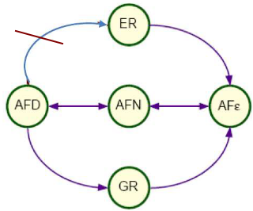

## *Autômato Finito com Saída: Máquina de Moore e Máquina de Mealy*

### Geração de uma palavra de saída

- estende a definição de AF
- não altera a capacidade de reconhecimento
  - reconhece a classe de linguagens regulares
- saída
  - não pode ser lida
  - não pode ser usada como memória auxiliar
- as saídas podem ser associadas
  - às transições - Máquina de Mealy
  - aos estados - Máquina de Moore

### Saída

- definida sobre um alfabeto especial
  - alfabeto de saída
  - pode ser igual ao alfabeto de entrada
- saída
  - fita independente da de entrada
- cabeça da fita de saída
  - move uma célula para direita
  - a cada símbolo gravado
- resultado do processamento
  - estado final (condiçã ode aceita/rejeita)
  - informação contida na fita de saída

### Máquina de Mealy

- para cada transição
  - gera uma palavra de saída
  - pode ser vazia
- Definição
  - 6-upla M = ($\Sigma$, Q, $\delta$, q0, F, $\Delta$)
  - $\Sigma$ alfabeto de símbolos de entrada
  - Q conjunto finito de estados
  - $\delta$ função programa ou de transição
    - $\delta$: Qx$\Sigma$ -> Qx$\Delta$*
    - função parcial
  - q0 estado inicial tq q0 $\in$ Q
  - F conjunto de estados finais tq F $\subseteq$ Q
  - $\Delta$ alfabeto de símbolos de saída
- Exemplo

  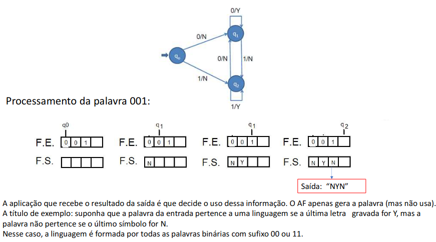

### Máquina de Moore

- para cada estado da máquina
  - gera uma palvra de saída
  - pode ser vazia
- possui uma função de saída
- Definição
  - 7-upla M = ($\Sigma$, Q, $\delta$, q0, F, $\Delta$, $\delta_{S}$)
  - $\Sigma$ alfabeto de símbolos de entrada
  - $\delta$ função programa ou de transição
    - $\delta$: Qx$\Sigma$ -> Q
    - função parcial
  - Q conjunto finito de estados
  - q0 estado inicial tq q0 $\in$ Q
  - F conjunto de estados finais tq F $\subseteq$ Q
  - $\Delta$ alfabeto de símbolos de saída
  - $\delta_{S}$ função de saída
    - $\delta_{S}$: Q -> $\Delta$*
    - é total
- Exemplo

  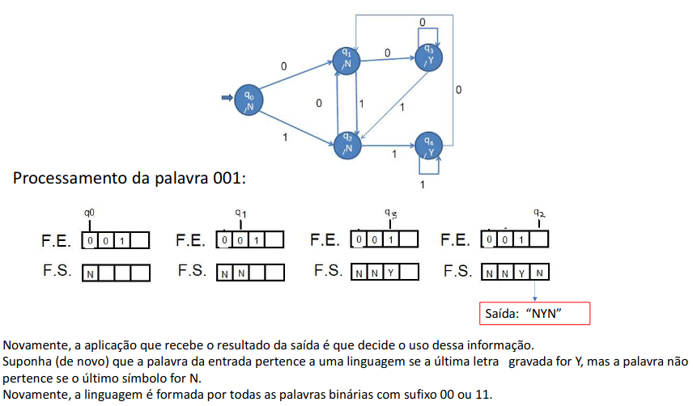

### Exemplo: Analisadores Léxicos

- p/ compiladores ou tradures de linguagens
- analisador léxico
  - basicamente é um AF
  - em gera, determinístico
- identifica os componentes básicos da linguagem
  - números
  - identificadores
  - separadores
  - etc
- estado final
  - associado a cada unidade léxica identificada
  - saída: descreve ou codifica a unidade léxica
- estado não-final
  - saída: palavra vazia
- como seria uma correspondente Máquina de Mealy?
- Exemplo de "Analisador Léxico" - Checar a validade do valor monetário em dólar
  - Características da palavra que deve ser validada
    - Deve iniciar com os dois símbolos "U\$".
    - A parte decimal (centavos) deve ser separada com ponto e sempre ter dois dígitos.
    - Os milhares devem ser separados com vírgula e sempre que existirem 3 dígitos consecutivos (antes da parte decimal), devem ser separadas com vírgulas
    - Exemplos de palavras válidas: U\$1,234.56 U\$234.56 U\$14.56 U\$ 1,234,000.56
    - Exemplos de palavras inválidas: U\$1,234.5 U\$1234.56 U\$14.6 U\$ 1,24,000.56
    - Dicas:
      - usar a letra d para representar todos os dígitos na transição
      - "programar" nas transições apenas as situações válidas e omitir as transições de erros (AF incompleto, ou seja, falhar por indefinição da transição)

    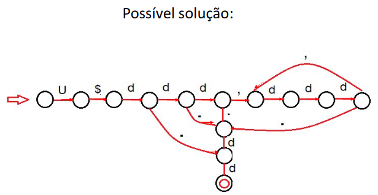

## *Lema do Bombeamento*

### Propriedades das LR

- LR podem ser representadas por formalismos
  - pouca complexidade
  - grande eficiência
  - fácil implementação
- Entretando, por ser um classe relativamente simples
  - é restrita e limitada
  - fácil definir linguagens não-regulares
- Assim, algumas questões sobre LR necessitam ser analisadas
  - como determinar se uma linguagem é regular?
  - é fechada para operações de união, concatenação e intersecção?
  - como verificar se uma LR é infinita, finita ou vazia?
  - é possível analisar duas LR e concluir se são iguais ou diferentes?
- Análise de cada propriedade
  - desenvolvida para um dos formalismos estudados
  - para os demais: é suficiente traduzi-los

  
- Obs: Autômato Finito x Complexidade de Algoritmos
- Autômatos finitos pertencem à classe de algoritmos
  - mais eficientes em termos de tempo de processamento
  - supondo que toda a entrada necessita de ser lida
    - se relaxada, podem-se imaginar formalismos mais eficientes
    - exemplo: reconhecer a linguagem $\Sigma^*$ (por quê?)
  - Qualquer autômato finito que solucione o problema é igualmente eficiente
    - a menos de eventual redundância de estados
    - não influi no tempo de processamento
  - Redundância de estados pode ser facilmente eliminada
    - Autômato Finito (Determinístico) Mínimo

### Bombeamento para as LR

- Lema do Bombeamento
  - útil no estudo das propriedades das LR
- Idéia básica
  - se uma linguagem é regular, então
    - é aceita por um AFD com n estados
  - se o autômato reconhece w de comprimento maior ou igual a n
    - assume algum estado q mais de uma vez
    - existe um ciclo na função programa que passa por q
- Exp: Bombeamento para as Linguagens Regulares

  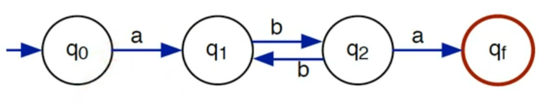
  - n = 4
  - para w = abbba
- w pode ser dividida em três subpalavras w = u v z
  - | uv | <= n, | v | >= 1
  - v é a parte de w reconhecida pelo ciclo
  - tal ciclo pode ser executado (bombeado) zero ou mais vezes
    - para qualquer i >= 0, u v$^i$ z, é aceita pelo autômato

  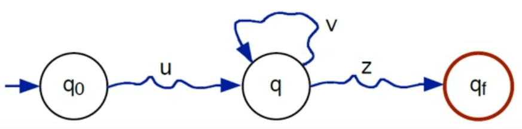
- Suponha que
  - n é o cardinal de Q
  - existe w = a1a2...am palavra de L de comprimento m tal que m >= n
  - $\sigma$(q0, a1) = q1
  - ...
  - $\sigma$(qm-1, am) = qm
- Como m >= n, então existem r e s com 0 <= r < s <= n tais que
  - qr = qs
  - $\sigma$(q0, a1 ... ar) = qr
  - $\sigma$(qr, ar + 1 ... as) = qs
  - $\sigma$(qs, as + 1 ... am) = qm
- ou seja, o autômato passa mais de uma vez no estado qr = qs
- Sejam
  - u = a1...ar
  - v = ar+1...as
  - z=as+1...am
- Como r < s <= n, então
  - | v | >= 1 e | uv | <= n
- Como qr=qs, então:
  - v é reconhecida em um ciclo
- Portanto, para todo i >= 0, u v$^i$ z é palavra de L
- Diversos bombeamentos???
  - duplo bombeamento: {$a^nb^n$ | n >= 0 e m >= 0}
  - triplo bombeamento: {$a^nb^ma^r$ | n >= 0, m >= 0 e r >= 0}

### Investigação se é LR

- Mostrar que é LR
  - representar usando um dos formalismos regulares
- Mostrar que não é LR
  - desenvolvida para cada caso
  - ferramenta útil Lema do Bombeamento
- Ex: Linguagem Não-Regular
  - L = {w | w possui o mesmo número de símbolos a e b}
- Por absurdo. Suponha que L é regular
  - existe AFD M com n estados que aceita L
- Seja w = a$^n$b$^n$ sendo |w| = 2n >= n. Logo (Bombeamento) w = u v z talque
  - |u v| <= n
  - |v| >= 1
  - para todo i >= 0, u v$^i$ é palavra de L
- Absurdo !!! Como |uv| <= n
  - uv é composta exclusivamente por símbolos a
  - u v² z não pertence a L (número de a será maior que o de b)
- Outra prova
  - Se L é uma linguagem regular
  - Então: Existe uma constante N tal que, para qualquer palavra w $\in$ L, sendo |w| >= N, w pode ser definida como w = u v z onde: |u v| <= N e |v| >= 1 e para todo i >= 0, temos que w' = u v$^i$ z é palavra de L
- Exemplo: Seja L = {a$^i$b$^i$}, com i >= 0. Provar que L não é regular
  - Suponha que L é regular (prova por absurdo). Então, pelo L.Bomb $\exist N \: | \: |w| \geq N \rarr w = uvz$. Seja N a cte do lema, então $w = a^nb^n \in L$ e $|w| \geq N$.
  - Portanto é possível reescrever $w = a^nb^n$ em 3 partes uvz, com |uv| <= N e |v| >= 1
  - Quais são as "quebras" possíveis?
  - Seja $w = a^ua^va^zb^N$, com (u + v) <= N e V >= 1
  - Pelo L.Bomb, $\forall i \geq 0 \rarr w' = uv^iz \in L$
  - p/ i = 0 -> w1 = a$^u$a$^z$b$^N$ = a$^{u+z}b^N$
  - Como (u + v + z) = N e v >= 1 => u + z < N, ou seja, número de as < número de bs e w' $\notin$ L.
  - $\therefore$ L não é regular
- Obs: Não é necessário achar uma contradição para todo valor de i. Mas, outros valores poderiam ser utilizados. Por exemplo, i = z: w' = $a^ua^{zv}a^zb^N = a^{u+zv+z}b^N = a^{n+v}b^N$, como v >= 1, número de as > número de bs e w' $\notin$ L.

#### Ponderações sobre o Lema do Bombeamento

- O segredo na utilização do Lema do Bombeamento é escolher a palavra adequada w (w $\in$ L e |w| >= N), de tal forma que ao ser "quebrada" de acoro com o enunciado do lema, seja impossível você encontrar uma quebra na qual para todo valor de i, a palvra pertece a L
- O seja, w é um contra-exemplo d oque o Lema diz. Então, como o Lema é "inquestionável", a gente pode concluir que L não é regular
- Nem sempre essa escolha é simples. Por vezes escolhemos uma palavra que atende ao lema(w $\in$ L e |w| >= N) e não conseguimos mostrar isso. Ou seja, por mais que L não seja regular e w atenda ao lema, pode acontecer de existir uma quebra que o bombeamento dá certo. Ou seja, a palavra bombeada continua a pertecer a L
- O que fazer? Desistir e dizer que L é provavelmente é regular mesmo?
- Não. Devemos tentar encontrar outra palavra que seja um contra-exemplo do Lema do Bombeamento
- Exemplo2: Provar que L = {w $\in$ {a}* | |w| = 2$^i$ e i >= 0 }
  - Suponha que L é regular (prova por absurdo). Então, pelo L.Bomb $\exist N \: | \: |w| \geq N \rarr w = uvz$. Seja N a cte do lema, então $w = a^{2^N} \in L$ e $|w| \geq N \rarr 2^N \geq N$.
  - Portanto é possível reescrever $w = a^{2^N}$ em 3 partes uvz, com |uv| <= N e |v| >= 1
  - Seja $w = a^{2^{N-2}}a^{2^{N-2}}a^{2^{N-1}}$, com (u + v) <= N e V >= 1
  - Pelo L.Bomb, $\forall i \geq 0 \rarr w' = uv^iz \in L$

## *Linguagens Livres de Contexto*

- Estudo da Classe das Linguagens Livres de Contexto ou Tipo 2 é de fundamental importância
  - universo mais amplo de linguagem comparativamente com as LR
  - trata, adequadamente, questões típicas de linguagens de programação
    - parênteses balanceados
    - construções bloco-estruturadas, etc.
- Algoritmos reconhecedores e geradores
  - relativamente simples
  - eficiência razoável
- Aplicações típicas
  - centradas em linguagens artificiais
    - em especial, nas linguagens de programação
  - analisadores sintáticos
  - tradutores de linguagens
  - processadores de texto em geral
- Hierarquia de Chomsky
  - Classe das Linguagens Livres do Contexto
  - contém propriamente a Classe das Linguagens
- Entretando, é uma classe relativamente restrita
  - fácil definir linguagens que não pertencem a esta classe
- Abordagens
  - Gramática Livre de Contexto (axiomático ou gerador)
    - restrições na forma das regras de produção
    - mais livre que na gramática regular
  - Autômato com Pilha (operacional ou reconhecedor)
    - análogo ao autômato finito não-determinístico
    - adicionalmente: memória auxiliar tipo pilha
    - pode ser lida ou gravada
- Relativamente às GLC
  - Árvore de derivação
    - representa a derivação de uma palavra na forma de árvore
    - parte do símbolo inicial como a raiz
    - termina em símbolos terminais como folhas
  - Gramática Ambígua
    - pelo menos uma palvra com duas ou mais árvores de derivação
  - Simplificação de Gramática (produções)
    - sem reduzir o poder de geraçaão
  - Forma Normal: restrições rígidas na forma das produções
    - sem reduzir o poder de geração da gramática
- Autômato com pilha construído a partir de uma GLC
  - construção de um reconhecedor a partir de sua gramática
    - simples e imediata
  - estrutura de pilha é suficiente como única memória
    - pode ser reconhecida por autômato com pilha com um estado
    - estados não são necessários para "memorizar" o passado

### 1. Gramática Livre do Contexto

#### Gramática Livre do Contexto (GLC)

- G(V, T, P, S)
- qualquer regra em P é da forma:
  - A => $\alpha$,  
  - A é variável de V 
  - $\alpha$ é palavra de (V $\cup$ T)*
  - lado esquerdo = uma variável

#### Linguagem Livre do Contexto (GLC)

- Linguagem gerada pela gramática livre do contexto G
  - GERA (G) = { w $\in$ T* | S $\Rarr^+$ w }
- Portanto, é livre do contexto
  - qualquer linguagem regular
- Relação entre as classes de linguagens estudadas

  
- "Livre de contexto" ???
  - mais geral classe de linguagens cuja produção é da forma A $\rarr \alpha$
  - em uma derviação, a variável A devia $\alpha$
    - sem depender ("livre") de qualquer análise
    - dos símbolos que antecedem ou sucedem A (o "contexto")
    - na palavra que está sendo derivada
- Exp: GLC: Duplo Balanceamento
  - L1 = {$a^nb^n | n \geq 0$}
- G1 = ({S}, {a, b}, P1, S)
  - P1 = {S -> aSb | $\varepsilon$}
  - GERA(G1) = L1
- Derivação da palavra aabb
  - S => aSb => aaSbb => aa$\varepsilon$bb => aabb
- Importante: Duplo Balanceamento
  - analogia com estruturas de duplo balanceamento
    - em linguagens de programação
  - linguagens bloco-estruturadas
    - $begin^n end^n$ e similares
  - lingugagens com parênteses balanceados
    - $(^n)^n$
- Ex: GLC: Expressões Aritméticas
  - L2 - expressões ariméticas com colchetes balanceados, dois operadores e um operando
    - G2 = ({E}, {+, *, [, ], x}, P2, E)
  - P2 = {E -> E+E | E*E | [E] | x}
  - existe outra sequência de derivação? quantas?
  - quais produções controlam o duplo balanceamento de parênteses?
- Obs: BFN: Backus Naur Form
  - Maneira usual de representar uma GLC
    - variáveis
      - palavras delimitadas pelos símbolos < e >
    - terminais
      - palavras não-delimitadas
    - representação de uma regra de produção A -> $\alpha$
      - A ::= $\alpha$
- Exp: BNF: Identificador em Pascal
  - A variável \<identificador> é o simbolo inicial
    - \<identificador> ::= \<letra> | \<identificador>\<letra> | \<identificador>\<dígito>
    - \<letra> ::= a | b | ... | z
    - \<dígito> ::= 0 | 1 | ... | 9

### 2. Árvore de Derivação

- Derivação de palavra na forma de árvora
  - partindo do símbolo inicial como a raiz
  - terminando em símbolo terminais como folhas
- Conveniente em muitas aplicações
  - Compiladores
  - processadores de textos

#### Árvore de Derivação

- Raiz: símbolo inicial
- Vértices interiores: variáveis
  - Se A é um vértice interior e X1, X2, ..., Xn são os "filhos" de A
    - A -> X1X2...Xn é uma produção da gramática
    - X1, X2, ..., Xn são ordenados da esquerda para a direita
- Vértices folha ou folha: terminal ou o símbolo vazio
  - se vazio: único filho de seu pai (A -> $\varepsilon$)
- Exp: Árvore de Derivação: aabb e [x+x]*x

  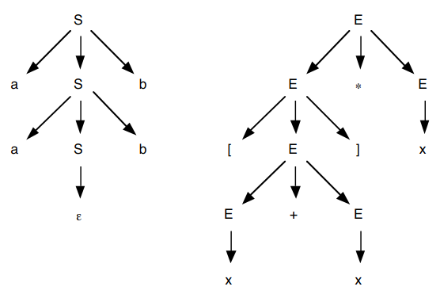
- Uma árvore de derivação
  - pode representar derivações distintas de uma mesma palavra

#### Derivação mais à Esquerda (Direita)

- Sequência de produções aplicada sempre à variável mais à esquerda (direita)
- Ex Derivação mais à Esquerda (Direita): x+x*x

  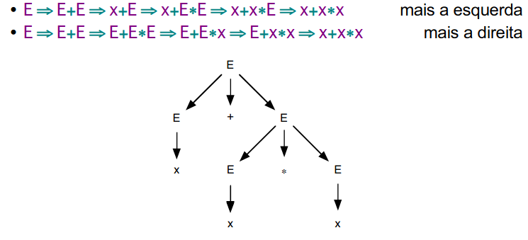

### 3. GLC Ambígua

- Gramática ambígua
  - uma palavra associada a duas ou mais árvores de derivação
- Pode ser desejável que a gramática usada seja não-ambígua
  - desenvolvimento e otimização de alguns algoritmos de reconhecimento
- Nem sempre é possível eliminar ambiguidades
  - é fácil definir linguagens para as quais qualquer GLC é ambígua

#### Gramática (Livre do Contexto) Ambígua

- Existe pelo menos uma palavra que possui duas ou mais árvores de derivação
- Exp: Gramática Ambígua: x+x*x

  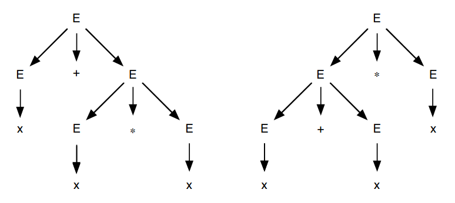
  - Mais de uma derivação à esquerda (direita)
- Forma equivalente de definir gramática ambígua
  - existe pelo menos uma palavra com duas ou mais derivações mais à esquerda
    - alternativamente, mais à direita

#### Teorema: Gramática Ambígua

- Uma GLC é uma Gramática Ambígua se existe pelo menos uma palavra
  - com duas ou mais derivações à esquerda ou
  - duas ou mais derivações à direita

#### Linguagem Inerentemente Ambígua

- Qualquer GLC é ambígua
- Ex: Linguagem inerentemente Ambígua
  - { w | w = $a^nb^nc^md^m$ ou w=$a^nb^mc^md^n$, n >= 1, m >= 1 }
- Ex: Linguagem Inerentemente Ambígua: contra-exemplo
  - Expressões aritméticas é não-ambígua (exercício)
  - Correto entedimento da solução é especialmente importante
    - justifica a maneira aparentemente "estranha" de definir expressões
    - na maioria da gramaticas das linguagens de programação

#### Remoção de Ambiguidade

- Não existe um algoritmo que funcione para todos os casos
- É preciso verificar cada GLC para verificar as fontes de ambiguidade
- Nessa análise você pode vira a concluir que a ambiguidade vem da própria linguagem, ou seja, trata-se de uma Linguagem Inerentemente ambígua. Nessa situação, não é possível remover a ambiguidade da gramática, sem alterar a linguagem gerada
- Entretando, existem exemplo de GLCs tratadas na literatura, para remoção de ambiguidade. Quando entendemos esses exemplos, podemos estender a solução e aplicar na remoção de ambiguidde para gramáticas com fontes similares
- O exemplo mais comum é o de GLCs para a construção de expressões aritméticas, como vista anteriormente
  - G2 = ({E}, {+, *, [, ], x}, P2, E)
  - P2 = {E -> E+E | E*E | [E] | x}
- Vamos analisar as fontes dessa ambiguidade, antes de removê-las
- Existem duas fontes de ambiguidade, que nos levam à adoção de 2 estratégias na remoção
  1. Ambiguidade em operadores em um mesmo nível de escopo (sem analisar as precedências entre eles)
     - Essa situação ocorre em palavras simples como x + x + x, que aplica apenas o operador + e todos estão em um mesmo escopo (sem [e])

        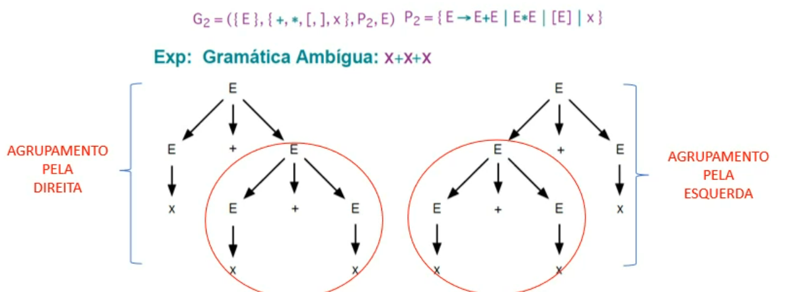
  2. Ambiguidade em operadores diferentes em um mesmo nível de escopo, com diferentes precedências
     - Essa situação ocorre em palavras simples como x + x \* x, que aplica apenas os operadores + e \* em um mesmo escopo (sem [e]).

        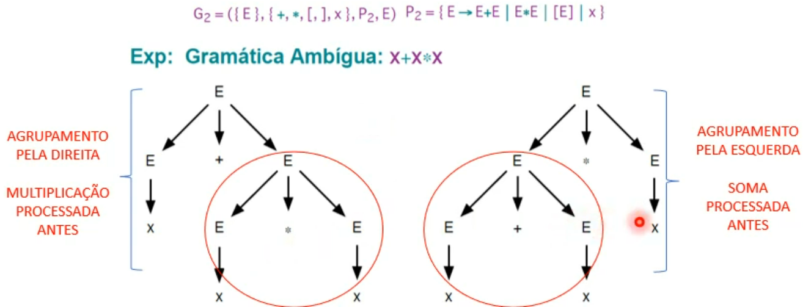
- Para eliminarmos a ambiguidade na GLC, adotaremos duas estratégias:
  1. Operações de mesma precedência serão agrupadas pelas esquerda -> lado esquerdo das árvores mais profundo

      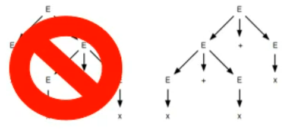
      - Obs: aqui poderíamos ter escolhido agrupar pela direita (1º árvore). Não existe lado certo ou errado, é apenas escolher 1 opção
  2. Operações com precedências diferentes, a operação de maior precedência deve ser realizada primeiro -> maior profundidade para operações > precedência

      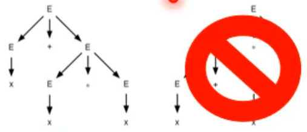
      - Obs: Nesse caso, escolhemos o "lado certo", ou seja, o que coloca a mior precedência em maior profundidade. Do ponto de vista da gramática, não existiria lado certo ou errado, apenas a necessidade de escolha de um deles para eliminar a ambiguidade. Mas utilizamos a semântica de que trata-se de gerar expressões matemáticas para definir o que é certo
- G2 = ({E}, {+, \*, [, ], x}, P2, E), P2 = {E -> E+E | E\*E | [E] | x}
- Resumindo, para o exemplo da gramática dada, eliminaremos a ambiguidade adotando:
  1. Operações de mesma precedência serão agrupadas pela esquerda -> lado esquerdo das árvores mais profundo
  2. Operações com precedências diferentes: operações de maior precedência -> maior profundidade
- Por termos 3 níveis (+, * e operando), sendo que o operando pode ser um novo escopo ([..]), iremos adotar 3 variáveis para separar em níveis:
  - E: Expressão -> Pode representar uma operação de soma (com possibilidade de agrupamento pela esquerda) ou um Termo (próximo nível)
    - E -> T | E + T
  - T: Termo -> Pode representar uma operação de multiplicação (com possibilidade de agrupamento pela esquerda) ou um Fator (próximo nível).
    - T -> F | T \* F
  - F: Fator -> representa os operandos ou um novo escopo (expressão dentro)
    - F -> x | [E]
- Nova gramática:
  - G3 = ({E, T, F}, {+, \*, [, ], x}, P3, E), P2 = {E -> T | E + T, T -> F | T \* F, F -> x | [E]}

### 4. Simplificação de GLC

- Simplificação de alguns tipos de produções
  - sem reduzir o poder de geração das GLC
- Simplificações são importantes
  - construção e otimização de algoritmos
  - demostração de teoremas
- Simplificações
  - Símbolos inúteis
    - exclusão de variáveis ou terminais não-usados
  - Produções vazias, da forma A -> $\varepsilon$
    - se $\varepsilon$ pertence à linguagem: incluída produção vazia específica
  - Produções que substituem variáveis, da forma A -> B
    - substituem uma variável por outra
    - não adicionam informação de geração de palavras
- Provas omitidas
  - algoritmos de simplificação atingem os objetivos propostos

#### Símbolos Inúteis

- símbolos não-usados na geração de palavras de terminais
- Simplificação exclui
  - produções que fazer referência a esses símbolos
  - os próprios símbolos inúteis
  - não é necessária qualquer modificação adicional
- Algoritmo
  - Etapa 1: qualquer variável gera terminais
    - restringe o conjunto de variáveis
    - considera todas as variáveis que geram terminais diretamente (exemplo A -> a)
    - adiciona, sucessivamente, variáveis que geram terminais indiretamente (exemplo: B -> Ab)
  - Etapa 2: qualquer símbolo é atingível a partir do símbolo inicial
    - analisa as produções da gramátia a partir do símbolo inicial
    - considera exclusivamente o símbolo inicial
    - sucessivamente as produções da gramática são aplicadas:
      - símbolos referenciados são adicionados aos novos conjuntos

#### Algoritmo: Exclusão dos Símbolos Inúteis

- G(V, T, P, S)
- Etapa 1: qualquer variável gera terminais. Gramática resultante
  - G1 = (V1, T, P1, S)
  - construção de V1 $\subseteq$ V
- V1 = $\empty$
- repita V1 = V1 U { A | A -> $\alpha \in$ P e $\alpha \in$ (T U V1)* } até que o cardinal V1 não aumente
- P1 possui os mesmos elementos que P, excetuando-se
  - produções cujas variáveis não pertencem a V1
- Etapa 2: qualquer símbolo é atingível a partir do símbolo inicial. Gramática resultante
  - G2 = (V2, T2, P2, S)
- T2 = $\empty$
- V2 = { S }
- repita
  - V2 = V2 U { A | X -> $\alpha A\beta \in$ P1, X $\in$ V2 }
  - T2 = T2 U { a | X -> $\alpha a\beta \in$ P1, X $\in$ V2 }
- até que os cardinais de V2 e T2 não aumentem
- P2 possui os mesmos elementos que P1, excetuando-se
  - produções cujos símbolos não pertencem a V2 ou T2
- Se as etapas forem executadas em ordem inversa (Etapa 2 antes da Etapa 1)
  - pode não atingir o resultado esperado
  - demostração: apresentar um contra-exemplo (exercício)
- Exp: Exclusão dos Símbolos Inúteis
  - G = ({S, A, B, C}, {a, b, c}, P, S)
  - P = {S -> aAa | bBb, A -> a | S, C -> c}
- Etapa 1: qualquer variável gera terminais

  
- S -> bBb é excluída: B não pertence ao novo conjunto de variáveis
- gramática resultante da etapa 1
  - G1 =({A, C, S}, {a, b, c}, {S -> aAa, A -> a | S, C -> c}, S)
- Etapa 2: qualquer símbolo é atingível a partir do símbolo inicial

  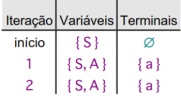
- C -> c é excluída: C e c não pertencem aos novos conjuntos
- gramática resultante da etapa 2
  - G2 = ({S, A}, {a}, {S -> aAa, A -> a | S}, S)

#### Produções Vazias

- Exclusão de produçẽos vazias (da forma A -> $\varepsilon$)
  - pode determinar modificações diversas nas produções
- Algoritmo
  - Etapa 1: variáveis que constituem produções vazias
    - A -> $\varepsilon$: variáveis que geram diretamente $\varepsilon$
    - B -> A: sucessivamente, variáveis que indiretamente geram $\varepsilon$
  - Etapa 2: exclusão de produções vazias
    - considera apeans as produções não-vazias
    - cada produção cujo lado direito possui uma variável que gera $\varepsilon$, determina uma produção adicional, sem essa variável
  - Etapa 3: geração da palavra vazia, se necessário

#### Def: Algoritmo: Exclusão das Produções Vazias

- G = (V, T, P, S)
- Etapa 1: variáveis que constituem produções vazias
  - $V_{\varepsilon}$ , conjunto das variáveis que geram $\varepsilon$
- $V_{\varepsilon}$ = { A | A -> $\varepsilon$}
- repita
  - $V_{\varepsilon}$ = $V_{\varepsilon}$ U { X | X1...Xn $\in$ P tal que X1, ..., Xn $\in$ $V_{\varepsilon}$}
- até que o cardinal de $V_{\varepsilon}$ não aumente
- Etapa 2: exclusão de produções vazias. Gramática resultante
  - G1 = (v, T, P1, S)
  - construção de P1
- P1 = { A -> $\alpha$ | $\alpha \not={\varepsilon}$ }
- repita
  - para toda A -> $\alpha \in$ P1, X $\in V_{\varepsilon}$ tal que $\alpha = \alpha_{1}X\alpha_{2}, \alpha_{1} \alpha_{2} \not={\varepsilon}$
  - faça P1 = P1 U { A -> $\alpha_{1} \alpha_{2}$ }
- até que o cardinal de P1 não aumente
- Etapa 3: geração da palavra vazia, se necessário
  - se $\varepsilon$ pertence à linguagem
    - introduz a produção S -> $\varepsilon$
  - gramática resultante
    - G2 = (V, T, P2, S)
  - P2 = P1 U {S -> $\varepsilon$}
- Exp: Exclusão das Produções Vazias
  - G = ({S, X, Y}, {a, b}, P, S)
  - P = {S -> aXa | bXb | $\varepsilon$, X -> a | b | Y, Y -> $\varepsilon$}
- Etapa 1: variáveis que constituem produções vazia

  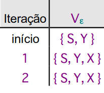
- Etapa 2: exclusão de produções vazias

  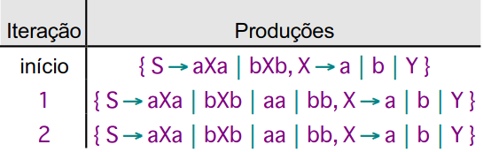
- Gramática resultante
  - G1 = ({S, X, Y}, {a, b}, {S -> aXa | bXb | aa | bb, X -> a | b | Y}, S)
- Etapa 3: geração da palavra vazia, se necessário
  - palavra vazia pertence à linguagem: S -> $\varepsilon$ é incluída
- Gramática resultante
  - G2 = ({S, X, Y}, P2, S)
  - P2 = {a, b}, {S -> aXa | bXb | aa | bb | $\varepsilon$, X -> a | b | Y}
- Observe
  - Y, originalmente um símbolo útil, resultou em um símbolo inútil
  - exclusão de produções vazias gerou símbolo inútil
- Conclusão
  - não é qualquer combinação de simplificações de gramática que atinge o resultado desejado

#### Produções que Substituem Variáveis

- Produção que substitui uma variável por outra
- tipo A -> B
  - não adiciona informação em termos de geração de palavras
  - se B -> $\varepsilon$, então
    - A -> B pode ser substituída por A -> $\varepsilon$
  - generalização da idéia: algoritmo proposto