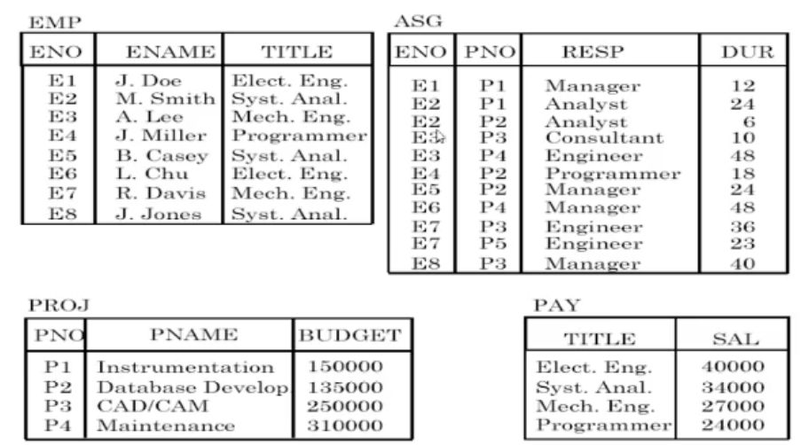
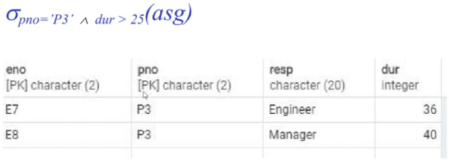
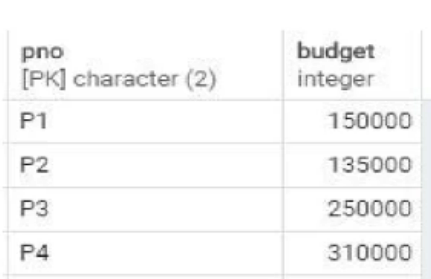
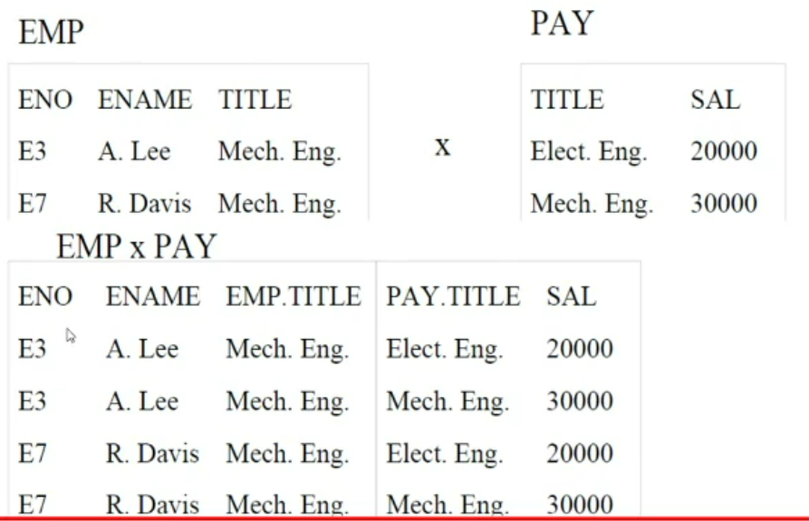
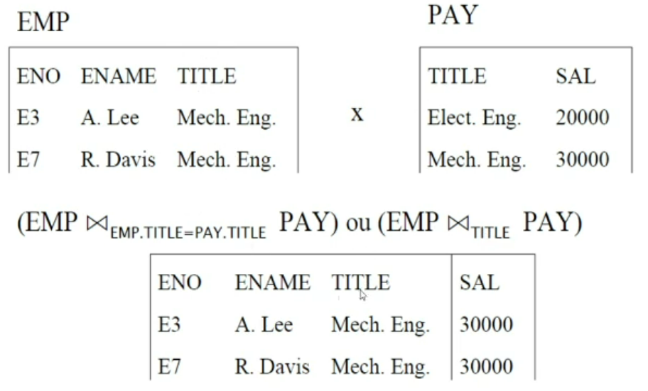
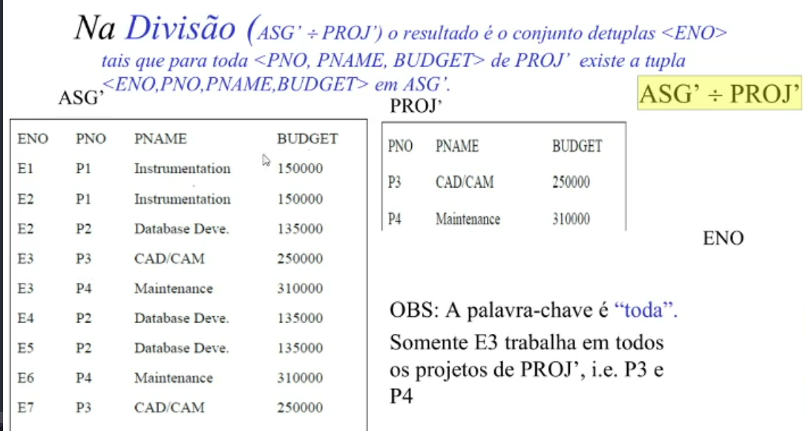
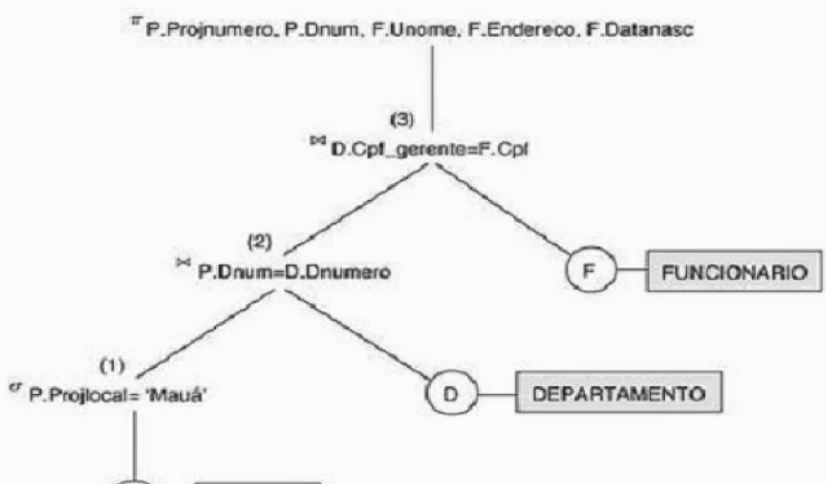
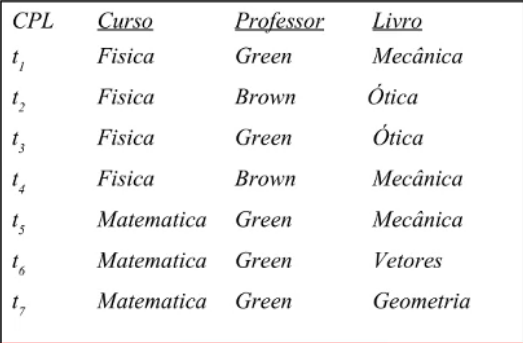
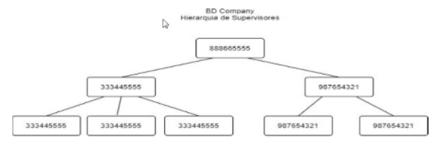

# Sistemas de Bancos de Dados

## **_Motivação_**

- SBD é essencial para qualquer organização

- O conteúdo da disciplina é fundamental. para a Formação Tecnológica na área de Computação e Informática.

- As técnicas e fomalismos apresentados são importantes no desenvolvimento profissional e na atuação do egresso.

## _**Serve para?**_

- Capacitar o aluno a utilizar princípios e ferramentas teóricas para modelar a semântica de uma aplicação com abordagem de banco de dados.

- Capacitar o aluno a implementar sistemas de informação utilizando uma **Sistema Gerenciador de Banco de Dados - SGBD**.

## _**Objetivos**_

1. Interagir com um SGBD instalado em um servidor, aplicando os conceitos de arquitetura de SGBD.

2. Projetar um esquema de banco de dados e implantar um banco de dados em um servidor.

3. Usar uma linguagem de manipulação de dados para inserção, consultas e atualizaçã ode banco de dados.

4. Implementar visões lógicas do banco de dados.

5. Usar uma linguagem de dados embutida em uma linguagens de desenvolvimento de aplicações.

6. Usar uma linguagem procedural que executa no servidor por meio de funções.

7. Usar uma linguagem procedural no servidor para implementar regras ativas (gatilhos).

8. Implementar controles de segurança e acesso aos dados do banco de dados.

9. Implementar objetos complexos armazenados em um SGBD e a definir estratégias e recursos necessários para implementação de banco de dados distribuídos.

## _**Introdução**_

- **Banco de Dados** é uma coleção de itens de dados relacionandos.

- Propriedades implícitas:
  - Representam uma realidade, significado e são projetados com objetivos definidos.

- > O conceito é aplicado quando há necessidade de armazenar grande volumes de dados.

- **Esquema**, **Instância** e **Estado** de um BD
  - O esquema de um bd é uma descrição dele.
  - Instância é uma ocorrência de um dado, ex: registro de um empregado.
  - Estado é o conjunto de instâncias em um determinado momento de um BD.
  - > Empregado (nome, endereço, ...) <- Esquema
  - > ('Guilherme Alves C', 'Av. Aspirante Mega') <- Instância
  - > Conjunto de instâncias diferentes do banco de dados ao longo do tempo <- Estado

- _Exemplos de BD_
  - Banco de dados de uma empresa, contendo dados de clientes, funcionários, e produtos.
  - Bancos de dados de uma universidade, contando dados de cursos, alunos, professores e técnicos-administrativos.

- Definição SGBD (Sistema Gerenciador de Banco de Dados)
  - Software que gerencia um ou mais bancos de dados.
  - Oracle, PostgreeSql, MySql, Sybase, MS Sql Server, MS Access, Firebird.

- Definição SBD (Sistema de Banco de Dados)
  - SBD = BD + SGBD + Aplicação.

- Alternativa à abordagem de BD
  - Uso de arquivos com gerenciamento por programas própios.
  - **Problemas**
    - Inconsistências ou redundâncias
      - Formatos distintos, linguagens, atributos, alto custo, alterações parciais (arquivos separados não são alterados igualmente).
    - Acesso aos dados
      - Fazer uma nova funcionalidade requer escrever um novo programa.
    - Isolamento de dados
      - Não há isolamento de dados e programas
      - O formato dos dados depende dos programas específicos.
    - Integridade
      - As restrições são implementadas por códigos prórios.
      - Dificil implementar restrições
    - Atomicidade (Impossibilidade de fazer tarefas imcompletas)
      - Atomicidade significa que um conjunto de operações devem ser executadas por completo, ou nenhuma deve ser executada, se ocorrer um erro.
      - Isso é difícil de se manter em programas próprios.
    - Acesso concorrente
      - Vários sistemas exigem acesso simultâneo (concorrente).
      - É difícil garantir a consistência dos dados nesse tipo de acesso.
    - Escalabilidade
      - Acesso a um volume grande de dados pode ser ineficiente
      - Crescimento de funcionalidades pode se difícil de implementar.
    - Segurança
      - Grandes sistemas têm vários usuários que possuem acessos restritos
      - É difícil controlar acesso em Arquivo Convencionais.

- Componentes de um SBD

  

- Capacidades de um SGBD
  - controlar transações, acessos, redundâncias
  - garantir restrições de integridade
  - backup e recuperação
  
- Características e Viabilidade
  - CARACTERÍSTICAS DA ABORDAGEM BASEADA EM BD
    - repositório para diversas aplicações
    - dados e metadados
  - VIABILIDADE
    - investimento em HW E SW
    - porte de aplicações
    - necessidade de concorrência (transações)

- Níveis de Abstração

  

- Independência de Dados
  - Independência Lógica: alterações no nível lógico não afetam os programas
    - Exemplo: inserção de uma nova tabela
  - Independência Física: alterações na estrutura de arquivos e índices não afetam o nível lógico
    - Exemplo: criação de um índice para melhoria de desempenho

- Profissionais envolvidos
  - Implementadores de DB
  - Projetistas de DB Lógico
  - Projetistas de DB Físico
  - Administradores de banco de dados (DBA)
  - Programadores de aplicativos
  - Usuários finais

- Histórico de SBD e Arquitetura de DB
  - Sistemas monolíticos centralizados
  - Arquitetura cliente/servidor em duas camadas
  - Arquitetura cliente/servidor em três camadas
    - Cliente => GUI/Apresentação
    - Servidor Web => Aplicação/Lógica
    - Servidor de DB => SGBD/Serviços DB
  - DB e mobilidade => devido à possibilidade de desconexão, o conceito de trabalho offline seguido de sincronização é importante
  
- Linguagens de Definição e Manipulação
  - DDL define:
    - esquema conceitual
    - esquema interno
    - esquema externo
  - DML manipula:
    - busca
    - inserção
    - modificação
    - remoção

- Outras Linguagens
  - API
    - ODBC
    - JDBC
    - Outros Drivers
  - INTERFACE:
    - menus
    - formulários
    - gráficas
    - administração
  - UTILITÁRIOS:
    - carga
    - backup
    - recuperação
    - monitoração

- Arquitetura de um SGBD Relacional

  

- Modelo de Dados
  - É um conjunto de ferramentas para descrever dados, incluindo relacionamentos e restrições de integridade
  - Exemplos
    - Modelo de Entidade-Relacionamento - ER/MER
    - Modelo Orientado a objetos
    - Modelo Semântico de Dados
    - Modelo Hierárquico
    - Modelo de Redes
    - Modelo Relacional
    - Modelo Relacional - Orientado a objeto

## _**Modelo de Entidade-Relacionamento (ER / MER / DER)**_

- Também chamado de Modelo de Entidade-Relacionamento ou Diagrama de Entidade-Relacionamento
- Uma visão panorâmica

  

- É uma modelagem de dados em alto nível com foco do domínio do problema e não na solução
- Elemetos básicos
  - Modelar conceitos do mundo real
  - Modelar as características dos conceitos
  - Modelar os relacionamentos entre conceitos
- O MER, ou ER, tem como objetivo facilitar o projeto de BD por meio de um modelo indendente da implementação de fácil compreensão por parte do usuário
- A partir dos requisitos, consegue-se modelar um DER
- Conceitos básicos
  - Entidade, Tipo Entidade e Conjunto de Entidades
  - Relacionamento e Conjunto de Relacionamentos
  - Atributos
- Def: O Diagrama ER-DER é uma representação gráfica de Entidades, Atributos, e Relacionamentos que modelam o Esquema de um Banco de Dados
- **DER Exemplo - Company Database**

  

***

- Definições
  - **Entidade:** é um conceito do mundo real com existência independente
    - Ex: empregado (conceito físico), projeto, curso (conceito abstrato)
  
    
    - o retângulo representa uma **Entidade**
    - o tipo _Empregado_ representa um Conjunto de Entidades, ou seja, todas as instâncias do BD
  - **Atributo:** é uma propriedade da entidade (campo de um objeto)
    - Ex: código, nome, créditos

      
    - Um atributo no DER é representado por uma elipse ligada à entidade
    - **Existem vários tipos de atributos:**
    - Simples: atributo que não possui divisão (sexo, cpf - não podem ser subdivididos)
    - Composto: atributo que pode ser dividido em partes com significados diferentes
    
      - Uma atributo composto pode formar uma hierarquia
      
    - Monovalorado: atributo possui um único valor (nome - uma pessoa só pode ter um nome)
    - Multivalorado: atributo que possui um conjunto de valores para uma mesma entidade (telefone - uma pessoa pode ter mais de um telefone)
      - No DER, um atributo multivalorado é representado por uma elipse com contorno em linha dupla
      
    - Chave (Primary Key): é um atributo cujos valores são distintos para instâncias distintas de um Conjunto de Entidades (código de uma disciplina/sigla ou código de uma turma - são valores únicos para instâncias diferentes)
    
      - Obs: uma entidade pode ter mais de um atributo chave
    - Derivado: é um atributo que não está definido, mas pode ser obtido a partir de outros atributos através de algum procedimento (não precisa ser armazenado)
      - idade (se houver a data de nascimento, podemos calcular a idade) 
      - numero de empregados de um departamento (se houver uma tabela de empregados relacionados a uma tabela de departamentos, podemos contar quantos empregados estão relacionados à aquele departamento específico)
      
        - Obs: No DER uma atributo derivado é representado por uma elipse com contorno em linha tracejada (este atributo não será armazenado fisicamente no BD)
  - **Relacionamento:** é uma associação entre entidades que é definido quando uma entidade se refere a outra. Ex: lotação de um empregado em um departamento

    
    - Um relacionamento no DER é representado por um losango às entidades (existem vários tipos de relacionamentos)
    - Papeis em relacionamentos:  papel em um relacionamento define como a entidade participa do mesmo
      - Ex: empregado está lotado em departamento e departamento tem lotação de empregados
      - Muitas vezes o papel está implícito e não é representado no ER
    - Auto-relacionamento: associam instâncias de uma mesma entidade
      - Ex: supervisão de empregados (um empregado pode ser supervisor de outros empregados), papéis: empregado é supervisor de empregado, e empregado é supervisionado por empregado
      - É necessário indicar os papéis que são denotados por rótulos nas linhas que modelam o relacionamento
      
    - Cardinalidade em Relacionamentos: é uma restrição na quantidade máxima de instâncias de uma entidade que podem estar associadas a uma instância de outra entidade
      
      - No DER definimos a cardinalidade de N ou 1, neste caso, indicando que uma instância de funcionário pode estar associadas a, no máximo, uma instância de departamento (um funcionário só trabalha para um departamento, mas um departamento tem vários funcionários)
    - Participação em Relacionamentos:
      - Participação Total: é uma restrição que indica a necessidade de que qualquer instância da entidade, estar associada a, no mínimo, uma instância no relacionamento
        - Ex: toda instância de PROJECT necessariamente está associada a um departamento no relacionamento CONTROLS (_Não pode existir um projeto no Conjunto de Entidades que não esteja relacionado a um departamento_)
        
        - No DER um relacionamento com participação total é indicado por meio de uma linha dupla . Quando não é total, chamamos de ***Participação Parcial***
        - Participação Parcial: no caso do exemplo acima, um departamento pode não ter um projeto relacionado a ele
    - Entidade Fraca: é aquela que não possui um atributo chave e é identificada por meio de um relaciomento total com pelo menos um tipo Entidade Forte
      - Ex: Dependente/Entidade Fraca, Funcionário/Entidade Forte
  
      
      - No DER, um Tipo Entidade Fraca é representado por meio de retângulo com contorno em linha dupla. O relacionamento total com pelo menos uma entidade forte é denotado por um losângulo com contorno em linha dupla. A "chave local" é denotada por sublinhado pontilhado. A Chave de uma instância de uma entidade fraca é um atributo composto pela chave da entidade forta mais a sua "chave local"
    - Grau de Tipo-Relacionamento: é o número de entidades que participam
      - Ex: relacionamentos de grau 3 (ternário) ligam 3 entidades, por exemplo: relacionamento entre agencia, cliente e conta
      
      - Um tipo-relacionamento de grau n tem n arocs no diagrama
    - Relacionamentos binário/ternário: diferença entre um relacionamento ternário e três relacionamentos binários 
  
      
      

## _**Modelo de Entidade-Relacionamento-Estendido (EER / MEER / DEER)**_

- Intriduz semântica adicional ao ER  
- Entidades do ER podem representar
  - CLASSE
  - SUBCLASSE
  - SUPERCLASSE
- HERANÇA
  - subclasses herdam atributos da superclasse

- ERR - Especilização/ Generalização
  - ESPECIALIZAÇÃO: definir sub-classes à partir da super-classe
  - GERERALIZAÇÃO: definir super-classe à partir de sub-classes

    
  
  - Exemplo

    
    - Cada entidade do Conjunto de Entidades das subclasses também é um empregado
  
- EER - Herança de Relacionamentos
  - Além dos atributos, as subclasses herdam os relacionamentos das superclasses
  - Uma instância da superclasse pode ser instânciada de zero, ou mais suclasses, dependendo do ***critério de especialização/generalização***

- EER - Especialização/Generalização (Notação)

  

- EER - Subclasses mutuamente esclusivas
  - Critério de Especialização/Generalização
    - Disjunto: este critério modela uma restrição tal que as subclasses são mutuamente exclusivas, ou seja, uma instância da superclasse pode ser, no máximo, a instância de uma das subclasses

      

      - No DER, o critério disjunto é indicado pela letra "d" no relacionamento de superclasse/subclasse 
      - Uma instância de disciplina não pode ser de graduação e pós-graduação

        
    - Sobreposto: subclasses se sobrepõem, ou seja, uma instância de superclasse pode ser instância de mais de uma subclasse

      
      - No DER, o critério sobreposto é o *default* ou pode ser explicitado pela letra "o"
      - Uma instância de pessoa pode praticar mais de um tipo de esporte

        

- EER - Exemplo de Especialização

  
  - Notação de união, significa que herda (extends)

- EER - Exemplo de Generalização

  
  - As entidades "car" e "truck" foram generalizadas na "vehicle"

- EER - Exemplo definida como atributo

  
  - Especialização é vista como um "job type"

- EER - Herança múltipla em subclasses

  

- EER - Categoria (_UNION TYPE_ ou _CATEGORIA_)
  - União de entidades(superclasses) formando categorias (ou clusters), onde a instância de uma subclasse da categoria tem que ser instância d epelo menos uma das superclasses
  - A categoria é modelada por meio de um relacionamento (União) da subclasse com mais de uma superclasse, e a subclasse representa um subconjunto da união de todas as superclasses

    

- EER - Agregação
  - É um conceito de abstração para a criação de objetos compostos com base em componentes (três casos)
    1. Entidade agrega atributos de objetos para representar um objeto mais complexo (ex: COMPA agrega CNa e Caddr)
    2. Relacionamento que agrega atributos (ex: INTERVIE agrega ContactNa e ContactPho)
    3. Entidade que representa objeto agregado a partir do relacionamento de outros objetos (não é natural no ER. Como resolver isso?)

        

  - O problema: como relacionar Entrevista a outra entidade chamada Oferta de emprego?
    - Resolução: Abordagem com Entidade_Fraca
  
      

  - Exemplo de EER

    

- Projeto Conceitual - UML
  - Diagramas de classes da UML como alternativa de modelagem conceitual

    

  - UML - Especialização/Generalização

    

## _*Modelo Relacional - MR**_

- O modelo relacional representa um banco de dados como uma correlação de valores. Uma relação é uma tabela de valores, onde cada linha é um conjunto de valores relacionados e cada coluna um conjunto de valores de mesmo tipo e significado

  
- foi proposto por Ted Codd em 1970
- versões comerciais disponibilizadas no início da década de 80 (SQL/DS; ORACLE)
- seu formalismo usa teoria de conjuntos de lógic a de primeira ordem;
- é um método declarativo de especificar dados e consultas
- Conceitos informais
  - Relação é uma tabela de valores
  - Cada linha da tabela representa fatos do mundo real, chamada tupla no modelo formal
  - Cada coluna da tabela tem um cabeçalho que indica o significado do item de dado na coluna, chamado atributo
  - Cada linha tem pelo menos uma chave que é um subconjunto de valores que identifica unicamente a linha
- Exemplo de Relação

  

- Definições formais
  - Domínio e Cardinalidade: um **domínio D** é um conjunto de valores atômicos e a **cardinalidade de D**, denotada por |D|, é o número de valores em D
    - Exemplo:
      - D1 = Domínio(sexo) = {F, M}; |D1| = 2
      - D2 = Dom(funcionario.idade) = [15, 80]; |D1| = 66
    - Um domínio pode ser definido por um tipo ou formato
      - funcionario.idade: inteiro
      - fone: (dd)dddd.dddd, onde cada "d" representa uma digito númerico decimal, sendo os dois primeiros um código de área
  - Esquema de relação e atributo: o esquema de relação descreve a relação e é definido por R(A1, A2, ..., AN), onde R é o nome da relação e cada Ai é o nome de um atributo
    - O atributo é o nome do papel desempenahdo por algum domínio na relação
    - Exemplo: EMPREGADO(cpf, nome, endereco, sexo)
      - Dom(cpf) = ddd.ddd.ddd-dd
      - Dom(nome) = cadeia de caracteres que representam nomes de pessoas
      - Dom(endereco) = cadeia de caracteres que representam endereços
      - Dom(sexo) = {F, M}
  - Tupla, valor de atributo e NULL: uma tupla t é um conjunto ordenado de valores denotado por t = <v1, v2, v3, v4>, onde cada vi é derivado do domínio apropriado de Ai ou é um valor nulo
    - o valor nulo, denotado por NULL, é um valor especial para reprentar valores desconhecidos ou que não se aplicam
    - Se t = <v1, v2, ..., vn> então t[Ai] = vi
    - Exemplo:
      - EMPREGADO(cpf, nome, enderco, sexo)
      - empregado=<114719143637, 'John Smith', '101 Main St. Atlanta, Ga 303332', 'M'>
      - empregado.sexo = 'M'
  - Relação, estado, grau e cardinalidade: uma relação r de uma esquema R(A1, A2, ..., An), denotado por r(R), é um conjunto de tuplas (r = {t1, t2, ..., tm}).
    - Obs
      - O estado da relação r reflete as tuplas válidas que representam um estado particular do mundo real
      - O esquema R é relativamente estático, mas em geral, o estado da relação r é dinâmico
      - n é o grau do esquema da relação
      - m é a cardinalidade da relação
  - Características das relações
    - as tuplas em uma relação não possuem ordem
    - os atributos em uma tupla estão ordenados de acordo com o esquema da relação
    - não há atributos compostos ou multivalorados no modelo relacional normalizado, pois todos os atributos são atômicos (não são divisíveis)
    - NULL é um valor especial para representar valores desconhecidos ou qeue não se aplicam
    - um esquema de relação pode ser interpretado como uma afirmação ou asserção sobre a estrutura da relação
    - uma tupla pode ser interpretada como um fato ou instância da afirmação
    - uma relação pode representar uma entidade ou um relacionamento no modelo ER
  - Restrições e suas categorias: são condições que devem ser mantidas por todos os estados válidos (tuplas) das relações
    - Categorias
      - Inerentes: são características do modelo de dados, por exemplo, não há atributo composto no modelo R
      - Baseadas em esquema: podem ser expressas no modelo de dados, por exemplo, restrição de domínio
      - Baseadas na aplicação: não podem ser expressas no modelo de dados, portanto devem ser implementadas por meio de programas de aplicação
  - Superchave: é um subconjunto de atributos SCh do esquema de relação R, tal que em qualquer estado válido r de R não existem duas tuplas com a mesma combinação de valores para atributos de SCh
    - Ex: Sejam tuplas ti, ij com i != j, então ti[SCH] != tj[SCH]
    - Obs: para qualquer R, SCh = R é uma superchave, pois a relação r é um conjunto
  - Chave: é uma superchave de R tal que a remoção de qualquer atributo de Ch gera uma subconjunto Ch' que não é superchave de R
    - Obs: uma relação pode ter mais de uma chave, cada uma é chamada chave candidata, e uma delas é chamada chave primária PK;
    - a *Integridade de Entidade* é uma restrição inerente ao Modelo R e define que a chave primária não pode ser nula
    - Ex
      - DEPENDENTE(cpf_pai, nome, relacionamento)
      - SCh1(SuperChave) = DEPENDENTE - não é chave
      - SCh2(SuperChave) = (cpf_pai, nome) - é chave
  - Chave estrangeira e integridade referencial
    - uma FK de uma relação R que referencia a relação S é um conjunto de atributos FK é um conjunto de atributos FK de R com o mesmo domínio da chave primária PK de S tal que para qualquer tupla r de R r[FK] é unulo ou existe s[PK] tal que r[FK] = s[PK]
    - Seja FK*i*(r) = PK(S), então para toda tupla r em R, existe s em S | r[FK*i*] = s[PK] ou r[FK*i*] = NULL
    - Uma chave estrangeira FK(R) = PK(S) define uma INTEGRIDADE REFERENCIAL de R para S
  - Esquema de BD: é um conjunto de esquemas de relações que pertencem ao BD
    - S = {R*1*, R*2*, ..., R*n*}
    - Exemplo de Esquema de BD Company

      
    - Integridade referancial em esquema de Db

      
    - Esquema de DB formal
      - relações e suas chaves

         
      - Chave Primária

        
      - Integridade referencial/Chave estrangeira

        
      - Restrições de domínio

        
  - Operações no DB e violação de restrições
    - inserir - INSERT
    - excluir - DELETE
    - alterar - UPDATE
    - obs: a manutenção da consistência de DB, ou seja, execução das operações sem violar as restrições modeladas
  - Instância db

    
  - Violação de restrições em INSERIR
    - EMPREGADO(fname, minit, lname, ~~ssn~~, bdate, address, sex, salary, superssn, dno)
    - Inserir empregado<'cecília', 'F', 'Ribeiro', NULL, '05-04,-1960', 'Rua Esmeralda, 35, Uberlândia, MG', F, 28000, NULL, 4> (não pode ser inserido pois a chave primária esta nula)
    - Inserir empregado<'cecília', 'F', 'Ribeiro', ***123456789***, '05-04,-1960', 'Rua Esmeralda, 35, Uberlândia, MG', F, 28000, NULL, 4> (não pode ser inserido, pois já existe uma chave primária ***123456789***)
    - Inserir empregado<'cecília', 'F', 'Ribeiro', 677678989, '05-04,-1960', 'Rua Esmeralda, 35, Uberlândia, MG', F, 28000, NULL, ***7***> (não pode ser inserido, pois não existe um dno-FK 7 no PK da relação DEPARTAMENTO)
  - Violação de restrição em EXCLUIR
    - EMPREGADO(fname, minit, lname, ~~ssn~~, bdate, address, sex, salary, superssn, dno)
    - DEPARTAMENTO(~~dname~~, ~~dnumber~~, mgrssn, mgrstartdate)
    - FK*dno*(empregado) = PK(departamento)
    - Excluir tuplas em DEPARTAMENTO com dnumber = 5
      - viola restrição de integriadade referencial FK*dno*(empregado), fazendo que ela referencia algo que não existe, pois foi excluído
    - Opções de tratamento de violação de restrições em exclusão:
      - restrict: rejeita a exclusão
      - cascade: propaga a exclusão (exclui todos as linhas com o FK relacionado que foi violado na exclusão da PK)
      - set null: modifica valores de atributos que referenciam a causa das violações
  - Violação de restrição em ALTERAR
    - A operação de ALTERAR pode ser interpretada como uma operação de EXCLUIR e INSERIR em sequida, portanto está sujeita às mesmas violações, inclusive às opções de tratamento de violações mostradas anteriormente, a saber, restrict, cascade e set null

## _*Mapeamento ER, EER para o Relacional*_

- Projeto Lógico
  - é a especificação detalhada da estrutura do banco de dados em um modelo que possa ser implementado por um gerenciado de banco de dados
  - Uma estratégia de projeto lógico é o mapeamento de um modelo conceitual para o modelo relacional
  - Modelo Conceitual = ER ou EER ==> Modelo Implementável = R

### Roteiro

- Mapeamento de tipo entidade regular
  - cada entidade regular é mapeada em uma relação
  - EMPREGADO(**CPF_empregado**, nome_empregado)

    
  - OBS
    - defina a chave primária: PK(EMPREGADO) = CPF_empregado
    - mantenha informações de chave secundária, se houver
- Mapeamento de tipo entidade fraca
  - cada entidade fraca é mapeada em uma relação que inclui em seus atributos a chave primária de sua entidade forte

      
  - DEPENDENTE(~~CPF_empregado, nome_dependente~~, sexo_dependente)
  - OBS
    - defina uma chave estrangeira na relação relacionada à chave primária de sua entidade forte
      - FK*cpf_empregado*(DEPENDENTE) = PK(EMPREGADO)
    - a chave primária da relação será composta de sua chave local e da chave primária de sua entidade forte
      - PK(DEPENDENTE) = (CPF_empregado, nome_dependente)
- Relacionamentos 1:1 com chaves iguais e relacionamento total em E1 e E2
  - agrupa-se todos os atributos em uma relação

    

    - ClienteCarregamento(Codigo_Cliente, Nome, Endereço)
- Relacionamentos 1:1 com chaves diferentes e relacionamento total/parcial
  - cria-se duas relações e agrupa-se os atributos da entidade com participação total com a chave da entidade com participação

    
    - Cliente(Nome, Codigo_Cliente)
    - Cartao_Credito(Nro_Cartao, Limite, Codigo_Cliente)
    - FK*codigo_cliente*(Cartao_Credito)=PK(Cliente)
    - OBS: opcionalmente pode-se omitir o Codigo_Cliente em Cartao_Credito e criar uma terceira relação com a duas chaves, principalmente quando não houver participação total
- Relacionamentos 1:1 com chaves diferentes e relacionamento parcial/parcial
  - sem participação total, agrupa-se os atributos do relacionamento com as chaves das entidades em uma terceira relação

    
    - HOMEM(CPF_HOMEM, NOME_HOMEM)
    - MULHER(CPF_MULHER, NOME_MULHER)
    - CASAMENTO(CPF_HOMEM, CPF_MULHER, DATA)
    - FK*cpf_homem*(CASAMENTO)=PK(HOMEM)
    - FK*cpf_mulher*(CASAMENTO)=PK(MULHER)

- Relacionamentos 1:N
  - agrupa-se a chave da entidade com cardinalidade 1 aos atribuos da entidade com cardinalidade N

    
    - ESTADO(**SIGLA**, NOME)
    - CIDADE(**CODIGO**, NOME, POPULAÇÃO, SIGLA_ESTADO)
    - FK*sigla_estado*(CIDADE)=PK(ESTADO)
- Relacionamentos M:N
  - agrupa-se os atributos do relacionamento com as chaves das entidades participantes

    
    - ALUNO(**MATRICULA**, NOME)
    - DISCIPLINA(**CODIGO**, NOME)
    - CURRICULO(**MATRICULA, CODIGO_DISCIPLINA,** ANO, SEMESTRE, NOTA)
    - FK*matricula*(CURRICULO)=PK(ALUNO)
    - FK*codigo_disciplina*(CURRICULO)=PK(DISCIPLINA)
- Atributos multivalorados e entidades
  - cria-se uma nova relação com o atributo multivalorado e a chave da entidade original

    
    - DEPARTAMENTO(**NUMERO**, NOME)
    - LOCALIZAÇÕES(**NUMERO_DEPTO, LOCALIZACAO**)
    - FK*numero_depto*(LOCALIZAÇÕES) = PK (DEPARTAMENTO)
- Eliminação de atributos compostos
  - duas alternativas com perda mostradas abaixo ou uma terceira, criando uma nova relação "pessoa_endereco"

    
    - Observe a mudança de notação no ER em relação aos slides anteriores
- Relacionamentos de grau maior que 2
  - agrupa-se a os atributos do relacionamento com as chaves das entidades participantes

    
    - PEÇA(**COD_PEÇA**, DESCRIÇÃO)
    - FORNECEDOR(**COD_FORN**, NOME, ENDEREÇO, TELEFONE)
    - PROJETO(**COD_PROJETO**, NOME, DATA_ABERT)
    - FORNECIMENTO(**COD_PEÇA, COD_FORNECEDOR, COD_PROJETO,** QTDE)
- Autorelacionamento
  - Se for M:N cria-se uma nova relação, caso contrário agrupa-se mais uma chave na relação

    
    - EMPREGADO(**REG_EMP**, NOME, DATA_NASC)
    - GERENCIA(**REG_SUB, REG_COORDENADOR**)
    - E se o relacionamento 1:n?
    - EMPREGADO(**REG_EMP**, NOME, DATA_NASC, REG_SP)
    - FK*reg_sp*(EMPREGADO)=PK(EMPREGADO)
- Generalização/Especialização: Opções
  - especialização de uma superclasse C={k, a1, a2, ..., an} com m subclasses {S1, S2, ..., Sm} pode ser mapeada de quatro formas, aqui chamada de:
    - Opção A: uma tabela para cada entidade, inclusive C
      - a partir de C={k, a1, a2, ..., an} e {S1, S2, ..., Sm} gerar as seguintes relações
      - L = {**K**, a1, a2, ..., an} e Li = {**K**} U {atributos específicos de Si} | 1 <= i <= m
      - obs: aplicável a qualquer tipo de especialização (total ou parcial, disjunto ou sobreposta)

        
    - Opção B: uma tabela para cada entidade Si fundida com C
      - a partir de C={k, a1, a2, ..., an} e {S1, S2, ..., Sm} gerar as seguintes relações
      - Li = {**K**, a1, a2, ..., an} U {atributos específicos de Si} | 1 <= i <= m
      - obs: aplicável para especializações totais e disjuntas

        
    - Opção C: fusão de todas as entidades com um atributo tipo
      - a partir de C={k, a1, a2, ..., an} e {S1, S2, ..., Sm} gerar as seguintes relações
      - L = {**K**, a1, a2, ..., an} U {atributos específicos de S1} U {atributos específicos de S2} U ... U { atributos específicos de Sm} U {t}
      - obs: t é chamado atributo discriminador e é utilizado para especializações disjuntas

        
    - Opção D: fusão de todas as entidades com m atributos tipo
      - a partir de C={k, a1, a2, ..., an} e {S1, S2, ..., Sm} gerar as seguintes relações
      - L = {**K**, a1, a2, ..., an} U {atributos específicos de S1} U {atributos específicos de S2} U ... U { atributos específicos de Sm} U {t1, t2, ..., tn}, onde ti é um valor booleano correspondente a cada subclasse

        
- Herança Múltipla - Exemplo de EER
  
  

- Herança Múltipla - Relações Geradas
  - manter o mesmo atributo chave em todas as relações, usando qualquer opção de mapeamento para especializações

    
- União - Diagrama

  
- Categoria (Tipo União) - Relações Geradas
  - quando as superclasses têm chaves diferentes, cria uma chave substituta e inserí-la em casa entidade: Ownerid

    

## _*Uma introdução ao Projeto Físico-PF*_

- é a especificação da estrutura interna de armazenamento dos dados do banco, considerando aspectos de desempenho e alocação de espaço em disco

- Principais Tarefas
  - Escolher SGBD
  - Definir índices
  - Definir tamanhos de bloco (páginas)
  - Definir localização física de arquivos e índices
- Principais Critérios
  - Espaço disponível
  - Frequência de execuação de consultas
  - Frequência de transações de atualização do BD
  - Pico de transações correntes
  - Restrições de integridade de atributos

## _*Normalização de Relações em Projeto de BD (Parte 1 - 1FN a FNBC)*_

### Projeto de BD Relacionais

- Método 1: mapeamento do modelo conceitual para o Modelo R
- Método 2: formal com critérios de qualidade
- Método 3: mapeamento seguido de aplicação do método formal
- Objetivos
  - Preservar a informação
  - Minimizar redundância

### Projeto de BD - Diretrizes Informais

- Semântica clara com esquemas fáceis de explicar
- Evitar informações redundantes
- Evitar possibilidade de valores NULL nas tuplas
- Evitar o surgimento de tuplas falsas: a junção de relações deve ser feita somente com chave estrangeira
- Contra exemplo:
  - FUNC_LOCAL(fnome, *ploca*l)
  - FUNC_PROJ(cpf, pnum, horas, pnome, *plocal*)
  - FUNC_LOCAL(junção)*plocal*FUNC_PROJ
    - junção baseada em plocal GERA tuplas falsas

### Normalização de Relações

- é o processo reversível de substituição de um conjunto de relações de um banco de dados por sucessivos conjuntos onde as relações são mais simples
- o objetivo da normalização é eliminar anomalias
- Por exemplo:
  - Seja o Esquema de BD abaixo formado por apenas um esquema de relação (relação universal)
  - Relação Universal de Empregados e Projetos:
    - uemp(ecod, ename, sal, pno, pname, budget, resp, dur)

### Projeto de BD - Anomalias

- uemp(ecod, ename, sal, pno, pname, budget, resp, dur)
- Em **uemp** temos as seguintes anomalias:
  - Anomalia de Repetição: cargo e salário são repetidos em cada projeto
  - Anomalia de Atualização: um aumento de salário reflete em todas as tuplas dos projetos em que o empregado trabalha
  - Anomalia de Inserção: como inserir um empregado que ainda não foi alocado para um projeto?
  - Anomalia de Exclusão: como eliminar o único projeto em que um funcionário trabalha sem eliminar o funcionário

### Normalização - Como fazer

- Como normalizar?
- Decomposição sem perda da relação universal em conjuntos de relações nas formas normais (1FN, 2FN, 3FN, etc...) preservando as dependências
- Dependência é a base para as formas normais

### Dependência Funcional - Definição

- Sejam:
  - R(A1, A2, ..., An) um esquema de relação definido sobre o conjunto de atributos A={A1, A2, ..., An};
  - r uma relação sobre R
  - X, Y dois subconjuntos de atributos de A | X está contido em A e Y está contido em A
- Uma expressão X -> Y é chamada de Dependência Funcional sobre R. Esta dependência é satisfeita por r se para quaisquer tuplas ti e e tj em r,
  - Se (ti[X] = tj[X]) então (ti[Y] = tj[Y])

### Dependência Funcional - Exemplo

- uemp(ecod, ename, sal, pno, pname, budget, resp, dur)
  - pno -> (pname, budget)
  - (ecod, pno) -> (ename, title, sal, resp, dur)
  - ecod -> (ename, title, sal)
  - title -> sal

### Dependência Funcional Parcial e Total

- Em uma dependência funcional X -> Y um subconjunto X -> Y um subconjunto Y' está contido Y é dependente parcialmente de X se existe um subconjunto X' propriamente contido X tal que X' -> Y', caso contrário a dependência é total
- Exemplo:
  - uemp(ecod, ename, sal, pno, pname, budget, resp, dur)
  - Dep Parcial
    - (ecod, pno) -> (ename, title, sal) pois
    - ecod -> (ename, title, sal)
  - Dep Total
    - (ecod, pno) -> (resp, dur)

### Primeira Forma Normal - 1FN

- Uma relação R está na primeira forma normal se todos os seus atributos são atômicos
- A 1Fn não permite que o valor de um atriubto seja um conjunto de valores ou uma tupla de valores ou uma combinação de ambos
- Exemplo: todas as relações apresentadas até agora

### Segunda Forma Normal - 2FN

- Ua relação R está na segunda forma normal se está na 1FN e se todo atributo não chave, também chamado de traibuto não principal, é totalmente dependente da chave (não há dependência parcial)
  - Apenas interesse histórico, não há aplicação prática
- Exemplo:
  - Na 1FN: uemp(ecod, ename, sal, pno, pname, budget, resp, dur) com chave=(ecod, pno)
    - Dep Parcial: (ecod, pno) -> (ename, title, sal) pois ecod -> (ename, title, sal)
  - Na 2FN:
    - emp(~~ecod~~, ename, title, sal)
    - proj(~~pno~~, pname, budget)
    - asg(~~ecod, pno~~, resp, dur)

### Terceira Forma Normal - 3FN

- Uma relação R está na terceira forma normal se para toda dependência funcional X -> Y associada com R uma das seguintes afirmações é verdadeira:
  - Y esta contido em X (i.e, X -> Y é DF trivial); ou
  - X é superchave de R; ou
  - Y é um atributo principal (pertence a uma chave)
- Exemplo:
  - Na 2FN: emp(~~ecod~~, ename, title, sal), mas title -> sal
  - Na 3FN:
    - emp(~~ecod~~, ename, title), pay(~~title~~, sal)

### Definições gerais das 3 primeira formas normais - 3FN

  

### Forma normal de Boyce-Codd - FNBC

- Uma relação R está na forma normal de Boyce-Codd se para toda dependência funcional X -> Y associada com R uma das seguintes afirmações é verdadiera:
  - Y está contido em X (i.e, X -> Y é DF trivial); ou
  - X é superchave de R;
- Exemplo:
  - Está na FNBC: emp(~~ecod~~, ename, title), pay(~~title~~, sal)
  - É raro uma relação estar na 3FN e não estar na FNBC, mas vejamos dois exemplos

### Exemplo de normalização até a FNBC

- Seja o esquema de lotes a venda em um Estado:
  - lotes(~~propriedadeNum~~, ~~cidade, loteNum~~, area, preco, imposto)
- chaves primária: propriedadeNum
- DF1: propriedaeNum é a chave primária
- DF2: (cidade, loteNum) é chaves candidata
- DF3: cidade -> imposto; % imposto fixo por cidade
- DF4: area -> preco; %preço por área independente % dos demais atributos
- DF5: area -> cidade; % domínio de tamanhos % disjuntos por cidade
- Está na 1FN? e na 2FN? e na 3FN? E na FNBC?

### Exemplo lotes: 1FN

- lotes(~~propriedadeNum~~, ~~cidade, loteNum~~, area, preco, imposto)
- Está na 1FN, mas não na 2FN, pois:
- DF2: (cidade, loteNum) -> propriedadeNum, area, preco, imposto
- DF3: cidade -> imposto
- Imposto é parcialmente dependente da chave (cidade, loteNum)

### Exemplo lotes1 e lotes2: 2FN

- lotes1(~~propriedadeNum~~, ~~cidade, loteNum~~, area, preco)
- lotes2(~~cidade~~, imposto)
- lotes 2 está na 3FN
- lotes 1 está na 2FN, mas não na 3FN, pois:
- DF4: area -> preco
- area não é superchave e preço não é atributo principal

### Exemplo lotes1 e lotes2: 3FN

- lotes1a(~~propriedadeNum~~, ~~cidade, loteNum~~, area)
- lotes1b(~~area~~, preco)
- lotes2(~~cidade~~, imposto)
- Lotes1a, lotes1b e lotes2 estão na 3FN, mas lotes1a não está na FNBC, pois:
- DF5: area -> cidade
- Observe que lotes1a está na 3FN porque, embora area não seja superchave, cidade é atributo principal. Entretanto isso naõ é relevante para a FNBC

### Exemplo lotes na FNBC

- lotes1ax(~~propriedadeNum~~, loteNum, area)
- lotes1ay(~~area~~, cidade)
- lotes1b(~~area~~, preco)
- lotes2(~~cidade~~, imposto)
- Observe que a DF2 foi perdida nesta decomposição

### Outro Exemplo de 3FN x FNBC

- ensina(~~aluno, disciplina~~, professor)
- DF1: {aluno, disciplina} -> professor
- DF2: professor -> disciplina: % cada professor %leciona uma disciplina
- 1FN: atributos não atômicos? Sim
- 2FN: há dependência parcial? Não, logo está na 2FN
- 3FN: dependências de superchaves ou apontando para atriubtos principais? sim, logo está na 3FN
- FNBC: dependências de superchaves? Não, veja DF2
- Como decompor ensina?

### Alternativas de decomposição na FNBC

1. (~~aluno, professor~~), (~~aluno, disciplina~~)
2. (disciplina, ~~professor~~), (~~aluno, disciplina~~)
3. (disciplina, ~~professor~~), (~~aluno, professor~~)

- Todos perder DF1, mas em 3. envitamos tuplas falsas após uma junção. Ex de instância:

  

## _*SQL/DDL e Implementação no PostgreSQL*_

### Projeto e Implementaçao de SBD

- Linguagem SQL/DDL
  - Comandos de criação e eliminação de tabelas
  - Especificação de restrições em bancos de dados
  - Evolução de esquemas de bancos e dados
- Linguagem SQL/DML
  - Comandos de inserção e tuplas em tabelas
  - Comandos de alteração e supressão de tuplas
  - Comandos e consulta (simples e complexo)
  - Definição de visões
- Álgebra Relacional
- Cálculo Relacional

### SQL

- A SQL(Structured Query Language) é uma Linguagem de Consulta Estruturada declarativa para acesso a sistemas de bancos de dados relacionais
- OBS: como linguagem declarativa descreve o problema ao invés da solução, especificando o que deve ser feito e não como

### SQL - Exemplos SGBDs

- Exemplos de SGBD que utilizam SQL:
  - Oracle, SyBase, Informix, DB2, Ingress, MySQL, SQL Server, PostgreSQL, Interbase

### SQL - Classes de Comandos

- Duas classes principais e comandos SQL:
  - DDL: Data definition language (Comandos para a definição de dados)
  - DML: Data manipulation language (Comandos para a manipulação de dados)
    - DML interativa - interface direta com o SGBD
    - DML embutida - utilizada e programas de aplicação

## SQL - DDL

- _Data Definition Language_ - permite ao usuário definir tabelas e elementos associados
- OBS: A SQL/DDL se caracteriza por poucos comandos básicos, embora implementações comerciais tenham várias extensões

## SQL/DDL Conceitos associados

- Banco de dados e Catálogo
- Esquema
- Tabela
- Linha
- Coluna
- Índice

## SQL/DDL Comandos

- CREATE - Cria uma definição
- CREATE TABLE tab...
- ALTER - Altera uma definição
- ALTER TABLE tab ADD...
- DROP - Exclui uma definição
- DROP TABLE tab

### SQL/DDL Abrangência

- Definição
  - de tabelas
  - de restrições de integridade
  - de índices
  - de privilégios de acesso
  - de visões

### O SGBD PostgreSQL

- PostgreeSQL - Um SGBD objeto-relacional

### PostgreSQL - Principais Características

- implementa padrão SQL
- herança
- tipos de ddos
- funções
- restrições (contraints)
- gatilhos (triggers)
- regras (rules)
- integridade transacional

### PostgreSQL - Criação do Banco de Dados

```sql
CREATE DATABASE nome
  [[WITH] [OWNER] [=] dono_bd]
    [ TEMPLATE [=] modelo ]
    [ ENCODING [=] codificação ]
    [ TABLESPACE [=] tablespace ]
    [ CONNECTION LIMIT [=] limite_con ]
-- Exemplo: 
CREATE DATABASE sbdX WITH OWNER bccX
```

### PostgreSQL - Criação de Esquemas

```sql
CREATE SCHEMA schemaname
  [ AUTHORIZATION username ]
-- Exemplo
CREATE SCHEMA company
```

### PostgreSQL - Criação de Tabela

```sql
CREATE TABLE tabela (
  {coluna tipo [restricoes coluna] | restrições tabela}
  [, ...]
) [ INHERITS (tabela pai [, ...])]
```

### PostgreSQL - Exemplo de Tabela

- CREATE TABLE tabela ({coluna tipo [restricoes coluna] | restricoes tabela} [, ...]) [ INHERITS (tabela pai [, ...])]
- Exemplos de identificadores de tabela:
  - company.employee
  - public.employee
  - employee

### PostgreSQL - regras para identificadores

- Iniciam com letras (a-z) ou underscore (_)
  - Caracteres subsequentes: letras, dígitos (0-9), _
- Identificadores e palavras-chave não são case-sensitive
  - UPDATE MY_TABLE SET A = 5;
  - uPDaTE my_TabLE Set a = 5;
- Conveção adotada
  - Palavras-chave em maiúscula
  - Identificadores em minúsculo
    - UPDATE my_table SET a = 5
- Identficadores com aspas
  - Aceitam quaisquer caracteres
    - UPDATE "my_table" SET "a" = 5
- Ao colocar aspas em um indentificador ele torna-se case-sensitive
- Identficadores sem aspas são sempre transformados em minúsculo (embora o padrão SQL defina que se transforme em maiúscula)
- Se você criar um esquema ou tabela usando a interface gráfica do pgAdmin e, caso o identificador deste objeto não seja composto por letras minúsculas, o objeto será identificado somente por meio de aspas
  - Faça o teste, criando esquemas e tabelas por meio da interface gráfica e utilizando letras maiúsculas

### PostgreSQL - Exemplo de Tipos

```sql
CREATE TABLE tabela (
  {coluna tipo [restricoes coluna] | restrições tabela}
  [, ...]
) [ INHERITS (tabela pai [, ...])]
```

- Exemplos de coluna tipo:
  - nome VARCHAR(40)
  - sexo CHAR
  - salario DECIMAL(10, 2)
- Outros tipos
  - INT; SMALLINT; REAL; DATE; TIME; TIMESTAMP; BOOLEAN; GEOMETRIC(POINT, LINE, etc); NETWORD ADDRES; BIT; XML; ARRAY; COMPOSITE; OID; etc
  - Consulte os tipos no manual do PostgreSQL

### PostgreSQL - Exemplo de restrições de coluna

```sql
CREATE TABLE tabela (
  {coluna tipo [restricoes coluna] | restrições tabela}
  [, ...]
) 
[ INHERITS (tabela pai [, ...])]
[CONSTRAINT restrição]
  {NOT NULL | NULL | UNIQUE | PRIMARY KEY | CHECK(expressão) | REFERENCES tabela [ (coluna) ] [ON DELETE ação] [ON UPDATE ação]}
  [DEFERRABLE | NOT DEFERRABLE]
  [INITIALLY DEFERRED | INITIALLY IMMEDIATE]
  -- Exemplos de restrições coluna:
  sexo CHAR CHECK (sexo IN ('M', 'F'))
```

### PostgreSQL - Domínios

- CREATE DOMAIN
  - cria um domínio para um tipo de dados
- DROP DOMAIN
  - remove um domínio existente do BD
- ALTER DOMAIN
  - altera a definição de domínio

### PostgreSQL - CREATE DOMAIN

```sql
CREATE DOMAIN name [AS] data_type
[DEFAULT expression]
[constraint [...]]
-- onde contraint é:
[CONSTRAINT constraint_name]
{NOT NULL | NULL | CHECK (expression)}
```

### PostgreSQL - CREATE DOMAIN - Exemplos

```sql
CREATE DOMAIN sexo AS char(1)
DEFAULT 'M'
NOT NULL
CHECK (VALUE IN ('M', 'F'));

CREATE DOMAIN data_evento AS date
CONSTRAINT valida_data
CHECK (VALUE > '01/01/1900' AND VALUE < '01/01/2099')
```

- OBS: podemos então definir tipos sexo ouo data_evento no CREATE TABLE

### PostgreSQL - Exemplo de restrições de tabela

```sql
CREATE TABLE tabela (
  {coluna tipo [restricoes coluna] | restrições tabela}
  [, ...]
) 
[ INHERITS (tabela pai [, ...])]
[CONSTRAINT restrição]
  {UNIQUE(coluna [...]) | PRIMARY KEY(coluna [, ...]) | CHECK(expressão) | FOREIGN KEY REFERENCES tabela [(coluna, [,...])] [ON DELETE ação] [ON UPDATE ação]}
  [DEFERRABLE | NOT DEFERRABLE]
  [INITIALLY DEFERRED | INITIALLY IMMEDIATE]
  -- Exemplos de restrições de tabela:
  PRIMARY KEY(ssn)
```

### PostgreSQL - Exemplo de criação de tabela

```sql
CREATE TABLE emp (
  ssn CHAR(9) NOT NULL,
  name VARCHAR(40),
  sex CHAR CHECK (sex IN ('M', 'F')),
  salary DECIMAL(10, 2),
  CHECK (mngrsalary > salary),
  PRIMARY KEY (ssn)
);
```

### PostgreSQL - DROP TABLE

- DROP TABLE - Exclui uma tabela existente de um banco de dados. Não pode ser excluída a tablea que possui algua referência. Neste caso, deve-se primeiro excluir a tabela que possui algum campo que a está referenciando e depois excluir a tabela inicial
- DROP TABLE \<nome da tabela>
- Exemplo

```sql
-- Apaga tabela Departamento
DROP TABLE Departamento;
```

### PostgreSQL - ALTER TABLE

- ALTER TABLE - Altera as definições de campos e de restrições

```sql
ALTER TABLE <nome da tabela>
ADD <definição da coluna>
ADD <restrição de integridade>
ALTER <definição de coluna>
ALTER <definição de coluna> DEFAULT <default-value>
ALTER <definição de coluna> [NOT] NULL
DROP <definição de coluna>
DROP CONSTRAINT <noe da restrição>
RENAME <novo nome>
RENAME <atributo> TO <novo atributo>
-- Onde <definição de coluna> pode ser:
<Nome Atributo> <Tipo de Dado> [NULL] | [ DEFAULT default-value ]
```

### PostgreSQL - Objetivos de Criação de Índices

- OBJETIVOS
  - Restrições de integridade: chaves
  - Desempenho: atributos frequentemente usados em comparações e cláusula WHERE)

```sql
CREATE [UNIQUE] INDEX nome_do_indice
  ON tabela
  [USING metodo_de_acesso]
  (coluna [ nome_operador ] [, ...])
  [WHERE predicado]
```

### PostgreSQL - sintaxe de criação de índices

```sql
CREATE [UNIQUE] INDEX nome_do_indice ON tabela
  [USING metodo_de_acesso] (coluna [nome_operador] [, ...])
  [WHERE predicado]
```

- metodo_de_acesso: BTREE; RTREE; HASH; GIST
  - BTREE: para operadores <, <=, =, >=, >
  - RTREE: para operadores espaciais, por exemplo, left of
  - HASH: para operador de igualdade (=)
  - GIST: operadores genéricos entre classes
- nome_operador: operador usado na comparação, por exemplo, valor absoluto em BTREE
- predicado: usado para índices parciais (seleção da tabela)

### PostgreSQL - exemplos de criação de índices

- Exemplos

```sql
CREATE INDEX ind_name
  ON employee (fname, minit, lname)
CREATE UNIQUE INDEX ind_pname
  ON project (pname)
```

- OBS: antes de implementar um BD em nosso SGBD, vamos discutir alguns detalhes do servidor PostgreSQL

### PostgreSQL - Arquitetura Cliente/Servidor

- Servidor - processo postmaster
  - acessa arquivos
  - aceita conexões
  - cria canal direto cliente/servidor
- Cliente
  - ferramenta textual, por exemplo, psql
  - aplicação gráfica, por exemplo, pgadmin
  - servidor web, por exemplo, apache rodando phpmyadmin

### PostgreSQL - Criando o Ambiente no Servidor

- Superusuário, geralmente o postgres
- Criando um Cluster de BD:
  - `[postgres]$ initdb-D <diretório>`
- Configurando
  - postgresql.conf: geral, como número de conexões
  - pg_hba.conf: métodos de autenticação de conexões
  - pg_ident.conf: mapeamento de ids de usuários do SO
- Colocando o SGBD, que gerencia um Cluster de BD, no ar
  - `[postgres]$ pg_ctl start -l <arquivo_log> -D <diretório>`

### PostgreSQL - Criando um usuário

```sql
--Criando um usuário
CREATE USER nome [[WITH] opções [...]]
--Conexão via psql
[postgres]$ psql template1
```

- Exemplo
  - template1 => CREATE USER sbdgX
  - template1 => PASSWORD 'pw.X.sbd'

### PostgreSQL - Criando um banco de dados

- Exemplo de um banco de dados criado para um usuário:
  - template1 => CREATE DATABASE sbdX
  - template1 => OWNER bccX

### PostgreSQL - Controle de acesso - Grant

```sql
GRANT lista_privilegios
  ON tipo_objetivo lista_objetos
  TO lista_usuarios
```

- Exemplo

```sql
GRANT SELECT, DELETE
  ON employee
  TO joao
```

### PostgreSQL - Concedendo Privilégios

- Privilégios de acordo com o objeto:
  - TABLE: {{SELECT | INSERT | UPDATE | DELETE | RULE | REFERENCES | TRIGGER } [,...] | ALL [PRIVILEGES]}
  - DATABASE: {{CREATE | TEMPORARY | TEMP } [,...] | ALL [PRIVILEGES]}
  - FUNCTION {EXECUTE | ALL [PRIVILEGES]}
  - LANGUAGE: {USAGE | ALL [PRIVILEGES]}
  - SCHEMA: {{CREATE | USAGE} [,...] | ALL [PRIVILEGES]}

## _*Álgebra Relacional*_

### Álgebra e Cálculo Relacional no Modelo R

- São as linguagens formais do Modelo R
- Álgebra Relacional (AR): conjunto básico de operações do modelo R
- Expressão da Álgrebra Relacional: uma sequência de operações da AR
- Usada na implementação de consultas por processadores de consultas dos SGBD Relacionais
- Cálculo Relacional (CR): uma linguagem declarativa formal

### Álgebra e Cálculo Relacional no Modelo R - Notação

- R, S: símbolos de relação
- F: uma fórmula do cálculo de predicados de primeira ordem, i.e.:
  - Alfabeto de símbolos: variáveis, constantes, funções, símbolos de predicados, parênctesis, conectivos lógicos (^, v, -|, ->, <->) e quantificadores (existe, para qualquer)
  - Termo: é uma constante ou variável. Sendo f uma função n-ária de t1, t2, , ..., tn termos, então f(t1, t2, ..., tn) também é um termo
  - Fórmula atômica: P(t1, t2, ..., tn) onde P é um símbolo de predicado n-ário
  - Fórmula bem formada(fbf): se wi wj são fbfs então tabmém são fbfs:
    - (wi), (wj) e todas as combinações desses com os conectivos lógicos
    - Obs: As variáveis em fbf pode mser livres ou vinculadas a um dos dois quantificadores (existe), (para qualquer)

### Álgebra Relacional - BD de Exemplo

- Seja a instância abaixo do Esquema C(emp, proj, asg, pay)

  

### Álgebra Relacional - Fundamentos

- Operações derivadas da teoria de conjuntos são definidas sobre relações
- Operadores fundamentais:
  - UNÁRIOS: seleção, projeção
  - BINÁRIOS: união, diferença, produto cartesiano
- Operadores adicionais: intersecção, junção 0, junção natural, semijunção, quociente
- Outros operadores: junção externa, união externa, fecho transitivo

### Álgebra Relacional - Seleção

- Def: a Seleção sigmaf(R) retorna o subconjunto de truplas de R que satisfazem a fóŕmula F. Pode ser vista como uma partição horizontal de R
- F é chamado predicado da seleção
- F contêm termos do tipo (A 0 c) ligados por conectores onde
  - A é um atributo de R
  - 0 é um dos seguintes operadores: <, >, =, !=, =<, >=
  - c uma constante
  - conectores pode ser ^ , v e -| (negação)
- Exemplo

  

### Álgebra Relacional - Projeção

- Def: a Projeação pi*A,B*(R) retorna tuplas de R sob esquema (A, B). Pode ser vista como uma partição vertical de R
- Exemplo Projeação: pi*pno, budget*(proj)

  

### Álgebra Relacional - Projeção - Considerações

- O resultado de uma expressão da AR é um conjunt ode truplas distintas!
- No caso da projeção, deve-se eliminar as tuplas repetidas, caso existam
- Veja, por exemplo, em pi*eno*(asg)

### AR - Sequência de operações

- Como recuperar o código e nome dos engenheiros mecânicos?
  - Alternativa 1: expressão da AR
    - pi*eno, ename*(sigma*title*='Mech. Eng'(emp))
  - Alternativa 2: sequência explícita de operações
    - EMEC <- sigma*title*='Mech. Eng'(emp)
    - R <- pi*eno, ename*(EMEC)

### AR - Renomeando atributos/relação

- R(código, nome) <- pi*eno, ename*(emp)
  - Renomeando a relação: ps(R)
  - Renomeando os atributos: p*eno, ename*(R)
  - Renomeando a relação e seus atributos: p*S(eno, name)*(R)

### AR - Operações binárias com conjuntos

- Considerações sobre a União, Intersecção e Diferença ou subtração
- Def: Compatibilidade de tipo: duas relações R(A1, A2, ..., An) e S(B1, B2, ..., Bm) são compatíveis se tiverem o mesmo grau, i.e. m = n, e para todo 1 <= i <= n dom(Ai) = dom(Bi)

### Álgebra Relacional - União

- Def: a União R U S retorna o conjutno das tuplas que estão em R ou que estão em S, considerando os esquemas de R e S compatíveis

### Álgebra Relacional - União e Sequência de Op

- Recuperar o código dos empregados cujo cargo seja de "Engenheiro" ou que sejam "Gerentes" de algum projeto:
  - ENG <- sigma*title*='Elect. Eng.' v title='Mech. Eng'(emp)
  - R1 <- pi*eno*(ENG)
  - GER <- sigma*resp*='Manager'(asg)
  - R2 <- pi*eno*(GER)
  - R <- R1 U R2

### Álgebra Relacional - Diferença

- Def: a Diferença R - S retorna o conjunto das tuplas que estão em R mas não estão em S

### Álgebra Relacional - Intersecção

- Def: A Intersecção R intersec S retorna o conjunto das tuplas que estão em R e em S

### Álgebra Relacional - Produto Cartesiano

- Def: o Produto Cartesiano R x S retorna o conjunto de tuplas formadas pela concatenação de cada tupla de R com todas as tuplas de S
- Sendo (r, s) os graus das relações (R, S), respectivamente, (R x S) será uma relação de grau r + s

### Álgebra Relacional - Produto Cartesiano - Exemplo



### AR - Conjunto completo de operações

- O conjunto de operações {sigma, pi, U, p, -, x} é um conjunto completo, ou seja, qualquer operação da AR pode ser expresa como uma sequência dessas operações, por exemplo: R intesec S = (R U S) - ((R - S) U (S - R)), obs: (R - S) U (S - R) é o todo menos a intersec

### Álgebra Relacional - Junção

- Def: a Junção 0 é denotada por R cone f S e pode ser definida como sigmaf(R x S), onde F é do tipo (R.A 0 S.B) sendo A e B atributos de R e S respectivamente. Também chamada junção interna (inner join)
  - Se F é do tipo (R.A=S.B) a junção 0 é chamada equijunção
  - Se F é do tipo (R.A=S.A) e dom(R.A)=dom(S.A), então a equijunção é chamada de junção natural. Em junção natural haverá apenas uma projeção no resultado final, aparecendo apenas uma das duas colunas de F.
  - A junção natural pode ser denotada por R cone em a S

### Álgebra Relacional - Junção - Exemplo



### Álgebra Relacional - Junção Externa

- Def: a Junção Externa (outer join) entre R e S mantem na relação resultante tuplas que não têm correspondência na junção, sendo:
  - Junção externa à esquerda, R _cone S, mantém tuplas R sem correspondência em S com NULLS nos atributos de S
  - Junção externa à direita, R cone_ S, mantêm tuplas de S sem correspondência em R com NULLS nos atributos de R
  - Junção externa completa, R \_cone\_ S, mantêm tuplas de R e S sem correspondência com S e R, respectivamente, com NULLS atributos S e R, respectivamente

### Álgebra Relacional - Semi Junção

- Def: a Semi junção R semijunção*f* em S é definida por pi*r*(R cone*f* S) e retorna o subconjunto das tuplas de R que participam de R cone*f* S
- É utilizada para reduzir o acesso a disco em BD centralizado e como estratégia para reduzir comunicação com DB distribuídos

### Álgebra Relacional - Divisão

- Def: a Divisão R divido por S, sendo (r, s) os graus das relações (R, S), respectivamente, com r > s > 0, retorna o conjunto das (r - s)-tuplas t, tais que para toda s-tupla u de S a r-tupla tu, formada pela concatenação de t e u, está em R.
- Sendo A o conjunt ode atributos de R que não estão em S (esquema R-S), então:
  - R dividido por S = pi*A*(R) - pi*A*((pi*A*(R) x S) - R)

### Álgebra Relacional - Divisão - Exemplo

  

### Álgebra Relacional - Expressões - Exemplo 1

- Qual o nome dos funcionários que trabalham no projeto "CAD/CAM" ?
- pi*ENAME*(((sigma*PNAME='CAD/CAM'*PROJ) inner join *pno* ASG) inner join *ENO* EMP)
- Uma solução com relações intermediários menores é:
  - pi*ENAME*(EMP semijunção*ENO* (pi*ENO*(ASG semijunção *PNO* (sigma*PNAME='CAD/CAM'*PROJ))))

### Álgebra Relacional - Expressões - Exemplo 2

- Atualizar o salário dos programadores (TITLE = 'Programmer') para 25000
- (PAY - (sigma*TITLE*PAY)) U (\<Programmer, 25000>)
- Para inserir tuplas basta usar União

### Álgebra Relacional - Árvore de Consulta

- Def: uma árvore de consulta é uma estrutura de dados em árvore que representa uma expressão da álgebra relacional

  

### Álgebra Relacional - Árvore de Consulta - Exemplo



### AR - Outras operações

- Uso de expressões em projeções
- Função de agregação e agrupamento
- Fecho transitivo:
  - Como recuperar o ssn dos empregados da hierarquia de um supervisor
  - Necessita uma mecanismo de Loop ou Recursão que não está especificado na AR
- Veremos em SQL

## _*Normalização de Relações em Projeto de BD - Parte 2 - 4FN e 5FN (pré-requisito -> Álgebra Relacional)*_

### Além da Dependência Funcionais

- Motivação: alguns problemas de redundância não são detectados por Dependências Funcionais-DF
- Então, outras dependências são definidas, por exemplo:
  - Dependências Multivaloradas
  - Dependências de Junção
  - Dependências de Inclusão

### Dependência Multivalorada

- Problema: mais de um atributo multivalorado
- Seja a relação CPL(~~curso, professor, livro~~), onde:
  - O curso pode ter mais de um professor
  - O curso pode ter mais de um livro
  - Professor e Livro ocorrem de forma independente em CPL

  
  - Chave é CPL
  - Está na FNBC, mas há redundância
  - Sugere outra FN que nos leve a normalização de CPL para CP e CL

### Dependência Multivalorada - Intuição

- Sejam r, R, X e Y conforme definido, a dependência multivalorada x -> -> Y é valida sobre r de R se para cada valor de X em r está associado um conjunto de valroes de Y e esse conjunto é independente dos valores de Z = R - (X U Y)
- Intuitivamente o valor de um atributo determina um conjunto de valores de outro atributo!!!

### Dependência Multivalorada - Definição alternativa

- Se X -> -> Y então
  - pi*YZ*(sigma*X=x*(R)) = pi*Y*(sigma*X=x*(R)) X pi*Z*(sigma*X=x*(R))
- Garante que dado o valor de X os valores de Y e Z são independentes
- Se exixte t*i* com (X=A e Y=B) e existe t*j* com (X=A e Z=C)
- Então deve existir t*k*(X=A, Y=B, Z=C)

### Dependência Multivalorada - Propriedades

- toda dependência funcional é dependência multivalorada mas o recíproca não é necessariamente verdadeira
- Se (X -> -> Y) e (Z = R-X U Y) então X -> -> Z
- Se Y for subconjunto de X ou R = (X U Y) então a MVD (X -> -> Y) é trivial
- Se a MVD não for trivial, para garantir a MVD, teremos que repetir valores em tuplas, gerando redundância... isto leva à 4FN

### Quarta forna normal - 4FN

- Definição. Um esquema de relação R está na 4FN com relação a um conjunto de dependências F (que inclui dependências funcionais e dependências multivaloradas) se, para cada dependência multivalorada não trivial X -> -> em F+, X é uma superchave para R
- Obs: F+ é o conjunto de todas as dependências implicadas por F
- Exemplo: skill (~~ecod, pno, place~~)
  - ecod -> -> pno, mas -|(ecod -> pno)
  - ecod -> -> place, mas -|(ecod -> place)
  - Na 4FN:
    - ep(ecod, pno)
    - el(ecod, place)

### Dependência de Junção

- Uma dependência de junção (DJ), indicada por DJ(R1, R2, ..., Rn), especificada no esquema de relação R, determina uam restrição sobre os etados r de R. A restrição indica que cada estado válido r de R deve ter uma decomposição de junção não aditiva para R1, R2, ..., Rn. Logo, para cada r desse tipo, temos
  - \* (pi*R1*(r), pi*R2*(r), ..., pi*Rn*(r))
  - o símbolo * é usado como junção natural
  - decomposição de junção não aditiva, ou decomposição de junção sem perda, é uma decomposição que mantêm a igualdade acima

### Quinta forma normal - 5FN

- Um esquema de relação R está na quinta forma normal (5FN) (ou forma normal projeção-junção - FNPJ) com relação a um conjunt ode dependências funcionais, multivaloradas e de junção se, para cada dependência de junção não trivial DJ(R1, R2, ..., Rn), em F+ (ou seja, implicada por F), cada Ri é uma superchave de R
  - ou seja, cada decomposição tem que conter uma chave

### Dependência de Junção - Exemplo

- Exemplo: Seja X = (ecod, pno) e Y = (ecod, place) e SKILL = X natural join Y
- DJ(X, Y) é uma dependência de junção em SKILL
- SKILL(~~ecod, pno, place~~) não está na 5FN pois X e Y não contêm uma superchave de SKILL
- Como vimos anteriormente, SKILL sequer está na 4FN. De fato a dependência multivalorada é um caso particular de dependência de junção, generalizando: DJ(X, Y) === (X intersec Y) -> -> (X-Y)

### Quinta forma normal - 5FN - Exemplo

- Exemplo: está NA 5FN
  - emp(~~ecod~~, ename, title)
  - proj(~~pno~~, pname, budget)
  - asg(~~ecod, pno~~, resp, dur)
  - pay(~~title~~, sal)
- Obs: uma relação na 5FN não pode ser decomposta sem perda de informação
- dependência de inclusão: define que algumas colunas estão contida em outras. Chave estrangeira é um exemplo de dependência de inclusão

### Normalização 2 - Considerações finais

- A decomposição multivias para a 5FN é restrição semântica bastante peculiar e a normalização para 5FN raramente é feita nestes termos
- Uma alternativa à decomposição da relação universal é utilizar ferramentas de projeto conceitual e mapeamento para o relacional
- Por exemplo, um mapeamento do Modelo de Entidades e Relacionamentos para o Modelo Relacional gera esquemas de BD na terceira forma normal

## _*SQL/DML no PostgreeSQL*_

- A SQL/DML\* (Data Manipulation Language) é um subconjunto da SQL usada para consultar, inserir, atualizar, e excluir dados de tabelas do BD.

### Parte 1 - Introdução

#### Principais Comandos

- INSERT - inserção de dados;
- DELETE - exclusão de dados;
- UPDATE - atualização de dados;
- SELECT - consulta de dados;
- obs: serão mostradas características do padrão SQL implementadas no PostgreSQL

#### INSERT

```sql
INSERT INTO tabela [(coluna [, ...])]
  {DEFAULT VALUES 
    | VALUES ( { expressão | DEFAULT} [, ...] )
            [, ...]
          | comando-select
  }
```

##### INSERT - Exemplo 1

```sql
INSERT INTO tabela VALUES (expressão [, ...])
INSERT INTO employee
  VALUES ('John', 'B', 'Smith', '123456789', DATE '1965-01-09', '731 Fondren, Houston, TX', 'M', 30000, '333445555', 5);
```

- Compatibilidade de tipos:

```SQL
/* 
employee (
  fname VARCHAR(5) NOT NULL,
  minit CHAR,
  lname VARCHAR(15) NOT NULL,
  ssn CHAR(9) PRIMARY KEY,
  bdate DATE,
  address VARCHAR(30),
  sex CHAR CHECK (sex IN ('M', 'F')),
  salary DECIMAL(10, 2),
  superssn CHAR(9),
  dno INT NOT NULL
)  
*/
```

##### INSERT - Exemplo 2

```sql
INSERT INTO tabela VALUES (expressão [, ...])
INSERT INTO employee (fname, minit, lname, ssn, dno)
  VALUES ('John', 'B', 'Smith', '123456789', 5);
```

##### INSERT - Exemplo 3

```sql
INSERT INTO tabela comando-select)
INSERT INTO works_on SELECT ssn, pnumber, 0 FROM employee, project;
```

#### DELETE

```sql
DELETE FROM tabela VALUES [[AS] alias]
  [WHERE condição
  | WHERE CURRENT OF cursor_name]
DELETE FROM employee WHERE ssn = '123456789'
```

- obs: o uso de cursores será visto posteriormente

#### UPDATE

```sql
UPDATE tabela [[AS] alias]
  SET { coluna = {expressão | DEFAULT}
    | (coluna [, ...]) = ({ expressão | DEFAULT } [, ...])
  } [, ...]
  [ WHERE condição | WHERE CURRENT OF cursor_name ]
DELETE FROM employee WHERE ssn = '123456789'
```

- obs: o uso de cursores será visto posteriormente

##### UPDATE - Exemplo 1

```sql
UPDATE employee
  SET address = 'Av. Joao Naves de Avila, 2121', salary = salary * 1.5
  WHERE ssn = '123456789'
```

##### UPDATE - Exemplo 2

```sql
UPDATE works_on
  SET (pno, hours) = (1, 10)
  WHERE essn = '123456789'
```

#### SELECT

```sql
SELECT [ALL | DISTINCT] -- DISTINCT não permite repetições na consulta
  * | expressão [AS nome_saida][, ...]
  FROM item_from [, ...]
  [WHERE condição]
  [GROUP BY expressão [, ...]]
  [HAVING condição [, ...]]
  [{ UNION | INTERSECT | EXCEPT } [ ALL ] select]
  [ ORDER BY expressão [ASC | DESC | USING operador] [NULLS { FIRST | LAST }][, ...] ]
  [ FOR {UPDATE | SHARE} 
    [OF nome_tabela [, ...]] [NOWAIT][...]]
```

#### Consultas básicas, aninhadas, com funções de agregação recursivas

- Considerando os diversos parâmetros do comando SELECT, para efeito didático, vamos dividir noss estudo em:
  - consultas básicas: no WHERE não existe outro SELECT
  - consultas aninhadas: no WHERE existe outro SELECT
  - consultas com tabelas de junção e funções de agregação: tipos de junção, funções: máximo, soma, média, etc
  - consultas recursivas: tabelas temporárias e fecho transitivo

### Parte 1 - Consultas básicas

#### SELECT-FROM-WHERE

- Formato de comando SELECT para consulas básicas:

```SQL
SELECT lista-de-atributos
  FROM lista-de-tabelas
  WHERE condição
```

- obs:
  - condições sem cláusula SELECT;
  - os exemplos a seguir seguem a numeração de EN e estão baseados no BD company;

#### Cláusula UNION

- Ocorre quando é especificado um 'ou', unindo tabelas

```SQL
(SELECT DISTINCT pnumber
FROM project, department, employee
WHERE dnum = dnumber AND msgrssn = ssn AND lname = 'Wong')
UNION
(SELECT DISTINCT pnumber
FROM works_on, employee
WHERE essn = ssn AND lname = 'Wong')
```

#### Cláusula LIKE

```SQL
SELECT DISTINCT fname, minit, lname
FROM employee
WHERE address LIKE '%Houston%TX%' -- 'TX' retoma texas

SELECT fname, minit, lname
FROM employee
WHERE CAST(bdate AS TEXT) LIKE '__5%' 
-- '%' afirma que ter qualquer coisa entre o padrão
-- '_' afirma que há um número
```

#### Usando expressões

```SQL
SELECT DISTINCT fname, minit, lname, salary*1.1 AS NewSalary
FROM employee, project, works_on
WHERE ssn=essn AND pno=pnumber
  AND pname = 'ProductX'

SELECT *
FROM employee
WHERE dno='5'
  AND salary BETWEEN 30000 AND 40000
```

#### Cláusula ORDER BY

```SQL
SELECT dno, fname, lname, pno
FROM employee, works_on
WHERE essn = ssn
ORDER BY dno, fname, lname
```

### Parte 2 - Consultas Aninhadas e Comparação com Conjuntos

#### Cláusula IN (pertinência)

```SQL
(SELECT pnumber
FROM project, department, employee
WHERE dnum = dnumber AND msgrssn = ssn AND lname = 'Smith')
UNION
(SELECT pno
FROM works_on, employee
WHERE essn = ssn AND lname = 'Smith')
-- essa consulta pode ser reformulada, removendo a cláusula UNION e incluindo a cláusula IN

SELECT DISTINCT pnumber FROM project
WHERE pnumber IN (SELECT pnumber
  FROM project, department, employee
  WHERE dnum = dnumber AND msgrssn = ssn AND lname = 'Smith')
OR pnumber IN (SELECT pno
FROM works_on, employee
WHERE essn = ssn AND lname = 'Smith')
-- Obs: Não foi usado DISTINCT na versão com "UNION" porque é default, já no UNION ALL não
```

#### Comparando conjuntos com ALL, ANY ou SOME

- Outras cláusulas para comparação de conjuntos:
  - ALL
  - ANY ou SOME (são sinônimos)
- Ex: salary > ALL (SELECT salary FROM ...);
- Ex: salary < ANY (SELECT salary FROM ...);
- Ex: salary > SOME (SELECT salary FROM ...);

#### Ambiguidade em consultas aninhadas - (apelidos de tabelas)

```SQL
SELECT e.fname, e.lname FROM employee as e
WHERE e.ssn IN (SELECT essn
  FROM dependent as d
  WHERE fname = dependent_name AND e.sex = d.sex)
```

#### Substituindo subconsulta por junção

```SQL
SELECT e.fname, e.lname 
FROM employee as e, dependent as d
WHERE ssn = essn
  AND fname = dependent_name
  AND e.sex = d.sex;
```

#### FUNÇÃO EXISTS - consultas aninhadas correlacionadas

```SQL
SELECT e.fname, e.lname 
FROM employee as e
WHERE EXISTS
  (SELECT * FROM dependent d
    WHERE e.ssn = d.essn
      AND e.fname = d.dependent_name
      AND e.sex = d.sex);
```

#### FUNÇÃO NOT EXISTS - consultas aninhadas correlacionadas

```SQL
SELECT fname, lname 
FROM employee
WHERE NOT EXISTS
  (SELECT * FROM dependent
    WHERE ssn = essn);
```

#### Aninhamento em dois níveis (Divisão com dupla negação)

```SQL
SELECT lname, fname FROM employee
WHERE NOT EXISTS
  (SELECT * FROM project WHERE dnum = 4
    AND NOT EXISTS
      (SELECT * FROM works_on
        WHERE essn=ssn
        AND pnumber=pno))
```

#### Aninhamento em dois níveis (Divisão negação e subtração)

```SQL
SELECT lname, fname FROM employee e
WHERE NOT EXISTS
  (SELECT pnumber FROM project WHERE dnum = 4
    EXCEPT
      (SELECT pno FROM works_on w
        WHERE w.essn = e.ssn))
```

### Parte 3 - Tabelas de Junção e Funções de Agregação

#### Tabela de Junção

- As junções realizadas até agora foram construídas com produto cartesiano na cláusula FROM seguido da igualdade de junção na cláusula WHERE
- Exemplo:

```SQL
SELECT fname, minit, lname, address
FROM employee, department
WHERE dno=dnumber AND dname='Research'
```

- A tabela de junção será construída na cláusula FROM

#### Junção Interna (INNER JOIN)

```SQL
-- Listar o nome e endereço dos empregados que trabalham no departamento 'Research'
SELECT fname, minit, lname, address
FROM (employee JOIN department ON dno=dnumber)
WHERE dname='Research'
-- [INNER] JOIN
```

#### Junção Natural

- Na junção natural iguala-se, de forma implícita, os atributos de mesmo nome

```SQL
-- Listar o nome e endereço dos empregados que trabalham no departamento 'Research'
-- Supondo department.dnumber seja renomeado para department.dno ou employee.dno para employee.dnumber
SELECT fname, minit, lname, address
FROM employee NATURAL JOIN department
WHERE dname='Research'
```

#### Junção Externa (OUTER JOIN)

- A cláusula {LEFT | FULL | RIGHT} OUTER JOIN mantêm no resultado todas as tuplas da tabela da esquerda, das duas tabelas ou da tabela da direita da junção, respectivamente, inserindo NULL quando não há casamento (matching)

```SQL
-- Para cada empregado, liste o seu primeiro nome acompanhado do primeiro nome de seu supervisor, mesmo se o empregado não tiver superivsor, liste seu nome
SELECT e.fname as employee_name, s.fname as supervisor_name
FROM (employee AS e LEFT OUTER JOIN employee AS s ON e.superssn=s.ssn)
-- LEFT [OUTER] JOIN
```

```SQL
-- Liste o primeiro nome do supervisor e o primeiro nome de seus supervisionados, ordenado pelo primeiro. Mesmo se o empregado não for supervisor de ninguém, liste seu nome na primeira coluna se o empregado não tiver supervisor, liste seu nome na segunda coluna
SELECT s.fname as supervisor_name, e.fname as employee_name
FROM (employee AS e FULL OUTER JOIN employee AS s ON e.superssn=s.ssn)
ORDER BY 1
-- LEFT [OUTER] JOIN
```

#### Junções aninhadas

```SQL
-- Para todo projeto localizado em 'Stafford', listar o número do projeto, o número do departamento que o controlar o último nome do gerente do departamento

SELECT pnumber, dnum, lname
FROM ((project JOIN department ON dnum=dnumber)
  JOIN employee ON mgrssn=ssn)
WHERE plocation='Stafford';
```

#### Funções de agregação

- COUNT
- SUM
- MAX
- MIN
- AVG
- etc...

```SQL
-- Listar a soma de salários de todos os empregados, o maior salário e a média de salários

SELECT
  SUM(salary), MAX(salary), MIN(salary), AVG(salary)
  FROM employee;
```

```SQL
-- Listar a soma de salários de todos os empregados, o maior salário e a média de salários, somente para funcionários do departamento 'Research'

SELECT
  SUM(salary), MAX(salary), MIN(salary), AVG(salary)
  FROM employee, department
  WHERE dno=dnumber AND dname='Research';
```

```SQL
-- Listar o número de empregado
SELECT COUNT(*) FROM employee;
-- Listar o número de salários distintos
SELECT COUNT(DISTINCT salary) FROM employee;
```

#### Funções de agregação em subconsultas

```SQL
-- Listar o nome dos empregados que têm dois ou mais dependentes
SELECT lname, fname
FROM employee
WHERE (SELECT COUNT(*) FROM dependent WHERE essn = ssn) >= 2;
```

#### Cláusulas group by

```sql
-- Listar para cada departamento seu número, a quantidade de empregados e a média salarial de seus empregados
SELECT dnumber, COUNT(*), AVG(salary)
  FROM department, employee
  WHERE dno = dnumber
  GROUP BY dnumber;
-- OBS: o agrupamento deve incluir todas as colunas da projeção que não incluem função de agregação
```

```sql
-- Listar para cada projeto seu número, nome e a quantidade de empregado que trabalham no projeto
SELECT pnumber, pname, COUNT(*)
  FROM project, works_on
  WHERE pno=pnumber
  GROUP BY pnumber, pname;
```

#### Cláusulas group by e having

```sql
-- Listar para cada projeto onde trabalham mais de dois empregados seu número e a quantidade de empregados que trabalham no projeto
SELECT pnumber, pname, COUNT(*)
  FROM project, works_on
  WHERE pno=pnumber
  GROUP BY pnumber, pname
  HAVING COUNT(*) > 2;
```

#### Cláusulas group by e consultas aninhadas com cláusula IN

```sql
-- Listar para cada departamento que tem mais que 2 empregados, o número do departamento e o número de empregados que ganham mais que 40000
SELECT dno, COUNT(*)
  FROM employee
  WHERE salary > 40000
    AND dno IN
      (SELECT dnumber FROM department
        WHERE (SELECT COUNT(*)
          FROM employee e2
          WHERE e2.dno = dnumber) > 2)
GROUP BY dno;
```

### Parte 4 - WITH QUERIES e Consultas Recursivas

#### WITH QUERIES

- A Cláusula WITH define tabelas temporárias chamadas "Common Table Expressions-CTE"
- OBJETIVOS:
  - simplificar consultas complexas por meio da criação de tabelas temporárias
  - expandir a expressividade do SQL permitindo, por exemplo, codificar em SQL o fecho transitivo de uma hierarquia (Ver BD Dedutivo e Datalog)

##### Exemplo - O problema

```sql
-- Listar (essn, SUM(hours) AS totalhours), onde totalhous é a soma de horas do empregado nos projetos (em works_on). Listar somente os empregados com totalhours inferior à média de totalhous de todos os empregados que trabalham em projetos
-- Observe que é necessário obter a média das somas para fazer a seleção de empregados

-- Sol1: dois níveis de subconsulta
SELECT essn, SUM(hours) AS totalhours
  FROM works_on
  GROUP BY 1
  HAVING 
    SUM(hours) < 
    (SELECT AVG(sumhours)
      FROM(SELECT essn, SUM(hours)
        FROM works_on
        GROUP BY 1)
        as temp(essn, sumhours)
    )

-- Sol2: uma tabela de visão e um nível de subconsulta
CREATE OR REPLACE VIEW tSumHours(essn, totalHours)
  AS (SELECT ess, SUM(hours)
      FROM works_on
      GROU BY 1);
SELECT essn, totalHours
FROM tSumHours
WHERE totalHours < (SELECT AVG(totalHours) FROM tSumHours)

-- obs: gera entrada no catálogo para a visão, talvez desnecessária, causando "namespace pollution"

-- Sol3: Usando WITH e um nível de subconsulta
WITH tSumHours (essn, totalHours) AS
  (SELECT essn, SUM(hours)
  FROM works_on
  GROUP BY 1
  );
SELECT essn, totalHours
FROM tSumHours
WHERE totalHours < (SELECT AVG(totalHours) FROM tSumHours)

-- Sol4: WITH com duas tabelas temporárias e cláusula IN
WITH tSumHours (essn, totalHours) AS
  (SELECT essn, SUM(hours)
  FROM works_on
  GROUP BY 1),
  tLowEmployee (essn) AS (
    SELECT essn FROM tSumHours
      WHERE totalHours <
      (SELECT AVG(totalHours) FROM tSumHours)
  )
SELECT essn, totalHours FROM tSumHours
WHERE essn IN (SELECT essn FROM tLowEmployee);
```

#### Cláusula RECURSIVE

- A Cláusula opcional RECURSIVE transforma o WITH, permitindo expandir a expressividade do SQL

```sql
-- Exemplo 1: Soma dos números inteiros de 1 a 100
WITH RECURSIVE tempTab(n) AS (
  VALUES(1)
  UNION ALL
  SELECT n+1 FROM tempTab WHERE n < 100
)

SELECT SUM(n) FROM tempTab;
```

#### WITH RECURSIVE-FATORIAL

```sql
-- Exemplo 2: FATORIAL DE 1 A 9
WITH RECURSIVE temp(n, fact) AS (
  SELECT 0, 1
    UNION ALL
    SELECT n+1, (n+1)*fact FROM temp
    WHERE n < 9
)
SELECT * FROM temp;

SELECT SUM(n) FROM tempTab;
```

#### Hierarquia - O problema do fecho

- Uma das limitações da Algebra Relacional e do SQL-92 é não ter consultas recursivas e, diante disso, não ser capaz de expressar uma hierarquia (fecho transitivo)
- Exemplo: no BD Company há uma hierarquia de supervisores,

  
- Como listar (superssn, ssn) para uma hierarquia qualquer? (O fecho transitivo)

#### WITH RECURSIVE - Hierarquia

```sql
WITH RECURSIVE tSup(level, superssn, ssn) AS (
  SELECT 1, root.superssn, root.ssn
  FROM employee root WHERE root.superssn='888665555'
    UNION ALL
  SELECT level+1, child.superssn, child.ssn
  FROM tSup parent, employee child
  WHERE parent.ssn = child.superssn
)
SELECT DISTINCT leve, superssn, ssn
FROM tSup
ORDER BY 1, 2, 3;
```