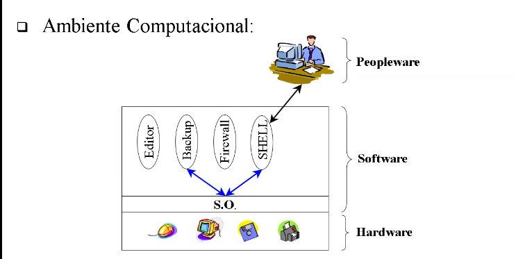

# Sistemas Operacionais

## _Contextualização_

- SO é um software que faz contato direto com o hardware e serve para auxiliar o uso do computador
- Exemplos: Linux, Windows, Solaris, etc..
- Estuda a arquitetura de sistemas operacionais
- Como que os sistemas operacionais funcionam por dentro
- O SO é o elemento central que controla todo o computador
- Todas as informações passam pelo SO
- Importância:
  - Ajuda a resolver problemas mais complexos
  
## **Introdução**

_**Conceitos básicos:**_

- **Sistema computacional**: hardware + software (SO && Software).

- **Ambiente computacional**: sistema computacional + peopleware (usuários).

- **Sistema operacional**: é uma interface entre as aplicações e o hardware, gerenciando recursos de hardware e software (processador, memória ram, rom, secundária, processos/entidades de execução, gerenciamento de rede).
  - Todas aplicações que utilizam o hardware, solicitam para o SO, o qual faz o precedimento diretamente no hardware.
  - Todas aplicações que comunicam entre si são subordinadas ao SO.
  - Um chamada de uma aplicação para o SO é chamada de _System Call_.

- **Núcleo/Kernel**: conjunto de rotinas que são inicializadas quando o computador é ligado, sendo carregadas para a memória.
  - Esperam ser acionadas pelo _System Call_ ou por interrupções do hardware.

- **Distribuição**: Kernel + Programas auxiliares do kernel + Aplicações para o usuário.
  - Windows, Ubuntu, Mac, IOS, Android, etc...

## **Conceitos de introdução**