# Sistemas Operacionais

## _Contextualização_

- SO é um software que faz contato direto com o hardware e serve para auxiliar o uso do computador
- Exemplos: Linux, Windows, Solaris, etc..
- Estuda a arquitetura de sistemas operacionais
- Como que os sistemas operacionais funcionam por dentro
- O SO é o elemento central que controla todo o computador
- Todas as informações passam pelo SO
- Importância:
  - Ajuda a resolver problemas mais complexos
  
## **Introdução**

_**Conceitos básicos:**_

- **Sistema computacional**: hardware + software (SO && Software).

- **Ambiente computacional**: sistema computacional + peopleware (usuários).


- **Sistema operacional**: é uma interface entre as aplicações e o hardware, gerenciando recursos de hardware e software (processador, memória ram, rom, secundária, processos/entidades de execução, gerenciamento de rede).
  - Todas aplicações que utilizam o hardware, solicitam para o SO, o qual faz o precedimento diretamente no hardware.
  - Todas aplicações que comunicam entre si são subordinadas ao SO.
  - Um chamada de uma aplicação para o SO é chamada de _System Call_.

- **Núcleo/Kernel**: conjunto de rotinas que são inicializadas quando o computador é ligado, sendo carregadas para a memória.
  - Esperam ser acionadas pelo _System Call_ ou por interrupções do hardware.

- **Distribuição**: Kernel + Programas auxiliares do kernel + Aplicações para o usuário.
  - Windows, Ubuntu, Mac, IOS, Android, etc...

## **Conceitos de introdução**

- Conceitos de Hardware e Software
  - Unidades Funcionais (ULA, UC, Registradores, Dispositivos de I/O, Memória Principal)
  - Registradores
  - Dispositivo de Clock
  - Memórias: Principal, Secundária, Cache

## **Processo de Ativação de SO (boot)**

- >***Firmwares: Softwares que vem gravado do fabricante (POST, SETUP Rotinas do BIOS)***
- >***As vezes a BIOS (Basic Input Output System) é mencionada como POST + SETUP + Rotinas do BIOS***

- **POST** (Power On System Test) - _É um programa_
  - Processador do computador, ao ser energizado ao ligar, o PC (Program Counter) aponta para o endereço do primeiro software a ser executado na ROM (POST)
  - POST é um Software/Firmware escrito em C/Assembly que é embarcado(armazenado) na ROM (Read Only Memory - ***Memória persistente diferente da RAM***)
  - Testa todos componentes básicos do computador para ver se é possível inicializa-lo (Memória, CPU, HD, dispositivos de saída, etc...)
  - Se tiver problema em um componente crítico do computador, sinaliza o erro e para a ativação do computador
  - Se não tiver algum problema, passa para próxima etapa de ativação do SO
- **SETUP** (Sofware/firmware opcional) - _"Pressione ESC"_
  - Firmware embarcado pelo fabricante que permite alterar configurações básicas do computador
  - Ferramentas de diagnóstico (Testar Hardware)
- **Rotinas do BIOS** (Software/firmware com rotinas genéricas gravadas pelo fabricante)
  - Rotinas com operações básicas (Leitura/Escrita no disco, Leitura do teclado, Escrita no dispositivo de saída padrão)
- **Carga de Boot Manager** (Caso exista)
  - Inicializado antes do SO, pois escolhe qual SO inicializar
  - Programa armazenado no disco na MBR(Master Boot Record), utilizado em sistemas computacionais que possuem mais de uma instalação de SO para inicializar
  - Responsável por carregar os Boot Loader's dos SOs no disco
- **Carga do Boot Loader do SO** (normalmente residente no primeiro setor de dados da partição do SO instalado)
  - Feito pelo fabricante do SO
  - Programa que fica no setor de boot numa partição do disco que está instalado o respectivo SO
  - O Boot Loader carrega o kernel do SO
- **Carga do Kernel do SO**
  - Inicializa suas rotinas, drivers, programas
  - Inicialização do SO em questão

## **Tipos de Sistemas Operacionais**

- Monoprogramáveis/Monotarefa
  - Somente um programa pode ser executado **por vez**
- Multiprogramáveis/Multitarefa
  - Vários programas podem ser executados **simultaneamente**
  - Permite multiusuários (usuários conectados de forma remota)
  - Batch (Conjunto/Lote)
    - Eram preparados lotes de programas para serem executados para o sistema operacional
  - Time-sharing (Tempo compartilhado)
    - Mainframe(CPU, Disco, Memória, etc...) compartilhado entre vários terminais(usuários com teclado e tela)
    - Todos usuários tem acesso simultâneo a uma mesma máquina
    - Muito mais complexo que o modelo em lote(batch)
    - Maioria das distribuições comerciais (Linux, Windows, etc...)
  - Tempo Real
    - Específico para sistemas que precisam operar em ambiente real em tempo real (Sistemas Críticos)
    - Sistema de mísseis, aviões, radares, etc...
- Múltiplos Processadores (possui vários processadores)
  - Fortamente Acoplados
    - Os processadores, memória principal, I/O,  estão no mesmo back-plane (placa do sistema)
    - Sistemas Simétricos (SMP)
      - Todos os processadores são iguais e funcionam da mesma forma
      - O suporte físico do back-plane (placa) limita o crescimento da quantidade de processadores
      - São comuns em computadores comerciais
    - Sistemas Assimétricos
      - Processadores são diferentes entre si em funções (especializado em parte gráfica, I/O de rede, cálculo, criptografia) e em especificações (4GHz, 2GHz)
      - São comuns em alguns minicomputadores e em sistemas específicos (alguns smartphones, consoles de videogames)
  - Fracamente Acoplados
    - Processadores não estão no mesmo back-plane, portanto não é limitada a quantidade de processadores
    - Um rack com várias placas mães
    - Necessidade de um SO que monitore essas várias back-planes
    - Sistema Operacional de Rede (NOS)
      - Permite que computadores se comuniquem entre si através de syscalls oferecidas pelo SO
    - Sistema Operacional Distribuído (DOS)
      - O SO gerencia o armazenamento de dados, execução de programas nos computadores que estão conectados entre si
      - O sistema de comunicação entre os computadores precisa ser muito eficiente e rápido
      - atualmente existe um gargalo que impede de ter um DOS em escala comercial
  
## Estruturas e Componentes

- Chamada de Sistema(system call)
- Grupos Funcionais
  - Gerência de Processador
  - Gerência de Memória
  - Gerência de E/S
  - Gerência de Arquivos
  - Comunicação em Rede
- Organização do Kernel
  - Monolítico
    - Primeiros modelos de kernels criados
    - As rotinas do kernel estão organizadas de forma muito coesas entre si, permitindo que as rotinas compartilhem estruturas e dados entre si
    - A manutenção em cima desse código é difícil devido a coesão das rotinas entre si
    - As rotinas estão tão coesas em um nível que ao carregar o kernel, todas as rotinas são levadas para a memória, podendo haver rotinas que nem sequer serão utilizadas
    - Porém é mais rápido, pois os dados são compartilhados e não é necessária criação de rotinas passando paramêtros copiados
  - Em camadas
    - Permite uma melhor manutenção do código
    - As rotinas estão bem separadas uma das outras, permitindo com que as rotinas possam ser executadas em diferentes modos de operação do processador(kernel/user mode)
    - Possui uma performance pior comparado ao monolítico, pois as interfaces não permitem que as funções compartilhem dados
    - Existe interfaces entre as rotinas para se ter uma integração coesa
    - Ainda não é possível previnir o carregamento de todas as rotinas para a memória
  - Microkernel
    - Neste as rotinas podem ser selecionadas para carregamento
    - As rotinas do kernel são carregadas para a user level, deixando apenas as rotinas mais baixo nível no kernel
    - As rotinas que estão no user level precisam acessar o kernel através de system calls que consomem tempo (desempenho menor comparado aos outros tipos de kernel)
    - Falhas em subsistemas(rotinas) não comprometem a execução do sistema, pois estão bem isoladas
    - Em sistemas multiprocessados, módulos podem ser executados em diferentes processadores mais facilmente, aproveitando o processamento dos processadores
    - As rotinas do kernel são separadas em vários programas, diferente dos outros kernels, na qual uma aplicação realiza uma syscall para o kernel

  
- Interface de System Calls

  
  - Um programa em C invoca o printf(), o qual por sua vez chama a system call write()
  
  - System Calls: Padronização
    - A marioria das syscalls usadas em sistemas UNIX (ou UNIX-like) estão definidas no padrão POSIX (Portable Operating System Interface for Unix)
      - A família de padrões POSIX é formalmente conhecida como IEEE 1003
      - Equivale ao padrão internacional ISO/IEC 9945
    - No Linux podemos ver as system calls na seção 2 do manual online (man pages)
      - man 2 system_call
        - ex # man 2 exit
      - man syscalls - apresenta todas as chamadas de sistema
  - System Calls vs. Rotinas de Biblioteca
    - No UNIX muitras system calls são encapsuladas por rotinas de biblioteca
      - C library (libc, glibc, ...)
    - Exemplo:
      - void _exit(int status) - system call
      - void exit(int status) - rotina da biblioteca
    - Algumas diferenças:
      - _exit não chama qualquer função registrada com atexit() ou on_exit().
      - _exit não fecha descritores de arquivos abertos
      - entre outras
    - O que é melhor? System Calls ou Rotinas de Biblioteca?
      
    - Ao realizar teste utilizando os comandos
      
    - percemos que a syscall perdeu drasticamente em quesito de performance comparado com a rotina de biblioteca, isso se deve pelo fato da rotina em C realizar um procedimento de bufferização internamente, evitando o chaveamento entre modo kernel e usuário de forma repetida no código System Call
  - Métodos de Entrada no Kernel
    - Na arquitetura x86, a entrada do Kernel via system call é implementada por meio de uma interrupção de software
      - No MSDOS: int 0x21
      - Windows NT/2000: int 0x2E
      - Linux (Kernel < 2.6): int 0x80
      - Solaris 2 (x86): SYSENTER/SYSEXIT
      - Linux (Kernel 2.6): SYSENTER/SYSEXIT
      - Windows XP/Vista: SYSENTER/SYSEXIT
    - Além das chamadas de sistema outras duas formas de entrada no Kernel são:
      - Interrupções de hardware
      - Hardware trap (específicas do processo)
        - Ex: divisão por zero
  - Exemplo de Estrutura de Kernel (Modelo Unix SVR4)
    

## **Modelo de Processos/Threads**

### Modelo de Processo

- Processo: é uma instância de um programa em execução

  
  - Programa é o executável, quando acionado, solicita para o SO criar um processo do programa na memória (instância), o qual vai ser executado pelo processador
  - Programa é estátic, e processos são dinâmicos
  - O que roda na memória principal é o processo, não o programa
- Programa vs. Processo
  
  
  

  - Normalmente o processo tem espaço maior do que o programa executável, pelo fato do programa poder alocar memória, ocupando mais espaço do que o tamanho desse ao ser transformado em processo, mas pode ser menor ou igual também.
  
  
  - Na pilha de execução que são armazenadas as execução de funções, criação de variáveis locais, retornos de função e endereços de retorno após termino de execução de uma função
  - Se a stack cresce até a Heap, ocorre "stack overflow", se a Heap cresce até a stack, ocorre a "stack overrun"
  - Entry point sinaliza aonde é o início do da rotina principal do código (main)
- Principais Características (Processo)
  - Modos de Execução
    - Usuário (user mode)
    - Kernel (kernel mode)

    
  - Estados
    - Pronto, Esperando, Executando

    
  - Hierarquia
    - Processo, sub-processo

    

  - Identificação
    - PID, credenciais

    
- Gerenciamento (Processo)
  - Identificação + Credenciais
    - Controle de Acesso
    - Contabilização de recursos
    - Quotas de utilização
    - Logs de auditoria
    - outros...

### Implementação Interna

- Bloco de controle de processos (PCB)
  - Estrutura interna ao sistema operacional
  - Armazena todas informações a respeito do processo
  - Normalmente implementado como uma lista ligada ou vetor de estruturas
  - Acessível somente pelas rotinas do kernel
  - O PCB materializa o conceito de processo, armazenado o estado do processo, argumentos da linha de comando, PID, UID, GID, registradores, limites de memória (limita o uso do processo, impedindo situaçao de monopolização de recursos de hardware), lista de arquivos aberta
  - Cada PCB referencia outros PCB's que foram criados por um programa, criando várias estruturas, por isso a necessidade de limitar o uso dos processos
  - O PCB no linux é implementado por uma Árvore Rubro negra, diferentemente de uma lista ligada

- Contextos (Hardware/Software)
  - Hardware (conteúdo dos registradores)
    - PC(program counter)
    - Stack Pointer
    - Flags de estado
    - demais registradores
  - Software (recursos/atributos do processo)
    - Arquivos abertos
    - Tamanho dos Buffers de I/O
    - Tempo de execuçao
    - Identificação
    - Credenciais
    - outros...

### Modelo de Threads

- Conceito: É um fluxo de execução interno a um processo, sendo que um processo pode ter uma thread(singlethreaded), ou várias (multithreaded)
  - Cada thread tem uma call stack
  - Cada processo é criado com uma thread (fluxo de execução) chamada de main thread
  - O processo na mainthread cria outras threads, gerando um processo multithread
  - Todas a threads são independentes das outras, um bloqueio de I/O não interrompe as outras threads
  - As threads são concorrentes, pois disputam o mesmo tempo de processamento
- Vantagens
  - Economia de recursos do sistema
  - Melhor organização com requisitos de concorrência
  - Uso eficiente de multiprocessadores (*)
- Desvantagens
  - Introduz maior complexidade
- Paralelismo
  - Processos SingleThreaded executam em um único processador a sua mainthread
  - Já processos Multithreaded podem ter suas threads executadas por diferentes processadores, permitindo um paralelismo de thread
- TCB (Thread Control Block) - são as representações das threads, tendo a mesma ideia do PCB
  - Thread ID (tid)
  - Registradores de estado (inclui PC e SP)
  - Pilha
  - Máscara de sinais
  - Prioridade
  - Armazenamento privado
  - Outros...

### Exemplo de Criação de Processos/Threads

#### Criando processos

- Uso: pid_t fork(void);
- A chamada de sistema fork() returna um valor zero para o filho e o valor do PID do filho para o Pai
- O pai normalemente espera o filho terminar antes de encerrar (usando wait())
- O filho retorna um status de término para o Pai
- Após ser criado, um processo filho pode executar um novo programa (diferente do pai) por chamar exec().
  - fork() e exec() são usadas em conjunto para executar um programa qualquer

    
- Outra chamada de sistemas usada para criação de processos é o **vfork()**
  - Possui a mesma sintaxe de utilização do fork()
- vfork() bloqueia o processo Pai até que o filho chame exec()
- É uma chamada criada para evitar o overhead de um fork() para processos que irão invocar exec()

#### Criando Threads (pthreads)

- Uso:

```c
#include <pthread.h>
int pthread_create(pthread_t * thread, const pthread_attr_t * attr, void * (*start_routine)(void *), void * arg);
```

- thread - retorna o thread id
- attr - NULL para os valores default
- start_routine - ponteiro para a função que será executada pela thread
- arq - ponteiro para o argumento da função. Para passar múltiplos argumentos, use um ponteiro para estrutura (struct)

- Uso:

```c
#include <pthread.h>
int pthread_join(pthread_t * th, void ** thread_return);
```

- th - thread chamadora suspensa até que a thread identificada por th termina
- thread_return - Se o retorno da thread th é diferente de NULL, então o valor de retorno é armazenado em thread_return

- Uso:

```c
#include <pthread.h>
int pthread_exit(void * retval);
```

- retval - valor de retorno da thread
- Essa rotina encerra a thread, portanto, ela nunca retorna

## **Comunicação entre processos(IPC)**

### Introdução

- Inúmeras aplicações são programadas em forma de vários processos cooperantes
- Estes processos cooperam entre si compartilhando recursos e informações
- O kernel do SO deve prover os mecanismos necessários para estas implementações
- Estes mecanimos são comumente chamados de IPC
- Processo A <-> Processo B, é uma abstração mas as informações passam pelo SO

### Propósitos Principais

- Transferência de Dados
  - Ex: FTP, ICQ, etc.
- Compartilhamento de Dados
  - Ex: Variáveis de controle entre processos cooperantes
- Notificação de Eventos
  - Ex: O Processo filho notifica seu processo pai de sua conclusão
- Compartilhamento de Recursos
  - Ex: Gerenciamento de fila de impressão
- Controle de Processos
  - Ex: Depuração de um processo em tempo de execução (debugging)

### Aplicações

- Sistemas Servidores:
  - WEB
  - email
  - Impressão
  - Arquivo, etc.
- Sistemas Comerciais:
  - Controle de conta corrente
  - Controle de estoque
  - Controle de passagens (avião, ônibus, etc.)
  - etc...

### Modelo Produto-Consumidor


### Exemplo de Utilização Modelo Produto-Consumidor

- MS-DOS:
  - C:\type texto.txt | more
- UNIX:
  - % cat texto.txt | more
  - % ls -l | grep filename | wc -l
- "Pipe é um exemplo de mecanismo, fornecido pelo sistema operacional, para a realização de IPC"
- Outros mecasnismos:
  - Shared memory
  - Signals
  - Semaphores
  - Message Passing/ Message Queues
  - Ports

### Mecanismos de IPC

- Como um processo comunica con outro?
  - Signal: Um processo notifica outro através de uma interrupção de software (Ex. kill do unix)
  - Semaphore: Processos bloqueados, aguardando sua vez, recebem uma notificação (signal)
  - Pipes: Fluxo de comunicação unidirecional
  - Message passing: Processos enviam e recebem mensagens (send/receive), podendo a comunicação ser individual (dois processos) ou em grupo

### Exemplos de Aplicação

- SIGNAL
  - Similar a uma interrupção de hardware
  - A comunicação se dá de forma assíncrona. O processo que recebe o sinal para sua execução
  - Alarmes (ex. unix alarm()) é uma forma de programar recepção de sinais enviados pelo SO
  - É comum o SO avisar a aplicação de eventos do sistema, tais como: (disk quota, CPU time, divide by zero, etc.) através de sinais
- SEMAPHORE
  - Utilizado para sincronização de processos
  - A interface do semáforo é visível por todos os processos comunicantes
  - Garante atomicidade das operações
  - Utilizado para implementar a exclusão mútua de processos
- PIPE
  - Um processo escreve e o segundo processo efetua a leitura (ex. % ls | more)

    
  - shell:
    1. Cria um pipe
    2. Cria um processo para o comando (ls), configura a saída (stdout) de ls para escrever no pipe
    3. Cria um processo para o comando (more), configura a entrada (stdin) de more para ler do pipe
- MESSAGING PASSING
  - Processos enviam e recebem mensagens através de primitivas de comunicação (send/receive)
  - A comunicação pode ser síncrona ou assíncrona
  - A comunicação pode ocorrer entre dois processos ou em grupo
  - A comunicação pode ser realizada no mesmo sistema (LPC - local process communication) ou entre sistemas remotos (RPC - remote process communication)

  

### Compartilhamento de Recursos

- Ex: Sistema Bancário - controle de conta

```c
READ(Arq_contas, Reg_cliente);
READ(valor_dep_ret);
Reg_cliente.Saldo = Reg_cliente.Saldo + valor_dep_ret;
WRITE(Arq_contas, Reg_cliente);
```


#### Solução: *Exclusão mútua*

- Evitar com que mais de um processo execute sua região crítica
- Região crítica é a seção de código dos processo que fazer acesso ao(s) recurso(s) compartilhado(s).

```c
READ(valor_dep_ret);
READ(Arq_contas, Reg_cliente);          // Região Crítica
Reg_cliente.Saldo = Reg_cliente.Saldo + valor_dep_ret;                          // Região Crítica
WRITE(Arq_contas, Reg_cliente);         // Região Crítica
```

- Uma boa solução de exclusão mútua deve:
  - Evitar que processos acessem ao mesmo tempo suas RC
  - Processos fora de sua RC não podem bloquear outros processos
  - Processos devem ter garantias de entrada na RC, envitando uma espera infinita
- A implementação da Exclusão Mútua exige a sincronização entre processos
  - Principais Problemas envolvendo sincronização:
    - velocidade de execução dos processos
    - Starvation
    - Sincronização condicional
- SOLUÇÃO: Exclusão Mútua
  - Principais Problemas:
    - Velocidade de execução dos processos

    
- SOLUÇÃO: Exclusão Mútua
  - Principais Problemas:
    - Starvation
      - Prioridades/aleatoriedade: Escaloanamento justo (FIFO)
    - Sincronização condicional
      - ex. produtor/consumidor
- SOLUÇÃO: Exclusão Mútua
  - Soluções de Hardware:
    - Desabilitar Interrupções
    - TSL (Test and Set Lock) - operação em assembly
- SOLUÇÃO: Exclusão Mútua
  - Soluções de Software:
    - Semáforo (Dijkstra)
      - Primitivas Up e Down
      - Operações atômicas, implementadas como system calls

      
      
- SOLUÇÃO: Exclusão Mútua
  - Principais Problemas:
    - Starvation - Prioridades/aleatoriedade: Escalonamento justo (FIFO)
    - Sincronização condicional - ex. produtor/consumidor
- SOLUÇÃO: Exclusão Mútua
  - Soluções de Software:
    - Monitores (Hoare)
      - Remove do programador, parte das responsabilidades da programação com semáforo
      - Encapsula procedimentos e variáveis utilizadas na programação de semáforos
      - Implementado como um módulo (classe) que automaticamente realiza o sincronismo entre os procedimentos utilizados
      - A implementação da exclusão mútua é realizada em tempo de compilação

      
- TROCA DE MENSAGENS
  - usada para sincronização e comunicação entre processos:
    - SEND(PID, MSG) / RCV(PID, MSG)
  - Endereçamento
    - Direto
    - Indireto
  - Modo
    - Síncrono (rendezvous)
    - Assíncrono

#### DEADLOCKS

- Quando processos se bloqueiam mutualmente na espera de um recurso indefinidamente
- Dois processos (multitask) querendo imprimir um arquivo na impressora:
  - Processo A bloqueia arquivo
  - Processo B bloqueia impressora
  - Processo A tenta usar a impressora
  - Processo B tenta abrir o arquivo
- Recursos preemptíveis e não preemptíveis
  - Ex. memória (preempção) / impressora (não preempção)
- Condições para deadlock (Coffman et al. 1971):
  - Condição de exclusão mútua
  - Utilização de dois ou mais recursos exclusivos
  - Recursos sem preempção, liberados explicitamente pelo processo
  - Condição de espera circular. Um encadeamento de dois ou mais processos que esperam pelo próximo processo da cadeia

  
- Garantir que uma ou mais das condições anteriores não ocorra:
  - Condição de exclusão mútua
    - Problemas de compartilhamento de recursos
  - Utilização de dois ou mais recursos exclusivos
    - Alocação antecipada, o que pode causar sub-utilização
  - Recursos sem preempção, liberados explicitamente pelo processo
    - Garantir preempção. Problemas de starvation e inconsistência podem ocorrer
  - Condição de espera circular. Um encadeamento de dois ou mais processos que esperam pelo próximo processo da cadeia
    - Excluir a possibilidade de múltiplas alocações de recursos exclusivos ao mesmo tempo.

#### PREVENÇÃO DE DEADLOCKS

- Detecção:
  - Utiliza estruturas internas no kernel do SO
  - Algoritmos de busca são específicas para cada SO, tais como time sharing e de tempo real
  - Gera grande overhead no kernel, por isso, normalmente não se implementa tais funcionalidades
- Correção:
  - Preempção: Retirar recurso(s) de um processos fornecendo-o para outro processo
  - Rollback: Utilização de checkpoints
  - Processos killing: Remove um ou mais processos de cadeia de dependências

## **Gerenciamento de processador**

### Mecanismo de Interrupção de Processador (Timer Interrupt)

  

1. Salva os registradores não salvos pelo hardware
2. Configura o novo contexto do tratador da interrupção
3. Configura a pilha para o código de tratamento da interrupção
4. Confirma interrupção para o controlador de interrupções (APIC)
5. Copia os registradores salveos para a PCB do processo
6. Executa o código do tratador da interrupção (interrupt handler)
7. Escolha qual o próximo processo será executado
8. Configura o SO para assumir o contexto do novo processo (espaço de endereçamento, pilha, etc.)
9. Carrega os registradores com os dados do novo processo, incluindo o PC (program counter)
10. Inicia a execução do novo processo

### Escalonamento

#### Tipos de Processos

- CPU Bound: A maior parte do tempo, o processo se mantém rodando na CPU até o seu tempo máximo
- I/O Bound: processo realiza mais operações de I/O bloqueantes do que processamento da CPU (processo sai da CPU antes do tempo máximo)

#### Critérios de Escalonamento

- Utilização da CPU
- Throughput (nTasks/unid. tempo)
- Turnaround
- Tempo de Resposta

#### Escalonador de processos

- Invocado a cada n clock ticks

  

#### Tipos de Escalonamento

- Não-preemptivo
  - O processo executa na CPU até seu término ou repasse voluntário do recurso
  - Não existe interferência do SO
- Escalonamento preemptivo
  - A execução dos processo é interrompida pelo SO
  - Cada troca de contexto gera um custo (overhead) para o sistema
  - O mecanismo utilizado é normalmente a interrupção de clock
  - Políticas de escalonamento fornecem parâmetros para os mecanismos de escalonamento (algoritmos)
- Não-preemptivo
  - FIFO: Utilização da CPU por ordem de chegada na fila
  - SJF (shortest-job-first): Processos com menor tempo de execução são selecionados primeiro
  - Cooperativo: Os processos liberam voluntariamente a CPU. Ex. MS-Windows 3.1/3.11
- Preemptivo
  - Round-robin (circular): Baseado em time-slice/quantum
    - Garante a execução das tarefas pela intervenção do SO, sendo esta sua principal vantagem em relação aos modelos não preemptivos
    - Sua deficiência reside no tratamento não diferenciado entre processos CPU-bound e IO-Bound

      
  - Prioridades: Permite diferenciar processos I/O bound de CPU bound. A prioridade pode ser estática ou dinâmica
    - Processos IO-Bound possuirão maior prioridade em relação a processo CPU-Bound
    - As prioridades podem ser:
      - Estáticas: Atribuídas na criação do processo permanecendo durante toda a vida do processo
      - Dinâmicas: Mudam de acordo com o comportamento do processo
    - Exemplo: priority (1 \* quantum)/f, onde f = fração de tempo utilizada do quantun
      - PID(100 - CPUbound): priority = (1 \* 300)/300 = 1
      - PID(340 - IObound): priority = (1 \* 300)/2 = 150
    - Em muitos sistemas UNIX-like, o comando nice é utilizando para alterar a prioridade de processos

      
  - Múltiplas Filas: Existem várias filas de processo prontos. Processos na mesma fila são tratados de forma igual, contudo, as filas entre si são tratadas em nível de prioridade. Ex. Filas de processos I/O bound tem maior prioridade qu as filas de processo CPU bound

## **Gerenciamento de memória**

### Estratégias de Alocação

#### Sistemas Monoprogramados (Alocação Contígua)

- O usuário tem controle sobre toda memória
- O SO pode ser protegido, através de registrador de violação de acesso
- Caso o processo não use toda a memória, existirá sub-utilização do recurso
- Os processos eram limitados ao tamanho da memória
- A utilização de técnicas de *overlay* foi utilizada para executar processos maiores que a memória principal

  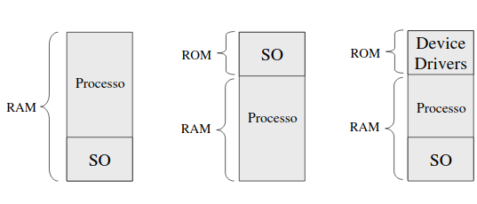
- *Técnica de Overlay*

    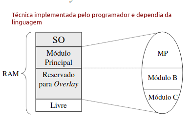

#### Sistemas Monoprogramados (Alocação Contígua - resumo)

- Utiliza alocação contígua simples
- Contorna o problema do tramanho do processo na memória atrvés de técnicas de *overlay*
- Pode-se beneficiar de proteção de memória por registrado de controle de acesso

#### Sistema Multiprogramados

- Alocação Particionada (Estática)
  - Absoluta (Endereços físicos são absolutos em toda a memória)

    
  - Realocável

    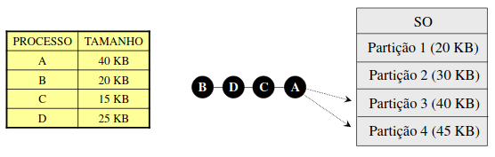

- Alocação Particionada Estática: Problema de Fragmentação!

  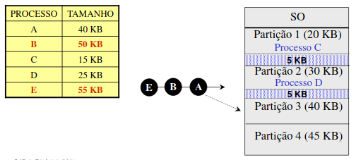
  - **Dinâmica**: Primeira tentativa de solução
    - Não existe mais o conceito de partições de tamanho fixo
    - A memória é alocada por demanda

      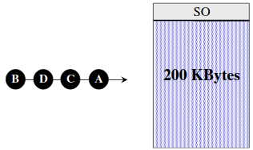

- Alocação Particionada Dinâmica:
  - A dinâmica de liberação de pequenas áreas de memória causam novamente a fragmentação

    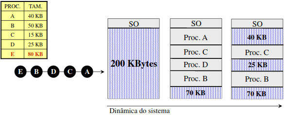

- Alocação Particionada Dinâmica com Relocação:
  - Introduz algoritmos de busca e compactação de áreas de memória
  - Não elimina por completo o problema de fragmentação, mas ameniza bastante
  - Incrementa sensivelmente a sobrecarga no sistema, devido a execução contínua deste algoritmos
  - Em caso do processo solicitar mais memória ao sistema (Ex. heap, stack segment) esta solução é inviável

### Escolha da Partição

#### Estratégias

- First-fit
  - Escolhe a primeira partição livre com tamanho suficiente para acomodar o processo
- Best-fit
  - Escolhe a partição que o processo deixará o menor espaço sem utilização
- Worst-fit
  - Escolhe a partição que o processo deixará o maior espaço sem utilização

### Swapping

- Permite a criação de um número maior de processos do que o total suportado pela memória principal
- Processos são armazenados em disco (swap-out) para dar lugar a outros processos. Ao retornar do disco para a memória principal (swap-in), o processo interrompido continua sua execução do ponto que ele parou
- O principal problema é a relocação do processo no swap-in. Esperar pela partição inicial resolve, contudo, não é viável na prática

### Relocação Dinâmica

- A solução é utilizar a relocação dinâmica:
  - Um registrador de relocação é utilizado
  - Ao ser carregado, o registrador de relocação recebe o endereço inicial da memória física
  - Qualquer referência à memória pelo processo, passa pela MMU (memory management unit), que adiciona à referência o endereço inicial armazenado no registrador de relocação
  - O acesso à memória, realizado pelo processo, usa o endereço produzido pela MMU

#### Endereço Lógico e Físico

  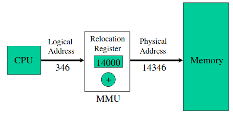

### Memória Virtual

- É a técnica de combinar a memória principal com a secundária, formando um único espaço de endereçamento
- Os processos não endereçam a memória principal diretamente, fazendo referência a posições virtual
- Os endereços virtuais são mapeados para o endereçamento real
- O papel do compilador é essencial para o sucesso deste mecanismo de endereço virtual
- Metáfora do Vetor: Ilustração de Endereçamento Virtual e Mapeamento

  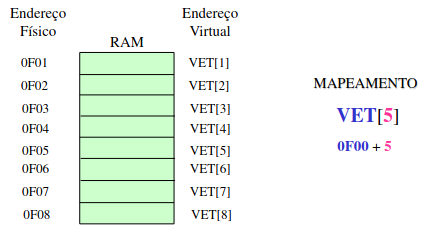
- Mapeamento: Todo processo tem uma ou mais tabelas de mapeamento

  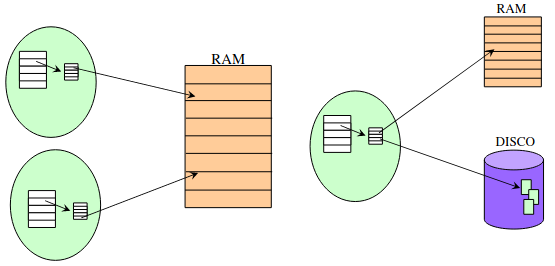

### Memória Virtual - Paginação

- Divida o espaço de endereçamento virtual em unidades de tamanho fixo chamadas páginas (frames);
- O mapeamneto é realizado em nível de páginas através de tabelas de páginas (PT)
- O endereçamento virutal é realizado usando um número de página e um deslocamento (offset) dentro desta página
- Na tabela de páginas, um campo de presença (present/absent bit) indica se a página referenciada está na memória principal ou não;
- Quando um processo referencia um endereço virtual que, ao ser mapeado, aponta para uma página que não está presente na memória principal (RAM), esta condição é chamada de page fault
- Quando ocorre um page fault, as páginas solicitadas são transferidas da memória secundária para a principal
- O processo de carregamento de páginas da memória secundária para a principal é chamado de paginação por demanda
- Páginas de memória principal, que não estão sendo utilizadas ou são pouco utilizadas, são descarregadas na memória secundária, cedendo seu lugar para novas páginas
- Uma tendência é a utilização de paginação antecipada, de forma ampliar a performance do processo de paginação
- Páginas da memória principal, que não estão sendo utilizadas ou são pouco utilizadas, são descarregadas na memória secundária, cedendo seu lugar para novas páginas
- Uma tendência é a utilização de paginação antecipada, de forma ampliar a performance do processo de paginação
- Para cada page fault existirá no mínimo uma operação de I/0 em disco
- A taxa de page faults gerada por um processo depende de como a aplicação foi desenvolvida e da política de gerenciamento de memória
- O sistema deve procurar manter, em memória principal, aquelas páginas com acesso mais frequente (working set)
- O working set de um processo está relacionado com o conceito de localidade, que é a tendência em se referenciar posições de memória uniforme por períodos de tempo
- A partir do conceito de localidade o modelo de working set foi definido por (Denning 1970)
- Working set e Localidade:

  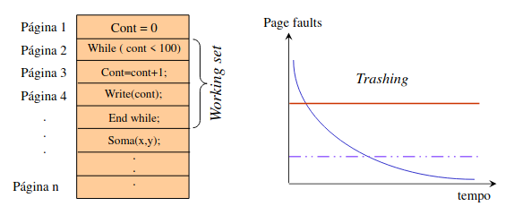
- Estrutura do Programa:
  - considerando:

    ```c
    char A[1024][4096];
    for(j = 0; j < 4096; j++) 
      for(i = 0; i < 1024; i++) 
        A[i][j] = 0;
    ```

  - suponha:
    - processo ocupa 1 página (frame) na (RAM)
    - Para alocação do vetor, cada linha ocupa 1 página na VM(1024 páginas) => 1024 x 4096 page faults!
- Estrutura do Programa:

  ```c
  char A[1024][4096];
  for(i = 0; i < 4096; i++) 
    for(j = 0; j < 1024; j++) 
      A[i][j] = 0;
  ```

  - Neste caso somente 1024 page faults!
  - Compiladores:
    - Separam código de dados
    - Mantêm rotinas que chamam outras juntas
- No processo de realocação de páginas, a escolha das página que serão swapped out é muito importante para o desempenho do sistema de VM
- Páginas modificadas devem obrigatoriamente serem armazenadas para futura carga
- A melhor estratégia de realocação seria aquela que escolhesse uma página que não fosse referenciada num futuro próximo
- A estratégia de realocação é fundamental para o desempenho da VM
- Estratégia de troca de página:
  - Aleatória: Qualquer página do working set tem a mesma chance de ser selecionada
  - FIFO: A página que foi utilizada primeiro é utilizada
  - NRU(Not-Recently-Used): Páginas que não foram recentemente utilizadas
  - LRU (Least-Recently-Used): Páginas menos recentemente utilizada
  - LFU(Least-Frequently-Used): Seleciona a página menos referenciada. As páginas mais utilizadas são conservadas
- Estratégias de troca de página (FIFO):
  - O SO mantém uma lita encadeada de páginas ordenada pela carga das páginas na memória (frames)
  - A cada page fault, a entrada (página) no início da lista é escolhida para ser substituída
  - Possui baixo custo de implementação
  - Páginas sendo usadas atualmente podem ser selecionadas, o que é indesejável
- Estratégias de troca de página (NRU):
  - É necessário manter estatísticas de uso das páginas
    - bits de controle estão presentes em cada entrada na tabela de página
    - Reference bit (R) e Modified bit (M):
      - R -> página acessada (leitura/escrita) M -> paǵina modificada (escrita)
  - Quando o processo é criado, os bits R e M das suas página são zerados
    - Esses valores são alterados a cada acesso feito nas páginas
  - Periodicamente (ex. cada clock tick) o bit R é zerado
  - A cada page fault o SO percorre todas as entradas da tabela de página do processo que estão residentes (presentes) na memória e as organiza em classes
- Estratégias de troca de página (NRU):
  - Classe 0 (00): Não Referenciada, Não Modificada.
  - Classe 1 (01): Não Referenciada, Modificada.
  - Classe 2 (10): Referenciada, Não Modificada.
  - Classe 3 (11): Referenciada, Modificada.
  - Após a classificação das páginas residentes, remove uma ou mais páginas, aleatoriamente, dentre as classe de ordem mais baixa (00, 01, ...)
  - Possui bom desempenho
  - Necessário suporte de hardware (ou emulação por software) dos bits de controle
- Estratégias de troca de página (LRU):
  - Considere que páginas usadas nas últimas instruções provavelmente serão usadas nas próximas instruções
    - portanto, o objetivo é não remover essas páginas e sim aquelas há mais tempo sem terem sido usadas
  - O SO mantém uma lista encadeada de todas as páginas na memória (página usada mais recentemente no início e página usada menos recentemente no final da lista)
  - A lista deve ser atualizada a cada referência (acesso) à memória
    - custo elevado mesmo sendo feito via HW
- Estratégias de troca de página (LFU):
  - A cada page fault, a página com menor número de referências (acessos) é substituida
  - Necessária um contador de acessos por página (HW ou SW)
  - Sofre influência de páginas que foram muito acessadas no início da execução do processo e não são mais usadas
    - uma solução pode ser deslocar a contagem 1 bit à direita, em intervalos regulares (ex. n clock ticks)
- Segmentação:
  - Os programa são dividos logicamente em blocos (segmentos) na memória
  - Cada segmento, que acomoda parte do processo na memória, possui tamanho diferente do demais segmentos que armazenam o processo
  - O mecanismo de mapeamento é praticamento e o mesmo do modelo de paginação
  - Cada entrada na tabela possui o tamanho do segmento tendo em vista que os segmentos não são de tamanho fixo

    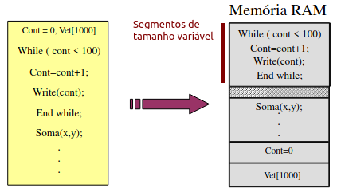
- Segmentação com Paginação:
  - O endereço virtual = Nr. do segmento + Nr. Pág. + Deslocamento da página (offset)
  - As páginas possuem tamanho fixo mas os segmentos possuem tamanho variável
  - A acomodação do processo é baseada em segmentos
  - O processo de paginação por demanda é realizado sobre as páginas
- Compartilhamento de Memória:
  - Vários processos utilizam a mesma área de código (reentrância) evitando várias cópias do mesmo código na memória
  - Em sistemas que implementam VM, cada tabela de mapeamento aponta para a mesma área de memória a ser compartilhada
  - Para o compartilhamento de memória, a segmentação é mais indicada por considerar as estruturas lógicas dos programas, facilitando o compartilhamento
  - O compartilhamento se restringe a regiões de memória do tipo read-only. Segmentos/páginas que sofrem operações de escritas são copiadas (COW - copy on write)

    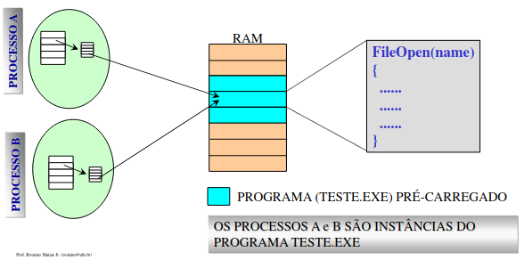
- Arquivos Mapeados em Memória
  - Permite a manipulação de posições do arquivo da mesma forma como nas operações em memória
    - X = 10 (Memória)
    - Record.X = 10 (Arquivo mapeado)
  - O arquivo é mapeado no espaço de endereçamento do processo
  - O mapeamento deve contemplar todo o arquivo ou apenas partes do mesmo
  - Exemplo de system calls:
    - MAP, UNMAP, MSYNC, etc.

  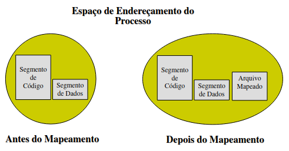
  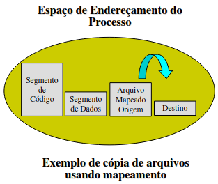
  - MMAP()

    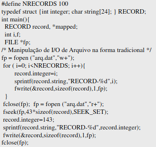
    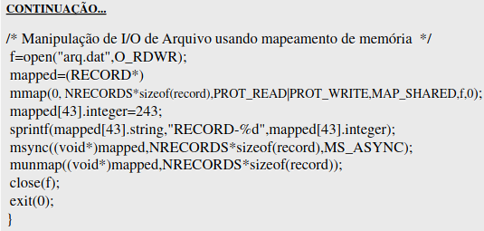

### Hardware

- O subsistema de gerenciamento de memória depende do hardware para executar várias tarefas
- O componente de hardware responsável por essas tarefa é a MMU (Memory Management Unit)
  - a MMU situa-se entre a CPU e a memória principal
  - a tarefa primária da MMU é a tradução de endereços virtuais para endereços reais
- Tabelas de páginas (page tables - PT) são usadas para auxiliar no processo de mapeamento de memória virutal para real
- Tipicamente, existe uma PT para o Kernel e uma ou mais por processos
- Uma tradução de endereço pode falhar pelas segintes razões
  - Bound error: O endereço não está na faixa de endereço válido para o processo. Não existe PTE (Page Table Entry) para a página
  - Validation error: A PTE é marcada inválida. Normalmente isso ocorre porque a página não está na memória principal (gera a exceção de page fault)
  - Protection error: A página não permite o tipo de acesso desejado (ex. acesso de escrita em uma página read-only, tentativa de execução de uma página NX)
    - A funcionalidade NX é denominada pela Intel de XD (eXecute Disable) e pela ADM de EVP (Enhanced Virus Protection)
- Quando ocorrem os caso acima a MMU gera uma exceção e passa o controle para um handler do Kernel
  - em nível de kernel todas exceções dessa natureza são consideradas page fault
  - o handler recebe o tipo de exceção e realiza seu tratamento específico
- Em casos onde a page fault não é resolvida trazendo a página para a memória, o handler notifica o processo enviando um sinal SIGSEGV
- Toda vez que uma página sofre uma escrita, o modified bit é ligado na PTE da página
- Esse bit é usado pelo Kernel para identificar dirty pages que devem ser sincronizadas com o conteúdo na memória secundária
- Se o hardware suporta referenced bit na sua PTE, então para cada referência para a página esse bit é marcado
  - isso permite ao Kernel controlar as páginas que estão sendo usadas e aquelas que podem ser recicladas

### Hardware (Intel x86)

- Exemplo de linear address space no Linux (IA-32)

  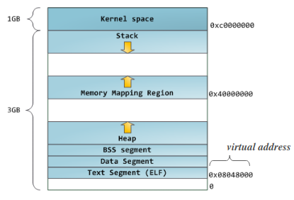
  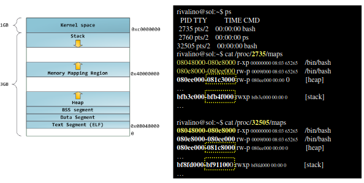
- Mapeamento em 2 níveis no x86

  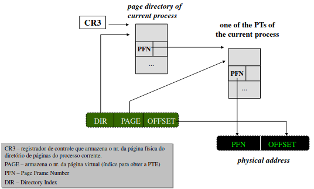
- Formato da PTE

  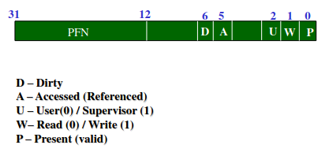

## **Sistema de Arquivos**

### Conceitos Básicos

#### Arquivos

- Dados armazenados de forma persistente
- Possui os seguintes atributos:
  - Nome: Uma forma amigável de referência do recurso
    - Formato: Composição, Tamanho, Conjunto de caracteres permitidos, etc.
  - Estrutura: Sequência de bytes, Conj. de Registrados do mesmo tipo, registro de tipos diferentes, etc
  - Tipos:
    - Diretórios: Conjunto de arquivos
    - Regulares: ASCII ou Binários
    - Especiais: Representam algum recurso/dispositivo do sistema
  - Acesso:
    - Sequencial
    - Aleatório
- Possui os seguintes atributos (cont.):
  - Atributos: Dependente de cada sistema, são exemplos:
    - Proteção (read, write, execute, cópia, execução, etc.)
    - Propriedade: (criador, dono, grupo de acesso, etc.)
    - Acesso: (data da criaçao, último acesso, modificação, etc.)
    - Tamanho: (bytes armazenados, tamanho máximo definido, etc.)
  - Operações de manipulação
    - Criação/Remoção
    - Abertura/Fechamento
    - Leitura/Escrita
    - Inserção (Append)
    - Localização (Seek)
    - Mascaras de Atributos (Get/Set)
    - Renomear
    - Truncar
    - outras...
- Ex. disco rígido:

  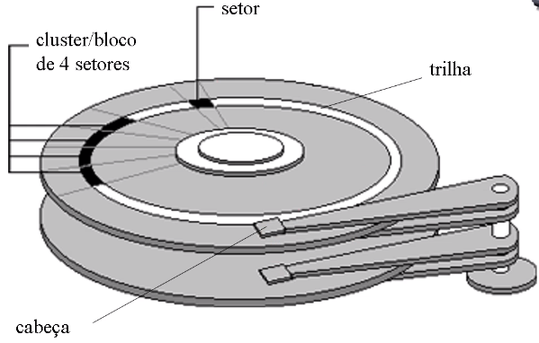
  - O número de trilhas por disco, setores por trilhas e bytes por setor é determinado pela formatçaão física do disco
    - realizada pelo fabricantes
  - O número de setores por cluster é determinado pela formatação lógico que dependerá do tipo de sistema de arquivos
  - Essas configurações dependem diretamente da capacidade de armazenamento do disco
    - Algumas (ex. setores por cluster) dependem do tamanho da partição
- Setor é a menor unidade de armazenamento físico no disco
- Cluster é a menor unidadade de armazenamento lógico
- Portanto, podemos afirmar que:
  - um cluster é composto de no mínimo 1 setor
  - um arquivo ocupa, no mínimo, um cluster
- Quanto de espaço físico é necessário para armzenar um arquivo de 1 byte
- Considere a seguinte configuração
  - Capacidade: 500 Mbytes
  - Bytes por setor: 512
  - Setores por Cluster: 8
- Nesse caso, um arquivo de 1 byte ocupa fisicamente no disco 8 x 512 = 4096 bytes
- Capacidade máxima em arquivos de 1 byte seria 128 mil arquivos
  - Isso significa apenas 125Kbytes armazenados

### Organização Interna

#### Arquivo

  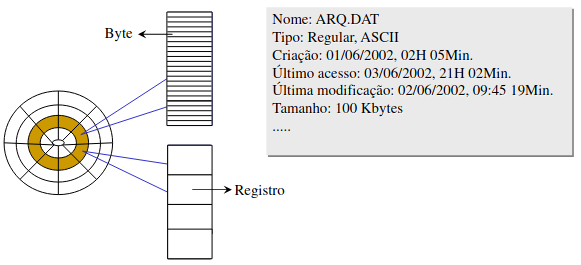

#### Diretório

- Estrutura de armazenamento de dados sobre arquivos

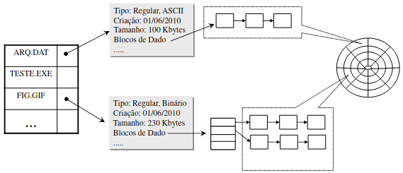

#### Controle de Espaço Livre

- Mapa de Bits
  - Armazena informações sobre blocos livres/utilizados do disco
- Ligação Encadeada
  - Cada bloco (livre) aponta para o próximo bloco disponível
- Tabelas de Blocos Livres
  - A tabela contém uma entrada para o primeiro bloco e a quantidade de blocos livres contíguos ao endereço apontado

#### Alocação de Espaço

  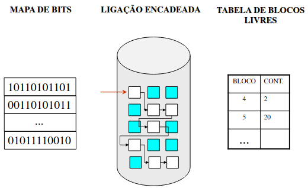

- Alocação Contígua
  - Aloca a quantidade de blocos necessários para armazenar o arquivo. Todos os blocos devem estar dispostos contiguamente
  - Problema: Fragmentação dos blocos livres após certo tempo de uso e a necessidade de alocar blocos em séris
  - Solução: Rotinas de Defragmentação amenizam a fragmentação
- Alocação Encadeada
  - Cada bloco aponta para o próximo, que não necessariamente precisa estar contíguo a ele
  - Problema: Fragmentação do arquivo, causando aumento no tempo de acesso. O acesso só pode ser realizado de forma sequencial
  - Solução: Rotinas de Defragmentação amenizam a fragmentação
- Alocação Indexada
  - Existe um bloco de índice com ponteiros para os blocos de dados
  - Elimina a limitação do acesso sequencial
  - Remove os ponteiros dos blocos de dados
  - Exige estrutura adicional para o bloco de índice

#### Segurança

- Mecanismos:
  - Senha e Acesso: Arquivo, Diretório, Filesystem
  - Grupo de Usuários: Arquivo, Diretórios
  - ACL (access control list): Lista de controle de acesso, associada ao arquivo, especificando o(s) usuário(s) e a(s) operação(ões) que pode(m) ser executada(s)
    - TESTE.EXE (Aluno1, RW-, Aluno2R-X, ...)
  - Capabilities Lists (C-lists): Informações de sessão que especificam o que um processo pode fazer baseado em suas credenciais (UID, GID, SysTime, etc.)

#### Confiabilidade

- Gerenciamento de Bad Blocks
  - Normalmente implementado no controle de espaço livre
- Consistência do FS
  - Checa o estado do filesystem, baseando-se nas informações de alocação blocos, ponteiros de arquivos e diretórios;
    - Ex. Norton ndd, scandisk, fsck
  - Sistemas de Arquivos Robustos (Ex. Journaling)
    - São normalmente baseados em modelos transacionais

#### VIRTUAL FILE SYSTEM (VFS)

- É uma camada no Kernel que fornece uma API unificada para serviços de FS, independente da implementação física
- Permite ao S.O. suportar diversos sistemas de arquivos de forma transparente para as aplicações
- As implementações físicas de FS (ufs, jfs, nfs, etc.) devem ser integradas com o VFS
- O acesso aos vários FS supoertados é transparente para as aplicações
- Ex. Sun Solaris

  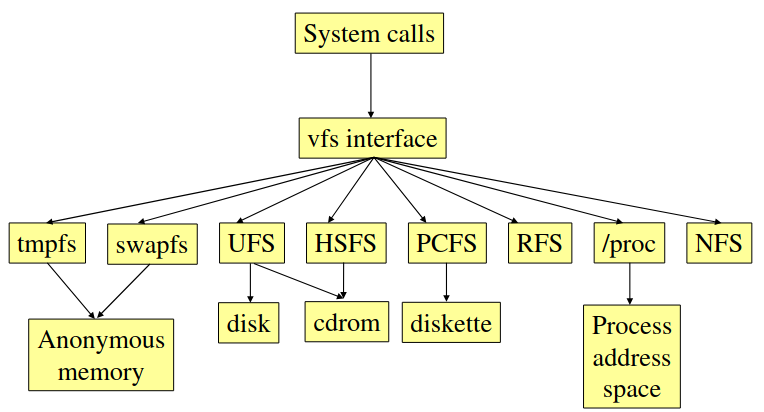
- Ex. Suporte a NFS (Network File System)

  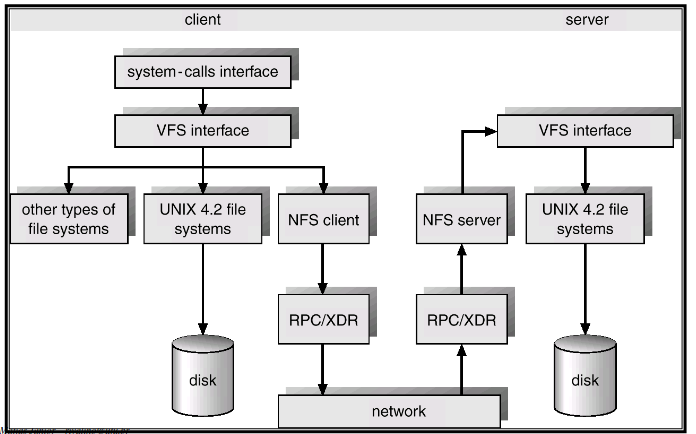

#### IMPLEMENTAÇÃO

- Alocação contígua:
  - Ex: BFS, ISO9660
- Tabela de Alocação:
  - FAT12/16/32, VFAT and NewWare
- Árvore Balanceada (B+Tree):
  - HFS, NSS, Reiser FS and Spiralog filesystem
- Journaling
  - BeFS, HTFS, JFS, NSS, SpiralogFS, VsFS and XFS

### Estudo de Caso: Unix File System

- Arquivos são acessados, em use leve, utilizano conceito de descritores
- Quando um processo chama open(), o kernel cria uma open file object (OFO) para representar a instância do arquivo aberto no processo
  - Esse objeto é glocal e fica armazenado no espaço de endereçamento do kernel
- O retorno da open() é um descritor de arquivo, que tem como função referenciar um OFO associado ao processo
  - Um descritor de arquivo (fd) é um objeto específico do processo e, portanto, fica armazenado em seu espaço de endereçamento
- O processo usa o fd para realizar operações sobre o arquivo aberto (referenciado por fd)

  
  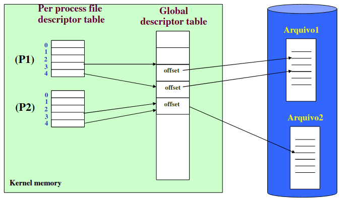
  - Processo P1 referencia dois open file objects (OFO)
  - Processo P2 referencia OFO usando dois descritores
- Uma partição é considerada um array de blocks
  - Cada partição tem seu próprio sistema de arquivos
- Blocos (clusters) são múltiploes de 512 bytes (1 setor)
- Toda partição tem um setor de boot
- O setor de boot é seguido pelo superblock(SB)
  - O SB contém metadados referentes ao fs como um todo
    - Tipo de sistema de arquivos
    - Tamanho em blocos
    - Tamanho em blocos da lista de inodes
    - Número de blocos livres e inodes
    - Lista de blocos livres
    - Lista de inodes livres
- Seguindo o SB tem-se a lista de inodes (inode list)
  - Cada arquivo tem um inode associado
  - Um inode armazena metadados do arquivo
    - tipo do arquivo, permissões, etc
    - número de hard links para o arquivo
    - UID do dono do arquivo
    - GID do dono do arquivo
    - tamanho em bytes
    - vetor de endereços de bloco
    - data/hora do último acesso
    - data/hora da última modificação
    - data/hora da última modificação no inode (exceto para os dois anteriores)
  - Após a lista de inodes tem-se os blocos de dados
- Arquivos são acessados, em user level, utilizando o conceito de descritores
- Quando um processo chama open(), o kernel cria um open file object (OFO) para representar a instância do open file object (OFO) para representar a instância do arquivo aberto no processo
  - Esse objeto é global e fica armazenado no espaço de endereçamento do kernel
- O retorno da open() é um descritor de arquivo, que tem como funçao referenciar um OFO associado ao processo
  - Um descritor de arquivo (fd) é um objeto específico do processo e, portanto, fica armazenado em seu espaço de endereçamento

  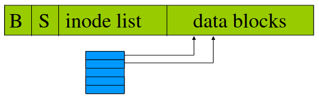
  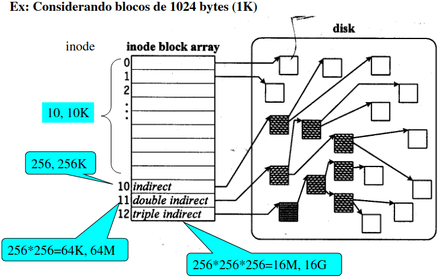
  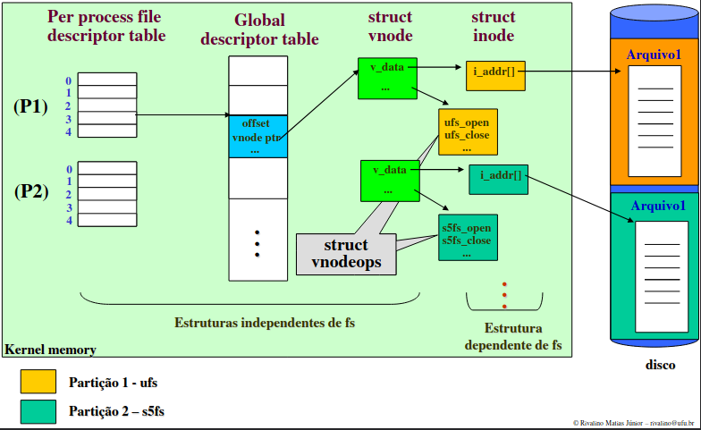

## **Gerenciamento de E/S**

### Hardware de E/S

- Sistema computacionais possuem diferentes componentes de HW de E/S
- Os engenheiros se preocupam com o funcionamento interno do HW
- Projetistas e programadores de SO se preocupam com a interface de SW envolvida na comunicação com esse HW e como abstrair seus detalhes para as aplicações
  - a programação do HW de E/S também exige significativo conhecimento do funcionamento interno do HW

### Dispositivos de E/S

- Os dispositivos de E/S podem ser divididos em duas categorias:
  - Dispositivos de bloco: processam os dados em blocos de tamanho fixo (ex. hd, cd-rom, usb-drives)
- Dispositivos de caractere: processam os dados em fluxos de caracteres (bytes) (ex. teclado, mouse, impressora)
- Cada dispositivo de E/S pode apresentar uma ampla variação de taxas de operaçao de entrada/saída, exigindo do software diferentes formas de interação
- A tabela a seguir ilustra as taxas e frequência de dados de alguns dispositivos

  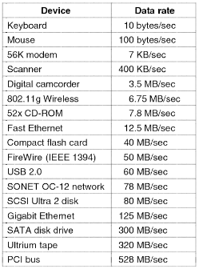

### Controlador do Dispositivo

- Os dispositivos de E/S consistem, geralmente, em um componente mecânico e um componente eletrônico
  - O componente mecânico é o dispositivo de E/S propriamente dito (ex. monitor de vídeo, cd-rom)
  - O componente eletrônicos é chamado de controlador ou adaptador do dispositivo (ex. adaptador de vídeo, controladora de disco)
- A interface entre o controlador do dispositivo e o dispositivo pode ser padrão ou proprietária
- Exemplos de padrões de interface:
  - VGA, HDMI, RJ-45, RJ-11, IDE, SATA, SCSI, PS2, USB
- O controlador pode ser externo (placa individual) ou interno (integrado na motherboard)

  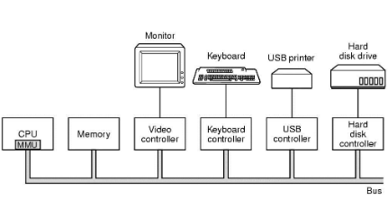
  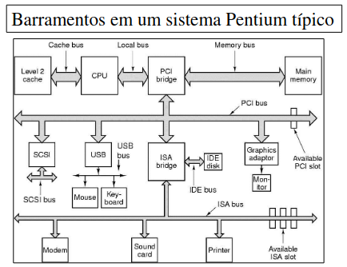

### E/S Mapeada em Memória

- Cada controlador tem alguns registradores usados par comunicação com a CPU
  - Por meio da escrita nesses registradores o SO comanda o funcionamento do dispositivo controlado
  - Ao ler esses registradores o SO pode descobrir o estado do dispositivo
  - Alguns dipositivos contam também com um buffer que o SO pode ler e escrever
- A questão é como a CPU se comunica com os registradores e buffers dos dispositivos?
  - Espaço de Portas de E/S (port-mapped I/O - PMIO)
  - E/S mapeada na memória (memory-mapped I/O - MMIO)
- (a) Espaços de I/O e memória separados. (b) Memory-mapped I/O. (c) Híbrido

  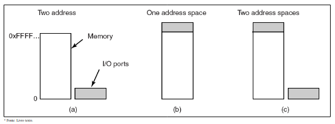

### Acesso Direto à Memória (DMA)

- Independente de como a CPU requisita dados de um controlador, seja por PMIO ou MMIO, isso normalmente ocorre um byte de cada vez
  - resultando em um desperdiço de tempo de CPU
- O DMA permite que os dados do dispositivo sejam carregados para a memória sem a intervenção da CPU
  - isso somente é possível quando existe um controlador de DMA
  - o controlador de DMA pode ser específico por um dispositivo ou um único para todo o sistema
- De forma geral o controlador de DMA contém:
  - registrador de end. de memória.
  - registrador de contador de byte
  - registrador(es) de controle
- Exemplo de operação de DMA

  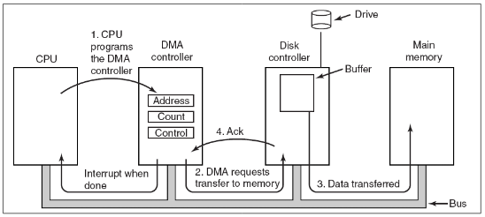
- Os controladores de DMA variam em termos de sofisticação
  - Os mais simples tratam uma transferência por vez, enqunato os mais sofisticados podem realizar múltiplas transferências simultâneas
- Alguns controladores operam em nível de palavra/byte ou em nível de bloco
- A transferência pode variar, sendo mais comum o modo direto. Alguns controladores de DMA recebem os dados do dispositivo para armazená-lo no destino
- A maioria dos controladores de DMA usa endereços da memória física, mas existem aqueles que utilizam endereços virtuais

### Interrupçoes (IRQs)

- O mecanismo de tratamento das interrupções de HW (IRQs) é similar ao tratamento das interrupções de SW (system calls)

  
- As interrupções podem ser precisar ou imprecisas
- Propriedade de uma interrupção precisa:
  1. O PC (program counter) é salvo em um lugar conhecido
  2. Todas as instruções antes daquela pelo PC foram completamente executadas
  3. Nenhuma instrução além daquela apontada pelo PC foi processada
  4. O estado de execução da instrução apontada pelo PC é conhecido
- (a) Interrupção precisa. (b) interrupção imprecisa

  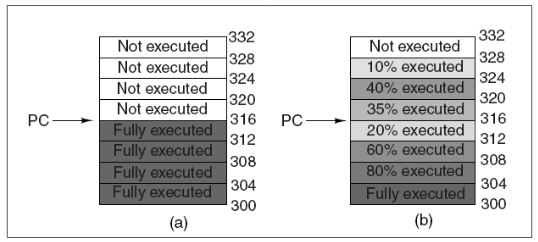

### Princípios de SW de E/S

- Objetivos do SW de E/S:
  - Independência do dispositivo
    - Os programas devem ser aptos a acessar qualquer dispositivo sem a necessidadde e conhecer seus detalhes (ex. % sort < input > output)
- Nomeação uniforme
  - O nome de um arqivo ou dispositivo deve ser independente do dispositivo (ex. "/home/backup.dat" está em um USB ou HD drive?)
- Tratamento de erros
  - Realizando o mais próximo possível do HW, ocultando os detalhes do funcionamento do dispositivo de programas
- Tipo de transferência
  - Síncrona (bloqueante) ou assíncrona (orientada a interrupção)
  - Bufferizada ou não bufferizada
- Compartilhamento

### E/S Programada

- Existem três formas de realizar E/S:
  - programada, por interrupção e via DMA
- A E/S programada é mais simples das três formas cirtadas
  - Exemplo de impressão de caracteres na impressora

  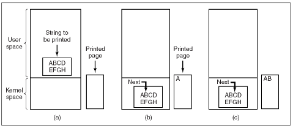
- A E/S programada é simples, mas tem a desvantagem de segurar a CPU até que a E/S não for concluída
- Para dispositivos com baixa vazão de processamento, o tempo ocioso da CPU se torna uma desvantagem dessa abordagem

### E/S Usando Interrupção

- Nessa abordagem o dispositivo avisa quando está pronto, evitano o tempo de espera da CPU enquanto o dispositivo não se encontra pronto, como ocorre na E/S programada

  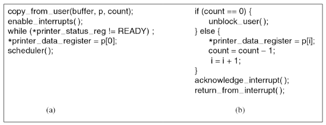

### E/S Usando DMA

- No exemplo da impressora, uma desvantagem do mecanismo de E/S orientado à interrupção é a ocorrência de uma interrupçao de cada caractere
- Tratar interrupções tem um custo computacional que pode ser significativo em muitos casos
- Ao usar o acesso direto à memória, ou seja, fazer o controlador de DMA alimentar a impressora, caractere por caractere, tem-se a CPU livre para realizar outras atividades
- O DMA executa uma E/S programada sem a participação da CPU
- A grande vantagem é reduzir o número de interrupções da CPU de uma por caractere para uma por buffer impressoro

  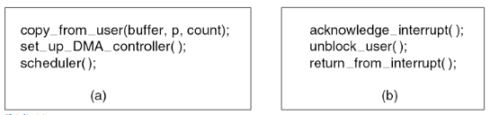

### Camadas de SW de E/S

- O software de E/S normalmente é organizado em 4 camadas:

  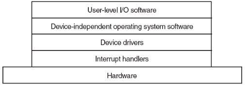

### Interrupt Handlers

- Passos executaos em SW após a IRQ ter sido concluída:
  1. Salva quaisquer registradores que não foram salvos pelo HW de interrupção (ex. APIC)
  2. Estabelece um contexto para a rotina de tratamento da interrupção (ISR - Interrupt Service Routine). Ex. alterar a MMU para a PT da ISR, alterar o PC para o início da ISR, etc.
  3. Estabele a pilha para a ISR
  4. Sinaliza o controlador (APIC). Se não existe um controlador de interrupção, reabilita as interrupções que neste caso seriam desabilitadas antes do passo 1
  5. Copia os registradores de onde eles foram salves, provisoriamente, para a PCB do processo que foi interompido
  6. Execute a ISR
  7. Escolhe o próximo a executar
  8. Estabelece um novo contexto (ex. reconfigura a MMU -> PT)
  9. Carrega os registradores com o contexto de HW do próximo processo, incluindo o PC.
  10. Inicializa a execução do próximo processo.
