# Sistemas Operacionais

## _Contextualização_

- SO é um software que faz contato direto com o hardware e serve para auxiliar o uso do computador
- Exemplos: Linux, Windows, Solaris, etc..
- Estuda a arquitetura de sistemas operacionais
- Como que os sistemas operacionais funcionam por dentro
- O SO é o elemento central que controla todo o computador
- Todas as informações passam pelo SO
- Importância:
  - Ajuda a resolver problemas mais complexos
  
## **Introdução**

_**Conceitos básicos:**_

- **Sistema computacional**: hardware + software (SO && Software).

- **Ambiente computacional**: sistema computacional + peopleware (usuários).


- **Sistema operacional**: é uma interface entre as aplicações e o hardware, gerenciando recursos de hardware e software (processador, memória ram, rom, secundária, processos/entidades de execução, gerenciamento de rede).
  - Todas aplicações que utilizam o hardware, solicitam para o SO, o qual faz o precedimento diretamente no hardware.
  - Todas aplicações que comunicam entre si são subordinadas ao SO.
  - Um chamada de uma aplicação para o SO é chamada de _System Call_.

- **Núcleo/Kernel**: conjunto de rotinas que são inicializadas quando o computador é ligado, sendo carregadas para a memória.
  - Esperam ser acionadas pelo _System Call_ ou por interrupções do hardware.

- **Distribuição**: Kernel + Programas auxiliares do kernel + Aplicações para o usuário.
  - Windows, Ubuntu, Mac, IOS, Android, etc...

## **Conceitos de introdução**

- Conceitos de Hardware e Software
  - Unidades Funcionais (ULA, UC, Registradores, Dispositivos de I/O, Memória Principal)
  - Registradores
  - Dispositivo de Clock
  - Memórias: Principal, Secundária, Cache

## **Processo de Ativação de SO (boot)**

- >***Firmwares: Softwares que vem gravado do fabricante (POST, SETUP Rotinas do BIOS)***
- >***As vezes a BIOS (Basic Input Output System) é mencionada como POST + SETUP + Rotinas do BIOS***

- **POST** (Power On System Test) - _É um programa_
  - Processador do computador, ao ser energizado ao ligar, o PC (Program Counter) aponta para o endereço do primeiro software a ser executado na ROM (POST)
  - POST é um Software/Firmware escrito em C/Assembly que é embarcado(armazenado) na ROM (Read Only Memory - ***Memória persistente diferente da RAM***)
  - Testa todos componentes básicos do computador para ver se é possível inicializa-lo (Memória, CPU, HD, dispositivos de saída, etc...)
  - Se tiver problema em um componente crítico do computador, sinaliza o erro e para a ativação do computador
  - Se não tiver algum problema, passa para próxima etapa de ativação do SO
- **SETUP** (Sofware/firmware opcional) - _"Pressione ESC"_
  - Firmware embarcado pelo fabricante que permite alterar configurações básicas do computador
  - Ferramentas de diagnóstico (Testar Hardware)
- **Rotinas do BIOS** (Software/firmware com rotinas genéricas gravadas pelo fabricante)
  - Rotinas com operações básicas (Leitura/Escrita no disco, Leitura do teclado, Escrita no dispositivo de saída padrão)
- **Carga de Boot Manager** (Caso exista)
  - Inicializado antes do SO, pois escolhe qual SO inicializar
  - Programa armazenado no disco na MBR(Master Boot Record), utilizado em sistemas computacionais que possuem mais de uma instalação de SO para inicializar
  - Responsável por carregar os Boot Loader's dos SOs no disco
- **Carga do Boot Loader do SO** (normalmente residente no primeiro setor de dados da partição do SO instalado)
  - Feito pelo fabricante do SO
  - Programa que fica no setor de boot numa partição do disco que está instalado o respectivo SO
  - O Boot Loader carrega o kernel do SO
- **Carga do Kernel do SO**
  - Inicializa suas rotinas, drivers, programas
  - Inicialização do SO em questão

## **Tipos de Sistemas Operacionais**

- Monoprogramáveis/Monotarefa
  - Somente um programa pode ser executado **por vez**
- Multiprogramáveis/Multitarefa
  - Vários programas podem ser executados **simultaneamente**
  - Permite multiusuários (usuários conectados de forma remota)
  - Batch (Conjunto/Lote)
    - Eram preparados lotes de programas para serem executados para o sistema operacional
  - Time-sharing (Tempo compartilhado)
    - Mainframe(CPU, Disco, Memória, etc...) compartilhado entre vários terminais(usuários com teclado e tela)
    - Todos usuários tem acesso simultâneo a uma mesma máquina
    - Muito mais complexo que o modelo em lote(batch)
    - Maioria das distribuições comerciais (Linux, Windows, etc...)
  - Tempo Real
    - Específico para sistemas que precisam operar em ambiente real em tempo real (Sistemas Críticos)
    - Sistema de mísseis, aviões, radares, etc...
- Múltiplos Processadores (possui vários processadores)
  - Fortamente Acoplados
    - Os processadores, memória principal, I/O,  estão no mesmo back-plane (placa do sistema)
    - Sistemas Simétricos (SMP)
      - Todos os processadores são iguais e funcionam da mesma forma
      - O suporte físico do back-plane (placa) limita o crescimento da quantidade de processadores
      - São comuns em computadores comerciais
    - Sistemas Assimétricos
      - Processadores são diferentes entre si em funções (especializado em parte gráfica, I/O de rede, cálculo, criptografia) e em especificações (4GHz, 2GHz)
      - São comuns em alguns minicomputadores e em sistemas específicos (alguns smartphones, consoles de videogames)
  - Fracamente Acoplados
    - Processadores não estão no mesmo back-plane, portanto não é limitada a quantidade de processadores
    - Um rack com várias placas mães
    - Necessidade de um SO que monitore essas várias back-planes
    - Sistema Operacional de Rede (NOS)
      - Permite que computadores se comuniquem entre si através de syscalls oferecidas pelo SO
    - Sistema Operacional Distribuído (DOS)
      - O SO gerencia o armazenamento de dados, execução de programas nos computadores que estão conectados entre si
      - O sistema de comunicação entre os computadores precisa ser muito eficiente e rápido
      - atualmente existe um gargalo que impede de ter um DOS em escala comercial
  
## Estruturas e Componentes

- Chamada de Sistema(system call)
- Grupos Funcionais
  - Gerência de Processador
  - Gerência de Memória
  - Gerência de E/S
  - Gerência de Arquivos
  - Comunicação em Rede
- Organização do Kernel
  - Monolítico
    - Primeiros modelos de kernels criados
    - As rotinas do kernel estão organizadas de forma muito coesas entre si, permitindo que as rotinas compartilhem estruturas e dados entre si
    - A manutenção em cima desse código é difícil devido a coesão das rotinas entre si
    - As rotinas estão tão coesas em um nível que ao carregar o kernel, todas as rotinas são levadas para a memória, podendo haver rotinas que nem sequer serão utilizadas
    - Porém é mais rápido, pois os dados são compartilhados e não é necessária criação de rotinas passando paramêtros copiados
  - Em camadas
    - Permite uma melhor manutenção do código
    - As rotinas estão bem separadas uma das outras, permitindo com que as rotinas possam ser executadas em diferentes modos de operação do processador(kernel/user mode)
    - Possui uma performance pior comparado ao monolítico, pois as interfaces não permitem que as funções compartilhem dados
    - Existe interfaces entre as rotinas para se ter uma integração coesa
    - Ainda não é possível previnir o carregamento de todas as rotinas para a memória
  - Microkernel
    - Neste as rotinas podem ser selecionadas para carregamento
    - As rotinas do kernel são carregadas para a user level, deixando apenas as rotinas mais baixo nível no kernel
    - As rotinas que estão no user level precisam acessar o kernel através de system calls que consomem tempo (desempenho menor comparado aos outros tipos de kernel)
    - Falhas em subsistemas(rotinas) não comprometem a execução do sistema, pois estão bem isoladas
    - Em sistemas multiprocessados, módulos podem ser executados em diferentes processadores mais facilmente, aproveitando o processamento dos processadores
    - As rotinas do kernel são separadas em vários programas, diferente dos outros kernels, na qual uma aplicação realiza uma syscall para o kernel

  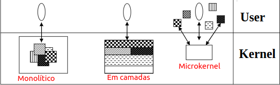
- Interface de System Calls

  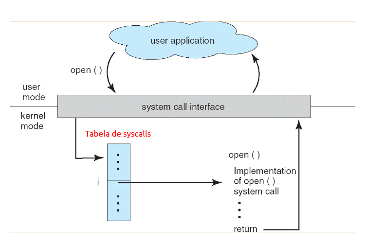
  - Um programa em C invoca o printf(), o qual por sua vez chama a system call write()
  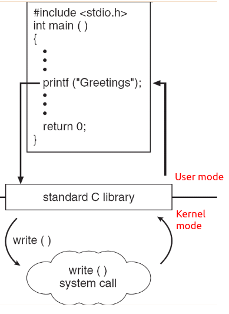
  - System Calls: Padronização
    - A marioria das syscalls usadas em sistemas UNIX (ou UNIX-like) estão definidas no padrão POSIX (Portable Operating System Interface for Unix)
      - A família de padrões POSIX é formalmente conhecida como IEEE 1003
      - Equivale ao padrão internacional ISO/IEC 9945
    - No Linux podemos ver as system calls na seção 2 do manual online (man pages)
      - man 2 system_call
        - ex # man 2 exit
      - man syscalls - apresenta todas as chamadas de sistema
  - System Calls vs. Rotinas de Biblioteca
    - No UNIX muitras system calls são encapsuladas por rotinas de biblioteca
      - C library (libc, glibc, ...)
    - Exemplo:
      - void _exit(int status) - system call
      - void exit(int status) - rotina da biblioteca
    - Algumas diferenças:
      - _exit não chama qualquer função registrada com atexit() ou on_exit().
      - _exit não fecha descritores de arquivos abertos
      - entre outras
    - O que é melhor? System Calls ou Rotinas de Biblioteca?
      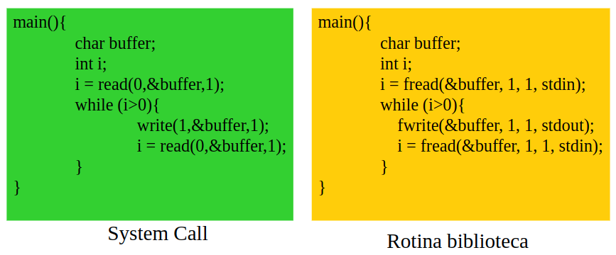
    - Ao realizar teste utilizando os comandos
      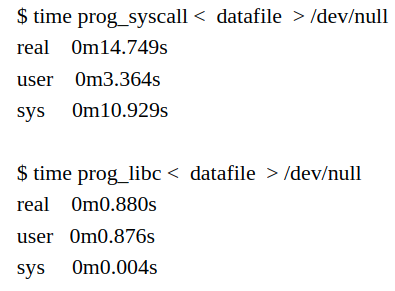
    - percemos que a syscall perdeu drasticamente em quesito de performance comparado com a rotina de biblioteca, isso se deve pelo fato da rotina em C realizar um procedimento de bufferização internamente, evitando o chaveamento entre modo kernel e usuário de forma repetida no código System Call
  - Métodos de Entrada no Kernel
    - Na arquitetura x86, a entrada do Kernel via system call é implementada por meio de uma interrupção de software
      - No MSDOS: int 0x21
      - Windows NT/2000: int 0x2E
      - Linux (Kernel < 2.6): int 0x80
      - Solaris 2 (x86): SYSENTER/SYSEXIT
      - Linux (Kernel 2.6): SYSENTER/SYSEXIT
      - Windows XP/Vista: SYSENTER/SYSEXIT
    - Além das chamadas de sistema outras duas formas de entrada no Kernel são:
      - Interrupções de hardware
      - Hardware trap (específicas do processo)
        - Ex: divisão por zero
  - Exemplo de Estrutura de Kernel (Modelo Unix SVR4)
    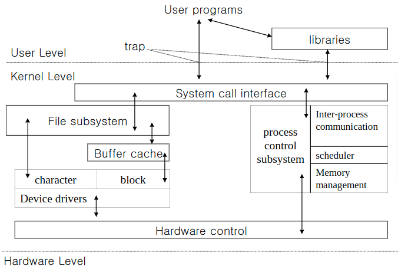

## **Modelo de Processos/Threads**

### Modelo de Processo

- Processo: é uma instância de um programa em execução

  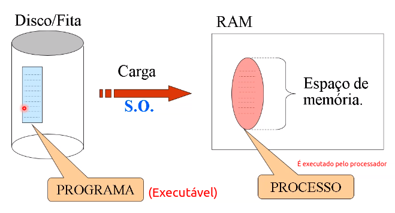
  - Programa é o executável, quando acionado, solicita para o SO criar um processo do programa na memória (instância), o qual vai ser executado pelo processador
  - Programa é estátic, e processos são dinâmicos
  - O que roda na memória principal é o processo, não o programa
- Programa vs. Processo
  
  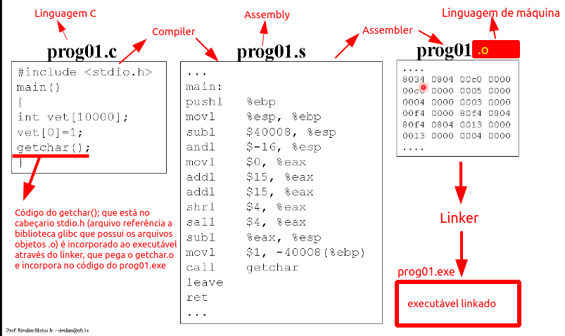
  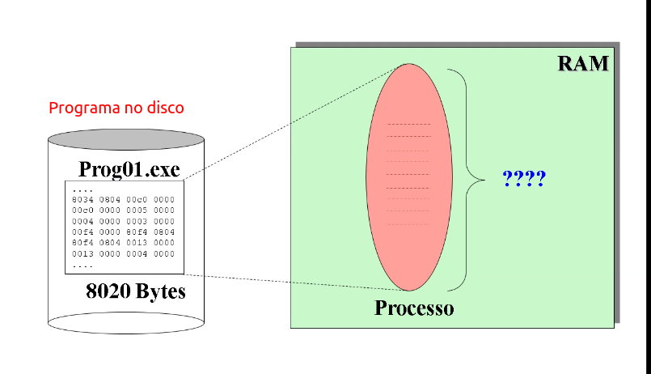

  - Normalmente o processo tem espaço maior do que o programa executável, pelo fato do programa poder alocar memória, ocupando mais espaço do que o tamanho desse ao ser transformado em processo, mas pode ser menor ou igual também.
  
  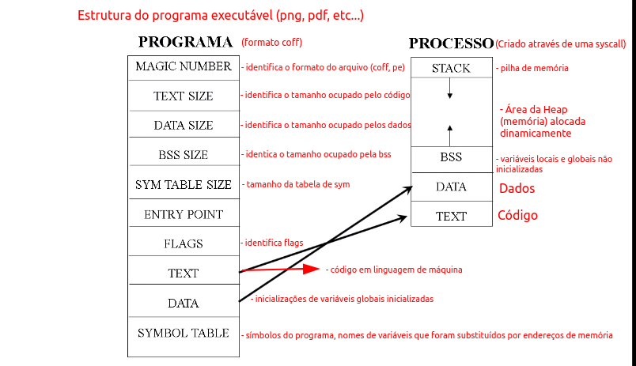
  - Na pilha de execução que são armazenadas as execução de funções, criação de variáveis locais, retornos de função e endereços de retorno após termino de execução de uma função
  - Se a stack cresce até a Heap, ocorre "stack overflow", se a Heap cresce até a stack, ocorre a "stack overrun"
  - Entry point sinaliza aonde é o início do da rotina principal do código (main)
- Principais Características (Processo)
  - Modos de Execução
    - Usuário (user mode)
    - Kernel (kernel mode)

    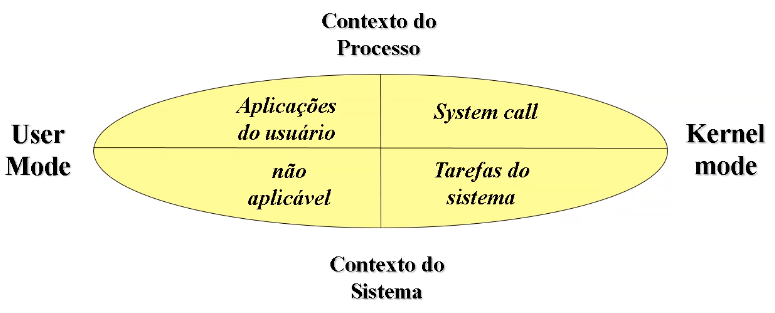
  - Estados
    - Pronto, Esperando, Executando

    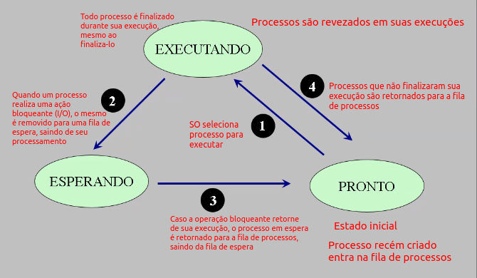
  - Hierarquia
    - Processo, sub-processo

    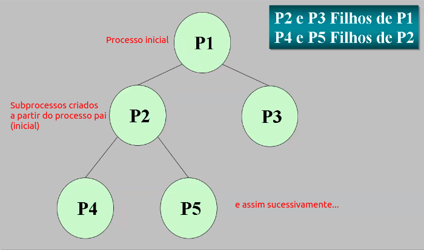

  - Identificação
    - PID, credenciais

    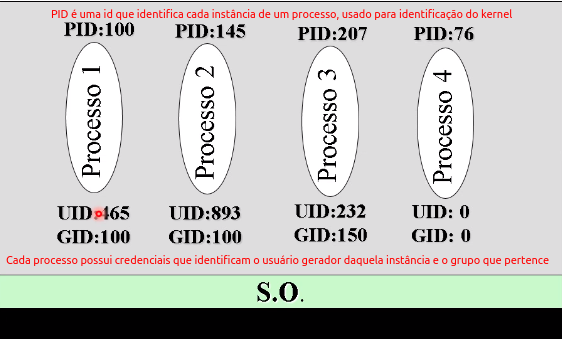
- Gerenciamento (Processo)
  - Identificação + Credenciais
    - Controle de Acesso
    - Contabilização de recursos
    - Quotas de utilização
    - Logs de auditoria
    - outros...

### Implementação Interna

- Bloco de controle de processos (PCB)
  - Estrutura interna ao sistema operacional
  - Armazena todas informações a respeito do processo
  - Normalmente implementado como uma lista ligada ou vetor de estruturas
  - Acessível somente pelas rotinas do kernel
  - O PCB materializa o conceito de processo, armazenado o estado do processo, argumentos da linha de comando, PID, UID, GID, registradores, limites de memória (limita o uso do processo, impedindo situaçao de monopolização de recursos de hardware), lista de arquivos aberta
  - Cada PCB referencia outros PCB's que foram criados por um programa, criando várias estruturas, por isso a necessidade de limitar o uso dos processos
  - O PCB no linux é implementado por uma Árvore Rubro negra, diferentemente de uma lista ligada

- Contextos (Hardware/Software)
  - Hardware (conteúdo dos registradores)
    - PC(program counter)
    - Stack Pointer
    - Flags de estado
    - demais registradores
  - Software (recursos/atributos do processo)
    - Arquivos abertos
    - Tamanho dos Buffers de I/O
    - Tempo de execuçao
    - Identificação
    - Credenciais
    - outros...

### Modelo de Threads

- Conceito: É um fluxo de execução interno a um processo, sendo que um processo pode ter uma thread(singlethreaded), ou várias (multithreaded)
  - Cada thread tem uma call stack
  - Cada processo é criado com uma thread (fluxo de execução) chamada de main thread
  - O processo na mainthread cria outras threads, gerando um processo multithread
  - Todas a threads são independentes das outras, um bloqueio de I/O não interrompe as outras threads
  - As threads são concorrentes, pois disputam o mesmo tempo de processamento
- Vantagens
  - Economia de recursos do sistema
  - Melhor organização com requisitos de concorrência
  - Uso eficiente de multiprocessadores (*)
- Desvantagens
  - Introduz maior complexidade
- Paralelismo
  - Processos SingleThreaded executam em um único processador a sua mainthread
  - Já processos Multithreaded podem ter suas threads executadas por diferentes processadores, permitindo um paralelismo de thread
- TCB (Thread Control Block) - são as representações das threads, tendo a mesma ideia do PCB
  - Thread ID (tid)
  - Registradores de estado (inclui PC e SP)
  - Pilha
  - Máscara de sinais
  - Prioridade
  - Armazenamento privado
  - Outros...

### Exemplo de Criação de Processos/Threads

#### Criando processos

- Uso: pid_t fork(void);
- A chamada de sistema fork() returna um valor zero para o filho e o valor do PID do filho para o Pai
- O pai normalemente espera o filho terminar antes de encerrar (usando wait())
- O filho retorna um status de término para o Pai
- Após ser criado, um processo filho pode executar um novo programa (diferente do pai) por chamar exec().
  - fork() e exec() são usadas em conjunto para executar um programa qualquer

    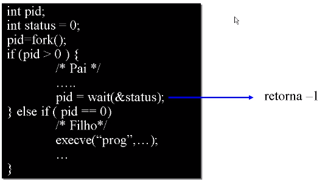
- Outra chamada de sistemas usada para criação de processos é o **vfork()**
  - Possui a mesma sintaxe de utilização do fork()
- vfork() bloqueia o processo Pai até que o filho chame exec()
- É uma chamada criada para evitar o overhead de um fork() para processos que irão invocar exec()

#### Criando Threads (pthreads)

- Uso:

```c
#include <pthread.h>
int pthread_create(pthread_t * thread, const pthread_attr_t * attr, void * (*start_routine)(void *), void * arg);
```

- thread - retorna o thread id
- attr - NULL para os valores default
- start_routine - ponteiro para a função que será executada pela thread
- arq - ponteiro para o argumento da função. Para passar múltiplos argumentos, use um ponteiro para estrutura (struct)

- Uso:

```c
#include <pthread.h>
int pthread_join(pthread_t * th, void ** thread_return);
```

- th - thread chamadora suspensa até que a thread identificada por th termina
- thread_return - Se o retorno da thread th é diferente de NULL, então o valor de retorno é armazenado em thread_return

- Uso:

```c
#include <pthread.h>
int pthread_exit(void * retval);
```

- retval - valor de retorno da thread
- Essa rotina encerra a thread, portanto, ela nunca retorna

## **Comunicação entre processos(IPC)**

### Introdução

- Inúmeras aplicações são programadas em forma de vários processos cooperantes
- Estes processos cooperam entre si compartilhando recursos e informações
- O kernel do SO deve prover os mecanismos necessários para estas implementações
- Estes mecanimos são comumente chamados de IPC
- Processo A <-> Processo B, é uma abstração mas as informações passam pelo SO

### Propósitos Principais

- Transferência de Dados
  - Ex: FTP, ICQ, etc.
- Compartilhamento de Dados
  - Ex: Variáveis de controle entre processos cooperantes
- Notificação de Eventos
  - Ex: O Processo filho notifica seu processo pai de sua conclusão
- Compartilhamento de Recursos
  - Ex: Gerenciamento de fila de impressão
- Controle de Processos
  - Ex: Depuração de um processo em tempo de execução (debugging)

### Aplicações

- Sistemas Servidores:
  - WEB
  - email
  - Impressão
  - Arquivo, etc.
- Sistemas Comerciais:
  - Controle de conta corrente
  - Controle de estoque
  - Controle de passagens (avião, ônibus, etc.)
  - etc...

### Modelo Produto-Consumidor

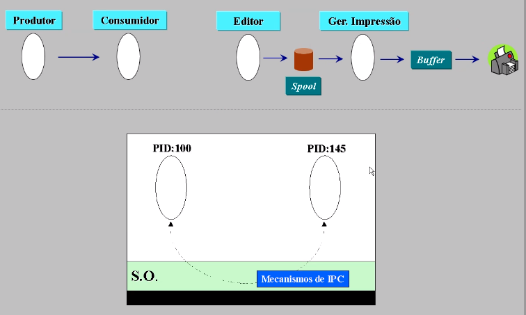

### Exemplo de Utilização Modelo Produto-Consumidor

- MS-DOS:
  - C:\type texto.txt | more
- UNIX:
  - % cat texto.txt | more
  - % ls -l | grep filename | wc -l
- "Pipe é um exemplo de mecanismo, fornecido pelo sistema operacional, para a realização de IPC"
- Outros mecasnismos:
  - Shared memory
  - Signals
  - Semaphores
  - Message Passing/ Message Queues
  - Ports

### Mecanismos de IPC

- Como um processo comunica con outro?
  - Signal: Um processo notifica outro através de uma interrupção de software (Ex. kill do unix)
  - Semaphore: Processos bloqueados, aguardando sua vez, recebem uma notificação (signal)
  - Pipes: Fluxo de comunicação unidirecional
  - Message passing: Processos enviam e recebem mensagens (send/receive), podendo a comunicação ser individual (dois processos) ou em grupo

### Exemplos de Aplicação

- SIGNAL
  - Similar a uma interrupção de hardware
  - A comunicação se dá de forma assíncrona. O processo que recebe o sinal para sua execução
  - Alarmes (ex. unix alarm()) é uma forma de programar recepção de sinais enviados pelo SO
  - É comum o SO avisar a aplicação de eventos do sistema, tais como: (disk quota, CPU time, divide by zero, etc.) através de sinais
- SEMAPHORE
  - Utilizado para sincronização de processos
  - A interface do semáforo é visível por todos os processos comunicantes
  - Garante atomicidade das operações
  - Utilizado para implementar a exclusão mútua de processos
- PIPE
  - Um processo escreve e o segundo processo efetua a leitura (ex. % ls | more)

    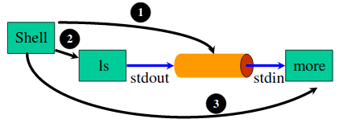
  - shell:
    1. Cria um pipe
    2. Cria um processo para o comando (ls), configura a saída (stdout) de ls para escrever no pipe
    3. Cria um processo para o comando (more), configura a entrada (stdin) de more para ler do pipe
- MESSAGING PASSING
  - Processos enviam e recebem mensagens através de primitivas de comunicação (send/receive)
  - A comunicação pode ser síncrona ou assíncrona
  - A comunicação pode ocorrer entre dois processos ou em grupo
  - A comunicação pode ser realizada no mesmo sistema (LPC - local process communication) ou entre sistemas remotos (RPC - remote process communication)

  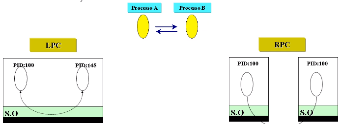

### Compartilhamento de Recursos

- Ex: Sistema Bancário - controle de conta

```c
READ(Arq_contas, Reg_cliente);
READ(valor_dep_ret);
Reg_cliente.Saldo = Reg_cliente.Saldo + valor_dep_ret;
WRITE(Arq_contas, Reg_cliente);
```

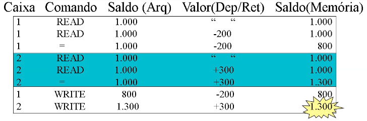

#### Solução: *Exclusão mútua*

- Evitar com que mais de um processo execute sua região crítica
- Região crítica é a seção de código dos processo que fazer acesso ao(s) recurso(s) compartilhado(s).

```c
READ(valor_dep_ret);
READ(Arq_contas, Reg_cliente);          // Região Crítica
Reg_cliente.Saldo = Reg_cliente.Saldo + valor_dep_ret;                          // Região Crítica
WRITE(Arq_contas, Reg_cliente);         // Região Crítica
```

- Uma boa solução de exclusão mútua deve:
  - Evitar que processos acessem ao mesmo tempo suas RC
  - Processos fora de sua RC não podem bloquear outros processos
  - Processos devem ter garantias de entrada na RC, envitando uma espera infinita
- A implementação da Exclusão Mútua exige a sincronização entre processos
  - Principais Problemas envolvendo sincronização:
    - velocidade de execução dos processos
    - Starvation
    - Sincronização condicional
- SOLUÇÃO: Exclusão Mútua
  - Principais Problemas:
    - Velocidade de execução dos processos

    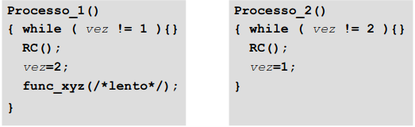
- SOLUÇÃO: Exclusão Mútua
  - Principais Problemas:
    - Starvation
      - Prioridades/aleatoriedade: Escaloanamento justo (FIFO)
    - Sincronização condicional
      - ex. produtor/consumidor
- SOLUÇÃO: Exclusão Mútua
  - Soluções de Hardware:
    - Desabilitar Interrupções
    - TSL (Test and Set Lock) - operação em assembly
- SOLUÇÃO: Exclusão Mútua
  - Soluções de Software:
    - Semáforo (Dijkstra)
      - Primitivas Up e Down
      - Operações atômicas, implementadas como system calls

      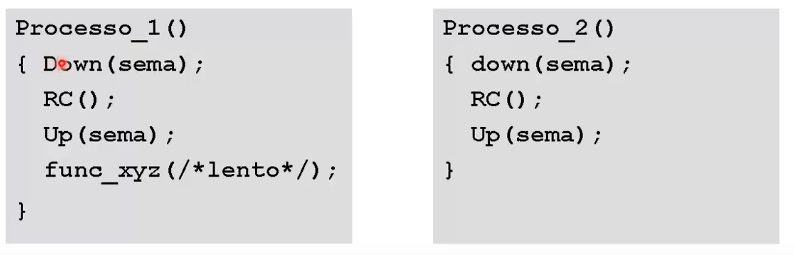
      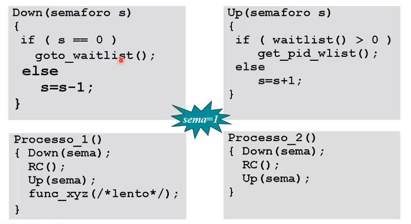
- SOLUÇÃO: Exclusão Mútua
  - Principais Problemas:
    - Starvation - Prioridades/aleatoriedade: Escalonamento justo (FIFO)
    - Sincronização condicional - ex. produtor/consumidor
- SOLUÇÃO: Exclusão Mútua
  - Soluções de Software:
    - Monitores (Hoare)
      - Remove do programador, parte das responsabilidades da programação com semáforo
      - Encapsula procedimentos e variáveis utilizadas na programação de semáforos
      - Implementado como um módulo (classe) que automaticamente realiza o sincronismo entre os procedimentos utilizados
      - A implementação da exclusão mútua é realizada em tempo de compilação

      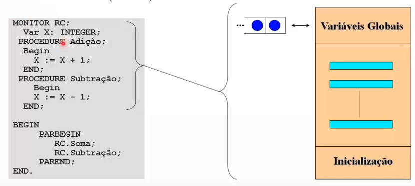
- TROCA DE MENSAGENS
  - usada para sincronização e comunicação entre processos:
    - SEND(PID, MSG) / RCV(PID, MSG)
  - Endereçamento
    - Direto
    - Indireto
  - Modo
    - Síncrono (rendezvous)
    - Assíncrono

#### DEADLOCKS

- Quando processos se bloqueiam mutualmente na espera de um recurso indefinidamente
- Dois processos (multitask) querendo imprimir um arquivo na impressora:
  - Processo A bloqueia arquivo
  - Processo B bloqueia impressora
  - Processo A tenta usar a impressora
  - Processo B tenta abrir o arquivo
- Recursos preemptíveis e não preemptíveis
  - Ex. memória (preempção) / impressora (não preempção)
- Condições para deadlock (Coffman et al. 1971):
  - Condição de exclusão mútua
  - Utilização de dois ou mais recursos exclusivos
  - Recursos sem preempção, liberados explicitamente pelo processo
  - Condição de espera circular. Um encadeamento de dois ou mais processos que esperam pelo próximo processo da cadeia

  
- Garantir que uma ou mais das condições anteriores não ocorra:
  - Condição de exclusão mútua
    - Problemas de compartilhamento de recursos
  - Utilização de dois ou mais recursos exclusivos
    - Alocação antecipada, o que pode causar sub-utilização
  - Recursos sem preempção, liberados explicitamente pelo processo
    - Garantir preempção. Problemas de starvation e inconsistência podem ocorrer
  - Condição de espera circular. Um encadeamento de dois ou mais processos que esperam pelo próximo processo da cadeia
    - Excluir a possibilidade de múltiplas alocações de recursos exclusivos ao mesmo tempo.

#### PREVENÇÃO DE DEADLOCKS

- Detecção:
  - Utiliza estruturas internas no kernel do SO
  - Algoritmos de busca são específicas para cada SO, tais como time sharing e de tempo real
  - Gera grande overhead no kernel, por isso, normalmente não se implementa tais funcionalidades
- Correção:
  - Preempção: Retirar recurso(s) de um processos fornecendo-o para outro processo
  - Rollback: Utilização de checkpoints
  - Processos killing: Remove um ou mais processos de cadeia de dependências

## **Gerenciamento de processador**

### Mecanismo de Interrupção de Processador (Timer Interrupt)

  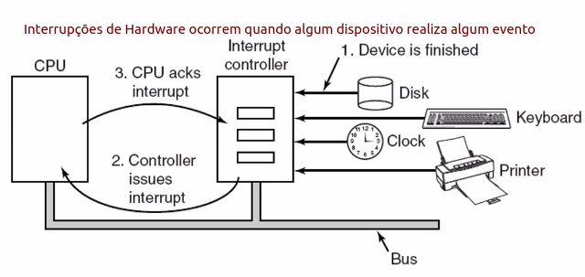

1. Salva os registradores não salvos pelo hardware
2. Configura o novo contexto do tratador da interrupção
3. Configura a pilha para o código de tratamento da interrupção
4. Confirma interrupção para o controlador de interrupções (APIC)
5. Copia os registradores salveos para a PCB do processo
6. Executa o código do tratador da interrupção (interrupt handler)
7. Escolha qual o próximo processo será executado
8. Configura o SO para assumir o contexto do novo processo (espaço de endereçamento, pilha, etc.)
9. Carrega os registradores com os dados do novo processo, incluindo o PC (program counter)
10. Inicia a execução do novo processo

### Escalonamento

#### Tipos de Processos

- CPU Bound: A maior parte do tempo, o processo se mantém rodando na CPU até o seu tempo máximo
- I/O Bound: processo realiza mais operações de I/O bloqueantes do que processamento da CPU (processo sai da CPU antes do tempo máximo)

#### Critérios de Escalonamento

- Utilização da CPU
- Throughput (nTasks/unid. tempo)
- Turnaround
- Tempo de Resposta

#### Escalonador de processos

- Invocado a cada n clock ticks

  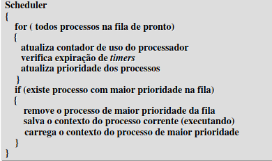

#### Tipos de Escalonamento

- Não-preemptivo
  - O processo executa na CPU até seu término ou repasse voluntário do recurso
  - Não existe interferência do SO
- Escalonamento preemptivo
  - A execução dos processo é interrompida pelo SO
  - Cada troca de contexto gera um custo (overhead) para o sistema
  - O mecanismo utilizado é normalmente a interrupção de clock
  - Políticas de escalonamento fornecem parâmetros para os mecanismos de escalonamento (algoritmos)
- Não-preemptivo
  - FIFO: Utilização da CPU por ordem de chegada na fila
  - SJF (shortest-job-first): Processos com menor tempo de execução são selecionados primeiro
  - Cooperativo: Os processos liberam voluntariamente a CPU. Ex. MS-Windows 3.1/3.11
- Preemptivo
  - Round-robin (circular): Baseado em time-slice/quantum
    - Garante a execução das tarefas pela intervenção do SO, sendo esta sua principal vantagem em relação aos modelos não preemptivos
    - Sua deficiência reside no tratamento não diferenciado entre processos CPU-bound e IO-Bound

      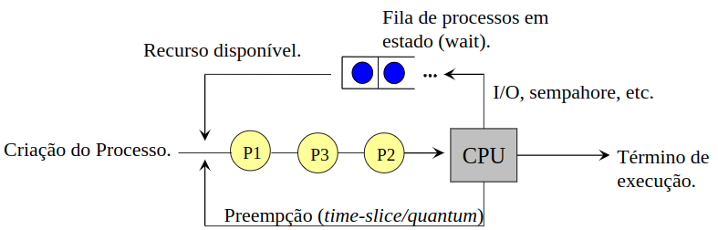
  - Prioridades: Permite diferenciar procesos I/O bound de CPU bound. A prioridade pode ser estática ou dinâmica
    - Processos IO-Bound possuirão maior prioridade em relação a processo CPU-Bound
    - As prioridades podem ser:
      - Estáticas: Atribuídas na criação do processo permanecendo durante toda a vida do processo
      - Dinâmicas: Mudam de acordo com o comportamento do processo
    - Exemplo: priority (1 \* quantum)/f, onde f = fração de tempo utilizada do quantun
      - PID(100 - CPUbound): priority = (1 \* 300)/300 = 1
      - PID(340 - IObound): priority = (1 \* 300)/2 = 150
    - Em muitos sistemas UNIX-like, o comando nice é utilizando para alterar a prioridade de processos

      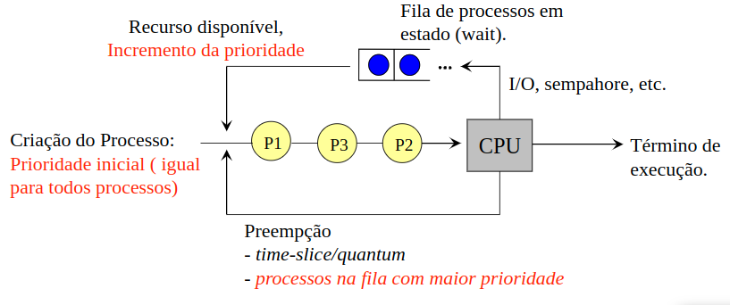
  - Múltiplas Filas: Existem várias filas de processo prontos. Processos na mesma fila são tratados de forma igual, contudo, as filas entre si são tratadas em nível de prioridade. Ex. Filas de processos I/O bound tem maior prioridade qu as filas de processo CPU bound