# Teoria dos Grafos (Graph Theory, Diestel)

## Arvores

- Arvore e um grafo simples (não tem laços nem arestas multiplas), conexo e acíclico
  - Laço: aresta que liga um vertice a ele mesmo
  - Arestas multiplas: mais de uma aresta entre dois vertices
  - Conexo: existe um caminho entre qualquer par de vertices
  - Acíclico: não existe ciclo
- Cada elemento de uma arvore é chamado de no ou vertice
- Arestas de uma arvore são chamadas de ramos e ligam os vertices

---

- Elemento principal chamado raiz fica no topo da arvore
- A raiz não tem pai
- A raiz é ligada a outros vertices chamados filhos
- Os filhos que não possuem filhos são chamados de folhas ou no terminal

---

- O numero subarvores (filhos) de cada no e chamado de grau do no
- O comprimento do maior caminho entre um no e uma folha e chamada de altura do no
- A distancia da raiz ate um determinado no, e chamada de profundidade/nivel do no

---

- Dado um grafo com pelo menos três vertices (n = 3), se ele for conexo e não possuir ciclos, ele pode ser representado por uma arvore
  - G e conexo com n - 1 arestas
  - G e acíclico com n - 1 arestas
  - G e acíclico e a adição de uma nova aresta cria um ciclo
  - G e conexo e cada aresta G e uma ponte
    - Ponte: aresta que, se removida, desconecta o grafo (aumenta o numero de componentes conexos)
      - Componentes conexos: subgrafo conexo
        - Subgrafo: subconjunto de vertices e arestas de um grafo
  - Existe exatamente um caminho entre cada par de vertices

---

- O grau de um vertice e dado pelo numero de arestas que saem dele (ou entram nele)
  - melhor definido pelo numero de vertices adjacentes em um grafo simples
- Qualquer vertice de grau <= 1 e uma folha
- Qualquer vertice de grau > 1 e um no interno
- Toda arvore com n > 1 nos possui de 1 a n - 1 folhas

---

- Excentricidade de um vertice e a maior distancia entre ele e qualquer outro vertice
- Para calcular a excentricidade de um vertice, basta calcular a distancia entre ele e todos os outros vertices e pegar o maior valor
- Centro de uma arvore e o conjunto de vertices com menor excentricidade
- Para chegarmos o centro de uma arvore, basta ir removendo as folhas ate termos um grafo com 1 ou 2 vertices que são o centro dessa arvore inicial

---

- Tipos de grafo arvores:
  - Grafo estrela: um vertice central e todos os outros vertices sao adjacentes a ele
  - Floresta: conjunto de arvores (componentes conexos aciclicos e simples)
  - Arvore binaria: arvore de grau 2 (nenhum no tem mais que dois filhos)
    - possui um no raiz
    - filhos são duas subarvores disjuntas (esquerda e direita)
  - Arvore AVL: balanceada com rebalanceamento na inserção e remoção
    - subarvores esquerda e direita possuem diferença de altura de no maximo 1

- Representações:
  - Diagrama de inclusão (Diagrama de Venn), circulos representam nos e e dentro deles seus descendentes
  - Diagrama de barras
  - Aninhamento
  - Numeração por niveis

---

- Arvore enraizada e uma arvore com um vertice raiz
- Ancestral: vertice que esta acima de outro vertice
  - Ancestral proprio: vertice que esta acima de outro vertice e nao e o proprio vertice
- Descendente: vertice que esta abaixo de outro vertice
  - Descente proprio: vertice que esta abaixo de outro vertice e nao e o proprio vertice
- Irmãos: vertices que tem o mesmo pai

---

- Arvore enraizada ordenada: arvore enraizada com uma ordem de visita dos vertices
  - Pre-ordem: visita-se o vertice, depois os descendentes
  - Pos-ordem: visita-se os descendentes, depois o vertice
  - Em-ordem: visita-se os descendentes da esquerda, depois o vertice, depois os descendentes da direita

---

- Arvore geradora: subgrafo conexo de um grafo que contem todos os vertices e uma quantidade minima de arestas (forma uma arvore)

- Arvore geradora minima: arvore geradora de menor peso
  - Peso: soma dos pesos das arestas

- Algoritmo de Kruskal: algoritmo que encontra uma arvore geradora minima
  - Ordena as arestas por peso
  - Adiciona as arestas na arvore geradora minima, desde que nao crie ciclos (se criar descarta a aresta)
  - Para saber se uma aresta cria um ciclo, basta verificar se os vertices dela ja estao na arvore geradora minima
  - Ir repetindo ate que a arvore geradora minima tenha todos os vertices
  - O algoritmo de Kruskal funciona para grafos conexos e desconexos

---

1. Qual e o centro da arvore mostrada na figura

    

2. Encontre a arvore geradora minima usando o Algoritmo de Kruskal

    

3. Quais as principais caracteristicas que definem um grafo como uma arvore
   - Conexo, Aciclido e Simples com n - 1 arestas, onde n e o numero de vertices

4. Quais os gargalos que tornam a arvore AVL mais lenta que a arvore rubro-negra quando tem muitos itens inseridos?
   - O processo de balanceamento por rotação da AVL se torna muito custoso quando temos muitos itens inseridos, pois a cada inserção ou remoção, a arvore precisa ser balanceada

## Conectividade

- Grafo orientado e um grafo em que as arestas possuem direção (digrafo)
- Grafo não orientado e um grafo em que as arestas nao possuem direção (grafo)

### Conexo para digrafo

- Digrafo pode ser fortemente conexo ou fracamente conexo
  - fortemente: existe um caminho entre cada par de vertices
  - fracamente: se transformar em um grafo (não direcionado) e esse for conexo

### Componentes conexos

- subgrafo conexo máximo: subgrafo conexo que nao pode ser aumentado adicionando mais vertices ou arestas
- tanto para digrafo quanto para grafo, o numero de componentes conexos e dado pelo numero de subgrafos conexos maximas

### Ponte

- Aresta que, se for removida, o grafo vira desconexo

### Conjunto de separação u-v ou Conjunto de corte

- conjunto de vertices que, se removidos, desconectam o grafo
  - ao remover os vértices desse conjunto, o grafo se torna desconexo
- conjunto de corte contendo apenas um vértice são chamados de "pontos de articulação"

#### Conjunto separação de tamanho mínimo (k(G))

- Menor conjunto que desconecta o grafo, denotado por k(G)
- Para um grafo completo (todos os vértices estão conectados), k(Kn) = n - 1
  - como todos os vértices estão conectados entre si, só podemos reduzir ao grafo trivial para tornar o grafo desconexo

#### P-Conectividade

- Grafo é p-conexo se p <= k(G) e p >= 1
  - ou seja, p-conexo é um grafo que tem um conjunto de corte de tamanho no máximo p, não existe um conjunto de corte de tamanho menor que p

#### Conjuntos de caminhos internamente disjuntos

- Conjunto de caminhos que nao se cruzam (no exemplo abaixo, entre A e F)
  - Caminho 1: A -> C -> E -> G -> F
  - Caminho 2: A -> B -> H -> F
  - Caminho 3: A -> J -> I -> F

### Teorema de Menger

- Dado vértices não adjacentes u e v, existe um conjunto de caminhos internamente disjuntos que conecta u e v, e o tamanho desse conjunto é de mesmo tamanho do conjunto de separação de tamanho mínimo.
  - ou seja, para calcular o tamanho mínimo de um conjunto de separação, basta calcular o tamanho do conjunto de caminhos internamente disjuntos que conecta dois vértices não adjacentes

### Teoremas

- Se um grafo não orientado conexo tem n vértices e m arestas, então ele tem no mínimo n - 1 arestas (m >= n - 1)
- Se a quantidade de arestas m de um grafo não direcionado é maior n-1 tomado 2 a 2 (m > $\binom{n-1}{2}$), então o grafo é conexo
- Todo grafo completo tem $\binom{n}{2}$ arestas, sendo $K_{x}$ denominado como grafo completo com x vértices

---

1. Qual a diferença entre um grafo direcional fracamente conexo para um fortemente conexo
   - Um grafo direcional fracamente conexo é um digrafo que se transformado em um grafo nao direcional, é conexo, já o fortemente conexo é um digrafo que já é conexo (sem necessidade de transformar em um grafo nao direcional)

2. Dado um grafo com 'm' arestas e 'n' vertices, como saber se esse grafo é completo? Ou seja, quantas arestas ele deve possuir?
    - Para saber se um grafo é completo, basta verificar se ele possui $\binom{n}{2}$ arestas, ou seja, se 'm' é igual a $\binom{n}{2}$

3. O Tour do Cavalo Aberto (Open Knight’s Tour) de um tabuleiro n x n descreve um caminho tal que, dado um espaço inicial no tabuleiro, um cavalo do xadrez poderia navegar por todas os espaços, sem passar duas vezes pelo mesmo espaço. Pode-se montar um grafo G que represente o tour do cavalo, onde cada vértice é um espaço do tabuleiro, e cada aresta representa uma movimentação do cavalo de entre dois vértices
   1. Pode-se afirmar que G é conexo. Por quê?
     - O problema do cavalo aberto é um problema de caminho hamiltoniano, ou seja, um caminho que passa por todos os vertices do grafo apenas uma vez. Como na definição do problema, o tabuleiro tem caminhos hamiltonianos para qualquer posição inicial, o grafo G também tem caminhos hamiltonianos, logo, é conexo
   2. Qual a conectividade de G(k(G))?
      - 2-conexo, pois o canto do tabuleiro tem apenas dois vizinhos

## Passeios Eulerianos

> Uma definição importante (não escrita antes)

- Multigrafo: grafo que pode ter mais de uma aresta entre dois vértices

---

### Definições

- Grafo euleriano: grafo que possui um circuito euleriano fechado
  - circuito euleriano: passeio que passa por todas as arestas do grafo apenas uma vez, começando e terminando no mesmo vértice
- Grafo não-euleriano semi-euleriano: grafo que possui um circuito euleriano aberto
  - circuito euleriano aberto ou caminho euleriano: passeio que passa por todas as arestas do grafo apenas uma vez, começando e terminando em vértices diferentes
- Não euleriano: grafo que não possui um circuito euleriano aberto nem fechado
- Passeio não euleriano: um passeio fechado que contém cada aresta de G visitada pelo menos uma vez

### Teorema de Euler

- Um grafo G é dito euleriano se há um ciclo que passa por todas as arestas do grafo sem repeti-las
  - esse ciclo é denominado de ciclo euleriano

- Se tivermos um grafo não-euleriano, podemos transformá-lo em um grafo euleriano, adicionando arestas
  - para isso, basta adicionar arestas entre vértices de grau ímpar, até que todos os vértices tenham grau par

#### Teorema multigrafo

- M multigrafo vai ser euleriano se:
  - for conexo
  - e cada vértice de M tem grau par

#### Grafo Atravessável

- Um grafo G é atravessável que tem:
  - um caminho contendo todas as arestas de M (multigrafo anterior)
    - esse caminho é euleriano

#### Teorema (Hierholzer)

- Um grafo conectado (conexo) tem um caminho euleriano se e somente se exatamente zero ou dois de seus vértices tem um grau ímpar

#### Teorema de Euler-Hierholzer

- Um multigrafo é euleriano se e somente se é conexo e todos os vértices tem grau par

---

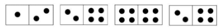

1. É possível arranjar as peças de dominó em um percurso fechado?
   - Não é possível pois a primeira peça não tem um correspondente para fechar o percurso

2. Na Modelagem, o que significam os vértices, as arestas e qual problema esta associado?
   - Vértice: peças do dominó
   - Arestas: associação entre as peças q tem mesma cabeça ou cauda
   - Problema: tour euleriano (deve ser possível voltar na mesma peça inicial e percorrer todas as arestas)
3. Considere um grafo G com um trajeto euleriano. Se o grafo possui um vértice v com grau ímpar, então o trajeto euleriano começa e termina no mesmo vértice?
   - Não, pois todos os vertices devem ter grau par para que o grafo seja tour euleriano (incia e termina no mesmo vertice)
4. Dado o grafo G abaixo, ele possui um passeio euleriano?

    

- Possui um tour euleriano, pois todos os vertices tem grau par e o grafo é conexo

## Ciclos Hamiltonianos

Definições

- Grafo hamiltoniano: grafo que possui um circuito hamiltoniano fechado
  - circuito hamiltoniano: passeio que passa por todos os vértices do grafo apenas uma vez, começando e terminando no mesmo vértice

- Passeio hamiltoniano: um passeio fechado que contém cada vértice de G visitado pelo menos uma vez

---

Perguntas

1. Qual a diferença entre um grafo hamiltoniano para um grafo euleriano?
   - hamiltoniano: passeio que passa por todos os vértices do grafo apenas uma vez, começando e terminando no mesmo vértice
   - euleriano: passeio que passa por todas as arestas do grafo apenas uma vez, começando e terminando no mesmo vértice

2. Retirando os vértices 6, 12 e 7 da figura apresentada, é possível ter
um ciclo hamiltoniano? Se sim, mostre o mesmo.

    - 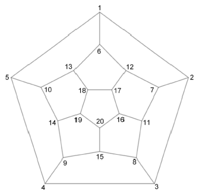

3. Qual a diferença entre o Ciclo Hamiltoniano e os Passeios Euleriano ?
   - Ciclo Hamiltoniano define um ciclo no grafo que percorre todos os vertices do mesmo sem repetir os mesmos
   - Passeio Euleriano define um caminho no grafo que percorre todas as arestas uma unica vez, não necessariamente terminando no mesmo vertice de partida

4. Existe um algoritmo que consegue achar o ciclo hamiltoniano com menor peso eficientemente em tempo polinomial? Se sim, como ele funciona ? Se não, é possível achar um algoritmo que se aproxime do resultado por outros métodos?
   - Não, o problema e considerado como NP dificil, e temos algoritmos que a partir de um ciclo hamiltoniano com peso alto encontra um peso menor

## Emparelhamento ou Acoplamento

Definições

- Grafo bipartido: grafo que pode ser dividido em dois conjuntos disjuntos de vértices, de tal forma que cada aresta conecta um vértice de cada conjunto
  - grafo bipartido completo: grafo bipartido em que cada vértice de um conjunto é conectado a todos os vértices do outro conjunto
  - não possui um ciclo de tamanho impar
- Emparelhamento maximal: emparelhamento que não pode ser aumentado (se aumentar, propriedade de adjacência sera desfeita)
- Emparelhamento maximo:
  - emparelhamento maximal que possui o maior número de arestas
  - ou aqueles que não possuem caminho M-aumentante
    - M-aumentante: caminho que começa e termina em vértices não emparelhados (vertices livres) e que possui arestas alternadas (um emparelhamento e uma não emparelhada)
- Emparelhamento perfeito: emparelhamento maximo que possui todos os vertices do grafo
  - Arestas no emparelhamento perfeito são chamadas de arestas cobertas/permitidas
  - Arestas fora do emparelhamento são chamadas de arestas não cobertas ou proibidas
  - So existe em grafo de ordem par e e um emparelhamento contendo contendo n/2 arestas
- Emparelhamento completo: em um grafo bipartido, todas as arestas de um conjunto são conectadas a todas as arestas do outro conjunto
  - emparelhamento completo é um emparelhamento perfeito

---

Teoremas

- Se G bipartido, G tem emparelhamento perfeito se, |N(s) >= S|
  - N(s): conjunto de vizinhos de s
  - ou seja, grau de cada vértice de S deve ser maior ou igual ao tamanho de S

---

Execicios

- Suponha que existam 4 pessoas, a1, a2, a3 e a4 disponíveis para preencher 6 funções vagas, p1,. . ., p6.
- As pessoas a1, a2 e a4 são qualificadas para exercer a função p2 ou p5.
- A pessoa a3 é qualificada para exercer a função p1, p2, p3, p4 ou p6.

1. A questão é: Será possível empregar todas as pessoas de tal forma que cada pessoa desempenhe a função para a qual está qualificada?
   - Não, o conjunto S = {a1, a2, a3}, tem se que N(S) < |S|, ou seja 2 < 3, o que não permite o emparelhamento completo, deixando um vertice livre
2. Como representar este problema através de um
grafo?

    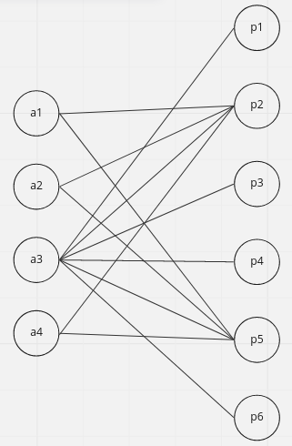

## Coloração de arestas

- Colorir arestas de um grafo de tal forma que nenhuma aresta adjacente tenha a mesma cor
- Indice cromatico: numero minimo de cores necessárias para colorir o grafo
  - denotado por χ'(G)
  - quando um grafo pode ser colorido com k cores, dizemos que o grafo é k-colorivel

### Conceitos (Coloração de arestas)

- delta(G): grau maximo de um vertice de G
- coloração propria: coloração de arestas em que cada aresta adjacente tem uma cor diferente

### Teoremas (Coloração de arestas)

- Vizing (Dado o numero de vertices N)
  - Grafos do tipo ciclo
    - Se N é par, χ'(G) = 2
    - Se N é impar, χ'(G) = 3
  - Grafos do tipo Roda (Grafo completo com um vertice isolado)
    - Se N >= 4, χ'(G) = N-1
  - Grafos do tipo K-completos (grafo completo com K vertices)
    - Se N impar, χ'(G) = N
    - Se N par, χ'(G) = N-1
- Konig (bipartidos)
  - Se G bipartido, χ'(G) = grau do vertice de maior grau
  - ou, se G bipartido, χ'(G) = numero de vertice da partição com maior quantidade de vertices

### Exercicios (Coloração de arestas)

1. Considerando o grafo G do tipo ciclo abaixo, sabendo que tal grafo
possui 14 vértices e utilizando o teorema de Vizing, determine o índice
cromático χ′(G) de tal grafo.

    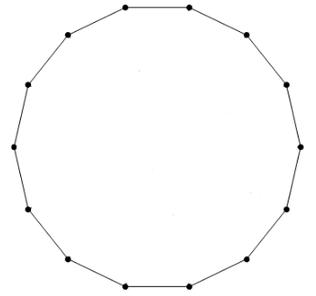
   - χ'(G) = 2, pois a quantidade de vertices e par

2. Considere agora que um vértice central e adjacente a todos os outros foi adicionado ao grafo ciclo G. Essa alteração fez com que o grafo se tornasse um grafo do tipo roda (Wheel), representado na imagem abaixo. Sabendo que tal grafo possui agora 15 vértices e utilizando o teorema de Vizing, determine o índice cromático χ′(G) deste novo grafo.

    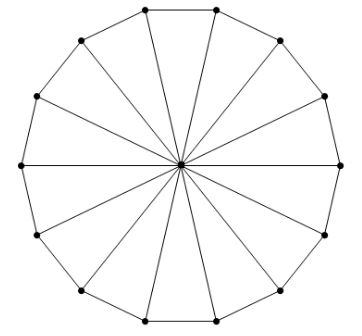
    - χ'(G) = 14, pois o grafo e de roda e possui 15 vertices

3. Considere o grafo bipartido completo K (6,3) abaixo. Utilizando o teorema de König, determine seu índice cromático χ′(G).

    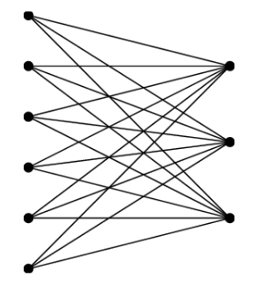
    - χ'(G) = 6, pois o grafo e bipartido e possui 6 vertices na partição de maior quantidade de vertices

4. Dado o grafo abaixo, responda as seguintes perguntas:
   1. Este grafo e 2-colorivel proprio?
      1. Nao, pois não podemos colorir as arestas de forma que cada aresta adjacente tenha uma cor diferente usando apenas duas cores. Pois 4 arestas estão adjacentes entre si, então no minimo precisamos de 4 cores
   2. Qual seu respectivo indice cromatico?
      1. X'(G) = 4

    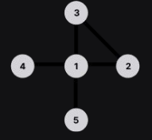

5. Apresentado os conceitos basicos de coloração de arests, assinale V ou F
   - (f) Um grafo pode ter indice cromatico 4 e ser 3-colorivel proprio
   - (f) Coloração propria diz a respeito da quantidade minima de cores para se colorir as arestas de um grafo, de modo que duas adjacentes adjacentes não tenham cores iguais
   - (v) Um grafo pode utilizar mais cores que seu indice cromatico respeitando a coloração propria
   - (f) Um grafo k-colorido e aquele que pode ser colorido com uma quantidade k + 1 de cores

## Conjuntos independentes

- Conjunto de vertices de um grafo tal que nenhum vertice do conjunto é adjacente a outro vertice do conjunto
- Conjunto independente maximo: conjunto independente de maior tamanho (denotado por carnalidade maxima do grafo as vezes)
- Conjunto independnete maximal: conjunto independente que não pode ser aumentado com adição de um outro vertice, mas não e o cojnunto independente maximo

---

### Exercicios (Conjuntos independentes)

1. Encontre o conjunto independe maximo do grafo a seguir

    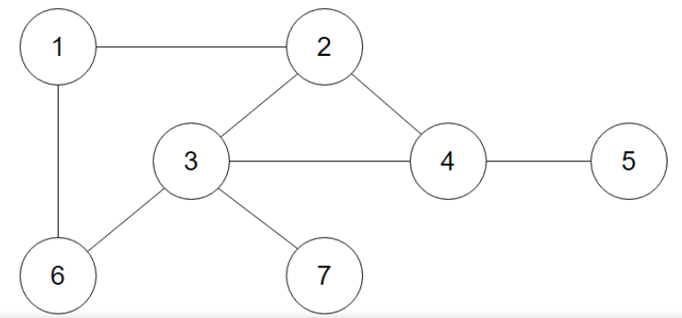
    - {5, 7, 6, 2}
2. Marque a alternativa correta

    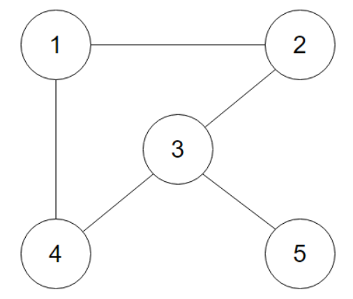

    i. O conjunto {2, 4, 5} e o conjunto independente maximo do grafo (v)

    ii. O grafo possui 3 conjuntos maximais (v)

    iii. O conjunto {2, 4} e maximal (f)

    iv. O conjunto {1, 3} e maximal (v)

    v. A cardinalidade maxima do grafo e 3 (v)

    - alternativa e (nenhuma das outras alternativas)

## Cliques

- Definição: subconjunto de vértices tais que cada dois vértices do subconjunto são conectados por uma aresta (subconjunto é um subgrafo completo)

---

### Clique maximal

- clique que não pode ser aumentado com a adição de um outro vértice

### Clique máximo

- clique de maior tamanho (denotado por clique maximo do grafo que detem a maior quantidade de vertices)

> O clique máximo é maximal

### Exercicios (Cliques)

1. Encontre os cliques maximais e o clique máximo da imagem
    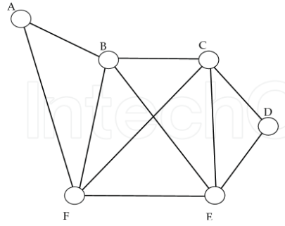
    - cliques maximais:
      - {a, b, f}, {d, e, c}
      - {b, c, e, f}
    - clique máximo
      - {b, c, e, f}

2. Qual a diferença entre conjuntos independentes e cliques? No grafo abaixo cite 2 exemplos de conjuntos independentes e 2 exemplos de cliques

    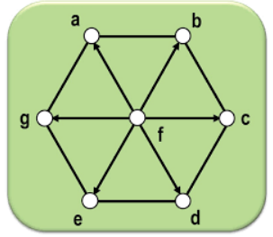  

   - Conjuntos independentes são subconjuntos de vértices que não adjacentes entre si
   - Cliques são subconjuntos de vértices que todos são adjacentes entre si (um subgrafo completo)
   - Exemplos de conjuntos independentes:
     - {g, b, d}
     - {a, c, e}
   - Exemplos de cliques:
     - {c, d}
     - {a, b}

## Coloração de vértices

- Coloração de vértices: atribuir cores a cada vértice de um grafo de modo que vértices adjacentes não tenham a mesma cor
- Coloração própria: um grafo colorido de forma que vértices vizinhos possuem cores distintas
- k-coloração: define a quantidade mínima de cores para colorir um grafo de maneira própria
- Partição cromática: conjunto independente de vértices de um grafo que possuem cores distintas

---

- Número cromático: menor número de cores necessárias para colorir um grafo de maneira própria (denotado por χ(G))
  - Grafo não possui arestas, χ(G) = 1
  - Grafo bipartido, χ(G) = 2
  - Árvores, χ(G) = 2
  - Cíclico com número par de vértices, χ(G) = 2
  - Cíclico com número ímpar de vértices, χ(G) = 3
  - Grafo completo, χ(G) = n

---

Teoremas

- Dado um clique de tamanho w(G), o número cromático é no mínimo o tamanho do clique
  - ou seja, o número cromático é maior ou igual ao tamanho do clique máximo (clique máximo é um subgrafo completo, e a coloração dele é a quantidade de vértices do clique)

---

- Grafo crítico
  - Dado um subgrafo H de G, se χ(H) < χ(G) se G for crítico

---

Perguntas

1. Descreva simplificadamente um algoritmo para coloração de vértices respeitando número cromático em grafos cíclicos
   - Inicie em um vértice com uma cor e percorra o ciclo colorindo os vértices adjacentes com cores alternadas, se o ciclo tiver um número par de vértices, χ(G) = 2, se o ciclo tiver um número ímpar de vértices, χ(G) = 3
2. No vértice a seguir, cada vértice representa uma torre de rádio. As arestas indicam que as torres estão a menos de 100 milhas de distância, então o uso de uma mesma frequência entre os vértices das extremidades incorre em interferência. Quantas frequências de rádio são necessárias? Explique como você alcançou este resultado.

    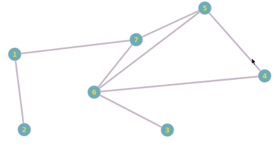

    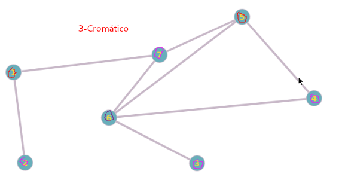

    - Serão necessárias 3 frequências de rádio, e cheguei nesse resultado colorindo inicialmente os vértices de maior grau, evitando vértices adjacentes com a mesma cor, e assim por diante.

3. Observando o grafo ao lado, qual seria o seu número cromático e uma de suas partições cromáticas

    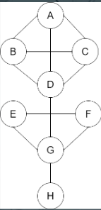

    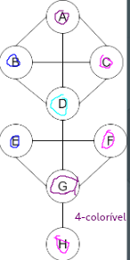
    - Número cromático = 4
    - Uma partição cromática = {a, g}

4. Encontre uma possível solução para colorir os estados do mapa do Brasil com apenas quatro cores, de modo que estados com fronteiras comuns tenham cores diferentes.

    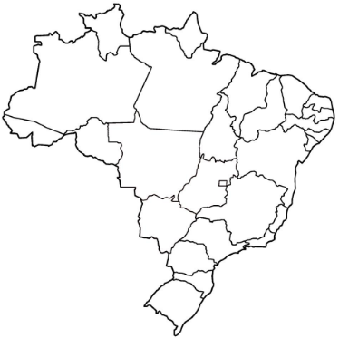

## Teoremas grafos 2-conexo

### K-Conectividade (Teoremas grafos 2-conexo)

> Dado um grafo conexo, você precisa de remover *pelo menos k *vértices** para tornar o grafo desconexo.

Ou também, devido ao teorema de Menger pode ser expressa por

> Dado um grafo conexo, ele é k-conexo se e somente se quaisquer par de vértice existem k caminhos independentes entre eles.

### Grafo 2-Conexo

> Grafo em que qualquer par de vértices tem pelo menos 2 caminhos independentes entre eles.

> Grafo que precisa de mais de um vértice ser removido para se tornar desconexo.

### Exemplo de grafo 1-Conexo

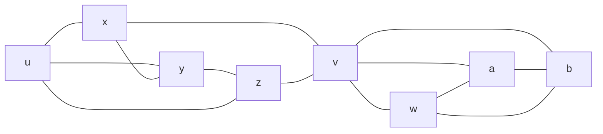

> *v* é vertice de corte

### Teorema 3.1.1 Blocos

#### Definições (grafos 2-conexo)

| Termo            | Definição                                                                |
| ---------------- | ------------------------------------------------------------------------ |
| Ligação          | Conjunto mínimo de arestas que se removidas provocam desconexão do grafo |
| Vértice de corte | Vértice que ao ser removido provoca desconexão do grafo                  |
| Bloco            | Subgrafo conexo maximal sem um vertice de corte                          |
| Ponte            | Aresta que, se removida, desconecta o grafo                              |
| Ciclo            | Passeio sem vértices repetidos que começa e termina no mesmo vértice     |
| B-caminho        | Caminho de um subgrafo que passa pelo grafo em que esta contido          |

[DESENHAR DOIS CONJUNTOS G e B, B CONTIDO EM G E FAZER UM CAMINHO INICIANDO EM B E TERMINANDO EM B]

### Propriedades de um bloco

Uma ponte e um bloco e um vertice isolado tambem

Considerando um grafo feito pela união de blocos (blocos, pontes e vertices isolados), devido a maximidade do bloco, blocos em um grafo compartilham no máximo um vértice, este vértice compartilhado é uma vertice de corte.

Portanto todo nó em um grafo está em um único bloco, e este grafo é a união de todos os blocos.

1. Os ciclos em um grafo são os ciclos de seus blocos.
2. As ligações de um grafo são os cortes mínimos de seus blocos.

> Prova

1. Qualquer ciclo é um subgrafo conexo sem um vertice de corte (dai vem sua maximidade), logo é um bloco.
   1. [DESENHAR UM CICLO E REMOVER UM VERTICE]
2. Considerando um corte no grafo, com os vértices $xy \subset B$, sendo $B$ um bloco
   1. pela maximidade do bloco, o grafo não possuí um $B$-caminho no grafo, logo todo caminho entre $x$ e $y$ passa por $B$, então se eu cortar um caminho em $B$ que separa $x$ e $y$, também corta o caminho no grafo em que esta contido

> Logo blocos são para a 2-conectividade o que componentes conexas são para a conectividade.

Como os blocos são disjuntos a não ser pelos  vértices de corte (articulações), eles dão a estrutura do grafo pela intersecção de blocos nos vértices de corte.

[DESENHAR UM GRAFO COM BLOCOS E VÉRTICES DE CORTE E TRANSFORMAR NA ÁRVORE DE BLOCOS]

Logo todo bloco de um grafo ou é um subgrafo conexo maximal, ou é uma ponte ou é um vértice isolado.

### Teoremas de inicio para a prova do teorma geral para grafos 2-conexo

> Teorema geral para grafos 2-conexo: Todo grafo 2-conexo e um ciclo inicial unido a H-caminhos

- [DESENHAR UM GRAFO 2-CONEXO E UM CICLO INICIAL E UM H-CAMINHO]

#### Teorema 1

- Se G é um grafo 2-conexo, então G tem um ciclo.
  - Por absurdo, assumimos que G não tem um ciclo
  - Logo, G e um grafo que não tem um ciclo -> G seria uma arvore
  - Arvores por definição são 1-conexos
  - Absurdo! G e 2-conexo
  - Logo, G tem um ciclo

### Aplicação

- Apresentar o código do wikiscrapper
- Comentar sobre a forma de popular o grafo (bfs vs dfs)
- Algorigmo de gerar lista ordenada com base nos critérios
  1. Quantidade de caminhos disjuntos entre o vértice de origem e o vértice de destino
  2. Considerando os com a mesma quantidade de caminhos disjuntos, escolher o vértice de menor distância