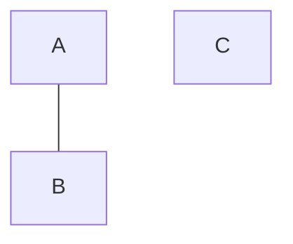
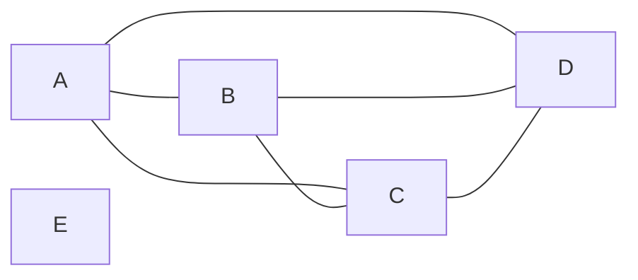

# Conectividade

## Revisão: Tipos de grafos

- Grafo orientado (dígrafo)
  - Setas
- Grafo não orientado
  - Linhas

## Grafo conexo

- Grafo conexo
  - Se existe um caminho de **u* até *v**
  - Então **v* é acessível a partir de *u**
- Digrafo
  - Fortemente conexo
    - Se existe um caminho de **u* até *v**
    - E existe um caminho de **v* até *u**
    - Para todo par **u, **v* do grafo*
  - Fraquemente conexo
    - Se transformar em um grafo e este for conexo, o digrafo é fracamente conexo

## [Teorema 1](https://www.youtube.com/watch?v=At44kFBdjiE&ab_channel=Prof.AlexandreLevada)

- Seja *G* um grafo conexo não direcional
- #Vértices = *n*
- #Arestas = *m*
- $m>=n-1$

### Prova

1. Começamos com um grafo sem vértices, logo cada vértice é um componente conexo
2. Grafo é conexo se o número de componentes conexos for 1
3. A cada vértice adicionado, o número de componentes conexos diminui em 1

> Três componentes conexos

> Dois componentes conexos

4. Se $m<n-1$ (quantidade de ligações é menor que a quantidade de bolinhas - 1, grafo *não* conexo)
   - Para manter a desigualdade $m$ é no máximo igual a $n-2$
5. Então o número de componentes conexos é $n - (n-2) = 2$, logo o grafo não é conexo

## [Teorema 2](https://www.youtube.com/watch?v=At44kFBdjiE&ab_channel=Prof.AlexandreLevada)

> Se $m>(n-1)/2$, então o grafo não direcional é conexo

### Prova

1. Assumir que o grafo não é conexo
2. No pior caso, $n-1$ vértices formam o grafo completo e um vértice isolado, formando o grafo K$_{n-1}$

3. Se adicionarmos 1 aresta, o grafo completo se torna conexo
4. Implica dizer que no máximo temos $m=(n-1)/2$ em um grafo disconexo

## Componentes conexos

- Componente conexo
  - Subgrafo conexo **máximo**
  - Tanto para digrafo quanto para grafo

## Conjunto de separação u-v

> Conjunto de *vértices* que, se removidos, desconectam o grafo

Ao remover os vértices pertencentes ao conjunto de separação, o grafo se torna desconexo, com u estando em um componente conexo e v em outro.

### Conjunto de separação de tamanho mínimo

> Menor conjunto que desconecta o grafo

### Conjuntos de caminhos internamente disjuntos

> Se cada par de caminhos de *u* até *v* não tem vértices em comum

Caminho 1: A-C-E-*G*-F
Caminho 2: A-B-H-F
Caminho 3: A-D-*G*-F

Logo estes caminhos não são internamente disjuntos

## Teorema de Menger

Dado os vértices não adjacentes u e v, o tamanho máximo de um conjunto de separação é igual ao número máximo de caminhos disjuntos entre u-v

> Ou seja...

Para calcular o tamanho mínimo de um conjunto de separação, basta calcular o número máximo de caminhos disjuntos entre u-v

## Como descobrir conectividade

- Busca em profundidade
- Busca em largura