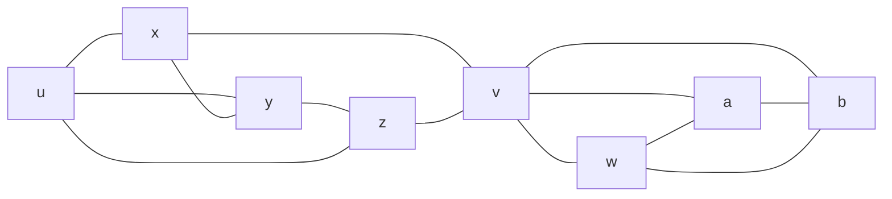

# Teoremas grafos 2-conexo

## K-Conectividade (Teoremas grafos 2-conexo)

> Dado um grafo conexo, você precisa de remover pelo menos k *vértices* para tornar o grafo desconexo.

Ou também, devido ao teorema de Menger pode ser expressa por

> Dado um grafo conexo, ele é k-conexo se e somente se quaisquer par de vértice existem k caminhos independentes entre eles.

## Grafo 2-Conexo

> Grafo em que qualquer par de vértices tem pelo menos 2 caminhos independentes entre eles.

> Grafo que precisa de mais de um vértice ser removido para se tornar desconexo.

## Exemplo de grafo 1-Conexo

> v é vertice de corte

## Teorema 3.1.1 Blocos

### Definições (grafos 2-conexo)

| Termo            | Definição                                                                |
| ---------------- | ------------------------------------------------------------------------ |
| Ligação          | Conjunto mínimo de arestas que se removidas provocam desconexão do grafo |
| Vértice de corte | Vértice que ao ser removido provoca desconexão do grafo                  |
| Bloco            | Subgrafo conexo maximal sem um vertice de corte                          |
| Ponte            | Aresta que, se removida, desconecta o grafo                              |
| Ciclo            | Passeio sem vértices repetidos que começa e termina no mesmo vértice     |
| B-caminho        | Caminho de um subgrafo que passa pelo grafo em que esta contido          |

[DESENHAR DOIS CONJUNTOS G e B, B CONTIDO EM G E FAZER UM CAMINHO INICIANDO EM B E TERMINANDO EM B]

## Propriedades de um bloco

Uma ponte é um bloco e um vértice isolado também

Considerando um grafo feito pela união de blocos (blocos, pontes e vertices isolados), devido a maximidade do bloco, blocos em um grafo compartilham no máximo um vértice, este vértice compartilhado é um vértice de corte (ponto de articulaç).

Portanto todo nó em um grafo está em um único bloco, e este grafo é a união de todos os blocos.

1. Os ciclos em um grafo são os ciclos de seus blocos.
2. As ligações de um grafo são os cortes mínimos de seus blocos.

> Prova

1. Qualquer ciclo é um subgrafo conexo sem um vertice de corte (dai vem sua maximidade), logo é um bloco.
   1. [DESENHAR UM CICLO E REMOVER UM VERTICE]
2. Considerando um corte no grafo, com os vértices $xy \subset B$, sendo $B$ um bloco
   1. pela maximidade do bloco, o grafo não possuí um $B$-caminho no grafo, logo todo caminho entre $x$ e $y$ passa por $B$, então se eu cortar um caminho em $B$ que separa $x$ e $y$, também corta o caminho no grafo em que esta contido

> Logo blocos são para a 2-conectividade o que componentes conexas são para a conectividade.

Como os blocos são disjuntos a não ser pelos  vértices de corte (articulações), eles dão a estrutura do grafo pela intersecção de blocos nos vértices de corte.

[DESENHAR UM GRAFO COM BLOCOS E VÉRTICES DE CORTE E TRANSFORMAR NA ÁRVORE DE BLOCOS]

Logo todo bloco de um grafo ou é um subgrafo conexo maximal, ou é uma ponte ou é um vértice isolado.

## Teoremas de inicio para a prova do teorma geral para grafos 2-conexo

> Teorema geral para grafos 2-conexo: Todo grafo 2-conexo é um ciclo inicial unido a H-caminhos

- [DESENHAR UM GRAFO 2-CONEXO E UM CICLO INICIAL E UM H-CAMINHO]

### Teorema 1

- Se G é um grafo 2-conexo, então G tem um ciclo.
  - Por absurdo, assumimos que G não tem um ciclo
  - Logo, G é um grafo que não tem um ciclo -> G seria uma arvore
  - Arvores por definição são 1-conexos
  - Absurdo! G é 2-conexo
  - Logo, G tem um ciclo

## Aplicação

- Apresentar o código do wikiscrapper
- Comentar sobre a forma de popular o grafo (bfs vs dfs)
- Algoritmo de gerar lista ordenada com base nos critérios
  1. Quantidade de caminhos disjuntos entre o vértice de origem e o vértice de destino
  2. Considerando os com a mesma quantidade de caminhos disjuntos, escolher o vértice de menor distância
