# Análise de Algoritmos

- Analisar eficiência computacional de algoritmos utilizando formalismo apropriado
- Aplicar técnicas de projeto de algoritmos
- Projetar algoritmos eficientes de acordo com a técnica mais adequada ao problema

> "Quanto tempo gasta??"

- memória, comunicação

> "Estou fazendo direito??"

- Depois:
  - "É possível resolver isso na prática??"
  - "É possível resolver isso??"

## Leibniz e os dados (Aula 1)

- Aquecimento e off topic
- Dado um lance de um par de dados, qual é soma mais provável 11 ou 12??
- (Se vc errou, esta em boa compania: Leibniz)

### Indução Matemática

- Se, ser verdade para n implica em ser verdade para n + 1
- Verdade para um n0
- É verdade (para n grande)
- Efeito Dominó
- Provas e Projeto de algoritmo

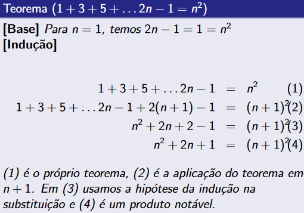

### Exercícios

1. Prove por indução
  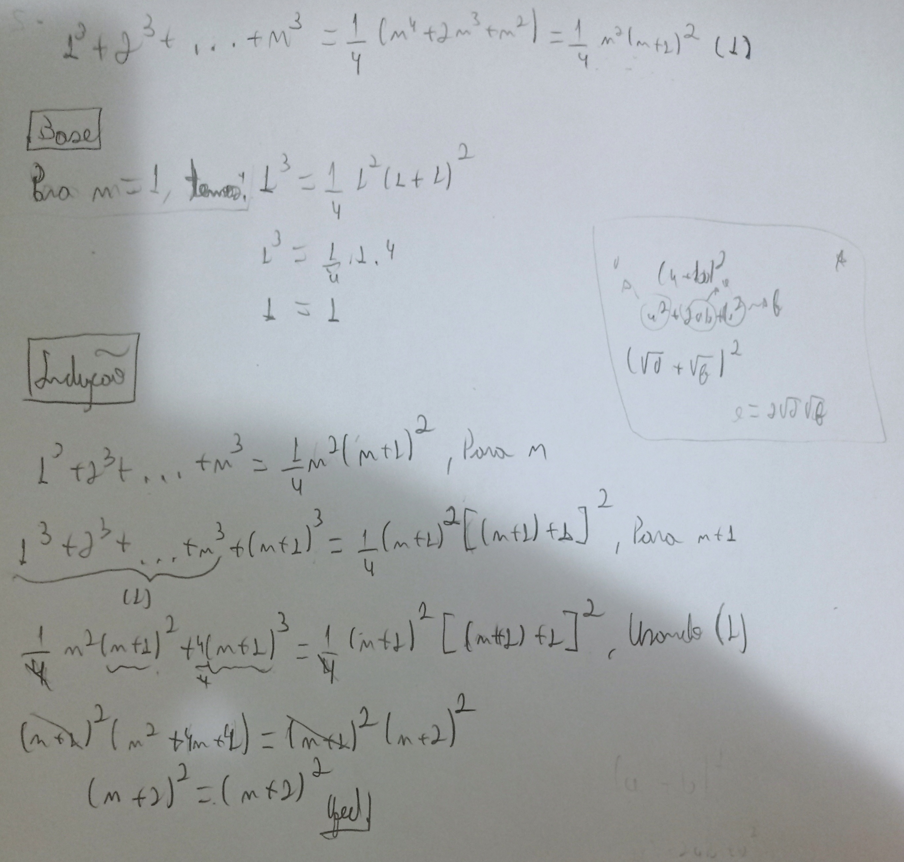
2. Hanói
  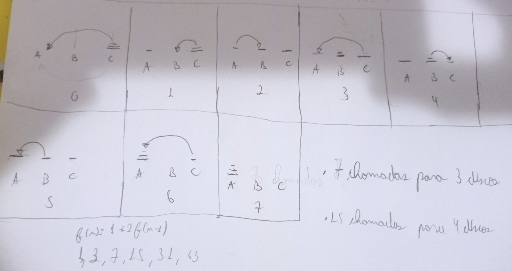
3. Pseudo-Algoritmo

- avaliaP(V, x):
  - R = 0
  - Q = 1
  - P / é de 1 a |V|:
    - R = R + Q * Vi
    - Q = Q * x
  - Retorna R

## Eficiência do algoritmo (Aula 2)

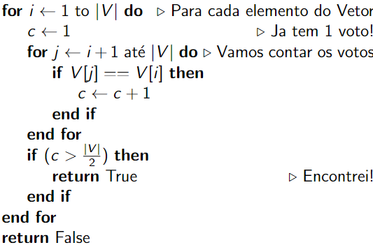

- Compilo e testo ... OK?
- Não!
- Linguagem?? Compilador?? Arquitetura??
- for x while
- c = c + 1 x c++
- Ir até a metade do vetor
- Operador ternário ou mesmo de uma multiplicação
- Evitar recomputação da metade (|V|/2) de acesso ao V[i]
- "Escovação de Bits!!"

---

- Vou abandonar a idéia do tempo em "segundos"
- Vou criar um modelo...uma fórmula matemática
- Representar o tempo de execução do algoritmo
- Complexidade do Algoritmo
- (=/= dificuldade em desenvolver, aprender, ...)

---

- Vou contar quantas vezes eu executo cada linha
- Em função do tamanho da entrada:n
  - No nosso caso, o tamanho do vetor
- **No pior caso**
- somar tudo
- isso vai "caminhar" para um modelo do tempo gasto


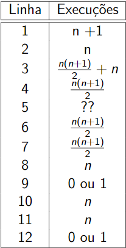

---

- Vou considerar o crescimetno da função
- "a cara do gráfico"
- Quanto n é grande!

---

- Para n grande
- n e n + 1 são "iguais"
- n/2, n e 2n são "iguais"
- ...
- Ok??

---

### Definição (O)

- Para uma dada função g(n) definimos O(g(n)) da sequinte form:
- O(g(n)) = {f(n): existem constantes positivas c e n0 tal que 0 <= f(n) <= cg(n) para todo n >= n0}

---

- f(n) = O(g(n))
- "f de n é ózão de g de n
- é -> pertence
- g limita o crescimento de f

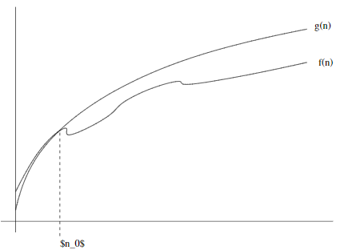

---

#### Exemplo

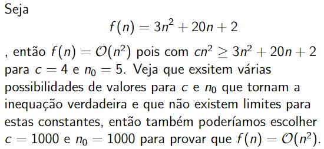

---

- 100n + 5 = O(n) ?
- 400n = O(n^2) ?
- n^2 = O(5000000n)

---

- Jogue fora as constantes aditivas
- Se livre das constantes multiplicativas
- n linear
- n^2 quadrática
- n^3 cúbico

---

- O(1): constantes
  - Qual?? Qual não estupido??
- O(ln n): logarítmico ou "log"
- O(2^n)
- Existem outros...

---

- Achar o maior(menor) elemento de um vetor
- Procurar alguma coisa em um vetor
- Remover um item de uma lista ligada, Cuidado com a pergunta!!
- Remover um item de um vetor
- Saber se existe um par de elementos em V tal que Vi + Vj = K

---

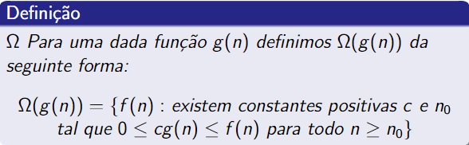

---

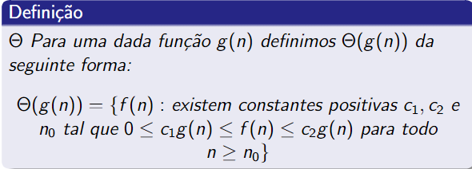

### Exercícios (Eficiência)

- Exercício 1
  - 1 /// 1^n
  - log10 n
  - lg lg n
  - lg n
  - n /// lg (2^n) /// n + 5
  - n lg n
  - n^2
  - 2^n
  - n!
- Resolução prof
  - Os constantes: 1, 1^n
  - Os sublineares: lg lg n, (log10 n, lg n)
  - Os lineares: lg(2^n), n, n + 5
  - n lg n
  - Quadrático: n^2
  - Exponencial: 2^n
  - n!

- Exercício 2


---

### O(n)

``` c++
for(int i = 0; i < n; i++) {
  // ...
}
```

- Cuidado com os "..."
- Sem laço, sem repetição, sem chamada de função

### O(n^2)

``` c99
for(int i = 0; i < n - 1; i++) {
  for(int j = 0; i < n; j++) {
    // ...
  }
} 
```

- Somatório de 1 até n - n(n + 1)/2

### Exemplo indução

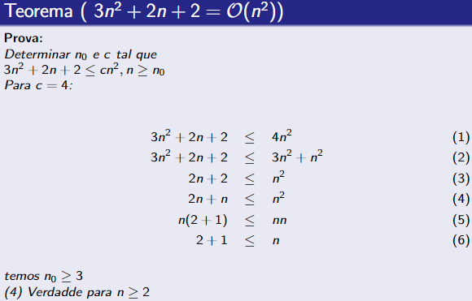


## Algoritmos de Ordenação

### BubbleSort

- Método intuitivo
- (não sei se o nome é intuitívo)
- Muito ruim!
- Assintoticamente
- (Constantes!)
- "Improved"

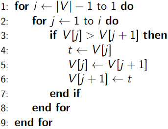

---

- O laço interno "empurra" o maior elemento do subproblema para a posição final: na iteração n o elemento n é colocado no seu lugar
- O laço externo - decrescente - controla o tamanho do subproblema que será alterado, desta forma o elemento que foi colocado na última posição do subproblema não será mais alterado

---

- Complexidade: O(n^2)

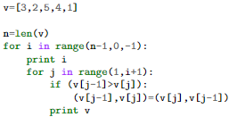

- 4
- [2, 3, 5, 4, 1]
- [2, 3, 5, 4, 1]
- [2, 3, 4, 5, 1]
- [2, 3, 4, 1, 5]
- 3
- [2, 3, 4, 1, 5]
- [2, 3, 4, 1, 5]
- [2, 3, 1, 4, 5]
- 2
- [2, 3, 1, 4, 5]
- [2, 1, 3, 4, 5]
- 1
- [1, 2, 3, 4, 5]

### Insertion

- Analogia com ordenação de cartas de um baralho
- Inicia com um conjunto de cartas na mesa
- Pegue um carta qualquer na mão, a mão está ordenada
- Pegue a próxima carta e insira-a na posição correta, a mão está ordenada
- ...

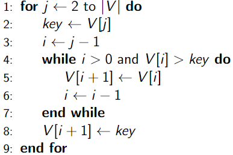

---

- No início de cada iteração: V[1..j-1] esta ordenado
  - Correto no início: vetor unitário
- (V[(j+1)..n] aguardando a ordenação)
- k = V[j] será colocado no lugar "correto" do vetor ordenado (linhas 4/7)
- O tamanho do vetor ordenado cresce em uma unidade (laço for)
- "Loop invariante" : propriedade de estar ordenado se mantem, mesmo o tamanho do vetor aumentando
- O laço for j é executado n vezes
- O laço while até j vezes
- Complexidade: O(n^2)

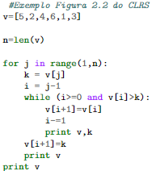

### MergeSort

- V1 e V2
- Vf que é ordenado contem os elementos de V1 e V2
- De novo, cartas de baralho

---

- Tava pensando...
- Assintoticamente não vejo como melhorar...
- Mas da pra fazer inplace??
- (O google falou que sim!)

---

- Merge: tempo O(n)
- Ele tá quase lá!

---

``` c
int o[5], v[5], i;
for(i = 0; i < 4; i++) {
  o[i] = Merge(o, [v[i]])
}
// processo similar a uma insertion sort
```

---

- Funciona??
- O esta sempre ordenado, Vazio e Merge de Vetores ordenados
- O contem os elementos de V

---

- Fizemos uma ordenação por inserção
- O(n^2)

---

- Saída clássica da recursão
  - "Eu não sei ordenar um vetor grande"
- Se algum ordenar as metades eu me viro
- *Divide and Conquer*

---

``` portugol
if |v| == 1 then
  return v
end if
M1 <- primeira metade de V
M2 <- segudna metade de V
M1O <- MergeSort(M1)
M20 <- MergeSort(M2)
return Merge(M1O, M2O)
```

#### Corretude

- (considerando que o Merge está correto)
- Para Vetor unitário, o algoritmo não faz nada
- Caso contrário, o problema é dividio em dois subproblemas
- Os subproblemas são resolvidos recursivamente
- E são unidos com Merge

---

#### Complexidade

- Cada chamada do MergeSort gasta o "seu" n (merge)
- Divide o problema em duas metades e chama duas recursões
- (O problema está sendo dividido mas não esta "diminuindo")
- Cria uma árvore
- Altura da árvore: lg n
- Cada andar da árvore gasta n
- O(n log n)

### QuickSort

- Pior caso O(n^2)
- Caso médio esperado: O(n lg n)
- Constantes pequenas
- In place
  - +fácil
- *Divide and Conquer*

---

- Ponto central do algoritmo: Partição
- Pivô (escolhido: último elemento)
- Partição com os menores que o pivo
- Partição com os maiores que o pivo
- O pivo "vai" para o lugar certo
- Exemplo, [5,3,7,2,1,6,9,8,4]
- Pivo = 4
- Produz = [3,2,1,4,5,7,6,9,8]
- E pela recursão..

---

``` portugol
//Ordenar A entre p e r:

if(p < r) then
  q = Partition(A, p, r)
  Quicksort(A, p, q - 1)
  Quicksort(A, q + 1, r)
end if

//Aplicar em [5,3,7,2,1,6,9,8,4]
```

---

``` portugol
// Particiona A entre p e r e retorna a posição do pivo:

q = p
for u = p ate r - 1 do
  if A[u] <= A[r] then
    troca(A, q, u)
    q += 1
  end if
end for
troca(A, q, r)
return q

//Vamos aplicar em [5,3,1,2,4]
```

---

- Árvore para o pior caso
  - Razoável ?? Possível ??
- Árvore para o caso "médio"

---

``` portugol
// Particiona A entre p e r e retorna a posição do pivo:

q = p
rn = randInt(p, r)
troca(A, rn, r)
...
```

---

``` portugol
//  Particiona A entre p e r e retorna a posição do pivo:
q = p
rn1 = randInt(p, r)
rn2 = randInt(p, r)
rn3 = randInt(p, r)
rnX = mediano(rn1, rn2, rn3)
troca(A, rnX, r)
```

- E agora ?? Qual a complexidade ??

---

- Implementar InsertiSort, MergeSort e QuickSort


## Análise Recorrência

### Recorrência Merge

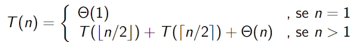

- Ignorar os caso de piso e teto
- Simplificar o Theta(n) por n
- Casos pequenos

Impacto nas constantes

---

- T(n) = 2T(n/2) + n

---

Vamos dar um chute (ou assumir por hipótese) que

- T(n) = 2T(n/2) + n

é

- O(nlgn)

e vamos usar o **Método da Substituição** para verificar se o chute está correto

---

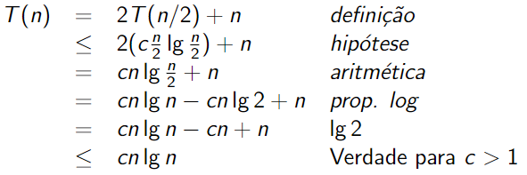

---

- Esta é uma prova (parcial) por indução
- Estou falando que se é verdade para n/2, é verdade para n...
- ...se é verdade para n, é verdade para 2n...
- Esta faltando a base

---

- Para n = 1, aplicando T(n) <= cn lg n, temos que

T(1) <= c lg 1

e

T(1) <= 0

- que não faz sentido ter custo menor ou igual a zero!

---

- Para n = 2, aplicando T(n) <= cn lg n, temos que

T(2) <= c2 lg 2

e

T(2) <= 2c

- Como temos c > 1 (durante a prova por indução) para qualquer valor de T(2) existe um c > 1 que a inequação irá se manter!

(n0 = 2 e c esta indefinida, porém sabemos que existe!)

---

- TO-DO - Exercícios slide aula 10

---

