# Arquitetura de Redes e Computadores

## Introdução

### 1. Primórdios da Redes e Computadores

- Falta de eficiência e ambiguidades nos protocolos de comunicação, causando erros de interpretação entre as mensagens trocadas.

- Primeiros protocolos, eram qualquer coisa a longa distância que geravam mensagens.

- Os cidadãos desafiam a comunicação, pois são estes que interpretam a mensagem, contrariando talvez, a originalidade da mensagem.

- _"Polybius"_ propôs um método que impedia o erro de interpretação de uma mensagem durante seu envio
  - Tochas eram utilizadas para passsar mensagens (similar a uma sequência de bits), e uma combinação dessas permite a composição de caracteres.
- _"Robert Hooke (1684)"_ desenvolveu um sistema óptico que sinalizava caracteres e eram observados a distância por um telescópio.

- É iniciado um sistema de controle de mensagens (sinalizar se está pronto ou não).
- O sentido óptico para de ser utilizado e é iniciado o envio de sinais elétricos.
  - _"Cooke e Wheatstone (1837)"_ desenvolveram um telégrafo de uma bússola que sinalizava códigos de controle (angulação da agulha apontava para símbolos e geravam mensagens.

> Os sistemas de redes abdicaram da interferência de pessoas para previnir os erros durante o transporte.

- **Estudo de Caso**: _Acidente de 1861_
  - Dois trens se colidem dentro de um túnel, pelo fato do erro de comunicação da situação de ocupação do túnel.
  - Os protocolos de troca de mensagens entre os operadores são o interesse deste exemplo. ("trem no tunel", "trem fora do tunel", "trem no tunel?").
  - Duplicação de mensagens trouxe um erro de interpretação que levou o acidente.

- _"Código Morse"_ que utilizava inicialmente três sinais, posteriormente foram utilizados pontos e traços espaçados entre eles, enviando mensagens.

- Ao decorrer do tempo, surgiram novas tecnologias que possibilitaram a troca mais facilitada de mensagens (tele-typer, telefone, ENIAC - primeiros computadores,  etc...).

### 2. As Primeiras Redes de Computadores

- 1º Protocolo: _"Mestre-Escravo"_
  - Uma parte envolvida está no controle, e outra responde as requisições.
  - Mestre: responsável pelas tarefas de transferência de dados.

- Surge mainframes (Sistema Computacional) conectados por redes (máquinas distintas conectadas em rede).
  - Problema de estabelecer um acordo sobre os recursos compartilhados na rede.
  - Projetistas aprenderam da forma mais difícil que as sequências de eventos ocorrem e podem arruinar o projeto de protocolo.

- "Peer Protocols" (Substitui o modelo mestre-escravo) - governa a troca de elementos pares entre os mainframes
  - Envolve o envio de um pedido (request) a todos os pares, onde o pedido é recebido e processado, possivelmente há uma resposta (response).
  - Computação de pares ou computação de rede, arquitetura de aplicação distribuída que distribui as tarefas entre pares.
  - Não há um elemento central, portanto se ocorrer uma falha, só uma parte da rede entra em parada.
  - Na rede de protocolo de pares, não há uma elemento central para desenvolver acordos entre recursos compartilhados nesta rede.
  - Colisão de 2 fluxos de dados pode causar tanto dano quado a de dois trens (Acidente do Túnel de Clayton).

### 3. Protocolos e Linguagens

- _"ideia"_ - espécie de acordo sobre a troca de informações entre elementos pares e que formam um sistema distribuído.

- _"protocolo"_ - define uma formato preciso para as mensagens (acordo sobre a troca de informações).
  - _"gramática"_ - regras para a troca de dados.
  - _"sintáxe"_ - formato preciso para mensagens válidas.
  - _"vocabulário"_ - conjunto de mensagens válidas.
  - _"semântica"_ - significado das mensagens
  - _"regras procedimentais"_ - remetente e destinatário devem conhecer o protocolo e implementá-lo corretamente.

- Portanto um protocolo se parece com a definição de uma linguagem.
- Interpretações diferentes de um conjunto de regras podem gerar implementações diferentes e cheias de inconsistências, por isso se vê a necessidade de padronizar os protocolos.

### 4. Padronização de Protocolos

- Instituição ISO que contempla o organismo de padronização ANSI propôs a padronização a tabela ASCII e inteface RS-232.
  - ASCII é formalmente conhecido como ISO 646.
- Organismos de padronização: CCITT, ITU, IFIP, NIST, FTSC, FCC, IEEE, etc...
- A padronização é importante, mas não garante a resolução de todos os problemas.
- ESTELLE, utilizado para testar os protocolos submetidos às entidades.

## Estruturas de Protocolos

### 1. Introdução - Estruturas de Protocolos

- "premissa" - sem conhecer o meio de transmissão, não há como especificar as regras e procedimentos que governam as trocas de informações entre elementos pares.
  - Isto é verdadeiro? "_conhecendo o meio ou não, é necessário definir as regras que governam as interações_"
- O protocolo independe do meio utilizado, utilizando um conjunto de regras para defini-lo:
  - como as mensagens são codificadas?
  - como é iniciada e finalizada a transmissão?
  - são várias as dúvidas quanto as ações!
- "erros difíceis de evitar" - são 2 erros comuns nos projetos de protocolos:
  - conjunto incompleto de regras e procedimentos
  - regras/procedimentos que são contraditórias
- "objetivo" - garantir que as regras que governam um protocolo sejam consistentes e completas
  - precisão na especificação
  - modularização das regras
  - estruturação do protocolo

#### **Exemplo - Servidor de arquivo e servidor de impressão**

- Problemas físicos
  - cabeamento
  - codificação
  - transmissão
  - velocidade de transmissão
  - etc...

- Problemas de controle
  - impressora está disponível?
  - taxa de trasmissão aceitável?
  - tem papel?
  - está suspensa?
  - comunicação no sentido A -> B é suficiente?
  - etc...
  
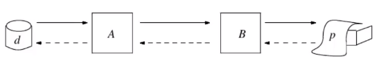

- O protocolo é definido pelo conjunto de formatos, regras e procedimentos acordados (combinado) entre os pares.
  - _Protocolo formaliza a trasmissão no canal de comunicação._
- Protocolo tem acordos e métodos para:
  - inicialização e finalização da troca de dados
  - sincronização do transmissor e receptor
  - detecção e correção de erros de transmissão
  - formatação e codificação dos dados

- Obs: todas essas fases podem ter mais níveis de abstração

- Níveis básicos de Abstração - Formatação
  
  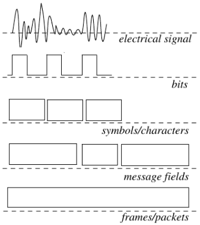

### 2. Elementos do Protocolo

- A especificação de um protocolo consiste em 5 elementos distintos:
  - serviço a ser oferecido pelo mesmo
  - definição do ambitente no qual o protocolo será executado
  - vocabulário das primitivas usadas para implementar o protocolo
  - codificação (formato) de cada primitiva no vocabulário
  - regras procedimentais -> consistência na troca de primitivas

- Obs: último elemento da especificação do protocolo é o mais difícil de projetar e verificar
  - as razões são problemas de temporização, condições de corrida, deadlocks, problema de concorrência entre pares

- "Uma síntese do protocolo" - geração da especificação a partir da especificação do serviço do protocolo
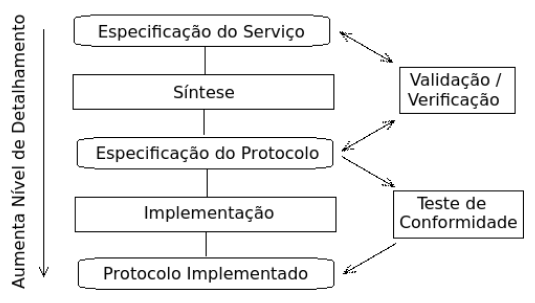

### 3. Exemplo de um Protocolo

- W. C. Lynch (1968) - Especificação do **Serviço**
- O objetivo consiste transferir arquivos de texto como uma sequência de caracteres através de uma linha telefônica sem erros de transmissão (erros podem ser detectados)
- "Premissa"
  - canal de transferência de mensagens é "full-duplex" (ocorre em ambos sentidos)
  - Acks e Nacks são enviados pelo canal (B -> A), para reconhecer a mensagem enviada de A -> B, e vice-versa
  - possui 2 tipos de mensagens, a própria informação e a mensagem de controle no sentido inverso

- **Ambiente**
  - consisite minimamente de 2 usuários do serviço de transferência de um arquivo em um canal de transmissão
  - usuários submetem uma requisição para transferirem um arquivo e esperam até a conclusão
  - podem ocorrer distorções nas primitivas, mas não perde, duplica, insere e nem reorganiza estas primitivas (mensagens)
  - um nível inferior é responsável por corrigir distorções e gerar mensagens de erros

- **Vocabuário**
  - Ack - mensagem positivas
  - Nack - mensagem negativa
  - Err - mensagem com erro na primitiva
  - V = {Ack, Nack, Err}
  - cada tipo de primitiva pode ser refinada em várias mensagens de níveis inferiores

- **Sintáxe (formato) da Primitiva**
  - campo de controle - identifica o tipo da primitiva
  - campo de dados - conjunto de códigos de caracteres
  - Representação "C-like" para uma primitiva:

    ```c
    enum control { Ack, Nack, Err };
    struct primitiva {
      enum control tag;
      unsigned char data;
    }
    ```

- **Regras Procedimentais (escritas)**
  - Se a recepção anterior foi livre de erro, a próxima mensagem no sentido contrário levará um ACK; caso contrário a próxima mensagem contrária levará um NACK
  - Se a recepção anterior foi um NACK ou ERR, retransmite a primitiva antiga, qualquer outro caso, enviou uma nova primitiva para transmissão
- Para Formalizar estas regras, podemos usar diagramas de estado, expressões algébricas, etc...
  - "receive" - representa o estado de recepção de uma nova mensagem no canal está sendo aguardada
  - "dented box" - representa o reconhecimento de uma mensagem que está associada - "match" com o rótulo - "label" da caixa
  - "pointed box" - indica a transmissão de uma mensagem cujo tipo é indicado pelo rótulo - "label" da caixa
  - "square/retangle box" - indica uma ação interna para obter um próximo item de dado, por exemplo, caracter a ser transferido
  
  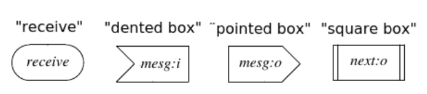

  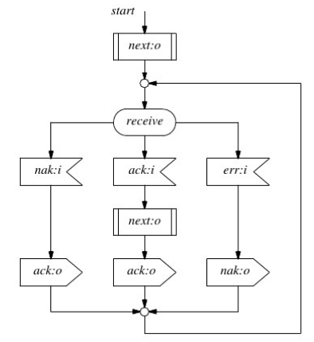

  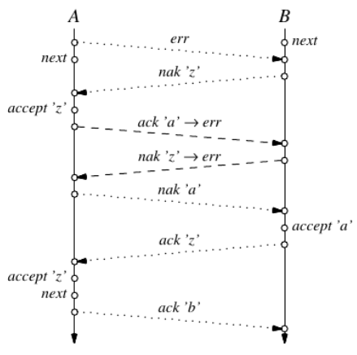

- Falhas do Projeto de Protocolo:
  - Transmissão só começa se ocorrer uma transmissão de dados em um sentido contrário
  - "dúvida" - qual ods pares decide como o canal vai ser iniciado ou encerrado?!
- Maior deficiência:
  - Dados duplicados são recebidos corretamente - ocorreu devido a sequência de eventos
  - Receptor, deve decidir se um dado foi recebido ou não corretamente

### 4. Serviço e Ambiente

- Um problema grande pode ser subdividido em problemas menores (Divide and Conquer)
- Funções abstratas são definidas sobre funções subjacentes, escondendo propriedades indesejáveis em um canal de comunicação
  - canal de comunicação se torma mais idealizado

#### Exemplo

- considere um protocolo para transmissão de dados que oferece codificação de caracteres e tuplas de 7 bits e um rudimentar detector de erro baseado em paridade
- são 2 os serviços: codificação e detecção de erros
- pode-se separar os serviços em dois módulos funcionais, chamados sequencialmente, construindo um canal virtual
- de fato, cada camada oferece um serviço diferente e implementa um protocolo em separado
  - 1º Camada implementa P1 => formato de 8 bits
  - 2º Camada implementa P2 => formato de 7 bits

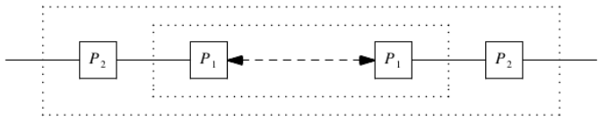

- P2 (Processo P2) não sabe sobre o 8º bit adicionado e controlado por P1 (Processo P1)
  - P1 sabe que é o canal mais confiável sobre o meio de comunicação abaixo
- P1 oferece um canal virtual para P2, mas, mas ao mesmo tempo, P1 é transparente para P2

- 2 conceitos fundamentais em um protocolo
  - transparente - alguma coisa que existe, mas parece não existir
  - virtal - alguma coisa que parece existir, mas não existe de fato
- Para P1, o significado dos bits não importa, apenas o número de bits; de modo smilar nem P1, nem P2, conhece sobre protocolos de níveis superiores
- Cada nível encerra os dados transmitidos em uma "capsula", formado por um "header" e/ou "trailer", antes de passá-lo ao próximo nível
- formato de níveis superiores não precisam ser preservados

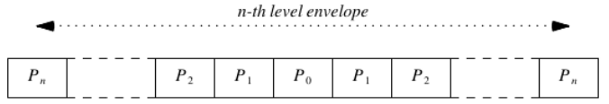

- o projeto tem um modelo hierárquico, conhecido em programação sequencial e modular, novo em sistemas distribuídos
- camadas ajudam a indicar a estrutura lógica do protocolo separando detalhes de alto-nível dos de baixo-nível
- quando o protocolo necessitar de correções e ajustes, será mais fácil reescrevê-lo pelo fato de estar modularizado
- ISO viu a necessidade no anos 70 de padronizar e criou o ***Modelo OSI*** baseado em camadas
- cada camada define um conjunto de serviços distintos e implementa protocolos específicos para aquela camada
- formato usado por uma camada é completamente independente dos formatos usados pelas demais camadas
- Exemplo: 
  - camada de rede envia pacotes
  - camada de enlace envia "frames", e assim por diante

  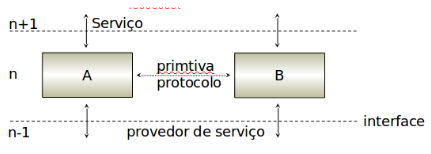

### 5. Vocabulário e Formatos

- Cabeçalhos e "Trailers"
- servem para construir métodos de formatação de alto nível sistemáticos
- Exemplo: considere os caracteres ETX e DLE como delimitadores da mensagem bem como a ocorrência de erros de transmissão:
  - contador é perdido ou,
  - se o caracter ETX (End of Text) ou DLE (Data Link Escape) forem corrompidos, as técnicas de estruturação falham
- esquemas de detecção de erro requerem transmissão de informações redundantes na mensagem
  - se outros mecanismos forem contemplados, por exemplo, controle de fluxo, então outros campos faze-se necessários, por exemplo, número de sequência
- Cabeçalho e o Trailer podem ser refinados em subconjuntos ordenados chamados campos de controle
- Exemplo:
  - cabeçalho = {tipo, destino, janela, contador, prioridade}
  - trailer = {checksum, endereço de retorno}

### 6. Regras Procedimentais

- Até o momento, tarefas de projeto de protocolo e desenvolvimento de software se assemelham
- as regras procedimentais (procedure rules) são interpretadas paralelamente por dois ou mais pares (muito provavelmente em máquinas diferentes)
  - efeito de cada nova regra adicionada ao conjunto é frequentemente muito maior do que se possa imaginar
- Para se convencer da corretude do projeto é necessário algo melhor do que a reflexão informal
  - infelizmente a ferramenta mais popular para isto é Diagrama de Ordem Temporal
  
### 7. Projeto Estrutura de Protocolos

- toca em várias áreas conhecidas, mesmo que não seja um entendimento completo
- exemplo: nível físico do modelo OSI/ISO:
  - conhece-se precisamente qual o comportamento padrão dos diferentes que são "levados"
  - quão rápido pode-se transmitir dados neles
  - qual a taxa média de "bit error" resultante
- há várias técnicas para codificação binária em sinais analógicos
- conhece-se bem técnicas de sincronização sender/receiver
- acima da Camada Física depara-se com problemas, por exemplo, controle de acesso ao meio ou problemas de projeto de rede
  - roteamento através de redes
  - dimensionamento preciso da estrutura de redes
  - interconexão de várias redes via gateways
  - desenvolvimento em um nível superior de disciplinas para controle de fluxo e controle de congestionamento
- Obs: existem técnicas que podem resolver problemas na camada física, contudo os problemas estão apenas no início
  - propôr regras completas e não ambíguas para trocar informações em um sistema distribuído é difícil de muito complexo
- simplicidade - protocolos *Light-weight*
- um protocolo bem estruturado pode ser feito a partir de um pequeno número de "pedaços" bem projetados e bem conhecidos
- para entender o protocolo basta entender os pedaços
- protocolos feitos deste modo são mais fáceis de entender, de implementar e, mais apropriados para verificar e manter
- Protocolo "Light-Weight" - simples, robusto e eficiente 
- Modularidade - hierarquia de funções
- um protocolo que executa uma função complexa pode ser separado em pedaços que interagem de um modo simples e bem definido
- cada módulo é um protocolo "light weight"
- cada módulo não faz suposições sobre o trabalho de outros, nem mesmo a presença de outros
- funções ortogonais não podem ser misturadas, elas são projetas como entidades independentes
- controle de erro e controle de fluxo são funções ortogonais
- **Protocolo Bem-Formado** - um protocolo bem formado NÃO É:
  - "over-specified", ou seja, não há regras não alcançaveis ou não utilizáveis no conjunto de regras
  - "under-specified" ou incompleto, ou seja, durante sua execução, são requiridas regras que não estão definidas
  - "bounded" - não pode ultrapassar limites definidos do sistema (ambiente), como capacidade da fila de mensagens
  - "self-stabilizing" - quando erro arbitrário muda o estado do protocolo, este deve retornar a um estado conhecido
  - "self-adapting" - pode se adaptar em certas circunstâncias
  - _Polybus - "It is chiefly unexpected occurrences which require consideration and help."_
  - Rotustez - não é difícil projetar protoclos que trabalham em circunstâncias nomais
  - é o inesperado que torna o projeto um desafio (o protocolo deve ser preparado para tratar apropriadamente todas as ações que ocorram, em qualquer sequência, sob quaisquer condições)
  - protocolo deve fazer suposições mínimas sobre o ambiente para evitar dependêcnias de características que mudam
  - Consistência - existem alguma modos "padronizados" e temidos nos quais um protocolo pode falhar:
    - "deadlocks" - situação na qual não haverá um próximo estado
    - "livelocks"- sequências na execução, repetidas indefinidamente, sem fazer qualquer progresso
    - "no k-limited" - máquina de estado não finita
    - "não reiniciável" - não é possível a partir de um dado estado voltou ao estado inicial
    - "terminação imprópria" - finalização sem satisfazer as condições apropriadas de encerramento
  
### 8. Regras de Projeto de Protocolos

- Regras de Ouro para Projeto de Protocolos

1. Certificar-se que o Problema foi bem especificado
2. Definir os serviços em cada nível de abstração
3. Delinear as funcionalidades externas antes das internas
4. Manter o projeto simples
5. Não ligar o que é independente, qu tem ortogonalidade
6. Não introduzie o que "não é concreto"; não restringir oque é irrelevante; um bom projeto é "open-ended"; um projeto resolve uma classe de problemas
7. Antes de implementar, faça um protótipo de alto-nível, e verifique se os critérios de projeto foram alcançados
8. Implementar o projeto, medir seu desempenho, e se necessáriom otimizar o projeto do protocolo
9. Garantir que a implementação final, otimizada, é equivalente ao projeto de alto-nível que foi verificado
10. Não Pular as Regras de 1 a 7 (MAIS IMPORTANTE!!)

> Infelizmente, a regra 10 é mais violada

## Controle de Erro

### 1. Introdução - Controle de Erro

- "estatísticas" - número de erros ocorridos nas transmissões de dados são muito maiores comparados por erros de "hardware" nos sistemas computacionais
  - diferença de magnitude entre uma probabilidade de erro de 10^(-15) e outro de 10^-4 não pode ser subestimada
  - para transmitir 10¹⁵ bits a uma taxa de transferência de 100 Mbps(100000000 bps) são necessários 10¹⁵/10⁸ segundos.
  - 10⁷ segundos corresponde 10⁷/60 = 166666,6667 minutos, que por sua vez corresponde 166666,6667/60 = 2.777,7778 horas, que por sua vez 2777,7778 / 24 = 115,7407
  - Para um erro, ocorre de forma análoga, no caso do erro de hardware, este ocorre a cada 10¹⁵, portanto, ocorre em média a 115,7407 pelos cálculos acima
  - dependendo do meio, podem até ocorrer ruídos entre o envio dos dados
  - os dados podem ser reordenados, distorcidos ou removidos, devido ao meio
- "controle de erro" - objetivo de aumentar a confiabilidade da transmissão, preferivelmente para um nível de confiabilidade de operação "standalone" de um sistema computacional
  - não se deve esperar que o controle de erro capture todos os erros
  - uma controle de erro deve considerar os erros do canal a ser usado
  - Obs: se a taxa de ereo de um canal é menor que a de um equipamento periférico, incluie controle de erro trará solução?
    - não necessariamente, pois ao incluir o controle de erro, pode degradar o desempenho e até diminuir a confiabilidade dos dados

### 2. Modelo de Erro

- "Discrete Memoryless Channel" - modelo formal para este tipo de canal é o canal discreto sem memória
- "Canal discreto" - canal é dito discreto porque ele reconhece apenas um número finito de níveis de sinais distintos
- "Canal sem memória" - canal é dito sem memória porque a probabilidade de um erro é suposta ser independente dos erros anteriores
- "Canal Simétrico" - p (bit error 0) = p(bit error 1)

  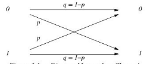

- Canal Simétrico Binário - estabelece a probabilidade "Pr" de ter ao menos "n" bits livres de erro EFI >= "n"
- Pr( EFI >= n ) = (1 - b)^n onde EFI "Erro Free Interval"
  - onde "n" >= 0 e "b" = taxa de média de erros de bits
  - essa fórmula é linear, probabilidade decresce linearmente a medida que o tamanho do intervalo livre de erros decresce (EFI)
  - de maneira similar, probabilidade que a duração de uma rajada exceda "n" bits decresce linearmente como "n"
- Para expressar "Pr" como função exponencial, substitui-se por:
  - Pr( EFI >= n ) = e^[-b*(n-1)]
  - estudos mostram que a equação acima (exponencial) prediz intervalos livres de erros melhor que a equação anterior (linear)
  - porém a equação pode ser melhorada com a adição de um fator que determina o fator de agrupamento >> Benoit Mandelbrost

### 3. Erros de Transmissão

- "principais erros de transmissão"
  - **inserção/remoção de dados** - causado por perda temporária de sincronização entre tranmissor e receptor
  - **remoção de dados** - pode ser causado artificialmente disciplinas inadequadas de controle de fluxo
  - **duplicação de dados** - podem ser gerados intencionalmente, p.ex., transmissor fazer retransmissão
  - **distorção de dados** - podem ser geradas variações nas condições do canal, gerando distorções nos dados
  - **reordenação de dados** - ocorre quando dados percorrem diferentes rotas
- "solução" - esquemas de controle de fluxo para resolver os problemas de **remoção**, **duplicação** e **reordenação de dados**
  - não obstante, erros de inserção e distorções podem ocorrer, assim, são necessários métodos para verificar a consistência dos dados
  - **inserção/remoção de dados** e **distorçã de dados**

### 4. Redundância de Dados

- "Detecção de Erro" - somente funciona se aumentarmos a redundância de dados na mensagem
  - além da detecção de erros de transmissão, o receptor pode também ser capaz de corrigir os erros seguindo 2 maneiras:
    - "Forward Error Control" - redundância se dá de tal modo que o receptor reconstroi a mensagem a partir da mensagem distorcida
    - "Feedback Error Control" - reundância de dados se dá de tal modo que o receptor apenas detecta que a mensagem contém distorções
- "Feedback Error Control" - reundância de dados se dá de tal modo que o receptor apenas detecta que a mensagem contém erros
  - códigos de transmissão são "Error Detecting Codes" ou Códigos de Detecção de Erros
  - aplicáveis em redes de computadores e no processamento paralelo onde custo do reenvio da informação é viável
- "Foward Error Control" - ECCs capazes de detectar e corrigir erros em primitivas apresentam complexidade/computabilidade bem maior que em ("Feedback Error Control")
- "Feedback Error Control" - há duas possibilidades:
  - transmissor com alta taxa de erro, levando com que a retransmissão pode ser requerida explicitamente, através de uma confirmação negativa
    - neste caso o receptor simplesmente descarta a primitiva corrompida e espera por uma retransmissão da mensagem
  - tranmissor com taxa de erro suficientemente baixa => ausência de confirmação indica sucesso
- "Controle de Erro" - tem o objetivo de diminuir a taxa de erro de um canal de comunicação
  - contudo, nem todos os erros podem ser detectados, sempre existe uma "Taxa de Erro Residual" (RER - "Residual Error Rate")
  - e.g., suponha-se que a probabilidade de erros de transmissão em mensagem. seja "p", e que o método de controle identifique uma fração "f" deste conjunto de dados, então:
    - RER = p * (1 - f)
  - esta equação implica que, por instância, a taxa residual é da ordem 10⁻⁹ ou menos

### 5. Tipos de Códigos de Erros

- São 2 os tipos básicos de codificação:
- "Block Codes"
  - todas as "code words" têm possivelmente o mesmo tamanho
  - codificação para cada mensagem de dado pode ser definida estaticamente
- "Convolution Codes" - há uma relação entre a codificação da primitiva corrente e a codificação das primitivas anteriores
  - "code word" produzida depende da mensagem de dados e de um número prévio de mensagens codificadas
  - codificador muda seu estado com cada mensagem que é processada, mas o comprimento da "code word" é usualmente estático
- Palavras Códigos ou "Code Words" podem ser classificadas:
  - "Linear Codes" - toda combinação linear de palavras de códigos válidas produz uma outra palavra código válida (mod-2 sum)
  - "Cyclic Codes" - cada deslocamento cíclico (cyclic shift) de uma palvra código produz uma palavra código válida (CRC)
  - "Systematic Codes" - toda palavra código inclui bits da primitiva original, seguida ou precedida por um grupo de bits de "checks"
- Em todos o casos, as palavras códigos são maiores que as palavras de dados sobre as quais se baseiam
  - se o número de bits originais é "d" e o número de bits adicionais é "e", a razão "d/(d+e)" é chamada "code rate"
  - melhorar a "code rate" frequentemente significa aumentar a redundância e por consequência diminuir a "code rate"
  - e.g., reduzir taxa de erro de um canal por um fator de 5 * 10² usando, p.ex., "Forward Error Control" pode exigir um código com um "code rate" <= 0.5
  - "code rate" <= 0.5 -> "redundância é maior que a própria mensagem" (e >= d, tem se que o número de bits adicionais maior ou igual ao número de bits do próprio dado a ser transmitido)

### 6. Verificação por Paridade

- Se a probabilidade de erros de múltiplos bits por mensagem é baixa, tudo que é necessário para o controle de erro um canal simétrico binário é o código de verificação por paridade
  - para toda mensagem que adicionarmos 1 bit, teremos a soma módulo 2 naquela mensagem igual a 1 (um)
  - se um único bit, incluindo o bit de verificação sofre mudança, o cálculo da paridade no receptor indica erro, mas não pode ser corrigido
  - se "q = 1 - p", então a probabilidade de transmissão livre de erro para mensagens de "n + 1" bits, sendo 1 bit de paridade
  - probabilidade de erros de 1 bit em "n + 1" bits transmitidos é a probabilidade binomial = "(n+1) \* p \* q^n"
  - sob tais circunstâncias, e.g., canal sem memória, a taxa de erro residual da verificação por paridade de 1 bit é: 1 - q^(n+1) * p * q^n

    
  - e.g., para n = 15 e p = 10⁻⁴ teremos a taxa de erro residual da ordem de 10⁻⁶ por mensagem ou 10⁻⁷ por bit
  - linha contínua mostra como a taxa de erro residual por "code word" aumenta como uma função da taxa "p" de erro de bits
  - Nem todos os erros podem ser detectados e, então, sempre exite uma "Taxa de Erro Residual" (RER) = p * (1 - f)
    - "f" - fração de erros identificada; "p" - probabilidade de erro

    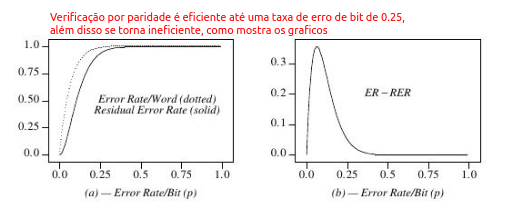

### 7. Correção de Erro

- "Forward Error Control" usa somente um conjunto pequeno de combinações disponíveis de bits para codificar as mensagens
  - códigos são escolhidos de modo que se tenha relativamente um número grande de erros de bits para converter uma mensagem válida em outra
- "code rate" - para um código de correção de erro é em geral menor que aquele para um código de detecção de erro
- lembre-se que "d" (nro de bits originais), "e" (nrm debits adicionais), e "d/(d + e)" - chama-se "code rate"
  - logo que aumentamos "e" -> "d / (d + e)" diminui, ou seja, maior é a redundância para códigos de correção do que somente detecção
- "Forward Error Correction" - por apresentar "code rate" menor que "Feedback Error Control", quando se deve utilizar?
- Deve ser considerado somente quando as mensagens de controle do RX para o TX for um problema por razões tais como:
  - valores altos para o atraso de transmissão
  - taxa de erros de bits alta
  - ausência de canal de retorno (receptor -> transmissor)
- e.g., problema de comunicação de uma comunicação de uma estação espacial (receptor) e o centro de controle (transmissor) na terra;
  - sinal de controle para liberar o obturador da câmera ou ajustar um curso, pode exigir vários minutos até alcançar a estação
  - neste cenário, pode não haver tempo suficiente para repetir o sinal no caso de erro de transmissão (sinal pode chegar como pode se perder)
- e.g., taxa alta de erros de bits -> neste caso, até mesmo a probabilidade de uma requisição para uma retransmissão ser recebida corretamente é inaceitavelmente baixa
  - coloca em dúvida a própria requisição para retransmissão
- Até mesmo a verificação de paridade simples por "code word" pode ser estendida de um código de detecção de um único erro para código de correção de um único erro
  - e.g., sequência de 7 bits é estendida de 1 bit, o que torna o nro. de bits na sequência um nro. par (Longitudinal Redundancy Check ou LRC)
  - 1000100 onde "0" é o bit de paridade
  - na sequência inclu-se redundância para a série de "n" códigos (Vertical Redundancy Check ou VRC)

    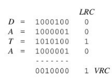
- "Hamming Distance" - nro. de bits a serem alterados na msg. de modo a obter uma outra msg. válida - "mínima diferença entre code words"
  - diferença entre 2 "code words" é definida como o nro. de bits nos quais as "code words" se diferem, ou seja, em nro de bits
- Código com "Hamming Distance" de "n", implica que qualquer combinação de até "n - 1" erros de bit pode ser detectada
  - qualquer combinação até "(n - 1)/2" de erros de bits por código pode corrigida se o receptor interpretar toda palavra de código não válida como a palavra de código válida mais próxima
  - este método é formalmente chamado de "Maximum Likelihood Decoding" ou "Nearest Neighbor Decoding"
- Aumentando a Distância de Hamming, ou seja, escolhendo "code words" mais longas, aumenta-se a confiabilidade de um código tanto mais quanto maior a "code word"
  - Obs: Redundânica de um Código determina seu poder de detecção e correção de erros de transmissão
  - redundância pode ser redefinida como o nro de bits sobre o mínimo exigido para codificar inequivocamente uma mensagem

### 8. "Linear Block Code"

- pode-ser proteger os "m" bits adicionando "c" bits de verificação e escolhendo "n" códigos de um total de 2^(m + c)
- de tal forma que cada combinação de 2 códigos válidos contemple a maior diferença em bits quanto possível
  
  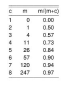
- Como uma boa aproximação, o nro de bits de dados que podem ser protegidos cresce exponencialmente como o nro. de bits de verificação, ou seja, "c" bits de verificação

  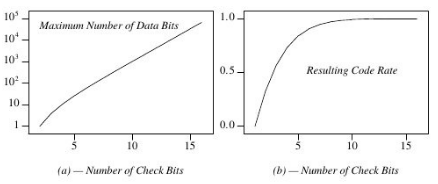
- Para corrigir erros de 1 bit, precisa-se de uma distância no Código de Hamming de ao menos 3 entre "code words"
  - neste contexto, quantos bits "c" de verificação precisamos
- para toda "code word" de "m + c" bits, tem-se precisamente "m + c" código resultantes com erros de 1 bit
- para cada palavra no espectro de "2^m" possíveis códigos de dados, precisamos de "m + c + 1" palavras para protegê-la contra erros de 1 bit -> total de palavras no código é (m + c + 1) * 2^m
- (m + c + 1) * 2^m = 2^(m + c) -> "m + c + 1 = 2^c"
  - permite calcular o nro mínimo debits de verificação dado o nro de bits de dados
  - também podemos calcular o nro máximo de bits de dados para um nro de bits de verificação "c"
  
    
- e.g. "hamming code" - em uma mensagem de "m" bits, inclui-se "c" bits de verificação -> "m + c" bits na mensagem
- "idéia" - sobrepor os bits de paridade, de forma que eles consigam verificar-se uns aos outros, bem como os bits de dados
  - código de Hamming é obtido a partir da palavra de dados, inserindo pontos de controle, denominados bits de paridade
  - bits de verificação são colocados na palavra de código de tal maneira que a soma da posição dos bits que eles ocupam aponte para o bit errado para qualquer erro de 1 único bit (mas não para 2 bits)
  - quando uma posição é escrita como a soma de potências de 2, p.ex (1 + 2 + 4), estas potências também apontam para os bits de verificação que cobre o bit em questão, neste caso bit de dados - 7

    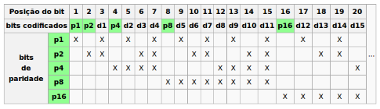

- "Representação Matricial" - método conveniente para "LBC"
  - e.g., considere um código com 3 bits de dados (D1, D2 e D3) e 3 bits de verificação (C4, C5 e C6)
  - seja C4 = D1 + D2; C5 = D1 + D3; e C6 = D2 + D3, então com algum rearranjo podemos represetnar as equações na forma de matricial
  
    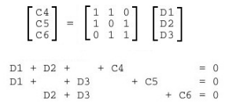
  - C^t é a matriz transposta de palavras de dados, escrita como um vetor de bits e de acordo com a equação anterior.
    - Matriz de Dados + Verificação * C^t produz o vetor "zero"
  - Podemos representar a matriz na forma: H * C^t = 0
    - onde H é a Matriz de Paridade (Dados + Verificação)

      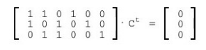
- erros de transmissão podem ser formalizados pela adição de um vetor E, ou seja, H * (C^t + E) = s
  - onde S é chamado de Síndrome
- Neste código, toda soma módulo 2 de palavras de código válidas produz uma outra palavra de código válida
  - assim, se o vetor de erros E coincide com alguma palavra de código válida, a síndrome é zero e o erro não é detectável

### 9. Cyclic Redundancy Checks

- "Cyclick Redundancy Check" - algoritmo de código cíclico mais utilizado em redes de computadores
  - ISO especifica uma algoritmo similar denominado FCS(Frame Check) utilizado em seus protocolos IEEE802
- CRC contempla o produto de bits de verificação de uma primitiva, cuja amostragem é definida segundo um critério
  - bits escolhidos fazer parte do fator (polinômio gerador) e, portanto, é transmitido o produto, ou seja, primitiva * fator;
  - no destino faz-se a divisão que é recebido pelo fator, se o resto é zero, significa ausência de erro ou erro não detectável
  - método de divisão é específico e o fator (polinômio gerador) usado determinam o leque de erros de transmissão que podem ser detectados
- Seja uma primitiva - sequência de "n" bits que podem ser representados por um polinômio de grau "n - 1"
  - Somatório b*i* * x com i = [0 .. (n - 1)]
  - b*i* é o coeficiente do bit na posição "i"
  - x^i indica o literal do bit na posição "i"
- e.g., considera a sequência "10011"
  - escrita em polinômio: "1\*x⁴ + 0\*x³ + 0\*x² + 1\*x + 1" ou "x⁴ + x + 1"
- Sejam as operações binárias (ou-exclusivo):
  - 0 + 0 = 0 - 0 = 0
  - 0 + 1 = 0 - 1 = 1
  - 1 + 0 = 1 - 0 = 0
  - 1 + 1 = 1 - 1 = 0
  - não há "carry bit" na adição e nem "borrow bit" na subtração, ou seja, todo "i" ... x^i + x^i = 0
  - para multiplicar 2 códigos de dados, basta multiplicar os polinômios correspondentes aos códigos de dados
- Dado codificado em 4 bits (p.ex., x² + 1) é multiplicado por "x + 1"
- Código gerado é o de paridade cuja "core rate" de 3/4
- É também um código cíclico, mas não é simétrico
  
  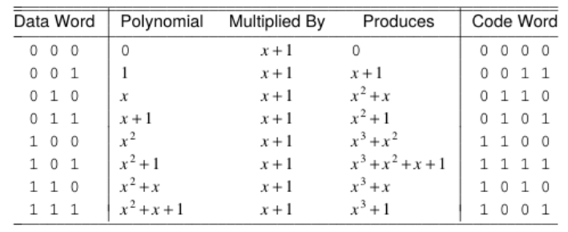
- e.g., Calcule o polinômio cuja primitiva é "1 0 0 1 1" e o fator (polinômio gerador) é  "1 1 0 0"
  - "1 0 0 1 1" -> x⁴ + x + 1
  - "1 1 0 0" => x³ + x²
  - (x⁴ + x + 1) * (x³ + x²) = x⁷ + x⁶ + x⁴ + **x³ + x³** + x²
    - **x³ + x³** é zero, pela regra do ou exclusivo
  - (x⁴ + x + 1) * (x³ + x²) = x⁷ + x⁶ + x⁴ + x²
- Seja P - polinômio da primitiva e G - polinômio gerador de grau "r", então o resto da divisão é polinômio R com grau "r - 1", onde:
  - R = (P * x^r)/G
  - Plavra Código: "T = P * x^r - R"
    - T é trasmitido e o receptor divide o mesmo pelo polinômio gerador, se Resto for diferente de zero, um erro é detectado
- Um erro de transmissão adiciona um polinômio E ao código e o receptor descobre o erro por:
  - (T + E)/G = T/G(= 0) + E/G = E/G
- Um erro de comunicação é detectado se E/G != 0, caso contrário o erro não é detectável, pois o erro se tornou múltiplo do gerador

## Controle de Fluxo

### 1. Introdução - Controle de Fluxo

- "Controle de Fluxo" - relacionado com o controle de diálogo na troca de mensagens entre as entidades pares
- "esquemas simples de controle de fluxo" - consiste em ajustar a velocidade da origem das primitivas à velocidade com que o receptor pode receber e processar as primitivas
  - esquemas mais elaborados podem evitar erros tais como: remoção, inserção, duplicação e reordenação
  - Nota: isto é o que acontece nas camadas mais baixas da pilha de comunicação, p.ex., camada física
- Fundamentos Filosóficos do Controle de Fluxo, 4 pilares:
  - garantia que as primitvas são enviadas em uma frequência que a entidade receptora pode receber e processá-las
  - otimização na utilização do canal
  - diminuição ou eliminação da "perda de carga" do canal
  - distribuição criteriosa do uso dos recursos de comunicação
- O caminho entre a origem e o destino pode conter esquemas de interconexão com as seguintes características:
  - capacidade limitada para "storing" and "forwarding"
  - compartilhamento entre vários pares de entidades
- Obs: esquemas prudentes de controle de fluxo evitam que pares monopolizem todo o espaço de recursos disponíveis
- "Objetivo" - tendo por base um protocolo básico, propõe-se a concepção de um modelo de controle de fluxo
  - "receive" - representa o estado no qual a recepção de uma nova mensagem do canal está sendo aguardada
  - "dented box" - representa o reconhecimento de uma mensagem que está associada - "match" com o rótulo - "label" da caixa
  - "pointed box" - indica a transmissão de uma mensgam cujo tipo é indicado pelo rótulo - "label" da caixa
  - "square/ retangle box" - indica uma ação interna para obter o próximo item de dado, p.ex., caracter a ser transferido

    
  - protocolo "simplex" - usado para transmitir dados em apenas um sentido (canal "half-duplex")
  
    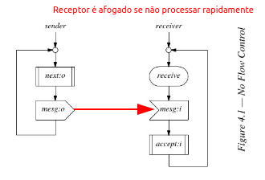
- "premissa" - protocolo apresentado funciona apenas se o receptor RX for mais rápido que transmissor TX
  - se esta suposição for falsa, a entidade que envia pode sobrecarregar o esquema de entrada da entidade receptora
- 1º Postulado: "Never make assumptions about the relative speeds of concurrent entities"
- Nota: gargalo do protocolo é provavelmente o receptor, logo não se deve assumir que o receptor suporte o transmissor
- como a recepção é geralmente mais dispendiosa(processamento) do que a transmissão, então receptor deve:
  - interpretar as primitivas; decidir o que fazer com elas
  - alocar memória; até encaminhá-las ao recurso final
- transmissão não precisa de um provedor para funcionar(ativa-se quando há algo para transmitir), mas quem transmitive deve:
  - liberar memória após a transmissão (liberação de recurso)
  - não assumir que o receptor irá se adaptar à entidade que transmite, ou seja, não assumir sincronismo entre transmissor e receptor
- "Técnica mais Antiga" de controle de fluxo para tratar a sincronização, sem que seja necessário negociação a priori entre receptor estabelece o compasso entre mensagens transmitidas
- método utiliza 2 mensagens de controle:
  - uma mensagem para suspender -> "x-off"
  - uma mensagem para retomar o tráfego -> "x-on"
- "premissa" - canal é livre de erros e o vocabulário do protocolo contempla 3 três mensagens:
  - V = { mesg, suspend, resume }
- Seja um protocolo "duplex", no qual o vocabulário contempla 3 tipos de mensagens, ou seja, V = { "mesg", "suspend", "resume" }

  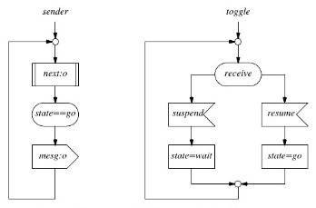
- Protocolo "x-on/x-off" ... no remetente (transmissor):
  - mensagem "mesg" apenas é enviada se "state" = "go"
  - estado é alterado pelo recebimento de msg. "suspend" ou "resume"
- Protocolo "X-on/X-off" - receptor também é divido em 2 partes:
- após a chegada de uma mensagem de dados o processo contador incrementa a variável "n":
  - "n" representa o nro. de msgs que foram recebidas do transmissor e que ainda estão esperando para serem aceitas pelo receptor
  - se o valor de "n" ultrapassa um limite, uma msg. "suspend" é enviada para o transmissor (controle de fluxo)
  - se o valor "n" decresce abaixo de um limite inferior, uma msg. "resume" é enviada para o transmissor (controle de fluxo)
  - quando o receptor aceita uma mensagem, o processo "acceptor" decrementa a variável "n"
- Obs: msg, de dados é passada do processo "contador" para o processo "acceptor" através de uma fila interna
- após a chegada de uma msg. de dados o processo contador incrementa a variável "n"

  
  - "n" representa o nro. de msgs. que foram recebidas do transmissor e que aguardam serem aceitas pelo receptor
  - se o valor de "n" decresce abaixo de um limite inferior, uma msg. "resume" é enviada para o transmissor (controle de fluxo)
  - quando o receptor aceita uma mensagem, o processo "acceptor" decrementa a variável "n"
  - Obs: msg. de dados é passada do processo "contador" para o "acceptor" através de uma fila interna
- Problemas do Protocolo X-on/X-off:
  - total confiança no meio de transmissão (não há erros ou perdas)
  - se mensagem "suspend" é perdida/atrasada, pode ocorrer "overflow"
  - se msg "resume" é perdida, tem-se um colapso total do sistema
  - funcionamento de um protocolo não deve depender do tempo que uma mensagem de controle leva para atingir o destino
- Logo, 2 principais problamas devem ser resolvidos:
  - erros de "overrun" (transbordo) de maneira mais confiável
  - proteção contra perda de mensagens (suspend/resume)
- "solução para erros de transbordo" - para resovler este problema basta deixar o transmissor esperar explicitamente o reconhecimento das mensagens já transmitidas
  - e.g. Protocolo "Ping-Pong" ou Protocolo "Stop and Wait"
- "Ping-Pong Protocol" - problema do transbordo é resolvido, mas o sistema ainda pode sofrer bloqueio se o controle ou alguma mensagem de dados se perder no canal
- "premissa" - total confiança no canal ou meio de transmissão, pois não há erros ou perdas no canal
- "Ping-Pong Protocol" - problema do transbordo é resolvido, mas o sistema ainda pode sofrer bloqueio se o controle ou alguma mensagem de dados se perder no canal
  - "t" - tempo de propagação em um canal
  - "a" - tempo que o receptor precisa para processar e aceitar a mensagem que acabou de ser entregue pelo canal
  - "p" - tempo que o transmissor precisa para prepara a mensagem a fim de a mesma possa ser transmitida pelo canal
- com estas considerações, transmissor terá atraso de "2t + a - p" unidades detempo para toda e qualquer primitiva transmitida
  - premissa - threads em paralelo para "p" e para "2*t + a"
- "Procolo Ping-Pong" - mesmo que protocolo "Stop and Wait"

  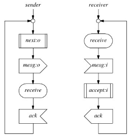
  - "t" - tempo de propagação em um canal
  - "a" - tempo que o receptor precisa para processar e aceitar a mensagem que acabou de ser entregue pelo canal
  - "p" - tempo que o transmissor para prepara a msg. a fim de a mesma possa ser transmitida pelo canal
- "p < a" - obiviamente que "t" aumenta no mínimo linearmente com a distância entre o transmissor e receptor
  - observe-se que o reconhecimento não significa apenas a chegada da última primitiva, mas também significa um crédito que o receptor oferece ao transmissor para que envie a próxima primitiva
- "p < a" - obviamente que "t" aumenta no mínimo linearmente com a distância entre o transmissor e receptor
- observe-se que o reconhecimento não significa apenas a chegada da última primitiva
- reconhecimento também significa um crédito que o receptor oferece ao transmissor para que envie a próxima primitiva
- Obs: Sequência de passos contempla a idéia de janela!

### 2. Protocolo de Janelas

- Na fase de estabelecimento de conexão, as entidades definem quanto de buffer, banda, etc. haverá para a comunicação
  - entidades definem espaço para um número de requisições pendentes, espaço este comumente referenciado como crédito
  - créditos podem ser alterados dinamicamente quando os espaços para primitivas pendentes mudarem
  - "premissa" - assumir que por hoar não há perdas de primitivas
- Cada primitiva recebida é reconhecida com um único reconhecimento ou "acknowledgement" no sentido contrário
  - tudo o que se tem a fazer é manter a contabilidade das mensagens em trânsito (ao longo do canal)
  - crédito inicial pode ser negociado ou pode ser predefinido para um número de mensagems "W"

    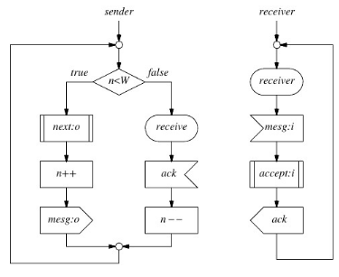
    - para cada primitiva enviada, TX decrementa seu crédito
    - para cada primitiva recebida por RX, devolve-se 1 novo crédito ao TX através do canal de retorno
    - "W - n" representa o número de créditos não utilizados
- Seja 
  - a(t) - número de créditos recebidos pelo transmissor no instante t
  - p(t) - número de primitivas enviadas ao receptor no instante t
  - n(t) - número de mensagens pendentes de reconhecimento no instante t
- O máximo número de primitivas que o transmissor pode ter pendentes, ou seja, esperando reconhecimento, é:
  - W - n(t) + p(t) - a(t)
  - W - n(t), número de créditos disponíveis
  - p(t) - a(t), número de crédito usados
- Como o número máximo de primitivas pendentes de reconhecimento - "acknowledgement" é W:
  - W - n(t) + p(t) - a(t) <= W
  - i.e, p(t) - a(t) <= n(t)
  - Lembrete: inicialmente todas as variáveis na inequação são 0 (zero)
- Obs: O máximo número de créditos (W), que é o máximo nro. de primitivas pendentes de reconhecimento é denominado o tamanho da janela ou "window size"
- Toda ação de envio no transmissor incrementa ambos os lados da inequação, lado direito primeiro e assim preserva sua validade
- similarmente, cada ação de recepção do processo receptor decrementa ambos os lados de 1, inicialmente o lado esquerdo, e novamente preserva a corretude
  - i.e. p(t) - a(t) <= n(t)
- Obs: Há de fato concordância com as definições apresentadas para a(t) e p(t)? elas se referem a visão do transmissor? n(t) não tem o mesmo significado de p(t)?
- Como visto, o valos máximo de "W" é o tamanho da janela - "window size" do protocolo
  - durante a transferência de dados, o número de créditos varia entre 0 e "W - 1", dependendo da velocidade entre TX e RX
  - canais com tepmo de trânsito alto podem ser otimizados se habilitarmos o transmissor a enviar uma ou mais primitivas enquanto espera por uma confirmação
  - os problemas citados em comunicações (inserções, duplicações, ...) ainda persistem, exigindo um melhor controle de fluxo
- Protocolo Ping-Pong com "timeouts"

  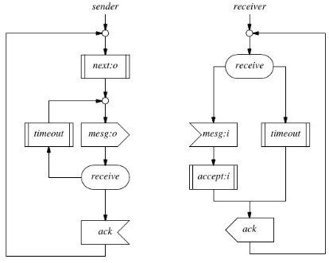
- Com uso de múltiplas primitivas pendentes por reconhecimento, é necessário manter rastreado o controle do tempo decorrido entre as transmissões e as recepções
- para isto é necessário dismensionar o pior caso nos tempos de transmissão, isto para não considerar como perdida uma primitiva em pleno trânsito, que ainda não chegou no receptor
- A expressão a seguir é frequentemente utilizada:
  - T(worst) = T(médio) + N * sqrt(var(T))
  - T é o tempo de ida e volta da primitiva
  - N é tipicamente 1 e raramente 2
- Comportamento de entidades fins e o canal de comunicação podem ser modelados como um processo de Markov M/M/1
- Neste caso tem-se que: var(T) = T(médio) * T (médio)
- esta é uma consideração impoertante poist o cálculo de desvio padrão, ou seja, sqrt(var(T)) envolve as medidas anteriores e isto nem sempre está disponível
- Se considerarmos N = 1, temos: T(worst) = 2T(médio)
- Um erro comum, entretando, é quando ambas as entidades fins implemetaram mecanismos de "timeout"
- ambos transmissor e receptor decidem retransmitir a última mensagem enviada se o erro de remoção ocorre

  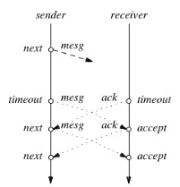
- "conclusão" - ambos transmissor e receptor não devem estar habilitados para iniciar retransmissões
  - suficiente colocar esta habilidade em uma das duas entidades
  - tradicionalmente é o transmissor que tem esta prerrogativa uma vez que somente ele tem certeza de quando um novo dado deve ser enviado
- Deve haver um mecanismo que identifique exatamente a qual primitiva pertence um reconhecimento de erro que acaba de chegar
  - mesmo se houver uma primitiva pendente em qualquer instante
  - isto normalmente é feito por um número de sequência (seq. number)
  - como números são finitos (necessário mecanismo para verificar os números de sequência reutilizados ou reciclados)

### 3. Número de Sequência

- Número de sequência rotula cada primitiva enviada, que por sua vez terá msg. de reconhecimento - "acknoledgement"
  - i.e, número da primitiva reconhecdida está presente, de alguma forma, na mensagem de reconhecimento
- e.g., considere um número de sequência de um bit, isto permite o uso de "timeout" no Protocolo Bit Alternate
- e.g., como exemplo de um melhor uso do "timeout" e do nro. de sequência de 1 bit, vamos considerar uma "versão estendida" do Protocolo Bit Alternate
- Bartleet, Scantleury and Wilkinson [1969] - propuseram o "Protocolo Bit Alternate" - 02 FSM com 6 estados cada
  - propuseram procedimentos para alcançar transmissão "full-duplex" confiável em enlaces "half-duplex"
  - esquema proposto foi comparado com esquemas do mesmo tipo, descrito na mesma época (década de 1960)
  - W.C. Lynch - "Reliable Full-Duplex File Transmission over Half Duplex Telephone Lines"; Communications ACM; 1968
  - Método proposto utiliza 1 bit de controle que se mostrou infalível, desde que todos os erros possam ser detectados
    - semelhante ao esquema de transmissao proposto por W.C Lynch
- "Protocolo Bit Alternate" - 2 FSM com 6 estados cada
- "arestas" - especifica a troca de mensagens, sendo que cada aresta é identificada por 2 letras, p.ex., B0, B1, A0, A1K
- primeria letra especifica a origem da mensagem sendo recebida ou transmitida, enquanto a segunda letra especifica o número de sequência
- aresta com 2 setas indica entrada para ser aceita no receptor ou uma nova mensagem será transmitida no transmissor
- entradas errôneas, ou seja, mensagens que carregam um número de sequência incorreto, causam uma retransmissão da últmia mensagem já transmitida
- e.g., pesquisar o protocolo e entender os detalhes
- Bartlett, Scantlebury and Wilkinson [ACM - 1969] - propuseram o "Protocolo Bit Alternate" - 2 FSM com 6 estados cada

  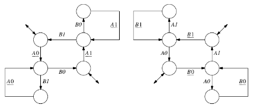
  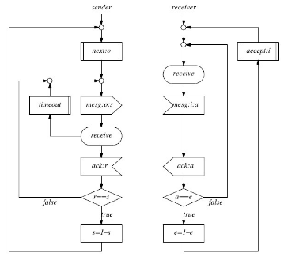
- 2 tipos de mensagens "mesg" e "ack" com os seguintes formatos:
  - {mesg, data, sequence number} - "mesg:o:s" indica mensagem de sequência; "r" mantém o último número de sequência recebido
  - "e" indica o último número de sequência esperado no receptor; "a" armazenad o último número de sequência atualmente recebido no receptor
  - {ack, sequence number}
- Considere o que acontece se a mensagem de "ack" está tão atrasada que o transmissor sofre "timeout" e retransmite a última mensagem

  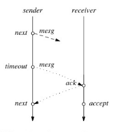
- "duplicaçao" e "reordenação" - presentes em redes de datagrama, isto é, em redes que não há circuito lógico ou circuito virtual
  - "redes de datagrama" - são aquelas nas quais primitivas podem usar diferentes rotas para alcançar as entidades parceiras
  - "circuito lógico" - são canais que de algum modo têm mapeamento no meio físico (por ex. circuitos de linhas para telefones)
  - "circuito virtual" - são canais que têm as características de comunicação de circuito lógicos mas não existem de facto (obtidas por configuração)
- "solução" - codificar a primitiva na ordem original com um número de sequência com espectro grande o suficiente para numerar qualquer quantidade de primitivas
- normalmente o número de sequência segue acoplado ao cabeçalho da primitiva (quanto maior, maior a quantidade de mensagens sem que o número de sequência seja reutilizado)
- se considerarmos primitivas de 15kb, com um número de sequência de 16 bits, e um canal de 100Mbps, este sistema vai conseguir funcionar por aproximadamente 9,5 segundos
  - 100 * 10⁶ / 15000 bits = 6666,67 primitivas por segundo, ou seja, cada primitiva irá utilizar um número de sequência
  - considerando que tem-se 16 bits para os números de sequência, então temos 65536 números de sequência possíveis
  - logo, basta dividir 655536 / 6666,67 = 9,83 segundos serão gastos para utilizarmos todos os números de sequência possíveis
- "problema" do limite do número de sequência desaparece se limitarmos o máximo número de primitivas que estejam em trânsito através do crédito concedito ao transmissor
  - gama de possíveis números de sequência tem de ser maior que os crécdito máximos negociados, permitindo assim ao receptor distinguir primitivas duplicadas de originais
- Suponha "M" números de sequência disponíveis e "W" números de créditos iniciais de primitivas, então:
  - "M > W" - evita número de sequência fora de ordem sem que o mesmo número de sequência se repita na janela
- Que estruturas/mecanismos utilizar para este controle??
  - transmissor deve contabilizar cada primitiva pendente - "outstanding primitives" dentro da janela corrente;
  - para "acks" individuais é necessário uma estrutura de dados que mantenha o estado, o número de sequência e a própria primitiva
  - uso de vetores para controle de quais mensagens já foram transmitidas, tendo ou não sido reconhecidas
  - se uma mensagem com número de sequência "s" foi transmitida mas ainda não foi reconhecida, então "busy[s] = true"
  -já "store[s] = primitiva" mensagem com número de sequência "s" já foi transmitida
  - inicialmente, todos os elementos do vetor "busy" = "true"
- Transmissor - modularizado com 3 procedimentos:
  - Transmissão de Primitivas
  - Processamento dos "ACKS"
  - Retransmissão de Primitivas
- além do parâmentros "W" e "M", são necessários mais 4 parâmetros (com valor inicial zero):
  - "s" - nro. se sequência da próxima primitiva a ser enviada
  - "window" - número de primitivas pendentes (não reconhecidas)
  - "n" - nro. de sequência da primitiva mais antiga sem reconhecimento
  - "m" - nro. de sequência da última primitiva reconhecida
"Transmissao de Primitivas" - transmissor rastreia toda mensagem pronta para ser enviada dentro da janela
  - para cada primitiva transmitida, incrementa-se o número de primitivas pendentes de "acks" - "window++"
  - primitiva transmitida(o) é armazenada na posição "s", onde "s" corresponde ao número de sequência - "store[s] = o"
  - busy[s] = true indica que msg. com nro. de sequência "s" foi enviada mas ainda não foi reconhecida
  - incremento de "s" em módulo "M", ou seja, "s" = "(s+1) % M", para obter o próximo nro. de seq. a ser utilizado
- "Processamento de Acks"
  - atualiza-se o número (m) do último reconhecimento
  - recebe-se um reconhecimento e libera-se o buffer atualmente utilizado pela primitiva reconhecida - busy[m] = false
- "Retransmissão de Primitivas" window > 0
  - percorre-se a estrutura de envio periodicamente - "timeout period", se "busy[n] == true", então reenvia primitiva "store[n]"
  - se "busy[n] == false", então "windo--" e "n = (n + 1) % M"

  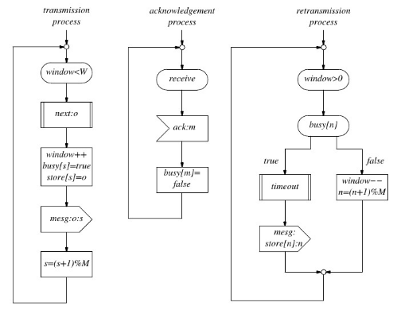
- Receptor - normalmente modularizado e com 2 procedimentos
  - "Recepçao de Primitivas"
  - "Aceitação de Primitivas"
- "Recepção de Primitivas" - além dos parâmetros W e M, são necessários mais 2 parâmetros 2 vetores
  - "m" - número de sequência da última primitiva recebida
  - "p" número de sequência da primitiva sendo esperada
  - "buffer[M]" - conteúdo das mensagems recebidas
  - "recvd[M]" - representa números de sequência recebidos, mas não processados como "true", ou "false" caso contrário
- "Aceitação da Primitiva" - para serem aceitas, as primitivas devem ser aceitas primeiro para então serem reconhecidas, pois se o forem correm o risco de usar "buffers" fora do espaço definido
  - recepção consome tempo e interpretação da primitiva, decisão do que fazer, alocação de memória, e até encaminhamento
  - processo de aceitação pode ser mais lento que o de recepção, o que sugere o reconhecimento somente depois da aceitação
  - utiliza-se o vetor "recvd[M]" para armazenar o nro, de sequência de msgs. que foram recebidas, mas ainda não aceitas
  - utiliza-se o vetor "buffer[M]" para armazenar o conteúdo destas msgs, ou seja, recebidas mas ainda não aceitas
  - adicionalmente, faz-se necessário uma variável extra "p" que é o nro. de sequência da próxima msg. que será aceita

  
- quando o receptor recebe uma primitiva, cabe ao mesmo verificar se a posição equivalente está livre "recvd[m] == false", e então:
  - "recvd[m] = true"
  - "recvd[ (m - W + M) % M ] = false" ou "recvd[ (m - W) % M ] = false"
- duplicação é percebida ao verificar o estado da posição sendo recebida - "recvd[m] == true" -> indicação de duplicação
- Há 2 motivos para primitivas duplicadas:
  - primitiva foi recebida mas ainda não foi reconhecida
  - primitiva foi recebida, reconhecida mas o reconhecimento ainda não chegou ao transmissor (somente neste deve ter re-reconhecimento)
- ao analisar o valor corrente do parâmetro "p", pode-se afirmar se o caso "ii" foi ou não devidamente tratado
- Uma primitiva recebida é considerada válida, dependendo de:
  - se o número de sequência não é do tipo módulo, ou seja, nao é janela deslizante, o teste é simplesmente "valid(m) = m < p"
  - se considerarmos o efeito do módulo "M", "p" será sempre menor do que "M", então: "valid(m) = (0 < p - m <= W) || (0 < p + M - m <= W)"
- Obs: se "s" é uma primitiva recebida que se encontra no buffer, então nenhuma açao é tomada pelo módulo de recepção
- Nota: protocolo de janela deslizante garante a retransmisão de msgs. não trata nro de sequência maior que "W" e nem menor que a última msg. que foi reconhecida
  - estrutura de dados é percorrida e o processo de aceitação (dependendo da aceitação) gera um Ack ou um NAck
  - processa e aceita (ou não aceita) "buffer[p]";
  - gera um Ack (ou NAck) para o número de sequência "p" para na sequência atualizar "p", ou seja, "p = (p+1) % M"

  
- Seja "M" nros de sequência disponíveis e "W" nros de créditos de primitivas, então, qual o "Tamanho Máximo da Janela"??
- "Tamanho Máximo da Janela" - dado "M" e sabendo-se que "M > W", então qual o máximo "W" para otimizar o canal?
  - se todas as mensagens que chegam fora de ordem sao simplesemente rejeitas, então a resposta é "M - 1"
  - se um nro. de sequência não for reutilizado até que a respectiva primitiva seja reconhecida, então, o cenário é outro
    - nestes casos, isto significa "W" não pode exceder "M/2"
- Se um nro. de sequência não for reutilizado até que a respectiva primitiva seja reconhecida, então, "W" não pode exceder "M/2"
- Considere "H" o maior número (%M) que o receptor reconheceu, então podemos ter 2 cenários
  - pior caso, transmissor recebeu apenas um "ack"
  - melhor caso, transmissor recebeu todos os "acks"
- Para o pior caso, o transmissor pode decidir retransmitir todas as "W - 1" primitivas e a própria "H" - ésima primitiva:
  - primitiva mais antiga que poderia ser retransmitida poderia ser [ H - (W - 1) % M ], ou (H - W + 1) % M
- Para o melhor caso, podem ser retransmitidas até "W" msgs. que sucederam a msg. com nro. de sequência "H"
  - primeira "W - 1" podem ter sido perdidas no canal, então a msg. com nro. de seq (H + W) % M é a primeira nova msg. a chegar
  - maior nro. e seq. que suceda H tem de ser distinguível do menor nro. de seq. com potencial de ser retransmitido(que preceda H)
  - isto significa que "M > 2W - 1" ou a janela de tamanho máximo será "W" igual a M/2 (W = M/2)

### 4. Reconhecimento Negativo

- "reconhecimento", até agora foi utilizado como método de controle de fluxo, mas não como controle de erro
  - se a msg. é perdida ou danificada e não é reconhecida, a ausência de reconhecimento positivo irá eventualmente causar o "timeout" no transmissor e, por conseguinte, a retransmissão da mensagem
- "reconhecimento negativo" - pode-se amenizar o problema, não obstante não se consegue eliminá-lo completamente
  - nack - usado pelo receptor qdo o mesmo recebe uma mensagem que foi danificada no canal durante a transmissão
  - qdo o transmissor recebe um "ack" negativo, ele sabe que deve retrasmitir a msg. correspondente, sem ter que esperar pelo "timeout"
- Ex: extensão do dfd de bit alternante para acomodar o reconhecimento negativo (antigo)

  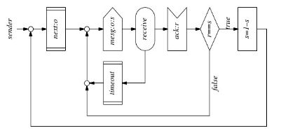
  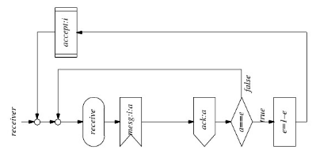

- Versão extendida

  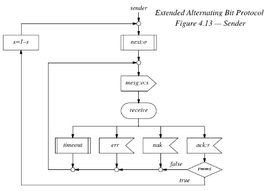
  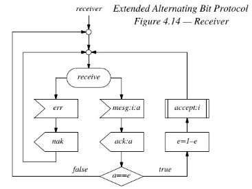

- "Automated Repeat reQuest" ARQ - método que utiliza reconhecimento para controlar a retransmissão de mensagens
  - Stop-and-Wait ARQ
  - Selective Repeat ARQ
  - Go-back-N Continuous ARQ
- e.g., Protocolo Ping-Pong estendido com reconhecimento negativo, pode ser classificado como "Stop-and-Wait ARQ"
- após cada mensagem enviada, o transmissor deve esperar por um NAck ou Ack, ou mesmo "timeout"
  
  
- Uso do reconhecimento no Protocolo de Janela Deslizante pode ser classificado como "Selective Repeat ARQ"
  - implementa método de repetição seletiva "one-at-a-time" onde somente a msg. não reconhecida mais velha é retransmitida
  - entretando, qualquer msg. quer gere um "ack" negativo ou "timeout" pode ser retransmitida, independente de outra mensagem
  - generalização do método é repetição seletiva contínua

  
  
- "Go-back-N Continuous ARQ" - pode ser implementado no Protocolo Bit Alternate estendido
  - basta que o transissor retransmita a msg. corrompida e todas mensagens subsequentes já enviadas
  - neste caso o projeto do receptor pode ser simplificado, p.ex., "acceptor" pode ser removido do receiver do protocolo de janela deslizante e o "buffer" torna-se desnecessário
- "Go-back-N", receptor recusa todas as msgs. que chegam fora de ordem espera por aquelas na sequência correta, ou seja, não se reconhece msgs. fora de ordem.
  - reconhecimento com nro. de sequência pode ser entendido como reconhecimento de todas as msgs. até àquela incluindo "s" - também chamado de "reconhecimento cumulativo"
- "Go-back-N" ou "Selective Repeat" com variaçoes podem reduzir o nro. de msgs. de reconhecimentos individuais que são enviadas do receptor para o transmissor - "reconhecimento em bloco"
  - neste caso, reconhecimento pode especificar a faixa de nros. de sequência que foram recebidas corretamente
  - "block acknowledgment" - pode enviar periodicamente pedido do transmissor e, assim, pode ser visto como uma forma estendida do "reconheciento cumulativo"

### 5. Evitando Congestionamento

- Há 2 razões principais para incluirmos controle de fluxo nos protocolos, ou seja, sincronização e controle de congestionamento
  - até este momento, praticamente ignoramos como evitar o congestionamento e nos concentramos na sincronização fim-a-fim
- "ponto não discutido", para um dado enlace, qual o tamanho da janela bem como a correspondente faixa de nrs. de sequência que se deve escolher?
  - é relativamente fácil estabelecer limites superiores no tamanho da janela, pois aumentar a partir de um ponto pode não mais melhorar a vazão caso o canal já esteja completamente saturado
- Considere t*prog* = 0.5 seg. do transmissor para o receptor t*prog* = 0.t seg. do receptor para o transmissor, ou seja, o canal será saturado pelo transmissor se a transmissão perdurar por 1 seg
  - é relativamente fácil estabelecer limites superiores no tamanho da janela, pois aumentar a partir de um ponto pode não mais melhorar a vazão caso o canal já esteja completamente saturado

  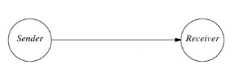
- "tamanho da janela > S / M" -> perda de tempo?
  - é uma perda de tempo pois no momento que a última msg. da janela é transmitida, o "ACK" para a msg. válida mais velha deve ter chegado
  - ou caso o ACK não tenha chegado, é o momento de considerar a retransmissão da mensagem
  - necessário considerar o tipo de cálcuo proposto, pois o mesmo reduz o problema de controle de fluxo para uma questão do nível do enlace, enquanto ignora a ree que contém o enlace de dados
- Tendo por base com 2 enlaces, há 2 caminhos na definição de um protocolo de controle de fluxo
- "Hop-by-Hop" ou também chamado "Node-to-Node"
- "End-to-End" - não há participação dos nós intermdiários

  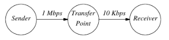
- "Hop-to-Hop Protocol" - tamanho da janela é calculado separadamente para cada enlace de moco que possa ser saturado
  - primeiro enlace é 100 vezes mais rápio que o segundo, assim, se bem sucedidos na saturação dos 2 canais, ter-se-à um grande problema "versus" desempenho no uso de recursos
  - dados chegam 100 vezes mais rápido do que podem ser re-passados para o receptor e, independente do espaço em "buffer", pode ser sobrecarregado >> perda de mensagens
  - "alternativa" - "transfer point" passa a controlar o transmissor ao recusar as msgs. de "acks", não obstante o transmissor irá saturar o canal e ser bem sucedido (retransmissões ou dados novos)

  

- "solução" - contemplar um controle de fluxo que retire o máximo do uso dos recursos em separado, ou seja:
  - "buffer space" nos nós da rede
  - "bandwidth" do enlaces que conectam os nós da rede
  - esta abordagem falha nos 2 pontos, uma vez que gasta espaço de "buffer" no nó "transfer point", potencialmente bloqueando outros tráfegos que passam pelo nó

  
- "solução" - contemplar um controle de fluxo que retire o máximo do uso do recursos em separado, ou seja, a) "buffer space" nos nós da rede ou b) "bandwidth" do enlaces que conectam os nós da rede
  - também gasta "bandwidth" pois gatilha um dilúvio de retransmissões no enlace do transmissor para o "transfer point"
  - uso ótimo dos 2 enlaces pode ser atingido se o transmissor encaminha dados na velocidade do enlace de menor capacidade

  
- "End-to-End Protocol", neste caso, a capacidade fim-a-fim da rede é igual a capacidade do menor enlace, assim, o tamanho da janela pode ser escolhido apropriadamente
- Obs: Em Redes mais complexa, não há esperança que o transmissor possa facilmente predizer onde se encontra o enlace de menor capacidade até o receptor
  - em rede maiores, a capacidade do enlace de dados não depende apenas do "hardware", mas **também do nro. de usuários**
- e.g., Se 10 usuários inicam a transf. de arquivos no mesmo enlace da rede, este enlace subtamente se transforma no enlace de menor capacidade de todos eles
- "mais seguro a fazer" - derivar o tamanho máximo da janela para toda a rede considerando o enlace de menor capacidade
- "dynamic window", controle de fluxo com janela dinâmica permite que o protocolo seja auto-adaptável
  - método simples e comum de se usar é forçar o transmissor a diminuir o tamanho da janela toda vez que ocorrer "timeout" (e.g. caso de retransmissão automática)
  - considerando que o "timeout" não mais ocorre, o transmissor pode aumentar gradualmente o tramanho da janela até o seu valor máximo (busca-se o máximo de transferência a todo instante)
- "alguma análises", há diferentes filosofias quanto a precição dos parâmetros de modo que esta técnica seja utilizada, dentre elas:
  - diminuir a janela de 1 toda vez que "timeout" ocorre e, aumentar de 1 toda vez que se recebe um "ack" positivo
  - diminuir a janela pela 1/2 do tamanho corrente a cada "timeout" e aumentar de 1 msg. quando a ocorrência de "N" "acks" positivos recebidos
  - diminuir a janela para o seu valor mínimo de 1 n ocorrência do "timeout" e, aumentar a janela de 1 quando a ocorrência de "N" "acks" positivos recebidos
- Suponha que uma primitiva leva 0,5 segundos para ir do transmissor ao receptor e o mesmo tempo de 0,5 segundos para voltar o Ack
  - transmissor satura o anal se transmitir por mais que 1s
- "factível", se a taxa do canal e S bpc, o transmissor pode transmitir S bits, para então se preocupar com o reconhecimento
  - se cada primitiva tem "N" bits, a melhor janela e "S/N", mas ressalvando a importância de garantir que "N < S".
  - janela maiores do que "S/N" representam desperdício!

## Redes de Computadores (Introdução)

### 1. Conceitos Básicos e Aplicações Típicas

- Definição: conjunto de computadores autônomos e interconectados
  - ao exigir que os computadores sejam autônamos, excluímos da nossa definiçã mestre/escravo
- classificação quanto a extensão geográfica
  - LAN - Local Area Network - (10m a 1 km)
  - CAN - Campus Area Network - (1km a 10km)
  - MAN - Metropolitan Area Network - (5km a 100km)
  - WAN - Wide Area Network - (100 a 5000km)
- classificação quanto às máquinas:
  - Homogêneas - computadores idênticos
  - Heterogêneas - computadores não idênticos
- Não se deve confundir redes de computadores com sistemas distribuídos, dado que tais sistemas constituem um caso especial das redes de computadores
- sistema distribuído: a distinção chave é a de que a existência de múltiplos computadores é transparente, ou seja, não visível para o usuário
  - em um sistema distribuído, o *software* apresenta alto grau de coesão e transparência, especialmente no nível do sistema operacional
- Não obstante, há muitas intersecções entre os dois temas, p.ex., em ambos há a necessidade de manipulação de arquivos
  - a diferença está em como isto se dá!
- Benefícios decorrentes das Redes de Computadores
  - compartilhamento de informações e recursos
  - crescimento da capacidade de processamento
  - diversidade de equipamentos e liberdade de escoha
  - aumento de confiabilidade
  - processamento de informação *in loco*
  - um meio alternativo de comunicação
- Impacto produzido pela Tecnologia de Rede:
  - Ensino/Pesquisa
  - Produção e Serviços
  - Administração
- Empresas de Telecomunicações - serviços de comunicação de dados:
  - RENPAC - Rede Nacional de Comutação de Pacotes
  - Serviços Multimídia - Áudio e Vídeo
  - CAD cooperativo, Teleconferência, Telemedicina

### 2. Estruturas de Redes de Computadores

- utilizaremos a terminologia utilizada na Rede ARPANET (Advanced Research Project Agency Network)

  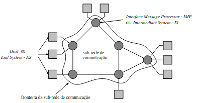
- separando-se os aspectos da comunicação na rede (subrede) dos aspectos da aplicação (hosts), o projeto da rede pode ser simplificado

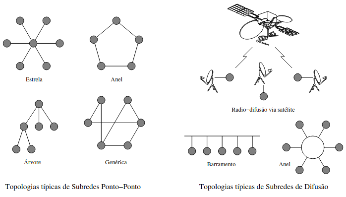

- "topologia típica" - de difusão da subrede de comunicação e na qual a informação transmitida é recebida por todos os dispositivos na rede
- "domínio de colisão" - segmento lógico onde os pacotes transmitidos por elementos pertencentes a ele podem colidir uns com os outros
- "colisão" - duas ou mais estações pertencentes ao mesmo segmento compartilhados de rede transmitem simultaneamente
- "domínio broadcast" - conjunto de dispositivos que recebem qualquer pacote (unidade de informação da camada de rede) broadcast originário de qualquer dispositivo dentro do segmento de rede
  - domínio broadcast pode ser segmentado através de VLANs, como será comentado mais a frente
  - domínio broadcast pode ser segmentado por um roteador, no qual cada porta do roteador representa um domínio broadcast distinto. como será comentado mais a frente

### 3. Arquiteturas de Redes de Computadores

- para reduzir a complexidade no projeto, as redes são organizadas como uma série de camadas ou níveis, cada qual construída a sua predecessora

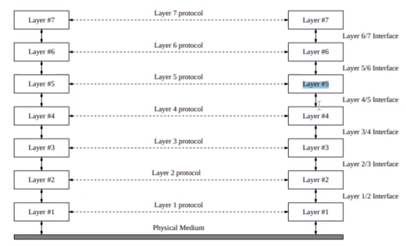

- exemplo: como prover comunicação para a última camada de uma rede estratificada em 7 camadas

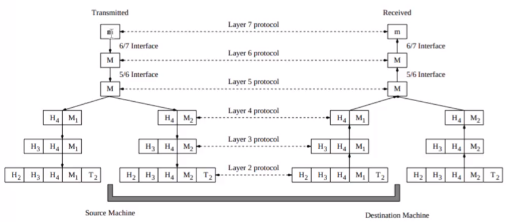

- um aspecto importante que precisa ser bem entendido é a relação entre comunicação virtual e real bem como a diferença entre protocolos e interfaces
- sem a abstração de processos pares, é muito difícil senão impossível o particionamento do projeto integral da rede em problemas menores e gerenciáveis
- Alguns aspectos essenciais do projeto de redes de computadores estão presentes em várias das camadas, dentre eles destacamos
  - toda camada deve prover um mecanismo para estabelecer conexão
  - outro aspecto, diz respeito às regras que governam a transferência de dados, ou seja, simplex-communication, half-duples ou full-duplex
  - tratamento de erros é igualmente importante, dado que circuitos que possibilitam a comunicação física não são perfeitos
  - nem todos os canais de comunicação preservam a ordem de envio das mensagens
  - inabilidade de tratar mensagens longas, exigindo mecanismos de desmontagem, transmisão e remontagem da mensagem

### 4. Modelo OSI (Open System Interconnection)

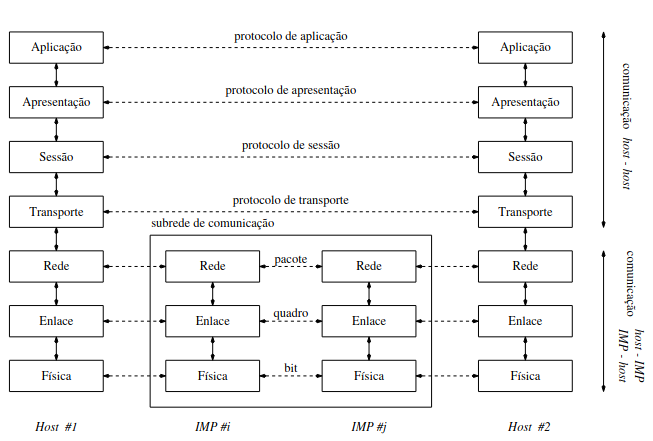

#### Camada Física

- Intimamente relacionada com o meio físico empregado: fibra óptico, cabo coxial, par trançado
- Gera sinais elétricos, óticos ou eletromagnéticos para serem propagados
- Função do protocolo da Camada Física:
  - especificar qual a duração e intensidade do sinal
  - técnica de multiplexação
  - pinagem

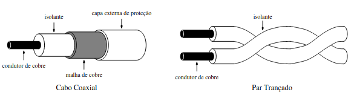

#### Camada de Enlace

- Utiliza a Camada Física para transmissão dos *data frames*
- *Data Frames* são delimitados por sequências pré-estabelecidas
- Transmite (Recebe) *data frames* aguardando (enviando) o respectivo quadro de reconhecimento
- Algumas características do protocolo:
  - transmissão não confiável (mesmo com reconhecimento de recepção)
  - *data frames* podem ser duplicados ao chegar fora de ordem
  - duplicações geralmente ocorrem quando o *data frame* de reconhecimento é deformado na transmissão
  - controla o fluxo de *data frames*, evitando que um *host* envie quadros em uma taxa superior a que o receptor é capaz de processar

#### Camada de Rede

- Controla a operação da subrede
- Algumas de suas Funções:
  - roteamento de pacotes de *host* origem ao *host* destino
  - o roteamento pode apresentar características dinâmicas ou estáticas
  - fragmentação e remontagem de pacotes para atender limites impostos
- Nota: em subredes de difusão esta camada é extremamente simples, uma vez que a principal função (roteamento) é inexistente

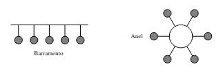

#### Camada de Transporte

- Algumas de suas Funções:
  - receber dados da camada de sessão
  - particionar estes dados em unidades menores
  - garantir envio de dados sem duplicação e na ordem correta
- Possui 2 tipos de serviços:
  - serviço rápico com mensagens de tamanho limitado e sem garantia de entrega, ordem ou ausência de duplicação
  - serviço mais lento, porém altamente confiável e sem limites de tamanho de mensagens
- É a primeira camada a promover comunicação *host-host*, assim controla o fluxo de dados entre 2 processos comunicantes

#### Camada de Sessão

- Permite que 2 *Application Process - APs* estabeleçam sessões entre si a fim de organizar e sincronizar a troca de informação
- Conexão de Sessão => definição das regras de diálogo entre 2 APs
  - Two Way Simultaneous (TWS)
  - Two Way Alternate (TWA)
  - One Way (OW)

#### Camada de Apresentação

- Serviços oferecidos:
  - representação canônica de dados
  - compressão de dados
  - criptografia
- Necessidade da Representação Canônica de Dados:
  - quando arquiteturas diferentes devem se comunicar
- Compressão é útil para o envio de grandes massas de dados
- Criptografia é utilizada quando os dados são confidenciais

#### Camada de Aplicação

- Dispõe de serviços comumente utilizados por usuários de redes
  - correio eletrônico
  - *login* remoto
  - serviços de diretório
  - submissão de *jobs* remotos
- Também se constitui em postos de acesso à rede por APs
- *Application Program Interface - APIs* (em vias de padronização)
  - são bibliotecas de funções para envio/recepção de mensagens

### 5. Serviços e Protocolos do Modelo OSI

- "Modelo de Referência" permite a especificação de várias "Classes de Serviço", enquanto que uma Classe de Serviço permite a especificação de várias "Classes de Protocolos".
  - no nível mais baixo de abstração, tem-se a implementação do protocolo, mais especificamente, tantas implementações quanto possíveis face as tecnologias utilizadas

  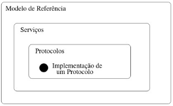
- RM-OSI - propõe a estratificação da pilha de comunicação em camadas horizontais cuja finalidade consiste
  - permite uma discussão da interação entre elementos pares
  - desenvolvimento incremental dos serviços de cada camada
  - sistema aberto pode ser visto como sucessão de sub-sistemas
- "entidades" - são elementos ativos em cada camada
  - entidades na Ln (Camada N) implementam serviços usados na L(n+1) (Camada N + 1), ou seja, Ln provê serviços para a L(n + 1)
  - entidades na Camada N + 1 (L(n + 1)) usam/invocam serviços da Camada N (Ln), ou seja, L(n+1) usa/invoca serviços de Ln (Camada N)
- "entidade" - elemento ativo uma cada camada, p.ex, processo
- SAP - Service Access Point; CEP - Connection End Point

  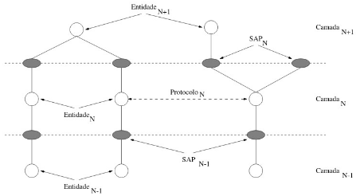
- "serviço orientado a conexão" - pressupõe o estabelecimento de um canal lógico entre as entidades pares, ou seja, canal lógico pelo fato de não dispor de uma conexão física exclusiva entre os elementos pares
  - canais lógicos podem compartilhar uma mesma conexão física, bem com contemplar ou não os dispositivos ao longo do caminho entre o remetente e destinatário
- "tipos de serviços orientados a conexão"
  - mensagens - têm fronteira limitadas
  - cadeias de bytes - não têm fronteiras limitadas
  - serviços típicos - transferência de arquivos, login remoto, etc.
- "serviço não orientado a conexão" - também denominados de serviços de datagrama, constituem-se em serviços análogos aos "serviços postais" dos correrios
  - dentre os serviços típicos, destacam-se o acesso a banco de dados, sincronização de relógios, etc.
- Com o objetivo de permitir que objetos como Entidades, SAPs e CEPs sejam referenciados, faz-se necessário um esquema de identificação
  - identificadores de Entidades (entidades) = Titles
  - identificadores de SAPs (Service Access Points) = Endereços
  - identificadores de Conexões (Connection End Points) = CEP-identifier
- "algumas associações possíveis"
  - 1 Entidade N possui 1 Título N
  - 1 SAP N possui 1 Endereço N
  - 1 CEP N possui 1 identificador CEP n
- "troca de dados" entre entidades ocorre de duas formas:
  - "entidades pares" - p.ex., entre Entidades N+1 remotas, a troca de informações é governada pelo Protocolo N+1
  - "entidades adjacentes" - p.ex., entre a Entidade N+1 e Entidade N no mesmo "host", a troca de informações se dá pelo SAP n
  - "observação" - entidades trocam não somente informações de dados, mas também informações de controle
- Neste contexto, são 4 os tipos de unidades de dados:
  - "informação de controle de protocolo" - trocada entre entidades pares com a finalidade de coordenar as suas operações conjuntas
  - "dado do usuário" - dado transferido entre uma E(n+1) e uma En, ou seja, dados transferidos entre entidades adjacentes
  - "informação de controle de interface" - informação trocada entre E(n+1) e En para coordenar as suas interações através do SAPn
  - "dado de interface" - dado transferido da Entidade N + 1 (E(n+1)) á Entidade N (En) afim de que seja enviado à Entidade N+1 par
- 2 tipos de Unidade contendo informações de Dado e Controle:
  - "unidade de dado do Protocolo N" (PDUn) - informação trocada entre entidades e constituída de controle e dado do usuário
  - "unidade de dado de interface N+1" - informação trocada entre uma entidade N+1(E(n+1)) e uma entidade N (En) através de um SAPn, sendo constituída de controle e dado do usuário

  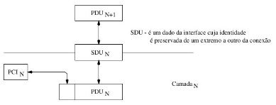
- RM-OSI - não restringe o tamanho da Unidade de Dado
- Formas de mapeamento possíveis:
  - "segmentação" - função realizada pela entidade N (En) através da qual uma SDUn é mapeada em várias PDUs N
  - "remontagem" - função realizada pela entidade N (En) par através da qual múltiplas PDUs N são mapeadas em uma SDUn

  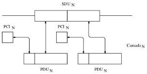
- Formas de mapeamento possíveis:
  - "bloqueio" - função realizada por uma entidade N (En) que mapeia múltiplas SDUs N (SDUn) em uma PDUn
  - "desbloqueio" - função realizada por uma entidade N par que mapeia uma PDU N (PDUn) em múltiplas SDUs N (SDUn) correspondentes

  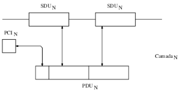
- Formas de mapeamento possíveis:
  - "concatenação" - permite uma entidade N mapear múltiplas PDUs N (PDUn) em uma SDU n-1 (SDU(n-1))
  - "separação" - permite uma entidade N par mapear uma SDU n-1 (SDU n-1) em múltiplas PDUs N (PDUn) correspondentes

  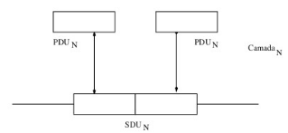
- Modelo OSI estabelece 4 tipos de primitivas:
  - "requisição" - uma entidade requer a execução de um serviço
  - "indicação" - uma entidade é informada da ocorrência de um evento
  - "resposta" - uma entidade deseja responder a um evento
  - "confirmação" - uma entidade recebe o resultado de sua requisição

  
- "conceito clássico" - define a forma como entidades equivalentes interagem entre si para a realização de um objetivo comum para a prestação de serviços a entidades na camada superior
- "protocolo da camada N" - conjunto de regras e formatos, representados por aspectos semânticos, sintáticos e temporais, que regem a comunicação entre entidades pares
- "especificação de protocolo" - compreende a descrição
  - dos serviços evocados para transferência de cada tipo de PDU
  - formal da estrutura da cada PDU bem como os tipos de PDUs
  - formal da operação da entidade de protocolo
  - dos procedimentos do protocolo de cada tipo de PDU
- "primitivas" - são formados por 2 pares:
  - uma parte correspondente aos dados do usuário
  - outra parte contendo informações de controle relativa ao protocolo
- "estrutura das PDUs" - especificação do protocolo
  - Cadeias de Bits - protocolos de camdas inferiores
  - ASN.1 (Abstract Syntax Notation Number One) + Regras de Codificação - baseada na tipificação dos dados (sintaxe abstrata), normalmente presente em níveis mais alto - protocolos orientados a aplicação
- "modelagem de um protocolo" - entidade de protocolo é modelada como uma máquina de estados finitos (autômato)
  - transição de um estado para outro ocorre quando um evento válido ocorre na interface do autômato, gerando com resultado alguma ação
- "exemplos de transições de estado"
  1. recepção de uma primitiva de seriço na interface com a camada superior, p.ex., dados para serem transmitidos
  2. recepção de uma primitiva na interface com a camada inferior, p.ex., retorno de chamadas de procedimento anteriormente realizadas
  3. ocorrência de eventos locais da própria camada, também disparam ações e mudanças de estado na máquina de estado

  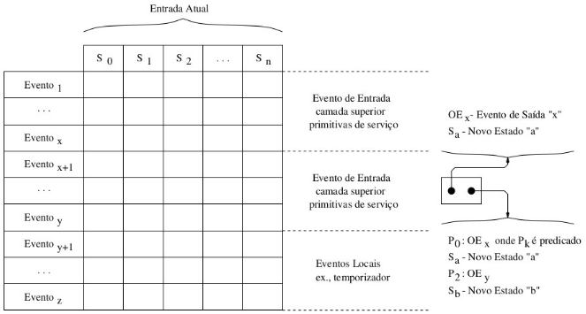
  - associado à ocorrência de um evento válido, o autômato muda de estado e gera alguma ação interna específica
  - método de especificação utiliza uma tabela evento-estado onde cada entrada na tablea especifica o evento saída e o novo estado
  - novo estado para o qual o autômato deverá transitar devido a uma combinação de entrada e estado atual

### 6. Padronização em Redes de Computadores

- "padrões" - (standards) conjunto de normas e procedimentos, cujo cumprimento pode ser de obrigatório ou recomendável
- "objetivo dos padrões"
  - homogeneizar produtos e serviços
  - minimizar investimentos em estoques
  - compatibilizar equipamentos de diferentes procedências
- Padrão de Facto - adotado sem nenhuma ação de entidade reguladora p.ex, IBM, Padrão de Facto da Internet
- Padrões de Jure - produzidos por entidades reguladoras, nacionais ou internacionais, p.ex., ISO 9000
- Entidades de Padronização - Eng. Elétrica
- Brasil - Associação Brasileira de Normas Técnicas (ABNT)
- EUA - America National Standard Institute (ANSI)
- EUA - Institute of Electrical and Eletronic Engineers (IEEE)
- Alemanha - Deutsch Industrie-Norm(DIN)
- Inglaterra - British Standard Institution (BSI)
- "entidades de padronização" - redes de computadores
- ITU-TS "International Telecommunication Union - Telecommunication Standadization" antiga CCITT "Comité Consultatif International de Télégraphique et Téléphonique"
- ISO "International Standard Organization"
- Padrões ITU-TS:
  - normalmente se referem a transmissão de dados a longas distâncias
  - situam-se mais próximo do hardware
- Padrões ISO:
  - são mais voltados aos serviços que uma rede provê
  - protocolos de conversação inter-hosts
  - cobrem praticamente todo o espectro de tecnologias de rede
- Modelo ISO/OSI ou OSI (Open Systems Interconnection):
  - estipula que uma rede de computadores dever ser estipulada em 7 camadas, propondo um ou mais padrões para controlar cada camada
  - estes padrões estão ainda em vias de se tornarem padrões de facto
- Padrões de Facto são também chamados Padrões Internet:
  - enfatizam o transporte confiável de um host para outro
  - apenas três serviços são padronizados no nível de usuário: transferência de arquivo, correio eletrônico e login remoto
- Serviço introduzidos (Comunidade ou Fabricante):
  - Yellow Pages - diretório
  - RPC "Remote Procedure Call"
  - NFS "Network File System"
- "tendência" - novos serviços como aqueles oferecidos por redes ISDN "Integrated System Digital Network" serão aderentes ao Modelo OSI

### 7. Redes Públicas, ARPANET e BITNET

- "rede pública" - denominação dada os sistemas das operadoras de redes utilizados no oferecimento de serviços de comunicação de dados para os hosts e terminais de seus clientes
  - embora sejam diferentes em diferentes países, todas utilizam-se do Modelo OSI (ISO 7498) ou de Protocolos OSI ou ITU (antiga CCITT)
  - as 3 camadas inferiores são conhecidas coletivamente como X.25 (CCITT Recommendation Number), entretando a ISO o adotou como um padrão
  - para as demais camadas, padrões separados para a especificação do serviço e do protocolo são adotados pela ISO
- ISO 8802 são derivados dos Padrões IEEE 802

  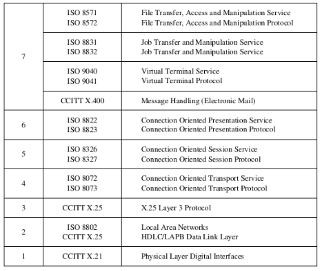
- ARPANET - resultado do Projeto DARPA (Defense Advanced Research Projects Agency) do Departamento de Defesa do USA
  - iniciado na década de 60 com o propóstio de pesquisar redes de computadores através de investimentos concedidos aos departamentos de ciência da computação e até mesmo coorporações privadas
  - após a consolidação da tecnologia ARPANET no oferecimento de serviços por vários anos, uma rede militar - MILNET (Military Network) foi contruída com a mesma tecnologia
  - a ARPANET tinha suas próprias LANs, eventualmente conectadas a IMPs conectando-a a ARPA Internet com milhares de hosts e centenas de milhares de usários durante a década de 1970
  - os IMPs originais da ARPANET eram minicomputadores Honeywell DDP-516 com memória de 12 K palavras de 16-bits
  - atualmente, são conhecidos por PSN Packet Switch Nodes ou simplesmente SN (Switch Nodes) mas com a mesma funcionalidade
- ARPANET não segue o Modelo OSI, na verdade, pois antecedeu a proposta em mais de uma década sendo as vezes difícil compará-los
  - p.ex., Protocolo IMP-IMP é uma mistura de Camada 2 e 3 do OSI
- Protocolo de rede é o IP (Internet Protocol): projetado para permitir a interconexão de uma grande variedade de redes, porr isso é um protocolo não orientado a conexão
- Protocolo de Transporte da ARPANET pode ser:
  - TCP (Transmission Control Protocol): orientado a conexão
  - UDP (User Datragram Protocol): não orientado a conexão
- Não encontramos nem camada de sessão, nem de apresentação e até a década de 1980 pouco os nenhum uso tiveram
- Quanto aos Serviços da Camada de Aplicação, destacam-se
  - FTP(File Transfer Protocol)
  - SMTP(Simple Mail Transfer Protocol)
  - TELNET e outros

  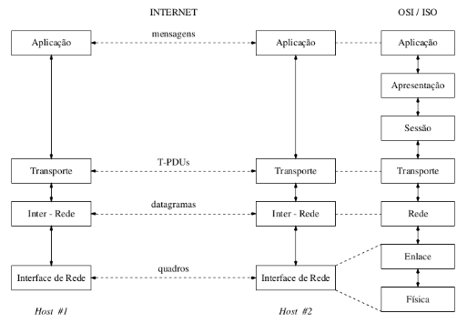

### 8. Aspectos Conceituais do RM-OSI

- um pouco de história (RM-OSI da ISO)
- "gatilho" - necessidade de "networking"

  
- "característica marcante" - heterogeneidade
- Rede DARPA (Defense Advanced Reasearch Projects Agency) - 1976
- Projeto DIX da Digital, Intel e Xerox - 1974/1976
- "análise" - em ambos houve o aparecimento de Padrões Proprietários
  - surgem os primeiros problemas de interoperabilidade, face a grande quantidade de redes com padrões proprietários
  - surge a necessidade da padronização para que a interoperabilidade deixe de ser um problema, face a necessidade maior de comunicação entre as diferentes plataformas (pilhas de comunicação)
- "Systemas Abertos" - "Open Systems"
  - Iniciativa da ISO (International Standardization Organization)
  - Criação do Comitê OSI (Open Systems Interconnection)
- OSI - escopo de atuação único e exclusivamente sobre os aspectos de comhincação de dados

  
- Modelo de Referência OSI
  - padrão concernente apenas aos aspectos da arquitetura de redes
  - separa as funcionalidades e capacidades de rede em camadas
  - define termos e objetos que são palavras reservadas no mundo das redes de computadores
- "denominação" - apenas Modelo Referência OSI (7 camadas)
  - camadas definem desde aspectos físicos, enlace, rede, transporte, sessão, apresentação e aspectos abstratos da aplicação
  - camadas próximas ao meio físico referenciadas como de baixo nível e, camadas próxima do usuário são referenciadas com de alto nível
- Modelo de Referência OSI - CAMADAS SUPERIORES

  
- Modelo de Referência OSI - CAMADAS INFERIORES

  
- "aspectos conceituais" - Modelo de Referência OSI
  - comunicação entre camadas é feita através da requisição de serviço ou da resposta a serviços
  - serviços são requisitados (respondidos) através de pontos específicos localizados nas interfaces entre as camadas
  - estes pontos onde serviços são requisitados (respondidos) são chamados SAPs(Service Access Points)

  
  - e.g., SAPs são identificados pela interface da camada, ou seja, p.ex., SAP da Camada de Rede é o N-SAP

  
  - interações entre entidades de camadas "pares" e presentes em nós distintos se dá através de primitivas
  - para que duas camadas "pares" se comuniquem eles devem especificar o mesmo conj. de primitivas (protocolo)
  - serviços são requisitados (respondidos) na "vertical", enquanto que as primitivas são trocadas entre elementos pares, ou seja, entre elementos da mesma camada - "horizontal"

  
- "protocolos" - abstraem a comunicação da camada logo abaixo da camada que requisita os serviços
  - quando uma entidade em uma camada solicita serviços à camada abaixo, supõe-se que o "provider" enviará os dados disponibilizados
  - dados enviados são denominados genericamente de primitivas
  - este processo se repete até a camada de mais baixo nível
  - serviços de uma camada "K" implementam o respectivo protocolo e repassam através do "K-1"-SAP à camada inferior

  
- "primitiva" - unidade de informação encaminhada entre uma camada e outra pode ser do tipo: "request", "confirm" em TX
- "request" - primitiva enviada pela camada "N+1" para a camada "N" ao requisitar um serviço - invocação de serviço
- "indication" - primitiva entregue a camada "N+1" RX pela camada "N" RX para sinalizar a ativação de ums serviço requisitado ou de alguma ação iniciada pelo serviço da camada "N" TX
- "response" - primitiva da camada "N+1" RX em resposta a uma primitiva "indication" RX para completar ou reconhecer uma ação previamente invocada pela primitiva "indication" RX
- "confirm" - primitiva retornada para a camada "N+1" em TX da camada "N" em TX para reconhecer ou completar uma ação previamente invocada pela primitiva "request" em TX

  
- Quanto aos serviço, 2 grupos se destacam:
  - "serviços confirmados" - serviço com as quatro fases, ou seja, prmitivas "request", "indication", "response" e "confirm"
  - "serviços não confirmados" - serviços que especificam 2 fases, ou seja, primitivas "request" e "indication"
- No OSI as camadas "pares" se comunicam através de um objeto denominado entidade da camada
  - neste contexto, entidade é uma palavra reservada - termo que sempre vai significar uma capacidade de comunicação
  - no modelo de protocolos em camada, a entidade de protocolo é definida como a entidade que processa um protocolo específico
  - em cada camada, uma ou mais entidades implementam suas funcionalidades/serviços que a camada oferece
  - cada entidade interage diretamente e somente com a camada logo abaixo e provê facilidades para serem usadas pela camada logo acima da camada em que se situa a entidade
- Quando uma camada "N+1" requisita um serviço à camada "N", o conjunto de bytes enviados pode ser dividio em 2 partes:
  - cabeçalho - parte de protocolo da camada(n+1)
  - conteúdo - parte de dados da camada(n+1)
- PDU - "Protocol Data Unit" = "cabeçalho" + "conteúdo"
- PDU da camada "N + 1" se encaixa na perte de dados da PDU da camada "N" e, assim, recebe um novo nome na camamda "N", comumente denominado de SDU - "Service Data Unit"
  - portanto, na fronteira superior, a camda recebe uma SDU, adiciona o protocolo da camada na qual se situa e se transiforam em PDU
- "transormação da primitiva" - na fronteira superior, a camada recebe uma SDU, adiciona o protocolo da camada na qual se situa e a transforma em PDU da camada "N"

  
- N-PDU = N-SDU + N-Protocol
- 1 SDU pode gerar várias PDUs
  - camadas inferiores, devido às limitações dos meios de transmissão, são ricas em protocolo, mas pobres em serviço
  - maior o número de serviços em uma mesma camada permite que poucos protocolos ofereçam toda a gama de serviços

  
- Relação entre Serviço e Complexidade de Protocolos ao longo do Modelo de Referência OSI
- Quando uma camada requisita serviços da camada inferior, ela é dita usuário (user) dessa camada
  - camada inferior abstrai a existência das outrsa camadas mais abaixo, oferencendo a somatória das funcionalidades de todas as camadas abaixo na forma de serviços
  - "service provider" - abstração é chamada de provedor de serviços
- O provimento de serviço abstrai inclusive o aspecto da comunicação com a camada parceira
  - logo, o provedor de serviços oferece os serviços e a conexão da Camada "N + 1" a um usuário da Camada "N"

  
  - provedor ser serviços oferece os serviços e a conexão da Camada "N-1" a um usuário da Camada "N"

  

## Physical Layer

- "função principal da camada física" -
  - geração de sináis elétricos, ópticos ou eletromagnéticos
  - propagação destes sinais no meio físico
- Cabe à Camada Física especificar:
  - natureza do meio físico
  - forma como os hosts e IMPs são conectados ao meio físico
  - forma como 0s e 1s são codificados em sinais do meios físico
  - parâmetros e respectivas tolerância de sinais
  - procedimento de multiplexação de sinais no meio, se houver
- Alguns Padrões: IEEE 802, CCITT X.21, etc.
- Transmissão de Bits (... dos quadros da camada de enlace):
  - full-fuplex - os dois hosts comunicantes transmitem simultaneamente
  - half-duplex - apenas um host por vez transmite
- Transmissão de bits pelo meio físico pode ser:
  - serial- um bit é transmitido a cada intervalo de tempo
  - paralela - bits (em conjunto) são transmitidos serialmente por N dutos independentes -> N bits por unidade de tempo
- Transmissão Síncrona e Assíncrona:
  - síncrona - bit é transmitido a cada intervalo de tempo bem definido
  - assíncron - bit é transmitido num intervalo de tempo arbitrário
- Na prática que tipo de transmissão é utilizada?
  - transmissão assíncrona com bloco de bits "Start/ Stop"

  

### 1. Aspectos Teóricos de Comunicação de Dados

- Análise por Série de Fourier - informações podem ser transmitidas através de meios físicos variando-se alguma propriedade física, como voltage (tensão elétrica) ou corrente elétrica
  - reprentando o valor deste sinal como uma função do tempo, g(t), pode-se modelar o comportamento do sinal e analisá-lo matematicamente
- "Jean Fourier" - provou que uma função periódica "g(t)", com período T pode ser contruída somando-se funções "seno" e "cosseno" com diferentes amplitudes...

  
  - onde f = 1/T é a frequência fundamental e an e bn são as amplitudes dos termos (harmônicas) das funções seno e cosseno
- Através da Série de Fourier, uma função pode ser reconstruída
  - ou seja, se o "T" é conhecido e as amplitudes são dadas, a função original pode ser achada realizando-se as somas da equação anterior
- "an" pode ser obitido para uma função "g(t)" multiplicando-se ambos os lados da eq. por "sin(2pinft)" e integrando de 0 a T

  
  - para o cálculo dos coeficientes, vale as relações:

    
- e.g. ... dado uma taxa de "b" bits/s, o tempo requerido para enviar 8 bits é: b bits - 1 s, então 8 bits - t??
  - t \* b = 8\*1 -> t = (8 \* 1)/b -> t = 8/b segundos e como se trata de um sinal periódico, a idéia é a de que o mesmo se repita após "t" seg.
  - período da 1ª Harmônica é exatamente este tempo, ou seja, 8/b seg., então a frequência da 1ª Hármonica é o inverso - 1 / (8/b) = b/8 Hz
- seja a tranmissão do caracter "01100010", então pela Análise da Série de Fourier os coeficientes "an", "bn" e "c" são:

  

- Fig 2.1 mostra a saída de voltagem do TX (Transmissor)

  
  

- nenhum recurso de transmissão é capaz de transmitir sinais sem perder parte da energia no processo -> "**atenuações**"
- no entanto, tais atenuações se dão de forma diferente para cada uma das componentes -> "**distorções**"
- "**largura de banda**" - faixa de frequências transmitidas sem que as componentes sejam fortemente atenuadas
  - trata-se de uma propriedade física do meio de transmissão que, geralmente depende da construção, expessura e comprimento do meio
- e.g. ... dado uma taxa de "b" bits/s, o tempo requerido para enviar 8 bits é "8/b" s, ou seja, a frequência da primeira harmônica é o inverso do período da 1ª Harmônica... "b/8" Hz
  - considere a transmissão deste byte por uma linha telefônica comum cuja frequência de corte está em cerca de 3000 Hz
- O que significa esta restrição na Linha Telefônica ?? !!
  - siginifica que o nro do harmônica mais alto transmitido é aproximadamente "3000/(b/8)" ou "24000/b"
  - por outro lado, o sinal no receptor pode chegar alterado, considerando que algumas componentes serão atenuadas gerando um sinal resultante com distorções em relação ao sinal original
- Fig. 2.2 mostra taxas comumente usadas e o efeito da largura de banda de uma linha telefônica comum com fcorte = 3000 Hz
  - para 9600 bps em uma linha telefônica de qualidade de voz, o modelo sugerido da Fig 2.1 (a) assume a forma da Fig 2.1 (c) ... todas as demais harmônicas serão atenuadas e o resultado final contempla 2 comp.

  
- "Teorema de Nyquist" - um canal livre de ruído com largura de banda "H" transmitindo um sinal com "V" bauds possui uma taxa de tranmissão "T" <= "2 \* log2 v bps"
- e.g., ... seja um canal de 3 kHz sem ruído, então podemos transmitir sinais binários (ou seja, 2 níveis = 2 bauds) a uma taxa de até ... 2 \* 3000 \* log2 2 = 2 \*3000 \* 1 = 6000 bps
- Alguns valores para Taxas de Transmissão:
  - Elétricos (par trançado - cobre) - 10 Mbps; 100 Mbps; 1000 Mbps
  - Fibras Óticas - 100 Mbps; 1000 Mbps; 10s de 1000s
  - ATM - faixa de Gbps
- Nyquist provou que, se um sinal arbitrário atravessar um filtro com frequência de corte H, o sinal filtrado pode ser completamente reconstruído a partir de apenas 2*H amostras por segundo
  - coletar amostras acima deste limite é inútil, pois este componentes serão filtrados/eliminados e/ou atenuados pelo canal
- Entretando, se ruído está presente no canal, "Shannon" mostrou que a máxima taxa de transmissão T para um canal com largura de banda B é no máximo ... T <= B * Log2 (1 + S/N)  bps
  - S/N - comumente denominada de relação "sinal/ruído" reflete a relação entre a potência do sinal propriamente dito e a potência do sinal de ruído
- normalmente a relação sinal/ruído não é fornecida, ao invés disso, a quantidade 10*log10 s/n é fornecida (decibels - dB)
  - p.ex: uma relação S/N de 10 e -> 10 dB, uma relação de 100 -> 20dB, uma relação de 1000 -> 30 dB e assim por diante
- e.g., seja uma canal de 3000Hz de largura de banda e relação sinal/ruído de 30dB (parâmetro típico para linha de telefone)
  - então B * log2 (1 + s/n) = 3000 * log 2 (1 + 1000) ... aprox. 30000 bps, ou seja, canal não poderá transmitir a mais que 30000 bps
  - taxa máxima de transmissão independe do nro. de níveis ou "baus" do sinal (Teorema de Nyquist = T <= 2 * H * log2 v  bps)
- "baud" - frequência dom que o sinal podde ser propagar no meio de transmissão, ou seja, um canal de 10 M bauds permite 10⁶ variações do sinal por segundo
  - p.ex.: um canal de N bauds poderá transportar N bps com codificação On/Off ou N/2 com codificação Manchester
- Como transportar em um canal de N "bauds" um número maior que N bps?
  - e.g., ... usando sinal digital com codificação On/Off e 4 níveis de tensão representando as ocorrências dos bits 00, 01, 10 e 11 => 2 N bps
  - no entanto, acarreta alta taxa de falhar na decodificação do sinal

### 2. Meios de Tansmissão Guiados

- "meio físico" - diferentes meios físicos podem ser usados para realizar a tranmissão, cada qual com características próprias de largura de banda, retardo, custo de instalação e manutenção
- "meior magnéticos" - gravação de dados em fita magnética
- e.g., ... considere unidades de fitas com capacidade de 200 GB (Giga Bytes), então 1000 unid. de fita perfazerm uma capacidade de 300 terabytes ou 1600 terabits (1 TB - 2¹² bytes)
  - se considerarmos o trasporte deste volume de dados em 24 horas (86400 seg), então a largura de banda efetiva será:
    - 1600 terabits/ 86400 seg = 19 Gbps ... nenhuma rede de computador sequer contempla desemplenho próximo deste valor
- "par trançado" - dois fios enrolados de forma helicoidal para evitar que os fios assumam característica de antena, além disso minimiza a componente indutiva da impedância
  - componente resistiva da impedância sofre o efeito pelicular

  
- Utilizados para transmissão de Sinais Analógicos e Digitais, em razão do baixo custo e facilidade de instalação
- frequência máxima de tranmissão - depende do comprimento e espessura do par de fios, o que em última instância caracteriza a impedância elétrica do par
  - 1000s de metros => transmissão não ultrapassa 2 Kbps
  - 10s de metros => tranmissão pode atingir 100 Mbps
- Obs: comum redes na faixa de 10 Mbps terem como meio de transmissão pares trançados para distâncias inferiores a 1Km
- "largura de banda" - depende da espessura do fio e da distância percorrida, mas em muitos casos é possível alcançar 10s de 10⁶ ou Mbps por alguns quilômetros.
- Há diversos tipos de cabeamento de pares trançados e dentre eles destacam-se Cabos UTP e STP de várias categorias:
  - Cat. 3 - 16 MHz / Cat. 5 - 100 MHz
  - Cat. 6 - 250 MHz / Cat. 7 - 600 MHz
- Obs: Cabos Cat. 6 ocupam em média 30% mais de espaço que Cabos Cat.5/5e ... exigindo mais espaço na tubulação
- "cabo coxial" - composto por um condutor cilíndrico isolado envolto por uma malha de cobre e uma capa plástica de proteção
  - blindagem forma uma capa de proteção eletrostática ao condutor
  - forma de contrução minimiza as perda em altas frequências
  - estrutura assimétrica contribui para a atenuação da amplitude de sinal

  
- cabos de 50 ohms - comumente usados em transmissões digitais, são adequados ao suporte de uma frequência de transmissão ou duas no caso de FSK (Frequency Shift Keying)
- cabos de 75 ohms - comumente usado em transmissões analógicas e de TV a Cabo, possuem largura de faixa estendida permitindo a multiplexação pela divisão da frequência (FDM)
  - distância máxima de uma cabo depende da atenuação imposta ao sinal, mas o limite máximo de 30 dB é comumente estabelecido
  - atenuação depende do comprimento do cabo, de suas características elétricas, da frequência do sinal e do número de conectores existentes
- "fibra ótica" - composta de um núcleo de sílica envolto por uma casca também de sílica, tudo protegido por uma camada plástica
  - luz é mantida no núcleo por reflexão na casca (Fibra Multimodo)
  - possuem diâmtros entre 50 e 200 picometros
  - atenuação de 1 a 4 dB / Km na potência do sinal ótico

  
- Características de um Sinal Ótico:
  - luz policromáticas de onda centrado em 0.8 picometro
  - sinal é produzido por diodos LED e captado por fotodetectores
  - totalmente imune a interferências eletromagnéticas

  
- diferentes raios de luz incidindo na fronteira acima do ângulo crítico são refletidos internamente em diferentes ângulos e, por isso, os raios de luz tem modos específicos
- "fibra multimodo" - fibra na qual diferentes raios de luz são refletidos em diferentes ângulos
- "fibra monomodo" - fibra cujo diâmetro é tão reduzido que atua como um guia de onda, onde a luz dse propaga em linha reta
  - fibra "monomodo" ou fibra de "modo único" são geralmente mais caras, mas são amplamente utilizadas em distâncias mais longas
  - fibras disponíveis "monomodo" podem transmitir 50 Gbps por 100 Km sem necessidade de amplificação do sinal
- Utilização de Fibras Óticas:
  - são de difícil instalação e por isso utilizadas em redes com topologia em anel, onde o tráfego de informação se dá num único sentido
  - conexão de um host numa fibra ótica é um processo complicado
- Características de Redes baseadas em Fibra Ótica:
  - operam a taxas de 100 Mbits/s
  - taxas de Gbits/s com percursos de longas distâncias necessitam fibras monomodo (diâmtros de 5 a 10 picometros e luz produzida por diodos laser)
- Sistema Óptico - consiste de três elemento básicos: da fonte de luz, meio de tranmissão e detector de luz
- atenuação da luz no vidro depende do comprimento de onda da luz e, normalmente, é medida em decibéis
  - 10 * log10 Potência Transmitida/ Potência Recebida   decibéis
- e.g., ... considere um fator de perda = 2, ou seja, potência recebida é a 1/2 da potência transmitida, então a atenuação da luz é:
  - 10 \* log10 2 = 10 \* 0,301030 aprox 3 dB (decibéis)
- Fig. 2.7 - Atenuação do tipo de vidro usado nas Fibras em dB/Km para três bandas de comprimento de onda - 0,85; 1,30 e 1,55 pico

  
- "comunicação ótica" - utiliza três bandas de comprimento onda centralizadas em 0,85; 1,30 e 1,55 mícron, respectivamente
  - as duas últimas, 1,30 e 1,55 mícron, apresentam boas propriedades de atenuação, inferior 5% por quilômetro
  - outro ponto a ser considerado é a dispersão cromática, ou seja, expansão dos pulso de luz à medida que se propagam
  - quando se produz os pulsos de uma forma especial, os mesmo viajam por 1000s de quilômetros sem que haja distorção significativa - também denominados "solitons"
- "cabos de fibra" - são semelhantes aos cabos coaxiais, exceto por não terem a metálica, mas somente a capa plática ao redor
  - normalmente as fibras são agrupadas em feixes, protegidas por um revestimento exterior - "sheath"

  
- Fibras podem ser conectadas de três maneiras:
- "conectores" - conectores de extremidade permitem que as fibras sejam conectadas em soquetes de fibra
  - tem a vantagem de permitirem a reconfiguração do sistema, mas geram perdas de 10% a 20% da luz
- "união mecânica" - uma luva especial fixa as fibras uma vez que tenham sido cuidadosamente alinhadas
  - normalmente exige tempo de alguns minutos de equipe treinada e resultam em perdas de 10% da luz
- "fusão" - fusão da fibras para formar uma conexão sólida após serem cuidadosamente alinhadas
  - desempenho tão bom quanto de uma fibra sem emendas
- Para produzir os sinais, utilizam-se dois tipos de fontes de luz - "Light Emitting Diodes - LEDs" e "Semiconductor Lasers"
  - extremidade de recepção consiste de um fotodiódo, que emite um pulso elétrico ao ser atingido pela luz e tem tempo de resposta em torno de 1 nanosegundo -> taxa de dados de 1 Gbps

  
- "fibras óticas" vs "fios de cobre"
  - fibra óticas contemplam largura de banda muito alto do que fios de cobre, o que justifica seu uso nas redes de última geração
  - nro de repetidores a cada 50 km em linha de fibra ótica, enquanto são necessárias a cada 5km em linha de cobre
  - fibras óticas não são afetadas por picos de tensão, interferência eletromagnética ou quedas no fornecimento de energia
  - fibras óticas são imunes a ação corrosiva de alguns elementos químicos no ar, adaptando-se muito bem a ambientes industriais
  - fibras são mais leves que fios de cobre, e.g., 1000 pares trançados com 1km pesam oito toneladas, enquanto 2 fibras com igual capacidade pesam apenas 100 kg
  - fibras não desperdiçam luz e dificilmente são interceptadas, assim, oferecem um excelente nível de segurança
  - por outro lado, fibras são tecnologias menos familiares, exigindo conhecimento de profissionais especializados
  - por outro lado, fibras são basicamente unidirecionais, então a comunicação bidirecional exige duas fibras ou duas bandas de frequência em um única fibra ótica

### 3. Transmissão sem Fio

- "ondas eletromagnéticas" - resultado do movimento dos elétrons que poe se propagar pelo espaço livre ou mesmo no vácuo
  - nro de oscilações por segundo de uma onda eletromagnética é chamado de frequência - "f" e é medida em Hz (Hertz)
  - já a distância entre dois máximos ou mínimos consecutivos é chamada de comprimento de onda - "lambda"
  - ondas eletromagnéticas viajam a mesma velocidade, independente da frequência - 3 * 10⁸ m/s = c (velocidade da luz)
  - em meios físicos como cobre e fibra, esta velocidade cai par a 2/3 deste valor e se torna ligeiramente dependente da frequência
    - lambda = c \* T = c \* 1/f ou lamda \* f = c

  
- e.g., na prática "lambda" é medido em metros e "f" em MHz, então: lamda \* f = c (velocidade da luz) ou 3 \* 10⁸ m/s
  - lambda (m) \* f (MHz) = 300 \* 10⁶ m/s = aprox. 300
  - ondas de 100 MHz tem cerca de 3 m (comprimento)
  - ondas de 1000 MHz tem 0,3 m (comprimento)
  - ondas de 3000 MHz tem 0,1 m (comprimento)
- "espectro eletromagnético" - contempla porções de rádio, micro-ondas, infravermelho e luz visível do espectro
  - podem ser usadas na transmissão de dados, desde que seja modulada a amplitude, frequência ou fase de ondas
  - volume de informações que uma onda é capaz de transportar é diretamente proporcional à sua largura de banda

  
- Se diferenciarmos a equação "lambda * f = c" em relação a "lamda", obtem-se df/dlambda = c lambda² e, se na sequência considerarmos as diferenças finitas em vez de diferenciais, obtem-se:
  - deltaF = c * deltaLambda/lambda²
- e.g., considere a banda de 1,3 mícron, assim, temos lambda = 1,3 \* 10⁻⁶ e deltaLambda = 0,17 \* 10⁻⁶ enquanto deltaF = aprox. 30 THz
  - 8 bits/ Hz -> 240 Tbps (não é a esmo que pessoas ligadas têm um carinho todo especial pelas fibra óticas)
- "**transmissão de rádio**" - fáceis de gerar, percorrem longas distâncias e penetram facilmente em prédios, daí serem amplamente utilizadas em redes de comunicação
  - são omnidirecionais, ou seja, viajam em todas as direções a partir da fornte, assim, TX e RX não precisam estar fisicamente alinhados
- ondas de rádio dependem da frequência, p.ex., em baixas frequências elas atravessam obstáculos, mas a potência cai abruptamente à medida que a distância aumenta
  - este decréscimo aumenta cerca de "1 / r²" no ar
  - em altas frequências, as ondas tendem a viajar em linha reta e a ricochetear nos obstáculas -> necessidade alinhamento TX e RX
- ondas que alcançam a ionosfera - camada de partículas carregadas situada em torno da terra a cerca de 100 a 500 km - são refratadas por elas e retornam à Terra

  
  
- "transmissão de microondas" - ondas acima de 100 MHz trafegam em linha reta e, portanto, podem ser concentradas em uma faixa estreita do espectro de potência

  
  - demanda por mais espectro serve para manter o processo de aperfeiçoamento tecnológico, permitindo que as transmissões utilizem frequências cada vez mais altas
  - bandas de 10 GHz já são rotineiras, mas a partir de 4 GHz surge um novo problema - absorção pela água
  - e.g., considere ondas de 10 GHz, então o comprimento de onda "lambda" = 3 \* 10⁸ m/s / 10 \* 10⁹ Hz = 0,03 m = 3 cm
    - estas ondas possuem alguns centímetros e são absorvidas pela chuva, exigindo o estabelecimento de novos enlaces para contornar o problema
  - "vantagem" - microondas não exigem direitos sobre um caminho, o que constitui em vantagem significativa sobre fibra ótica
  - possibilidade de concentrar um pequeno feixe de energia em uma antena parabólica oferece relação S/N muito alta, mas antenas de TX e RX devem estar alinhadas com o máximo de precisão
  - microondas não atravessam muito bem as paredes de edifício diretamente das ondas de rádios
- História - durante décadas as microondas formaram o núcleo do sistema de telefônica de longa distância (antes da fibra ótica)
- "microondas" vs "fibra ótica"
- microondas dispensam a necessidade de se ter direitos sobre um caminho, o que constitui em vantagem significativa sobre fibra:
  - basta adquirir um pequeno lote de terra a cada estação repetidora, ou seja, a cada torre de retransmissão
  - MCI - Microwave Communications Inc. tornou-se uma companhia telefônica de longa distância - com 100s de repetidores
  - SPRINT investiu em cabos de fibra ótica, uam vez se formou a partir da Southern Pacific Railroad, que por deter um grande nro de concessões de direitos de percurso, investiu em linhas óticas
- microondas são relativamente mais econômicas, pois a instalação de torres e antenas pode ser mais econômica que enterrar 1000s km de fibras em uma área urbana
- "alocação de espectro" - governos nacionais alocam bandas de espectro para rádio, televisão, celulares, como também para empresas de telefonia, polícia, usuários marítimos ... etc
  - ITU-R (contexto mundial) coordena a alocação de modo que possam ser fabricados dispositivos que funcionem em vários países
- dentre as abordagens de concessão, destaca-se o leilão de frequências para telefonia móvel que por um lado enriquece governos e por outro dexa as concessionárias endividadas
- outra abordagem é a de simplesmente não alocá-las, permitindo que quem queira fazer uso o faça
  - ISM (Industrial, Scientific, Medical) - bandas para uso sem licença
- ISM - Industrial, Scientific, Medical - uso sem licença
  - banda 2,4 GHz está disponível na maioria dos países, mas é sujeita a inteferências de fornos de micro-ondas e instalações de radar
  - Bluetooth e algumas LANs sem Fio seguem o Padrão 802.11, utilizam banda 2,4 GHz e mais recentemente 5,7 GHz, não obstante equipamentos que operam nesta faixa ainda são dispendiosos
- U-NII Unlicensed National Information Infrastructure
  - U-NII Low (U-NII-1) 5,15 a 5,25 GHz
  - U-NII Mid (U-NII-2) 5,25 a 5,35 GHz
  - U-NII Worldwide (U-NII-2e) 5,47 a 5,725 GHz
  - U-NII Upper (U-NII-3) 5,725 a 5,850 GHz
- "ondas de infravermelho" - ondas relativamente direcionais

  
- "ondas de infravermelho" - ondas usadas na comunicação de curto alcance como aparelhos de TV equip, estereofônicos

  
- "ondas de infravermelho" - são direcionais, econômicas e fáceis de montar, mas não atravessam paredes sólidas
  - por isso, não é possível controlar o aparelho de televisão do vizinho com o seu controle remoto há alguns metros e separados por paredes
- e.g., considere ondas de 1 GHz, então o comprimento de onda "lambda" = 3 \* 10⁸ m/s / 1 \* 10⁹ Hz = 0,3 m = 30 cm
- e.g., considere ondas de 100 GHz, então o comprimento de onda "lambda" = 3 \* 10⁸ m/s / 100 \* 10⁹ Hz = 0,003 m = 3 mm
- "segurança do sistema infravermelho" - ... mais seguro contra espionagem quando comparada aos sistemas de rádio
- "transmissão de ondas de luz" - apontar um feixe laser com 1mm da largura para um alvo do tamanho da cabeça de um alfinete e a 500 m exige uma pontaria quase impossível

  

### 4. Satélites de Comunicação

- "satélite de comunicação" - repetidor com diversos "transponders" - cada um ouve uma parte do espectro, amplifica os sinais de entrada e os transmite em outra frequência
- Lei de Kepler - período orbital de um satélite varia de acoro com o raio da órbita elevado à poteência de 3/2
  - ou seja, quanto mais alto o satélite, mais longo o período
- e.g., satélites de baixa órbita saem da visão com bastante rapidez e tem período de 90 minutos, por isso faz-se necessário muitos deles para proporcionar cobertura contínua
- satélite de comunicação e algumas propriedades como: altitude da terra, tempo RTT, e nro. de satélites para cobertura global

  
- "satélites geoestacionários" - satélites de alta órbita e também chamados satélites geossíncronos (tripulados)
  - normalmente estão espaçados de 2 graus e se situam no plano equatorial de 360 graus a fim de evitar interferências
  - isto significa 360/2 = 180 satélites no céu ao mesmo tempo, mas por outro lado cada "transponder" pode usar várias frequências e polarizações, com a finalidde de aumentar a largura de banda disponível

  
- "satélites de órbita média" - se deslocam lentamente em longitude, levando cerca de seis horas para cirular a Terra
  - MEOs (Medium Earth Orbit) situam-se em órbitas mais baixas
  - tem área de corbetura menor no solo o que por outro lado exige transmissores menos potentes para alcança-los
- "satélites de órbita baixa" - estão muito próximos da Terra e se deslocam rapidamente, mas não necessários grandes quantidades desses satélites para formar um sistema completo
  - satélites "iridium" estão possicionados em altitude de 750 km em órbitas polares circulares e organizados em eixos polares norte-sul, com um satélite a cada 32 graus de latitude
  - organizados em eixos norte-sul com um satélite a cada 32 graus de latitude permite que toda a Terra seja coberta

  
  - propriedade interessante do Iridium é que a comunicação entre clientes distantes ocorre no espaço, com um satélite retransmitindo dados para o satélite seguinte

  
- "satélites" vs "fibra ótica"
- Há 20 anos, pensava-se que o futuro da comuniação residia nos satélites de comunicações, uma vez que por 100 anos não houve sinais de mudança no sistema telefônico
  - em meados da década de 80, companhias telefônicas começaram a substituir suas redes de longa distância por fibra ótica e introduziram serviços de alta largura de banda, com ADSL
  - conexões de fibra ótica pareciam ser a melhor opção a longo prazo, no entando, satélites de comunicações contemplam alguns segmentos de mercado que a fibra ótica não é capaz de alcançar

1. segmento - fibras óticas do sistema telefônico tratam diversar chamadas interurbanas ao mesmo tempo, mas não oferecem alta largura de banda aos usuários individualmente
2. segmento - comunicação móvel demanda serviço onipresente e, neste sentido, é possível que uma combinação de rádio e fibra funcionem para a maioria dos usuários
3. segmento - em momentos em que a difusão é essencial, satélites permitem que 1000s de estações terrestres recebem mensagens ao mesmo tempo
4. segmento - em locais onde o terreno é inadquado ou a infraestrutura é pouco desenvolvida, lançar um satélite é mais econômico que estender 100s de cabos submarinos
5. segmento - mercado de satélites cobre áreas em que a obtenção do direito de estender cabos de fibra é difícil ou excessivamente dispendiosa
6. segmento - quando a exploração rápida tem importância crítica, como em sistemas de comunicação militares em guerra, satélites possibilitam uma montagem rápida do sistema

- resumo - parece que a comunicação do futuro será por fibras óticas terrestres combinadas com rádio celular, mas, para algumas aplicações específicas, os satélites são melhores

### 5. Rede Pública de Telefonia

- "problema" - como conectar sistemas computacionais de uma mesma empresa ou organização, mas em locais deferentes??
  - quando as distâncias ficam grandes e é imprescindível atravessar uma estrada ou passagem pública, os custos de instalação de cabos privatos são proibitivos
- "solução" - utilizar recursos de relecomunicações existentes, p.ex., PSTN - "Public Switched Telephone Network" ... projetada (1950) para tráfego de voz humana de forma audível
- Alexandre Graham Bell (1876) - invenção do telefone e, na sequência, uma grande demanda pela nova invenção. Fig. (a)
  - modelo de conexão de telefones exigia que cada apareglho fosse conectado com "n" outros aparelhos de usuários
  - logo, ficou claro que este modelo de conexão de um telefone a outro, não seria escalável além de ser altamente dispendioso

  
- Bell Telephone Company - 1ª estação de comutação de telefonia (New Haven - Connecticut - 1878) .. Fig (b)
  - necessidade de centralizar as conexões individuais dos assinantes através das estações de comutação -> aumenta escala

  
- Com a disseminação de Estações de Comutação da Bell System por todos os lugares (USA), tornou-se necessário a reorganização das estações em níveis ... Fig. (c)
  - sistema telefônico (1890) passou a contemplar 3 elementos principais: estações de comutação/ rede inteligando usuários às estações de comutação e conexões de loga distância interligando estações

  
- Estações interurbanas, regionais e locais se comunicam através de "troncos" de alta largura de banda - "troncos entre estações".
  - nro. de diferentes tipos de centros de comutação e sua topologia varia de país para país, dependendo da densidade telefônica do território.

  
- "loops locais" - normalmente formados por cabos Cat. 3, mas no início utilizou-se cabos sem isolamento separados por 25cm de distância um do outro fixados em postes telefônicos.
  - constitui-se no último fragmento de tecnologia análogica
- "estações de comutação" - interligadas por cabos coaxiais, antenas de microondas e principalmente fibra ótica
  - com o advento da fibra ótica, eletrônica digital e computadores "desktop", os troncos e "switches" passam a ser totalmente digitais
  - destaca-se os "loops" locais, os troncos e as estações finais interurbanas responsáveis pela comutação das chamadas

  
- "local loop" - utiliza sinalização analógica há 100 anos e é provável que continue a utilizá-la por mais algumas décadas
  - quando se transmite dados digitais por uma linha de discagem analógica, primeiro os dados são convertidos para a forma analógica
  - conversão é feita por dispositivos responsáveis pela "modulação" e "demodulação" dos sinais - (MODEMs 56 kbps)
  - estação de comutação converte os dados para a forma digital, para serem transmitidos pelos troncos de longa distância
- "sinalização analógica" - consiste na variação da tensão elétrica no tempo, de modo a representar um fluxo de informação
  - como os meios de transmissão se comportam como filtros, então o sinal recebido não é igual ao sinal transmitido (atenuação, dispersão e retardo)
- "ondas quadradas" - são representadas para os sinais digitais, no entanto, por contemplam um amplo espectro de frequências, estão sujeitas a forte atenuação bem como distorção
  - diante de tais efeitos, utiliza-se sinalização AC(Alternate Current) ao invés de DC (Direct Current) na linha telefônica
  - introduz-se um sinal contínuo na faixa de 1000 Hz a 2000 Hz, denominado portadora de onda senoidal na qual parâmetros como amplitude, fase ou frequência podem ser alterados

  
- "modulação" - constitui o chaveamento por deslocamento - "shift keying" - da amplitude, frequência ou fase da onda

  
- "modulador-demodulador" ou "modem" - dispositivo que aceita um fluxo serial de bits como entrada e produz um portadora modulada por um (ou mais) desses métodos (ou vice-versa)
- Teorema de Nyquist - considerando um linha telefônica perfeita de 3000 Hz, não há razão para amostragem maior que 6000 Hz
  - um canal livre de ruído com largura de banda "B" transmitindo um sinal com "V" bauds possui uma taxa de transmissão "T" <= "2 \* H \* log2 v  bps"
  - modems realizam amostragem na faixa de 2400 vezes/seg e consentram-se em oubter mais bits por amostra
- "baus" - nro de amostras ou símbolos por segundo, ou seja, durante cada "baud" envia-se um "símbolo" o que permite que uma linha de "n" bauds envia "n" símbolos / seg
- e.g., considere uma linha de 2400 bauds e a modulação de uma símbolo "0" volts indica "0" lógico e o símbolo "1" volt indica "1" lógico, então qual será a taxa de transmissão ??
  - se os símbolos 0, 1, 2 e 3 são usadas, ou seja, voltagens 0, 1, 2 e 3, então cada símbolo carrega 2 bits de informação e, assim qual será a taxa de transmisão ??
- "modems avançados" - combinam técnicas de modulação como ASK, PSK e FSK para transmistir vários bits por baud
  - observe os pontos a 45, 135, 225 e 315 graus com amplitude constante, uma vez que a distância a partir da origem é constante
  - fase é indicada pelo ângulo formado entre a linha da origem até o ponto em questão e o eixo da abscissa - eixo "x"

  
- QPSK - contempla 4 combinações válidas e pode ser usada para transmitir 2 bits/símbolo
- QAM-16 ou 16 "Quadratur Amplitude Modulation" com 4 amplitudes e 4 fases, permite 16 combinações diferentes
  - pode transmitir 4 bits por símbolo, ou seja, em uma linha de 2400 bauds podemos transmitir até 9600 bits por segundo
- QAM-64 ou 64 "Quadratur Amplitude Modulation" permite até 64 combinações diferentes, ou seja, 6 bits por símbolo
  - pode transmitir 6 bits por símbolo, ou seja, em uma linha de 2400 bauds podemos transmitir até 14400 bits por segundo
- QAM-16 ou 16 "Quadratur Amplitude Modulation" com 4 amplitudes e 4 fases, permite 16 combinações diferentes
  - pode transmitir 4 bits por símbolo, ou seja, em uma linha de 2400 bauds podemos transmistir até 9600 bits por segundo

  
- V.32 bits ou QAM-128 - contém 6 bits de dados e 1 bit de paridade por amostra de 2400 bauds
  - e.g., fax modems utilizam essa velocidade para transmitir páginas digitalizadas como mapas de bits

  
- Modems série padrão V.34 - funcionam em 28800 bps a 2400 bauds com 12 bits de dados/ símbolo
  - Modems séris V.34 - utilizam 14 bits de dados/símbolo a 2400 bauds para atingir 33600 bits por segundo
- Modems - permitem o tráfego em ambos os sentidos ao mesmo tempo, para tanto, utilizam frequências diferentes
  - canal de transmissão pode ser "simplex", "half-duplex" ou "full-duplex"
- Modems modernos param a 33600 bps, pois o limite de Shanon para o Sistema Telefônico é próximo de 35 kbps
- Modems modernos param a 33600 bps, pois o limite de Shanon para o Sistema Telefônico é próximo de 35 kbps
  - tal restrição está relacionada com o comprimento médio dos "loops" locais ou com a qualidade das linhas desses "loops" locais ??
- Entretando, se ruído está presente no canal, "Shannon" mostrou que a máxima taxa de transmissão T para um canal com largura de banda B é no máximo ... T <= B * Log2 (1+ S/N) bps
  - S/N - comumente denominada de relação "sinal/ruído" reflete a relação entre a potência do sinal propriamente dito e a potência do sinal de ruído
  - tem-se 2 "loops" locais entre uma chamada de origem (Computador) e receptor (ISP #1)
  - adicionalmente "loops" locais acrescentam ruído de sinal e, caso possamos eliminar um deles, a taxa pode ser duplicada

  
- Nyquist provou que, se um sinal arbitrário atravessar um filgro com frequência de corte H, o sinal filtrado pode ser completamente reconstruído a partir de apenas 2\*H amostras por segundo
  - coletar amostras acima deste limite é inútil, pois os componentes serão filtrados/eliminados e/ou atenuados pelo canal
- e.g., ... Modems 56 kpbs -a para um canal telefônico de 4000 Hz, o nro. máximo de amostras por segundo é 8000
- Modems 56 kbps - para um canal telefônico de 4000 Hz, o nro. máximo de amostras independentes por segundo é 8000
  - USA - um dos bits da amostra é usado para fins de controle, então podemos transmitir até 56000 bits/seg de dados do usuário
  - Europa - 8 bits estão disponíveis para os usuários, então modems podem oferecer até 64000 bits/segundo de dados
  - Modems V.90 - denominação para modems neste padrão
- Modems V.92 - modems capazes de transmitir 48 kbps no canal "upstream" caso a linha possa lidar com esta funcionalidade
- Serviço de Banda - Larga - serviço com maior largura de banda que o serviço da telefonia padrão e que utiliza a tecnologia xDSL (Digital Subscriber Line - linha digital do assinante)
  - justificatvia para os modems serem lentos é que o sistema telefônico foi concebido e otimizado para transportar voz humana
  - como não foram concebidos dados, a faixa de frequência de corte 300 Hz a 3400 Hz restringe fortemente a taxa de transmissão de dados
- xDSL conecta-se um a tipo diferente de "switch", sem esse filtro, disponibilizado toda a capacidade de "loop" local
  - limitador passa a ser a constituição física do "loop" local, não a largura de banda artifical de 3100 Hz criada pelo filtro
  - esboço de largura de banda potencial como um função da distância em Cabo UTP de categoria 3 para xDSL

  
  - quando se escolhe uma velocidade para oferecer, está ao mesmo tempo escolhendo um raio a partir de suas estações finais, além da qual o serviço não pode ser oferecido
    - quanto mais baixo a velocidade escolhida, maior o raio e maior o nro. de cliente cobertos, mas menos atraente é o serviço
- Serviço xDSL foram criados visando certos objetivos
  - devem funcionar nos "loops" locais de par trançado existente
  - não deve afetar os telefones e aparelhos atuais de fax dos clientes
  - devem ser muitoi mais rápido que 56 kbps
  - devem estar sempre ativos e serem tarifados mensalmente
- Proposta inicial do ADSL (AT&T) - divisão do espectro de frequência do "loop" local - divisão (1,1 MHz) em 3 bandas:
  - POTS (Plain Old Telephone Service) - sinal de voz
  - "upstream" - do usuário para a estação final
  - "downstream" - da estação final para o usuário
- AT&T empregou a técnica de Multiplexação por Divisão de Frequência (FDM - Frequência Division Multiplexing)
- "abordatem alternativa" - DMT (Discrete MultiTone) que divide o espectro de 1,1 MHz do loop local em 256 canais de 4312,5 Hz
- DMT (Discrete MultiTone) que divide o espectro do 1,1 MHz do loop local em 256 canais independentes de 4323,5 Hz cada
  - canal "0" é usado para o POTS e canais "1" a "5" não são usados para impedir que o sinal de foz e os sinais de dados se interfiram
  - 2 canais para controle "upstream" e "downstream" e 248 canais disponíveis para dados do usuário
  
  
  - embora os canais possam ser usados por fluxos "full-duplex", harmônicos, linhas cruzdas e outros efeitos impedem o seu uso
  - cabe ao prevedor definir quantos canais serão usados para "upstream" (10%) e para "downstream" (80% a 90%)
- ADSL - "Assynchronous" DSL surgiu justamente da assimetria na divisão dos canais para "upstream" e para "downstream"
  - divisão comum reserva 32 canais para "upstream" e 216 canais para "downstream", totalizando 248 canais + 2 para controle "up" e "down"
- ADSL (ANSI T1.413 e ITU G.992.1) - permite velocidades de até 8 Mbps "downstream" e 1 Mbps "upstream"
  - em cada canal, utiliza-se modulação semelhante ao v.34, com taxa de amostragem de 4000 bauds, em vez de 2400 bauds
    - linha é monitorada constantemente de modo que a taxa de dados seja ajustada de forma contínua quando necessário
    - dados são enviados com QAM-16, com até 15 bits por baud, usando um diagrama de constelação análogo ao da Figura 2.25(b)

  
- e.g., com 224 canais "downstream" e 15 bits/baud a 4000 bauds, a largura de banda downstream é 13,44 Mbps
  - 224 canais \* 4000 bauds/canal \* 15 bits / baud = 13,44 Mbps
  - mas na prática, a relação sinal/ruído nunca é boa o bastante par ase alcançar essa taxa, mas é possível utilziar 8 Mbps por curtos períodos
- Instalação típica ADSL  contempla uma dispositivo (Network Interface Device - NID) instalado pela companhia nas dependências do cliente ADSL
  - normalmente o NID + Filtro Analógico separa a banda 0 a 4000 Hz utilizada pelo POTS, asism o sinal é roteado até o telefone
- Instalação típica ADSL - Sinal POTS é roteado até o telefone, e o sinal de dados é roteado até um modem ADSL
  - ADSL é um processor de sinais digitais configurado para atuar como 250 modems QAM operando em paralelo em frequências diferentes

  
  - considerando que a maioria dos modems atuais é externo, o computador está conectado ao modem em alta velocidae
    - isto pode ser feito inserindo-se uma placa Ethernet no computador e operando-se uma rede local de apenas 2 nós
  - no lado da estação final, está instalado um divisor correspondente, assim, a voz é filtrada enviada ao switch de voz
    - sinal acima de 26 kHz é roteado para o dispositivo DSLAM (Digital Subscriber Line Access Multiplexer)
  - DSLAM (DSL Access Multiplexer) realiza o trabalho semelhante ao do Modem ADSL, o que permite a recuperação do sinal digital (fluxo de bits) que são enviados ao ISP
  - desvantabem deste projeto é a presença do NID e do divisor no local do cliente, pois a instalação desses itens só pode ser feita por um técnico da companhia telefônica (dispendioso)

    
- "projeto alternativo" - G.lite ou ITU é G.992.2 é o ADSL sem o divisor, assim a linha telefônica é usada como está
  - com uma pequena diferença que é a inserção de um microfiltro em cada tomada de telefone, entre o telefone ou o model ADSL e o fio
  - microfiltro para o telefone é um filtro de banda baixa que elimina frequências acima de 3400 Hz
  - microfiltro para o modem ADSL é um filtro de banda alta, que elimina frequências abaixo de 26 kHz
- G.lite não é tão confiável quanto um divisor, e assim só pode ser usado até 1,5 Mbps (contra 8 Mbps para o ADSL com um dividor)

  
- "troncos vs multiplexação" - custo para instalaer e manter um tronco de alta largura de banda é o mesmo de um tronco de baixa largura de banda entre duas estações de comunicação
  - companihas telefônicas desenvolveram esquemas para multiplexar o uso de um único tronco físico, melhorando a relação de custo e benefício
- FDM (Frequency Division Multiplexing) - espectro de frequência é dividido em bandas de frequência, tendo cada usuário a posse exclusiva de alguma banda
- TDM (Time Division Multiplexing) - os usuários se revezm (em um esquema de rodízio), e cada um obtém preiodicamente a largura de banda interia por um determinado período de tempo
- FDM - 3 canais telefônicos são multiplexados, os filtros limitam a largura de banda utilizável a 3100 Hz por canal de voz

  
- FDM - apesar de haver intervalor entre os canais, há uma certa sobreposição entre canais adjacentes (limites não são nítidos)

  
- Padrão FDM - padrão muito difundido tem 12 canais de voz de 4000 Hz multiplexados na banda de 60 a 108 kHz (grupo)
  - banda de 12 a 60 kHz pode ser utilizada por outro grupo
  - permite que concessionárias de comunicações ofreçam o serviço de linha privada de 48 a 56 kbps baseado no grupo.
- TDM (Time Division Multiplexing) - pode ser inteiramente manipulada por circuitos eletrônicos digitais
  - como só pode ser usada par adados digitais e como os loops locais produzem sinais analógicos, é necessário uma conversão
  - dados de computadores enviados por um modem também são analógicos, então, também é necessário a digitalização
- WDM (Wavelength Division Multiplexing) - quatro fibras chegam juntas e um combinador óptico, cada uma com sua energia presente em um comprimento de onda distinto

## Link Layer

- "objetivo" - descrever, entender e exemplificar os princípios de projeto de camada de enlace de dados
  - entender algoritmos para comunicação eficiente e confiável entre dois "hosts" adjacentes no nível da camada de enlace
    - adjacentes - duas máquinas fisicamente conectadas por meio de um canal (e.g., cabo coxial, linha telefônica ou canal sem fio ponto a ponto)
    - fato de um canal se comportar como um fio é o fato de os bits serem entregues na ordem exata em que são enviados
    - limitações com otaxa de transferência, erros no canal e atraso de propagação têm implicações na eficiência da transferência de dados

### 1. Princípios de Projeto da Camada de Enlace

- Destacam-se como "funções da camada de enlace":
  - prover interface de serviço bem definida à camada de rede
  - tratar erros de transmissão ao longo do canal de comunicação
  - regular o fluxo de dados, de tal forma que receptores lentos não sejam atropelados por transmissores rápidos
- Para alcançar estes objetivos a camada de enlace:
  - encapsula pacotes da camada de rede em quadros para transmissão
  - cada quando contém um "header", um campo de carga útil ou "payload", que conterá o pacote, e um campo final ou "trailer"
- muitos dos princípios presentes na camada de enlace, como controle de erros e o controle de fluxo, são também encontrados em outros protocolos, e.g., protocolos de transporte
  - não importa realmente a camada na qual estudaresmos muitos princípios, pois os princípios são quase idênticos

  

#### Serviços da Camada de Enlace

- transferir dados de entidades da camada de rede do "host" origem para entidades da camada de rede do "host" destino
- tarefa da camada de enlace é transmitir os bits ao "host" de destino, de forma que sejam entregues à camada de rede deste "host"

  

- "serviços típicos da camada de enlace" - dentro os serviços oferecidos com frequência pela camada de enlace, destacam-se:
  - serviço sem conexão e sem informação
  - serviço sem conexão com confirmação
  - serviço orientado a conexão com confirmação
  - serviço sem conexão e sem informação
- serviço sem conexão e sem informação - "host" origem envia quadros independentes ao "host" destino, sem que o "host" de destino confirme o recebimento desses quadros
  - apropriado quando a taxa de erros é muito baixa e a recuperação de erros fica a cargo de camadas mais altas
  - apropriado para o tráfego em tempo real, no qual, a exemplo da fala humana, os dados atrasados causam mais problemas que dados recebidos com falhar
- serviço sem conexão e com informação - "host" origem envia quadros ao "host" destino, mas cada quadro enviado pelo "host" origem é individualmente confirmado
  - transmissor sabe se um quadro chegou corretamente ou não e, caso não chegue dentro de um intervalo de tempo específico, o quadro poderá ser reenviado - útil em canais não confiáveis
  - em canais confiáveis, como em fibra óptica, o uso de um protocolo de enlace de dados muito sofisticado pode ser desnecessário mas, em canais sem fio, em sua inerente falta de confiabilidade, o custo compensa
- serviço orientado a conexão e com informação - "host" origem e "host" destino estabelecem uma conexão antes de que os dados sejam transferidos
  - cada quadro enviado pela conexão é numerado, e a camada de enlace de dados garante que cada quadro será de fato recebido
  - garante que todos os quadros serão recebidos uma única vez, ou seja, elimina-se as duplicações bem como mantém-se a ordem
- serviço orientado a conexão - pressupõe as fases de estabelecimento da conexão, trasferência dos dados e finalização da conexão, na qual libera-se as variáveis, os buffers e os outros recursos reservados quando a conexão foi estabelecida
- e.g., considere uma sub-rede de uma rede metropolitana consistindo de roteadores conectados por linhas telefônicas
  - quando um quadro chega a um roteador, o "hardware" verifica se há erros e depois repassa o quadro à camada de enlace de dados, cujo "software" pode estar incorporado a um chip da interface de rede

  
- software da camada de enlace verifica se esse é o quadro esperado e, se for o caso, passa o pacote contido no campo de carga útil - "payload" ao software de roteamento
  - "software" de roteamento (camada de rede), por sua vez, seleciona a linha de saída apropriada e repassa o pacote ao software da camada de enlace de dados, que o retransmite

  

#### Enquadramento

- "enquadramento" - aceita-se um fluxo de bits brutos e tenta entregá-lo ao destino, no entanto, não há uma garantia de que esse fluxo de bits seja livre de erros
  - estratégia adotada é dividir o fluxo de bits em quadros e calcular o "checksum" - "soma verificação" para cada quadro
  - no destino, o "checksum" é recalculado e, caso, seja diferente do que está contido no quadro, a camada de enlace de dados identifica que há erros de transmissão
  - providências neste caso, incluem descarte do quadro defeituoso e envio de relatóroi de erros à origem
- "problema" - divisão do fluxo de bites em quadros é mais difícil do que parece à primeira vista, pois a rede raramente oferece garantias em relação a temporização
- "solução" - como é arriscado contar com a temporização para marcar início e fim do quadro, outros métodos foram criados:
  - contagem de caracteres
  - bytes de "flags", com inserção de bytes
  - "flags" iniciais e finais, com inserção de bits
  - violações de codificação da camada física
- "contagem de caracteres" - utiliza um campo no cabeçalho para especificar o número de caracteres no quadro
  - quando vê a contagem de caracteres, a camada de enlace de dados de destino sabe quantos caracteres devem vir em seguida, e consequentemente, onde está o fim do quadro

  
- "bytes de flags, com inserção de bytes" - contorna-se o problema de ressincronização após um erro, fazendo cada quadro começar com bytes especiais

  
- "desvantagem" - utilização desse método de enquadramento depende da utilização de caracteres de 8 bits
  - nem todos os códigos de caracteres utilizam caracteres de 8 bits, e.g., UNICODE emprega caracteres de 16 bits
  - com o desenvolvimento das redes, as desvantagens da inclusão do comprimento do quadro se tornam cada vez mais óbvias
  - nova técnica teve de ser desenvolvida para permitir o uso de caracteres com tamanhos arbitrários de bits -> flexibilidade
- "flags iniciais e finais com inserção de bits" - permite que os quadros de dados contenham um nro. arbitrário de bits
  - nro. arbitrário de bits, ou seja, permite o uso de códigos de caracteres com um nro arbitrário de bits por caractere
  - de acordo com essa técnica, cada quadro começa e termina com um padrão de bits, 01111110 (na verdade, um byte de flag)
  - sempre que encontra cingo valores 1 consecutivos nos dados, o transmissor insere um bit 0 no fluxo de bits sendo enviado
  - essa inserção de bits é semelhante à inserção de bytes na qual um byte de ESC é inserido no fluxo de caracteres enviado antes de ocorrer um byte de "flag" nos dados

  
- "violações na codificação da camada física" - aplicável em redes onde empregam decodificação no meio físico que contém algum nível de redundância
  - algumas redes locais codificam 1 bit de dados utilizando 2 bits físicos, bits 1 contém uma transição alto-baixo, e bit 0 é uma transição baixo-alto
  - esquema significa que todo bit de dados tem um a transição intermediária, facilitando a localização dos limites de bites pelo receptor
  - combinações alto-alto e baixo-baixo não são usadas para dados, mas são empregadas na delimitação de quadros em alguns protocolos

#### Controle de Erro - Camada de Enlace

- "controle de erro" - como ter certeza de que os quadros serão entregues na camada de rede de destino e na ordem apropriada?
  - suponha que o transmissor simplesmente continue a enviar os quadros sem se importar em sabe se eles estão chegando de maneira correta
  - pode ser uma ótima opção para serviços sem conexão e sem confirmação, mas sem dúvida não é para serviços orientados a conexões
- "solução" - uma forma de garantir entrega confiável é retornar ao transmissor algum "feedback" sobre o que está acontecendo no outro extremo da linha - receptor
  - confirmação positiva - quadro chegou em segurança ao destino
  - confirmação negativa - algo saiu errado e quadro deve ser retransmitido
- "complicação adicional" - problemas de "hardware" podem fazer com que um quadro desapareça completamente e, neste caso, o receptor não reagirá de forma alguma
  - protocolo no qual o transmissor envia um quadro e depois espera por uma confirmação, positiva ou negativa, permanecerá suspensa para sempre caso um quadro tenha sido completamente perdido
- "solução" - introdução de "timers" na camada de enlace de dados sempre que o transmissor envia o quadro
  - "timer" é ajustado para ser desativado após um intervalo suficientemente longo para o quadro chegar ao destino, ser processado e ter sua confirmação enviada de volta ao transmissor
- "camada de enlace" - "timers" e "nros. de sequência"
- "razão" - garantir que cada quadro seja realmente passado para a camada de rede do destino exatamente uma vez

#### Controle de Fluxo - Camada de Enlace

- "princípio de projeto" - como encaminhar quadros pelo transmissor sem que ocorra transbordo do receptor??
  - muitos dos esquema de controle de fluxo tem por princípio regras bem definidas sobre quando um transmissor pode enviar o quadro seguinte
  - tais regras impedem que os quadros sejam enviados até que o receptor tenha concedido permissão para tranmissão, implícita ou explícita
- e.g., quando uam conexão é estabelecida, o receptor pode informar "você está autorizado a enviar N quadros, e na sequência aguardar até ser informado que deve prosseguir"

### 2. Detecção e Correção de Erros

- embora os erros sejam raros na parte digital, eles ainda são comuns nos "loops" locais do sistema de telefonia ou mesmo na comunicação sem fio à medida que se torna mais comum
  - nestes casos as taxas de erros sãso várias ordens de grandeza piores e não se comparam com aas taxas de erros dos troncos de fibra óptica
- "conclusão" - erros de transmissão ainda estarão presentes por muitos anos nos sistemas de comunicação

#### Códigos de Correção de Erros

- duas estratégias básicas para tratar os erros:
  - "códigos de correção de erros" - incluir informações redundantes suficientes em cada bloco de dados, com isso, o receptor é capaz de deduzir quais foram os dados transmitidos
  - "códigos de correção de erros" - são extensamente utilizados em enlaces sem fios, conhecidos por serem ruidosos e propensos a erros em comparação com a fiação de cobre ou a fibra óptica
- "formalização" - quadro ocnsistem em "m" bits de dados e de "r" bits redundantes ou bits de verificação
  - seja o tamanho total n (isto é, n = m + r), então, com frequência, uma unidade de "n" bits que contém bits de dados e bits de verificação é chamada palavra de código - "codeword" de "n" bits
- e.g., dadas duas palavras de código, digamos 10001001 e 10110001, é possível determinar quantos bits correspondentes apresentam diferenças ... neste caso, 3 bits divergentes
  - para determinar as diferenças, aplique a operação OR exclusivo entre as duas palavras de código, e ocnte o nro. de bits 1 no resultado
- "diferença" entre duas "code words" - definida como o nro. de bits nos quais as "code words" se diferem
  - "Hamming Distance" - mínima diferença entre duas "code words"
- Código com "Hamming Distance" de "n", implica que qualquer combinação e até "n - 1" erros de bits pode ser detectada
  - qualquer combinação até "(n-1)/2" de erros de bits por código pode ser corrigida se o repector interpretar toda paalvra de código não válida como a palavra de código válida mais próxima
  - este método é formalmente chamada de "Maximum Likelihood Decoding" ou "Neareste Neighbor Decoding"
- Aumentando a Distância de Hamming, escolhendo "code words" mais longas, seremos camazes de aumentar a confiabilidade de um código tanto mais quanto maior a "code word"
- Obs.: Redundância de um Código determina seu poder de detexção e correção de erros de transmissão

  
- e.g. "hamming code" - em uma mensagem de "n" bits, inclui-se "c" bits de verificação => "n + c" bits na mensagem
  - para "c" bits de verificação, temos: "n = 2^c - 1" assim o nro máximo de bits na mensagem será "n = 2^c - c - 1"
  - e.g., para "n = 4" e "c = 3" (bits de paridade) => 7 bits na msg; para "n = 11" e "c = 4" (bits de paridade) => 15 bits na msg.
- "Hamming Code" - bits na palavra de código são numerados de "1" a "m+c" e o "i-ésimo" bit é colocado na posição "2^i" .... para 1 <= i <= log2 (m + c)
  - bits de verificação são colocados na palavra de código de tal maneira que a soma da posição dos bits que eles ocupam aponte para o bit errado para qualquer erro de 1 único bit
  - quando uma posição é escrita como a soma de potências de 2, p.ex, (1 + 2 + 4), estas potências também apontam para os bits de verificação que cobrem o bit em questão ... neste caso bit de dados - 7

  

#### Códigos de Detecção de Erros

- "baixa taxa de erros" - detecção de erros e retransmissão em geral é mais eficiente para lidar com o erro ocasional
- "Cyclic Redundancy Check" - algoritmo de código cíclico ou "cyclic code" mais utilizado em redes de computadores
  - ISO especifica um algoritmo similar denominado FCS (Frame Check Sequence) utilizado em seus protocolos IEEE802
- CRC contempla o produto de bits de verificação de uma primitiva cuja amostragem é definida segundo um critério
  - bits escolhidos fazem parte do fator (polinômio gerador) e, portanto, é transmitido o produto, ou seja, primitiva * fator
  - no destino faz-se a divisão do que é recebiso pelo fator, se resto é zero significa ausência de erro ou erro não detectável
  - método de divisão é específico e o fato (polinômio gerador) usado determinam o leque de erros de transmissão que podem ser detectados

### 3. Protocolos Elementares de Enlace de Dados

- Neste contexto, é útil explicar algumas suposições:
  - "host" - deseja enviar um longo fluxo de dados ao "host" B utilizando um serviço confiável e orientado a conexões
  - há processos independentes que se comunicam pelo envio das msgs. nas camadas física, de enlace e de redes
  - "hosts" não sofrerão panes, isto é, esses protocolos lidam com erros de comunicação, mas não com problemas causados por "hosts" que sofrem panes e são reinicializados
  - quando a camada de enlace de dados aceita um pacote, ela o encapsula um quadro, acrescentando-lhe um cabeçalho e um "trailer" de enlace de dados

    
- "premissa" - inicialmente o receptor aguarda algo acontecer, ou seja, a camada de enlace está esperando algo acontecer através de uma chamada de procedimento "wait_for_event(&event)"
- "premissa" - procedimentos de biblioteca "to_network_layer" posssibilitam a recepção de um pacote e "from_network_layer" possibilitam o envio de um pacote
- "premissa" - procedimentos de biblioteca "to_physical_layer" para transmitir um quadro e "from_physical_layer" para receber um quadro e armazená-lo no "frame" "r"

  
- ignoraremos todos os detalhes de atividades paralelas na camada de enlace de dados, e presumiresmos que ela se dedica em tempo integral apenas a tratamento do nosso canal

  

#### Protocolo Simplex sem Restrições

- "Protocolo Utopia" - oferece transmissão de dados em um único sentido, ou seja, do transmissor para o receptor
  - canal de comunicação é livre de erros e que o receptor é capaz de processar toda a entrada de uma forma infinitamente rápica
  - protocolo absolutamente imaginário, que denominaremos "utopia" está descrito
- procedimento transmissor é executado na camada de enlace de dados do "host" origem, enquanto o receptor na camada de enlace do "host" destino
  - transmissor é um "loop" infinito que envia os dados o mais rápido possível, busca um pacote da camada de rede e cria um quadro utilizando a variável "s" e transmite o quadro ao destino

  
- camadas de rede do transmissor e do receptro estão sempre prontas à espera de informações; tempo de processamento pode ser ignorado; espaço disponível em buffer é infinito

  

#### Protocolo Stop-and-Wait

- "premissa" - continuamos supondo que o canal de comunicação é "simplex" e não apresenta erros (canal sem erros)
  - "host" - deseja enviar um longo fluxo de dados ao "host" B utilizando um serviço confiável e orientado a conexões
- "problema" - como impedir que o transmisso inunde o receptor, mais rapidamente do que este é capaz de processor
  - se o receptor necessitar de um tempo "t" para executar "from_physical_layer" e "to_network_layer", o transmissor terá de enviar os dados em uma velocidade média menor que um quadro por tempo "t"
- "solução" - receptor enviar um "feedback" ao transmissor, premitidno a transmissão do próximo quadro
  - após o envio de um quadro, o protocolo exige que o transmissor espere sua vez, até a chegada do pequeno quadro fictício (confirmação)
  - como fica a premissa do canal ser simplex, ou seja, "host" deseja enviar um longo fluxo de dados ao "host" B??
- "stop-and-wait" - protocolos nos quais o transmissor envia um quadro e em sequida espera por uma confirmação antes de continuar sua operação são chamados "stop-and-wait"
  - emvora o tráfego de dados neste exemplo seja "simplex", ou seja, do transmissor para o receptor, há quadros em ambas as direções
  - canal de comunicação entre as duas camadas de enlace deve ser capaz de realizar a transferência bidirecional de informações
- "stop-and-wait" - protocolo com rígida alternância de fluxo, ou seja, transmissor envia um quadro e na sequência receptor confirma seu recebimento (ciclo se repete na mesma ordem)
- enlace de dados do transmissor não precisa sequer inspecionar o quadro recebido, pois só há uma possibilidade - quadro recebido é sempre uma confirmação

  
- "receptor1" != "receptor2" - após entregar um pacote à camada de rede, o receptor2 envia um quadro de confirmação de volta ao transmissor, antes de entrar mais uma vez no "loop" de espera

  

#### Protocolo Stop-and-Wait + Canal com Ruído

- "premissa" - canal de comunicação é passível de erros, além disso quadros podem ser danificados ou perdidos
  - supõe-se que se um quadro for danificado, o "hardware" receptor detectará essa ocorrência ao calcular o soma verificação
- "solução" - seja uma variação do protocolo 2, p.ex., com a inclusão de um "timer" - temporizado
  - transmissor envia um quadro, mas o receptor retorna um quadro de confirmação se os dados são recebidos corretamente
  - se um quadro danificado chegar ao receptor, ele seria descartado e após um certo tempo, o transmissor alcança seu "timeout" e retransmite
  - procesos é repetido até que o quadro chegue intacto
- "solução" - vejamos se é viável uma variação do protocolo 2, por exemplo, com a inclusão de um "timer"
  - tranmissor envia um quadro, mas o receptor retorna um quadro de confirmação se os dados são recebidos corretamente
  - se um quadro danificado chegar ao receptor, ele seria descartado e após um certo tempo, o transmissor alcança seu "timeout" e retransmite
  - processo é repetido até que o quadro chegue intacto
- Por que a inclusão do "timer" não funciona ?!
- e.g., considere o cenário / situação:
  - camada de rede de A envia Pckt #1 à sua camada de enlace de dados, pacote é corretamente recebido em B e repassando à camada de rede B, asism, B envia uma confirmação para A
  - quadro de confirmação (B -> A) se perde por completo - no caso em que simplesmente nunca chega ao destino
  - resultado é que todo o processo de troca de dados simplesmente para de funcionar!!
- Obs: Tudo seria muito mais simples se o canal tivesse adulterado e perdido apenas quadros de dados, e não de controle
- e.g., (cont) considere o cenário / situação:
  - eventualmente, camada de enlace de dados de A tem seu limite de tempo esgotado e, como não recebeu uma confirmação, presume que seu quadro de dados se perdeu e retransmite
  - quadro duplicado chega perfeitamente à camada de enlace de dados de B e é repassado de imediato, sem maiores problemas, à camada de rede
- Obs: Se A envia um arquivo de B -> partes do arquivo serão duplicadas -> sistema falha !!
- "constatação" - receptor precisa distinguir entre um quadro que ele está recebendo pela 1ª vez de uma retransmissão
- "solução" - fazer o transmissor incluir um nro. de sequência no cabeçalho de cada quadro enviado
  - receptor poderá verificar o nro. de sequência de cada quadro recebido para confirmar se é um novo ou se é uma duplicata
- nro. de sequência de 1 bit (0 ou 1) a cada instante, o receptor espera o próximo número de sequência

  
  
- "Positive Acknowledgment with Retransmission" ou "PAR" - protocolos nos quais o transmissor espera por uma confirmação positiva antes de passar para o próximo item de dados
  - são também denominados "Automatic Repeat reQuest" ou "ARQ", solicitação de repetição automática
- após enviar um quadro, o transmissor ativa o "timer" ou renicializa o "timer" para permitir a contagem de outro intervalo
- intervalo deve ser definido de forma que haja tempo suficiente para o quadro chegar ao receptor e ser processado e para o quadro de confirmação ser enviado de volta ao transmissor

  

### 4. Protocolo de Janela Deslizante

- "Protocolo Stop-and-Wait" - assume como premissa que os quadros de dados são transmitidos em apenas um sentido
  - em situações reais, há necessidade de transmissão em dois sentidos

- "tramissão full-duplex" - dois canais de comunicação distintos e uso de cada um para um tráfego de dados "simplex"
  - tem-se dois circuitos físicos separados, cada um com um canal "direto" (para dados) e um canal "inverso" (para confirmações), mas nete caso a largura de banda do canal inverso é quase totalmente perdida
  - na verdade, o usuário paga por dois circuitos, mas usa apenas a capacidade para dados de um deles
- "solução" - usar o mesmo circuito para dados em ambos os sentidos, ou seja, quadros de dados enviados de A para B são misturados com os quadros de confirmação A para B
- "alternativa" - retardar temporariamente as confirmações e enviá-las junto com o próximo quadro de dados - "piggybacking"
  - vantagem do piggybacking em relação ao envio de quadros ACKs distintos é a melhor utilização da largura de banda disponível para o canal
  - campo "ack" do cabeçalho de quadro precisa de apenas alguns bits, enquanto um quadro separado precisa de um cabeçalho, da confirmação e de um campo som verificação
- "problema" - quanto tempo a camada de enlace deve esperar por um pacote ao qual deverá acrescentar a confirmação
  - se a camada de enlace esperar durante um intervalo de tempo maior que o permitido pelo "timeout", o quadro será retransmitido, o que invalidará todo o processo de confirmação ?!
- "solução" - se um novo pacote chegar da camada de rede, a confirmação será acrescentada ao pacote
  - caso contrário, se nenhum pacote tiver chegado até o final desse intervalo de temp, a camada de enlace de dados simplesmente envia um quadro de confirmação em separado
- "janela deslizante" - tamanho 1, com um nro. de sequência de 3 bits, permitindo até 8 quadros

  

#### Protocolo de Janela Deslizante de 1 bit

- vamos examinar primeiro um protocolo de janela deslizante com um tamanho máximo de janela = 1
  - este protocolo utiliza o stop-and-wait, pois o transmissor envia um quadro e aguarda sua confirmação antes de enviar o quadro seguinte
- representação desse tipo de protocolo - como os demais, esse protocolo começa definindo algumas variáveis
  - "next_frame_to_send" - informa o próximo quadro que TX enviará
  - "frame_expected" - quadro que o receptor está esperando

  
  
- e.g., suponha que A esteja tentando enviar seu quadro "0" ao B e que B esteja tentando enviar seu quadro "0" ao A
  - imagine que A envia um quadro a B, mas o intervalo de "timeout" de A é curto demais, então A pode completar o "timeout" repetidas vezes, enviando uma série de quadros idênticos, todos com seq = 0 e ack = 1
  - quando o 1º quadro válido chegar a B, ele será aceito, e "frame_expected" será definido como "1"
  - todos os quadro"s" subsequentes serão rejeitados, porque B agora está esperando quadros com número de sequência "1", e não "0"
  - além disso, como todas as cópias têm ack = 1 e B ainda está aguardando uma confirmação de "0", B não buscará um novo pacote em sua camada de rede
- (cont.) e.g., suponha que A esteja tentando enviar seu quadro "0" ao B e que B esteja tentando enviar seu quadro "0" ao A
  - após a chegada de todas as cópias rejeitadas, B enviará um quadro para A contendo seq = 0 e ack = 0
  - eventualmente, um desses quadros chegará sem erros à máquina A, fazendo com que A comece a enviar o próximo pacote
  - nenhuma combinação de quadros perdidos ou "timeouts" prematuros pode fazer o protocolo entregar pacotes duplicados à camada de rede, ignorar um pacote ou chegar a um impasse 
- Se B espera pelo 1ª quadro de A antes de enviar um de seus quadros, a sequência será (a) -> todos quados serão aceitos

  
- "Situação Peculiar" - ambos os lados enviam simultaneamente um pacote inicial -> dificuldade de sincronização

  
- Se A e B iniciarem a comunicação ao mesmo tempo, seus primeiros quadros se cruzarão e as camadas de enlace recairão em (b)

  
- Na situação anormal de (b), 1/2 dos quadros contém cópias, embora não haja erros de transmissão
  
  
- Situações similares podem ocorrer com "timeouts" prematuros, mesmo quando está claro que um lado começa primeiro

  

#### Protocolo Go-back-N

- "Janela Deslizante (suposição)" - tempo de transmissão para a chegada de um quadro até o receptor + tempo de transmissão para o retorno da confirmação é insignificante
  - esta suposição é, as vezes, nitidamente falsa!!
- Necessidade de uma janela grande do lado transmissor surge sempre que o produto da largura de banda * RTT é grande
  - se a largura de banda for alta, mesmo para um retardo moderado, o transmissor esgotará sua janela rapidamente
  - se o tempo de retardo for alto, o transmissor irá esgotar sua janela até mesmo no caso de uma largura de banda moderada
- "largura de banda" * "RTT" - capacidade do canal
  - então cabe o transmissor a capacidade de preencher a janela sem interrupções, a fim de operar com eficiência máxima - "pipelining"
- e.g., seja a capacidade do canal for "R" bps, tamanho do quadro de "L" bits e o tempo de propagação de ida e volta for RTT seg. -> transmissão de um único quadro será L/R seg.
  - depois do último bit de um quadro tiver sido enviado, haverá um retardo RTT/2 antes desse bit chegar ao receptor, e outro retardo de RTT/2 até o recebimento da confirmação, totalizando um retardo igual a RTT
  - no protcolo stop-and-wait, a linha está ocupada durante o tempo "L/R" e está ociosa durante todo o tempo de RTT, o que resulta em L / (L + R * RTT) de utilização do canal de dados
- "pipelining e recuperação de erros" - efeito de um erro quando (a) tamanho da janela receptora é igual a 1

  
- "pipelining e recuperação de erros" - efeito de um erro quando (b) tamanho da janela receptora é grande

  
- protocolo de pipelining no qual a camada de enlace receptora aceita apenas quadros em ordem

  
  - quadros que vierem depois de um quadro com erro são descartados

  
- Observe que no máximo MAX_SEQ quadros, e não MAX_SEQ + 1, mesmo que haja 0, 1, 2, ..., MAX_SEQ. nros de sequência

  
  
  
  
  
- Obs: Tem-se que no máximo MAX_SEQ quadros, e não MAX_SEQ + 1 pendentes em qualquer instante
  - ainda que tenhamos MAX_SEQ + 1 nros de sequência distintos, ou seja, 0, 1, 2, ..., MAX_SEQ
- Para saber por que essa restrição é necessária, considere a situação a seguir, com MAX_SEQ = 7
  - transmissor envia quadros de 0 a 7
  - confirmação com piggyback com quadros 7 volta ao TX
  - TX envia mais 8 quadros, novamente com nros de sequência de 0 a 7
  - chega outra confirmação com piggyback correspondente ao quadro 7

#### Protocolo de Repetição Seletiva

- "Go-back-N" - funciona bem quando há poucos erros
  - mas se a linha estiver muito ruidosa, há desperdício de largura de banda com os quadros retransmitidos
- "alternativa" - lidar com erros é permitir que RX aceite no "buffer" os quadros subsequentes a um quadro danificado/perdido
- TX e RX mantêm uma janela de nros. de sequência aceitáveis
  - janela do transmissor é medida a partir de 0 e atinge um número máximo predefinido, MAX_SEQ
  - janela do receptor tem sempre um tamanho fixo e igual a MAX_SEQ, pois o receptor tem um buffer reservado para cada nro. de sequência dentro de sua janela de recepção que é fixa
- Sempre que um quadro chega, função "berween" verifica seu nro. de sequência para confirmar se ele se enquadra na janela
  - se isso ocorrer e se o quadro ainda não tiver sido recebido, ele será aceito e armazenadao na camada de enlace
  - essa ação é executada sem levar em conta se o quadro contém ou não o próximo pacote esperado pela camada de rede
  - mantém-se o quadro na camada de enlace, mas não o repassa à camada de rede, até que todos os quadros de nros. mais baixos tenham sido entregues à camada de rede na ordem correta
  - associado a cada buffer há um bit (arrived) que informa se o buffer está cheio ou vazio

  
  
  
  
  
  
  

### 5. Protocolos ANSI SDLC e ISO HDLC

- Protocolo SDLC (Synchronous Data Link Control) - protocolo de controle de enlace de dados síncrono proposto pela IBM
  - IBM submeteu o SDLC ao ANSI (USA) e à ISO (Mundo) e no mundo inteiro, respectivamente
- SDLC - desenvolvido nos 70 para uso de ambiente SNA, foi a 1ºa camada de protocolo de ligação de operação "bit-oriented"
  - SNA (System Network Architecture) inclui a estrutura lógica em camada, formatos, protocolos e sequências operacionais que são usadas para transmistir unidades de informação através de redes
- ANSI modificou SDLC, transformando-o no ADCCP (Advanced Data Communication Control Procedure) - procedimento de controle de comunicação de dados avançado
- ISO alterou o SDLC, para transformá-lo no HDLS, (High-level Data Link Control - controle de enlace de dados de alto nível)
- CCITT adotou e modificou o HDLC e o transformou em seu LAP (Link Access Procedure - procedimento de acesso de enlace), como parte do padrão de interface de rede X.25

#### Protocolo HDLC

- SDLC, ADCCP, HDLC e LAP - são orientados a bits e utilizam a técnica de inserção de bits para transparência de dados
  - "delimitadores" - flags "01111110" transmitidos de forma contínua e que contém no mínimo 3 campos e totaliza 32 bits, excluindo os "flags" de cada extremidade

  
  - todos os protocolos orientados a bits utilizam a estrutura de quadro apresentada abaixa, onde o campo "address" identifica um dos terminais nas linhas com vários terminais
  - no caso de linhas ponto a ponto, este campo pode ser utilizado para fazer distinção entre comandos e respostas

  
- "controle" - usado para nro. de sequência, confirmações e outras finalidades, como será discutido a seguir
- "dados" - pode ser arbitrariamente longo, embora a eficiência do "checksum" diminua com o aumento do tamanho do quadro, devido à maior probabilidade de erros em rajada
- "checksum" - variação do código de redundância cíclica

  
- São 3 tipos de quadros: Quadro de Informação, Quadro Supervisor e Quadro não Numerado
  - protocoo utiliza uma janela deslizante, com o campo "seq" (nro. de sequência) de 3 bits, ou seja, até 7 quadros não confirmados pendentes
  - próximo campo é confirmação transportada por piggyback

  
- "P/F" - Poll/Final - bit "P" ativado quando o terminal encaminha os quadros, com exceção do quadro final - "F" ativado
  - em alguns protocolos "P/G" é utilizado para forção o outro "host" enviar imediatamente um quadro supervisor, em vez de aguardar o tráfego inverso para inserir nele as informações da janela

  
- "tipo" = "0" - quadro de confirmação "RECEIVE READY" usado para indicar o próximo quadro esperado
- "tipo" = "1" - REJECT - quadro de confirmação negativa

  
- "tipo" = "2" - RECEIVE NOT READY - que confirma todos os quadros até (mas não incluindo) próximo, exatamente como RECEIVE READY, mas solicita que o TX interrompa o envio
- "tipo" = "3" - SELECTIVER REJECT - solicita a retransmissão apenas do quadro específico

  
- "Quadro Não Numerado" - utilizado para fins de controle, mas também pode transportar dados quando se utiliza o serviço não confiável sem conexão
- Obs: protocolos orientados a bits diferem consideravelmente nesse ponto, ao contrário dos outros dois tipos, nos quais eles são quase idênticos

  
- "Unnumbered Acknowledgment" - quadro de controle especial utilizado também para confirmação
  - quadros de controle podem estar perdidos ou danificados, da mesma foram que os quadros de dados e, assim, eles também devem ser confirmadoo
  - como apenas um quadro de controle pode estar pendente, nunca haverá ambiguidade em relação ao quadro de controle que está sendo confirmado
- Os quadros de controle restantes se referem à inicialização, ao polling e a relatório de "status"
  - também existe um quadro de controle que pode conter informações arbitrárias, o UI (Unnumbered Information)
  - esses dados não são repassados à camada de rede, mas se destinam à própria camada de enlace de dados do receptor
- Apesar de sua ampla utilização, o HDLC está longe de ser perfeito. Uma discussão sobre a variedade de problemas associados a ele pode ser encontrada em (Fioniri et al., 1994)

## Subcamada de Acesso ao Meio ou MAC

- Redes podem ser divididas em duas categorias: aqueles que utilizam de conexões ponto-a-ponto e aquelas que usam canais broadcast

  
- problema: como determinar quem irá utilizar o canal ou meio de transmissão broadcast quando houver mais de um host competindo por ele?
  - na literatura, canais broadcast são frequentemente, referenciados como canais de acesso múltiplo ou canais de acesso aleatório
- Nestes canais, determinar querm será o próximo a transmitir não é uma tarefa simples e, assim, várias são as aboradagens utilizadas, dentre elas destacam:
  - abordagem aleatória e determinística
- Técnicas mais difundidas de Controle de Acesso ao Meio:
  - técnicas baseadas no acesso aleatório (contenção)
  - técnicas baseadas na passagem de permissão
- Acesso Aleatório - para redes de topologias de barramento
  - a idéia é que, quando um host necessitar transmitir um quadro, o host simplesmente o faz
- Passagem de Permissão - para redes de topologias em anel
  - a idéia básica é ter-se uma ficha (token) circulando pelo anel, de host para host. O host que detiver o token está autorizado a transmitir
- Redes de Longa Distância - o Enlace se dá entre IMPs
  - ao decidir transmitir um quadro, o IMP simplesmente seleciona o segmento conectado ao destinatário e invoca os serviços da camada física referente ao segmento
- Redes Locais - meio físico é compartilhado por todos os hosts
  - a transmissão de um quadro requer um procedimento de acesso ao meio (MAC - Medium Access Control) que varia em complexidade em função da topologia e demais características da rede

### 1. Redes Locais e Metropolitanas

- A camada MAC é especialmente importante nas LANs, que quser sempre utilizam-se do canal com acesso múltiplo como base para sua comunicação
- LANs são normalmente caracterizadas por:
  - seu diâmetro não ultrapassa alguns quilômetros
  - a taxa total de dados é de ao menos alguns Mbps
  - é controlado, geranciada e mantida por um único dono
  - em contra-partida, nas Redes WANs os links qua são do tipo ponto-a-ponto proporcionam taxas mais baixas e são mantidas por múltiplas organizações
- Entre as LANs e WANs encontramos as MANs, ou seja, redes que combre mcidades mas se utiliaam da tecnologia das LANs
- Redes LANs diferem de sua primas WANs em vários aspectos, mas a principal razão é que projetistas de WANs são forçados quase sempre por razões políticas, econômicas e legais a usar a rede telefonia pública
  - outro aspecto é que nas LANs as taxas de erros são 1000 vezes menores que nas WANs, o que diretamente impacta nos protocolos
  - em WANs, a baixa confiabilidade significa que o tratamento de erros deve ser feito em cada camada e não somente nas camadas inferiores como nas LANs

#### Alocação Estática de Canal em LANs e MANs

- Um modo tradicional de alocar um único canal entre múltiplos competidores pode ser resolvido simplesmente utilizando-se FDM, entretando na presença de variações contínuas no número de estações, alguns problemas aparecem:
  - ou seja, assumir que o número de usuários possa de alguma forma manter-se constante e dividir o canal em sub-canais estáticos é inerentemente ineficiente
- A baixa performance da multiplexação FDM estática pode ser facilmente constatada a partir da avaliçaõ da teoria de filas:
  - T = 1/(uC - lambda)
  - onde T é o atraso médio, C é a capacidade do canal em bps; lambda é a taxa de chegada de pacotes em frames/segundo e comprimento médio do frame (exponencial) dado por 1/u bits/frame
- Com a equação dada e considerando a divisão do canal em N independentes sub-canais, podemos recalcular T:

  
  - ou seja, o atraso médio em FDM é N vezes pior se todos os frames fossem de alguma maneira enfileirados numa única filha
- A mesma análisa cabe para TDM, posto que, cada usuário tem o canal à sua disposição a cada Nth slots de tempo

#### Alocação Dinâmica de Canal em LANs e MANs

- Para discutirmos a alocação dinâmica do canal, ou seja, o uso do mesmo com um número variável de estações, faz-se necessário definirmos alguns termos:
- station model: o moeelo consiste de N independentes estações, cada qual com o seu programa que gera frames para transmissão
- single channel assumption: um único canal está disponível para todos, ou seja, todas as estações podem transmitir e receber por ele
- collision assumption: se dois frames forem transmitidos simultaneamente, eles irão se sobrepor e o sinal resultante será coletado
- continuous time: transmissão de frames pode se dar a qualquer instante, ou seja, não há um relógio para dividir o tempo em intervalos discretos
- slotted time: o tempo é dividido em intervalos discretos (slots) e, assim, toda transmissão deve inicar no começo de um intervalo
- carrier sense: estações verificam se o canal está em uso antes de alocá-lo e, caso esteja sendo usado, nenhuma estação irá alocá-lo antes de ser liberado
- no carrier sense: estações não escutao o canal para ver se está sendo usado, simplesmente usam quando precisam transmitir
- Nesta abordagem, a suposição de um único canal é o coração do problema, ou seja, não há outra maneira de se comunicar senão alocando o canal

### 2. Protocolo ALOHA e Slotted ALOHA

- Em 1970, Norman Abramson da Universidade do Hawai desenvolvou um método para solucionar o problema da alocação do canal
  - embora o trabalho inicial tenha sido realizado sobre uma rede broadcasting de rádio, a idéia básica é aplicável a qualquer sistema onde usuários não coordenados competem pelo uso de um único canal

#### ALOHA Puro e Slotted ALOHA

- tem como idéia básica permitir que usuários transmitam a qualquer momento que eles queiram transmitir

  
- Algoritmo do ALOHA Puro
  1. sempre que um host necessitar transmitir um quadro, o host simplesmente o faz e aguarda o reconhecimento da recepção por T unidades de tempo - (caso ocorra colisão, o quadro será propagado com erro, causando um descarte pelo destinatário, caso não ocorra colisão, FIM)
  2. o host gera um número aleatório r entre [0;R]
  3. se o emissor detectar colisão (não recebimento do reconhecimento), a próxima retransmissão se dará após em r unidades de tempo
- A técnica de ALOHA Pura apresenta baixa eficiência, dado que, uma tranmissão em curso está sempre sujeita a interferência de outra que se inicia
- Neste cenário, é claro que haverá colisões e frames destruídos como resultado da colisões, mas a questão é como medir a eficiência do método?
  - seja frame time o tempo necessário para transmitir um fram de comprimento padrão, ou seja, tramanho do fram dividido pela taxa em bps
  - assume-se trambém que a população infinita de usuários gere novos frames segundo a distribuição de Poisson com média S frames por frame time
  - para que o sistema funcione, espera-se 0 < S < 1, pois S > 1, então frames são gerados a uma taxa superior aquela que o canal é capaz de processar
  - assuma também que a probabilidade de k tentativas de transmissão por frame time, seja uma distribuição de Poisson com média G por frame time
  - o período de vulnerabilidade pode ser visto na figura abaixo

    
  - seja t o tempo para transmitir um frame, assim, se algum outro usuário gerar um frame entre o tempo t0 e t0 + t, o final deste fram irá colidir com o início do fram hachurado
  - o mesmo acontece se o fram for gerado entre t0 + t e t0 + 2t, ou seja, o seu início irá gerar uma colisão
  - assuma que a probabilidade de k frames sejam gerados durante um dado frame time seja uma distribuissão de Poisson:

    
  - então, a probabilidade de gerar 0 frames é de e^(-G) e o número médio de frames num intervalo de 2 tempos de fram é 2G
  - logo a probabilidade de nenhum outro tráfego ser gerado durante o período de vulnerabilidade é p0 = e^(-2G) e usando S = Gp0, obtemos:
    - S = Ge^(-2G)
- Observe que a máxima vazão ocorre em G = 0.5, com S = 1/(1e), ou seja, em torno de 0.184 (18% de utilização do canal)

  

#### Slotted ALOHA

- Slotted Aloha: método variante do ALOHA Puro que impede interferências numa transmissão em curso, permitindo que transmissões se iniciem em intervalos de tempo bem definidos (partições)
- Algoritmos do Slotted Aloha:
  1. aguarda o beep do início da partição
  2. transmite o quadro e aguarda o reconhecimento da recepção por T unidades de tempo - (se ocorrer colisão, o quadro será propagado com erro, causando um descarte pelo destinatário, caso não ocorra colisão, FIM)
  3. o host gera um número aleatório r entre [0;R]
  4. se o emissor detectar colisão (não recebimento do reconhecimento), a próxima retransmissão se dará após um r unidades de tempo
  - se o período de transmissão for superior ao tempo de transmissão de um quadro, uma transmissão que inicou sem colisão será concluída sem colisão, mas caso contrário, podemos ter colisão
- Para o Slotted Aloha, o melhor que podemos fazer é obter 37% dos slots vazios, 37% dos slots preenchidos e 26% de colisões

  

### 3. Protocolos de Redes Locais

- Em Redes Locais de Computadores é possível que uma estação detecte o que outra está fazendo e, assim, possa adaptar-se de acordo com o contexto

#### Carrier Sense Multiple Access Não Persistente

- O host somente inicia a transmissão se detectar o meio em repouso
- Algoritmo do CSMA Não Persistente:
  1. escute o meio físico
  2. se o meio estiver em repouso (sem transmissão)
     - transmite o quadro
     - aguarda o reconhecimento da recepção por T unidades de tempo - (caso ocorra colisão, o quadro será propatgado com erro, causando um descarte pelo destinatário, caso não ocorra colisão, FIM)
     - vá para 1
  3. caso contrário (transmissão em curso)
     - o host gera um número aleatório r entre [0;R]
     - vá para 1 após um r unidades de tempo

#### CSMA 1-Persistente

- Idêntico ao anterior, apenas fazendo o intervalo aleatório r = 0, ou seja, escuta permanente do meio até cessar a transmissão em curso
- CSMA Não Persistente - se a transmissão terminar logo após o início do intervalo aleatório, uma sub-utilização do meio é acarretada
- CSMA 1-Persistente - evita as esperas com o meio físico em repouso quando comparado ao CSMA Não Persistente, aumentando portanto a taxa de utilização do canal
- CSMA 1-Persistente - aumenta a utilização do canal, sob pena de um aumento da possibilidade de colisões quando dois hosts estão sensoriando o meio ocupado por um terceiro host

#### CSMA p-Persistente

1. escuta o meio até ser detectada uma condição de repouso
2. o host gera um número aleatório s entre [0;1]
3. se s >= p:
   - transmite um quadro
   - aguarda o reconhecimento da recepção por T unidades de tempo - (caso não ocorra colisão, FIM)
   - vá para 1
4. se s < p:
   - o host gera um número aleatório r entre [0;R]
   - aguarde r unidades de tempo
   - escute o meio; se em repouso vá para 2
   - caso contrário (transmissão em curso):
     - o host gera um número aleatório u entre [0;U]
     - vá para 1 após u unidades de tempo

#### CSMA Collision Detection

- CSMA CD: adiciona ao CSMA a detecção de colisões sem a necessidade de aguardar reconhecimento por parte do receptor, o que a permite suportar serviços de datagrama sem confirmação
- Algoritmo do CSMA-CD:

1. escute o meio até se rdetectada a condição de repouso
2. inicie a transmissão do quadro, escutando o meio para se certificar que apenas esta transmissão está em curso - (o host compara o sinal do meio com aquele sendo transmisido); encerrada a transmissão do quadro sem colisão, FIM
3. detectada uma colisão, o host reforça a colisão (jamming)
4. caso o número de colisões c na transmissão deste quadro exceder um limiete, sinalize um erro à camada superior e termine
5. o host gera um número aleatório r entre [0; R.c]
6. vá para 1 após r unidades de tempo

- a figura abaixo mostra a vazão versus o tráfego para todos os 3 protocolos, bem como para o Aloha Puro e Aloha Particionado

  
- CSMA-CD assim como outros protocolos de LANs usam o modelo conceitual que consiste de períodos de transmissão e conteção alternado, com período vazios presente quando todas as estações estão em repouso.

  
  - seja t o tempo de propagação do sinal entre as duas estações em extremos opostos da rede e t0 o instante em que uma estação começa a transmitir
  - em t - e, um instante antes do dinal atingir a estação no extremo oposto, a estação no extremo oposto começa a transmitir
  - naturalmente qu esta estação rapidamente detecta a colisão e para, mas para a estação que iniciou a transmissão recebe este sinal somente em 2T - e

### 4. Padrão IEEE 802 para Redes Locais

- IEEE 802.3 ou CSMA/CS: A primeira rede CSMA/CD foi construída pela Xerox interligando 100 estações de trabalho através de um cabo de 1 km e operava a 2.94 Mbps tendi sido chamada Ethernet
  - o nome vem do fato de que achava-se que a radiação propagava no luminiferous ether (ou seja, cabo no qual as onda propagavam)
  - ainda hoje esté utilizado genericamente para referenciar todos o Protocolos CSMA/CD, embora de fato refere-se a um produto específico (802.3)
- Todas as implementações 802.3, incluindo a Ethenert, utilizam a codificação Manchester, pois a presença da transição no meio do intervalo possibilita ao receptor sincronizar-se com o transmissor

#### IEEE 802.3 ou CSMA/CD

- Configuração usual para a Ethenert:

  
  - o transceiver acomoda circuitos eletrônicos que tratam a detecção da portadora e de colisões e, no último caso, injeta um sinal inválido para assegurar que todos os outros transceivers irão detectar a colisão
  - o transceirer cable pode ser de até 50 metros e acomodar 5 pares trançados e blindados, sendo que 2 dos pares são para dados de entrado e saída
- Estrutura do frame do Protocolo 802.3:
  
  
- PAD - caso o número de butes seja insuficiente para atingir o tamanho mínimo de quadro (64 bytes a partir do byte do início), um pad de 0 a 46 bytes completa a informação do quadro
- A imposição por um tamanho mínimi de quadro se dá por duas razões:
  - quadros muitos curtos nos extremos do cabo podem entrar em colisão sem que os respectivos emissores a detectem
  - reforçar o checksum, diminuindo a probabilidade de diferentes arranjos de bits gerarem o mesmo checksum
- Após uma colisão no CSMA/CD, o tempo é dividido em slots discretos cujo comprimento é igual ao pior caso do tempo de round-trip, ou seja, 2t
  - para acomodar o comprimento máximo permitido, ou seja, 2,5 Km e 4 repetidores, o slot tiime deve ser de 512 tempos de bit, ou 51,2 us.
  - em geral, após i colisões, um número aleatório entre [0; 2^(i - 1)] é escolhido e então espera-se por este número de slots para transmitir novamente
  - entretando, após 10 colisões o intervalo de escolha é congelado em 1024 slots e após 16 colisões o controledor interrompe o processo e reporta o erro
  - este algoritmo é conhecido como exponencial backoff e adapta dinamicamente o número de estações tentando transmitir
- Para avaliarmos a performance do protocolo sob condições em que k estaçẽos estão sempre prontas para transmitir, podemos por simplicidade assumir uma probabilidade de retransmissão constante em cada slot, assim:
  - se cada estação transmite durante o slot de contenão com probabilidade p, a probabilidade A que alguma estação aloque o meio durante aquele slot é:
    - A = kp(1 - p)^(k - 1)
    - A assume o valor máximo quando p = 1/k, com A -> 1/e e k -> (infinito)
- A probabilidade que o intervalo de contenção tenha exatamente j slots é A(1 - A)^(j - 1), então o número médio de slots por contenção é dado por:

  
  - com dada slot tem duração 2t, o intevalo médio de conteção, w é 2t/A
- Eficiência do 802.2 a 10 Mbps com slot times de 512 bits:

  

#### Padrão IEEE 802.4 ou Token Bus

- Embora a 802.3 fosse largamente utilizada, durante o seu desenvolvimento a General Motors e outras companhias interessadas na automação das fábricas tinham algumas reservas acerca do protocolo - tempo de espera pode ser alto
  - combinar a robustez do Padrão 802.3, mas adicionar determinismo para o tempo de espera de transmissão, ou seja, se tivermos n estações e cada uma levar T segundos para enviar um frame, nenhum frame terá que esperar mais que nT segundos para transmitir - Token Bus

    

### 5. Protocolo de Banda Larga (Tópicos Avançados)

### 6. Protocolo BlueTooth (Tópicos Avançados)

### 7. Protocolo RFID (Tópicos Avançados)

### 8. Comutação na Camada de Enlace

- "Interconexão de LANs" - redes locais podem ser conectadas por dispositivos chamados "pontos"
  - "pontes" - examinam os endereços da camada de enlace de dados para efetuar o repasse de um enlace para outro enlace
- "comutador de camada de enlace" - não têm de examinar o campo de carga útil dos quadros que repassa, logo:
  - podem transportar pacotes ou datagramas IPv4, IPv6, AppleTalk, ATM, OSI Ou quaisquer outros tipos de pacotes
- "comutador de camada de rede" - examinam os endereços em pacotes e efetuam o roteamento com base nesses endereços

#### Utilização das Bridges

- Quais as razões da necessidade de várias LANs em uma Organização / Empresa / Universidade
- "autonomia de seus proprietários" - universidades e departamentos tem suas próprias redes locais para conectar os computadores e estações bem como os servidores
- "dispersão geográfica" - para uma organização geográficamente dispersa, pode ser mais econômico ter redes locais separadas em cada edifício e interconectá-las
- "balanceamento de carga" - pode ser necessário dividir uam rede local única em redes locais separadas para acomodar a carga
- "confiabilidade" - pontes podem ser inseridas em pontos específicos para impedir que um nó defeituoso contine a transmitir um fluxo contínuo de "lixo" na rede local
- "segurança" - maioria das interfaces de LANs tem um modo promíscuo, no qual todos os quadros são enviados ao "host" e não apenas os quadros endereçados a ele
  - com a inserção de pontes e o cuidado para não encaminhar tráfego de natureza sigilosa, um administrador de sistema pode isolar partes da rede

#### Aprendizado das Bridges

- "bridge" - dispositivos para ligar estações e "hubs"
  - estações ligadas à mesma porta pertencem ao mesmo domínio de colisão, o que é diferente do domínio de colisão das outras portas

    
- "bridge" - desenvolvidas para "Ethenert" clássica e, assim, são apresentadas em topologias com cabos "multidrop"
  - Obs: no entando, topologias atuais são compostas de cabos ponto a ponto e "switches" em vez de "bridges" com cabos "multidrop"

    
- Para fazer a ponte entre "LANs Multidrop", basta adicionar uma "bridge" como uma nova estação entre as LANs
  - para ligar LANs ponto-a-ponto, "hubs" são conectados as "bridges" ou substituídos por uma "bridge" para aumentar o desempenho

    
- "bridge" devem decidir quando encaminhar ou discartar cada "frame" e, no primeiro caso, em qual porta encaminhar
  - se A envia um frame para B, B1 receberá o "frame" na P1 e na sequência discarta, pois o "frame" já se encontra na porta correta

    
- "bridge" devem decidir quando encaminhar ou discartar cada "frame" e, no primeiro caso, em qual porta encaminhar
  - A envia um "frame" para D, então B1 recebe o "frame" na P1 e o repassa em P4, e B2 recebe o "frame" na P4 e o repassa para P1

    
- "operação" - "bridges" operam no modo promíscuo e podem acomodar uma tabela "hash" internamente
  - tabela pode listar cada possível destino a a porta associada
  - Na fig (b), B1 poderia listar D como associada a P4, assim B1 sabe em qual porta encaminhar "frames" para chegar a "D"

    
- Quando as pontes são inicialmente conectadas, todas as tabelas de "hash" estão vazias, ou seja, nenhuma "bridge" sabe onde estão os destinatários
  - "algoritmo de inundação" - cada quadro de entrada para um destino desconhecido é enviado para todas as LANs às quais a "bridge" está conectada, com exceção da LAN da qual o quadro originou
- "Backward Learning" ou "Algoritmo do Aprendizado Reverso" - "bridges" operam no modo promíscuo, assim, elas vêem todo quadro enviado em qualquer uma das suas LANs
- e.g., Seja a "bridge" B1 na fig (b). B1 vê o "frame" em P3 vindo de "C", então B1 sabe que "C" é atingível via P3, então insere uma entrada na tabela "hash"
  - qualquer "frame" subsequente endereçado para "C" vindo de B1 em qualquer outra porta será encaminhado por P3

    
- "topologias dinâmicas" - sempre que uma entrada de "hash" é criada, o tempo de chegada do quadro é indicado na entrada
  - sempre que chega um quadro cujo destinatário já esteja na tabela, sua entrada é atualizada com a hora atual
  - assim, o tempo associado a cada entrada informa a última vez que foi visto um quadro proveniente dessa máquina
  - Periodicamente, um processo varre a tab. "hash" e expurga todas as entradas que tenham mais de alguns minutos
- "procedimento de repasse" - considera a rede local de origem e da rede local de destino e segue as seguintes regras:
  - se a rede local de origem e rede local de destino forem uma só rede, o quadro será descartado
  - se a rede local de origem e rede local de destino forem redes locais diferentes, o quadro será encaminhado
  - se a rede local de destino for desconhecida, o quadro será difundido pelas redes locais por inundação
    - "algoritmo de inundação" - cada quadro de entrqada para um destino desconhecido é enviado para todas as LANs às quais a "bridge" está conectada, com exceção da LAN de que ele veio
- "operação da bridge" - pode-se olhar para a operação de uma "bridge" em termos de pilha de protocolos para entender o que significa ser um dispositivo de camada de enlace
  - considere o "frame" enviado por A para D no cenário da Fig (a) e no qual as redes locais são "Ethernet"

    
  - "frame" irá transpassar a "bridge"

    

#### Bridges Spanning Tree

- "confiabilidade" - para aumentar a confiabilidade, enlaces redundantes podem ser utilizados entre "bridges"
  - projeto garante que se um dos enlaces é eliminado, a rede não será dividia em 2 conjuntos de estações que não irão se falar

    
- "problema" - redundância introduz "loops" na topologia
  - como cada "bridge" seque a rerga padrão para lidar com os destinos desconhecidos, ou seja, inundação dos quados nos dois enlaces
  - após B1 ao receber o "frame" f0, B1 envia as cópias f1 e f2 deste quadro para as suas outras portas(todas as portas)

    
  - cada estação se liga a apenas uma "bridge", mas há conexões redundantes entre as "bridges" que implica no encaminhamento de quadros em "loops" se todos os enlaces forem usados

    
- "solução" - sobreposição da topologia real por uma árvore geradore a partir da topologia e que atinga todos os nós

  
  - uma vez que as "bridges" concordem com a "spanning tree", teremos um único caminho entre cada fonte e cada destino

    
- "spanning tree" - para construir a árvore, as "bridges" executam um algoritmo distribuído tendo por base as msgs. de configuração que recebem das "bridges" vizinhas

#### Hubs, Bridges, Switchrs e Routess

- "hubs, bridges, switches e routers" - chave para entender estes dispositivos é perceber que operam em diferentes camadas
  - diferentes dispositivos utilizam informações diferentes para decidir como comutar a informação de um enlace para outro

  
- "repeaters" - dispositivos analógicos que manipulam sinais nos cabos com os quais estão conectados
  - sinal analógico em um enlace (cabo) é filtrado, amplificado e colocado em um outro enlace (cabo)
  - repetidores não entendem "frames", "packets" ou mesmo "headers", mas reconhecem símbolos que codificam "bits" em "volts"
- "Ethernet Clássica" - projetada para permitir quatro repetidores que ao reforçar o sinal analógico, possibilitaram a extensão dos cabos de 500m (comprimento inicial máximo) para 2500m
- "hubs" - contempla inúmeras linhas de entrada que se juntam eletricamente, assim, "frames" que chegam em uma das linhas são encaminhados para todas as outras linhas
  - como o sinal é repetido em todas as outras linhas (enlaces), todas as linhas de "hubs" operam na mesma velocidade
  - por outro lado, se "frames" chegam ao mesmo tempo -> colisão (pois todos os enlaces constituem um único domínio de colisão
- diferentemente do "repeaters", "hubs" usualmente não amplificam sinais nas linhas de entrada e são projetados para acomodar múltiplas linhas de entrada com poucas diferenças
  - assim, como os "repeaters", "hubs" são dispositivos da camada física e, por isso, não examinam endereços da camada de enlace
- "bridge" - contemplam múltimas portas, usualmente entre 4 e 48 linhas de entrada aderentes a um tipo de meio físico
  - diferentemente dos "hubs", cada porta está isolada e constitui um domínio de colisão único
  - para porta com linhas "full-duplex", não há a necessidade do CSMA/CD uma vez que temos um enlace ponto-a-ponto
  - "bridge" extrai o endereço do cabeçalho de um "frame" e busca na sua tabela informação acerca para onde encaminhá-lo
- e.g., endereços de "frames" "ethenert" contém 48 bits e, são normalmente representados na base 16, "byte" a "byte"
- "bridges" - inicialmente projetada para interligar diferentes tipos de redes locais, tais como "ethernet" e "token ring"
  - interligar diferentes tipos de redes locais nunca funcionou bem em razão das grandes diferenças entre estas redes
    - formatos diferentes de "frames" exigem cópia, remontagem do "frame" e recálculo do "checksum" -> exige tempo de processador
    - diferentes comprimentos máxmimos de "frames" constituem-se sérios problemas cujas soluções não são adequadas
    - "segurança" e "qualidade de serviço" - duas outras áreas onde as redes locais se diferem consideravelmente
- "briges" - solução para a "ethernet" clássica, ou seja, permite a junção de aluumas poucas redes locais e contemplam relativamente poucas portas para conexão
- "swiches" - são "bridges" modernas cujo nome contempla mais o apelo comercial do que aspectos técnicos diferentes
- "switches" utilizam-se de enlaces ponto-a-ponto como par trançado, assim, computadores individuais ligam-se diretamente no "switch" que por sua vez contemplam inúmeras portas
- Obs: assim como "repeaters" e "hubs" são similares, "bridges" e "switches" contemplam similaridades entre si
- "routers" - bem diferentes dos "repeaters", "hubs", "bridges" e "switches", são responsáveis pelo roteamento dos "packets".
  - quando o pacote chega ao roteador, o cabeçalho e o rodapé do "frame" são retirados e o pacote localizado no campo "payload" do "frame" é repassado para o "software" de roteamento

  
- software de roteamento - utiliza informações do cabeçalho do pacote para decidir o caminho que o pacote irá tomar
- e.g., Pacote IP contém endereços de 32-bits no IPv4 ou 128-bits no IPv6, mas o endereço IEEE 802 é 48-bits
  - software de roteamento não enxerga o endereço do "frame" e não sabe nem mesmo de onde o "frame" veio
    - ou seja, se da rede local ou de uma linha ponto-a-ponto

#### Redes Locais Virtuais

- "primordios das redes locais" - equipamentos eram interligados através de derivações de um cabo principal - "yellow cables" sem a preocupação da rede local ao qual pertenciam
  - escritórios de pessoas próximas perteciam a mesma rede local, ainda que pertencessem ou não à mesma rede local
  - "yellow cable" - cabo coaxial (this yellow cable / thick yellow cable)
- "1990s" - mudança radical face ao apareciento do par trançado, pois as instalaões tiveram seus cabos, considerados caros, eliminados para dar lugar aos cabos de pares trançados
- "1990s" - isntalações tiveram seus cabos, considerados caros, eliminados para dar lugar aos cabos de pares trançados

  
- "dias atuais" - "hubs" foram substituídos pelos "switches", mas o padrão de cabeamento (par trançado) é o memso
  - agora tem-se a possibilidade de configurar redes locais logicamente e fisicamente, enquanto que no passado a possibilidade era apenas de configuração física
- e.g., Como proporcionar a uma Companhia que adquiriu "k" "switches", "k" Redes Locais (LANs) ?
  - escolhendo-se cuidadosamente quais conectores utilizar em quais "switches", os ocupantes de uma rede local podem ser escolhidos de modo que formem um grupo no sentido organizacional
- "segurança" - administradores de rede normalmente organizam grupo de usuários como reflexo da estrutura organizacional, sem se preocupar necessariamente com o "layout" físico
  - algumas redes locais contém servidores de uso público enquanto outras redes locais contém dados de uso restrito
- Nestes casos, colocar todos os computadores fisicamente em uma única rede local e não permitir que nenhum dos servidores seja acessado na rede local passa a fazer sentido!!!
  - muitos acham que este arranjo é impossível!!
- "carga" - algumas redes locais tem mais tráfego que outras, então, separá-las pode ser uma solução
- e.g., redes locais nas quasi um grande nro de experimentos é executado, pode sair do controle e saturar a rede local
  - embora uma solução possível seja aumentar a lagura de banda da rede, a relação custo x benefício pode não favorecer a mudança
- "broadcast traffic" - "bridges" usam o tráfego de difusão quando a localização do destino não é conhecida, assim como protocolos de camadas superiores também usam "broadcasting"
- e.g., quando um usuário quer encaminhar uma pacote para um endereço "X" IP, como ele sabem qual endereço MAC deve ser usado para inserir no "frame"??
  - faz-se um "broadcast" com um "frame" com uma pergunta "Quem detém o endereço IP X?", aguarda-se pela resposta
- "broadcast" - consome mais capacidade da rede local que "freames" regulares, pois ele deve ser entregue a todos os nós
  - assim, não manter as redes locais tão grandes quanto poderiam ser, reduz o impacto do tráfego "broadcast"
- "broadcast storm" - tráfego que gera mais tráfego
  - capacidade total da rede é ocupada por "frames"
  - todas as máquinas em nas redes locais interconectadas estão apenas processando e descartando os "frames" de "broadcast"
- "Virtual LAN" - padronizado pelo Comitê IEEE 802 é utilizado largamente por diferentes organizações
  - para configurar um rede baseada em VLANs, o administrador de rede define a quantidade de VLANs; quais os computadores estarão em qual VLAN e como as VLANs serão chamadas
  - frequentemente e informalmente VLANs são nomeadas por cores, assim é possivel imprimir diagramas motrando o "layout" físico das máquinas com os membros na cor da VLAN
- A figura abaixo contempla 9 máquinas na VLAN G - "gray" e 5 máquinas pertencem a VLAN W - "white" e espalhadas ao longo de 2 "switches", incluindo 2 conectadas por "hubs"
  
  
- e.g., suponha que um estação "gray" ligada na "bridge" B1 envie um "frame" para um destinatário não observado ainda
  - "bridge" B1 irá receber o "frame" e verificar se ele veio de uma máquina na VLAN "gray" e irá inundar todas sa portas cujo rótulo é "G", exeto a porta da qual o "frame" chegou
  - "frame" será enviado para as demais 5 estações ligadas a B1 assim como para o enlace que liga B1 a "bridge" B2
  - B2 por sua vez, encaminha o "frame" para todas as portas G
  - B2 envia para uma estação e para o "hub" que, por sua vez, transmite o "frame" para todas as suas estações ("cinza" e "branco")

  
- Obs: "frame" não é enviado para portas que não "G", pois a "bridge" sabe que não há máquinas na VLAN "gray" que possam ser alcançadas por estas portas

## Network Layer

### 1. Aspectos de Projeto da Camada de Rede

- "camada de rede" - responsável pela transferência de pacotes (packets) ou datagramas da origem para o destino
  - vários "hops" (saltos) no núcleo da rede (roteadores intermediários) ao longo do caminho dntre fonte e destino
- "contraste" - camada de enlace tem o objetivo mais modesto de apenas mover quadros de uma extremidade de um fio até a outra
  - deve conhecer a topologia da sub-rede de comunicação (todos os roteadores) e escolher os caminhos mais apropriados através da sub-rede segundo algum critério
  - deve escolher rotas que evitem sobrecarregar linhas de comunicação e roteadores enquanto eeixa rotas ociosas
- "objetivos da camada de rede"
  - serviços oferecido à camada de transporte
  - roteamento de pacote na sub-rede
  - controle de congestionamento
  - conexão de múltiplas sub-redes
- terceira e última camada onde o fluxo de informação leva em conta as peculiaridades da sub-rede de comunicação (IMPs no OSI)
- na maioria das redes a camada de rede roda sobre IMPs enquanto que a camada de transporte sobre "hosts" >> interface entre estas camadas é a interface enter a sub-rede e os "host"

#### Chaveamento Store-and-Forwarding

- "contexto" - operam os protocolos na camada de rede
  - acomoda e contempla como principais elementos do sistema, os roteadores e as linhas de transmissão que os conectam

  
  - "hot" transmite o datagrama para o roteador mais próximo (própria rede local) ou sobre um enlace ponto a ponto para a concessionária de comunicações
  - pacote é armazaenado integralmente no roteador, de forma que o "checksum" ou "soma de verificação" possa ser conferido
  - na sequência, pacote é encaminhado para o próximo roteador ao longo do caminho, até alcançar o "host" de destino
  - "host" destino demultiplexa o pacote, extrai o "payload" e entrega à entidade da camada de transporte
- "mecanismo de comutação" - "store-and-forward"

#### Serviços Providos p/ Camada de Transporte

- "serviços à camada de transporte" - interface entre a camada de rede e camada de transporte
- "objetivos dos serviços da camada de rede" -
  1. devem ser independentes da tecnologia de roteadores
  2. camada de transporte deve ser isolada do número, do tipo e da topologia dos roteadores presentes
  3. endereços de rede que se tornarem disponíveis para a camada de transporte devem usar um plano de numeração uniforme, mesmo nas LANs e WANs
- "constatação" - projetistas da camada de rede têm muita liberdade para escrever especificações detalhadas dos serviços a serem oferecidos à camada de transporte
- "problema" - tal liberdade constuma se transformar em uma violenta batalha entre duas facções no tocante ao tipo de serviço
- "discussão" - camada de rede deve fornecer serviço orientado a conexão ou serviço não orientado a conexão?
- "Comunidade da Rede Internet" vs "Companhias Telefônicas"
- "Rede de Internet" - defende que a tarefa dos roteadores é tão somente movimentar pacotes, pois a sub-rede é inerentemente pouco confiável, independente e como tenha sido projetada
  - hosts devem aceitar o fato de que a rede é pouco confiável e se responsabilizarem eles próprios pelo controle de erros (ou seja, detecção e correção de erros) bem como o controle de fluxo
- "companhias telefônicas" - alegam que a sub-rede deve fornecer um serviço orientado a conexões confiável
  - afirmam que os 100 anos de experiência bem-sucedida com o sistema telefônica mundial servem como um "bom guia"
  - nesta visão, a qualidade serviço é o fator dominante e, sem conexões na sub-rede, é muito difícil alcançar qualidade de serviço, em especial no caso de tráfego de tempo real

#### Serviços Não Orientado a Conexão

- "serviço sem conexão" - pacotes são injetados individualmetne no núcleio da rede de modo independente uns dos outros - não se faz necessária nenhuma configuração antecipada
  - pacotes frequentemente são chamadas datagramas (analogia com os telegramas) e a sub-rede será denominada sub-rede de datagramas
- "serviço orientado a conexão" - necessidade de se estabelecer um caminho deste o roteador de origem até o roteador de destino, antes de enviar quaisquer pacotes de dados
- "circuito virtual" - em analogia com os circuitos físicos do sistema telefônico, a sub-rede é denominada sub-rede de circuitos virtuais
- "rede de datragramas" - suponha que P1 em H1 encaminhe uma longa mensagem para P2 em H2.

  
- P1 entrega a msg. à camada de transporte, coom instruções para que ela seja entregue a P2 do "host" H2
  - código da camada de transporte em H1, em geral dentro do sistema operacional, acrescenta um cabeçaho à msg. e entrega o resultado à camada de rede
- "premessa" msg é 4 vezes mais longa que o tamanho máximo do pacote, então divide-se a msg. em quatro pacotes
  - todo roteador consulta uma tabela de roteamento para decidir por onde devem ser enviados os pacotes
  - com alterações na tabela de rotas, pacotes da mesma msg. podem ser encaminhados por rotas diferentes

  

#### Serviços Orientado a Conexão

- "redes de circuitos virtuais" - ao estabelecer um circuito, evita-se a necessidade de escolher uma nova rota para cada pacote

  
- "estabelecimento de conexão" - escolhe-se uma rota desde o "host" origem até o "host" destino como parte da conexão
- "troca de dados" - cada pacote transporta um identificador de circuito, nro do circuito virtual ao qual pertence, o que permite que o roteador ao consultar a tabela de roteamento saiba como encaminhá-lo
  - rota é usado por todo o tráfego que flui pela conexão, exatamente como ocorre no sistema telefônico
- "encerramento de conexão" - encerramento do circuito virutal
- H1 estabele a conexão C1 com H2, assim o identificador aparece 1ª entrada de cada uma das tabelas de roteamento

  
- 1ª linha de A informa que, se um pacote contendo o indentificador de conexão 1 chegar de H1, ele será enviado ao roteador C e receberá o identificador de conexão 1

  
- De oodo semelhante, a primeira entrada em C faz roteamento do pacote para E, também com o identificador de conexão 1

  

#### Redes de Circuitos Virtuais vs Datagrama

- "espaço da memória do roteador"
- "circuito virtual" - permite que os pacotes contenham números de circuitos em vez de endereços de destino completos
  - pacotes tendem a ser muito pequenos, um endereço de destino completo em cada pacote poderá representar um volume significativo de overhead e, portanto, haverá desperdício de largura de banda
  - preço pago pelo uso de circuitos virtuais internamente é o espaço de tabela dentro dos roteadores
  - custo relativo de circuitos de comunicação em comparação com a memória do roteador, um ou outro pode ser mais econômico
  - "datagrama" - pacotes necessitam de endereço fonte e endereço destino, "overhead" maior comparado com circuitos virtuais

  
- "tempo de configuração" e "tempo de análise de endereço"
- "circuitos virtuais" - requer uma fase de configuração, o que leva tempo e consome recursos
  - descobrir o que fazer com um pacote de dados em uma sub-rede de circuitos virtuais - roteador só utiliza o número do circuito para criar um índice em uma tabela e descobrir para onde vai o pacote
- "rede de datagramas" - não requer tempo de configuração do circuito virtual, ou serja, serviço sem conexão
  - necessário procedimento de pesquisa mais complexo para localizar a entrada correspondente ao destino

### 2. Algoritmos de Roteamento

- "roteador" - indica tabela de repasse e determina a interface de enlace para a qual o pacte deve ser encaminhado
- "algoritmos de roteamendo" - trocam e calculam informações que são utilizadas para configurar as tabelas de repasse
- "camada de rede" - determina o caminnho que os pacote percorre entre remetentes e destinatários
- serviço de datagrama, pacotes diferentes podem percorrer rotas diferentes para o mesmo par remetente e destinatário
- serviço de circuitos virtuais, pacotes diferentes percorrem a mesma rota para o mesmo par remetente e destinatário
- "roteador default" ou "roteador de 1ª salto" - roteador ao qual está ligado o "host" remetente ou destinatário
- "roteador da fonte" - roteador "default" para o "host" remetente
- "roteador do destino" - roteador "default" para o "host" destino
- "problema" - dado um conjunto de roteadores conectados por enlaces, deseja-se descobrir um caminho do roteador fonte para o roteador de destino segundo uma função de custo
- "Grafo G = (N, E)" - conjunto de "N" nós e "E" arestas no qual cada aresta é um par de nós do conjunto "N" de todos os nós
  - no contexo do roteamento da camada de rede, os nós do grafo representam roteadores e as arestas representam os enlaces físicos
- e.g., Seja o Grafo G = (N, E), onde N = { u, v, w, x, y, z } e
- E = { (u, v), (u, x), (u, w), (v, x), (v, w), (x, w), (x, y), (w, y), (w, z), (y, z) }

  
- "caminho" - sequência de nós "(x1, x2, ..., xp)" tal que cada um dos pares "(x1, x2)", "(x2, x3)", ..., "(xp-1, xp)" são arestas em "E"
- "considerações" - para qualquer aresta "(x, y)" em "E", "c(x, y)" representa o custo da aresta entre os nós "x" e "y"
  - grafos são direcionais, ou seja, uma aresta "(x, y)" é igual a aresta "(y, x)", assim como "c(x, y)" é igual a "c(y, x)"
  - custo do caminho "(x1, x2, ..., xp)" é a soma de todos os custo dos pares "(xk, xk+1)", ou seja, "c(x1, x2)" + ... + "c(xp-1, xp)"

  
- "hipótese" - se todas as arestas do grafo tiverem o mesmo custo, encontrar o caminho de menor custo significa encontrar o caminho no grafo com o menor nro. de enlaces entre fonte e destino
- "função custo" - pode ser inversamente proporcional à largura de banda do enlace ou proporcional ao congestionamento do mesmo
- Qual o caminho de MENOR CUSTO??
  - diferentes algoritmos fornecem diferentes respostas em razão da função custo utilizada para encontrar o caminho de menor custo
  - "algoritmos de roteamento" - trocal e calculam informações que são utilizadas para configurar as tabelas de repasse
- "algoritmo de roteamento global" - calcular o caminho de menor custo entre fonte e destino com informações de toda a rede, ou seja, considera-se todos os nós e custos de todos os enlaces
  - são também denominados de "algoritmos de estado de enlace" ou "algoritmos" com informação global de estado de enlace
- "algoritmos de roteamento descentralizado" - calcula-se o caminho de menor custo usando o conhecimento parcial de rede, ou seja, não há informação dos custo de todos os enalces
  - são denominado de "algoritmo de vetor de distâncias", pois cada nó mantém um vetor de estimativas de custos (distâncias) de um nó até todos os outros nós da rede
- "algoritmos de roteamento estático" - rotas mudam muito lentament ao longo do tempo, muitas vezes por intervernção humana
- "algoritmos de roteamento dinâmico" - rotas mudam à medida que mudam as cargas de tráfego ou mesmo a topologia da rede
- "alooritmo sensível à carga" - custos dos enlaces variam dinamicamente para refletir o nível corrente de consgestionamento, com tendência a escolha de rotas que envitem tais enlaces
- "algoritmo insenvível à carga" - custos dos enlaces não refletem explicitamente seu nível de congestionamento, assim, a escolha de rota não considera o congestionamento dos enlaces

#### Princípio da Otimização

- "princípio de otimização" - se o roteador J estiver no caminho ótimo entre o roteador I e o roteador K, o caminho ótimo de J até K também estará na mesma rota
- "demonstração" - para confirmar a asserção, seja a rota entre "I" e "J" de r1 e entre "J" e "K" de rota r2.
  - se existisse uma rota melhor que r2 entre J e K, ela poderia ser concatenada com r1 para melhorar a rota entre I e K, contradizendo nossa afirmação de que a r1 + r2 é otma
- "consequência o princípio de otimização" - podemos observar que o conjunto de rotas ótmias de toas as origens para um determinado destino forma uma árvore com raiz no destino
- "árvore de escoamento" - árvore na qual a unidade métrica de distância é o número de hops (saltos)
  - observe que uma árvore de escoament não é exclusiva, podem existir outras árvore com caminhos de mesmo tamanho
  - desse modo, diferentes roteadores podem ter idéias ou visões diferentes da topologia atual

  

#### Algoritmo de Roteamento Link-State

- "Algoritmo de Dijkstra" - tanto a topologia da rede quanto os custos dos enlaces são conhecidos por todos os nós
  - normalmente, estas informações são encaminhadas a cada um dos nós atráves de "broadcast de estado do enlace"
  - adicionalmente, todos os nós compartilham, o mesmo conjunto de informações da rede, permitindo que tenham uma visão idêntica
  - cada nó pode com base nas informações, rodar o algoritmo e calcular o conjunto de caminhos de menor custo para todos os nós
  - algoritmo iterativo que tem a propriedade de, após a k-ésima iteração, conhecer os caminhos de menor custo para "k" nós de destino, dentro os caminhos de menor custo até todos os nós de destino
- "notação de termos" - Algoritmo de Dijkstra
- c(x, y) - custo do enlace do nó "x" a "y", normalmente representado por um inteiro quando vizinhos e "infinito" se não vizinhos
- Dx (v) - custo do caminho de menor custo entre o nó fonte "x" e o nó "v" até a iteração corrente do algoritmo
- p(v) - nó anterior ou vizinho de "v" ao longo do caminho corrente de menor custo desde o nó fonte "x" até o nó "v"
- N - subconjunto de nós do Conjunto de Todos os NÓS "N" cujo caminho de menor custo é conhecido (pode ser calculado)
  
  
- Algoritmo de Estado de Enlace - nó fonte "u"

  
  
  
- Seja alguns dos estágios de execução do Alg. Dijkstra
  - na inicialização, os caminhos de menor custo correntemente conhecidos a partir de "u" até os vizinhos diretamente ligados "v", "x" e "w" são inicializados para 2, 1 e 5 respectivamente
  - custos até "y" e "z" são estabelecidos como "infinito", pois este nós não estão diretamente conectado a "u"

    
- Seja alguns dos estágios de execução do Alg. Dijkstra
  - na inicialização, os caminhos de menor custo correntemente conhecidos a partir de "u" até os vizinhos diretamente ligados "v", "w" e "x" são inicializados para 2, 1 e 5 respectivamente
  - custos até "y" e "z" são estabelecidos como "infinito", pois estes nós não estão diretamente conectados a "u"

  
  
- Ex.. slides
- Qual a complexidade do cálculo do Alg. de Dijkstra?
  - em termos gerais, o nro. total de nós que precisamos pesquisar em todas as iteração é "n * (n + 1)/2" e, assim, a complexidade do algoritmo de estado de enlace para o pior caso é de ordem "n²" ou O(n²)
  - Caminhos de Menor Custo resultantes da execução do algoritmo bem como a tabela de repasse do nó "u" para a rede

  
- e.g., considere uma topologia onde os custo dos enlaces são iguais a carga transportada pelo enlace (diretamente proporcional)
  - além disso, neste contexo, os custos dos enlaces não são simétricos, isto é, "c(u, v)" é igual a "c(v, u)" somente se a carga transportada em ambos os sentidos for a mesma

  
  - nó "z" origina uma unidade de tráfego destinada a "w"; nó "x" origina uma unidade destinada a "w"
  - após o algoritmo ser executado, os nós "x", "y" e "z" detectam um caminho de custo zero até "w" no sentido anti-horário e todos direcionam o seu tráfego para as rotas anti-hoŕarias
  
  
  - ná proxima vez em que o algoritmo for executado, os nós "x", "y" e "z" detectam um caminho de custo zero até "w" no sentido horário e todos direcionam o seu tráfego para as rotas horárias
  - "problema" - como evitar tais oscilações?!?!
- "Solução #1" - custo dos enlace não dependa da intensidade de tráfego, por outro lado, um dos objetivos do roteamento é evitar enlaces muito congestionados, logo, necessário repensar
- "Solução #2" - assegurar que os roteadores (todos) não executem o algoritmo sincronamente ou de forma coordenada, embora possam executar com a mesma periodicidade
  - pesquisas mostram que roteadores na Internet podem se auto sincronizar, mesmo que inicialmente executem o algoritmo com o mesmo período, mas em diferentes momentos
  - para evitar essa auto sincronização, cada roteador pode variar aleatoriamente o momento em que envia um anúncio de enlace

#### Algoritmo de Roteamento Distance Vector

- "Alg. Vetor de Distâncias" - algoritmo distribuído onde cada nó tem informação parcial da topologia da rede, normalmente de nós vizinhos e sobre os quais calcula as rotas
- "iterativo" - troca de informações acerca da topologa é contínua até que os nós vizinhos não tenham mais informações para trocar
- "assíncrono" - nós executam o algoritmo quando detectam alteração nos enlaces ou quando recem novas métricas dos vizinhos, ou seja, nós executam o algoritmo de modo assíncorno
- "notação de termos" - Algoritmo Vetor de Distâncias
- dx(y) - custo do caminho menor custo do nó "x" ao nó "y" cujo valor é dado pela Equação de Bellman-Ford - minv { c(x, v) + dv(y) } onde "minv" é calculado para todos os vizinhos de "x".
  - ao transistarmos do nó "x" para nó "y" pelo nó "v", o caminho de menor custo de "x" a "y" será o caminho com o menor valor da expressão c(x, y) + dv(y) para todos os vizinhos "v"
- e.g., Seja o Grafo G = (N, E), onde N = { u, v, w, x, y, z } e E = { (u, v), (u, x), (u, w), (v, x), (v, w), (x, w), (x, y), (w, y), (w, z), (y, z) }
  - nó "u" tem como vizinhos os nós "v", "x" e "w" e para vários caminhos do grafo é fácil perceber que dv(z) = 5; dx(z) = 3; dw(z) = 3
  - ao considerar estes valores na Eq. Bellman-Ford juntamento com c(u, v) = 2, c(u, x), e c(u, w) = 5 teremos o caminho de menor custo
- "caminho de menor custo" - min {2 + 5; 1 + 3; 5 + 3} = 4

  
- "Eq. Bellman-Ford" - cada nó começa com Dx(y), ou seja, uma estimativa do custo do caminho de menor custo do próprio nó "x" e no nó "y" para todos os nós em "N"
- Dx = [Dx(y):y em N] - vetor de distâncias do nó "x", ou seja, vetor de estimativas de custo e "x" até todos os outros nós, "y" em "N"
  - cada nó mantém o custo para cada um dos seus vizinhos, ou seja, c(x, v) com o qual está diretamente ligado
  - cada nó mantém Dx = [Dx(y): y em N] contendo a estimativa de "x" para seus custos até todos os destinos "y" em "N"
  - cada nó mantém os vetores de distâncias de seus vizinhos, isto é,
  - Dv = [Dv(y) : y em N] para cada vizinho "v" em "N"
- Alg. Vetor de Distância (DV):

  
  
- "estado de enlace" - algoritmo global no sentido de que requer quer acada nó obtenha em primeiro lugar, um mapa completo da rede antes de rodar o Alg. de Dijkstra
  - OSPF (Open Shortest Path First)
- "vetor de distâncias" - algoritmo descentralizado onde cada nó utiliza informações que recebe de seus vizinhos, ou seja, não há um mapa completo da rede antes de rodar o Alg. DV
  - RIP (Routing Information Protocol)
  - BGP (Border Gateway Protocol)
  - ISO IDRP, IPX da Novell, ARPAnet da Arq. TCP/IP
- e.g., considere 3 nós interconectados por 3 enlaces cujos custos são apresentados abaixo - Alg. de Vetor de Distância .. "x" e "y"

  
  
- Mudanças no Custo do Enlace e Falha do Enlace:
  - quando um nó detecta uma mudança no custo do enlace até um vizinho (10-11), ele atualiza seu vetor de distâncias (13-14)
  - se houver modificação no custo do caminho de menor cursto, também informa a seus vizinhos (16-17) seu vetor de distâncias

  
- "problema" - aumento do custo de enlace propaga-se muito devagar fazendo-se com que a convergência seja lenta
  - problema é denominado "problema da contagem ao infinito"
- "solução" - cenário descrito anteriormente pode ser evitado usando-se a técnica "poisoned reverse"
  - se Z passa por Y para chegar a X, "z" informa a "y" que sua distância a "x" é infinita, assim, "y" não mais irá rotear para "x" passando por "z"
  - Obs.: avaliação mais abrangente mostre que a "reversão envenenada" não resolve o problema da contagem ao infinito para "loops" que envolvam 3 ou mais nós, pois não são detectadas pela técnica
- "complexidade da mensagem"
  - LS - com "N" nós e "E" enlaces >> O(N * E) mensagens enviadas
  - DV - troca msgs. apenas entre vizinhos >> tempo convergência varia
- "velocidade de convergência"
  - LS - algoritmo O(N²) requer O(N * E) mensagens (pode ter oscilações)
  - DV - tempo de convergência varia; podem ter "loops" de roteamento bem como o problema da contagem ao infinito
- "robustez" - o que acontece se roteador der defeito?
  - LS - nó pode anunciar custo incorreto do enlace; cada nó calcula apenas sua própria tabela de repassse
  - DV - nó pode anunciar custo incorreto do enlace e como a tabela de cada nó é utilizada por outros nós >> erro se propaga pela rede

#### Roteamento Hierárquico

- "premissa" - o roteamento é ideal, ou seja, todos os roteadores são idênticos bem como o algoritmo de roteamento
- "possíveis problemas"
  - "escalabilidade" - quando maior o nro. de roteadores, maior é a sobre-carga de cálculo, armazenamento bem com a comunicação de informações para a tabela de roteamento
  - "autonomia administrativa" - autonomia na gestão de roteadores pela empresas sob as quais são mantidos
  - "autonomia administrativa" - transparência ao público quanto a organização interna da redes são fatores que devem ser considerados
  - "solução" - agrupar os roteadores em ASs, ou seja, criar grupos de roteadores sob o mesmo domínio administrativo (p.ex, mesmo ISP ou mesma Rede Corporativa)
- "solução" - agrupar os roteadores em ASs, ou seja, criar grupos de roteadores sob o mesmo domínio administrativo (p.ex., mesmo ISP ou mesma Rede Coorporativa)
- "Protocolo Intra-AS" - denominação do algorito de rotemanto dentro de um Sistema autônomo (AS) da Internet
  - para conectar ASs entre si, um ou mais "roteadores de borda" em AS tem a tarefa de transmitir pacotes a destinos externos ao AS

  

- Como um roteador que está dentro de algum AS sabe como rotear um pacote até um destino que está fora do AS ?
  - para os casos em que se tem apenas um roteador de borda, o algoritmo de roteamento Intra-AS já determinou o caminho de menor custo entre cada roteador interno e o roteador de borda do AS
  - uma vez que o pacote seja roteado para fora do AS através do roteador de borda, então o AS que está na outra extremidade do enlace assume a responsabilidade de rotear o pacote até o destino final
- Como um roteador que está dentro de algum AS sabe como rotear um pacote até um destino que está fora do AS
  - para os casos em que um AS possui 2 ou mais enlaces levam para fora do AS, o repasse é significamente mais desafiador
  - embora a tarefa seja decidir qual enlace de saída o pacote será repassado, tal decisão exige que cada AS saiba quais destinos são alcançãveis a partir de cada outro AS vizinho ou não
  - informações sobre condições de alcance de AS vizinhos bem como a propagação dessas informações para todos os roteadores internos são gerenciadas pelo Protocolo de Roteamento Inter-ASs
  - Obs: ASs da Internet rodam o mesmo Protocolo de Roteamento Inte-ASs, ou seja, o BGP4 permitindo que os roteadores recebam informações de protocolos de roteamento Intra-ASs e Inter-ASs
- "solução" - utilizar o roteamento da "batata quente", ou seja, AS repassa o pacote através do caminho de menor custo o mais rápico possível com o menor custo possível
  - roteador enviar o pacote ao roteador de borda que tiver o menor custo roteador-roteador de borda entre todos os roteadores de borda que tem um caminho para o destino ora estabelecido
- Obs.: ASs tem bastante flexibilidade para decidir quais destinos irá anunciar a seus ASs vizinhos, ou sea, decisão "política" que depende mais de questões econômicas do que técnicas

#### Roteamento Broadcast

- "broadcast" - enviar pacote a todos os destinos simultaneamente é chamado difusão (broadcasting)
- Maneiras de se implementar o "broadcast":
- "unicast" - exigem envia o pacote para cada um dos destinos, ou seja, não exige recursos especiais da sub-rede;
  - no entano, desperdiça largura de banda como também exige que a origem tenha uma lista completa de todos os destinos
- "problema" - consome a maior largura de banda dentre todos os outros algoritmos de difusão
- "algoritmo de inundação" - é um candidato óbvio, ainda que seja inadequado para a comunicação ponto a ponto
  - ainda que o algoritmo de inundação seja inadequado para a comunicação ponto a ponto, ele pode ser considerado, se nenhum dos métodos descritos a seguir for aplicável
- "problema" - algoritmo de roteamento ponto a ponto, ou seja, gera muitos pacotes e consome largura de banda em excesso
- "roteamento de vários destinos" - cada pacote contém uma lista de destinos ou um mapa de bits indicando destinos desejados
  - quando um pacote chega a uma roteador, este verifica todos os destinos para determinar o conjunto de linhas de saída que serão necessárias de modo a alcançar todos os destinos
  - após o nro. suficiente de "hops", cada pacote trasnportará somente um destino e poderá ser tratado como um pacote normal
  - semelhante a utilizar pacotes endereçados separadmente, exceto pelo fato de, quando vários pacotes tiverem de seguir a mesma rota, um deles pagará todo a passagem
- "árvore de amplitude" - árvore de escoamento para o roteador que inicia a difusão, ou seja, subconjunto da sub-rede que inclui todos os roteadores, mas não contém nenhum "loop"
  - se cada roteador sabe quais de suas linhas pertencem à árvore de amplitude, ele poderá copiar um pacote de difusão de entrada em todas as linhas da árvore de amplitudo, exceto aquela em que o pacote chegou
- "problema" - cada roteador deve ter conhecimento de alguma árvore de amplitude para que o método seja aplicável
  - se essas informações estão disponíveis (e.g., roteamento por estado de enlace), o roteador terá conhecimento da árvore de amplitude
  - se essas informações não estão disponíveis (e.g., roteamento com vetor de distância), o roteador não terá conhecimento da árvore de amplitude
- "algoritmo de difusão" - quando um pacote de difusão chega a um roteador, o roteqador verifica se o pacote chegou pela inha que normalmente é utilizada para o envio de pacotes à origem
  - se sim, há uma excelente possibilidade de que o pacote de difusão tenha seguido a melhor rota a partir do roteador, ou seja, é a primeira cópia a chegar no roteador
  - se for esse o caso, roteador encaminha cópias do pacote para todas as linhas, exceto aquela por onde o pacote chegou

- ... slides faina ...