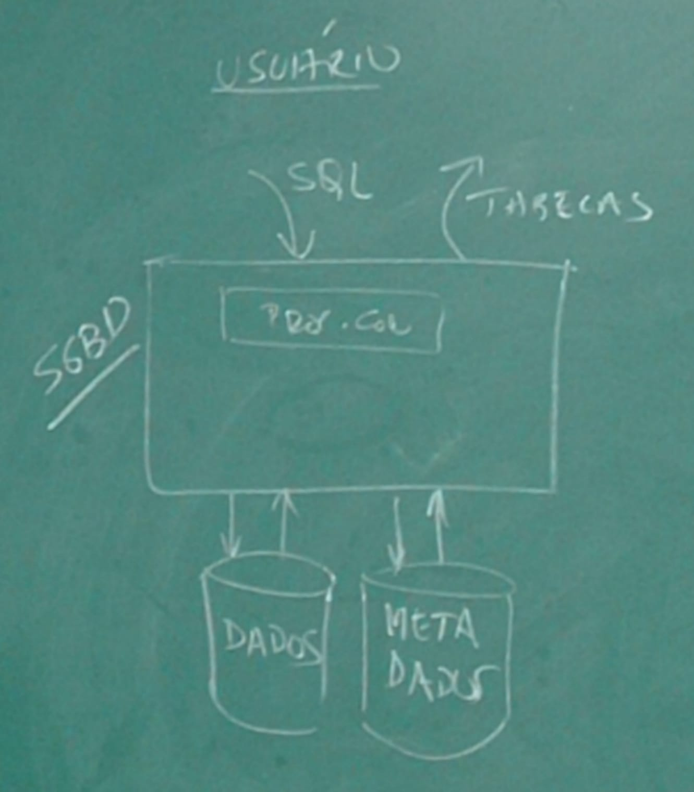
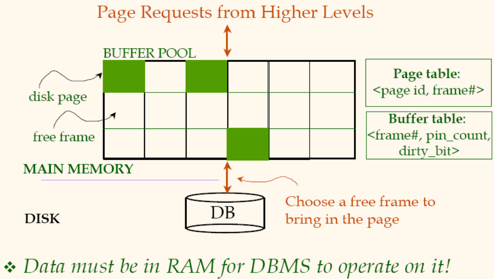
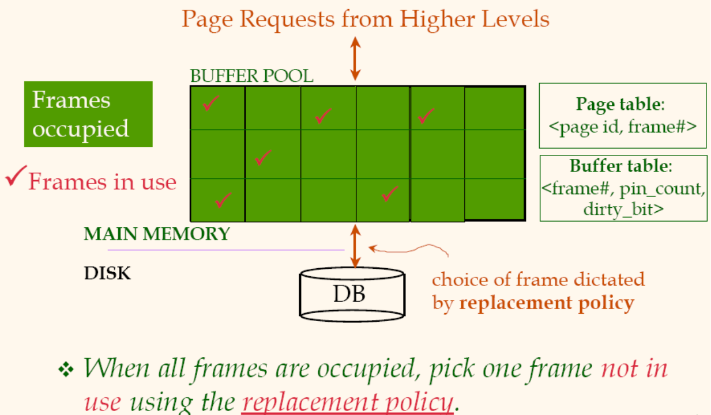

# Gerenciamento de Banco de Dados (GBD)

> Motivação/Justificativa

- BD é essencial para qualquer organização e o conteúdo da disciplina é fundamentl para a Formação Tecnológica na área de Computação e Informática, apresentando técnicas e formalismos essenciais para o desenvolvimento e a atuação do egresso.
- Um SGBD é:
  - Capaz de criar e manipular grandes volumes de dados
  - Exemplo de software complexo que merece ser estudado
- Algoritmos usados na implementação de SGBD usam técnicas de desenvolvimento de software importantes para o Bacharel em Ciência da Computação
- Escolha e configuração de SGBD é um problema prático



## Exercício Discos

- Considere um arquivo contendo um registro para cada habitante do planeta com tamanho igual a 1 setor de um disco de exemplo (use as configuraçõe do HD de seu computador pessoal e faça as suposições de configuração que não conseguir localizar).
- Calcule o tempo de leitura de todo o arquivo nas seguintes situações de Alocação / Acesso:

> Configurações adquiridas com sudo lshw | grep -A 100

``` md
*-disk
    descrição: ATA Disk
    produto: HGST HTS541010A9
    ID físico: 0.0.0
    informações do barramento: scsi@1:0.0.0
    nome lógico: /dev/sdb
    versão: A560
    serial: JB1000131L5ZVB
    tamanho: 931GiB (1TB)
    capacidades: partitioned partitioned:dos
    configuração: ansiversion=5 logicalsectorsize=512 sectorsize=4096 signature=331554e8 (tamanho do setor = 4096 bytes)
  *-volume
      descrição: HPFS/NTFS partition
      ID físico: 1
      informações do barramento: scsi@1:0.0.0,1
      nome lógico: /dev/sdb1
      capacidade: 931GiB
      capacidades: primary
```

> Suposições [(pesquisa na internet)](https://www.amazon.com/HGST-Travelstar-2-5-Inch-0J22413-HTS541010A9E680/dp/B007RE0EQC)

- Tamanho do setor = 4096 bytes
- Setores por trilha = 1000 (valor suposto)
- [Quantidade de habitantes](https://techdoido.com.br/web-stories/quantas-pessoas-existem-no-mundo-em-2022) = 7.800.000.000 pessoas // 7.8 bilhões de pessoas
  - Se cada pessoa ocupa um setor, e um setor tem 4096 bytes, temos 7.800.000.000 * 4096 = 31.948.800.000.000 bytes = 31.200.000.000 GB (Não cabe em meu HD, porém julgaremos que temos um HD de tamanho infinito)
- Tempo médio de seek = 6ms (valor suposto)
- Rotação = 5400RPM
  - Atraso rotacional = 60/5400 = 11,1 ms
  - Atraso rotacional médio = 11,1/2 = 5,6 ms
- Tempo de transferência = 11,1 / 1000 = 0,0111 ms / setor
- Ocupação do arquivo em trilhas = 7.800.000.000 / 1000 = 7.800.000 trilhas

1) sequencial / aleatório

- Salvo de forma sequencial, porém acessado aleatório
- Acesso um setor = 6 + 5,6 + 0,0111 = 11,6111 ms para ler um setor
- Para ler 7.8 bilhões de registros ou setores = 11,6111 \* 7.800.000.000 = 90.566.580.000 ms =~ 3 anos (90.566.580s / 31.536.000)

2) sequencial / sequencial e

- Salvo de forma sequencial, porém acesso sequencial
- Tempo de leitura de uma trilha: 6 + 5,6 + 11,1 = 22,7ms
- Tempo de leitura de 7.800.000 trilhas: 22,7 * 7.800.000 = 177.060.000 ms =~ 50 horas =~ 2 dias

3) ótima / paralelo ?

- Salvo de forma ótima, porém com acesso paralelo

## Armazenamento de Dados - Gerência de Bufferpool

Motivação

- O banco de dados não cabe na memória principal
- Protocolos de Recuperação de Falhas e de Controle de Transação (Durabilidade)





Conceitos

- Frame ou Slot: área na memória RAM que será/está ocupada por uma página do disco
  - pin_count: número de requisições no frame
  - dirty_bit: indica se o frame foi modificado(1) ou se contem uma imagem que está no disco(0)

### Processamento de requisição

``` plsql
SE (EXISTE slot com a página solicitada?)
  INCREMENTA pin_count;
  RETORNA endereço do slot;
SENÃOSE (EXISTE slot com pin_count == 0?)
  ESCOLHE um slot com pin_count == 0
  (Usando uma política de substituição);
SENÃO (WAIT e RETORNA EM (2)) ou (ABORTA);
SE (dirty_bit do slot escolhido == 1?)
  GRAVA slot na página correspondente no disco;
LÊ página solicitada e GRAVA no slot escolhido
INICIA pin_count do slot com 1
RETORNA endereço do slot escolhido;
```

### Fim da transação e Pre-fetching

#### Fim da transação

- Os pin_count de todos os slots em uso pela transação serão decrementados quando a transação termina
- A transação pode liberar slots durante seu processamento

#### Pré-fetching

- Requisições de páginas podem ser previstos por meio de pre-fetching

### Políticas de Substituição

Como escolher slots com pin_count == 0 (?)

- Fila circular ou aleatória: sem overhead de estrutura, pos basta um contador que é incrementado na fila circular ou é aleatório
- Fifo: fila por tempo de entrada na memória
- LRU (Least Recently Used): o slot entra em uma fila quando seu pin_count é decrementado para 0
- MRU (Most Recently Used): o slot entra em uma pilha quando pin_count é decrementado para 0

### Comparação MRU x LRU

- Escolha depende do padrão de uso
- Repetidas varreduras sequenciais favorecem MRU, exemplo

``` plsql
JUNÇÃOs.k=r.k (R, S) : Algoritmo de Laços Aninhados Paginado
PARA CADA pr em R
  PARA CADA ps em S
    PARA CADA r em pr {
      PARA CADA s em ps {
        SE s.k = r.k imprima (r + s)
      }
    }
    Liberre o slot de ps;
  }
  Libere o slot de pr;
}
Simular MRU e LRU e verificar a inundação sequencial ocorrida em LRU.
```

### SGBD x SO

- SO usa políticas de paginação para memória virtual
- Mas SGBD pode
  - Prever padrões de uso
  - Necessita de controle para recuperação de falhar
  - Portabilidade
- Gerência pode ser compartilhada

## Formatação de registros e páginas

- Posição são calculados usando um endereço base e deslocando com base no tamanho dos tipos
  - B + L1(campo 1) + L2(campo 2)

- Página com registro de tamanho fixo, pode ser:
  - PACKED: área contígua de slots de dados e área contígua de slots vazios, com um contador de quantidades de slots de dados
    - Vantagem: mais fácil uso, melhor para leitura em maior quantidade
    - Desvantagem: shift necessário caso altere, alterando vários rid de registros
  - UNPACKED: área não contígua, com um mapeamento de slots utilizando bitmap
    - Vantagem: não realiza shift
    - Desvantagem: gera espaços pequenos vazios
- Páginas com registros de tamanho variável
  - a alternativa é utilizar delimitadores, ponteiros, ou um par com (tamanho, conteúdo) dentro de cada registro

## Abordagem comparativa

### Comparação e Desempenho de Arquivos

- Tipos de arquivos e indices
- Operações
- Modelo de Custo
- Custos de cada operação/alternativ
- Tabela comparativa

### Tipos de organização de Arquivo

- Arquivo não ordenado (heap file)
- Arquivo ordenado (sorted file)
- Arquivo indexado por Hash
- Arquivo indexado por Arvore B+
- Heap File + Indice não agrupado por Arvore B+
  - Alternativa 2 (k+rid)
- Heap File + Indice baseado em Hash Alternativa 2

### Comparação de Desempenho - Operações

> Operações em Arquivos e Indices

- Scan (varredura): ler todos os registros de um arquivo
  - Carregar paginas de arquivo no Buffer Pool
  - Bucar registros em cada pagina
- Busca Igual