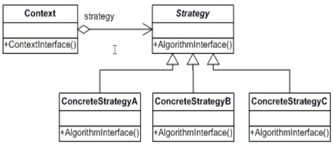
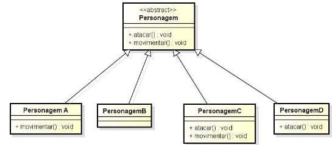
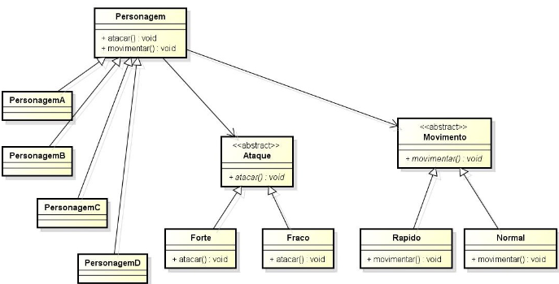
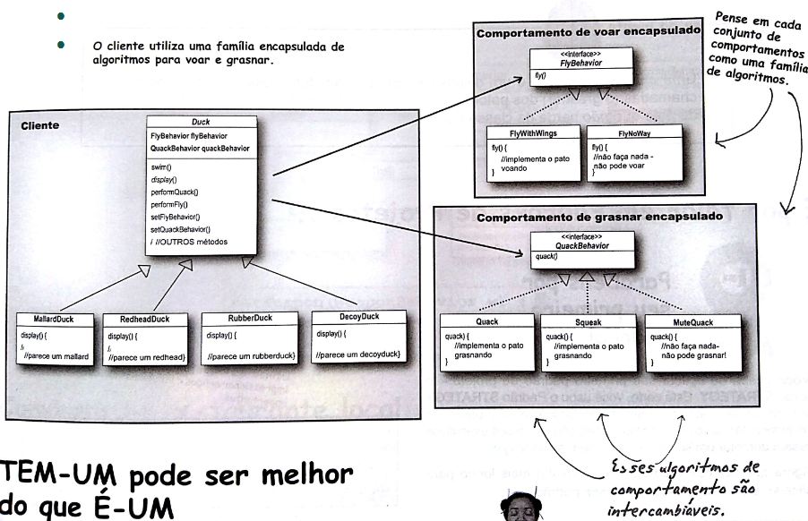
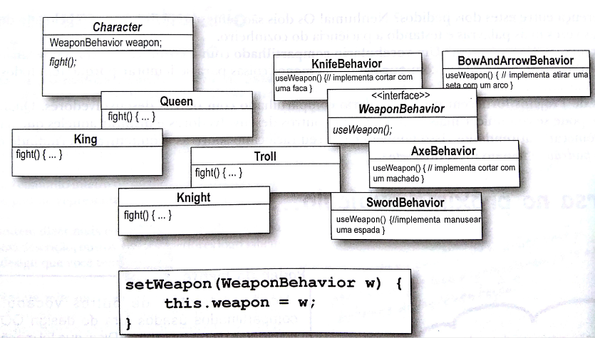

# Programação Orientada a Objetos 2

## Introdução (Padrões de projeto)

- Um padrão de projeto (design pattern)
  - é uma solução geral reutilizável para um problema que ocorre com frequência dentro de um determinado contexto no projeto de software

- Padrões são boas práticas formalizadas que o programador pode usra para resolver problemas comuns qunado projetar uma aplicação ou sistema
- Desta forma reutiliza-se a experiência de outros desenvolvedores que enfrentaram problemas semelhantes
  - Alto nível de reuso

- Os padrões de projeto:
  - facilitam a reutilização de soluções de desenho - isto é, soluções na fase de projeto de software - e
  - estabelecem um vocabulário comum de desenho, facilitando comunicação, documentação e aprendizado dos sistemas de software

## Padrões de Projeto

### Padrão Strategy

- As vezes, apenas heração não resolve, criando soluções inflexíveis e difíceis de manter
- Exemplo:
  - Uma classe A implementa dois métodos, m1(a1) e m2(a2)
  - As seguinte sub-classes de A implementam os métodos:
    - B [m1(a1) e m2(a2)]
    - C [m1(a1) e m2(a3)]
    - D [m1(a4) e m2(a2)]
    - E [m1(a4) e m2(a3)]

---

- Neste caso, é importante identificar os aspectos que variam e separá-los do que é comum à todas as sub-classes
- E usar composição ao invés da herança
  - Qual o aspecto que varia? Quantas variações temos?

---

O padrão strategy...

- Permite definir famílias de comportamentos, que podem ser (re)utilizados de forma intercambiável
- Permite que o algoritmo varie independentemente dos clientes que o usam
- Cada comportamento é encapsulado em uma classe
  - Encapsulamento + Modularização = Manutenibilidade + Reusabilidade

---

- É útil quando se tem-se operações comuns a uma série de sub-classes, mas não é possível o uso de herança de forma eficiente
  - Desta forma, o padrão strategy permite configurar em tempo de execução cada subclasse com os comportamentos adequados

---

O padrão Strategy nos conduz a seguinte orientação:

1. Programe sempre para interfaces (abstrações)
2. Dê preferência a composição ao invés de herança

- Desta forma consegue-se o reuso e intercâmbio de comportamentos entre diversas classes, facilitando a expansão, manutenção e reuso.

---

- Benefícios
  - Alto nível de reuso
  - Facilidade de expansão sem modificar o que está pronto (aberto para extensão, fechado para modificação)
  - Alto nível de Flexibilidade

---

Formalizando o padrão...

Esse padrão tem como elementos participantes

- **Context**, que tem seu "comportamento" ou parte dele definido pelo algoritmo implementado por uma Strategy
- **Strategy**, que define a interface comum para todos os comportamentos
- **ConcreteStrategy**, que implementa o comportamento definido pela interface Strategy

---

- Diagrama de Classes



---

#### Exemplo

- Diferentes personagens de um jogo que exibem diferentes ações e comportamentos
- Os personagens A e B implementam o mesmo ataque (forte). Mas os personagens C e D implementam outro tipo de ataque (fraco)
- Além disto, os personagens A e C implementam o mesmo tipo de movimentação (rápido), e os personagens B e D possuem movimentação normal
- Neste caso, só herança não resolve, pois seria necessário replicar a mesma forma de ataque/ movimentação

---

Solução tradicional com uso de herança

``` java
public abstract class Personagem {
  public void atacar() {
    // implementa ataque forte
  }

  public void movimentar() {
    // implementa movimentação normal
  }
}
```

``` java
public class PersonagemA extends Personagem {
  public void movimentar() {
    // implementa movimentação rápida
  }
}

public class PersonagemB extends Personagem {
  // ...
}

public class PersonagemC extends Personagem {
  public void atacar() {
    // implementa ataque fraco
  }

  public void movimentar() {
    // implementa movimentação rápida
  }
}

public class PersonagemD extends Personagem {
  public void atacar() {
    // implementa ataque fraco
  }
}
```

---



---

- Aplicando o Padrão Strategy para resolver o problema

``` java
// Strategy (estratégias abstratos)

public abstract class Ataque {
  public abstract void atacar();
}

public abstract class Movimento {
  public abstract void movimentar();
}
```

---

``` java
// ConcreteStrategies

public class Forte extends Ataque {
  public void atacar() {
    // implementa ataque forte
  };
}

public class Fraco extends Ataque {
  public void ataque() {
    // implementa ataque fraco
  };
}

public class Rapido extends Movimento {
  public void movimentar() {
    // implementa movimentação rápido
  }
}

public class Normal extends Movimento {
  public void movimentar() {
    // implementa movimentação normal
  }
}
```

---

``` java
// Context

public abstract class Personagem {
  private Ataque a;
  private Movimento m;

  public void setAtaque(Ataque a) {
    this.a = a;
  }

  public void setMovimento(Movimento m) {
    this.m = m;
  }

  public void atacar() {
    a.atacar();
  }

  public void movimentar() {
    m.movimentar();
  }
}
```

---

``` java
// ConcreteContext

public class PersonagemA extends Personagem {
  public PersonagemA() {
    setAtaque(new Forte());
    setMovimento(new Rapido());
  }
}

public class PersonagemB extends Personagem {
  public PersonagemB() {
    setAtaque(new Forte());
    setMovimento(new Normal());
  }
}

public class PersonagemC extends Personagem {
  public PersonagemC(){
    setAtaque(new Fraco());
    setMovimento(new Rapido());
  }
}

public class PersonagemD extends Personagem {
  public PersonagemC() {
    setAtaque(new Fraco());
    setMovimento(new Normal());
  }
}

```

- Neste caso, o construtor do personagem concreto é responsável por definir na instanciação seus comportamentos

---

- Testando...

``` java
public static void main() {
  PersonagemA p = new PersonagemA();
  p.atacar();
  p.movimentar();
  // ...
  p.setMovimento(new Normal());
  p.movimentar();
  // ...
  p.setAtaque(new Fraco());
  p.atacar();
  //...
  // o comportamento do objeto é alterado em tempo de execução, como se ele tivesse mudado de classe
}
```

---



---

- Alto nível de reuso:
  - É fácil implementar novos personagens utilizando os comportamentos disponíveis, e é fácil implementar e utilizar novos comportamentos
- Facilidade de expansão sem modificar o que está pronto:
  - Implementar novos personagens que utilizam novos tipo de ataque
  - Note que o código pronto não é mexido na expansão
- Alto nível de Flexibilidade:
  - Implementar um novo personagem que inicia com determinado tipo de comportamento, mas em determinado momento pode ter seu comportamento alterado em tempo de execução
- Aberto para extensão, fechado para modificação

---

- Deve-se produzir uma família de classes para cada comportamento que varia
- Deve-se ter uma estrutura de herança em que cada subclasse implementa uma variação do algoritmo
- Possibilita que um algoritmo seja substituído por outro em tempo de execução
- Possibilita alto nível de reuso (vários contexts utilizando a mesma família de estratégias)

---

#### Exemplo (Freeman, Use a cabeça - Padrões de Projeto)



---

#### Exercídio Padrão Strategy

- A seguir é apresentado um conjunto de classes e interfaces para um jogo de aventura
- Existem classes que implementam comportamento das armas que podem ser utilizadas pro estes personagens
- Cada personagem pode utilizar uma arma de cada vez, mas pode alterar as armas a qualquer momento durante o jogo

- Pede-se
  - Utilizando estas classes e a interface disponibilizada, utilize o padrão strategy para projetar o jogo
  - Implemente em java (obs. Simule a implementação dos comportamentos utilizando saídas de texto)



---

#### Resumindo

- Deve-ser perceber o que varia nas subclasses e encapsular à parte (famílias de comportamentos reutilizáveis).
- Princípios de projeto:
  - Identifique os aspectos quer variam e separe-os do que permanece igual
  - Programe para um supertipo
  - Dar prioridade a composição
