# Programação Orientada a Objetos 2

## Introdução (Padrões de projeto)

- Um padrão de projeto (design pattern)
  - é uma solução geral reutilizável para um problema que ocorre com frequência dentro de um determinado contexto no projeto de software

- Padrões são boas práticas formalizadas que o programador pode usra para resolver problemas comuns qunado projetar uma aplicação ou sistema
- Desta forma reutiliza-se a experiência de outros desenvolvedores que enfrentaram problemas semelhantes
  - Alto nível de reuso

- Os padrões de projeto:
  - facilitam a reutilização de soluções de desenho - isto é, soluções na fase de projeto de software - e
  - estabelecem um vocabulário comum de desenho, facilitando comunicação, documentação e aprendizado dos sistemas de software

## Padrões de Projeto

### Padrão Strategy

- As vezes, apenas heração não resolve, criando soluções inflexíveis e difíceis de manter
- Exemplo:
  - Uma classe A implementa dois métodos, m1(a1) e m2(a2)
  - As seguinte sub-classes de A implementam os métodos:
    - B [m1(a1) e m2(a2)]
    - C [m1(a1) e m2(a3)]
    - D [m1(a4) e m2(a2)]
    - E [m1(a4) e m2(a3)]

---

- Neste caso, é importante identificar os aspectos que variam e separá-los do que é comum à todas as sub-classes
- E usar composição ao invés da herança
  - Qual o aspecto que varia? Quantas variações temos?

---

O padrão strategy...

- Permite definir famílias de comportamentos, que podem ser (re)utilizados de forma intercambiável
- Permite que o algoritmo varie independentemente dos clientes que o usam
- Cada comportamento é encapsulado em uma classe
  - Encapsulamento + Modularização = Manutenibilidade + Reusabilidade

---

- É útil quando se tem-se operações comuns a uma série de sub-classes, mas não é possível o uso de herança de forma eficiente
  - Desta forma, o padrão strategy permite configurar em tempo de execução cada subclasse com os comportamentos adequados

---

O padrão Strategy nos conduz a seguinte orientação:

1. Programe sempre para interfaces (abstrações)
2. Dê preferência a composição ao invés de herança

- Desta forma consegue-se o reuso e intercâmbio de comportamentos entre diversas classes, facilitando a expansão, manutenção e reuso.

---

- Benefícios
  - Alto nível de reuso
  - Facilidade de expansão sem modificar o que está pronto (aberto para extensão, fechado para modificação)
  - Alto nível de Flexibilidade

---

Formalizando o padrão...

Esse padrão tem como elementos participantes

- **Context**, que tem seu "comportamento" ou parte dele definido pelo algoritmo implementado por uma Strategy
- **Strategy**, que define a interface comum para todos os comportamentos
- **ConcreteStrategy**, que implementa o comportamento definido pela interface Strategy

---

- Diagrama de Classes


---

#### Exemplo

- Diferentes personagens de um jogo que exibem diferentes ações e comportamentos
- Os personagens A e B implementam o mesmo ataque (forte). Mas os personagens C e D implementam outro tipo de ataque (fraco)
- Além disto, os personagens A e C implementam o mesmo tipo de movimentação (rápido), e os personagens B e D possuem movimentação normal
- Neste caso, só herança não resolve, pois seria necessário replicar a mesma forma de ataque/ movimentação

---

Solução tradicional com uso de herança

``` java
public abstract class Personagem {
  public void atacar() {
    // implementa ataque forte
  }

  public void movimentar() {
    // implementa movimentação normal
  }
}
```

``` java
public class PersonagemA extends Personagem {
  public void movimentar() {
    // implementa movimentação rápida
  }
}

public class PersonagemB extends Personagem {
  // ...
}

public class PersonagemC extends Personagem {
  public void atacar() {
    // implementa ataque fraco
  }

  public void movimentar() {
    // implementa movimentação rápida
  }
}

public class PersonagemD extends Personagem {
  public void atacar() {
    // implementa ataque fraco
  }
}
```

---


---

- Aplicando o Padrão Strategy para resolver o problema

``` java
// Strategy (estratégias abstratos)

public abstract class Ataque {
  public abstract void atacar();
}

public abstract class Movimento {
  public abstract void movimentar();
}
```

---

``` java
// ConcreteStrategies

public class Forte extends Ataque {
  public void atacar() {
    // implementa ataque forte
  };
}

public class Fraco extends Ataque {
  public void ataque() {
    // implementa ataque fraco
  };
}

public class Rapido extends Movimento {
  public void movimentar() {
    // implementa movimentação rápido
  }
}

public class Normal extends Movimento {
  public void movimentar() {
    // implementa movimentação normal
  }
}
```

---

``` java
// Context

public abstract class Personagem {
  private Ataque a;
  private Movimento m;

  public void setAtaque(Ataque a) {
    this.a = a;
  }

  public void setMovimento(Movimento m) {
    this.m = m;
  }

  public void atacar() {
    a.atacar();
  }

  public void movimentar() {
    m.movimentar();
  }
}
```

---

``` java
// ConcreteContext

public class PersonagemA extends Personagem {
  public PersonagemA() {
    setAtaque(new Forte());
    setMovimento(new Rapido());
  }
}

public class PersonagemB extends Personagem {
  public PersonagemB() {
    setAtaque(new Forte());
    setMovimento(new Normal());
  }
}

public class PersonagemC extends Personagem {
  public PersonagemC(){
    setAtaque(new Fraco());
    setMovimento(new Rapido());
  }
}

public class PersonagemD extends Personagem {
  public PersonagemC() {
    setAtaque(new Fraco());
    setMovimento(new Normal());
  }
}

```

- Neste caso, o construtor do personagem concreto é responsável por definir na instanciação seus comportamentos

---

- Testando...

``` java
public static void main() {
  PersonagemA p = new PersonagemA();
  p.atacar();
  p.movimentar();
  // ...
  p.setMovimento(new Normal());
  p.movimentar();
  // ...
  p.setAtaque(new Fraco());
  p.atacar();
  //...
  // o comportamento do objeto é alterado em tempo de execução, como se ele tivesse mudado de classe
}
```

---


---

- Alto nível de reuso:
  - É fácil implementar novos personagens utilizando os comportamentos disponíveis, e é fácil implementar e utilizar novos comportamentos
- Facilidade de expansão sem modificar o que está pronto:
  - Implementar novos personagens que utilizam novos tipo de ataque
  - Note que o código pronto não é mexido na expansão
- Alto nível de Flexibilidade:
  - Implementar um novo personagem que inicia com determinado tipo de comportamento, mas em determinado momento pode ter seu comportamento alterado em tempo de execução
- Aberto para extensão, fechado para modificação

---

- Deve-se produzir uma família de classes para cada comportamento que varia
- Deve-se ter uma estrutura de herança em que cada subclasse implementa uma variação do algoritmo
- Possibilita que um algoritmo seja substituído por outro em tempo de execução
- Possibilita alto nível de reuso (vários contexts utilizando a mesma família de estratégias)

---

#### Exemplo (Freeman, Use a cabeça - Padrões de Projeto)


---

#### Exercício Padrão Strategy

- A seguir é apresentado um conjunto de classes e interfaces para um jogo de aventura
- Existem classes que implementam comportamento das armas que podem ser utilizadas pro estes personagens
- Cada personagem pode utilizar uma arma de cada vez, mas pode alterar as armas a qualquer momento durante o jogo

- Pede-se
  - Utilizando estas classes e a interface disponibilizada, utilize o padrão strategy para projetar o jogo
  - Implemente em java (obs. Simule a implementação dos comportamentos utilizando saídas de texto)


---

#### Resumindo

- Deve-ser perceber o que varia nas subclasses e encapsular à parte (famílias de comportamentos reutilizáveis).
- Princípios de projeto:
  - Identifique os aspectos quer variam e separe-os do que permanece igual
  - Programe para um supertipo
  - Dar prioridade a composição

### State

- A intenção do padrão:
  - "Permite a um objeto alterar seu comportamentoi quando seu estado interno muda. O objeto permanecerá ter mudado de classe"

---

- Atualização automática do estado de um projeto
- Alteração de comportamento quando o estado interno muda
- Torna o comportamento dependente do estado

---

- Especificar
  - os diferentes estados que um objeto pode assumir
  - transições de estado
  - definição de uma máquina de estados orientada a objetos

---

- Adição de novos estados e comportamentos, através da edição de novas classes
- Cria-se uma objeto para cada estado possível

---

- O Objetivo do padrão:
  - Permitir que um objeto tenha seu comportamento alterado de acordo com o estado interno que se encontra em um momento dado

---

- Participantes:
  - Context
    - Define uma interface com o cliente
    - Mantém uma instância de um ConcreteState que define o seu estado atual
  - State
    - Define uma interface para a criação de estados concretos
  - Concrete State
    - Implementa o comportamento associado a uma estado particular de Context

---

- Diagrama de classes

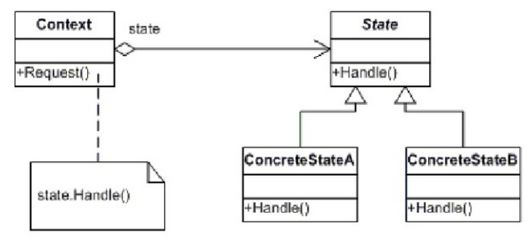

---

- Exemplo

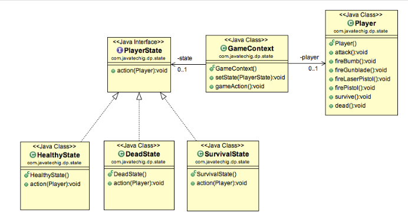
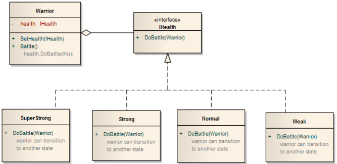
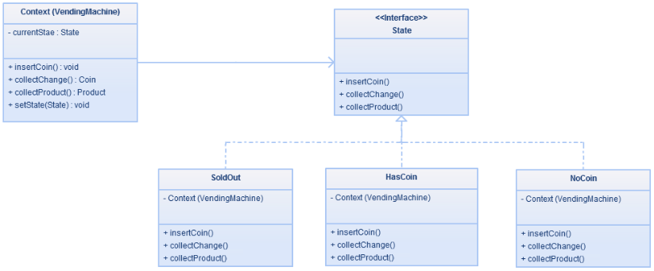
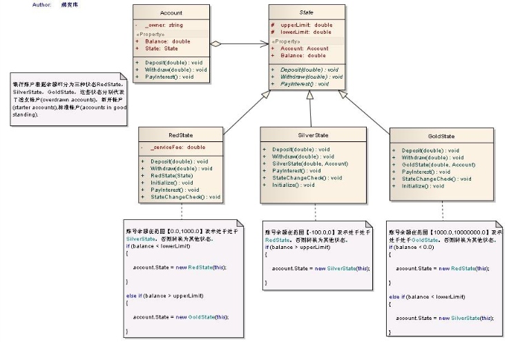

---

Exemplo de implementação:

Controle de estado de contas bancárias:

- Se a conta estiver com saldo entre 0 e 1000 = estado prata. Neste caso, o cliente deve pagar uma taxa por cada saque que realizar
- Se a conta estiver com saldo maior que 1000 = estado ouro. Neste caso, o cliente não paga taxa de saque e ainda ganha um rendimento imediado em cada depósito que realizar
- Se a conta estiver com saldo negativo = estado vermelho. Neste caso, não é permitido a realização de saques. Apenas depósitos.

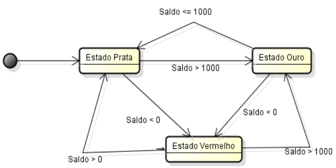

---

#### Implementação

``` java
// "context"
class Conta {
  private Estado estado;
  private String numero;
  private double saldo;

  // Construtor
  public Conta(String numero) {
    // As novas contas são por default 'Prata'
    this.numero = numero;
    this.estado = new EstadoPrata(this);
    this.saldo = 0.0;
  }

  // getters & setters
  public void depositar(double quantia) {
    estado.depositar(quantia);
    System.out.println("Depósito---" + quantia);
    System.out.println("Saldo = " + this.getSaldo());
    System.out.println("Estado = " + this.estado.getClass().getName());
  }

  public void sacar(double quantia) {
    estado.sacar(quantia);
    System.out.println("Saque---" + quantia);
    System.out.println("Saldo = " + this.getSaldo());
    System.out.println("Estado = " + this.estado.getClass().getName());
  }
} // fim da classe conta
```

```java
//state
public abstract class Estado {
  private Conta conta;
  private double limiteInferior;
  private double limiteSuperior;

  public Estado(Conta conta) {
    this.conta = conta;
    setLimites();
  }

  protected abstract void setLimites();

  //getters & setters
  public void depositar(double quantia) {
    this.conta.setSaldo(this.conta.getSaldo() + quantia);
    this.verificarAlteracaoEstado();

  }

  public void sacar(double quantia) {
    this.conta.setSaldo(this.conta.getSaldo() - quantia);
    this.verificarAlteracaoEstado();
  }

  protected abstract void verificarAlteracaoEstado();
} // fim da classe estado
```

```java
// "ConcreteState"
class EstadoPrata extends Estado {
  public EstadoPrato(Conta conta) {
    super(conta);
  }

  // comportamento particular deste estado
  public void setLimites() {
    this.setLimiteInferior(0.0);
    this.setLimiteSuperior(1000.0);
  }

  // comportamento particular deste estado: cliente paga taxa a cada saque realizado

  public void sacar(double quantia) {
    this.getConta().setSaldo(this.getConta().getSaldo() - quantia - 5.00);
    this.verificarAlteracaoEstado();
  }

  // comportamento particular deste estado: cliente paga taxa a cada saque realizado
  public void verificarAlteracaoEstado() {
    if(this.getConta().getSaldo() < this.getLimiteInferior())
      this.getConta().setEstado(new EstadoVermelho(this.getConta()));
    else if(this.getConta().getSaldo() > this.getLimiteSuperior()) 
      this.getConta().setEstado(new EstadoOuro(this.getConta()));
  }
}
```

```java
// "concrete state"
class EstadoVermelho extends Estado {
  public EstadoVermelho(Conta conta) {
    super(conta);
  }

  //comportamento particular deste estado
  public void setLimites() {
    setLimiteInferior(-100.0);
    setLimiteSuperior(0.0);
  }

  // comportamento particular deste estado: não permite saque.
  public void sacar(double quantia) {
    System.out.println("Não existem fundos disponíveis para saque!");
  } 

  public void verificarAlteracaoEstado() {
    if(this.getConta().getSaldo() > this.getLimiteSuperior()) {
      this.getConta().setEstado(new EstadoPrata(this.getConta()));
      this.getConta().getEstado().verificarAlteracaoEstado();
    }
  }
} // fim da classe Estado Vermelho
```

```java
// "concrete state"
class EstadoOuro extends Estado {
  public EstadoVermelho(Conta conta) {
    super(conta);
  }

  //comportamento particular deste estado
  public void setLimites() {
    setLimiteInferior(1000.0);
    setLimiteSuperior(10000000.0);
  }

  // comportamento particular deste estado: não permite saque.
  public void sacar(double quantia) {
    System.out.println("Não existem fundos disponíveis para saque!");
  } 

  public void verificarAlteracaoEstado() {
    if(this.getConta().getSaldo() > this.getLimiteSuperior()) {
      this.getConta().setEstado(new EstadoPrata(this.getConta()));
      this.getConta().getEstado().verificarAlteracaoEstado();
    }
  }
} // fim da classe Estado Ouro
```

```java
// aplicação cliente
public class Client {
  public static void main(String[] args) {
    // abri nova conta
    Conta conta = new Conta("2923903");

    // Efetuar transações financeiras
    conta.depositar(500.0);
    conta.depositar(300.0);
    conta.depositar(550.0);
    conta.depositar(550.0);
    conta.sacar(2000.00);
    conta.sacar(1100.00);
  }
}
```


- [Exemplo mário](https://brizeno.wordpress.com/category/padroes-de-projeto/state/)
  
#### Observações

- Isola o comportamento de um objeto, que depende de seu estado interno
- A classe Context transfere aos estados uma responsabilidade
- A lógica de transição de estados é implementada pelos próprios estados, desobrigando o contexto de conhecê-la
- Esta lógica é dividida entre vários estados
- Cada estado encapsula parte dessa lógica
- Elimina código complicado e extenso de decisão
- Com isto fica simples a inserção de novos estados e transições

---

- O padrão elimina a necessidade de condicionais complexos e que frequentemente serão repetidos.
- Com o padrão cada "ramo" do condicional acaba se tornando um objeto
- Trata-se cada estado como se fosse um objeto de verdade, distribuindo a complexidade dos condicionais
- Desta forma, pode-se implementar facilmente qualquer tipo de máquina de estados, como os autômatos

### Padrão Chain Responsability

Objetivo: Evitar o acoplamento do remetente de uma solicitação ao receptor fornecendo uma cadeia de objetos para tratar uma solicitação

- O objeto que fez a solicitação não tem conhecimento explícito de quem a tratará - essa solicitação é dita ter um receptor implícito
- Representa um encadeamento de objetos receptores para o processamento de uma série de solicitações diferentes
- Esses objetos receptores passam a solicitação ao longo da cadeia até que um ou vários objetos a traem

---

- Cada objeto receptor possui uma lógica descrevendo os tipos de solicitação que é capaz de processar e como passar adiante aquelas que requeiram processamento por outros receptores

---

- Dessa forma, fornece um aclopamento mais fraco por evitar a associação explícita  do remetente da um receptor concreto, permitindo a mais de um objeto a oportunidade de tratar a solicitação

---

- É montada uma lista simplesmente encadeada de objetos que podem servir um determinado pedido
- Em vez de acoplar o cliente a um objeto específico para a execução de um de um determinado método, o pedido é enviado à cadeia.
- O pedido vai passando pelos objetos até encontrar o mais adequado para satizfazê-lo
- Cada objeto pode realizar uma parte do serviço e passar o pedido ao objeto seguinte na cadeia (soluções distribuídas)

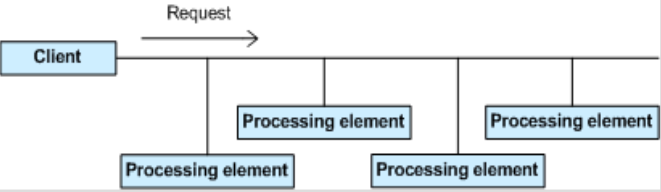

---

#### Quando usar estre padrão de projeto ??

- quando mais de um objeto puder lidar com uma solicitação
- quando o manipulador (handler) não é conhecido antecipamente
- quando o grupo de objetos que podem lidar com a solicitação deve ser especificado e modificado de forma dinâmico, em tempo de execução
- quando se deseja evitar o acoplamento do remetende de uma solicitação ao seu destinatário

---

#### Vantagens

- Permite determinar quem será o objeto que irá tratar a requisição dinamicamente, durante a execução
- A cadeia pode ser configurado em tempo de execução
- Evita o uso de estruturas condicionais para decidir qual objeto deve tratar a requisição
- O acoplamento é reduzido, dando ainda flexibilidade adicional na atribuição de responsabilidades a objetos

#### Participantes

As classes que participam do padrão são:

Handler

- Define uma interface para tratar os pedidos
- Implementa a ligação ao sucessor

ConcreteHandler

- Trata os pedidos pelos quais é responsável
- Se o ConcreteHandler pode tratar o pedido, trata-o; caso contrário envia-o ao seu sucessor

Client

- Inicia o pedido a um objeto ConcreteHandler na cadeia

#### Diagram de classes

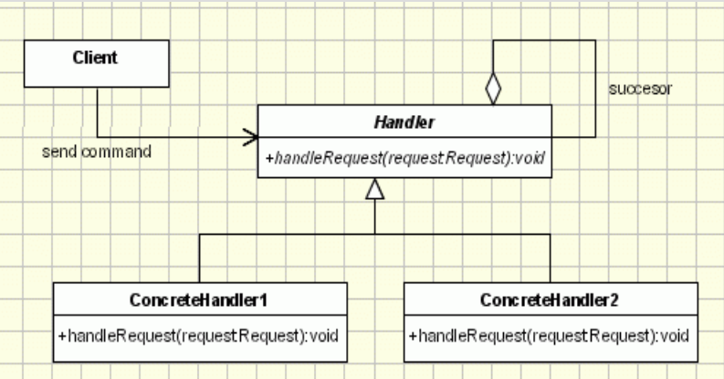

---

#### Exemplo Chain

Utilizando este padrão de projeto, crie um caixa eletrônico capaz manipular requisições de saque corretamente, sempre considerando o menor número de notas possível.

- Por exemplo, em uma solicitação de saque no valor de R$475, o caixa deve entregar:
- 4 notas de R$100
- 1 nota de R$50
- 1 nota de R$20
- 1 nota de R$5

Para isto, crie manipuladores para contar a quantidade de cada tipo de nota. Ao terminar sua contagem, cada manipulador deve passar ao próximo o cálculo da quantidade de notas relativas ao montante restante. Cada manipulador deve exibir a sua contagem.

``` java
// handler
public abstract class Saque {
  private Saque sucessor;

  public void setSucessor(Saque sucessor) {
    this.sucessor = sucessor;
  }

  public Saque getSucessor() {
    return this.sucessor;
  }

  public abstract void processaSaque(int valor);
}
```

``` java
//ConcreteHandler
public class Saque100 extends Saque {
  public void processaSaque(int valor) {
    int notas = valor / 100;
    int resto = valor % 100;

    if(notas != 0)
      System.out.println("Quantidade de notas de 100: " + notas);
    if(resto !=0 && getSucessor() != null) {
      getSucessor().processaSaque(resto);
    }
  }
}

```

``` java
//ConcreteHandler
public class Saque50 extends Saque {
  public void processaSaque(int valor) {
    int notas = valor / 50;
    int resto = valor % 50;

    if(notas != 0) {
      System.out.println("Quantidade de notas de 50: " + notas);
    }

    if(resto != 0 && this.getSucessor() != null) 
      getSucessor().processaSaque(resto);
  }
}
```

``` java
//ConcreteHandler
public class Saque20 extends Saque {
  public void processaSaque(int valor) {
    int notas = valor / 20;
    int resto = valor % 20;

    if(notas != 0) {
      System.out.println("Quantidade de notas de 20: " + notas);
    }

    if(resto != 0 && this.getSucessor() != null) 
      getSucessor().processaSaque(resto);
  }
}
```

``` java
//ConcreteHandler
public class Saque10 extends Saque {
  public void processaSaque(int valor) {
    int notas = valor / 10;
    int resto = valor % 10;

    if(notas != 0) {
      System.out.println("Quantidade de notas de 10: " + notas);
    }

    if(resto != 0 && this.getSucessor() != null) 
      getSucessor().processaSaque(resto);
  }
}
```

``` java
//ConcreteHandler
public class Saque05 extends Saque {
  public void processaSaque(int valor) {
    int notas = valor / 5;
    int resto = valor % 5;

    if(notas != 0) {
      System.out.println("Quantidade de notas de 5: " + notas);
    }

    if(resto != 0 && this.getSucessor() != null) 
      System.out.println("Não existem notas de " + resto);
  }
}
```

``` java
// aplicação cliente
public class CaixaEletronico {
  public static void main(String args[]) {
    // instanciar objetos da cadeia
    Saque saque100 = new Saque100();
    Saque saque50 = new Saque50();
    Saque saque20 = new Saque20();
    Saque saque10 = new Saque10();
    Saque saque5 = new Saque05(); // final da cadeia

    // criar cadeia - encadear os objetos
    saque100.setSucessor(saque50);
    saque50.setSucessor(saque20);
    saque20.setSucessor(saque10);
    saque10.setSucessor(saque5);
    saque5.setSucessor(null);

    //processar saques
    saque100.processaSaque(575);
    saque100.processaSaque(175);
    saque100.processaSaque(120);
    saque100.processaSaque(155);
    saque100.processaSaque(960);
  }
}
```

#### Vantagens Chain

- Acoplamento reduzido: Não se sabe a classe ou estrutura interna dos participantes
- Delegação de responsabilidade: Flexível, em tempo de execução

---

Observação: Com o encadeamento dos handlers desta forma (ordenado, do maior para o menor) garantimos que a menor quantidade de notas possível seja fornecida


### Padrão Decorator

Problema:

- Em algumas situações é necessário adicionar responsabilidades à objetos específicos, e não a toda a classe
- O padrão de projeto Decorator resolve o problema, permitindo que tais responsabilidades sejam adicionadas individualmente, em tempo de execução
- Ao contrário da herança que aplica funcionalidades a todos os objetos da classe, o padrão decorador permite aplicar funcionalidades apenas a um objeto específico

---

- O padrão Decorator permite estender as funcionalidades de um objeto em tempo de execução usando uma forma de composição de objetos
- A ideia central é modificar o comportamento de um método em um objeto, adicionando-lhe processamento adicional

---

- Adiciona responsabilidades de forma dinâmica a um objeto
- Os Decoradores fornecem uma alternativa flexível à herança para estender funcionalidades

---

> [GAMMA]

- Evita classes sobrecarregadas de características na parte superior da hierarquia
- Oferece uma abordagem do tipo 'use quando for necessário'
- Pode-se definir uma classe simples e acrescentar funcionalidade de modo incremental

---

- A funcionalidade necessária pode ser composta a partir de peças simples
- É fácil definir novas espécies de decorators idependente das classes de objetos que eles estendem
- Desta forma uma aplicação não precisa incorrer no custo de características e recursos que usa

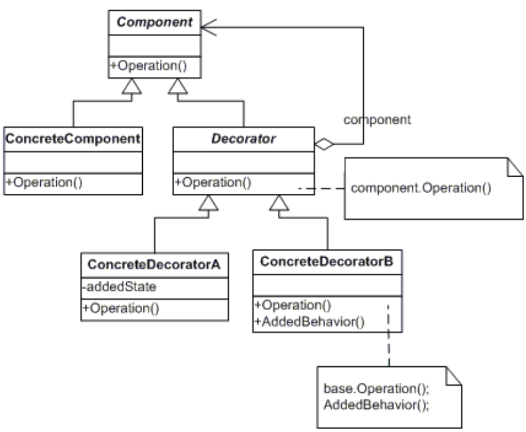

#### Participantes Decorator

As classes e/ou objetos que participam do padrão são:

Component

- Define a interface dos objetos que podem ter responsabilidades adicionadas de forma dinâmica

ConcreteComponent

- Define um objeto ao qual mais responsabilidades podem ser adicionadas

Decorator

- Armazena a referência para um objeto Component, cujo comportamento será modificado

ConcreteDecorator

- Adicionar responsabilidades ao componente

---

É importante notar que:

- Os decoradores têm o mesmo super-tipo que os objetos que eles decoram, de modo que sua presença é transparente para os clientes do componentes que eles decoram

- Uma vez que o decorador tem o mesmo super-tipo que o objeto decorado, pode-se passar um objeto decorado no lugar do objeto original (englobado)

- Pode-se usar um ou mais decoradores para englobar um objeto

---

- O decorador adicionar seu próprio comportamento antes e/ou depois de delegar ao objeto que ele decora o resto do trabalho;
- Os objetos podem ser decorados a qualquer momento
- Então pode-ser decorar os objetos de maneira dinâmica no tempo de execução com quantos decoradores desejarmos

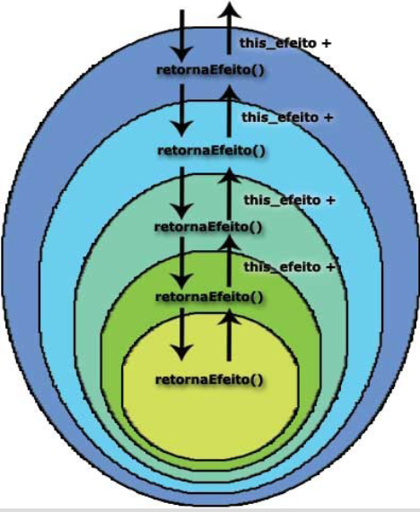

#### Exemplo Decorator

Um website que auxilia a montagem de veículos pelo cliente, podendo então adicionar novos acessórios aos veículos, como ar condicionado, vidro elétrico, travas elétricas e direção hidráulica, alterando assim as características finais do produto.

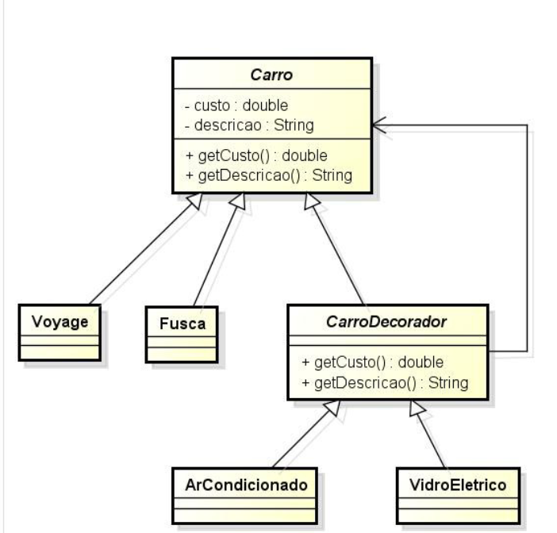

``` java
// Component

public abstract class Carro {
  private double custo;
  private String descricao;

  public double getCusto() {
    return this.custo;
  }

  public String getDescricao() {
    return this.descricao;
  }

  public void setCusto(double custo) {
    this.custo = custo;
  }

  public void setDescricao(String descricao) {
    this.descricao = descricao;
  }
}
```

``` java
//ConcreteComponent
public class Voyage extends Carro {
  Voyage() {
    this.setCusto(60.000);
    this.setDescricao("Voyage");
  }
}
```

``` java
// Decorador
public abstract class CarroDecorador extends Carro {
  private Carro carroDecorado;

  public CarroDecorador(Carro carroDecorado) {
    this.carroDecorado = carroDecorado;
  }

  public double getCusto() {
    return carroDecorado.getCusto() + super.getCusto()
  }

  public String getDescricao() {
    return carroDecorado.getDescricao() + ", " + super.getDescricao();
  }
```

``` java
//ConcreteDecorator
public class VidroEletrico extends CarroDecorador {
  public VidroEletrico(Carro carroDecorado) {
    super(carroDecorado);
    setCusto(600.00);
    setDescricao("Vidro Eletrico");
  }
}

//ConcreteDecorator
public class RodaLigaLeve extends CarroDecorador {
  public RodaLigaLeve(Carro carroDecorado) {
    super(carroDecorado);
    setCusto(200.00);
    setDescricao("Roda Liga Leve");
  }
}

//ConcreteDecorator
public class ArCondicionado extends CarroDecorador {
  public ArCondicionado(Carro carroDecorado) {
    super(carroDecorado);
    setCusto(900.00);
    setDescricao("Ar Condicionado");
  }
}
```

``` java
public class Principal {
  public static void main() {
    Carro carro = new Voyage();
    carro = new ArCondicionado(carro);
    carro = new VidroEletrico(carro);
    carro = new RodaLigaLeve(carro);

    //--cliente------------
    System.out.println(carro.getDescricao());
    System.out.println(carro.getCusto());
  }
}
```

---

- Os decoradores estendem a funcionalidade do componente através da montagem de uma lista encadeada de decoradores e componente (Swing utiliza esse padrão de projeto)

### Padrão Fábrica (Simple factory - factory method)

- Tenta resolver o problema do aclopamento gerado com a instanciação de objetos.

- Padrão Simple Factory: fornece interfaces para criar objetos sem expor a lógica de criação para o cliente
- Padrão Factory Method: fornece interfaces para criar objetos, mas permite que subclasses determinem qual classe instanciar
- Padrão Abstract Factory

#### Simple Factory

- Visa encapsular a criação de objetos em um método
- Isto permite manter em um único local comandos
  - "new ClasseConcreta()"
- Desacopla o cliente dos objetos que deseja criar
- Permite ao cliente transferir a responsabilidade de instanciação de objetos complexos a uma fábrica

---

- Evita modificação do código quando novas classes são criadas
- Evita modificação de código quando a forma de instanciar objetos é modificada
  - Exemplo: novos decoradores são criados, afetando vários pontos do códigos
  - Facilita manutenção de código já que a replicação de código de instanciação a serem instanciados

---


---


### Factory Method

- Define uma interface para instanciação de objetos
- Utilizado na construção de um framework