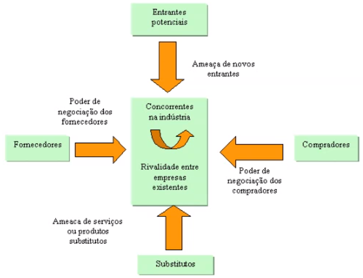
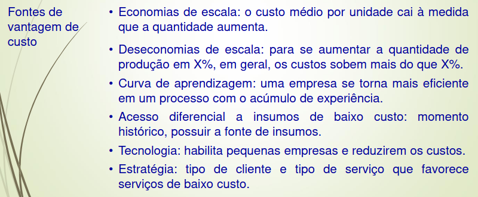

# Gestão Empresarial

## **O curso de gestão empresarial é um sinônimo de administração (management)**

- Conceito de organização
  - Organização é considerada como uma entidade
  - 1º Setor - administração pública
    - Quanto mais transparência, melhor a interpretação da sociedade sobre as atitudades e corrupções de uma **empresa**
  - 2º Setor - iniciativa privada
    - Não é possível ver as contas da empresa
    - A empresa pode abrir suas contas ao colocar a empresa na bolsa, tendo o dever de prestar contas para seus investidores, para que possam contribuir mais com a empresa ou não
  - 3º Setor - organizações governamentais (ONGs)
    - Essas organizações buscam atender a população como um todo, ao contrário das organizações privadas.
  
- Eficiência: fazer certo as coisas, gerenciando os recursos de forma otimizada
- Eficácia: fazer as coisas certas, entregar coisas a mais, buscando problemas que os próprios clientes não identificaram, ou seja, agir de forma proativa

## **Funções da Administração**

### PLOC (**P**lanejar **L**iderar **O**rganizar **C**ontrolar)

- O **planejamento** é iniciado quando se tem um objetivo, e nesse sentido, os recursos são analizados para traçar os caminhos para os objetivos, pensando no futuro

- A **liderança** tem haver com direcionamento e condução, tendo como função auxiliar nos momentos importantes e encaminhar decisões e direcionamentos, ou seja, é essencial tê-la para se ter progresso.
  - Atualmente as empresas, devido a horizontalidade adotada, ocorre a liderança situacional, onde pessoas com profundidade em um assunto abordado tomam liderança pelo fato de terem conhecimento na área
  - A liderança é o sentido de demonstrar força ao realizar os atos, mostrando segurança para os dados (para isso é necessário preparo, conhecimento e experiência)
  - Ela é vista como o processo, e não uma pessoa que é 100% das situações o líder
  - A liderança pode ser:
    - Autocrática: Centralizada, na qual há uma liderança que coordenada todas as partes, gerenciando conforme suas necessidades e objetivos que considera prioritários
    - Democrática: Descentralizada e participativa, na qual há alguém liderando, mas permite a participação de todos
    - Liberal: Descentralizada e não há necessidade da presença de liderança, pois o método de trabalho permite que as partes já tenham um consenso e realizem seu trabalho de forma independente, sem ocorrer uma liderança (necessidade de maturidade de todas as partes, experiência)

- Pare que se tenha um planejamento, é necessário que se tenha uma **organização** (no sentindo de se organizar)
  - A ideia de se organizar em hierarquia, na maioria das vezes, não é vista como uma forma de organizar, só faz sentido de se ter uma hierarquia restrita em situações de organizações públicas (sensíveis), nas quais a burocracia previne potenciais problemas
  - A horizontalidade, em empresas mais novas, é um metodo de organização flexível que permite uma maior automia das partes, facilitando e agilizando a resolução e problemas

- O **Controle** tem haver com a questão de acompanhar, avaliar e ajustar, para que se possa ter um melhor conhecimento sobre a situação atual da organização
  - Acompanhar as situações que envolvem a organização (satisfação dos clientes, gerencimento dos gastos/horas de trabalho/feedbacks)
  - Poder fazer ajustes conforme as situações, pois com o controle, a organização está bem informada

## **Estrutura Organizacional**

### Passos Para a Gestão

1. Traçar objetivos
   - Definir aonde vamos chegar
2. Definir *os caminhos* (estratégias para alcançar os objetivos)
   - Procurar maneiras/rotas para poder atingir os objetivos, como fazer alianças, expandir vendas, etc...

### Ambiente Interno

- Situação interna da empresa, esse ambiente deve ser analisado para se ter uma maior ideia da empresa

- Devemos analisar primeiro a situação atual da empresa, as suas forças e fraquezas relacionadas a sua gestão, funcionários, participação no mercado, etc...

#### Elementos

- Cultura
  - A cultura da empresa reflete como os funcionários desta se relacionam entre sí, podendo ter um cenário competitivo entre esses, ou um ambiente colaborativo. Essa característica da organização reflete diretamente no desempenho, criatividade e proatividade dos funcionários dentro da organização
  - Geralmente, as situações em que a cultura da empresa é colocada em questão estão relacionadas quando ocorre mudança de gestão de empresas. Uma exemplo seria uma empresa mais tradicional sofrer transformações em seus valores quando a gestão é passada para os filhos do dono, mudando o estilo tradicional dessa para um mais moderno.
  - As situações de mudança de cultura podem trazer atritos, pois é uma situação de mudança repentina que é aversa aos valores daqueles que participam dessa mudança. Isso se deve pelo fato de que, essa cultura se engessa com o passar do tempo, portanto é necessário se ter cuidado e tempo ao tentar uma transição de cultura.
  - A cultura organizacional é sinônimo de trajetória organizacional, sendo essa trajetória as experiências da empresa desde a sua criação. Essas experiências acabam definindo valores e estratégias para a empresa, portanto define a cultura da organização
- Estrutura
  - Divisão do trabalho/hierarquia/autonomia/regras formais/alcance de comando
  - Para representar a estrutura, é utilizado um organograma da organização, sinalizando as divisões hierarquicas da empresa, indo dos gestores da empresa até os funcionários operacionais
  - Ao analisar a estrutura da empresa, podemos ter uma ideia da cultura desta

### Ambiente Externos (macroambiente + microambiente)

- Analisar setores externos para poder trazer benefícios para a organização e seu ambiente interno

#### Macroambiente

- Cenário econômico, político, social e culturais na qual uma organização esta inserida, ou seja, fatores externos à organização que não podem ser alterados pela mesma, pelo fato de ser maior que esta
- Pode tornar mais propício ou não a situação econômica da organização

#### Microambiente

- Cenário setorial em que a organização esta inserida (setor automobilístico, imobiliário, bancário)
- Setores nos quais empresas formaram com o decorrer da história das mesmas, formando nichos que podem ser voláteis ou não
  - o setor bancário é mais estável quando comparado com o setor de serviços em redes sociais

## **Forças Competitivas**

  

## **Análise SWOT**

- Esta análise tira uma fotografia da situação do momento da empresa
- Antes de fazer a matriz SWOT, é necessário uma análise externa/interna da empresa
  - Análise externa: identificar as principais oportunidades e ameaças da empresa
  - Análise interna: identificar os principais pontos fortes e fracos da organização
- Passos:
  1. Elencar os pontos fortes + fracos e as oportunidades + ameaças (a partir da análise de recursos e capacidades internos + análise do macro e microambiente externo)
  2. Montar a matriz SWOT fazendo a relação entre os pontos do ambiente interno com os pontos externos
  3. Fazer a análise SWOT propriamente dita
  4. Definir as estratégias a partir da análise da matriz

## **Vantagens Competitivas**

- Visão baseada em recursos
  - recursos + capacidades = desenvolver diferenciais competitivos
- Recursos
  - Humanos
  - Financeiros
  - Tecnológicos
  - Estruturais
  - Organizacionais (de Gestão)
- Capacidades = o que é possível 'fazer' (transformar, criar, vender, etc) com os recursos disponíveis
- Análise VRIO - um recurso tem que:
  - possuir valor
  - tem que ser raro
  - difícil de imitar
  - difícil de substituir
  - absorvido pela organização
- Teoria das Capacidades Dinâmicas
  - a medida que oportunidades são observadas, a organização gasta seus recursos para utilizá-las

### Estratégias

1. Liderança em custo
   - Permite à empresa gerar e capturar valor econômico por ter custos inferiores aos da concorrência

    
2. Diferenciação
   - Permite aumentar o valor percebido de produtos e/ou serviços da empresa em relação ao dos da concorrência e possibilita desenvolver a preferência dos consumidores pela empresa
   - Um produto diferenciado satisfaz melhor uma ou mais necessidades do que os produtos concorrentes
3. Nicho ou enfoque
   - Busca enfocar um determinado grupo pequeno, trazendo diferenciação para os mesmos e agregando valor para o preço ao diferenciar diretamente para aquele público
4. Integralização vertical ou verticalização
   - Vale a pena quando os negócios que compõem o todo corporativo valem mais do que valeriam sob controle independente. A sinergia pode ser obtida por aumento de receita ou redução de custo
