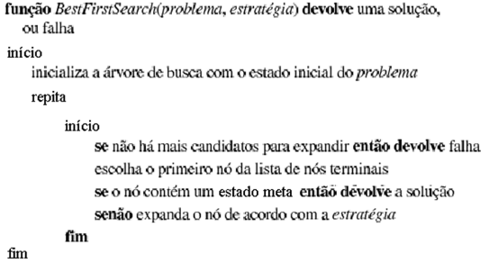
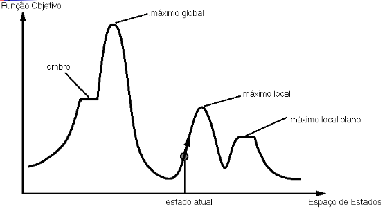
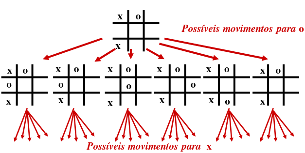
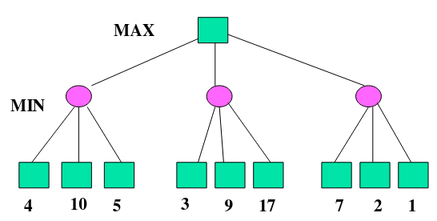
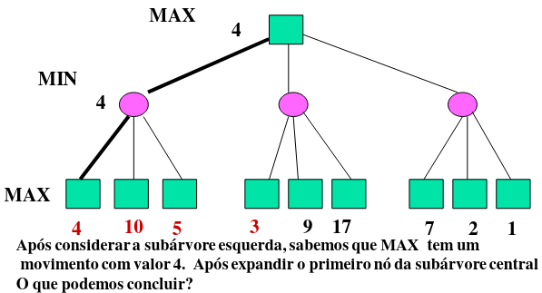
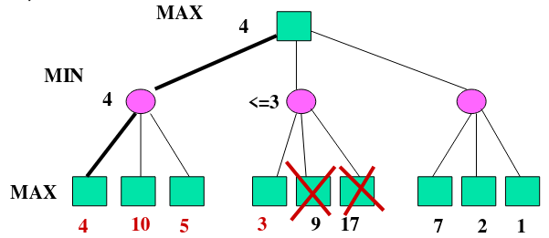
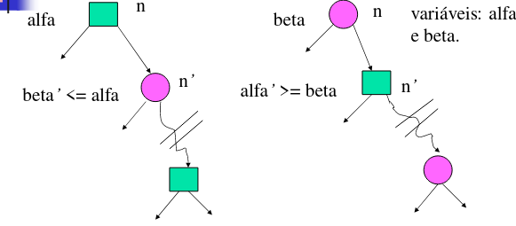

# Inteligência Artificial

## Introdução

### Definindo uma IA

- Não existe ua definição unica para IA
- Podem ser essas:
  - Sistemas que pensam como humanos
  - Sistemas que pensam racionalmente
  - Sistemas que agem como humanos
  - Sistemas que agem racionalmente

- Obs:
  - definições na parte de cima (ênfase em processos mentais) e na parte de baixo (ênfase no comportamento)
  - definições na parte da esquerda (ênfase no desempenho humano) e na parte da direita (ênfase na racionalidade)

### Pensando como um humano

- A psicologia cognitiva tenta entender como a mente funciona, criando desta forma modelos
- IA consiste em criar algoritmos que desempenhasm bem uma tarefa e são portanto bons modelos de desempenho humano. Tais algoritmos podem tambem se beneficiar de resultados da psicologia cognitiva (especialmente visão e processamento e linguagem natural)
- Ciência cognitiva: integra IA e tecnicas da psicologia para construir teorias precisas do funcionamento da mente humano

### Agindo como um humano

- Tipificada pelo teste de Turing: um teste que decide se uma maquina e inteligente ou não.

### O Teste de Turing

- Alguns temas abordados:
  - Processamento em Linguagem Natural
  - Sistemas Especialistas
  - Representação do Conhecimento
  - Aprendizagem
- Turing escapa da definição de inteligência

### Pensando Racionalmente

- Usa a logica matematica para capturar o raciocinio
- E atrativa do ponto de vista formal
- Apresenta algumas dificuldades:
  - Tradução: como mapear o ambiente para simbolos
  - Representação: Como representar fenômenos do mundo real (tempo, espaço, etc)?
  - Raciocinio: E possivel fazer manipulação simbolica de forma tratavel?

### Agindo racionalmente

- Nesta abordagem IA e vista como um processo de construir agentes racionais
- O agente racional percebe e age sobre o ambiente para satisfazer seus objetivos
- O agente racional
  - Faz a coisa certa
  - Procurar maximizar a tarefa de atingir seus objetivos
- Nem sempre e possivel executar a melhor ação a existência de determinadas limitações
  - Tempo
  - Processamento computacional
  - Memoria
  - Presença de incertezas

### Abordagem Racional

- Mais generica que a bordagem da leis do pensamento

### Sub-areas de IA

- Raciocinio logico
- Aquisição e Representação de Conhecimento
- Planejamento
- Visão
- Aprendizagem
- Algoritmos geneticos
- Redes neuronais

### Aplicações de IA

- Matematica
  - Prova de teoremas, resolução simbolica de equações, etc;
- Pesquisa Operacional
  - Otimização de busca heuristica
- Jogos
  - Xadrez, dama, etc
- Processamento de Linguagem Natural
  - Tradução automatica, verificadores ortograficos
- Robotica
  - Navegação, manipulação, monitoramento

## Agentes Inteligentes

- Um agente e algo que percebe seu ambiente atraves de sensores e age atraves de atuadores
- Agente humano:
  - Sensores: olhos, ouvido, nariz, ...
  - Atuadores: mãos, pes, boca, ...
- Agente robotico:
  - Sensores: visão, proximidade, contato, ...
  - Atuadores: garra, motores, ...

- Exemplo - Descrever a medida de desempenho, ambiente, sensores e atuadores de um agente que realiza o diagnostico medico de um paciente em um hospital  ch
  - ambiente: consultorio, clinica, hospital
  - medida de desempenho: quantidade de diagnosticos corretos do exame
  - sensores: imagem, 
  - atuadores: gerar documentos (atestado, prescrições), caixas de som

### Agente Baseado em Tabela

- Para construir um agente racional devemos construir uma
tabela que contém a ação apropriada para toda seqüência
possível de percepções

```portugol
Função AGENTE-DIRIGIDO-POR-TABELA(percepção) retorna uma ação
  Variáveis estáticas:
    • percepções, uma seqüência, inicialmente
    vazia
    • tabela, uma tabela de ações, indexada
    por seqüências de percepções, de início
    completamente especificada
  Início
    anexar percepção ao fim de
    percepções
    ação ← ACESSAR(percepções, tabela)
    retornar ação
  fim
```

### Dificuldade com Agente baseado em Tabela

- Seja P o conjunto de percepções possiveis e T o tempo de vida do agente (o numero de percepções que recebera). Assim sendo, a tabela contera $\sum|p|^t$

### Agente baseado em Tabela: Vantagens e Desvantagens

- Vantagens
  - Facil de implementar
  - Arquitetura para problemas simples
  - Podemos adicionar par de entrada-saida sempre que quisermos
- Desvantagens
  - A entrada e pesquisada na tabela, cujo tempo de execução esta diretamente associado ao tamanho da tabela
  - Tudo (entrada-saida) precisa ser escrito na tabela
  - Sem capacidade de aprendizagem

### Outros Tipos de Agentes Programas

- Agentes Reativos Simples
- Agentes Reativos com Estado Interno
- Agentes Baseados em Metas
- Agentes Baseados em Utilidade
- Agentes com Aprendizagem

### Agentes Reativos Simples

- Usam uma regra "Condição/Ação" (tambem denominadas "regras de produção" ou regra "situação/ação" ou regra "se/então")
- Exemplo: Se existe um obstaculo a frente então desvie

### Agente Reativo Baseado em Regras

```portugol
função Agente-Reativo-Simples(percepção) retorna ação
  estatico: regras, um conjunto de regras condição-ação

  estado = INTERPRETA-ENTRADA(percepção)
  regra = CASA-REGRA(estado, regras)
  ação = AÇÃO-DA-REGRA(regra)
  retorna ação
```

### O "Mundo" do Aspirador de Po

- Percepções: localização e presença de po
- Ações: aspirar, ir para a esquerda, ir para a direita, nenhuma (não executa nenhuma ação)

### O Agente Aspirador de Po Reativo

```portugol
Função:
asp-reativo([local,status]) retorna Ação
  Se status = sujo então returnaspirar
  Se local = A então return movimente-para-direita
  Se local = B então return movimente-para-esquerda
```

### Limitação de Agentes Reativos

- A melhor ação e escolhida somente se o ambiente e totalmente conhecido (ou completamente observavel)

### Agente Reativos: Vantagens e Desvantagens

- Vantagens
  - Facil de implementar (apenas a estrutura IF-ELSE e necessaria)
  - Muito rapido em comparação com outros
  - Eficiente por causa das regras de condição/ação
  - Os agentes reativos são agentes de memoria fixa
- Desvantagens
  - Esses tipos e agentes têm escalabilidade quase zero
  - Aplicavel apenas para sistemas simples e pequenos (entradas e saida limitadas)
  - Sem capacidade de aprendizagem ou inteligência muito limitada
  - Mudança no ambiente exige mudança nas regas de condição/ação

### Limitação de agentes reativos (cont.)

- Suponha que o sensor de localização seja retirado do robô. Qual seria o seu comportamento para as regras especificadas?
- A melhor forma de se tratar com um estado parcialmente conhecido (parcialmente observavel) e manter um historico de informações (um estado interno ou memoria interna)

### Agente Reativo com Estado Interno (agente baseado em modelo)

```portugol
função agente_reativo_com_memória(percepção) retorna uma ação
  persistente:
    estado (atual)
    regras (do tipo se-então)
    ação (mais recentemente executada)
  estado = atualiza_estado(estado, ação, percepção)
  regra = casamento (estado,regras)
  ação = obtem_ação(regra)
```

### Agente Aspirador com Estado Interno

```portugol
asp-reativo-estado([status]) retorna Ação persistente local
  Se status = sujo então return aspirar
  Se local = A então
    local = B
    return movimente-para-direita
  Se local = B então
    local = A
    return movimente-para-esquerda
```

### Agente Reativos com Estado Interno: Aspectos Positivos

- Mais eficiente do que agentes reativos e agentes baseados em tabela
- Podem trabalhar em um ambiente de tarefa parcialmente observavel

### Agente Reativo com Estado Interno

- Saber o estado atual do mundo não e sempre suficiente para decidir o que fazer
  - Exemplo: Num cruzamento um agente motorista pode ir para diferentes direções. Qual e a melhor escolha? A melhor escolha depende de onde o motorista quer ir. Para isto ele necessita de algum objetivo a ser alcançado

### Agente Baseado em Objetivos

- Raciocina com ações cujos efeitos podem satisfazer objetivos
- E simples quando uma unica ação satisfaz o objetivo. Entretanto, pode ser necessario busca e planejamento. Pode haver projeção de ações para ver se o objetivo pode ser alcançado
- Dificuldade: o ambiente pode mudar enquanto o agente raciocina

### Agente Baseado em Utilidade

- Objetivos não são suficientes para gerar comportamento de alta qualidade: diferentes sequências de ações podem alcançar um dado objetivo
- Função utilidade: mapeia um estado (ou uma sequência de estados) em um numero que descreve o grau de satisfação do agente com a ação tomada
- Informa o quanto um determinado estado do mundo e preferido com relação a outros

### Agente Baseado em Aprendizado

- Codificar comportamento racional para todas as situações do mundo e muito "trabalhoso"
- Agentes inteligentes devem ser capazes de aprender. O comportamento do agente deve ser modificado em função de um feedback recebido pelo ambiente
- Aprendizado permite que agentes operando em ambientes desconhecidos possam se tornar mais competentes que seu conhecimento inical permitia

## Resolvendo Problemas por meio de Tecnicas de Busca

### Revisitando o Agente Reativo

- O agente reativo:
  - E tambem chamado de agente situado ou agente de estimulo-resposta
  - Reage a estimulo do ambiente
  - Não e capaz de planejar com antecedencia
  - Não possui capacidade para tomada de decisões
  - Desconhece as consequências de suas ações

### Resolvendo Problemas

- Um agente que resolve problemas:
  - Decide o que fazer(formula o seu objetivo)
  - Conhece o efeito de suas ações
  - Encontra uma sequência de ações que se executdas satisfaz os seus objetivos

### Resolvendo Problemas: o agente deliberativo

- O agente "deliberativo":
  - Formulação do objetivo e do problema: processo de determinação do objetivo e da escolha relevante de um conjunto de ações e estados
  - Busca: obtem a(s) sequência(s) de ações que satisfaz(em) o objetivo
  - Solução: uma sequência de ações que satisfaz o objetivo
  - Execução: realização das ações da solução

### Descrição do Problema

- Formulação do problema:
  - Envolve o conheciento que o agente deve usar para resolver o problema:
    - Estado inicial (o que o proprio agente sabe)
    - Conjunto de operadores (ações genericas). A execução de uma ação muda o estado do mundo
    - Teste de objetivo: verifica se um certo estado satisfaz um objetivo formulado (um estado ou uma propriedade de um estado)
    - Função custo do caminho(g): soma dos custos das ações em um caminho

### Definindo o Problema atraves de um tipo de dado

- Tipo de dado: Problema
  - Componentes:
    - Estado inicial
    - Operadores
    - Teste de objetivo
    - Função custo

### Busca

- Proposito de uma busca: encontrar uma sequência de ações que transformem o estado inicial do mundo em um estado final (que satisfaça um objetivo)
- Possibilidades:
  - Encontrar uma solução
  - Encontrar a solução otima
- Custo do Caminho X Custo da busca
  - Compromisso entre encontrar a melhor solução e o tempo gasto para obtê-la

### Formulação do Problema: Exemplo

- Exemplo: Ferias na Romênia. No momento em Arad. Desejo estar em Bucharest amanhã.
  - Formulação do objetivo: estar em Bucharest
  - Formulação do problema:
    - Estados: as varias cidades
    - Operadores(Ações): dirigir entre as cidades
    - Função custo: Quilometragem total ou tempo de viagem
    - Teste de objetivo: estou em Bucharest?
  - Encontrar solução: sequência de cidades atingidas saindo de Arad e chegando em Bucharest

> Mapa de estradas

- Quebra-cabeça de 8 ou 15

- Problema das 8 rainhas
  - Teste de objetivo: As oito rainhas estão posicionadas no tabuleiro, De tal forma que nenhuma ataque outra?

### Problemas do Mundo Real

- Navegação de robôs
- Sequenciamento de montagens
- etc

### Busca (continuação)

- O que um algoritmo de busca faz?
  - Gera sequência de ações
  - Multiplas escolhas de caminho
  - Essencialmente faz-se uma escolha e deixa as outras para serem analisadas posteriormente
  - A decisão de quem escolher primeiro define uma estrategia de busca
  - O processo de busca pode ser comparado ao processo de construir uma arvore
  - A raiz da arvore de busca corresponde ao estado inicial
  - Os nos folhas correspondem a estados que não possuem sucessores devido ao fato de não terem sido expandidos ainda ou porque foram expandidos e geraram o conjunto vazio
  - Em cada passo, o algoritmo busca um no folha para expandir

### O Algoritmo de Busca

```portugol
Algoritmo geral de busca:
  Função buscaGeral(problema,estratégia) devolve fracasso ou solução
  Inicio_de buscaGeral
    inicializa a árvore de busca com o estado inicial do problema
    repete
    inicio
      se não existem mais candidatos a serem
      expandidos devolva fracasso
      escolha um nó folha para expandir de acordo
      com a estratégia
      Se o nó contém o estado que satisfaz o objetivo
      então **devolva** a solução
      senão expanda o nó e adicione na árvore de busca
    fim
  Fim-de buscaGeral
```

- Estruturas de Dados para Arvores de Busca:
  - Tipo de dado: no
    - componentes:
      - estado
      - no_pai
      - operador (que foi aplicado para gerar o no)
      - profundidade
      - custo_do_caminho

- E preciso representar a coleção dos nos que necessitam ser expandidos (chamada fronteira)
- A representação mais simples poderia ser um conjunto de nos. A estrategia de busca seria então uma função que seleciona o proximo no a ser expandido do conjunto
- Vamos assumir que esta coleção e representada como uma fila

- Operações associadas a fila:
  - criaFila(elementos): cria uma fila com os elementos dados
  - estaVazia(fila): retorna verdade se não existem mais elementos na fila
  - removeDaFrente(fila): remove o elemento da frente da fila e o devolve
  - enfileira(elementos, fila): insere um conjunto de elementos na fila

- Busca

  ```portugol
  Função buscaGeral(problema, enfileiraF) devolve uma solução ou fracasso
  inicio
    nós <- criaFila(criaNó(estadoInicial(problema)));
    repita
    inicio
      se a fila nós é vazia retorne fracasso
      nó <- removedaFrente(nós);
      se testeDeMeta(problema) aplicada a estado(nó)
        obtém sucesso retorne nó;
        nós <- enfileiraF(nós,expande(nó, operadores(problema))
  fim
  ```

  - Critérios para avaliação de uma estratégia de busca:
    - Completude: se existe uma solução a estratégia será capaz de encontrá-la?
    - Complexidade no tempo: quanto tempo ela demora para obter uma solução?
    - Complexidade de espaço: de quanto memória ela necessita para realizar a busca?
    - Qualidade da solução: a solução encontrada é a solução ótima?
  - Estratégias de Busca não Informadas (Busca Cega) - estas não possuem informação sobre o número de passos ou o custo do caminho entre um nó e nó meta
    - Busca em largura
    - Busca em profundidade
    - Busca de custo uniforme
    - Busca em profundidade limitada
    - Busca em profundidade iterativa
    - Busca bidirecional

## Busca Informada (ou Busca Heuristica)

### Busca do Melhor Primeiro (Best_first Search)

- Procedimento: a escolha do no a ser expandido deve ser aquele que "promete" dirigir a busca mais rapidamente em direção a solução
- Usa informação especifica do dominio do problema para a escolha do no a ser expandido
- Buscas anteriores somente usavam conhecimento de dominio na especificação do modelo de ações

### Busca do Melhor Primeiro (BMP)

- O conhecimento especifico do dominio e representado por uma função de avaliação f(n)
  - Recebe descrições de estados e devolve um valor real
  - Deve incorporar alguma estimativa de custo do estado corrente ao estado meta
  - Por convenção, os valores menores de f(n) indicam os melhores nos

### BPM

- BPM
  - Introduz conhecimento da estrategia final de busca (funão enfileiraFn)
  - Expande o no que tem a melhor avaliação
  - Termina quando o no a ser expandido e o no meta



- Alguns algoritmos de BMP
  - Busca Gulosa (Greedy Search)
  - A*

### Diferenciando Busca Uniforme da BMP

- A busca em largura pode incorporar conhecimento sobre o custo da solução
- A busca uniforme:
  - f(n) = g(n) : custo do caminho
  - Não dirige a busca para a solução

### Função Heuristica - h(n)

- f(n) = h(n)
  - Estimativa do custo do caminho que leva a solução
  - h(n) = 0 se n e a meta
  - Constroi-se uma h(n) especifica para o problema

### Busca Gulosa

- Algoritmo BMP que usa uma função heuristica h para obter o proximo a ser expandido
- Minimiza o custo estimado para atingir o estado meta
- Tenta encontrar uma solução rapida que nem sempre e a otima
- Não e completo (exemplo: percurso de Iasi a Fagaras)
- Guarda todos os nos gerados
- Complexidade de tempo e espaço: O(b^m). Pode ser reduzida com a escolha de uma boa heuristica

### Busca A*

- Combina a busca o custo uniforme com a busca heuristica
- f(n) = g(n) + h(n) onde:
  - g(n): custo gasto ate n
  - h(n): custo estimado para atingir o estado meta de n
  - f(n): custo estimado total
- A* usa uma heuristica admissivel: h não deve superestimar o custo real para se chegar ao estado meta
  - h(n) <= h*(n) onde h* corresponde ao custo real para se chegar ao estado meta passando por n

### Provando que A* encontra a Melhor Solução

- Seja G1 o estado otimo e G2 o estado meta sub-otimo
  - f(G1) = g(G1) + h(G1) = g(G1) + 0 = g(G1)
  - f(G2) = g(G2) + h(G2) = g(G2) > f(G1) (1)
- Hipotese: A* escolhe G2 antes de G1 e a busca termina..
- Seja n um no folha no caminho de G1, logo sendo h admissivel: f(G1) >= f(n) (2)
- Agora, se existem dois nos para expansão, n e G2, e n não e escolhido por A* tem-se que
- f(n) >= f(G2) (3)
  - de (2) e (3) tem-se que f(G1) >= f(G2)
  - como f(G2) = g(G2) então
- g(G2) < f(G1) -> Inconsistente com (1)

## Algoritmos de Melhoramento Iterativo (ou de Busca Local)

- Em muitos problemas de caminho para a solução e irrelevante. O estado meta e a propria solução
  - Ou encontra-se a configuração otima
  - Ou encontra-se a configuração que obedeça a certas restrições

---

- Nestas situações pode-se usar algoritmos de melhoramento iterativo
- Guarda um unico estado corrente e tenta-se altera-lo para melhorar a sua qualidade
- Vantagens:
  - Usam pouca memoria (em geral uma quantidade constante)
  - Frequentemente encontram soluções razoaveis em espaços de estados grandes para os quais algoritmos sistematizados não são adequados

### Principio da Busca Local

A ideia e simples:

1. Selecione (aleatoriamente) um estado inicial ("chute" inicial)
   - Exemplo: para o problema das N rainhas suponha uma colocação arbitraria das N rainhas no tabuleiro
2. Faça uma modificação local para melhorar a avaliação do estado corrente
   - Exemplo: para o problema das N rainhas mover a rainha sob ataque para uma posição em que sofra menos ataque de outras rainhas
3. Repita o passo 2 ate que um estado satisfazendo o objetivo seja alcançado
   - O ciclo de repetição pode ser realizado bilhões de vezes

### Algoritmos de Melhoramento Iterativo

- Exemplo: o problema do caxeiro viajante
  - Iniciar com um percurso arbitrario
  - Trocar pares de percursos

---

- Exemplo: o problema das N rainhas
  - Inserir N rainhas num tabuleiro de formato NxN de tal forma que nenhuma ataque outra
  - Deslocar uma rainha para reduzir o numero de conflitos

---

- A paisagem do espaço de estados:



- Podemos definir o problema como maximizando a função objetivo ou minimizando o custo

### O Problema da 4 rainhas

- Estados: 4 rainhas em 4 colunas (256 estados)
- Operadores: mover a rainha em uma coluna
- Função de avaliação: h(n) = numero de ataques("conflitos")
- Teste de Meta: nenhum ataque, i.e, h(G) = 0

### O Algoritmo Subida de Encosta (Hill Climbing)

- E como escalar o Everest com Nevoeiro
- A escolha e normalmente aleatoria entre os sucessores com o mesmo valor da função objetivo
- Tambem conhecido como gradiente ascendente/descendente

### Subida de Encosta - Descrição do Algoritmo

```portugol
função subida-de-encosta (problema) retorna uma solução
    variáveis locais: corrente (o nó atual), próximo (o próximo nó)
  corrente < - Faz-Nó(Estado-Inicial[problema])
  loop do
    próximo <- sucessor de corrente de maior valor (expande nó corrente e seleciona seu melhor filho)
    se Valor[próximo] < Valor[corrente] (ou >, para minimizar)
    então retorna corrente (o algoritmo pára)
    corrente <- próximo
  end
```

---

- Problemas:
  - Pode ficar preso em maximos locais
  - Travessia dificil em cristas de maximos locais
  - Planicie

### Subida de Enconsta com Recomeço Aleatorio

- Pode-se utilizar um numero limitado de movimentos laterais para se sair de um planalto, mas que não funciona para planaltos que correspondem a maximos locais
  - Para o problema das 8 rainhas o uso dos movimentos laterais aumenta a probabilidade de sucesso de 14% para 94%

---

- Para evitar ficarmos presos em maximos locais tenta-se novamente com um novo estado incial gerado aleatoriamente e guarda-se o melhor deles ao fim de um numero determinado de iterações
  - Permite o resolver o problema de 3000000 rainhas em menos de um minuto
- O sucesso deste algoritmo depende muito da paisagem de estados

### O Algoritmo de Recristalização Simulada (Simulated Annealing)

- Este algoritmo e semelhante a Subida da Encosta, porem oferece meio para se escapar de maximos locais
  - quando a busca fica "presa" em um maximo locao, o algoritmo não reinicia a busca aleatoriamente
  - ele retrocede para escapar desse maximo local
  - esses retrocessos são chamados de passos indiretos
- Apesar de aumentar o tempo de busca, essa estrategia consegue escapar dos maximos locais
- Analogia com cozimento de vidros ou metais:
  - processo de resfriar um liquido gradualmente ate ele se solidificar

### Recristalização Simulada

- O algoritmo utiliza mapeamento de resfriamento de instantes de tempo (t) em temperaturas (T)
- Nas iterações iniciais, não escolhe necessariamente o "melhor" passo, e sim um movimento aleatorio:
  - se a situação melhorar, esse movimento sera sempre escolhido posteriormente
  - caso contrario, assoa a esse movimento uma probabilidade de escolha menor do que 1
- A probabilidade de mudar para um estado pior decresce exponencialmente com o valor da mudança, i.e, e^(delta E/T)
  - Delta E = valor[proximo-no] - valor[no-atual]
  - T = Temperatura

### Recristalização Simulada: algoritmo

```portugol
função Recristalização-SimuladaRecristalização-Simulada (problema,mapeamento) retorna uma solução
    variáveis locais: corrente, próximo, T (temperatura que controla a probabilidade de passos para trás)
  corrente = Faz-Nó(Estado-Inicial[problema])
  for t = 1 to Infinito do
    T = mapeamento[t]
    Se T = 0
      então retorna corrente
    próximo = um sucessor de corrente escolhido aleatoriamente
    DeltaE = Valor[próximo] - Valor[corrente]
    Se
    DeltaE > 0
      então corrente  próximo
      senão corrente  próximo com probabilidade = e^(DeltaE/T)
```

## Jogos

### Os Jogos em IA

- A forma de jogos mais estudada em IA e deterministica, com dois jogadores e alternância entre eles e com perfeita informação. Isto significa que:
  - o ambiente e deterministico
  - completamente observavel
  - multiagente: existem dois agentes que se alternam na sequência de movimentos e os valores de utilidade no fim do jogo são sempre iguais e opostos

### Jogos e Busca Competitiva

- Arvore de jogo: arvore semântica na qual os nos representam configurações do tabuleiro (ou estados) e os movimentos (operadores) representam transições ntre elas. Desta froma pode ser possivel utilizar uma estrategia de busca que gere uma sequência de movimentos que permite ganhar a partida

---

- A maioria dos jogos com 2 jogadores requer jogadas sucessivas de cada jogador
  - Cada transição e um movimento
- A maioria dos jogos não-triviais não admite busca exaustiva: arvores muito grandes
- Assim, faz-se necessario usar uma tecnica de busca associada a uma heuristica

### Exemplo de uma Arvore de Jogo



### Jogos e Busca Competitiva: Definições

- Estado inicial: configuração inical e indicação de quem deve iniciar o movimento
- Operadores: definem os movimentos permitidos
- Ply: numero de niveis na arvore, incluindo a raiz
- Teste terminal: define quando o jogo termina
- Função utilidade: fornece um valor numerico para o resultado do jogo

---

- Jogos envolvem competição:
  - Dois jogadores estão trabalhando para atingir objetivos conflitantes
  - Assim, a arvore de busca difere dos exemplos anteriores ja que as jogadas de cada jogador visam objetivos conflitantes: não existe uma busca para um simples objetivo!
- Avaliação Estatica: valor numerico que representa a qualidade da configuração (tabuleiro)

### Procedimento: Algoritmo Minimax

- Tem-se a presença de dois jogadores: maximizador e minimizador
  - Maximizador: prefere mover para estado maior valor de utilidade
  - Minimizador: prefere mover para um estado de menor valor de utilidade
- A arvore de jogo consiste em camadas sucessivas de maximização e minimização
  - Presume-se que, em cada camada, o jogador deseja a avaliação mais vantajosa para ele



### O Algoritmo Minimax

```portugol
function MINIMAX-DECISION(state) returns an action
  inputs: state, currente state in game
  v = MAX-VALUE(state)
  return the action in SUCCESSORS(state) with value v
```

```portugol
function MAX-VALUE(state) returns a utility value
  if TERMINAL-TEST(state) then return UTILITY(state)
  v = -Infinite
  for each s in SUCCESSORS(state) do
    v = MAX(v, MIN-VALUE(s))
  return v
```

```portugol
function MIN-VALUE(state) returns a utility value
  if TERMINAL-TEST(state) then return UTILITY(state)
  V = +Infinite
  for each s in SUCCESSORS(state) do
    v = MIN(v, MAX-VALUE(s))
  return v
```

### O Desempenho de Minimax

- Assumindo uma busca em profundidade:
  - Complexidade de tempo = O(b^m)
  - Complexidade de espaço = O (bm)
- Para jogos reais uma busca exaustiva e inviavel
  - Por exemplo, a arvore e busca para xadrez tem cerca de 35¹⁰⁰ nos. Então como melhorar o processo? Duas possibilidades:
    - Podemos avaliar nos que não são terminais usando uma função de avaliação heuristica
    - E possivel podar partes do espaço de busca que não necessitam ser examinadas

### Funções de Avaliação

- Como uma função de avaliação estativa não e necessario expandir a arvore de busca completamente
- Uma função de avaliação estatica estima o quão boa e a configuração do tabuleiro com respeito a uma jogador (tipicametne MAX)
- A qualidade dos movimentos selecionados por minimax baseada em profundidade e uma função da qualidade do avaliador do tabuleiro estatico
- Uma boa função de avaliação:
  - corretamente reflete a probabilidade de vitoria para uma dado no na arvore de busca
  - deve ser calculada de forma eficiente

### Um Exemplo usando o Jogo a Velha

- Um exemplo de função de avaliação para a posição do tabuleiro p:
  - Eval(p) = (o numero de linhas completas, colunas, ou diagonais que estão ainda abertas para MAX) - (o numero de linhas completas, colunas, ou diagonais que estão ainda abertas para MIN)
  - Eval(p) = Infinito se MAX ganha
  - Eval(p) = - Infinito se MIN ganha

### Reduzindo o Espaço de Busca

- Poda alfa-beta: o valor de um no e relevante somente se existe uma possibilidade de nos depararmos com ele durante o processo de busca. Se pudermos provar que jogadores racionais jamais atingirão tal no, independente do seu valor, então não existe a possibilidade examina-lo ou mesmo gera-lo

- A poda alfa-beta é uma técnica de poda que pode ser usada para reduzir o espaço de busca

### Alfa-Beta: Motivação





### Alfa e Beta

- Alfa, ou a, e o valor da melhor escolha encontrada ate o momento para qualquer ponto de escolha ao longo do caminho para MAX
- Beta, ou b, e valor da melhor escolha encontrada ate o momento para qualquer ponto de escolha ao longo do caminho para MIN
- Os valores e alfa e beta são modificados durante a busca
- Estes dois valores são comparados para fazer a redução

### O Principio da Poda



- A busca pode ser descontinuada abaixo de um no MIN tendo beta' <= alfa de seu pai MAX. Ela pode ser descontinuada abaixo de um no MAX tendo alfa' >= beta de seu pai MIN.

### O Algoritmo de Busca Alfa-Beta

> Parecido com MINIMAX com alfa e beta adicinados

```portugol
function ALPHA-BETA-SEARCH(state) returns an action
  inputs: state, current state in game
  v = MAX-VALUE(state, -Infinite, +Infinite)
  RETURN the action in SUCCESSORS(state) with value v
```

```portugol
function MAX-VALUE(state, a, b) returns a utility value v
  inputs: state, current state in game
          a, the best alternative for MAX along path to state
          b the best alternative for MIN along path to STATE
  if TERMINAL-TEST(state) then return UTILITY(state)
  v = -Infinite
  for each s in SUCCESSORS(state) do
    v = MAX(v, MIN-VALUE(s, a, b))
    if v >= b then return v
    a = MAX(a, v)
  return v
```
  
```portugol
function MIN-VALUE(state, a, b) returns a utility value v
  inputs: state, current state in game
          a, the best alternative for MAX along path to state
          b the best alternative for MIN along path to STATE
  if TERMINAL-TEST(state) then return UTILITY(state)
  v = +Infinite
  for each s in SUCCESSORS(state) do
    v = MIN(v, MAX-VALUE(s, a, b))
    if v <= a then return v
    b = MIN(b, v)
  return v
```

## Logica Proposicional

- Aspectos da logica proposional:
  - Sintaxe
  - Semântica
  - Validade e inferência
  - Modelos
  - Regras de inferência
  - Provadores de teoremas: metodo de prova de proposito geral

---

- Semântica: significado de uma sentença atraves de intrepretações:
  - Atribuição dos valores verdades para os simbolos proposicionais
  - Especificação dos significados dos conectivos logicos (uso de tabelas verdade)

---

- Metodo da Enumeração: seja S = A V B e KB = (A V C) ^ (B V ~C). KB deriva S?
- Verificação de todos os modelos possiveis de S: deve ser verdade quando KB e verdade

---

- Regras de Inferência:
  - Tabelas verdade podem ser estendidas para classes de inferências
  - Existem certos padrões de inferência que ocorrem com bastente frequência: regras de inferência

---

- Notações usadas pada regras de inferência. Seja alpha e beta duas sentenças da logica proposicional
  - alpha |- beta significa que beta pode ser derivada de alpha atraves de inferencias ou
  - Para enfatizarmos que a construção não faz parte da linguagem
    - alpha / beta

---
