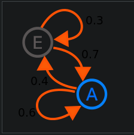

# Modelagem e Simulação

## Revisão probabilidade

### Probabilidade

- Probabilidade é uma medida de incerteza
- Probabilidade é um número entre 0 e 1
- Probabilidade é uma medida de frequência relativa

### Experimento aleatório

- Experimento aleatório é um experimento que pode ser repetido sob as mesmas condições, mas que pode ter resultados diferentes

### Espaço amostral

- Espaço amostral é o conjunto de todos os resultados possíveis de um experimento aleatório
- O espaço amostral é representado por $\Omega$
- O espaço amostral pode ser finito ou infinito

### Evento

- Evento é um subconjunto do espaço amostral
- O evento é representado por $A$

### Probabilidade de um evento

- A probabilidade de um evento é a medida de incerteza associada a esse evento
- A probabilidade de um evento é representada por $P(A) = \frac{\#A}{\#\omega}$

### Fórmulas

- $P(A) = \frac{\#A}{\#\omega}$
- $P(A) = 1 - P(\overline{A})$
- $P(A \cup B) = P(A) + P(B) - P(A \cap B)$
- $P(A \cup B) = P(A) + P(B)$ se $A$ e $B$ são mutuamente exclusivos
- $P(A \cap B) = P(A) \cdot P(B)$ se $A$ e $B$ são independentes

### Fórmulas condicionais

- $P(A|B) = \frac{P(A \cap B)}{P(B)}$
- $P(A \cap B) = P(A) \cdot P(B|A)$

### Fórmulas de Bayes

- $P(A|B) = \frac{P(A) \cdot P(B|A)}{P(B)}$

### Teorema da Probabilidade Total

- $P(B) = P(A) \cdot P(B|A) + P(\overline{A}) + P(B|\overline{A})$

- $P(B) = P(A_1 \cap B) + P(A_2 \cap B) + \dots + P(A_n \cap B)$
- $P(B) = P(A_1) \cdot P(B|A_1) + P(A_2) \cdot P(B|A_2) + \dots + P(A_n) \cdot P(B|A_n)$
- $P(B) = \sum_{i=1}^{n} P(A_i) \cdot P(B|A_i)$

## Cadeias de Markov

Falamos de probabilidade condicional e variáveis aleatórias. Esses conceitos serão importantes quando formos modelar sistemas mais complexos de probabilidades

Agora estamos interessados em modelar uma sequência de eventos probabilísticos

---

Uma cadeia de Markov é um caso particular de processo estocástico com estados discretos  com a propriedade de que a distribuição de probabilidade do próximo esimpleMarkovianChainstado depende apenas do estado atual e não na sequência de eventos que precederam. Cadeias de Markov têm muitas aplicações como modelos estatísticos de processos do mundo real.

> uma cadeia de markov simples com dois estados

---

Propriedade markoviana: o estado futuro só depende do estado atual

A probabilidade do futuro é computada dado o presente e é independente do passado

- $P(X_{n+1} = a | X_{n} = b)$

O espaço de estados precisa ter dimensão constante! O que isso quer dizer? (contra exemplo: caminhadas do turista)

A probabilidade tende a uma distribuição estacionária, ou estado de equilíbrio!

---

Como podemos representar a Cadeia de Markov computacionalmente?

- Matriz de transição
