# Arquitetura de Redes TCP/IP

- Objetivo: mostrar a "atmosfera" e a terminologia das redes TCP/IP:
  - usar a internet como exemplo

## Introdução (Parte 1)

### O que é a internet? (visão basica)

- Milhões de dispositivos de computação conectados: hospedeiros = sistemas finais
  - rodando aplicações de rede
- Enlaces de comunicação (meios em que a informação navega, é transportada)
  - fibra, cobre, radio, satelite
  - taxa de transmisão = largura de banda
- roteadores: encaminham pacotes (pedaços de dados)

#### Internet: uma visão de serviço

- Infraestrutura de comunicação, possibilita aplicações distribuidas
  - Web, VoIP, e-mail, jogos, e-commerce, compartilhamento de arquivos, streaming de video, multimidia
- Servições de comunicação fornecidos as aplicações:
  - entrega de dados confiavel de origem ao destino
  - entrega de dados pelo "melhor esforço" (não confiavel)

### O que é um protocolo?

#### Protocolo

- protoculos humanos:
  - "que horas são?"
  - "tenho uma pergunta"
- Introduções:
  - mensagens especificadas enviadas
  - açoes especificas tomadas quando mensagens recebidas são traduzidas
- Define:
  - O formato e a ordem das mensagens trocadas entre duas ou mais entidades comunicantes
  - As ações tomadas na transmissão e/ou recebimento de uma mensagem ou outro evento

### Borda de Rede

#### Visão da estrutura e rede

- borda de rede: servidores de aplicações e hospdeiros
- redes de acesso, meios fisicos: enlaces de comunicação com e sem fio
- nucleo da rede

#### Borda da rede

- sistemas finais (hospedeiros):
  - executar programas de aplicação
  - p.e. Web, e-mail
  - na "borda da rede"
- modelo cliente/servidor
  - hospedeiro cliente solicita, recebe serviço de servidor sempre ativo
  - p.e. navegador/servidor Web; cliente/servidor de e-mail
- modelo peer-peer
  - uso minimo (ou nenhum) de servidor dedicados
  - p.e. Skype, BitTorrent

#### Redes de acesso e meios fisicos

- Como conectar sistemas finais ao roteador da borda?
  - redes de acesso residencial
  - redes de acesso institucional (escola, empresa);
  - redes de acesso movel (WiFi, 4g e 5g)

#### Digital Subscriber Line (DSL)

- Usa infraestrutura de telefone para central DSLAM (digital subscriber line access multiplexer)
- Taxas de transmissão:
  - downstream: 24Mbps e 52Mbps
  - upstream: 3,5 ate 16Mbps
- Linha fisica dedicada central telefonica

#### Modem a cabo

- Multiplexação por divisão de frequência: diferentes canais transmitem em diferentes bandas de frequências
- Sistema Hybrid Fiber Coax (HFC):
  - Assimetrico: 30Mbps para downstream e 2 Mbps para a taxa de upstream
- Rede a cabo e fibra inseridos na residência para o roteador do ISP
  - As casas compartilham o acesso para as Centrais
  - Diferente do DSL (no qual tem link dedicado com a central)

#### Rede de acesso sem fio

- compartilhado conecta sistema final ao roteador
  - via estação base, tambem conhecida como "ponto de acesso"
- Wireless LANs:
  - 802.11 b/g/n (WIFI): 11, 54 e 450 Mbps como taxa de transmissão
- Wide-area wireless access
  - Fornecido pela empresa de telecom: 1 and 10 Mbps
  - 3G, 4G

#### Acesso a Internet por Ethernet

- normalmente usado em empresas, universidade etc.
- Ethernet a 10 Mbps, 100 Mbps, 1 Gbps e 10 Gbps
- hoje, os sistemas finais normalmente se conectam ao comutador Ethernet

#### Host: envio de pacotes de dados

- Funções do hospedeiro:
  - Pega mensagem da aplicação;
  - Divide em partes, conhecido com pacotes de tamanho L bits;
  - Transmite pacotes para a rede em uma taxa de transmissão de R;
  - Taxa do enlace de transmissão, capacidade e largura de banda
- Atraso na tranmissão de pacotes = Tempo necessario para transmitir L bits do pacote dentro o enlace = L (bits) / R (bits/sec)

#### Meios fisicos

- bit: propaga entre pares de transmissor/receptor
- enlace fisico: o que fica entre transmissor e receptor
- meio guiado:
  - sinais se propagam em meio solido: cobre, fibra e coaxial
- meio não guiado:
  - sinais se propagam livremente, p.e., sinal de radio
- Par Trançado (TP)
  - dois fios de sobre isolados
    - categoria 3: fios de telefone tradicionais, Ethernet a 10 Mbps
    - categoria 5: Ethernet a 100 Mbps
    - categoria 6: 1 Gbps

#### Meio fisico: cabo coaxial e fibra (meio guiado)

- cabo coaxial:
  - dois condutores de cobre concêntricos
  - Bidirecional
  - banda base:
    - unico canal no cabo
    - Ethernet legado (automação)
  - banda larga:
    - multiplos canais no cabo
    - HFC
- cabo de fibra otica
  - fibra de vidro conduzindo pulsos de luz
  - cada pulso um bit
  - operação em alta velocidade
    - tranmissão em alta velocidade ponto a ponto

#### Meio fisico: radio (meio não guiado)

- Radio
  - Sinal transportado no espectro eletromagnetico
  - Nenhum "fio" fisico
  - Bidirecional
  - Efeitos no ambiente de propagação
    - reflexão
    - obstrução por objetos
    - interferência
- Tipo de sinal:
  - micro-ondas terrestre
    - canais de 45 Mbps
  - LAN
    - 11 MBPS, 54 Mbps
  - area ampla
    - celular 3G: 1 Mbps
  - satelite
    - canal de Kbps ate 45Mbps (ou multiplos canais menores)
    - atraso fim a fim de 270 ms
    - geoestacionario

### Nucleo da rede

#### O nucleo a rede

- Malha de roteadores interconectados
- Questão: como os dados são transferidos pela rede?
- Comutação de circuitos

#### Nucleo da rede: comutação de circuitos

- recursos de rede (p.e., largura de banda) divididos em "pedaços"

#### Comutação de circuitos: FDM e TDM

- FDM: ocorre a multiplexação por divisão de frequência
- TDM: ocorre a multiplexação por divisão de tempo, usuario recebe toda frequência em um periodo de tempo

#### Nucleo da rede: comutação de pacotes

- comutação e pacotes: dados enviados pela rede em "pedaços" discretos
- Encaminham pacotes de um roteador para o seguinte, atraves de ligações no caminho da origem ate o destino
- cada pacote transmitido na capacidade total do enlace

#### Comutação de pacotes: store-and-forward

- Taxa de L/R segundos para transmitir (push out) o pacote de L bits no enlace em R bps
- Store-and-forward: pacote inteiro deve chegar ao roteador antes que possa ser transmitido no proximo enlace
- Atraso "fim-a-fim" = tempo 2L/R o hospedeiro tera recebido o 1º

#### Comutação de pacotes: Atraso de fila e perda

- Enfileramento e perde: se a taxa de chegada (em bits) para o enlace excede a taxa de transmissão do enlace durante um periodo de tempo:
  - os pacotes irão criar uma fila e irão aguentar para serem transmitidos no enlace
  - os pacotes podem ser "dropped" (perdidos) se a memoria (buffer) for preenchida

#### Comutação de pacotes: Funções

- Roteamento: determina a rota de origem e destino tomada por pacotes
- Encaminhamento: mover os pacotes da entrada do roteador para a saida do roteador apropriado

#### Comutação de pacotes versus Comutação de Circuitos

- Coputação de pacote permite mais usuarios usar a rede de computadores

- Exemplo:
  - Link (enlace): 1Mbps
  - Cada usuario:
    - 100Kbps quando ativo
    - Ativo 10% do tempo
  - Comutação circuito:
    - 10 usuarios
  - Comutação pacote:
    - Quando ha 35 usuarios, probabilidade > 10 ativo

#### A comutação de pacotes e a "grande vencedora"?

- otima para dados em rajadas
- compartilhamento de recursos
- mais simples, sem configuração de chamada
- congestionamento excessivo: atraso e perda de pacotes:
  - Demanda protocolos para transferência de dados confiavel e controle de congestionamento
- Como fornecer comportamento do tipo circuito?
  - Ter largura de banda garantida necessaria para aplicações e audio/video
  
> ainda um problema não resolvido

- Exemplo: Analogia humana - recursos reservados (comutação de circuitos) versus alocação por demanda (comutação de pacotes)?

#### Estrutura da Internet: rede de redes

> Tendo dados gerado em milhões de ISPs de acesso, como conecta-los entre si?

- Solução: Aproximadamente hierarquica
- No centro tem os ISPs de "nivel 1" (exemplo: Verizon, Spring, AT&T, etc)
- Tratam os ISPs em niveis iguais

#### ISPs de nível 1

- Sprint

#### ISPs de nível 2

- conectam a um ou mais ISPs de nível 1, possivelmente também a outros ISPs de nível 2
- ISP de nível 2 paga ao ISP nível 1 por conectividade com restante da internet
- ISPs de nível 2 também olham de forma privada uns para os outros

#### ISPs de nível 3 e ISPs locais

- rede do último salto ("acesso"), mais próxima dos sistemas finais
- ISPs locais e de nível 3 são clientes de ISPs de camada mais alta conectando-os ao restante da Internet

## Introdução (Parte 2)

Objetivo

- Mostrar a "atmosfera" e a terminologia das redes TCP/IP

### Desempenho

#### Como ocorre a perda e o atraso?

- Pacotes se enfileiram nos buffers dos roteadores:
  - Devido a taxa de chegada dos pacotes ao enlace ultrapassarem a capacidade de saida do enlace
- Pacotes se enfileiram e esperam por sua vez

#### Quatro fontes de atraso do pacote

- Dnodal = Dproc + Dqueue + Dtrans + Dprop
  
1. (Dproc) processamento nodal:
   1. verificação de erros de bits
   2. Determinar o enlace de saida
   3. Normalmente em microssegundos
2. (Dqueue) enfileiramento
   1. tempo esperando para transmissão do enlace de saida
   2. depende do nivel de congestionamento do roteador
3. (Dtrans) atraso de transmissão:
   1. R = largura de banda do enlace (bps)
   2. L = tamanho do pacote(bits)
   3. Tempo para enviar bits no enlace por L/R
4. (Dprop) atraso de propagação:
   1. d = tamanho do enlace fisico
   2. s = velocidade de propagação no meio (~2x10⁸)
   3. atraso de propagação = d/s

> Nota: s e R são quantidade muito diferentes!

#### Comparação entre atraso de transmissão e propagação: analogia da caravana

- Carros se propagam a 100 km/h
- Cabines de pedagio levam 12 segundos para atender um carro (tempo de transmissão)
- Analogia: Carro ~ bit e caravana ~ pacote
- Quanto tempo leva para a caravana formar fila antes da 2º cabine?
  - O tempo para "empurrar" a caravana inteira pela cabine para proxima estrada:
    - 10 carros / (5 carros / minuto) = 2 minutos
  - Tempo para o ultimo carro se propagar da 1º a 2º cabine de pedagio:
    - 100 km com 100 km/h = 1h
  - Resposta: 62 minutos
- Se os carros se "propagam" a uma velocidade de 1000 km/h
- Cabine leva 1 minuto para atender um carro
- Os carros chegarão a 2º cabine antes que todos os carros sejam atendidos na 1º cabine?
  - O 1º carro (bit) da caravana (pacote) pode chegar a 2º cabine (roteador) antes que a caravana seja totalmente transmitida na 1º cabine (roteador)?
  - Se 1000 km/h -> temos 6 minutos para 100km
  - Tambem devemos considerador 1 minuto pela cabine

#### Atraso de enfileiramento

- R = largura de banda do enlace (bps)
- L = tamanho do pacote (bits)
- a = taxa media de chegada de pacote
  
> Intensidade e trafego -> La/R

- La/R ~ 0 : pequeno atraso de enfileiramento medio
- La/R <= 1 : atrasos tornam-se grandes (rajadas)
- La/R >= 1 : mais "trabalho" chegando do que se pode ser atendido, atraso medio infinito

#### Atrasos e rotas "reais" da Internet

Como são os atrasos e perdas "reais" da Internet?

- Programa Traceroute: fornece medida do atraso da origem ao roteador ao longo do caminho de fim a fim da Internet para o destino
- Para todo i:
  - envia três pacotes que alcançarão o roteador i no caminho para o destino
  - roteador i retornara os pacotes ao emissor
  - emissor temporiza o intervalo entre a transmissão e a resposta

#### Perda de pacote

- Fila (ou buffer) antes do enlace tem capacidade finita
- Pacote chegando a fila cheia e descartado (ou perdido)
- Ultimo pacote pode ser retransmitido pelo no anterior, pela origem ou de forma nenhuma

#### Vazão (Throughput)

- Vazão: taxa (bits/unidade de tempo) em que os bits são transferidos entre emissor/receptor
  - instântanea: taxa em determinado ponto no tempo
  - media: taxa por periodo de tempo maior

#### Vazão

- Rs < Rc Qual e a vazão media de fim a fim? Rs
- Rs > Rc Qual e a vazão de fima a fim? Rc
  
> enlace de gargalo: enlace no caminho de fim a fim que restringe a vazão de fim a fim

#### Vazão: cenario da Internet

- Pratica: Rc ou Rs normalmente e um gargalo
- A vazão de fim a fim por conexão = min(Rc, Rs, R/10)

### Camadas de protocolo, modelos de serviço

#### "Camadas" de protocolo: Revisão

Redes são complexas!

- muitas "partes":
  - hospedeiros
  - roteadores
  - enlaces de varios meios fisicos
  - aplicações
  - protocolos
  - hardware

- Camadas: cada etapa implementa um serviço
  - por meio de suas proprias ações internas na camada
  - contando com serviços fornecidos pela camada abaixo

#### Por que usar camadas?

- E um sistema complexo:
  - estrutura explicita permite identificação e relação entre partes complexas do sistema
  - modelo de referência em camadas
- Modularização facilita manutenção e atualização do sistema:
  - mudança de implementação do serviço da camada transparente ao restante do sistema
  - Ex. mudanças no procedimento de porta não afeta o restante do sistema
- O uso da camada e considerado prejudicial
  - Ex. pode ocorrer a duplicação do serviço

#### Pilha de protocolos da Internet

- aplicação: suporte a aplicações de rede
  - FTP, SMTP e HTTP
- transporte: transferência de dados processo-processo
  - TCP e UDP
- rede: roteamento de datagramas da origem ao destino
  - IP e protocolos de roteamento
- enlace: transferência de dados entre elementos vizinhos da rede
  - PPP e Ethernet
- fisica: bits "nos fios"

#### Modelo de referência ISO/OSI

- apresentação: permite que as aplicações interpretem o significado dos dados
  - Ex. criptografia, compactação, conveções especificas da maquina
- session: sincronização, verificação, recuperação de troca de dados
- Pilha da Internet "faltando" essas camadas
  - Estes serviços, se necessarios, devem ser implementados na aplicação
  - Se necessario a aplicação

### Segurança

#### Segurança de rede

- o campo da segurança de rede trata de:
  - como defender as redes contra ataques
  - como maus sujeitos atacam as redes de computadores
  - como projetar arquiteturas imunes a ataques
- Internet não foi criada originalmente com (muita) segurança em "mente"
  - visão original: "um grupo de usuarios mutuamente confiaveis conectados a uam rede transparente"
  - projetistas de protocolos da Internet brincando de "contar novidades"
  - considerações de segurança em todas as camadas!

#### Maus sujeitos podem colocar malware em hospedeiros via Internet

- Malware (programas maliciosos) pode entrar em um hospedeiro por virus, worm ou cavalo de troia
- O malware do tipo spyware pode registrar toques de teclas, sites visitados na Web, enviar informações para sites de coleta
- Um hospedeiro infectado pode ser "alistado" em um botnet, usado para spam e ataques de DoS (negação de serviços)
- O malware normalmente e auto replicavel: de um hospedeiro infectado, busca entrada em outros hospedeiros

- cavalo de Troia
  - parte oculta de algum software util
  - hoje, normalmente em uma pagina Web (Active-X, plug-in)
- virus
  - infecção ao receber objeto (p.e., anexo de um e-mail), executando ativamente
  - autorreplicavel: propaga-se para outros hospedeiros e usuarios
- worm:
  - infecção recebendo passivamente objeto a ser executdo
  - Auto replicavel: propaga-se para outros hospedeiros, usuarios

#### Maus sujeitos podem atacar servidores e infraestrutura de rede

- Denial of Service (DoS): atacantes deixam recursos (servidor, largura de banda) indisponiveis ao trafego legitimo, sobrecarregando recurso com trafego

1. selecionar o alvo
2. invadir os hospedeiros na rede (ver botnet)
3. enviar pacotes para o alvo a partir dos hospedeiros compremetidos

#### Maus sujeitos podem farejar pacotes

- Farejamento de pacotes:
  - meio de broadcast (Ethernet compartilhada, sem fio)
  - interface de rede analisa (le/registra) todos os pacotes (p.e., incluindo senhas!) passando por
- Software Wireshark usado para laboratorio do farejador de pacotes (gratuito)

#### Maus sujeitos podem usar endereços de origem falso

- IP spoofing: enviar pacote com endereço de origem falso

## Camada de Enlace (Parte 1)

### Introdução e serviços

- Algumas terminologias:
  - hospedeiros e roteadores são nós
  - canais de comunicação que se conectam a nós adjacentes pelo caminho de comunicação são enlaces
    - enlaces com fio
    - enlaces sem fio
    - LANs
  - Os dados na camada 2 é denominado um quadro, que irá encapsular os datagrama

> Camada de enlace de dados: responsabilidade de transferir um datagrama de um nó ao nó adjacente por um enlace

- Datagrama é transferido por diferentes protocolos de enlace sobre diferentes enlaces (links):
  - Ex. Ethernet no primeiro link, frame relay no link intermediário e 802.11 no último link
- Cada protocolo de enlace fornece diferentes serviços:
  - Ex: Ter ou não verificação de erro na camada de enlace

---

- Dois equipamentos fisicamente conectados:
  - host-roteador, roteador-roteador, host-host
- A unidade de dados: quadro (frame)

---

#### Serviços da camada de enlace

- Enquadramento, acesso ao enlace:
  - encapsula datagrama no quadro, incluindo cabeçalho, trailer;
  - acesso ao canal de meio compartilhado
  - endereços "MAC" usados nos cabeçalhos de quadro para identificar origem e destino:
    - diferente do endereço IP;
- Entrega confiável entre nós adjacentes:
  - raramento usado em enlace com pouco erro de bit (fibra, alguns pares trançados)
  - enlaces sem fio: altas taxas de erro
- controle de fluxo: controle entre nós de emissão e recepção adjacentes
- detecção de erro:
  - erros causados por atenuação de sinal e ruído
  - receptor detecta presença de erros
    - pede ao remetente para retransmitir ou descarta quadro
- corrção derro: receptor identifica e corrige erro(s) de bits sem lançar mão da retransmissão
- half-duplex e full-duplex: com half-duplex, os nós nas duas extremidades do enlace podem transmitir, mas não ao mesmo tempo

#### Onde é implementada a camada de enlace?

- em todo e qualquer hospedeiro
- A camada de enlace implementada no "adaptador" (ou placa de interface de rede, NIC)
  - placa Ethernet, placa 802.1
  - implementa camada de enlace e física
- Conectada aos barramentos do sistema do hospedeiro
- Combinação de hardware, software e firmware

#### Comunicação entre adaptadores

- lado emissor:
  - encapsula datagrama no quadro
  - inclui bits de verificação de rro, entrega confiável, controle de fluxo etc
- lado receptor:
  - procura erros, controle de fluxo etc;
  - extrai datagrama, passa para camada superior no lado receptor

### Detecção e correção de erros

#### Técnicas de detecção e correção de erros

- Os bits de detecção e correção de erros (error-detection and correction - EDC) são inseridos de forma redundantes
  - D = Dados protegidos por verificação de erro, podem incluir campos de cabeçalho;
- Detecção de erro não é 100% confiável:
  - protocolo tenta descobrir, mas nem sempre consegue;
  - quanto maior campo EDC gerado melhor a detecção e correção

#### Verificações de paridade

- Paridade de único bit:
  - Detecta erro de um único bit
  - d + 1 bits
- Paridade bidimensional:
  - Detecta e corrige erro de único bit

#### Soma de verificação da Internet [RFC 1071]

- detectar "erros" (ex. bits invertidos) no pacote transmitido (nota: usada normalmente na camada de transporte)
- Emissor
  - trata o conteúdo do segmento como sequência de inteiros de 16 bits
  - soma de verificação: adição (soma no complemento de 1) do conteúdo do segmento
  - emissor coloca o valor da soma da verificação no campo de soma de verificação
  - Ex. na camada de transporte no protocolo User Datagram Protocol (UDP)
- Receptor:
  - calcula a soma de verificação do segmento recebido
  - verifica se soma é igual ao valor do campo de "soma de verificação"
    - NÃO - erro detectado
    - SIM - nenhum erro detectado

---

- O método baseia-se em redundância
- Ex. Suponha que necessite transmitir uma lista de 5 número no intervalo de 4 bits para representação (2⁴) desses valores
- Serão enviados os número e a soma:
  - Dado o conjunto de números: 7, 11, 12, 0, 6
  - Devemos considerar: 7, 11, 12, 0, 36
  - Se os dados devem ser escritos como 4 bits (2⁴), o checksum representa um valor menor que 15
  - Solução para o valor é usar o complemento de um
- Receptor soma e compara com o último valor (checksum)

---

- Complemento de Um:
  - Se o número (36) tiver mais de n bits (2⁴), os bits extras mais à esquerda precisa ser adicionado aos n bits mais à direita (wrapping)
  - O emissor então comlementa o resultado para obter o valor de checksum = 9, o qual é 15 - 6
  - Note que 6 = (0110)² e 9 = (1001)²

---

- Na aritmética de um complemento, temos dois 0s: um positivo e um negativo, que são complementos um do outro. O número decimal 6 = 0110 (inverte todos os bits)
- Receptor soma todos os dados, inclusive o checksum (7, 11, 12, 0, 6, 9) soma = 45 (bin 101101) -> 1110 (dec. 15) e invert 0 (checksum esta ok)

#### Verificação de redundância cíclica (cyclic redundancy check - CRC)

- Seja os bits de dados, D, como um número binário a ser enviado
- Escolha o padrão de bits r (bits adicionais) + 1 (gerador) -> G de r+1 bits
- Objetivo: escolher r bits de CRC, R, tal que:
  - <D, R> exatamente divisível por G (módulo 2)
  - receptor sabe G, divide <D, R> por G. Se o resto difere de "0": erro detectado!
  - pode detectar todos os erros em rajada menores que r + 1 bits
- muito usada na prática (Ethernet e 802.11 WiFi)

### Protocolos de acesso múltiplo

#### Enlaces e protocolos de acesso múltiplo

- Dois tipos de "enlaces":
  - ponto a ponto
    - PPP para acesso discado
    - enlace ponto a ponto entre comutador Ethernet e hospedeiro
  - broadcast (fio ou meio compartilhado)
    - Ethernet à moda antiga
    - HFC (Hybrid fiber-coaxial) em redes de acesso baseada em cabos
    - LAN sem fio 802.11

---

- único canal de broadcast compartilhado
- duas ou mais transmissões simultâneas por nós: interferência
- colisão se o nó recebe dois ou mais sinais ao mesmo tempo
- protocolo de acesso múltiplo
  - algoritmo distribuído que determina como os nós compartilham canal, ou seja, determinam quando o nó pode transmitir
  - comunicação sobre compartilhamento de canal deve usar o próprio canal
  - não há canal fora-de-banda para coordenação

#### Protocolos de acesso múltiplo ideal

- Canal de broadcast de velocidade R bps

1. quando um nó quer transmitir, ele pode enviar na velocidade R
2. quando M nós querem transmitir, cada um pode enviar na velocidade média de transmissão R/M
3. totalmente descentralizado:
   - Nenhum nó especial para coordenar transmissões
   - Nenhuma sincronização de clocks, intervalos
4. simples

#### Protocolos MAC: uma taxonomia

- Três classes gerais:
  - Particionamento de canal
    - divide o canal em "pedaços menores" (intervalos de tempo, frequência, código)
    - aloca pedaço ao nó para uso exclusivo
  - Acesso aleatório
    - canal não dividido, permite colisões, "recuperação" de colisões
  - "Revezando"
    - os nós se revezam, mas os nós com mais a enviar podem receber mais tempo

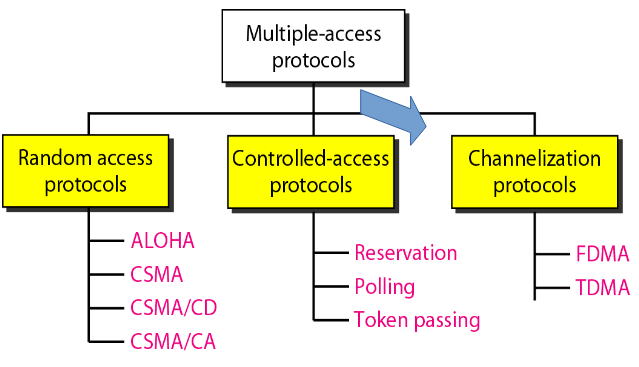

#### Protocolos MAC de particionamento de canal: TDMA

TDMA: Time Division Multiple Access

- acesso ao canal em "rodadas"
- cada estação recebe intervalo de tamanho fixo (tamanho = tempo transm. pacote) a cada rodada
- intervalos não usados ficam ociosos
- Ex: LAN de 6 estações, 1, 3, 4 têm pacote, intervalos 2, 5, 6 ociosos

#### Protocolos MAC de particionamento de canal: FDMA

FDMA: Frequency Division Multiple Access

- espectro do canal divido em bandas de frequência
- cada estação recebe uma banda de frequência fixa
- tempo de transmissão não usado nas bandas de frequência fica ocioso
- Ex: LAN de 6 estações, 1, 3, 4 têm pacote, bandas de frequência 2, 5, 6 ociosas

#### Protocolos de acesso aleatório

- Quando o nó tem um pacote a enviar
  - transmite na velocidade de dados R total do canal
  - sem coordenação a priori entre os nós dois ou mais transmitem -> "colisão"
- Protocolo MAC de acesso aleatório especifica:
  - como detectar colisões
  - como recuperar-se de colisões (ex. via retransmissões adiadas)
- Exemplos de protocolos MAC de acesso aleatório:
  - Slotted ALOHA
  - ALOHa
  - CSMA, CSMA/CD, CSMA/CA

#### Slotted ALOHA

- Suposições:
  - todos os quadros do mesmo tamanho
  - tempo dividio em intervalos de mesmo tamanho (tempo para transmitir 1 quadro)
  - nós começam a transmitir somente no início dos intervalos
  - nós são sincronizados
  - se 2 ou mais nós transmitem no intervalo, todos os nós detectam colisão
- Operação:
  - quando nó obtém quadro novo, transmitir no próximo intervalo
    - se não há colisão: nó pode enviar novo quadro no próximo intervalo
    - se há colisão: nó retransmite quadro em cada intervalo subsequente com probabilidade p (randômica) até que haja sucesso
- Pros:
  - único nó ativo pode transmitir continuamente na velocidade plena do canal
  - altamente descentralizado: somente intervalos nos nós precisam estar em sincronismo
  - simples
- Contras:
  - colisões, intervalos desperdiçados
  - intervalos ociosos
  - nós podem ser capazes de detectar colisão em menos tempo do que para transmitir pacote
  - sincronismo de clock

#### Eficiência do Slotted Aloha

- Eficiência: fração durante longo tempo de intervalos bem sucedidos (muitos nós, todos com muitos quadros para serem enviados)
- Suponha: N nós com muitos quadros a enviar, cada um transmitindo no intervalo com prababilidade p
- Prob de um nó ter sucesso em um intervalo = $p(1-p)^{N-1}$
- Prob de qualquer nó ter sucesso = $Np(1-p)^{N-1}$
- eficiência máxima: ache p * que maximiza $Np(1-p)^{N-1}$
- Na melhor das hipóteses: canal usado para transmissões úteis 37% do tempo!

#### ALOHA puro (não slotted)

- Aloha não slotted: mais simples, sem sincronismo
- quando quadro chega primeiro transmite imediatamente
- probabilidade colisão aumenta:
  - audro enviado em $t_{0}$ colide com outros quadros enviados em $[t_{0-1}, t_{0+1}]$
- Eficiência Aloha puro: 18%!

#### CSMA (Carrier Sense Multiple Access)

- CSMA (Acesso múltiplo com sensioramento da portadora):
  - Ouça o meio antes de enviar, se perceber canal ocioso, transmite quadro inteiro
  - Se perceber canal ocupado, adia transmissão
  - Reduz a possibilidade de colisão, mas não pode eliminar
  - Analogia humana: não interrompa os outros
- Civilidade:
  - Ouça antes de falar
  - Se alguém começa a falar ao mesmo tempo que você, pare de falar

#### Colisões CSMA

- Colisões ainda podem ocorrer: atraso de propagação significa que dois nós podem não ouvir a transmissão um do outro
- Colisão: tempo de transmissão de pacote inteiro desperdiçado
- nota: Distância e atraso de propagação determinal a probabilidade de colisão

#### CSMA/CD (Collision Detection)

- CSMA/CD: detecção de portadora e processo de interrupção como no CSMA:
  - colisões detectadas dentro de pouco tempo
  - as transmissões que colidem são abortadas, reduzindo desperdício do canal
  - detecção de colisão:
    - Fácil em LANs com fio (meio guiado): mede a intensidade do sinal, compara sinais transmitidos e recebidos
    - Difícil em LANs sem fio (meio não guiado): intensidade do sinal recebido abafada pela intensidade da transmissão local

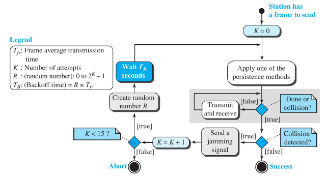

> O que uma estação deve fazer se estiver o canal ocioso?

- Aplicar um método: 1-persistente (ouve e envia imediatamente), não persistente (se ocupado, espera a mesma quantidade de tempo para enviar) e p-persistente (slots de tempo p para enviar)

#### "Revezando" protocolos MAC

- Protocolos MAC de particionamento de canal:
  - compartilham canal de modo eficaz e justo com alta carga
  - ineficaz com baixa carga: atraso no acesso ao canal, 1/n largura de banda alocada mesmo que apenas 1 nó ativo!
- Protocolos MAC de acesso aleatório
  - eficaz com baixa carga: único nó pode utilizar o canal totalmente
  - alta carga: sobrecarga de colisão
- "revezando" protocolos
  - procure o melhor dos dois mundos

#### Polling (seleção)

- nó mestre "convida" nós escravos a alterarem a transmissão
- normalmente usado com dispositivos escravos "burros"
- preocupações:
  - sobrecarga de seleção
  - latência
  - único ponto de falha (mestre)

#### Passagem de permissão

- Permissão de controle passada de um nó para o próximo sequencialmente
- mensagem de permissão
- preocupações
  - sobrecarga de permissão
  - latência
  - único ponto de falha (permissão)

#### Resumo de protocolos MAC

- particionamento de canal, por tempo e frequência
  - Time Division e Frequency Division
- acesso aleatório (dinâmico)
  - ALOHA, S-ALOHA, CSMA, CSMA/CD
  - percepção de portadora: fácil em algumas tecnologias (com fio), difícil em outras (sem fio)
  - CSMA/CD usado na Ethernet
  - CSMA/CA usado na 802.11
- revezamento
  - polling central e passagem de permissão
  - Bluetooth e token ring

## Camada de Enlace (Parte 2)

### Endereçamento MAC

- Endereço IP (Internet Protocol)
  - Endereço para interface usado na camada de rede (Internet)
- Endereço Media Access Control (MAC) (ou LAN ou físico ou Ethernet)
  - Função: levar um quadro de uma interface para outra interface conectada fisicamente (na mesma rede)
  - Endereço MAC tem 48 bits - 6 bytes - cada byte representando 2 algarismos hexadecimal
    - ROM da placa NIC, às vezes também configurável por software
    - Ex: 1A-2F-BB-76-09-AD

---

- Cada adaptador na LAN tem endereço de LAN exclusivo
- Endereço de broadcast = FF-FF-FF-FF-FF-FF

---

- Alocação do endereço MAC administrada pelo IEEE (Institute of Eletrical and Eletronics Engineers)
- Fabricante compra parte do espaço de endereços MAC (para garantir exclusividade)
- Analogia:
  - (a) Endereço MAC: documento
  - (b) Endereço IP: como o endereço postal
- Endereço MAC -> portabilidade:
  - pode mover placa de LAN de uma LAN para outra
- Endereço IP hierárquico NÃO portável: endereço depende da sub-rede IP à qual o nó está conectado

### Address Resolution Protocol (ARP)

- Pergunta: Como determinar endereço MAC de B sabendo apenas o endereço IP de B?
- Caa nó IP (hosp, roteado) na LAN tem a tabela ARP
- Tabela ARP: mapeamentos de endereço IP/MAP para alguns nós da LAN
  - <endereço IP; endereço MAC; TTL>
- TTL (Time To Live): tempo após o qual o mapeamento de endereço será esqueceido (normalmente, 20 minutos)

---

- Ao enviar o datagrama para B, o endereço MAC de B não está na tabela ARP de A
- O host A envia por broadcast (envia para todo mundo) um pacote de consulta ARP, contendo endereço IP de B:
  - Endereço MAC de destino = FF-FF-FF-FF-FF-FF
  - Todas as máquinas na LAN recebem a consulta ARP
- O host B recebe o pacote ARP, responde para o host A com seu endereço MAC:
  - Quadro enviado ao endereço MAC do host A (envio unicast)
- O host A salva em chace o par de endereços "IP-para-MAC" (host B), em sua tabela ARP, até a informação expirar:
  - Estado soft: informação que expira (desaparece) senão for renovada de tempos em tempos
- O ARP é um "plub-and-play":
  - nós criam suas tabelas ARP sem intervenção do administrador de rede

---

- Acompanhamento: enviar datagrama de host A para host B via roteador R
- Suponha que A saiba o endereço IP de B

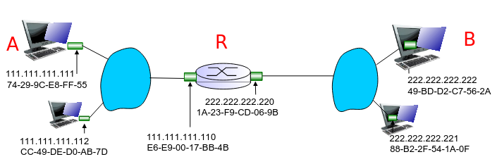

- Temos duas tabelas ARP no roteador R, uma para cada rede IP (LAN) - cada interface

#### ARP: Endereçamento: roteando para outra LAN

- Caminho: enviar datagrama A para B via R
  - Host A cria um quadro (frame) com o MAC do roteador como endereço de destino - quadro contém endereço IP de A e B

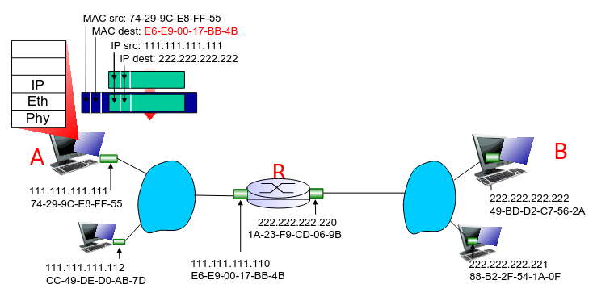

### Ethernet

#### Padrão: IEEE 802.3

Tecnologia de LAN com fio "dominante" devido:

- Primeira tecnologia de LAN utilizada em larga escala
- Tecnologia barata: R\$80 para uma placa NIC(Network Interface Card)
- Mais simples que as LANs de permissão, múltiplas velocidades
- Avanço na corrida da velocidade: 10 Mbps - 10 Gbps
- Bob Metcalfe e David Boggs inventaram a Ethernet

#### Ethernet: topologia física

- Topologia física de barramento até os anos 90:
  - todos os nós no mesmo domínio de colisão (colidiam uns com os outros)
- Hoje: topologia física em estrela prevalece o comutador ativo no centro:
  - cada "ponta" roda um protocolo Ethernet (separado) - nós não colidem uns com os outros

#### Estrutura do Quadro Ethernet

- Adaptador encapsula datagrama IP (ou outro pacote de protocolo da camada de rede) no quadro Ethernet


- Preâmbulo:
  - São 8 bytes sendo os 7 bytes com o padrão 10101010 e o último byte com padrão 10101011
  - Usado para sincronizar taxas de clock do receptor e emissor

- Endereços tem 6 bytes:
  - se o adaptador recebe quadro com endereço de destino combinando, ou com endereço de broadcast (p.e., pacote ARP), passa os dados do quadro ao protocolo da camada de rede
  - caso contrário, adaptador descarta quadro
- Tipo: indica o protocolo da camada superior (IP mas pode ser outros protocolos: Ex. Novell IPX)
- CRC: será verificado no receptor; se detectar erro, quadro é descartado (4 bytes)
- Tamanaho máximo de 1518 bytes

#### Ethernet: não confiável, sem conexão

- sem conexão: sem apresentação entre NICs de origem e destino
- não confiável: NIC de destino não envia confirmações à NIC de origem (enlace):
  - fluxo de datagramas passados à camada de rede pode ter lacunas (datagrama faltando)
  - lacunas serão preenchidas se aplicação estiver usnado TCP
  - caso contrário, aplicação verá laculas
- Protocolo MAC da Ethernet: CSMA/CD não slotted

#### Algoritmo CSMA/CD - Ethernet (802.3)

1. NIC recebe datagrama da camada de rede e cria quadro
2. Se NIC sentir canal ocioso, inicia transmissão do quadro; Se o canal ocupado, espera até estar ocioso, depois transmite
3. Se NIC transmitir quadro inteiro sem detectar outra transmissão, NIC terminou como quadro
4. Se NIC detectar outra transmissão enquanto transmite, aborta e envia sinal de congestionamento
5. Depois de abortar, NIC entra em backoff exponencial: após m colisões, NIC escolhe K aleatoriamente dentre {0, 1, 2, ..., 2$^{m-1}$}
   - NIC espera
   - K tempos, retorna à etapa 2

#### Detecção de colisão com CSMA/CD


#### Ethernet 802.3: camadas de enlace e física

- muitos padrões Ethernet diferentes
  - protocolo MAC e formato de quadro diferentes comuns diferentes velocidades:
    - 2 Mbps, 10 Mbps, 100 Mbps, 1 Gbps e 10 Gbps
  - diferentes meios na camada física: fibra, cabo, etc.

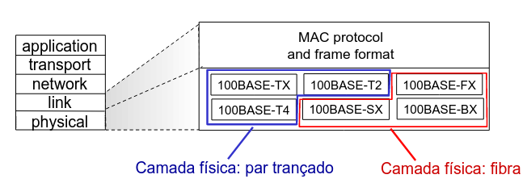

### Comutador para Ethernet (Switch)

- Dispositivo da camada de enlace: tem papel "ativo" (repasse e filtragem):
  - armazena e repassa os quadros Ethernet
  - examina o endereço MAC do quadro que chega, repassa seletivamente o quadro para um ou mais enlaces de saída quando o quadro deve ser repassado no segmento
  - Uso o algoritmo CSMA/CD para acessar o segmento
- Transparente
  - hospedeiros não sabem da presença do comutador
- Plug-and-play e autodidata
  - comutadores não precisam ser configurados

#### Comutador: múltiplas transmissões simultâneas

- hospedeiro tem conexão dedicada e direta com comutador
- comutadores mantêm (buffer) pacotes
- protocolo Ethernet usado em cada enlace:
  - sem colisões (full duplex)
  - cada enlace é o seu próprio domínio de colisão
- comutação: A-para-A' e B-para-B' podem transmitir simultaneamente, sem colisões:
  - não é possível com um hub
  - bridge funciona apenas para uma conexão

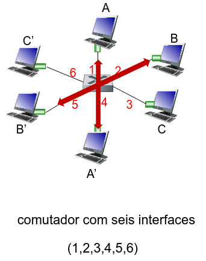

#### Tabela de comutação

- P: Como o comutador sabe que A' se encontra na interface 4, B' se encontra na interface 5?
- R: Cada comutador tem uma tabela de comutação em cada entrada:
  - endereço MAC do nó,
  - interface para alcançar nó,
  - horário.
- P: como as entradas são criadas e mantidas na tabela de comutação

#### Comutador: autodidata

- O comutador descobre quais nós podem ser alcançados por quais interfaces. Como?
- Quando quadro recebido, o comutador "aprende" local do emissor (segmento de LAN)
- Registra o par emissor/local na tabela de comutação

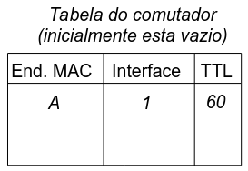

#### Comutador: filtragem/repasse de quadros

Quando quadro é recebido no comutador:

```portugol
1. Registra o endereço do enlace associado ao **host emissor**
2. Indexa a tabela de comutação usando o endereço MAC de destino
3. if entrada é encontrada na tabela
  then {
    if destino no segmento do qual o quadro chegou
      then remove o quadro (mesmo segmento)
    else repassa o quadro na interface indicada
  }
  else inunca (broadcast)
```

#### Autoaprendizagem, repasse: exemplo

- Se o destino do quadro é desconhecido (A'): inunda
- Se o local de destino A é conhecido: envio seletivo apenas um enlace

#### Interconectando comutadores

- Comutadores podem ser conectados juntos,

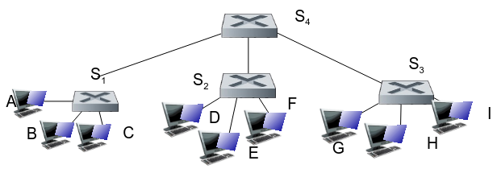

- Enviando do host A para o host G -> Como comutador S1 sabe repassar o quadro destina a G por S4 e S3?
- R: Autoaprendizagem! (funciona da mesma forma que no caso do único comutador!)

#### Comutadores versus roteadores

- Ambos dispositivos de armazenamento e repasse
- Comutadores são dispositivos da camada de enlace
- Comutadores mantêm tabelas de comutação, implementam filtragem e algoritmos de aprendizagem
- Roteadores: dispositivos da camada de rede (examinam cabeçalhos da camada de rede)
- Roteadores mantêm tabelas de roteamento e implementam algoritmos de roteamento

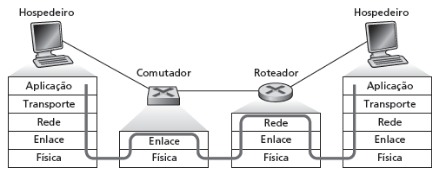

#### Rede institucional

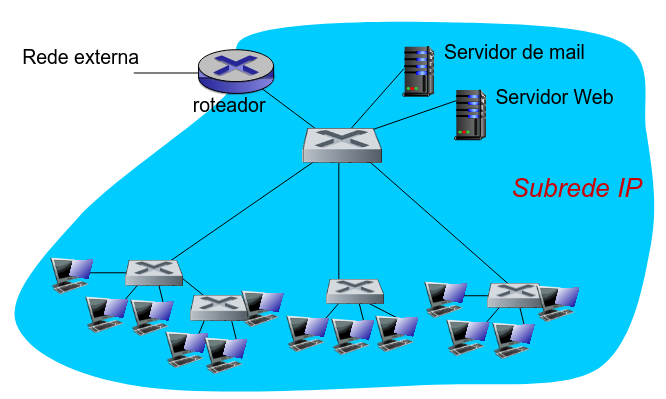

### VLANs

#### Motivação

- O que acontece se:
  - Usuário da CC muda para EE, mas quer se conectar ao comutador CC?
  - Único domínio de broadcast (camada 3):
    - todo tráfego da camada 2 (ARP) cruza a LAN inteira (questões de eficiência, segurança/privacidade)
  - Cada comutador de nível mais baixo tem apenas algumas portas em uso
  - Necessário segurança, eficiência

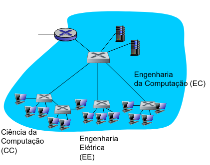

---

- VLAN (Virtual Local Area Network) baseada em porta: portas de comutador agrupadas (por software de gerenciamento de comutador) para um único comutador físico
- Comutadores admitindo capacidades de VLANs podem ser configurados para definir múltiplas LANs virtuais por uma única infraestrutura de LAN física

---

- isolamento de tráfego:
  - quadros de/para as portas 1-8 só podem alcançar as portas 1-8
  - também pode definir VLAN com base em endereço MAC das extermidades, em vez de porta do comutador
- inclusão dinâmica:
  - portas podem ser atribuídas dinamicamente entre VLANs
- repasse entre VLANs:
  - feito por roteamento (assim como em comutadores separados)
  - na prática, fornececores vendem uma combinação de comutador e roteador

#### VLANs e spanning multiple switches

- porta de tronco: carrega quadros entre VLANs definidas sobre vários comutadore físicos:
  - quadros repassados dentro da VLAN entre comutadores não podem ser quadros 802.1 comuns (devem ter informação de ID da VLAN)
  - protocolo 802.1q inclui campos de cabeçalho adicionais para quadros repassados entre portas de tronco

#### Formato de quadro 802.1Q na VLAN

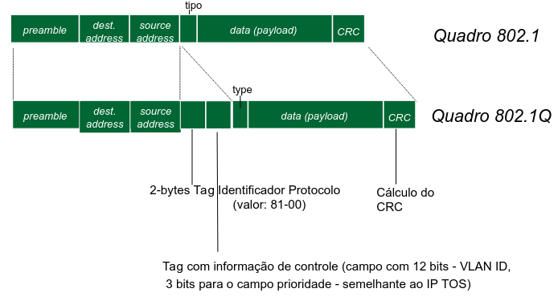

### Virtualização de enlace: MPLS

#### Virtualização de redes

- Virtualização de recursos: abstração poderosa na engenharia de sistemas:
  - Exemplos: memória virtual, dispositivos virtuais
- Máquinas virtuais:
  - Exemplo: Java
- Sistemas Operacionais IBM VM dos anos 1960 e 70

> Camadas de abstrações: não se preocupe com os detalhes da camada inferior, apenas trate das camadas inferiores de forma abstrata

---

- camada de inter-rede(IP):
  - Endereçamento: inter-ree aparece como unica entridade uniforme, apesar da heterogeneidade da rede local sujacente
  - Rede de redes
- Gateway:
  - Embute pacote inter-rede no formato de pacote local
  - Rota (no nivel de inter-rede) para proximo gateway

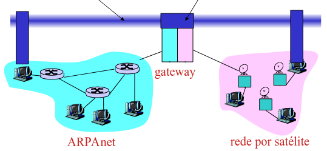

#### Arquitetura de inter-rede

- O que e virtualizado?
  - Duas camadas de endereçamento: inter-rede e rede local
  - Nova camada (IP) torna tudo homogêneo na camada da inter-rede
  - Tecnologia da rede local subjacente:
    - Cabo
    - Modem telefônico 56K
    - hoje: MLPS
    - "invisivel" na camada de inter-rede

#### Multiprotocol Label Switching (MPLS)

- MultiProtocol Label Switching (MLPS) separa redes por contra propria:
  - modelos de serviço
  - endereçamento
  - roteamento diferentes da Internet
- Uma tecnologia de chaveamento de pacotes que possibilita o encaminhamento e a comutação eficientes de fluxos de trafego atraves da rede
- Visto na Internet como enlace logico contectando roteadores IP:
  - Semelhante ao enlace discado que realmente faz parte de rede separada (rede telefônica)

---

- Objetivo: agilizar o repasse de IP usando um rotulo de tamanho fixo (em vez de endereço IP) para fazer o repasse dos dados:
  - ideias retiradas da Tecnica e Circuito Virtual (VC):
    - Lembre-se: datagrama IP ainda mantem endereço IP
      - O campo Label (rotulo) contem o valor
      - O campo Exp define a classe de serviço
      - O campo S (stack) suporta o enfileiramento de labels
      - O campo TTL (Time to Live) tem o mesmo papel que no IP

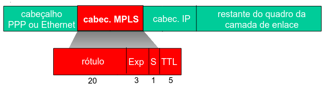

#### Roteadores capazes de usar MPLS

- Tambem conhecido como roteadores comutado por rotulo
- Encaminha pacote a interface de saida com base apenas no valor do rotulo (não inspeciona o endereço IP):
  - tabela de repasse MPLS distintas das tabelas de repasse do IP
- Protocolo e sinalização necessario para configurar repasse
  - repasse possivel ao longo de caminhos em que o IP sozinho não permitiria (roteamento especifico da origem)
  - Uso do MPLS para engenharia de trafego
- Deve coexistir com os roteadores baseados em IP

#### MPLS versus IP

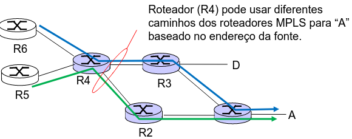

- Roteamento IP: caminho para o destino determinado pelo endereço de destino sozinho
- Roteamento MPLS: caminho para destino pode ser baseado no endereço da fonte ou destino

#### Tabelas de Repasse MPLS

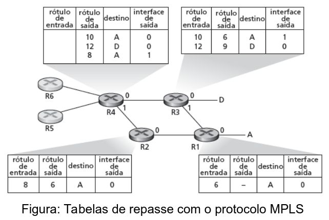

#### Resumo: Camada de Enlace do Meio Guiado

- Principios por tras dos serviços da camada de enlace de dados (parte 1):
  - Serviços
  - detecção e correção de erro
  - compartilhamento de canal de broadcast: acesso multiplo
- Instanciação e implementação de varias tecnologias da camada de enlace (parte 2):
  - endereçamento da camada de enlace
  - Ethernet
  - LANs, VLANs, comutadores
  - redes virtualizadas como camadas de enlace: MPLS

## Camada de Enlace: redes sem fio e mobilidade

### Redes sem fio

- Fundamentos:
  - Redes de computadores com meio não guiado:
    - Laptops, palmtops, PDAs e smartphones
    - Prometem acesso livre a Internet a qualquer hora
  - Ha dois desafios importantes (mas diferentes):
    - Sem fio: comunicação pelos enlaces sem fio
    - Mobilidade: tratar o usuario movel, que muda o ponto de conexão em uma rede de computadores

---

- Sem fio
  - Introdução as redes sem fio
    - Elementos
  - Caracteristicas de enlaces e redes sem fio
  - LANs sem fio 802.11 ("wi-fi")
- Mobilidade
  - Gerenciamento da mobilidade: principio
  - IP movel

### Elementos de uma rede sem fio

- Hospedeiros sem fio
  - laptop, PDA, telef IP
  - executam aplicações
  - podem ser estaticos ou moveis
  - sem fio nem sempre significa mobilidade
- Estação-base
  - normalmente conectada a rede com fio
  - Relay - responsavel por enviar pacotes entre rede com fio e hospedeiros sem fio em sua "area"
  - Exemplo: torres de celulas e pontos de acesso 802.11
- enlace sem fio
  - normalmente usado para conectar disp. moveis a estação base
  - tambem usado como enlace de backbone
  - protocolo de acesso multiplo coordena acesso ao enlace
  - diversas taxas de dados, distância de transmissão
- modo de infraestrutura
  - estação-base conectada hosp. moveis a rede com fio
  - transferência: hosp. movel muda de estação-base fornecendo conexão a rede com fio
- modo ad hoc
  - sem estações-base
  - nos so podem transmitir a outros nos dentro da cobertura do enlace
  - nos se organizam em uma rede: roteiam entre si mesmos

#### Caracteristicas de padrões de enlace sem fio

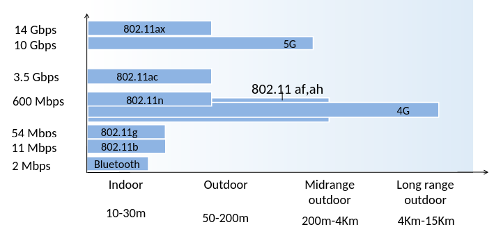

#### Taxonomia da rede sem fio

|                          | unico salto                                                                               | multiplos saltos                                                                                                  |     |     |
| ------------------------ | ----------------------------------------------------------------------------------------- | ----------------------------------------------------------------------------------------------------------------- | --- | --- |
| infraestrutura (p.e. APs | hospedeiro conecta-se à estação-base (WiFi) que se conecta à Internet maior (meio guiado) | hosp. pode ter de retransmitir por vários nós sem fio para se conectar à Internet maior: rede em malha            |     |     |
| sem infraestrutura       | sem estação-base, sem conexão com Internet maior (Bluetooth, redes ad-hoc)                | sem estação-base, sem conexão com Internet maior. Pode ter de retransmitir para alcançar outro nó sem fio - VANET |     |     |

### Caracteriticas de enlaces e redes sem fio

#### Caracteristicas do enlace sem fio

- Diferenças do enlace com fio:
  - redução fora do sinal: sinal de radio se atenua enquanto se propaga pela materia (perda de caminho)
  - interferências de outras fontes: frequência padrão de rede sem fio (ex. 2,4GHz - 802.11b) pode ser compartilhada por outros dispositivos (ex. telefone); dispositivos como motores tambem interferem
  - propagação multivias: sinal de radio reflete em objetos e no solo, chegando ao destino em momentos ligeramente diferentes
- O hospedeiro recebe um sinal eletromagnetico que e uma combinação da forma degradada do sinal enviado

---

- Isso pode tornar a comunicação por enlace sem fio muito mais "dificil" (ate mesmo ponto a ponto)
  - Ha sempre comunicação uam signal-to-noise ratio (SRN) (mediada em dB)
  - Maior SNR e mais facil extrair sinal do ruido (uma "coisa boa")
  - Para uma esquema de modulação entre a SNR versus BER (bit error rate)

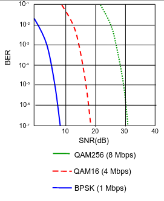

---

- A SNR versus BER (bit error rate) e um compromisso:
  - camada fisica: aumenta a potência do sinal, aumenta SNR, e diminui o BER
  - SNR: escolha a camada fisica que atende ao requisito BER dando vazão mais alto
- A SNR pode mudar com a mobilidade: A seleção dinâmica da tecnica de modulação da camada fisica pode ser usada para adaptar a tecnica e modulaçao as condições de canal
- Tecnica de modulação - Quadrature Amplitude Modulation (QAM) e Binary Phase Shift Keying (BPSK)


> Aumenta a potência: Aumenteo o gasto de enertia e interferência

---

- Multiplos remetentes e receptores sem fio criam problemas adicionais (alem do acesso multiplo)
- Problema do terminal oculto
  - B e A escutam um ao outro
  - B e C escutam um ao outro
  - A e C não podem ouvir uma ao outro
  - Significa que A e C não sabem de sua interferencia em B
- Atenuação do sinal
  - B e A escutam um ao outro
  - B e C escutam um ao outro
  - A e C não podem escutar um ao outro interferindo em B

#### Code Division Multiple Access (CDMA)

- Acesso multiplo por divisão de codigo (CDMA): pertence a familia de protocolos de particionamento de canais
- Unico codigo (code) atribuido para cada usuario, isto e, particionamento por conjunto de codigo (teoria de codigo - Shannon)
  - Todos os usuarios compartilham a mesma frequência, mas cada usuario tem a propria sequência "chipping" (codigo) para codificar os ados
  - Permite multiplos usuarios coexistir e transmite de forma simultânea com minima interferência (se os codigos são ortagonais)

---

- Cada bit que e enviado e codificado pela multiplicação do bit por sinal que muda em uma taxa
- Encoding: produto interno: (dados originais) X (sequência de chipping)
  - Exemplo: M = 8 - (1, 1, 1, -1, 1, -1, -1, -1)
    - Zim = di * cm
- Decoding: produto interno somado: (dados codificados) x (sequência de chipping)

#### CDMA encode/decode

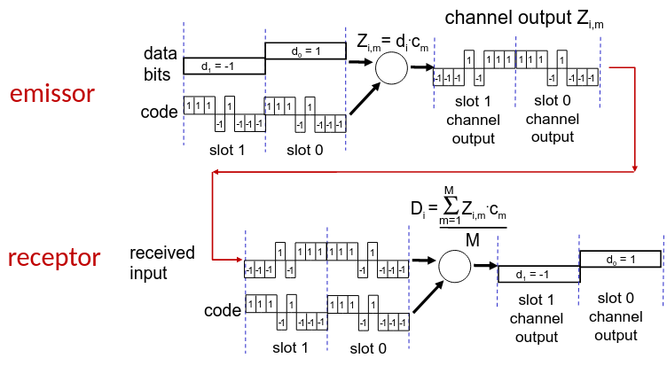

- Como pode um receptor CDMA recuperar os dados de um remetente quando esses bits de dados são combinados com bits a serem transmitidos por outros remetentes
- O CDMA funciona sob o princípio de que os sinais de bits transmitidos são aditivas

#### CDMA: interferência entre dois emissores

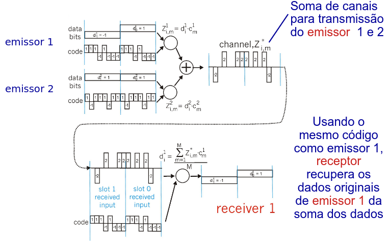

### LANs sem fio 802.11 ("Wi-Fi")

- A subcamada MAC é dividia em:
  - Distributed Coordination Function (DFC) - CSMA/CA
  - Point Coordination Function (PCF) - Rede de infraestrutura

    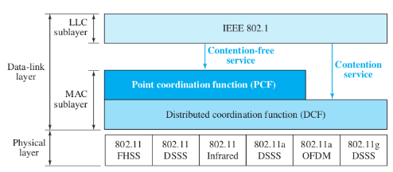
  - Direct Sequence Spread Spectrum (DSSS)
  - Frequency-hopping spread spectrum (FHSS)
  - Orthogonal frequency division multiplexing (OFDM)

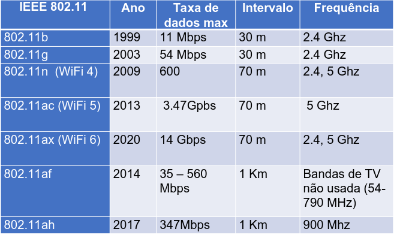

---

- Padrão 802.11b
  - Espcetro do sinal não licenciado de 2,4 - 5GHz
  - Vazão: até 11 Mbps
  - Técnica Direct Sequence Spread Spectrum (DSSS): a camada física com a banda de 80 MHz dividida em 14 canais de 22MHz, com 3 dos 14 canais sendo totalmente não sobrepostos

  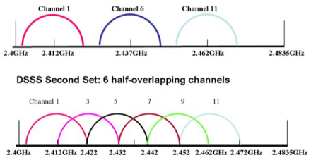
  - Os dados são enviados por um destes canais de 22MHz sem saltos para outras frequências
  - Todos os hospedeiros usam o mesmo código de chipping (DSSS)
- 802.11a: intervalo 5 - 6 GHz (5.725-5.850 GHz) até 54 Mbps (OFDM)
- 802.11g: intervalo 2.4 - 5 GHz até 54 Mbps (OFDM)
- 802.11n: múltiplas antenas intervalo 2.4 - 5 GHz até 200 Mbps (OFDM)
- 802.11ac: 5 GHz até 1300 Mbps (Multiple Input, Multiple Output (MIMO) - OFDM)

- Todos usam o padrão CSMA/CA para acesso múltiplo
- Todos têm versões de estação-base e modelo rede ad-hoc

---

#### Arquitetura de LAN 802.11

- Hospedeiro sem fio se comunica com estação-base
- Estação-base = ponto de acesso (AP)
- Basic Service Set (BSS) (ou "célula"), no modo de infraestrutura, contém:
  - hospedeiros sem fio
  - ponto de acesso: estação-base
  - modo ad hoc: apenas hosts

#### 802.11: Canais e Associação

- O 802.11b no espectro tem 14 canais em diferentes frequências (intervalo de 2,4 GHz - 2,4835 GHz)
  - Administrador escolhe frequência para o AP
  - Possível interferência: canal pode ser o mesmo daquele escolhido pelo AP vizinho
- O hospedeiro: precisa associar-se a um AP:
  - Há uma varredura de canais, escutando quadros de sinalização contendo o nome do AP (SSID - service set identifier) e o endereço MAC
  - Seleciona AP para associar-se
  - Pode realizar autenticação
  - Normalmente executa um serviço de DHCP (Dynamic Host Configuration Protocol) para obter endereço IP na rede do AP

#### 802.11: varredura passiva/ativa

Varredura passiva:

1. Quadros de sinalização enviados dos APs
2. Quadro de solicitação de associação enviado: host H1 para AP selecionado
3. Quadro de resposta de associação enviado: H1 para AP selecionado

Varredura ativa:

1. Broadcast de quadro de solicitação de investigação de host H1
2. Quadro de resposta de investigações enviado de APs
3. Quadro de resposta de associação enviado: H1 para AP selecionado
4. Quadro de resposta de associação enviado: AP selecionado para H1

#### IEEE 802.11: Acesso Múltiplo

- Evitar colisões: dois ou mais hospedeiros transmitindo ao mesmo tempo
- O 802.11 com a técnica CSMA - detecta antes de transmitir
  - não colide com transmissão contínua de outro nó
- O 802.11: "sem" detecção de colisão
  - difícil de receber (sentir colisões) na transmissão devido a sinais recebido fracos (desvanecimento)
  - não pode sentir todas as colisões em qualquer caso: terminal oculto, desvanecimento
  - objetivo: "evitar colisões" com o CSMA/C(ollision)A(voidance)

#### Protocolo IEEE 802.11: CSMA/CA

Remetente

1. Se sentir canal ocioso para o DIFS(Distributed Inter-frame Space) então:
   - transmite quadro inteiro (sem uso do "CD")
2. Se sentir canal ocupado então
   1. inicia o tempo aleatório de backoff
   2. temporizador conta de forma regressiva enquanto canal está ocioso
   3. transmite quando temporizador expira
   4. Se não há ACK, aumenta intervalo de backoff aleatório e repete passo (2)

Receptor

- Se quadro recebido OK: retorna ACK após SIFS (Short Inter-frame Spacing)
- O ACK é necessário devido ao problema de terminal oculto

#### Evitando colisões (mais)

- ideia: permite que remetente "reserve" o canal em vez de acesso aleatório aos quadros de dados: evitar colisões de quadros de grande quantidade de dados

```portugol
1. Remetente primeiro transmite pequenos pacotes request-to-send (RTS) à base station (BS) usando CSMA
2. Os RTSs ainda podem colidir uns com os outros (mas são curtos)
3. Equipamento BS envia por broadcast o quadro clear-to-send (CTS) em resposta ao RTS
4. O CTS é escutado por todos os nós
5. Remetente transmite quadro de dados
6. Outros estações adiam as transmissões
```

> Evite colisões de quadro de dados completamente usando pequenos pacotes de reserva!

#### Prevenção de colisão: troca RTS-CTS

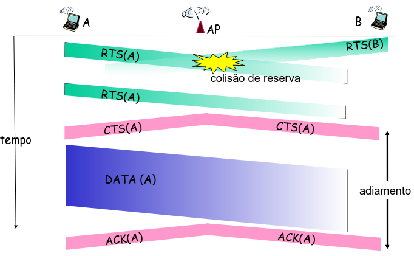

