# Arquitetura de Redes TCP/IP

- Objetivo: mostrar a "atmosfera" e a terminologia das redes TCP/IP:
  - usar a internet como exemplo

## Introdução (Parte 1)

### O que é a internet? (visão basica)

- Milhões de dispositivos de computação conectados: hospedeiros = sistemas finais
  - rodando aplicações de rede
- Enlaces de comunicação (meios em que a informação navega, é transportada)
  - fibra, cobre, radio, satelite
  - taxa de transmisão = largura de banda
- roteadores: encaminham pacotes (pedaços de dados)

#### Internet: uma visão de serviço

- Infraestrutura de comunicação, possibilita aplicações distribuidas
  - Web, VoIP, e-mail, jogos, e-commerce, compartilhamento de arquivos, streaming de video, multimidia
- Servições de comunicação fornecidos as aplicações:
  - entrega de dados confiavel de origem ao destino
  - entrega de dados pelo "melhor esforço" (não confiavel)

### O que é um protocolo?

#### Protocolo

- protoculos humanos:
  - "que horas são?"
  - "tenho uma pergunta"
- Introduções:
  - mensagens especificadas enviadas
  - açoes especificas tomadas quando mensagens recebidas são traduzidas
- Define:
  - O formato e a ordem das mensagens trocadas entre duas ou mais entidades comunicantes
  - As ações tomadas na transmissão e/ou recebimento de uma mensagem ou outro evento

### Borda de Rede

#### Visão da estrutura e rede

- borda de rede: servidores de aplicações e hospdeiros
- redes de acesso, meios fisicos: enlaces de comunicação com e sem fio
- nucleo da rede

#### Borda da rede

- sistemas finais (hospedeiros):
  - executar programas de aplicação
  - p.e. Web, e-mail
  - na "borda da rede"
- modelo cliente/servidor
  - hospedeiro cliente solicita, recebe serviço de servidor sempre ativo
  - p.e. navegador/servidor Web; cliente/servidor de e-mail
- modelo peer-peer
  - uso minimo (ou nenhum) de servidor dedicados
  - p.e. Skype, BitTorrent

#### Redes de acesso e meios fisicos

- Como conectar sistemas finais ao roteador da borda?
  - redes de acesso residencial
  - redes de acesso institucional (escola, empresa);
  - redes de acesso movel (WiFi, 4g e 5g)

#### Digital Subscriber Line (DSL)

- Usa infraestrutura de telefone para central DSLAM (digital subscriber line access multiplexer)
- Taxas de transmissão:
  - downstream: 24Mbps e 52Mbps
  - upstream: 3,5 ate 16Mbps
- Linha fisica dedicada central telefonica

#### Modem a cabo

- Multiplexação por divisão de frequência: diferentes canais transmitem em diferentes bandas de frequências
- Sistema Hybrid Fiber Coax (HFC):
  - Assimetrico: 30Mbps para downstream e 2 Mbps para a taxa de upstream
- Rede a cabo e fibra inseridos na residência para o roteador do ISP
  - As casas compartilham o acesso para as Centrais
  - Diferente do DSL (no qual tem link dedicado com a central)

#### Rede de acesso sem fio

- compartilhado conecta sistema final ao roteador
  - via estação base, tambem conhecida como "ponto de acesso"
- Wireless LANs:
  - 802.11 b/g/n (WIFI): 11, 54 e 450 Mbps como taxa de transmissão
- Wide-area wireless access
  - Fornecido pela empresa de telecom: 1 and 10 Mbps
  - 3G, 4G

#### Acesso a Internet por Ethernet

- normalmente usado em empresas, universidade etc.
- Ethernet a 10 Mbps, 100 Mbps, 1 Gbps e 10 Gbps
- hoje, os sistemas finais normalmente se conectam ao comutador Ethernet

#### Host: envio de pacotes de dados

- Funções do hospedeiro:
  - Pega mensagem da aplicação;
  - Divide em partes, conhecido com pacotes de tamanho L bits;
  - Transmite pacotes para a rede em uma taxa de transmissão de R;
  - Taxa do enlace de transmissão, capacidade e largura de banda
- Atraso na tranmissão de pacotes = Tempo necessario para transmitir L bits do pacote dentro o enlace = L (bits) / R (bits/sec)

#### Meios fisicos

- bit: propaga entre pares de transmissor/receptor
- enlace fisico: o que fica entre transmissor e receptor
- meio guiado:
  - sinais se propagam em meio solido: cobre, fibra e coaxial
- meio não guiado:
  - sinais se propagam livremente, p.e., sinal de radio
- Par Trançado (TP)
  - dois fios de sobre isolados
    - categoria 3: fios de telefone tradicionais, Ethernet a 10 Mbps
    - categoria 5: Ethernet a 100 Mbps
    - categoria 6: 1 Gbps

#### Meio fisico: cabo coaxial e fibra (meio guiado)

- cabo coaxial:
  - dois condutores de cobre concêntricos
  - Bidirecional
  - banda base:
    - unico canal no cabo
    - Ethernet legado (automação)
  - banda larga:
    - multiplos canais no cabo
    - HFC
- cabo de fibra otica
  - fibra de vidro conduzindo pulsos de luz
  - cada pulso um bit
  - operação em alta velocidade
    - tranmissão em alta velocidade ponto a ponto

#### Meio fisico: radio (meio não guiado)

- Radio
  - Sinal transportado no espectro eletromagnetico
  - Nenhum "fio" fisico
  - Bidirecional
  - Efeitos no ambiente de propagação
    - reflexão
    - obstrução por objetos
    - interferência
- Tipo de sinal:
  - micro-ondas terrestre
    - canais de 45 Mbps
  - LAN
    - 11 MBPS, 54 Mbps
  - area ampla
    - celular 3G: 1 Mbps
  - satelite
    - canal de Kbps ate 45Mbps (ou multiplos canais menores)
    - atraso fim a fim de 270 ms
    - geoestacionario

### Nucleo da rede

#### O nucleo a rede

- Malha de roteadores interconectados
- Questão: como os dados são transferidos pela rede?
- Comutação de circuitos

#### Nucleo da rede: comutação de circuitos

- recursos de rede (p.e., largura de banda) divididos em "pedaços"

#### Comutação de circuitos: FDM e TDM

- FDM: ocorre a multiplexação por divisão de frequência
- TDM: ocorre a multiplexação por divisão de tempo, usuario recebe toda frequência em um periodo de tempo

#### Nucleo da rede: comutação de pacotes

- comutação e pacotes: dados enviados pela rede em "pedaços" discretos
- Encaminham pacotes de um roteador para o seguinte, atraves de ligações no caminho da origem ate o destino
- cada pacote transmitido na capacidade total do enlace

#### Comutação de pacotes: store-and-forward

- Taxa de L/R segundos para transmitir (push out) o pacote de L bits no enlace em R bps
- Store-and-forward: pacote inteiro deve chegar ao roteador antes que possa ser transmitido no proximo enlace
- Atraso "fim-a-fim" = tempo 2L/R o hospedeiro tera recebido o 1º

#### Comutação de pacotes: Atraso de fila e perda

- Enfileramento e perde: se a taxa de chegada (em bits) para o enlace excede a taxa de transmissão do enlace durante um periodo de tempo:
  - os pacotes irão criar uma fila e irão aguentar para serem transmitidos no enlace
  - os pacotes podem ser "dropped" (perdidos) se a memoria (buffer) for preenchida

#### Comutação de pacotes: Funções

- Roteamento: determina a rota de origem e destino tomada por pacotes
- Encaminhamento: mover os pacotes da entrada do roteador para a saida do roteador apropriado

#### Comutação de pacotes versus Comutação de Circuitos

- Coputação de pacote permite mais usuarios usar a rede de computadores

- Exemplo:
  - Link (enlace): 1Mbps
  - Cada usuario:
    - 100Kbps quando ativo
    - Ativo 10% do tempo
  - Comutação circuito:
    - 10 usuarios
  - Comutação pacote:
    - Quando ha 35 usuarios, probabilidade > 10 ativo

#### A comutação de pacotes e a "grande vencedora"?

- otima para dados em rajadas
- compartilhamento de recursos
- mais simples, sem configuração de chamada
- congestionamento excessivo: atraso e perda de pacotes:
  - Demanda protocolos para transferência de dados confiavel e controle de congestionamento
- Como fornecer comportamento do tipo circuito?
  - Ter largura de banda garantida necessaria para aplicações e audio/video
  
> ainda um problema não resolvido

- Exemplo: Analogia humana - recursos reservados (comutação de circuitos) versus alocação por demanda (comutação de pacotes)?

#### Estrutura da Internet: rede de redes

> Tendo dados gerado em milhões de ISPs de acesso, como conecta-los entre si?

- Solução: Aproximadamente hierarquica
- No centro tem os ISPs de "nivel 1" (exemplo: Verizon, Spring, AT&T, etc)
- Tratam os ISPs em niveis iguais

#### ISPs de nível 1

- Sprint

#### ISPs de nível 2

- conectam a um ou mais ISPs de nível 1, possivelmente também a outros ISPs de nível 2
- ISP de nível 2 paga ao ISP nível 1 por conectividade com restante da internet
- ISPs de nível 2 também olham de forma privada uns para os outros

#### ISPs de nível 3 e ISPs locais

- rede do último salto ("acesso"), mais próxima dos sistemas finais
- ISPs locais e de nível 3 são clientes de ISPs de camada mais alta conectando-os ao restante da Internet

## Introdução (Parte 2)

Objetivo

- Mostrar a "atmosfera" e a terminologia das redes TCP/IP

### Desempenho

#### Como ocorre a perda e o atraso?

- Pacotes se enfileiram nos buffers dos roteadores:
  - Devido a taxa de chegada dos pacotes ao enlace ultrapassarem a capacidade de saida do enlace
- Pacotes se enfileiram e esperam por sua vez

#### Quatro fontes de atraso do pacote

- Dnodal = Dproc + Dqueue + Dtrans + Dprop
  
1. (Dproc) processamento nodal:
   1. verificação de erros de bits
   2. Determinar o enlace de saida
   3. Normalmente em microssegundos
2. (Dqueue) enfileiramento
   1. tempo esperando para transmissão do enlace de saida
   2. depende do nivel de congestionamento do roteador
3. (Dtrans) atraso de transmissão:
   1. R = largura de banda do enlace (bps)
   2. L = tamanho do pacote(bits)
   3. Tempo para enviar bits no enlace por L/R
4. (Dprop) atraso de propagação:
   1. d = tamanho do enlace fisico
   2. s = velocidade de propagação no meio (~2x10⁸)
   3. atraso de propagação = d/s

> Nota: s e R são quantidade muito diferentes!

#### Comparação entre atraso de transmissão e propagação: analogia da caravana

- Carros se propagam a 100 km/h
- Cabines de pedagio levam 12 segundos para atender um carro (tempo de transmissão)
- Analogia: Carro ~ bit e caravana ~ pacote
- Quanto tempo leva para a caravana formar fila antes da 2º cabine?
  - O tempo para "empurrar" a caravana inteira pela cabine para proxima estrada:
    - 10 carros / (5 carros / minuto) = 2 minutos
  - Tempo para o ultimo carro se propagar da 1º a 2º cabine de pedagio:
    - 100 km com 100 km/h = 1h
  - Resposta: 62 minutos
- Se os carros se "propagam" a uma velocidade de 1000 km/h
- Cabine leva 1 minuto para atender um carro
- Os carros chegarão a 2º cabine antes que todos os carros sejam atendidos na 1º cabine?
  - O 1º carro (bit) da caravana (pacote) pode chegar a 2º cabine (roteador) antes que a caravana seja totalmente transmitida na 1º cabine (roteador)?
  - Se 1000 km/h -> temos 6 minutos para 100km
  - Tambem devemos considerador 1 minuto pela cabine

#### Atraso de enfileiramento

- R = largura de banda do enlace (bps)
- L = tamanho do pacote (bits)
- a = taxa media de chegada de pacote
  
> Intensidade e trafego -> La/R

- La/R ~ 0 : pequeno atraso de enfileiramento medio
- La/R <= 1 : atrasos tornam-se grandes (rajadas)
- La/R >= 1 : mais "trabalho" chegando do que se pode ser atendido, atraso medio infinito

#### Atrasos e rotas "reais" da Internet

Como são os atrasos e perdas "reais" da Internet?

- Programa Traceroute: fornece medida do atraso da origem ao roteador ao longo do caminho de fim a fim da Internet para o destino
- Para todo i:
  - envia três pacotes que alcançarão o roteador i no caminho para o destino
  - roteador i retornara os pacotes ao emissor
  - emissor temporiza o intervalo entre a transmissão e a resposta

#### Perda de pacote

- Fila (ou buffer) antes do enlace tem capacidade finita
- Pacote chegando a fila cheia e descartado (ou perdido)
- Ultimo pacote pode ser retransmitido pelo no anterior, pela origem ou de forma nenhuma

#### Vazão (Throughput)

- Vazão: taxa (bits/unidade de tempo) em que os bits são transferidos entre emissor/receptor
  - instântanea: taxa em determinado ponto no tempo
  - media: taxa por periodo de tempo maior

#### Vazão

- Rs < Rc Qual e a vazão media de fim a fim? Rs
- Rs > Rc Qual e a vazão de fima a fim? Rc
  
> enlace de gargalo: enlace no caminho de fim a fim que restringe a vazão de fim a fim

#### Vazão: cenario da Internet

- Pratica: Rc ou Rs normalmente e um gargalo
- A vazão de fim a fim por conexão = min(Rc, Rs, R/10)

### Camadas de protocolo, modelos de serviço

#### "Camadas" de protocolo: Revisão

Redes são complexas!

- muitas "partes":
  - hospedeiros
  - roteadores
  - enlaces de varios meios fisicos
  - aplicações
  - protocolos
  - hardware

- Camadas: cada etapa implementa um serviço
  - por meio de suas proprias ações internas na camada
  - contando com serviços fornecidos pela camada abaixo

#### Por que usar camadas?

- E um sistema complexo:
  - estrutura explicita permite identificação e relação entre partes complexas do sistema
  - modelo de referência em camadas
- Modularização facilita manutenção e atualização do sistema:
  - mudança de implementação do serviço da camada transparente ao restante do sistema
  - Ex. mudanças no procedimento de porta não afeta o restante do sistema
- O uso da camada e considerado prejudicial
  - Ex. pode ocorrer a duplicação do serviço

#### Pilha de protocolos da Internet

- aplicação: suporte a aplicações de rede
  - FTP, SMTP e HTTP
- transporte: transferência de dados processo-processo
  - TCP e UDP
- rede: roteamento de datagramas da origem ao destino
  - IP e protocolos de roteamento
- enlace: transferência de dados entre elementos vizinhos da rede
  - PPP e Ethernet
- fisica: bits "nos fios"

#### Modelo de referência ISO/OSI

- apresentação: permite que as aplicações interpretem o significado dos dados
  - Ex. criptografia, compactação, conveções especificas da maquina
- session: sincronização, verificação, recuperação de troca de dados
- Pilha da Internet "faltando" essas camadas
  - Estes serviços, se necessarios, devem ser implementados na aplicação
  - Se necessario a aplicação

### Segurança

#### Segurança de rede

- o campo da segurança de rede trata de:
  - como defender as redes contra ataques
  - como maus sujeitos atacam as redes de computadores
  - como projetar arquiteturas imunes a ataques
- Internet não foi criada originalmente com (muita) segurança em "mente"
  - visão original: "um grupo de usuarios mutuamente confiaveis conectados a uam rede transparente"
  - projetistas de protocolos da Internet brincando de "contar novidades"
  - considerações de segurança em todas as camadas!

#### Maus sujeitos podem colocar malware em hospedeiros via Internet

- Malware (programas maliciosos) pode entrar em um hospedeiro por virus, worm ou cavalo de troia
- O malware do tipo spyware pode registrar toques de teclas, sites visitados na Web, enviar informações para sites de coleta
- Um hospedeiro infectado pode ser "alistado" em um botnet, usado para spam e ataques de DoS (negação de serviços)
- O malware normalmente e auto replicavel: de um hospedeiro infectado, busca entrada em outros hospedeiros

- cavalo de Troia
  - parte oculta de algum software util
  - hoje, normalmente em uma pagina Web (Active-X, plug-in)
- virus
  - infecção ao receber objeto (p.e., anexo de um e-mail), executando ativamente
  - autorreplicavel: propaga-se para outros hospedeiros e usuarios
- worm:
  - infecção recebendo passivamente objeto a ser executdo
  - Auto replicavel: propaga-se para outros hospedeiros, usuarios

#### Maus sujeitos podem atacar servidores e infraestrutura de rede

- Denial of Service (DoS): atacantes deixam recursos (servidor, largura de banda) indisponiveis ao trafego legitimo, sobrecarregando recurso com trafego

1. selecionar o alvo
2. invadir os hospedeiros na rede (ver botnet)
3. enviar pacotes para o alvo a partir dos hospedeiros compremetidos

#### Maus sujeitos podem farejar pacotes

- Farejamento de pacotes:
  - meio de broadcast (Ethernet compartilhada, sem fio)
  - interface de rede analisa (le/registra) todos os pacotes (p.e., incluindo senhas!) passando por
- Software Wireshark usado para laboratorio do farejador de pacotes (gratuito)

#### Maus sujeitos podem usar endereços de origem falso

- IP spoofing: enviar pacote com endereço de origem falso

## Camada de Enlace (Parte 1)

### Introdução e serviços

- Algumas terminologias:
  - hospedeiros e roteadores são nós
  - canais de comunicação que se conectam a nós adjacentes pelo caminho de comunicação são enlaces
    - enlaces com fio
    - enlaces sem fio
    - LANs
  - Os dados na camada 2 é denominado um quadro, que irá encapsular os datagrama

> Camada de enlace de dados: responsabilidade de transferir um datagrama de um nó ao nó adjacente por um enlace

- Datagrama é transferido por diferentes protocolos de enlace sobre diferentes enlaces (links):
  - Ex. Ethernet no primeiro link, frame relay no link intermediário e 802.11 no último link
- Cada protocolo de enlace fornece diferentes serviços:
  - Ex: Ter ou não verificação de erro na camada de enlace

---

- Dois equipamentos fisicamente conectados:
  - host-roteador, roteador-roteador, host-host
- A unidade de dados: quadro (frame)

---

#### Serviços da camada de enlace

- Enquadramento, acesso ao enlace:
  - encapsula datagrama no quadro, incluindo cabeçalho, trailer;
  - acesso ao canal de meio compartilhado
  - endereços "MAC" usados nos cabeçalhos de quadro para identificar origem e destino:
    - diferente do endereço IP;
- Entrega confiável entre nós adjacentes:
  - raramento usado em enlace com pouco erro de bit (fibra, alguns pares trançados)
  - enlaces sem fio: altas taxas de erro
- controle de fluxo: controle entre nós de emissão e recepção adjacentes
- detecção de erro:
  - erros causados por atenuação de sinal e ruído
  - receptor detecta presença de erros
    - pede ao remetente para retransmitir ou descarta quadro
- corrção derro: receptor identifica e corrige erro(s) de bits sem lançar mão da retransmissão
- half-duplex e full-duplex: com half-duplex, os nós nas duas extremidades do enlace podem transmitir, mas não ao mesmo tempo

#### Onde é implementada a camada de enlace?

- em todo e qualquer hospedeiro
- A camada de enlace implementada no "adaptador" (ou placa de interface de rede, NIC)
  - placa Ethernet, placa 802.1
  - implementa camada de enlace e física
- Conectada aos barramentos do sistema do hospedeiro
- Combinação de hardware, software e firmware

#### Comunicação entre adaptadores

- lado emissor:
  - encapsula datagrama no quadro
  - inclui bits de verificação de rro, entrega confiável, controle de fluxo etc
- lado receptor:
  - procura erros, controle de fluxo etc;
  - extrai datagrama, passa para camada superior no lado receptor

### Detecção e correção de erros

#### Técnicas de detecção e correção de erros

- Os bits de detecção e correção de erros (error-detection and correction - EDC) são inseridos de forma redundantes
  - D = Dados protegidos por verificação de erro, podem incluir campos de cabeçalho;
- Detecção de erro não é 100% confiável:
  - protocolo tenta descobrir, mas nem sempre consegue;
  - quanto maior campo EDC gerado melhor a detecção e correção

#### Verificações de paridade

- Paridade de único bit:
  - Detecta erro de um único bit
  - d + 1 bits
- Paridade bidimensional:
  - Detecta e corrige erro de único bit

#### Soma de verificação da Internet [RFC 1071]

- detectar "erros" (ex. bits invertidos) no pacote transmitido (nota: usada normalmente na camada de transporte)
- Emissor
  - trata o conteúdo do segmento como sequência de inteiros de 16 bits
  - soma de verificação: adição (soma no complemento de 1) do conteúdo do segmento
  - emissor coloca o valor da soma da verificação no campo de soma de verificação
  - Ex. na camada de transporte no protocolo User Datagram Protocol (UDP)
- Receptor:
  - calcula a soma de verificação do segmento recebido
  - verifica se soma é igual ao valor do campo de "soma de verificação"
    - NÃO - erro detectado
    - SIM - nenhum erro detectado

---

- O método baseia-se em redundância
- Ex. Suponha que necessite transmitir uma lista de 5 número no intervalo de 4 bits para representação (2⁴) desses valores
- Serão enviados os número e a soma:
  - Dado o conjunto de números: 7, 11, 12, 0, 6
  - Devemos considerar: 7, 11, 12, 0, 36
  - Se os dados devem ser escritos como 4 bits (2⁴), o checksum representa um valor menor que 15
  - Solução para o valor é usar o complemento de um
- Receptor soma e compara com o último valor (checksum)

---

- Complemento de Um:
  - Se o número (36) tiver mais de n bits (2⁴), os bits extras mais à esquerda precisa ser adicionado aos n bits mais à direita (wrapping)
  - O emissor então comlementa o resultado para obter o valor de checksum = 9, o qual é 15 - 6
  - Note que 6 = (0110)² e 9 = (1001)²

---

- Na aritmética de um complemento, temos dois 0s: um positivo e um negativo, que são complementos um do outro. O número decimal 6 = 0110 (inverte todos os bits)
- Receptor soma todos os dados, inclusive o checksum (7, 11, 12, 0, 6, 9) soma = 45 (bin 101101) -> 1110 (dec. 15) e invert 0 (checksum esta ok)

#### Verificação de redundância cíclica (cyclic redundancy check - CRC)

- Seja os bits de dados, D, como um número binário a ser enviado
- Escolha o padrão de bits r (bits adicionais) + 1 (gerador) -> G de r+1 bits
- Objetivo: escolher r bits de CRC, R, tal que:
  - <D, R> exatamente divisível por G (módulo 2)
  - receptor sabe G, divide <D, R> por G. Se o resto difere de "0": erro detectado!
  - pode detectar todos os erros em rajada menores que r + 1 bits
- muito usada na prática (Ethernet e 802.11 WiFi)

### Protocolos de acesso múltiplo

#### Enlaces e protocolos de acesso múltiplo

- Dois tipos de "enlaces":
  - ponto a ponto
    - PPP para acesso discado
    - enlace ponto a ponto entre comutador Ethernet e hospedeiro
  - broadcast (fio ou meio compartilhado)
    - Ethernet à moda antiga
    - HFC (Hybrid fiber-coaxial) em redes de acesso baseada em cabos
    - LAN sem fio 802.11

---

- único canal de broadcast compartilhado
- duas ou mais transmissões simultâneas por nós: interferência
- colisão se o nó recebe dois ou mais sinais ao mesmo tempo
- protocolo de acesso múltiplo
  - algoritmo distribuído que determina como os nós compartilham canal, ou seja, determinam quando o nó pode transmitir
  - comunicação sobre compartilhamento de canal deve usar o próprio canal
  - não há canal fora-de-banda para coordenação

#### Protocolos de acesso múltiplo ideal

- Canal de broadcast de velocidade R bps

1. quando um nó quer transmitir, ele pode enviar na velocidade R
2. quando M nós querem transmitir, cada um pode enviar na velocidade média de transmissão R/M
3. totalmente descentralizado:
   - Nenhum nó especial para coordenar transmissões
   - Nenhuma sincronização de clocks, intervalos
4. simples

#### Protocolos MAC: uma taxonomia

- Três classes gerais:
  - Particionamento de canal
    - divide o canal em "pedaços menores" (intervalos de tempo, frequência, código)
    - aloca pedaço ao nó para uso exclusivo
  - Acesso aleatório
    - canal não dividido, permite colisões, "recuperação" de colisões
  - "Revezando"
    - os nós se revezam, mas os nós com mais a enviar podem receber mais tempo


#### Protocolos MAC de particionamento de canal: TDMA

TDMA: Time Division Multiple Access

- acesso ao canal em "rodadas"
- cada estação recebe intervalo de tamanho fixo (tamanho = tempo transm. pacote) a cada rodada
- intervalos não usados ficam ociosos
- Ex: LAN de 6 estações, 1, 3, 4 têm pacote, intervalos 2, 5, 6 ociosos

#### Protocolos MAC de particionamento de canal: FDMA

FDMA: Frequency Division Multiple Access

- espectro do canal divido em bandas de frequência
- cada estação recebe uma banda de frequência fixa
- tempo de transmissão não usado nas bandas de frequência fica ocioso
- Ex: LAN de 6 estações, 1, 3, 4 têm pacote, bandas de frequência 2, 5, 6 ociosas

#### Protocolos de acesso aleatório

- Quando o nó tem um pacote a enviar
  - transmite na velocidade de dados R total do canal
  - sem coordenação a priori entre os nós dois ou mais transmitem -> "colisão"
- Protocolo MAC de acesso aleatório especifica:
  - como detectar colisões
  - como recuperar-se de colisões (ex. via retransmissões adiadas)
- Exemplos de protocolos MAC de acesso aleatório:
  - Slotted ALOHA
  - ALOHa
  - CSMA, CSMA/CD, CSMA/CA

#### Slotted ALOHA

- Suposições:
  - todos os quadros do mesmo tamanho
  - tempo dividio em intervalos de mesmo tamanho (tempo para transmitir 1 quadro)
  - nós começam a transmitir somente no início dos intervalos
  - nós são sincronizados
  - se 2 ou mais nós transmitem no intervalo, todos os nós detectam colisão
- Operação:
  - quando nó obtém quadro novo, transmitir no próximo intervalo
    - se não há colisão: nó pode enviar novo quadro no próximo intervalo
    - se há colisão: nó retransmite quadro em cada intervalo subsequente com probabilidade p (randômica) até que haja sucesso
- Pros:
  - único nó ativo pode transmitir continuamente na velocidade plena do canal
  - altamente descentralizado: somente intervalos nos nós precisam estar em sincronismo
  - simples
- Contras:
  - colisões, intervalos desperdiçados
  - intervalos ociosos
  - nós podem ser capazes de detectar colisão em menos tempo do que para transmitir pacote
  - sincronismo de clock

#### Eficiência do Slotted Aloha

- Eficiência: fração durante longo tempo de intervalos bem sucedidos (muitos nós, todos com muitos quadros para serem enviados)
- Suponha: N nós com muitos quadros a enviar, cada um transmitindo no intervalo com prababilidade p
- Prob de um nó ter sucesso em um intervalo = $p(1-p)^{N-1}$
- Prob de qualquer nó ter sucesso = $Np(1-p)^{N-1}$
- eficiência máxima: ache p * que maximiza $Np(1-p)^{N-1}$
- Na melhor das hipóteses: canal usado para transmissões úteis 37% do tempo!

#### ALOHA puro (não slotted)

- Aloha não slotted: mais simples, sem sincronismo
- quando quadro chega primeiro transmite imediatamente
- probabilidade colisão aumenta:
  - audro enviado em $t_{0}$ colide com outros quadros enviados em $[t_{0-1}, t_{0+1}]$
- Eficiência Aloha puro: 18%!

#### CSMA (Carrier Sense Multiple Access)

- CSMA (Acesso múltiplo com sensioramento da portadora):
  - Ouça o meio antes de enviar, se perceber canal ocioso, transmite quadro inteiro
  - Se perceber canal ocupado, adia transmissão
  - Reduz a possibilidade de colisão, mas não pode eliminar
  - Analogia humana: não interrompa os outros
- Civilidade:
  - Ouça antes de falar
  - Se alguém começa a falar ao mesmo tempo que você, pare de falar

#### Colisões CSMA

- Colisões ainda podem ocorrer: atraso de propagação significa que dois nós podem não ouvir a transmissão um do outro
- Colisão: tempo de transmissão de pacote inteiro desperdiçado
- nota: Distância e atraso de propagação determinal a probabilidade de colisão

#### CSMA/CD (Collision Detection)

- CSMA/CD: detecção de portadora e processo de interrupção como no CSMA:
  - colisões detectadas dentro de pouco tempo
  - as transmissões que colidem são abortadas, reduzindo desperdício do canal
  - detecção de colisão:
    - Fácil em LANs com fio (meio guiado): mede a intensidade do sinal, compara sinais transmitidos e recebidos
    - Difícil em LANs sem fio (meio não guiado): intensidade do sinal recebido abafada pela intensidade da transmissão local


> O que uma estação deve fazer se estiver o canal ocioso?

- Aplicar um método: 1-persistente (ouve e envia imediatamente), não persistente (se ocupado, espera a mesma quantidade de tempo para enviar) e p-persistente (slots de tempo p para enviar)

#### "Revezando" protocolos MAC

- Protocolos MAC de particionamento de canal:
  - compartilham canal de modo eficaz e justo com alta carga
  - ineficaz com baixa carga: atraso no acesso ao canal, 1/n largura de banda alocada mesmo que apenas 1 nó ativo!
- Protocolos MAC de acesso aleatório
  - eficaz com baixa carga: único nó pode utilizar o canal totalmente
  - alta carga: sobrecarga de colisão
- "revezando" protocolos
  - procure o melhor dos dois mundos

#### Polling (seleção)

- nó mestre "convida" nós escravos a alterarem a transmissão
- normalmente usado com dispositivos escravos "burros"
- preocupações:
  - sobrecarga de seleção
  - latência
  - único ponto de falha (mestre)

#### Passagem de permissão

- Permissão de controle passada de um nó para o próximo sequencialmente
- mensagem de permissão
- preocupações
  - sobrecarga de permissão
  - latência
  - único ponto de falha (permissão)

#### Resumo de protocolos MAC

- particionamento de canal, por tempo e frequência
  - Time Division e Frequency Division
- acesso aleatório (dinâmico)
  - ALOHA, S-ALOHA, CSMA, CSMA/CD
  - percepção de portadora: fácil em algumas tecnologias (com fio), difícil em outras (sem fio)
  - CSMA/CD usado na Ethernet
  - CSMA/CA usado na 802.11
- revezamento
  - polling central e passagem de permissão
  - Bluetooth e token ring

## Camada de Enlace (Parte 2)

### Endereçamento MAC

- Endereço IP (Internet Protocol)
  - Endereço para interface usado na camada de rede (Internet)
- Endereço Media Access Control (MAC) (ou LAN ou físico ou Ethernet)
  - Função: levar um quadro de uma interface para outra interface conectada fisicamente (na mesma rede)
  - Endereço MAC tem 48 bits - 6 bytes - cada byte representando 2 algarismos hexadecimal
    - ROM da placa NIC, às vezes também configurável por software
    - Ex: 1A-2F-BB-76-09-AD

---

- Cada adaptador na LAN tem endereço de LAN exclusivo
- Endereço de broadcast = FF-FF-FF-FF-FF-FF

---

- Alocação do endereço MAC administrada pelo IEEE (Institute of Eletrical and Eletronics Engineers)
- Fabricante compra parte do espaço de endereços MAC (para garantir exclusividade)
- Analogia:
  - (a) Endereço MAC: documento
  - (b) Endereço IP: como o endereço postal
- Endereço MAC -> portabilidade:
  - pode mover placa de LAN de uma LAN para outra
- Endereço IP hierárquico NÃO portável: endereço depende da sub-rede IP à qual o nó está conectado

### Address Resolution Protocol (ARP)

- Pergunta: Como determinar endereço MAC de B sabendo apenas o endereço IP de B?
- Caa nó IP (hosp, roteado) na LAN tem a tabela ARP
- Tabela ARP: mapeamentos de endereço IP/MAP para alguns nós da LAN
  - <endereço IP; endereço MAC; TTL>
- TTL (Time To Live): tempo após o qual o mapeamento de endereço será esqueceido (normalmente, 20 minutos)

---

- Ao enviar o datagrama para B, o endereço MAC de B não está na tabela ARP de A
- O host A envia por broadcast (envia para todo mundo) um pacote de consulta ARP, contendo endereço IP de B:
  - Endereço MAC de destino = FF-FF-FF-FF-FF-FF
  - Todas as máquinas na LAN recebem a consulta ARP
- O host B recebe o pacote ARP, responde para o host A com seu endereço MAC:
  - Quadro enviado ao endereço MAC do host A (envio unicast)
- O host A salva em chace o par de endereços "IP-para-MAC" (host B), em sua tabela ARP, até a informação expirar:
  - Estado soft: informação que expira (desaparece) senão for renovada de tempos em tempos
- O ARP é um "plub-and-play":
  - nós criam suas tabelas ARP sem intervenção do administrador de rede

---

- Acompanhamento: enviar datagrama de host A para host B via roteador R
- Suponha que A saiba o endereço IP de B


- Temos duas tabelas ARP no roteador R, uma para cada rede IP (LAN) - cada interface

#### ARP: Endereçamento: roteando para outra LAN

- Caminho: enviar datagrama A para B via R
  - Host A cria um quadro (frame) com o MAC do roteador como endereço de destino - quadro contém endereço IP de A e B


### Ethernet

#### Padrão: IEEE 802.3

Tecnologia de LAN com fio "dominante" devido:

- Primeira tecnologia de LAN utilizada em larga escala
- Tecnologia barata: R\$80 para uma placa NIC(Network Interface Card)
- Mais simples que as LANs de permissão, múltiplas velocidades
- Avanço na corrida da velocidade: 10 Mbps - 10 Gbps
- Bob Metcalfe e David Boggs inventaram a Ethernet

#### Ethernet: topologia física

- Topologia física de barramento até os anos 90:
  - todos os nós no mesmo domínio de colisão (colidiam uns com os outros)
- Hoje: topologia física em estrela prevalece o comutador ativo no centro:
  - cada "ponta" roda um protocolo Ethernet (separado) - nós não colidem uns com os outros

#### Estrutura do Quadro Ethernet

- Adaptador encapsula datagrama IP (ou outro pacote de protocolo da camada de rede) no quadro Ethernet


- Preâmbulo:
  - São 8 bytes sendo os 7 bytes com o padrão 10101010 e o último byte com padrão 10101011
  - Usado para sincronizar taxas de clock do receptor e emissor

- Endereços tem 6 bytes:
  - se o adaptador recebe quadro com endereço de destino combinando, ou com endereço de broadcast (p.e., pacote ARP), passa os dados do quadro ao protocolo da camada de rede
  - caso contrário, adaptador descarta quadro
- Tipo: indica o protocolo da camada superior (IP mas pode ser outros protocolos: Ex. Novell IPX)
- CRC: será verificado no receptor; se detectar erro, quadro é descartado (4 bytes)
- Tamanaho máximo de 1518 bytes

#### Ethernet: não confiável, sem conexão

- sem conexão: sem apresentação entre NICs de origem e destino
- não confiável: NIC de destino não envia confirmações à NIC de origem (enlace):
  - fluxo de datagramas passados à camada de rede pode ter lacunas (datagrama faltando)
  - lacunas serão preenchidas se aplicação estiver usnado TCP
  - caso contrário, aplicação verá laculas
- Protocolo MAC da Ethernet: CSMA/CD não slotted

#### Algoritmo CSMA/CD - Ethernet (802.3)

1. NIC recebe datagrama da camada de rede e cria quadro
2. Se NIC sentir canal ocioso, inicia transmissão do quadro; Se o canal ocupado, espera até estar ocioso, depois transmite
3. Se NIC transmitir quadro inteiro sem detectar outra transmissão, NIC terminou como quadro
4. Se NIC detectar outra transmissão enquanto transmite, aborta e envia sinal de congestionamento
5. Depois de abortar, NIC entra em backoff exponencial: após m colisões, NIC escolhe K aleatoriamente dentre {0, 1, 2, ..., 2$^{m-1}$}
   - NIC espera
   - K tempos, retorna à etapa 2

#### Detecção de colisão com CSMA/CD


#### Ethernet 802.3: camadas de enlace e física

- muitos padrões Ethernet diferentes
  - protocolo MAC e formato de quadro diferentes comuns diferentes velocidades:
    - 2 Mbps, 10 Mbps, 100 Mbps, 1 Gbps e 10 Gbps
  - diferentes meios na camada física: fibra, cabo, etc.


### Comutador para Ethernet (Switch)

- Dispositivo da camada de enlace: tem papel "ativo" (repasse e filtragem):
  - armazena e repassa os quadros Ethernet
  - examina o endereço MAC do quadro que chega, repassa seletivamente o quadro para um ou mais enlaces de saída quando o quadro deve ser repassado no segmento
  - Uso o algoritmo CSMA/CD para acessar o segmento
- Transparente
  - hospedeiros não sabem da presença do comutador
- Plug-and-play e autodidata
  - comutadores não precisam ser configurados

#### Comutador: múltiplas transmissões simultâneas

- hospedeiro tem conexão dedicada e direta com comutador
- comutadores mantêm (buffer) pacotes
- protocolo Ethernet usado em cada enlace:
  - sem colisões (full duplex)
  - cada enlace é o seu próprio domínio de colisão
- comutação: A-para-A' e B-para-B' podem transmitir simultaneamente, sem colisões:
  - não é possível com um hub
  - bridge funciona apenas para uma conexão


#### Tabela de comutação

- P: Como o comutador sabe que A' se encontra na interface 4, B' se encontra na interface 5?
- R: Cada comutador tem uma tabela de comutação em cada entrada:
  - endereço MAC do nó,
  - interface para alcançar nó,
  - horário.
- P: como as entradas são criadas e mantidas na tabela de comutação

#### Comutador: autodidata

- O comutador descobre quais nós podem ser alcançados por quais interfaces. Como?
- Quando quadro recebido, o comutador "aprende" local do emissor (segmento de LAN)
- Registra o par emissor/local na tabela de comutação


#### Comutador: filtragem/repasse de quadros

Quando quadro é recebido no comutador:

```portugol
1. Registra o endereço do enlace associado ao **host emissor**
2. Indexa a tabela de comutação usando o endereço MAC de destino
3. if entrada é encontrada na tabela
  then {
    if destino no segmento do qual o quadro chegou
      then remove o quadro (mesmo segmento)
    else repassa o quadro na interface indicada
  }
  else inunca (broadcast)
```

#### Autoaprendizagem, repasse: exemplo

- Se o destino do quadro é desconhecido (A'): inunda
- Se o local de destino A é conhecido: envio seletivo apenas um enlace

#### Interconectando comutadores

- Comutadores podem ser conectados juntos,


- Enviando do host A para o host G -> Como comutador S1 sabe repassar o quadro destina a G por S4 e S3?
- R: Autoaprendizagem! (funciona da mesma forma que no caso do único comutador!)

#### Comutadores versus roteadores

- Ambos dispositivos de armazenamento e repasse
- Comutadores são dispositivos da camada de enlace
- Comutadores mantêm tabelas de comutação, implementam filtragem e algoritmos de aprendizagem
- Roteadores: dispositivos da camada de rede (examinam cabeçalhos da camada de rede)
- Roteadores mantêm tabelas de roteamento e implementam algoritmos de roteamento


#### Rede institucional


### VLANs

#### Motivação

- O que acontece se:
  - Usuário da CC muda para EE, mas quer se conectar ao comutador CC?
  - Único domínio de broadcast (camada 3):
    - todo tráfego da camada 2 (ARP) cruza a LAN inteira (questões de eficiência, segurança/privacidade)
  - Cada comutador de nível mais baixo tem apenas algumas portas em uso
  - Necessário segurança, eficiência


---

- VLAN (Virtual Local Area Network) baseada em porta: portas de comutador agrupadas (por software de gerenciamento de comutador) para um único comutador físico
- Comutadores admitindo capacidades de VLANs podem ser configurados para definir múltiplas LANs virtuais por uma única infraestrutura de LAN física

---

- isolamento de tráfego:
  - quadros de/para as portas 1-8 só podem alcançar as portas 1-8
  - também pode definir VLAN com base em endereço MAC das extermidades, em vez de porta do comutador
- inclusão dinâmica:
  - portas podem ser atribuídas dinamicamente entre VLANs
- repasse entre VLANs:
  - feito por roteamento (assim como em comutadores separados)
  - na prática, fornececores vendem uma combinação de comutador e roteador

#### VLANs e spanning multiple switches

- porta de tronco: carrega quadros entre VLANs definidas sobre vários comutadore físicos:
  - quadros repassados dentro da VLAN entre comutadores não podem ser quadros 802.1 comuns (devem ter informação de ID da VLAN)
  - protocolo 802.1q inclui campos de cabeçalho adicionais para quadros repassados entre portas de tronco

#### Formato de quadro 802.1Q na VLAN


### Virtualização de enlace: MPLS

#### Virtualização de redes

- Virtualização de recursos: abstração poderosa na engenharia de sistemas:
  - Exemplos: memória virtual, dispositivos virtuais
- Máquinas virtuais:
  - Exemplo: Java
- Sistemas Operacionais IBM VM dos anos 1960 e 70

> Camadas de abstrações: não se preocupe com os detalhes da camada inferior, apenas trate das camadas inferiores de forma abstrata

---

- camada de inter-rede(IP):
  - Endereçamento: inter-ree aparece como unica entridade uniforme, apesar da heterogeneidade da rede local sujacente
  - Rede de redes
- Gateway:
  - Embute pacote inter-rede no formato de pacote local
  - Rota (no nivel de inter-rede) para proximo gateway


#### Arquitetura de inter-rede

- O que e virtualizado?
  - Duas camadas de endereçamento: inter-rede e rede local
  - Nova camada (IP) torna tudo homogêneo na camada da inter-rede
  - Tecnologia da rede local subjacente:
    - Cabo
    - Modem telefônico 56K
    - hoje: MLPS
    - "invisivel" na camada de inter-rede

#### Multiprotocol Label Switching (MPLS)

- MultiProtocol Label Switching (MLPS) separa redes por contra propria:
  - modelos de serviço
  - endereçamento
  - roteamento diferentes da Internet
- Uma tecnologia de chaveamento de pacotes que possibilita o encaminhamento e a comutação eficientes de fluxos de trafego atraves da rede
- Visto na Internet como enlace logico contectando roteadores IP:
  - Semelhante ao enlace discado que realmente faz parte de rede separada (rede telefônica)

---

- Objetivo: agilizar o repasse de IP usando um rotulo de tamanho fixo (em vez de endereço IP) para fazer o repasse dos dados:
  - ideias retiradas da Tecnica e Circuito Virtual (VC):
    - Lembre-se: datagrama IP ainda mantem endereço IP
      - O campo Label (rotulo) contem o valor
      - O campo Exp define a classe de serviço
      - O campo S (stack) suporta o enfileiramento de labels
      - O campo TTL (Time to Live) tem o mesmo papel que no IP


#### Roteadores capazes de usar MPLS

- Tambem conhecido como roteadores comutado por rotulo
- Encaminha pacote a interface de saida com base apenas no valor do rotulo (não inspeciona o endereço IP):
  - tabela de repasse MPLS distintas das tabelas de repasse do IP
- Protocolo e sinalização necessario para configurar repasse
  - repasse possivel ao longo de caminhos em que o IP sozinho não permitiria (roteamento especifico da origem)
  - Uso do MPLS para engenharia de trafego
- Deve coexistir com os roteadores baseados em IP

#### MPLS versus IP


- Roteamento IP: caminho para o destino determinado pelo endereço de destino sozinho
- Roteamento MPLS: caminho para destino pode ser baseado no endereço da fonte ou destino

#### Tabelas de Repasse MPLS


#### Resumo: Camada de Enlace do Meio Guiado

- Principios por tras dos serviços da camada de enlace de dados (parte 1):
  - Serviços
  - detecção e correção de erro
  - compartilhamento de canal de broadcast: acesso multiplo
- Instanciação e implementação de varias tecnologias da camada de enlace (parte 2):
  - endereçamento da camada de enlace
  - Ethernet
  - LANs, VLANs, comutadores
  - redes virtualizadas como camadas de enlace: MPLS

## Camada de Enlace: redes sem fio e mobilidade

### Redes sem fio

- Fundamentos:
  - Redes de computadores com meio não guiado:
    - Laptops, palmtops, PDAs e smartphones
    - Prometem acesso livre a Internet a qualquer hora
  - Ha dois desafios importantes (mas diferentes):
    - Sem fio: comunicação pelos enlaces sem fio
    - Mobilidade: tratar o usuario movel, que muda o ponto de conexão em uma rede de computadores

---

- Sem fio
  - Introdução as redes sem fio
    - Elementos
  - Caracteristicas de enlaces e redes sem fio
  - LANs sem fio 802.11 ("wi-fi")
- Mobilidade
  - Gerenciamento da mobilidade: principio
  - IP movel

### Elementos de uma rede sem fio

- Hospedeiros sem fio
  - laptop, PDA, telef IP
  - executam aplicações
  - podem ser estaticos ou moveis
  - sem fio nem sempre significa mobilidade
- Estação-base
  - normalmente conectada a rede com fio
  - Relay - responsavel por enviar pacotes entre rede com fio e hospedeiros sem fio em sua "area"
  - Exemplo: torres de celulas e pontos de acesso 802.11
- enlace sem fio
  - normalmente usado para conectar disp. moveis a estação base
  - tambem usado como enlace de backbone
  - protocolo de acesso multiplo coordena acesso ao enlace
  - diversas taxas de dados, distância de transmissão
- modo de infraestrutura
  - estação-base conectada hosp. moveis a rede com fio
  - transferência: hosp. movel muda de estação-base fornecendo conexão a rede com fio
- modo ad hoc
  - sem estações-base
  - nos so podem transmitir a outros nos dentro da cobertura do enlace
  - nos se organizam em uma rede: roteiam entre si mesmos

#### Caracteristicas de padrões de enlace sem fio


#### Taxonomia da rede sem fio

|                          | unico salto                                                                               | multiplos saltos                                                                                                  |     |     |
| ------------------------ | ----------------------------------------------------------------------------------------- | ----------------------------------------------------------------------------------------------------------------- | --- | --- |
| infraestrutura (p.e. APs | hospedeiro conecta-se à estação-base (WiFi) que se conecta à Internet maior (meio guiado) | hosp. pode ter de retransmitir por vários nós sem fio para se conectar à Internet maior: rede em malha            |     |     |
| sem infraestrutura       | sem estação-base, sem conexão com Internet maior (Bluetooth, redes ad-hoc)                | sem estação-base, sem conexão com Internet maior. Pode ter de retransmitir para alcançar outro nó sem fio - VANET |     |     |

### Caracteriticas de enlaces e redes sem fio

#### Caracteristicas do enlace sem fio

- Diferenças do enlace com fio:
  - redução fora do sinal: sinal de radio se atenua enquanto se propaga pela materia (perda de caminho)
  - interferências de outras fontes: frequência padrão de rede sem fio (ex. 2,4GHz - 802.11b) pode ser compartilhada por outros dispositivos (ex. telefone); dispositivos como motores tambem interferem
  - propagação multivias: sinal de radio reflete em objetos e no solo, chegando ao destino em momentos ligeramente diferentes
- O hospedeiro recebe um sinal eletromagnetico que e uma combinação da forma degradada do sinal enviado

---

- Isso pode tornar a comunicação por enlace sem fio muito mais "dificil" (ate mesmo ponto a ponto)
  - Ha sempre comunicação uam signal-to-noise ratio (SRN) (mediada em dB)
  - Maior SNR e mais facil extrair sinal do ruido (uma "coisa boa")
  - Para uma esquema de modulação entre a SNR versus BER (bit error rate)


---

- A SNR versus BER (bit error rate) e um compromisso:
  - camada fisica: aumenta a potência do sinal, aumenta SNR, e diminui o BER
  - SNR: escolha a camada fisica que atende ao requisito BER dando vazão mais alto
- A SNR pode mudar com a mobilidade: A seleção dinâmica da tecnica de modulação da camada fisica pode ser usada para adaptar a tecnica e modulaçao as condições de canal
- Tecnica de modulação - Quadrature Amplitude Modulation (QAM) e Binary Phase Shift Keying (BPSK)


> Aumenta a potência: Aumenteo o gasto de enertia e interferência

---

- Multiplos remetentes e receptores sem fio criam problemas adicionais (alem do acesso multiplo)
- Problema do terminal oculto
  - B e A escutam um ao outro
  - B e C escutam um ao outro
  - A e C não podem ouvir uma ao outro
  - Significa que A e C não sabem de sua interferencia em B
- Atenuação do sinal
  - B e A escutam um ao outro
  - B e C escutam um ao outro
  - A e C não podem escutar um ao outro interferindo em B

#### Code Division Multiple Access (CDMA)

- Acesso multiplo por divisão de codigo (CDMA): pertence a familia de protocolos de particionamento de canais
- Unico codigo (code) atribuido para cada usuario, isto e, particionamento por conjunto de codigo (teoria de codigo - Shannon)
  - Todos os usuarios compartilham a mesma frequência, mas cada usuario tem a propria sequência "chipping" (codigo) para codificar os ados
  - Permite multiplos usuarios coexistir e transmite de forma simultânea com minima interferência (se os codigos são ortagonais)

---

- Cada bit que e enviado e codificado pela multiplicação do bit por sinal que muda em uma taxa
- Encoding: produto interno: (dados originais) X (sequência de chipping)
  - Exemplo: M = 8 - (1, 1, 1, -1, 1, -1, -1, -1)
    - Zim = di * cm
- Decoding: produto interno somado: (dados codificados) x (sequência de chipping)

#### CDMA encode/decode


- Como pode um receptor CDMA recuperar os dados de um remetente quando esses bits de dados são combinados com bits a serem transmitidos por outros remetentes
- O CDMA funciona sob o princípio de que os sinais de bits transmitidos são aditivas

#### CDMA: interferência entre dois emissores


### LANs sem fio 802.11 ("Wi-Fi")

- A subcamada MAC é dividia em:
  - Distributed Coordination Function (DFC) - CSMA/CA
  - Point Coordination Function (PCF) - Rede de infraestrutura

    
  - Direct Sequence Spread Spectrum (DSSS)
  - Frequency-hopping spread spectrum (FHSS)
  - Orthogonal frequency division multiplexing (OFDM)


---

- Padrão 802.11b
  - Espcetro do sinal não licenciado de 2,4 - 5GHz
  - Vazão: até 11 Mbps
  - Técnica Direct Sequence Spread Spectrum (DSSS): a camada física com a banda de 80 MHz dividida em 14 canais de 22MHz, com 3 dos 14 canais sendo totalmente não sobrepostos

  
  - Os dados são enviados por um destes canais de 22MHz sem saltos para outras frequências
  - Todos os hospedeiros usam o mesmo código de chipping (DSSS)
- 802.11a: intervalo 5 - 6 GHz (5.725-5.850 GHz) até 54 Mbps (OFDM)
- 802.11g: intervalo 2.4 - 5 GHz até 54 Mbps (OFDM)
- 802.11n: múltiplas antenas intervalo 2.4 - 5 GHz até 200 Mbps (OFDM)
- 802.11ac: 5 GHz até 1300 Mbps (Multiple Input, Multiple Output (MIMO) - OFDM)

- Todos usam o padrão CSMA/CA para acesso múltiplo
- Todos têm versões de estação-base e modelo rede ad-hoc

---

#### Arquitetura de LAN 802.11

- Hospedeiro sem fio se comunica com estação-base
- Estação-base = ponto de acesso (AP)
- Basic Service Set (BSS) (ou "célula"), no modo de infraestrutura, contém:
  - hospedeiros sem fio
  - ponto de acesso: estação-base
  - modo ad hoc: apenas hosts

#### 802.11: Canais e Associação

- O 802.11b no espectro tem 14 canais em diferentes frequências (intervalo de 2,4 GHz - 2,4835 GHz)
  - Administrador escolhe frequência para o AP
  - Possível interferência: canal pode ser o mesmo daquele escolhido pelo AP vizinho
- O hospedeiro: precisa associar-se a um AP:
  - Há uma varredura de canais, escutando quadros de sinalização contendo o nome do AP (SSID - service set identifier) e o endereço MAC
  - Seleciona AP para associar-se
  - Pode realizar autenticação
  - Normalmente executa um serviço de DHCP (Dynamic Host Configuration Protocol) para obter endereço IP na rede do AP

#### 802.11: varredura passiva/ativa

Varredura passiva:

1. Quadros de sinalização enviados dos APs
2. Quadro de solicitação de associação enviado: host H1 para AP selecionado
3. Quadro de resposta de associação enviado: H1 para AP selecionado

Varredura ativa:

1. Broadcast de quadro de solicitação de investigação de host H1
2. Quadro de resposta de investigações enviado de APs
3. Quadro de resposta de associação enviado: H1 para AP selecionado
4. Quadro de resposta de associação enviado: AP selecionado para H1

#### IEEE 802.11: Acesso Múltiplo

- Evitar colisões: dois ou mais hospedeiros transmitindo ao mesmo tempo
- O 802.11 com a técnica CSMA - detecta antes de transmitir
  - não colide com transmissão contínua de outro nó
- O 802.11: "sem" detecção de colisão
  - difícil de receber (sentir colisões) na transmissão devido a sinais recebido fracos (desvanecimento)
  - não pode sentir todas as colisões em qualquer caso: terminal oculto, desvanecimento
  - objetivo: "evitar colisões" com o CSMA/C(ollision)A(voidance)

#### Protocolo IEEE 802.11: CSMA/CA

Remetente

1. Se sentir canal ocioso para o DIFS(Distributed Inter-frame Space) então:
   - transmite quadro inteiro (sem uso do "CD")
2. Se sentir canal ocupado então
   1. inicia o tempo aleatório de backoff
   2. temporizador conta de forma regressiva enquanto canal está ocioso
   3. transmite quando temporizador expira
   4. Se não há ACK, aumenta intervalo de backoff aleatório e repete passo (2)

Receptor

- Se quadro recebido OK: retorna ACK após SIFS (Short Inter-frame Spacing)
- O ACK é necessário devido ao problema de terminal oculto

#### Evitando colisões (mais)

- ideia: permite que remetente "reserve" o canal em vez de acesso aleatório aos quadros de dados: evitar colisões de quadros de grande quantidade de dados

```portugol
1. Remetente primeiro transmite pequenos pacotes request-to-send (RTS) à base station (BS) usando CSMA
2. Os RTSs ainda podem colidir uns com os outros (mas são curtos)
3. Equipamento BS envia por broadcast o quadro clear-to-send (CTS) em resposta ao RTS
4. O CTS é escutado por todos os nós
5. Remetente transmite quadro de dados
6. Outros estações adiam as transmissões
```

> Evite colisões de quadro de dados completamente usando pequenos pacotes de reserva!

#### Prevenção de colisão: troca RTS-CTS


#### LAN sem fio IEEE: 802.11

- CSMA/CA:
  - Distributed Inter-frame Space (DIFS)
  - Request to Send (RTS)
  - Short Inter-frame Space (SIFS)
  - Clear to Send (CTS)

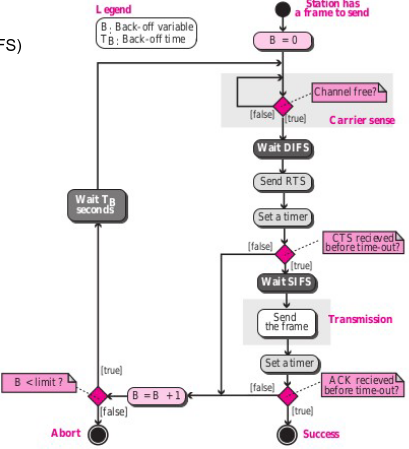

#### Quadro 802.11: Endereçamento

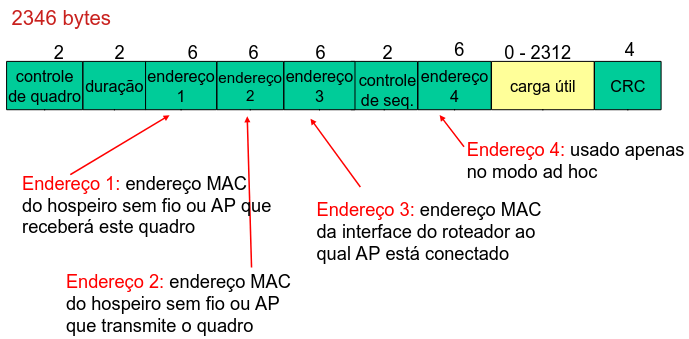

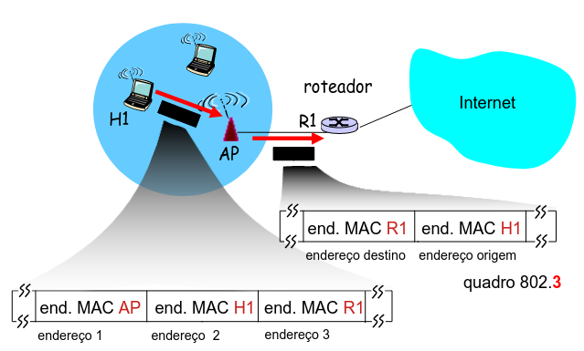

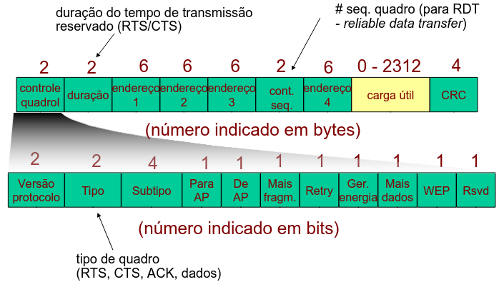

#### 802.11: mobilidade dentro da mesma sub-rede

- A area H1 permanece na mesma sub-rede IP: endereço IP pode permanecer o mesmo
- Comutador: qual AP esta associado a H1?
  - autoaprendizagem: comutador vera quadro de H1 e "lembrara" qual porta do comutador pode ser usada para alcançar H1

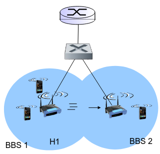

#### 802.11: capacidades avançadas

- Adaptação de taxa de comunicação:
  - estação-base, dispositivo movel muda a taxa de transmissão dinamicamente (tenica de modulação da camada fisica) enquanto disp. movel se move, a SNR varia entre diferentes relações de SNR

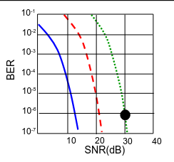

- SNR diminui, BER aumenta quando no se afasta da estação base
- Quando BER se torna muito alto, passa para taxa de transmissão inferior, mas com BER mais baixo

---

Gerenciamento de energia

- Mensagem (host) no-para-AP: "Vou dormir ate o proximo quadro de sinalização"
  - o AP sabe que não ira transmitir quadros para esse no
  - O no acorda antes do proximo quadro de sinalização
- Quadro de sinalização: contem lista de estações moveis com quadros AP-para-movel esperando para serem enviados:
  - O no permanecera acordado se quadros AP-para forem enviados; caso contrario, dorme novamente ate o proximo quadro de sinalização

#### 802.15: Rede de area pessoal (Bluetooth)

- Menos de 10 m de diâmetro
- Substitui cabos (mouse, teclado e fones)
- Ad-hoc: sem infraestrutura
- Mestre/Escravos:
  - escravos solicitam permissão para enviar (ao mestre)
  - mestre concede solicitações
- 802.15: evolução da especificação
  - banda de radio 2,4-2,5 GHz - ate 721 kbps
  - 79 canais - espectro espalhado com salto de frequência (FHSS)

### Mobilidade: Gerenciamento da mobilidade: principio

> O que e mobilidade?

- Espectro de mobilidade, do ponto de vista da rede:

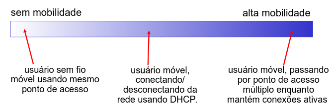

#### Mobilidade: Vocabulario

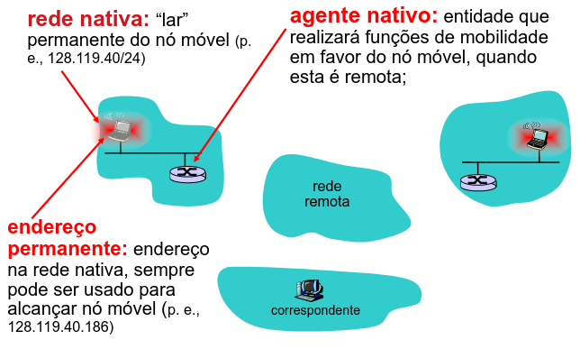

#### Mobilidade: mais vocabulario

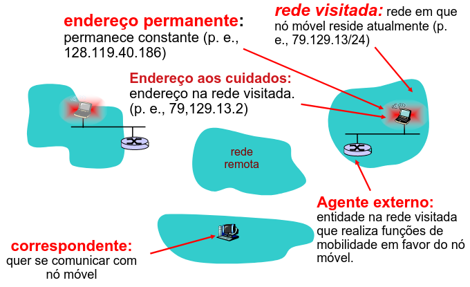

#### Mobilidade: tecnicas

- Deixe que o roteamento cuide disso: roteadores anunciam endereço permanente de nos-moveis-em residência por meio de troca de tabela de roteamento
  - tabelas de roteamento indicam onde cada no movel esta localizado
  - não ha mudanças nos sistemas finais
- Deixe que os sistemas finais cuidem disso:
  - roteamento indireto: comunicaão do correspondente ao no move passa por agente nativo, depois encaminhada ao remoto
  - roteamento direto: correspondente recebe endereço externo do no movel, envia diretamente a ele

---

- Deixe que os sistemas finais cuidem disso:
  - roteamento indireto: comunicação do correspondente ao no movel passa por agente nativo, depois encaminhada ao remoto
  - roteamento direto: correspondente recebe endereço externo do no movel, envia diretamente a ele

#### Mobilidade: Fase de Registro

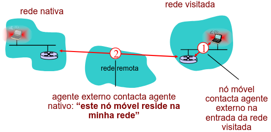

#### Mobilidade via roteamento indireto

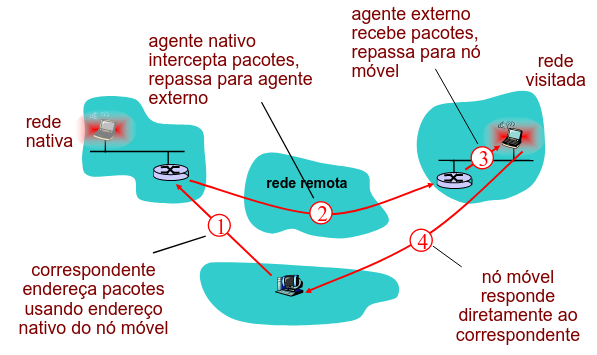

#### Roteamento indireto: comentarios

- O no movel usa dois endereços:
  - endereço permanente: usado pelo correspondente (por isso o local do no movel ser transparente ao correspondente)
  - endereço aos cuidados: usando pelo agente nativo para repassar datagramas ao no movel
- Funções do agente externo podem ser feitas pelo proprio no movel
- Roteamento triangular: correspondente-rede nativa e no movel:

> ineficaz quando correspondente, no movel esta na mesma rede

#### Roteamento indireto: movendo entre redes

- Suponha que o usuario movel passa para outra rede:
  - regista com novo agente externo
  - novo agente externo registra com agente nativo
  - agente nativo atualiza endereço aos cuidados para no movel
  - pacotes continuam sendo encaminhados ao no movel (mas com nodo-endereço aos cuidados)
- Mobilidade, mudança de redes externas transparente: conexões ativas podem ser mantidas

#### Mobilidade via roteamento direto

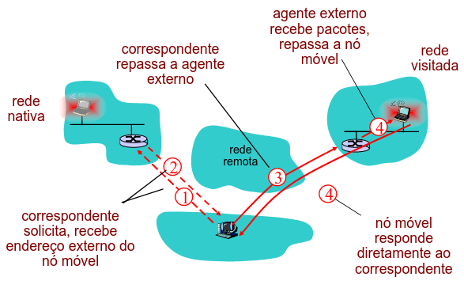

#### Mobilidade via roteamento direto: comentarios

- Contorna problema do roteamento triangular
- Não transparente ao correspondente: correspondente deve obter endereço aos cuidados do agente nativo
- Se o no movel mudar a rede visitada?

#### Acomodando mobilidade com roteamento direto

- Agente externo âncora: Agente externo na primeira rede visitada
- Dados sempre o roteado primeiro para a AE âncora
- Quando no movel se move: o novo AE repassa dados do AE antigo (encadeamento)

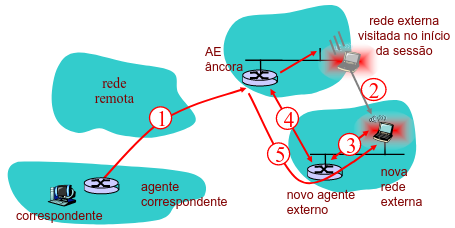

### IP movel

- Definido pela RFC 3344
- Ha muitos recursos ja descritos
  - agentes nativos, agentes externos, registro de agente externo, endereço aos cuidados, encapsulamento (pacote dentro de pacote)
- Existem três componentes do padrão:
  - roteamento indireto de datagramas
  - descoberta de agente
  - registro com agente nativo

#### IP movel: roteamento indireto

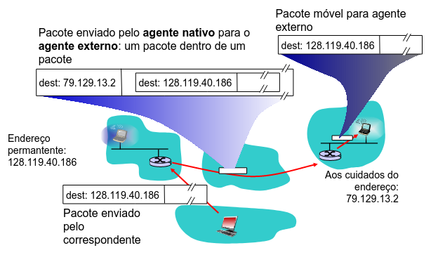

#### IP movel: descoberta de agente

- anuncio de agente: agentes externo/domestico anunciam serviço por broadcasting de mensagens ICMP (campo de tipo = 9)

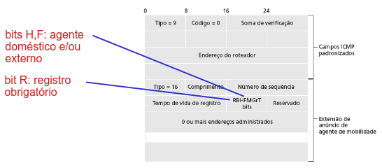
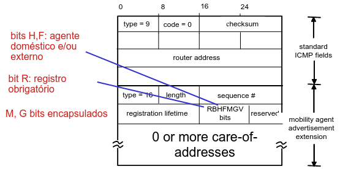

#### IP movel: exemplo de registro

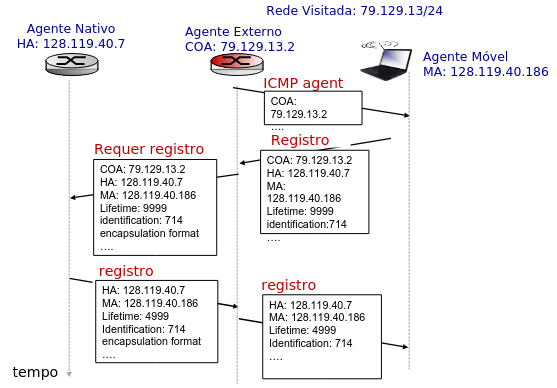

#### Sem fio, mobilidade: impacto sobre protocolos

- Logicamente, impacto deveria ser minimo
  - Modelo de serviço pelo melhor esforço permanece inalterado
  - Protocolos de transporte podem rodar sem fio e movel
- mas, do lado do desempenho:
  - perda de pacote/atraso devido a erros de bit (pacotes descartados, atraso para retransmissões da camada de enlace) e transferência
  - se usar TCP interpreta perda como congestionamento, diminuira janela de congestionamento sem necessidade
  - prejuizos de atraso para trafego em tempo real
  - Largura de banda limitada de enlaces sem fio

## Camada de Rede: Parte 1

- Objetivos da camada de rede:
- Entender os principios por tras dos serviços da camada de rede:
  - modelos de serviço da camada de rede
  - repasse versus roteamento
  - como funciona um roteador
  - roteamento (seleção de caminho)
  - lidando com escala
  - topicos avançados: IPv6, mobilidade
- Instanciação, implementação na Internet

### Introdução

- Segmento de transporte do hospedeiro emissor ao receptor
- O lado emissor encapsula segmentos em datagramas
- O lado receptor repassa segmentos a camada de transporte
- Protocolo da camada de rede em cada hospedeiro envia para o roteador
- Roteador examina os campos de cabeçalho em todos os datagramas IP que passam por ele

#### Importantes funções da camada de rede

Camada de rede

- Repasse:
  - mover pacotes da entada do roteador para a saida apropriada do roteador
- Roteamento:
  - determinar rota seguida pelos pacotes da origem ao destino
    - algoritmos de roteamento

Analogia

- Repasse:
  - processo de passar por um unico cruzamento
- Roteamento:
  - processo de planejamento da viagem da origem ao destino

#### Interação entre roteamento e repasse

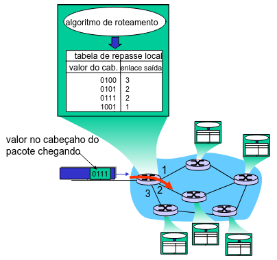

#### Estaelecimento de conexão

- Terceira função importante em algumas arquiteturas de rede:
  - ATM, frame relay, X.25
- Antes que os datagramas fluam, dois hospedeiros finais e roteadores entre eles estabelecem conexão virtual
  - roteadores são envolvidos
- Serviço de conexão da camada de rede versus transporte:
  - rede: entre dois hospedeiros (tambem pode envolver roteadores entre eles, no caso de VCs)
  - transporte: entre dois processos

#### Modelo de serviço de rede

P: Que modelo de serviço e o melhor para o "canal" que transporta datagramas do remetente ao destinatario?

- exemplo de serviços de datagramas individduais
  - entrada garantida
  - entrega garantida com atraso limitado
- exemplo de seriços para fluxos de datagramas:
  - entrega de datagrama na ordem
  - largura de banda minima garantida
  - restriçẽos sobre mudanças no espaçamento entre pacotes

#### Modelos de serviço da camada de rede

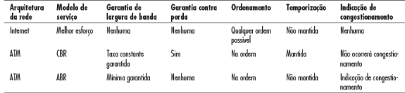

### Redes de circuitos virtuais

#### Serviço com e sem conexão

- Rede de datagrama fornece serviço sem conexão da camada de rede
- Rede de Circuito Virtual (VC) fornece serviço com conexão da camada de rede
- Analogo aos serviços da camada de transporte, mas na camada de transporte tem-se
  - serviço: hospedeiro a hospedeiro
  - sem escolha: a rede oferece um ou outro
  - implementação: no nucleo da rede

#### Circuitos virtuais

> "Caminho da origem ao destino comporta-se como um circuito telefônico" com respeito ao desempenho e ações da rede ao longo do caminho da origem ao destino

- estabelecimento e termino para cada chamada antes que os dados possam fluir
- cada pacote identificador VC (não endereço do hospedeiro de destino)
- cada roteador no caminho origem-destino mantem "estado" para cada conexão que estiver passando
- recursos do enlace e roteador (largura de banda, buffers) podem ser alocados ao VC (recursos dedicados = serviço previsivel)

#### Implementação do VC

- Um VC consite em:
  - caminho da origem ao destino
  - numeros de VC, um numero para cada enlace ao longo do caminho
  - entradas em tabelas de repasse nos roteadores ao longo do caminho
- Pacote pertence ao VC carrega numero do VC (em vez do endereço de destino)
- Numero do VC pode ser alterado em cada enlace
- Novo numero de VC vem da tabela de repasse

#### Tabela de repasse

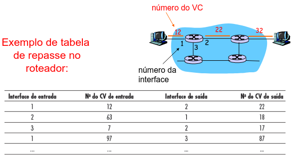

> Roteadores mantêm informação de estado da conexão

#### Circuitos virtuais: protocolos de sinalização

- Usados para estabelece, manter e terminar o VC;
- Empregados em ATM, frame-relay e X.25;
- Não usados na Internet

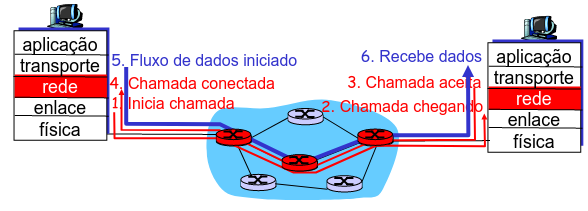

### Redes de datagrama

- sem estabelecimento de chamada na camada de rede
- roteadores: sem estado sobre conexões fim a fim
- sem conceito em nivel de rede da "conexão"
- pacotes repassados usando endereço do hospedeiro de destino
- pacotes entre mesmo par origem-destino podem tomar diferentes caminhos

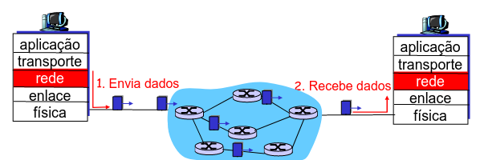

#### Tabela de repasse (redes de datagrama)

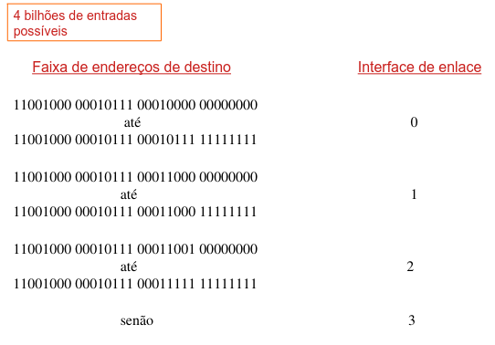

#### Concordância do prefixo mais longo

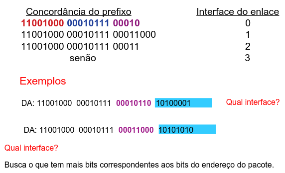

#### Rede de datagrama ou VC: por quê?

Internet(datagrama)

- Troca e dados entre computadores
  - serviço "elastico", sem requisitos de temporização estritos
- Sistema finais "inteligentes" (computadores)
  - pode adaptar, realizar controle, recuperação de erros
  - simples dentro da rede, complexidade na "borda"
- Muitos tipos de enlace
  - diferentes caracteristicas
  - serviço uniforme dificil

ATM(VC)

- evoluida da telefonia
- conversação humana:
  - requisitos de temporização estritos, confiabilidade
  - necessario para serviço garantido
- sistemas finais "burros"
  - telefones
  - complexidade dentro da rede

### O que ha dentro de um roteador?

#### Visão geral da arquitetura do roteador

- executar algoritmos/protocolo de roteamento (RIP, OSPF, BGP)
- repassar datagramas do enlace de entrada para saida

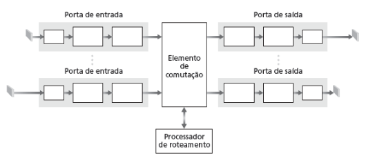

#### Funções da porta de entrada

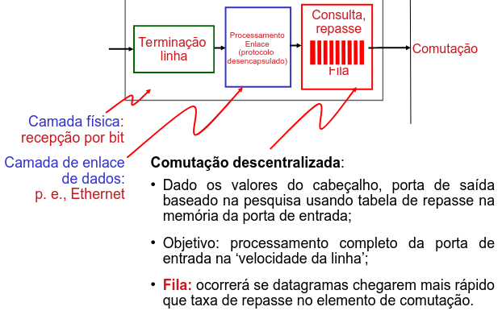

#### Comutação por memoria

Roteadores de primeira geração:

- Computadores tradicionais com a comutação via controle direto da CPU
- Pacote copiado para a memoria do sistema
- Velocidade limitada pela largura de banda da memoria (2 travessias de barramento por datagrama)

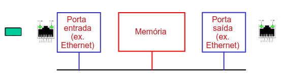

#### Comutação por um barramento

- Datagrama da memoria da porta de entrada a memoria da porta de saida por um barramento compartilhado
- Disputa pelo barramento: velocidade de comutação limitada pela largura de banda do barramento
- Barramento do roteador Cisco 5600 e 32Gbps: velocidade suficiente para roteadores de acesso e corporativos

#### Comutação por um rede de interconexão

- Contorna limitações de largura de banda do barramento
- Projeto avançado: fragmenta datagrama em celulas de tamanho fixo, comuta celulas atraves do elemento de comutação
- Equipamento da Cisco 12000: comuta 60 Gbps atraves da rede de interconexão

#### Comutação

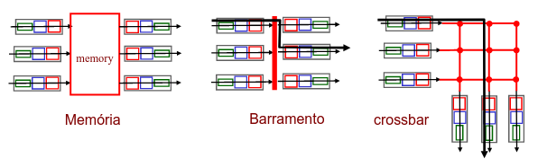

#### Portas de saida

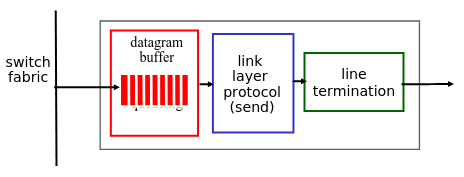

- Buffering exigido quando os datagramas chegam do elemento de comutação mais rapido que a taxa de transmissão
- Disciplina de escalonamento escolhe entre os datagramas enfileirados para transmissão

#### Enfileiramento na porta de saida

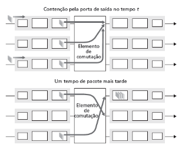

- Armazena em buffer quando a taxa de chegada via comutador excede a velocidade da linha de saida
- Enfileiramento (atraso) e perda devidos a estouro de buffer na porta de saida

#### Quanto armazenamento em buffer?

- Regra pratica dadas pela RFC 3439:
- Armazenamento medio em Buffer: "RTT (round trip time) tipica" (~250ms) * "a capacidade do enlace C"
- Exemplo:
  - C = enlace de 10 Gbps
  - Buffer de 2,5 Gbits
  - B = RTT * C
- Recomendação recente: com N fluxox do segmento (TCP), o armazenamento deve ser:
  - RTT*C/sqrt(N)

#### Enfileiramento na porta de entrada

- Elemento de comutação mais lento que portas de entrada: enfileiramento possivel nas filas de entrada
- Bloqueio de Cabeça de Fila (HOL - head-of-the-line): datagrama enfileirado na frente da fila impede que outros na fila sigam adiante
- Atraso de enfileiramento e perda devidos a estouro no buffer de entrada

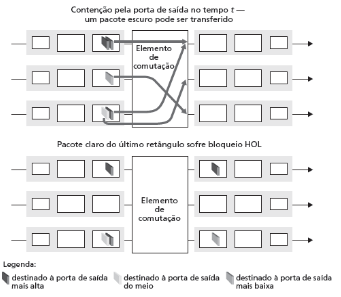

#### Mecanismo de escalonamento

- Escalonamento: escolha do proximo pacote a ser enviado no enlace
- FIFO (first in first out): envia em ordem de chegada na fila
  - Exemplo com o mundo-real?
  - Politica de descarte: se pacote chega para uma fila cheia: quem sera descartado?
    - Final: destroi pacote chegando
    - Prioridade: destroi/remove em base de prioridade
    - Randômico: destroi/remove dinamicamente

    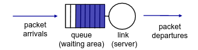

#### Política de escalonamento: prioridade

- Escalonamento de prioridade:
  - Envia pacotes de mais alta prioridade na fila
- Múltiplas classes com diferentes prioridade:
  - Classe pode depender de marcação ou informações do cabeçalho
- Ex. número de porta, IP fonte/destino

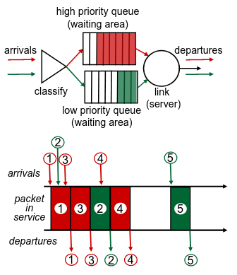

#### Política de escalonamento

Escalonamento Round Robin (RR):

- Múltiplas classes
- Varre as filas de classes, de forma cíclica, enviando um pacote completo de cada classe, se disponível

---

Múltiplas Filas (Weighted fair queuing - WFQ)

- Round Robin generalizado
- Cada classe tem um peso entre os serviços em cada ciclo

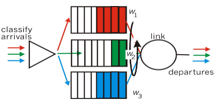

### IP: Internet Protocol

- formato do datagrama
- endereçamento IPv4
- ICMP
- IPv6

#### A camada de rede da Internet

- Funções na camada de rede do hospedeiro e do roteador:

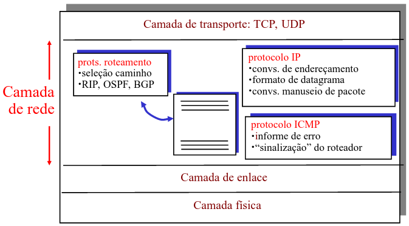

#### Formato do datagrama IP


Quanto overhead com TCP?

- 20 bytes de TCP
- 20 bytes de IP
- Tem-se 40 bytes + overhead da camada de aplicação

#### Fragmentação e reconstrução do IP

- Enlaces de rede têm MTU (tamanho max. transferência) - maior quadro em nível de enlace possível
  - diferentes tipos de enlace, diferentes MTUs
- Grande datagrama IP dividido ("fragmentado") dentro da rede
  - um datagrama torna-se vários datagramas
  - "reconstruído" somente no destino final
  - bits de cabeçalho IP usados para identificar, ordenar fragmentos relacionados

---

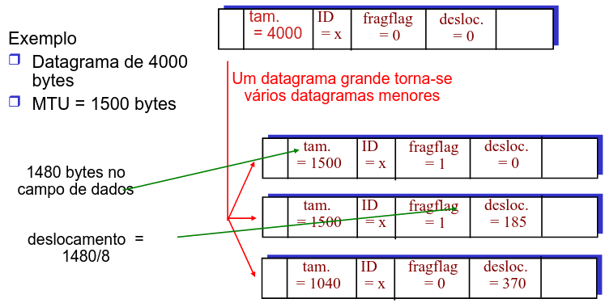

#### Endereçamento IPv4

##### Endereçamento com Classes

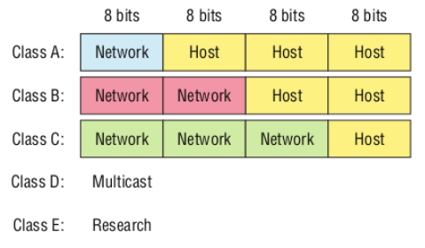

---

O endereço IPv4, no início, foram criados classes de redes baseadas no tamanho da rede para o projeto da Internet (RFC 791)

- Classe A
  - rede: 7 bits do primeiro octeto
  - host: 24 bits
  - tipo 10 . X . X . X
  - 00001010 . xxxxxxxx . xxxxxxxx . xxxxxxxx
  - o campo de endereço de rede - intervalo 1 a 127
  - total de 127 redes
  - os campos host de 1 a 254 para cada octeto
  - endereço de rede 0 e endereço de broadcast 255
  - totalizando 254 x 254 x 254 = 16.772.216 hosts

---

- Classe B
  - rede: 14 bits
  - host: 16 bits
  - do tipo 172 . 68 . X . X
  - 10101100 . 01000100 . xxxxxxxx . xxxxxxxx
  - o primeiro campo de rede pode variar de 128 a 191
  - totaliza 64 x 255 = 16.320 redes classe B
  - os campos de host podem variar de 1 a 254
  - totaliza 254 x 254 = 64516 hosts

---

- Classe C
  - rede: 21 bits
  - host: 8 bits
  - do tipo 192.168.15.X
  - 11000000 . 10101000 . 00001111 . xxxxxxxx
  - o primeiro campo de rede pode variar de 192 a 223
  - totaliza 32 x 255 x 255 = 2.080.800 redes classe C
  - o campo de host pode variar de 1 a 254
  - totaliza 254 hosts

---

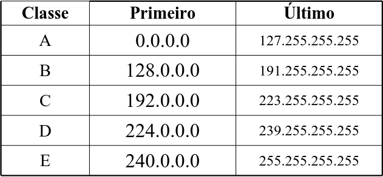

Roteadores

- Primeiro endereço: usado para identificar a própria rede (pode não ser utilizável por hospedeiro)
- Último endereço: usado para identificar o broadcast (pode não ser utilizável por hospedeiro)

##### Endereçamento Loopback

- O endereço 127 é reservado especialemente para 'loopback'
  - Refere-se ao próprio sistema remetente
  - Usado para testar software de comunicação ou para comunicar com outros programas na mesma máquina (encapsulamento)
  - Interface virtual sobre a qual o host pode enviar pacote apenas para ele
  - A rede 127.0.0.0 estpa reservada para o loopback;
  - Exemplo: 127.0.0.1

#### SubRede

- Subdividir uma rede é o processo de dividir um bloco de endereços IPs atribuídos como rede em intervalos, em vários blocos de endereços menores, para um uso mais eficiente
- Benefícios da sub-rede
  - Reduzir o congestionamento
  - Dar suporte à diferentes tecnologias (Ethernet)
  - Diminuir domínio de broadcast
  - Segurança

#### SubRede: Máscara

Função da máscara:

Serpara a parte "rede" da parte "máquina" do endereço IP

- Máscara de Subrede Padrão

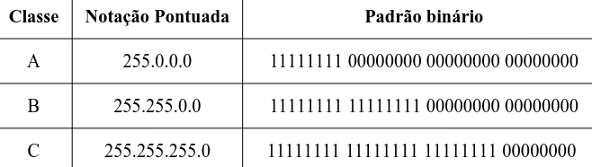

---

É usada durante dois cálculos:

1. Gera um resultado usando endereço IP do computadore de origem
2. Gera um restultado usando endereço IP do computador de destino

Depois os resultados são comparados

1. Resultados idênticos => computadores na mesma rede (contato direto)
2. Resultados diferentes => computadores em redes distintas (IP deve enviar pacote ao roteador)

---

- A máscara de subrede é criada com o uso de 1s binários nas posições dos bits relativos à rede
- Os bits da subrede são determinados com a adição do valor às posições dos bits tomados por empréstimo
- Exemplo:
  - 3 bits emprestado: a máscara para um endereço de classe C será 255.255.255.224
  - Cálculo: Número de sub-redes utilizáveis = 2^(número de bits de sub-rede atribuídos) - 2
    - O menos dois é dos endereços de ID e de broadcast da rede

#### SubRede: IP

Exemplo de cálculo:

- Dado o número IP 143.107.1.45 e a máscara 255.255.0.0
  - Endereço de rede: 143.107.0.0
  - Broadcast nesta rede: 143.107.255.255
- Dado a máscara 255.255.255.192
  - Endereço de rede: 143.107.1.0
  - End. Broadcast na rede: 143.107.1.63

---

Exemplo: Como determinar o endereço.

- Endereço de rede: 192.59.66.0 = binário
  - 11000000 . 00111011 . 01000010 . 00000000
  - Máscara de subrede: 255.255.255.240 =
    - 11111111 (rede) . 11111111 (rede) . 11111111 (rede) . 1111 (subrede) 0000 (host)
  - Cada roteador analisa a máscara da subrede, a fim de eliminar o número de hosts e pesquisa (endereço IP e máscara - emprega uma operação AND)

---

- Assumindo que os primeiros múltiplos de 16 são inválidos, pois indicam o primeiro endereço da sub-rede, tem-se as seguintes sub-redes:
  - 192.59.66.16 = 11000000 . 00111011 . 01000010 . 00010000
  - 192.59.66.32 = 11000000 . 00111011 . 01000010 . 00100000
  - ...
  - 192.59.66.32.208 = 11000000 . 00111011 . 01000010 . 11010000
  - 192.59.66.32.224 = 11000000 . 00111011 . 01000010 . 11100000

---

- Os endereços "um a menos" que os múltiplos de 16 são inválidos, pois indicam o último endereço da sub-rede:
  - 192.59.66.31 = 11000000 . 00111011 . 01000010 . 00011111
  - 192.59.66.47 = 11000000 . 00111011 . 01000010 . 00101111
  - ...
  - 192.59.66.223 = 11000000 . 00111011 . 01000010 . 11011111
  - 192.59.66.239 = 11000000 . 00111011 . 01000010 . 11101111

---

- Tabela completa

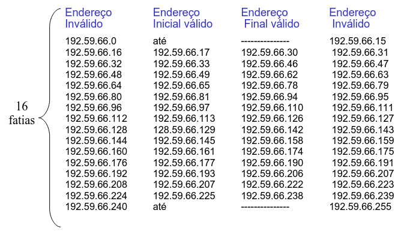

#### SubRede: CIDR

Endereçamento "Classful"

- Uso ineficiente do espaço de endereçamento, exaustão do espaço de endereços
- Rede de Classe B aloca endereços para 65K hosts, mesmo se só existem 2000 hosts naquela rede

Classless Inter-Domain Routing - CIDR (RFC 1517, 1518, 1519, 1520)

- O endereço da subrede tem a forma decimal com pontos de serparação
- Formato do endereço: A.B.C.D/x, onde x é o número de bits na parte de rede do endereço

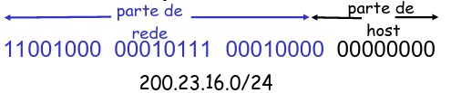

---

- Propõe fazer a (re) distribuição dos endereços IP por faixas de endereços e não usar classes
- Inclui abandonar o uso das classes tradicionais A, B e C, utilizadas na atribuição de endereços IP comerciais
- Exemplo:
  - Uma classe inteira (A ou B) pode ser dividia entre diversas empresas, evitando o desperdicio de endereços
  - As redes classe C podem ser agregadas entre si gerando uma superrede (supernet) => a mascara muda de /24 para /22

---

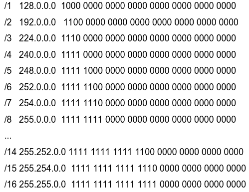

> Exercicio

Uma empresa precisa implementar uma rede com 1000 hospedeiros para atender a demanda de usuarios. Crie as subredes utilizando o endereço 172.1.8.0 e prefixo /22

Determine:

- Endereço de subrede
  - Subrede 2
- A mascara para a subrede
  - 255.255.252.0
- Numero maximo de hospedeiros na subrede
  - 2^10 (8 bits ultimo octeto + 2 bits penultimo octeto) = 1022 hosts
- Endereço de broadcast da subrede
  - 172.1.11.255
- Faixa de IPs que serão utilizados na subrede
  - 172.1.8.1
  - 172.1.11.254

#### SubRede: VLSM

- Na notação "Classless Inter-Domain Routing" (CIDR), a máscara de subrede são chamadas de prefixo
- Os roteadores utilizam o prefixo de rede, ao contrario dos bits do endereço IP, para determinar o ponto de divisão entre o numero da rede e o numero de hospedeiros
- Pode ocorrer um desperdicio de endereços IP para hosts dentro de um intervalo de sub-rede
- Então, introduziu o conceito de mascara de sub-rede com comprimento variavel (Variable Length Subnet Mask - VLSM)

#### VLSM (Mascara de subredes de tamanho variavel)

- Tecnica permite que mais de uma mascara de sub-rede seja definida para um determinado endereço de rede IP
- O campo "prefixo de rede estendito" passa a ter diferentes tamanhos de mascara de sub-redes
- Vantagens:
  - Uso mais eficiente do espaço de endereço atribuido para uma organização
  - Permite agregação de rotas, o que pode reduzir de forma significativa a quantidade de dados de roteamento no nivel de backbone em redes

---

Endereço IP: 130.5.0.0/16 -> 130.5.0.0/22 (Mascara de sub-rede 255.255.252.0)

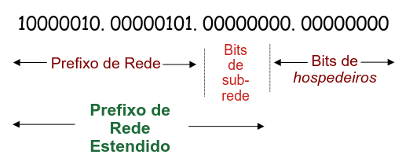

---

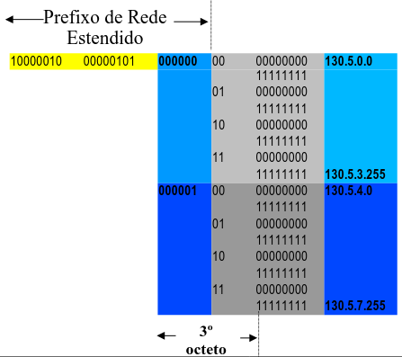

---

- As sub-redes criadas são listadas:

130.5.0.0 - sub-rede 0
130.5.4.0 - sub-rede 1
130.5.8.0 - sub-rede 2
130.5.12.0 - sub-rede 3
130.5.16.0 - sub-rede 4
130.5.20.0 - sub-rede 5

---

- Endereço de rede "/16" com prefixo de rede estendido "/22" (6 bits para sub-redes)
- São 64 (2^6 - 2) sub-redes, cada uma com um maximo de 1022 (2^10 - 2)
- Para grandes sub-redes com muitos hospedeiros (20 ou 30 hosts) desperdicio de mais de 1000 lps
- Eficiência de alocação pode aumentar de definir mais de uma mascara em um ambiente de sub-redes

---

Endereço IP: 130.5.0.0/26 (Mascara: 255.255.255.192)

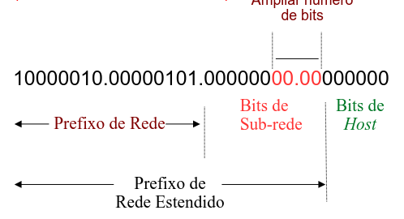

---

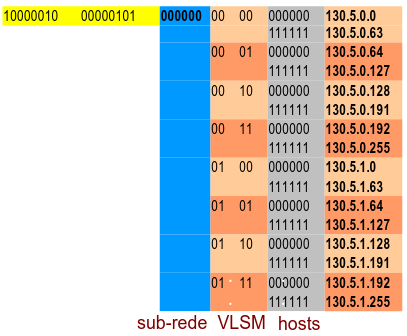

---

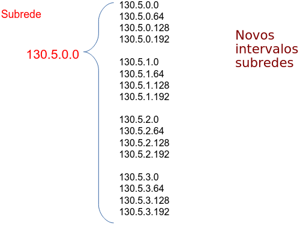

<!-- TODO: terminar copiar VLSM -->

### Dynamic Host Configuration Protocol (DHCP)

- Objetivo: permitir que o hospedeiro obtenha dinamicamente o endereço IP de um servidor quando se conectar à rede:
  - pode renover o prazo com o endereço utilizado
  - permite reutilização de endereços (mantém endereço enquanto estiver conectado e "ligado");
  - aceita usuários móveis que queiram se juntar à rede

- Etapas em DHCP:
  - host broadcasts "DHCP discover" msg[optional]
  - servidor DHCP responde com msg "DHCP offer"
  - hospedeiro requer endereço IP: msg "DHCP request"
  - servidor DHCP envia endereço: msg "DHCP ack"

#### DHCP - cenário cliente/servidor

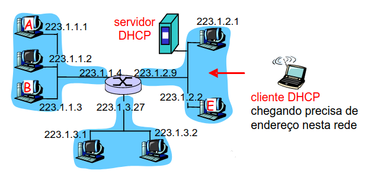

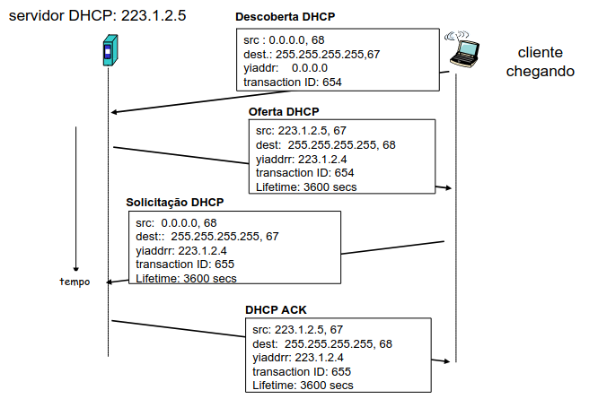

#### DHCP: mais do que endereço IP

- DHCP pode retornar mais do que apenas o endereço IP alocado na sub-rede:
  - endereço do roteador do primeiro salto para o cliente (ex. Gateway)
  - nome e endereço IP do servidor DNS
  - máscara de rede (indicando parte de rede versus hospedeiro do endereço)

#### DHCP: Exemplo

- A conexão do laptop precisa do endereço IP, endereço do roteador de primeiro salto e endereço do servidor DNS: DHCP
- A solicitação DHCP encapsulada no UDP, encapsulada no IP, encapsualdo no Ethernet 802.11
- Um broadcast de quadro Ethernet (dest = FF:FF:FF:FF:FF:FF) na LAN, recebido no roteador rodando DHCP
- A Ethernet demultiplexado para IP demultiplexado, UDP demultiplexado para DHCP

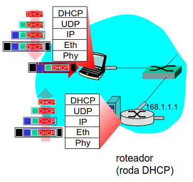

---

O servidor DHCP formula um DHCP ACK contendo endereço IP do cliente, endereço IP do roteador de primeiro salto para cliente, nome e endereço IP do servidor DNS

- encapsualemento do servidor DHCP, quadro repassado ao cleinte, demultiplexado para DHCP no cliente
- cliente sabe seu endereço IP, nome e endereço IP do servidor DNS, endereço IP do seu roteador de primeiro salto


#### Endereços IP: como obter um?

- Endereços IP são atribuidos por um provedor de serviços de Internet (ISP)


#### Endereço IP: a última palavra

- P: Como um ISP recebe bloco de endereços?
- ICANN: Internet Corporation for Assigned Names and Numbers (RFC 2050)
  - aloca endereços
  - administra o DNS
  - atribui nomes de domínio e resolve disputas

### NAT (Network Address Translation)


#### Motivação (NAT)

Rede LAN usa apenas um endereço IP no que se refere ao mundo exterior:

- intervalo de endereços não necessários pelo ISP: apenas um endereço IP para todos os dispositivos
- pode mudar os endereços dos dispositivos na rede local sem notificar o mundo exterior
- pode mudar de ISP sem alterar os endereços dos dispositivos na rede local
- dispositivos dentro da rede local não precisam ser explicitamente endereçáveis ou visíveis pelo mundo exterior (uma questão de segurança)

#### Implementação (NAT)

Roteador NAT deve:

- enviando datagramas: substituir (endereço IP de origem, # porta) de cada datagrama saindo por (endereço IP da NAT, novo # porta)
- clientes/servidores remotos responderão usando (endereço IP da NAT, novo # porta) como endereço de destino
- lembrar (na tabela de tradução NAT) de cada par de tradução (endereço IP de origem, # porta) para (endereço IP da NAT, novo # porta)
- recebeendo datagramas: substituir (endereço IP da NAT, novo # porta) nos capos de destino de cada datagrama chegando por (endereço IP origem, # porta) correspondente, armazenado na tabela NAT

#### NAT: Network Address Translation


---

Campo de número de porta de 16 bits

- 60.536 conexões simultâneas com um único endereço no lado de LAN!
- NAT é controvertido:
  - roteadores só devem processar até a camada 3
  - viola argumento de fim a fim
  - a possibilidade de NAT deve ser levada em conta pelos projetistas da aplicação, p. e., aplicações P2P
  - a falta de endereço deve ser resolvida pelo Ipv6

#### Problema da travessia da NAT

Cliente quer se conectar ao servidor com endereço 10.0.0.1

- endereço do serviro 10.0.0.1 local à LAN (cliente não pode usá-lo como endereço destino)
- apenas um endereço NAT visível externamente 138.76.29.7

Solução 1: configure a NAT estaticamente para repassar as solicitações de conexão que chegam a determinada porta do servidor

- p.e.: (138.76.26.7, porta 2500) sempre repassado para 10.0.0.1 oirta 25000

Solução 2: Universal Plug and Play (UPnP) Internet Gateway Device Protocol (IGDP). Permite que o hospedeiro com NAT

Cria a abertura:

- descobre o endereço IP público (138.76.29.7) e mapeia para 10.0.0.1 e anuncia ao roteador que esta disponível em 138.76.29.7
- inclua/remova mapeamento de porta (com tempos de posse) e envia um SYN TCP para o endereço 138.76.29.7
- quanto chega no NAT altera o endereço IP e porta, ou seja, automatizar a configuração estática do mapa de porta NAT

Solução 3: repasse (usado no Skype)

- cliente com NAT estabele conexão com repasse
- cliente externo se conecta ao repasse
- repasse liga pacotes entre duas conexões


### IP: Internet Protocol (Continuação)

#### ICMP: Internet Control Message Protocol

- Usado por hospedeiros e roteadores para comunicar informações em nível de rede
- relato de erro: hospedeiro, rede, porta, protocolo inalcançável
- eco solicitação/resposta (usado por ping)
- camada de rede "acima" do IP:
  - msgs ICMP transportadas em datagramas IP
- mensagem ICMP: tipo, código mais primeiros 8 bytes do datagrama IP causando erro

#### Traceroute e ICMP

- origem envia série de segmento UDP ao destino
  - primeiro tem TTL = 1
  - segundo tem TTL = 2 etc.
  - número de porta improvável
- quando nº datragam chegar no nº roteador:
  - roteador descarta datagrama
  - e envia à origem uma msg ICMP (tipo 11, código 0)
  - mensagem inclui nome do roteador & endereço IP
- quando a mensagem ICMP chega, origem calcula RTT
- traceroute faz isso 3 vezes

Critério de término

- segmento UDP por fim chega no hospedeiro de destino
- destino retorna pacote ICMP "host inalcançável" (tipo3, código 3)
- quando origem esse ICMP, termina

#### IPV6

- Motivação inicial: espaço de endereço de 32 bit (limitado)
- Problemas com o Ipv4 relacionados:
  - CIDR e NAT
  - Explosão do interesse na Internet
  - Hosts móveis
- Motivação adicional:
  - formato de cabeçalho ajuda a agilizar processamento e repasse
  - mudanças para facilitar QoS
- Formato de datagrama IPv6
  - cabeçalho de 40 bytes de tamanho fixo
  - fragmentação não permitida

---

- IPv6 é tratada pelas RFCs 2460 a 2466
- São alocados 16 bytes para endereços (128 bits)
- Cabeçalho simplificado (7 campos contra 13 do IPv4)
  - Melhor suporte para opções
  - Avanços em qualidade de serviço
  - Não existem classes como A, B e C
- O IPv6 utiliza o conceito de CIDR, onde um determinado número de bits corresponde ao prefixo da rede, e os bits restantes identificam o nó

#### Cabeçalho IPv6: Mudanças

- prioridade: identificar prioridade entre datagramas no fluxo
- rótulo de fluxo: identificar datagramas no mesmo "fluxo"
- Pode ser configurado pelo endereço de destino para separar os fluxos de cada uma das aplicações
- próximo cabeçalho: identificar protocolo da camada supoerior para dados


#### Outras mudanças do IPv4

- Soma de verificação: removida inteiramente para reduzir tempo de processamento em cada salto
- Opções: permitida, mas fora do cabeçalho, indicada pelo campo de "Próximo Cabeçalho"
- ICMPv6: nova versão do protolo ICMP
  - tipos de mensagens adicionais
  - exemplo: "Pacote muito Grande" - Erro
  - funções de gerenciamento de grupo multicast

#### Transição de IPv4 para IPv6

- nem todos os roteadores podem ser atualizados simultaneamente
  - sem "dia de conversão"
  - Como a rede operará com roteadores IPv4 e IPv6 misturados?
- implantação de túnel: IPv6 transportado como carga útil no datagrama IPv4 entre roteador IPv4


### Algoritmos de roteamento

Interação entre roteamento e repasse


#### Abstração de Grafo


- Grafo: G = (N, E)
- N = conjunto de roteadores
  - {u, v, w, x, y, z}
- E = conjunto de enlaces
  - {(u, v), (u, x), (v, x), (v, w), (x, w), (x, y), (w, y), (w, z), (y, z)}

> Abstração de grafo é útil em outros contextos de rede

#### Abstração de grafo: custos


- c(x, x') = custo do enlace (x, x')
  - p. e., c(w, z) = 5
- custo poderia ser sempre 1, ou inversamente relacionado à largura ou inversamente relacionado ao congestionamento

Custo do caminho (x1, x2, x3, ..., xp) = c(x1, x2) + c(x2, x3) + ... + c(xp-1, xp)

> Qual é o caminho de menor custo entre u e z?

- algoritmo de roteamento: algoritmo que encontra o caminho de menor custo

#### Classificação do algoritmo de roteamento

- informação global ou descentralizada:
  - global:
    - todos os roteadores têm topologia completa, informação de custo de enlace
    - algoritmos de "estado de enlace"
  - descentralizada:
    - roteador conhece vizinhos conectados fisicamente, custos de enlace para vizinhos
    - processo de computação iterativo, troca de informação com vizinhos
    - algoritmos de "vetor de distância"
- estático ou dinâmico:
  - estático:
    - rotas mudam lentamente com o tempo (ex. Intervenção humana)
  - dinâmico:
    - rotas mudam mais rapidamente
      - atualização periódica
      - em resposta a mudanças no custo de enlace

#### Algoritmo de roteamento de estado de enlace

- Algoritmo de Dijkstra
  - nova topologia, custos de enlace conhecidos de todos os nós
    - realizado por "broadcast de estado do enlace"
    - todos os nós tẽm a mesma informação
  - cálcula caminhos de menor custo de um nó ("origem") para todos os outros nós
  - Cria a tabela de repasse para esse nó
  - Iterativo: após k iterações, sabe caminho de menor custo para k destinos
- Notação:
  - c(x, y): custo do enlace do no x até y; representa por igual a infinito se não forem vizinhos diretos
  - D(v): valor atual do custo do caminho da origem ao destino V
  - p(v): nó predecessor (antecessor) ao longo do caminho de origem até v
  - N': conjunto de nós cujo caminho de menor custo é definitivamente conhecido

---


#### Algoritmo de Dijkstra: Exemplo de Tabela


#### Algoritmo de Dijkstra: Exemplo


#### Algoritmo de Dijsktra: Discussão

Complexidade do algoritmo: n nós

- cada iteração: precisa verificar todos os nós - comparações: O (n²)
  - (primeira) m
  - (segunda) n - 1
  - (terceira) n - 2
  - ...

Das diversas implementações a mais eficientes possíveis: O(nlogn)

---

Problema:

- Custos dos enlaces não são simétricos
- Custo esta relacionado com a quantidade de tráfego transportado
- Roda o algoritmo de estado do enlace
  
---

Patologia: oscilações possíveis devido ao congestionamento

Soluções:

- os roteadores não executam o algoritmo de roteamento ao mesmo tmepo
- cada roteador deve variar aleatoriamente o instante em que envia um anúncio do enlace

#### Algoritmo de vetor de distância

- Equação de Bellman-Ford (programação dinâmica) define:
  - dx(y) := custo do caminho de menor custo de x para y
  - depois:
    - dx(y) = minv {c(x, v) + dv(y) | v é vizinho de x}
    - onde minv assume todos os vizinhos de x

---


- Nó de origem "u" tem 3 vizinhos: v, w e x
- O custo do caminho de menor custo do nó v para z, claramente, dv(z) = 5, x = dx(z) = 3 e w = dw(z) = 3
  - du(z) = min {c(u, v) + dv(z), c(u, w) + dw(z), c(u, x) + dx(z)}
  - equação B-F diz: min{2 + 5, 1 + 3, 5 + 3} = 4

> nó que alcança mínimo é o próximo salto no caminho mais curto -> tabela de repasse

---

Com o algoritmo cada nó x mantém seguintes dados:

- Dx(y) = estimativa do menor custo de x para y
- nó x sabe custo de cada vizinho v ligado diretamente: c(x, v)
- nó x mantém vetor de distância Dx = [Dx(y): y e N] estimativa de x para todos seus custos até os destinos, y, em N
- Vetor de distância de seus vizinhos para cada vizinho v, então, x mantém
- Dy = [Dv(y): y e N]

---

ideia básica:

- De tempos em tempos, cada nó envia sua própria estimativa de vetor de distância para seus vizinhos
- assíncrono
- quando um nó x recebe nova estimativa DV do vizinho, ele atualiza seu próprio DV usando a equação de B-F:
  - Dx(y) = minv {c(x, v) + dv(y)} para cada nó y em N
- Sob condições modestas, naturais, a estimativa Dx(y) converge para o menor custo real dx(y)

---

iterativo, assíncrono: cada iteração local causada por:

- mudança de custo do enlace local
- mensagem de atualização do DV do vizinho

distribuído:

- cada nó notifica os vizinhos (apenas quando seu DV muda)
- vizinhos, então, notificam seus vizinhos, se necessário

Cada nó:


---


---

Mudança de custo do enlace: Menor valor

> Boas notícias correm rápido

- Nó detecta mudança no custo no enlace local
- atualiza informação e recalcula Vetor de Distância (VD)
- Se VD mudar, notifica vizinhos

    
  - no tempo t0, y deteca a mudança do custo do enlace, atualiza seu VD e informa seus vizinhos
  - no tempo t1, z recebe a atualização de y e atualiza sua tabela (de 5 para 2). Calcula um novo custo mínimo para x e envia seu VD aos vizinhos
  - no tempo t2, y recebe a atualização de z e atualiza sua tabela de distância

> Menores custo de y não mudam, e daí y não envia qualquer mensagem a z no estado inativo pelo custo do enlace não mudar

---

- mudanças de custo do enlace: apenas Y e Z


---

mudanças de custo do enlace:


- Agora más notícias correm lento - problema da "contagem até o infinito"!
- Dy(x) = 4, Dy(z) = 1, Dz(y) = 1, Dz(x) = 5
- Em t0, Y detecta mudança (4 para 60). Novo caminho: Dy(x) = min {60 + 0, 1 + 5} = 6
- Então, Z dia Y que pode chegar com custo 5 em X - Custo de Z está errado com a atualização realizada
- Em t1 -> loop de roteamento
- Tão logo Y tenha calculado novo custo para X, ele informará a Z (Dy(x) = 6) e calcula-se novo custo Dy(x) = min {60 + 0, 1 + 6} = 7
- Fica em loop desse procedimento até???

---


---

mudanças de custo do enlace:

- Seráo necessários 44 iterações antes que o algoritmo estabilize
- Só quando o caminho via y for maior do que 50, mudará para conexão direta e y fará o caminho via z para chegar em x
- Se o link fosse de 10000 o que irá acontecer para mudança do enlace

---

Técnica reverso envenenado (poisoned reverse):

- Como resolver o problema do loop?
- Se Z passa por Y para chegar em X:
  - Z pode dizer a Y que sua distância (de Z) até X é infinita (de modo que Y não irá construir uma rota para X passando por Z)
- Em t0, Y atualiza para 60 para X e informa Z, então, Z atualiza como infinito e desloca para conexão direta com custo 50
- Então, o nó Z diz ao nó Y que sua distância (de Z) até X é infinita

#### Comparação dos algoritmos LS e DV

complexidade da mensagem

- LS: com n nós, E enlaces, O (nE) mensagens enviadas
- DV: troca apenas entre vizinhos
  - tempo de convergência varia

velocidade de convergência

- LS: algoritmo O(n²) requer O(nE) mensagem
  - pode ter oscilações
- DV: tempo de convergência varia
  - podem ser loops de roteamento
  - problema da contagem até o infinito

robustez: o que acontece se roteador der defeito:

- LS:
  - nó pode anunciar custo do enlace incorreto
  - cada nó calcula apenas sua própria tabela

- DV:
  - nó DV pode anunciar custo do caminho incorreto
  - tabela de cada nó usada por outros
    - erro se propaga pela rede

#### Roteamento hierárquico

nosso estudo de roteamento até aqui - o ideal:

- todos os roteadores idênticos
- rede "achatada"
  - ... não acontece na prática

- escala com 200 milhões de destinos
- não pode armazenar todos os destinos nas tabelas de roteamento!
- troca de tabela de roteamento atolaria os enlaces!
- autonomia administrativa
- Internet = rede de redes
- cada administrador de rede pode querer controlar o roteamento em sua própria rede

---

- roteadores agregados em regiões denominadas, "sistemas autônomos" (autonomous systems - AS)
- roteadores no mesmo AS rodam o mesmo protocolo de roteamento:
  - protocolo de roteamento "intra-AS" (interno)
  - roteadores em AS diferentes podem executar protocolo de roteamento intra domínio

roteador de borda

- enlace direto com roteador em outro AS

---

ASes interconectados


tabela de repasse configurada por algoritmo de roteamento intra e inter-AS

- intra-AS define entradas para destinos internos
- inter-AS e intra-AS define entradas para destinos externos

---

Tarefa inter-AS

- suponha que roteador no AS1 recebe datagrama destinado para fora do AS1:
  - roteador deve encaminhar pacote ao roteador de borda, mas qual?

AS1 deve:

1. descobrir quais destinos são alcançáveis por AS2 e quais por AS3
2. propagar essa informação de acessibilidade a todos os roteadores no AS1

> Tarefa de roteamento do protocolo inter-AS!

---

definindo tabela de repasse no roteador 1d

- suponha que AS1 descubra (pelo protocolo inter-AS) que a sub-rede x é alcançável via AS3 (gateway 1c), mas não via AS2
- protocolo inter-AS propaga informação de acessibilidade a todos os roteadores internos em seu AS
- roteador 1d determina prlo roteamento intra-AS informação de que sua interface I está no caminho de menor custo para 1c
  - instala entrada da tabela de repases com as informações (x, I)

---

Exemplo: escolhendo entre múltiplos ASs

- Agora suponha que o AS1 descubra pelo protocolo inter-AS que a sub-rede x pode ser alcançada por AS3 e por AS2
- Pode ser alcançado pelo AS2 com 1b ou AS3 com 1c? Essa informação é repassada para 1d. Como resolver isso?


---

- Para configurar a tabela de repasse, o roteador 1d deve determinar para qual gateway deve repassar pacotes para destino x.
- isso também é tarefa do protocolo de roteamento inter-AS
- roteamento da batata quente (hot-potato routing): envia pacote para o mais próximo dos dois roteadores


### Roteamento na Internet

#### Roteamento de Roteamento Intra-AS

- Também conhecido como Interior Gateway Protocols (IGP)
- Protocolos de roteamento intra-AS mais comuns:
  - RIP: Routing Information Protocol
  - OSPF: Open Shortest Path First
  - IGRP: Interior Gateway Routing Protocol (proprietário da Cisco)

#### RIP (Routing Information Protocol)

Algoritmo de vetor de distância

Incluído na distribuição BSD-UNIX em 1982

Métrica de distância: # de saltos (máx. = 15 saltos)

Do roteador A às sub-redes:


| destino | saltos |
| ------- | ------ |
| u       | 1      |
| v       | 2      |
| w       | 2      |
| x       | 3      |
| y       | 3      |
| z       | 2      |

#### Anúncios RIP

vetores de distância: trocados entre vizinhos a cada 30 s por meio de mensgem de resposta (também conhecida como anúncio)

cada anúncio: lista de até 26 sub-redes de destino dentro do AS (RIP versão 2)

#### RIP: Exemplo


#### RIP: falha e recuperação do enlace

- Se nenhum anúncio for ouvido após 180 segundos -> vizinho/enlace declarado "morto"
  - rotas via vizinho invalidadas
  - novos anúncios enviados aos vizinhos
  - vizinhos por sua vez enviam novos anúncios (se não houver tabelas alteradas)
  - informação de falha do enlace rapidamente se propaga para rede inteira (vizinhos?)
  - reversão envenenada usada para impedir loops de pingue-pongue (distância infinita = 16 saltos)

#### Processamento de tabela RIP

- tabelas de roteamento RIP controladas por processo em nível de aplicação chamado routed (daemon)
- anúncios enviados em paotes UDP, repetidos periodicamente


#### OSPF (Open Shortest Path First)

- "open": publicamente disponível
- usa algoritmo de Estado de Enlace (Link State- LS)
  - disseminação de pacotes LS
  - mapa de topologia em cada nó
  - cálculo de rota usando algoritmo de Dijkstra
- anúncio OSPF(HELLO) transporta uma entrada por roteador vizinho
- anúncios disseminados ao AS inteiro (com inundação)
  - transportados nas mensagens OSPF diretamente por IP (em vez de TCP ou UDP)

#### Recursos "avançados" do OSPF

- segurança: todas as mensgens OSPF autenticadas (para impedir intrusão maliciosa). Ex. senha
- múltiplos cmainhos de mesmo custo são permitidos (apenas um caminho no RIP)
- para cada enlace, múltiplas métricas de custo para diferentes Type of Service (por exemplo, custo de enlace de satélite definido "baixo" para melhor esforço; alto para tempo real)
- suporte integrado para uni e multicast:
  - Multicast OSPF (MOSPF) usa mesma base de dados de topologia que o OSPF
- O protocolo OSPF pode ser hierárquico em grandes domínios

---

hierarquia em dois níveis: área local e backbone

- anúncios de estado do enlace somente na área
- cada nó tem topologia da área detalhada; somente direção conhecida (caminho mais curto) para as redes em outras áreas

roteadores de borda: "resumem" distâncias às redes na própria área, anunciam para outros roteadores de borda

roteadores de backbone: executam roteamento OSPF limitado ao backbone

roteadores de fronteira: conectam-se a outros AS's

#### BGP (Border Gateway Protocol)

- O padrão de fato
- O BGP oferece a cada AS um meio de:

1. obter informação de acessibilidade da sub-rede a partir de ASs vizinhos
2. propagar informação de acessibilidade a todos os roteadores internos ao AS
3. determinar rotas "boas" para sub-redes com base na informação e política de acessibilidade

- Permite que a sub-rede anuncie sua existência ao resto da Internet: "Estou aqui"

#### Fundamentos do BGP

- pares de roteadores (pares BGP) trocam informações de roteamento nas conexões TCP semipermanentes: sessões BGP (porta 179)
- quando AS2 anuncia um prefixo para AS1
  - AS2 promete que repassará datagramas para esse prefixo
  - AS2 pode agregar prefixos em seu anúncio


#### Distribuindo informações de atingibilidade

- Usando sessão eBGP entre 3a e 1c, AS3 envia informação de atingibilidade do prefixo a AS1
  - O roteador 1c pode então usar iBGP para distribuir nova informação de prefixo a todos os roteadores em AS1
  - O roteador 1b pode então reanunciar nova informação de atingibilidade para AS2 por sessão BGP 1b-para-2a
- Se um roteador descobre novo prefixo, ele cria entrada para prefixo em sua tabela de repasse


#### Atributos de caminho & rotas BGP

- prefixo anunciado inclui atributos BGP
  - prefixo + atributos = "rota"
- dois atributos importantes:
  - AS-PATH: contém ASs através dos quais o anúncio do prefixo passou. Por exemplo: AS 67 e AS 17
  - NEXT-HOP: indica o roteador específico do AS interno para AS do próximo salto (podem ser múltiplos enlaces para AS atual até AS do próximo salto)
- Quanto o roteador de borda recebe anúncio de rota, usa política de importação para aceitar/declinar a divulgação de uma informação

#### Seleção de rota BGP

- roteador pode aprender sobre mais de 1 rota para algum prefixo
- Então, roteador deve selecionar rota
- Regras de eliminação:
  1. atributo do valor preferência local: decisão política
  2. AS-PATH mais curto
  3. roteador NEXT-HOP mais próximo: roteamento batata quente
  4. critérios adicionais

#### Mensagens BGP

- Mensagens BGP trocadas usando TCP
- Mensagens BGP:
  - OPEN: abre conexão TCP com par e autentica remetente
  - UPDATE: anuncia novo caminho (ou retira antigo)
  - KEEPALIVE: mantém conexão viva na ausência de UPDATES
    - também envia ACK para solicitação OPEN
  - NOTIFICATION: informa erros na msg anterior; também usada para fechar conexão

#### Política de roteamento BGP


- A, B, C são redes de provedor
- X, W, Y são clientes (de redes de provedor)
- X é dual-homed: conectada a duas redes (controle de divulgação de rotas)
  - O cliente X não quer rotear a partir de B por meio de X para C
  - logo, X não anunciará a B uma rota para C

---


- A anuncia caminho AW para B
- B anunca caminho BAW para X
- B deve anunciar caminho BAW para C?
  - de forma alguma!
  - B não recebe "retorno" para roteamento CBAW
  - B quer forçar C a rotear para W por meio de A
  - B deve rotear apenas para/de seus clientes

#### Por que roteamento intra e inter-AS diferente?

política:

- inter-AS: admin deseja controle sobre como seu tráfego é roteado, quem roteia através de sua rede
- intra-AS: único admin, de modo que nenhuma decisão política é necessária

escala:

- roteamento hierárquico salva tamanho de tabela, tráfego de atualização reduzido

desempenho:

- intra-AS: pode focalizar no desempenho
- inter-AS: política pode dominar sobre desempenho