# Construção de Compiladores

## Estrutura básica de um compilador

- Back-end: responsável pela geração do código objeto.
- Front-end: responsável pela análise léxica, sintática e semântica do código fonte.

- Para realizar a comunicação entre as partes citadas acima, é necesária uma representação intermediária (IR) que seja independente de plataforma e linguagem.
  - isso permite que o back-end seja reutilizado para diferentes linguagens e plataformas (compiladores multilinguagens).

### Front-end

- valida a estrutura do código fonte quanto a sua forma (sintática) e significado (semântica).
  - sintaxe: conjunto de regras que determinam uma linguagem de programação (construções corretas)
  - semântica: como as regras devem ser interpretadas/entendidas/intrepretadas (entendimento das instruções), ou seja, o significado das construções.

#### Etapas (Front-end)

- Entrada:
  - Código fonte
- Processos:
  - Análise léxica
  - Análise sintática
  - Análise semântica
  - geração do código intermediário
- saída:
  - Representação intermediária (IR)
  - Mensagens de erros (se houver)

#### Etapa de análise

- Quebra o código em tokens (análise léxica)
  - tokens: menor unidade léxica (palavras reservadas, identificadores, operadores, etc)
- Valida se a estrutura sintática está correta (análise sintática)
  - Reconhece programas aceitos (ou não) pela linguagem
- Verifica a consistência semântica do programa (análise semântica)
  - Verificação de tipos, compatibilidade de operandos, etc.
- Gera a IR do código analisado anteriormente (geração do código intermediário)
  - IR é moldada para interfacear com o back-end
- Gera informações sobre o código e as armazena em uma estrutura de dados chamada de tabela de símbolos
  - Tabela manipulada em diferentes etapas do front-end
- Reporta erros de forma útil
- Boa parte do front-end pode ser automatizada

### Back-end

#### Etapas (Back-end)

- Entrada: IR
- Processos:
  - Geração do código
  - Otimização dependente da máquina
- Saída
  - Código objeto específico para a arquitetura alvo
  - Mensagens de erros (se houver)

#### Etapa de síntese

- Gera o código objeto para uma arquitetura alvo
  - Seleciona as instruções ISA para implementar as operações da IR
  - Define quais valores manter nos registradores (alocação)
  - Define a distribuição das instruções entre os recursos disponíveis para o escalonamento (escalonamento)
- Otimização de baixo nível (local)
  - Focada no hardware
  - Busca melhorar o desempenho do código gerado, considerando os recursos disponíveis na arquitetura alvo
- Garante a conformidade com as interfaces do sistema
- Automação mais complexa e difícil
  - Costuma houver heurísticas (não determinísticas)

### Compiladores multi-plataforma

- Ambientes atuais admitem diferentes front e back-ends

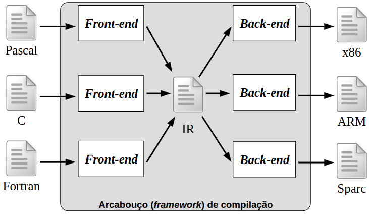

- Dificuldades dos projetos multi-plataforma
  - Todo conhecimento específico da linguagem deve estar no front-end
  - Deve codificar todas as características em uma única representação intermediária (IR)
  - Todo conhecimento específico da plataforma deve estar no back-end
- Sucesso limitado em ambientes com IRs de baixo nível
- Área de pesquisa ativa (Graal e Truffle)

### Compiladores Otimizantes

- Adotam uma terceira etapa (middle-end)

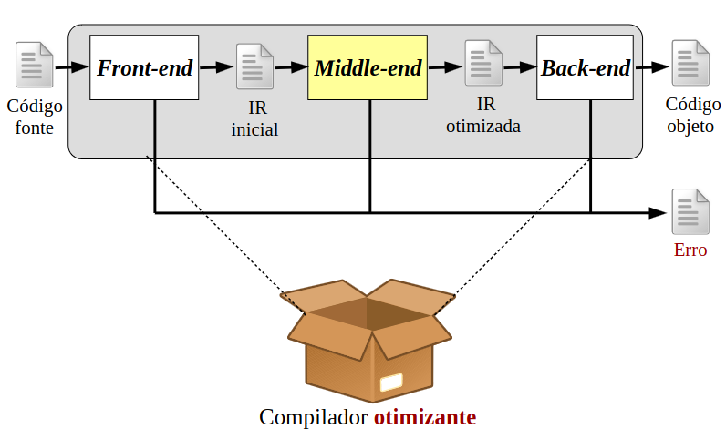

### Middle-end

#### Etapas (middle-end)

- Entrada: IR (original gerada pelo front-end)
- Processos:
  - Análise da IR atual
    - Gera conhecimento contextual do código
  - Aplicação de transformações
    - Forma monolítica (programa) ou estrutura (funções)
- Saída:
  - Representação intermediária (IR) otimizada

#### Etapa de otimização

- Otimização de alto nível (global)
  - Realiza modificações sintáticas no IR
    - Possibilitar ao back-end gerar um código melhor
  - Independente da arquitetura alvo
    - Otimização "especulativa" baseada em ações pré-definidas (passos de otimização)
  - Garantir a solução ótima é um problema indecidível
- Envolve a aplicação de uma sequência de passos de otimização sobre o código intermediário
  - Existem passos de anaĺise e de transformação
  - Quantidade de passos disponíveis varia entre os compiladores
  - Número e tipo dos passos aplicados afetam o tempo gasto no processo
  - Efetividade de um passo depende de condições específicas do código
  - Ordem de aplicação interfere no código gerado
    - Passos de otimização interagem entre si
    - Sequências distintas -> diferentes códigos e desempenho

### Estrutura do compilador

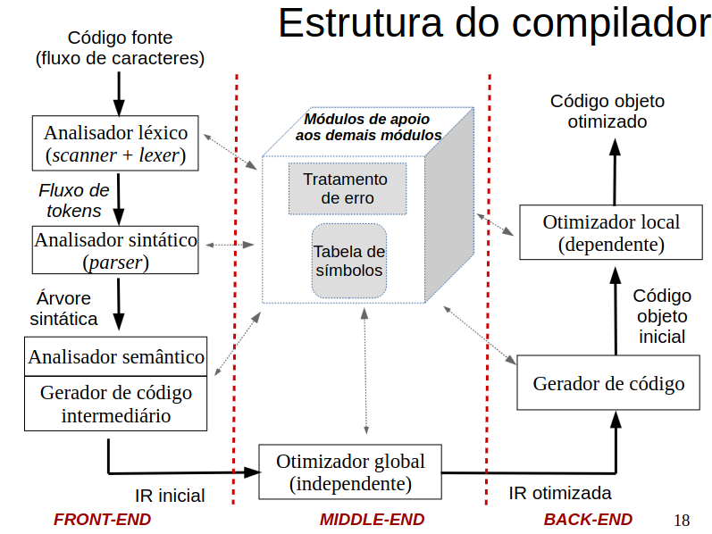

### Análise léxica

- Transforma sequência de caracteres em uma sequência de símbolos básicos da linguagem (tokens)
  - Reconhecer os tokens do programa
    - Reconhecimento de sequências elementares completas (padrões)
    - Identificação e classificação das palavras (átomos ou lexemas)
  - Eliminação de delimitadores e comentários
  - Preenchimento inicial da tabela de símbolos
  - Relatar ou recuperar erros léxicos
    - Ex: fim inesperado de arquivo, mal formação de lexemas, etc.
- Analisador léxico pode ser gerado de forma automática
  - A partir da especificação dos padrões por expressões regulares
  - Ex: Flex

---

- Lê o fluxo de caracteres do código fonte (scanning) e os agrupa em (lexemas)
  - Leitura é feita da esquerda (início) para a direita (fim)
- Cada lexema retorna um token no formato:
  - <tipo, atributo>
  - tipo: identificador do tipo do token
  - atributo: dados referentes ao lexema
    - Ex: localização na tabela de símbolos (chave), valor de uma constante, etc.

### Análise sintática

- Validar a estrutura gramatical da sequência de tokens
  - Agrupa os tokens em estruturas sintáticas da linguagem
    - Sequência válida de tokens e hierarquias de estruturas
  - Estruturas são especificadas em uma gramática livre de contexto (GLC)
- Gerar a IR que representa a estrutura do código
  - Concreta: codifica toda a estrutura sintática do programa
    - Árvore de derivação
  - Abstrata: codifica apenas as partes essenciais do código
    - Árvore Sintática Abstrata (AST)
- Reportar erros sintáticos
  - Ex: "; esperado", "parêntese desbalanceado", etc
- Também é possível usar geradores automáticos
  - Utilização de GLC
  - Ex: Yacc

### Gramática livre de contexto (CFG)

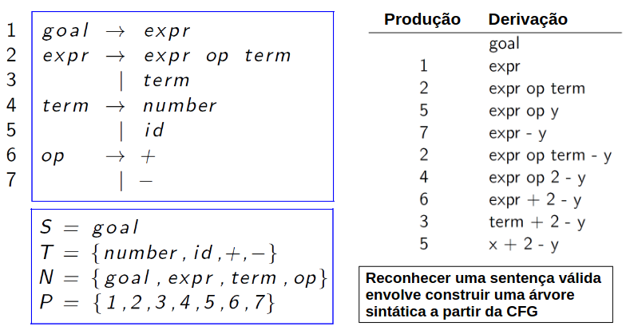

### Árvore de deviração


### Árvore sintática abstrata (AST)


- sumariza a estrutura gramatical
  - não inclui informações da derivação
- mais utilizada pelos compiladores
- é uma forma de IR

### Análise semântica (contexto)

- Verifica a consistência semântica do programa fonte a partir da definição da linguagem
  - Envolve a análise de contexto
  - Usa a AST (Árvore semântica abstrata) e as informações da tabela de símbolos no processo
- Relata erros de contexto e de tipos
  - Ex: variável não declarada, número de parâmetros inconsistente, incompatibilidade de tipos, etc.

### Geração de código intermediário

- Gera a IR usada internamente pelo compilador
  - IR explícita de baixa nível (ex: código de 3 endereços)
  - Independe da linguagem e da máquina (na teoria)
  - Programa para uma máquina abstrata
- IR deve ter 2 propriedades importantes em relação ao desempenho:
  - Ser facilmente produzida
  - Ser facilmente traduzida para máquina alvo
- Geralmente é realizada em conjunto com as análises sintática e semântica

### Código de 3 endereços

- É uma da IR mais utilizadas
- Conjunto de instruções com 3 operandos:
  - Atribuições possui no máximo um operador no lado direito
  - Compilador precisa gerar um nome temporário para guardar o resultado das instruções (registrador)
  - Algumas instruções possuem menos de 3 operandos
- Ex: dado que as variáveis são do tipo float, a instrução "x = y+z\*10;" gera o seguinte código de 3 endereços

  ```IR
  t1 = inttofloat(10)
  t2 = id3 * t1
  t3 = id2 + t2
  id1 = t3
  ```

### Otimização

- Modifição para melhorar desempenho no código

  - podendo diminuir tempo de execução,
  - espaço de memória, tamanho de código,
  - consumo energético,
  - etc...

- Otimizador deve atender aos seguinte requisitos
  - preservar a semântica do programa (estar correto)
    - produz o efeito esperado com as entradas fornecidas
    - precisa de verificação formal
  - ser eficiente
    - obviamente, como é uma otimização, deve ter mais eficiente o uso desse processo do que não usá-lo
  - tempo de compilação aceitável
    - após a otimização podem ocorrer alterações na estrutura do código que podem aumentar o tempo de compilação
  - esforços de projeto precisam ser administráveis
    - não pode ser muito complexo de ser implementado

#### Tipos

- Global
  - analisa o programa como um todo ou independente da arquitetura da máquina, ou seja, em alto nível
  - otimiza o IR
  - desempenho depende da qualidade do projeticsta
    - quais e como são implementados os passos de otimização

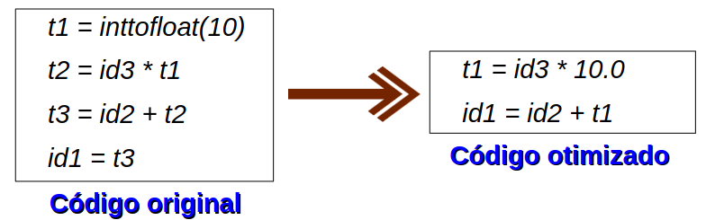

- Local
  - analisa o programa em um nível mais baixo, ou seja, depende da arquitetura da máquina
  - otimiza o código objeto
  - desempenho depende do conhecimento da arquitetura alvo
    - descições se baseiam nas restrições impostas pelos recursos disponíveis

### Geração de código objeto

- Gera o código objeto a partir da IR
  - Código objeto é o código de máquina
  - Depende da arquitetura alvo
- Mapeia cada nó da AST (Árvore Semântica Abstrata) ou instrução de 3 endereços em instruções na linguagem objeto (seleção de instruções)
  - Gerar código de máquina (relocável ou absoluto) ou de montagem (assembly)
  - Busca produzir código rápico e compacto
  - Aproveita as características arquiteturais
    - Ex: modos de enderçamento disponíveis
  - Pode ser visto como um problema de alocação de registradores (pattern matching)
    - Métodos ad hoc, pattern matching, programação dinâmica

---

- Alocação de registradores é um aspecto crítico dessa etapa
  - Assegura que os dados estejam disponíveis quando forem usados
  - Gerecimanto de um quantidade limitada de registradores
  - Pode mudar as intruções e/ou incluir instruições de load/store
  - Alocação ótima é um problema NP-completo
    - Problema de coloração de grafos
    - Compiladores adotam soluções aproximadas
- Alocação de memória para os identificadores (variáveis)
  - Decisões sobre alocação doe espaço podem ser durante a geração do código intermediário ou do código objeto

---

- Escalonamento de instruções
  - Busca evitar paradas de hardware devido a dependências de dados (stall e interlock)
  - Tentar usar todas as unidade funcionais de forma eficiente (paralela)
  - Pode aumentar o tempo de vida das variáveis
    - Mudança na alocação
  - Escalonamento ótimo é um problema NP-completo
    - Métodos heurísticos

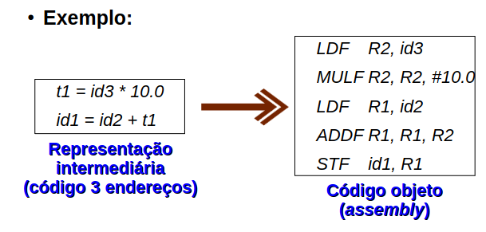

### Formas de organização

- Fases de um compilador podem ser executadas separadamente (em sequência) ou combinada em passos

- Compilação em etapas (sequencial):

  - A execução de uma faset termina antes de iniciar a próxima
  - Vantagem: possibilidade de otimizações no código
  - Desvantagem: aumento no tempo de compilação

- Compilação em um passo:

  - Programa-Objeto é produzido à medida que o programa-fonte é lido
  - Vantagem: eficiência na compilação
  - Desvantagem: dificuldade em otimizar o código

- Ambientes de compilação modernos adotam um meio termo
  - Fases agrupadas em front-end (análise), middle-end (otimização) e back-end (geração de código/síntese)

## Análise Léxica

> Etapa de Análise do Compilador

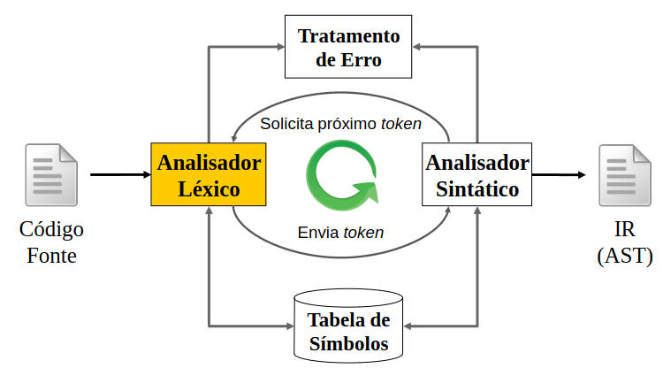

- Processo iterativo e reativo

### Projeto da Etapa de Análise

- Por que dividir análise léxica e sintática?
  - Permite simplificar uma das fases (projeto mais simples)
    - Ex: análise sintática e sem tratamento para comentários
  - Permite a adoção de técnicas especializadas/otimizadas para certas tarefas (melhor eficiência do compilador)
    - Ex: técnicas de buferização especializadas para a leitura de caracteres e o processamento de tokens
  - Facilita a portabilidade do compilador (manutenção)
    - Peculiaridades da linguagem ou dos dispositivos podem ser restringidas ao analisador léxico facilitando modificações
    - Ex: Tratamento de símbolos especiais (^ em Pascal) ou fora do padrão (ex: letras do alfabeto grego)

### A Análise Léxica

- Análise léxica é a 1º fase da etapa de análise
  - Envolve varredura (scanner) e análise propriamente dita (lexer)
  - Implementada como uma sub-rotina do analisador sintático
- Tarefa principal: agrupar os caracteres do código fonte em tokens
  - Ler os caracteres de um buffer de entrada do programa fonte
  - Agrupá-los em lexemas
  - Produzir uma sequência de tokens como saída
    - Usada pelo analisador sintático para validar as regras da gramática
- Pode realizar outras tarefas secundárias
  - Remover símbolos desnecessários
    - Comentários e separadores (espaço em branco, tabulação e quebra de linha)
  - Correlacionar as mensagens de erro com o código fonte
  - Processar diretivas de controle (ex: expansão de macros)

### Token

- Classe de elementos aceitos em uma linguagem de programação
  - Unidade básica da sintaxe
  - Ex: identificadores, operadores, palavras-chave, etc.
- Elo de ligação entre as análises léxica e sintática
  - Representa os lexemas do código fonte
    - Palavras aceitas pela linguagem
  - Corresponde a um nó folha da árvore sintática
    - Símbolo terminal de uma gramática livre de contexto

---

- Representado por um par <Nome, Atributo>
  - Nome: símbolo abstrato que indica o tipo de token
    - Símbolos de entrada do analisador sintático
  - Atributo: guarda informações adicionais necessárias (opcional)
    - Atributo pode ser um tipo estruturado que guarda informações
    - Ex: lexema encontrado, valor de dado, localização na entrada, etc.
- Classe de tokens presentes em uma linguagem:
  - Palavras-chave
  - Operadores (organizados individualmente ou em classes)
  - Identificadores (ID)
  - Constantes (ex: número ou cadeia de literais)
  - Símbolos de pontuação (ex: parênteses, ponto-e-vírgula, etc.)

### Padrão de um Token

- Regra que define o conjunto de palavras associado a um token
  - Descreve a forma (cadeia de caracteres) que os lexemas de um token podem assumir
  - Ex: Qualquer ID é formado por uma letra seguida por letras, números e " "
- Expressões regulares são uma importante notação para especificar os padrões de lexemas
  - Ex: letra (letra | digito | \_)\*
- Os padrões são usados na construção dos reconhecedores das cadeias do conjunto

### Lexema

- Sequência de caracteres no programa fonte que casa com o padrão de um token
- Palavra reconhecida pelo analisador léxico como uma instância do token

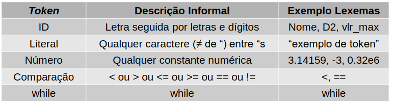

### Atributo dos Tokens

- Usado quando mais de um lexema casa com o padrão do token

  - Ex: identificador, operador relacional, etc.

- Fornece informações adicionais para as fases seguintes do compilador
  - Descreve o lexema representado pelo token
  - Nome do token influencia nas decisões durante a análise sintática
  - Valor do atributo influencia na tradução do token após o reconhecimento sintático

### Erros Léxicos

- Identificar um erro no código fonte durante a análise léxica é difícil sem o auxílio de outros componentes
  - Ex: fi é um identificador ou o if escrito errado?
- Erros léxicos ocorrem quando nenhum dos padrões de token casa com a entrada restante
  - Ex: símbolo desconhecido, lexemas mal formadas, identificadores muito grandes e fim de arquivo inesperado
- Erros associados ao tratamento de constantes:
  - Exceder o limite de casas decimais e do expoente de números reais (tatno no tamanho quando no valor)
  - Exceder o limite máximo de cadeia de caracteres
  - Exceder o limite do número de dígitos e do valor de um inteiro

---

- Estratégias de recuperação podem ser usadas
  - Envolve transformações na entrada restante:
    - Remover um caractere
    - Inserir um caractere que falta
    - Substituir um caractere por outro
    - Transpor dois caracteres adjacentes
  - "Modo pânico": remove caracteres até reconhecer o lexema
  - Estratégia mais simples aplica uma única transformação
  - Estretégia mais geral busca encontrar o menor número de transformaçoes necessárias para obter um lexema válido
    - Na prática, é uma estratégia muito dispendiosa
    - Não garante efetividade dos resultados

### Buffering da Entrada

Consiste na leitura da entrada (código fonte) para a identificação dos lexemas (casamento de um padrão)

- Consome caractere a caractere da esquerda para direita

Identificação correta de um lexema pode exigir a leitura de 1 ou + caracteres a frente (lookahead)

- Ex: na linguagem Fortran, as palavras-chave não são reservadas e os espaços são desconsiderados
  - DOI=1.25 => lexema: DOI - token: ID
  - DOI=1,25 => lexema: DO - token: DO

Técnicas especializadas de buffering são empregadas para reduzir o custo da operação

- Exemplo:
  - 2 buffers para tratar lookaheads grandes com segurança
  - Uso de "sentinelas" para evitar verificação de fim do buffer

### Pares de Buffer

Adota 2 buffers de entrada de mesmo tamanho

- Relacionado com o tamanho do bloco do disco (ex: 4096 bytes)

Comando de leitura do sistema carrega todo o buffer ao invés de um único caractere

- Buffers são recarregados alternadamente
- Caracete especial EOF define fim do arquivo

Abordagem adota 2 ponteiros:

- ini: marca o início do lexema atual
- prox: indica o próximo caractere a ser lido
  - implementa o lookahead até que haja um casamento de padrão
  - Provoca a operação de recarga sempre que extrapola o tamanho do buffer

### Sentinelas

Envolve incluir um caractere extra (sentinela) no fim de cada buffer

- Geralmente é usado o caractere especial EOF
- Exige uma posição a mais na estrutura de armazenamento

Visa reduzir a quantidade de testes a cada caractere lido

- Original: fim de buffer e qual caractere lido
- Sentinela: qual caractere lido

Posição do EOF indica o cenário a ser tratado

- Final do buffer: EOF na última posição
- Final do arquivo de entrada: EOF nas demais posições

### Expressões Regulares (ER)

Notação formal usada para especificar a estrutura (padrões) dos tokens

- Possibilita um analisador léxico sem erros (estrutura precisa)
- Ex: string definida como uma cadeia de caracteres entre aspas
  - Não são todos os caracteres que são permitidos (ex: '\n')
- Ex: números reais em notação de ponto fixo (ex: 3.0 e 0.12)
  - 3. e .12 são aceitos em Fortran, mas não em Pascal

Descreve as linguagens a partir de 3 operações sobre os símbolos de algum alfabeto:

- União: L U M = $\{ s | s \in  \text{L ou s} \in M \}$
- Concatenação: LM = $\{ st | s \in \text{L e t} \in M \}$
- Fecho Kleene: $L* = \cup^{i=0..\infin}L$

### Processo Indutivo

ER podem ser definidas a partir de expressões menores

- Cada expressão r denota uma linguagem L(r)

Regras que formam a base das expressões regulares:

- $\epsilon$ é uma expressão regular e L$(\epsilon) = \{ \epsilon \}$
- Se a é um símbolo de $\Sigma$, então a é uma expressão regular e L(a) = {a}

Regras que formam a parte indutiva das expressões regulares

- (r)|(s) é uma expressão regular denotando L(r) U L(s)
- (r)(s) é uma expressão regular denotando L(r)L(s)
- (r)_ é uma expressão regular denotando L(r)_
- Se r é uma expressão regular, (r) também é e denota a mesma linguagem

### Precedência dos Operadores

1. Fecho
2. Concatenação
3. União

Todos com associatividade a esquerda

### Definições Regulares

Especifica expressões regulares a partir de outras expressões previamente definidas

- Expressões mais simples são nomeadas e seus nomes usados em expressões mais complexas

Não são usadas definições recursivas

- Nova definição baseia-se aepnas nas anteriores

Permite gerar expressões regulares apenas com os símbolos dos $\Sigma$

- Aplicação de substituições consecutivas das definições mais simples nas mais complexas

---

Seja $\Sigma$ o alfabeto. Uma definição regular é uma sequência de definições da forma:

- $d_1 \rarr r_1$
- $d_2 \rarr r_2$
- ...
- $d_n \rarr r_n$

- Cada $d_i$ é um novo símbolo $\notin \Sigma \cup {d_1, d_2, ..., d_{n-1}}$
- Cada $r_i$ é uma expressão regular sobre $\Sigma \cup {d_1, d_2, ..., d_{i-1}}$

### Notação Estendida

Extensões são adicionadas para melhorar a capacidade de especificar padrões de cadeia

- Não fazem parte da notação convencional de expressões regulares
- Usadas na especificação de analisadores léxicos (ex: Lex)

Extensões importantes:

- Operador +: representa o fecho positivo (uma ou mais instâncias)
  - (r) denota a linguagem L(r)
  - r$^+$ = r | $\epsilon$ e r = rr\*
- Operador ?: representa a opção (0 ou 1 instância)
  - r? = r | $\epsilon$
- Operador []: representa classes de caracteres
  - [abc] é equivalente a (a|b|c)
  - Útil para representar sequências lógicas
    - [a-z] é equivalente a (a|b|c|...|z)

### Reconhecimento de Tokens

Considere o fragmento de gramática:

- stmt $\rarr$ if expr then stmt else stmt |
- if expr then stmt |
- expr $\rarr$ term relop term | term
- term $\rarr$ id | num
- Tokens são símbolos terminais da gramática livre de context
- Devem ser reconhecidos e retornados pelo analisador léxico
  - Palavras-chave associadas a if, then, e else
  - Lexemas que casam com os padrões de relop, id e numero
- Separadores (ws) devem ser removidos (tratamento especial)
  - Não retorna token ao analisador sintático
  - Provoca a reinicialização da análise léxica a partir do caractere seguinte

### Diagramas de Transição

Fluxogramas usados no reconhecimento dos tokens

- Muito parecido com os autômatos finitos
- Gerados a partir dos padrões dos tokens
  - Estados: nós que representam as condições que podem ocorrer durante a procura de lexemas que casem com um padrão
    - Possui um estado inical e um ou mais estado finais ou de de aceitação
  - Transições: arestas direcionadas associadas à leitura de um ou + símbolos do alfabeto
    - Provoca mudança de estado e avanço do prox
  - Estados de aceitação indicam um lexema aceito
    - Não possuem transição de saída
    - Estão associados ás ações que devem ser realizadas pelo analisador léxico
    - Símbolo \* indica recuo do prox (tratamento do lookahead)

---

Exemplo
~
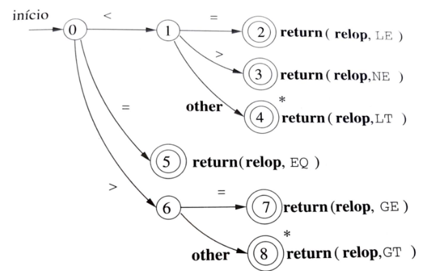

### Palavras-Chave vs. Identificadores

Diferenciar palavras-chave e identificadores pode ser um problema

- Palavras-chave casam com o padrão dos identificadores
- Considerar as palavras-chave como reservadas ajuda no reconhecimento

Existem 2 formas de lidar com palavras reservadas:

- Tratar palavras reservadas como identificador
- Criar diagramas separados para cada palavra-chave

---

Tratar palavras reservadas como identifiacor

- Inicia tabela de símbolos com as palavras reservadas
- Consulta a tabela antes de incluir um novo lexema
  - Se encontrar registro, retora o nome do token
  - Senão inclui o novo lexema e retorna o ID

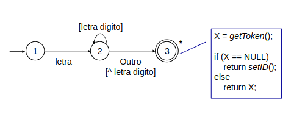

---

Criar diagramas separados para cada palavra-chave:

- Verifica se a cadeia terminou antes de associar o lexema ao token
  - Para evitar erros prioriza o maior prefixo aceito
  - Ex: ifan é um identificador e não a palavra chave if
- Se lexema casar com 2 padrões, deve priorizar a palavra chave

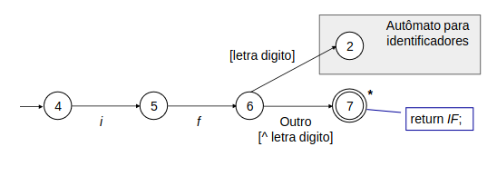

---

Variação que UNIFICA os diagramas do IF e do ID:

- Unificação é uma das estratégias para lidar com vários diagramas durante o processo de reconhecimento

### Diagramas de Transição (Continuação)

Como seriam os diagrama de transição para os demais tokens do nosso estudo de caso?

- then, else, ws e número

---

then e else

- Já está sendo coberto pelo autômato da 1 estratégia (palavras reservadas como identificadores)
- 2 estratégia

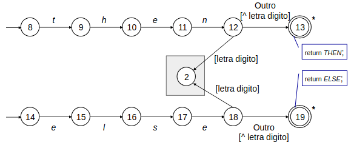

---

ws (separadores)

- Espaços em branco, tabulações e quebras de linha

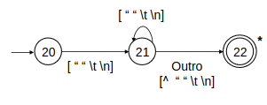

---

Constante numérica

- numero -> digitos(.digitos)? (E[+-]?digitos)?

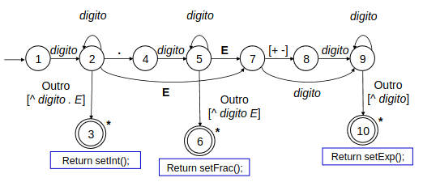

### Formas de Implementação

#### Tabeça de Símbolos

Forma de implementação da estrutura de represetnação dos tokens afeta a memória usada pela tabela de símbolos

- Operadores podem ser representados por 2 caracteres
- Palavras reservadas geralmente não são grandes
  - Também podem ser represetnadas por códigos
- Como lidar com identificadores, números e strings?
- Alocação estática:
  - Vantagem: implementação mais simples
  - Desvantagem: desperdício de memória
- Alocação dinâmica:
  - Vantagem: economia de memória
  - Desvantagem: complexidade de implementação

---

Despenho do analisador é influenciado pela eficiência da consulta a tabela de símbolos

- Busca linear:
  - Mais simples de implementar
  - Pior desempenho (O(n))
- Busca binária:
  - Boa eficiência (O(log n))
- Hashing:
  - Ideal para consulta a palavras reservadas (O(1))
  - Garante acesso sem colisões (palavras já são conhecidas)

#### Diagramas de Transição na implementação

Formas de implementação manual de um código para simular o comportamento de um diagrama

- Solução ad hoc
- Codificação direta do autômato finito
- Uso da tabela de transição

Implementação automático do código

- Muito usado em projetos reais
- Geralmente adotam métodos métodos dirigidos por tabela
- Ex: Lex, JavaCC

#### Solução Ad Hoc

Implementação focada no fluxo de entrada

- Simples e fácil

Estados do autômato são implementados implicitamente

- Aninhamento de IF's define as mudanças de estado
  - Aninhamentos implementam a derivação de um lexema aceito
  - Mesma transição é repetida em diferentes partes do código

Complexidade do código cresce com o Nro. de estados

- Aplicável a autômatos com poucos estados

Implementação personalizada

- Código sensível a mudanças no autômato

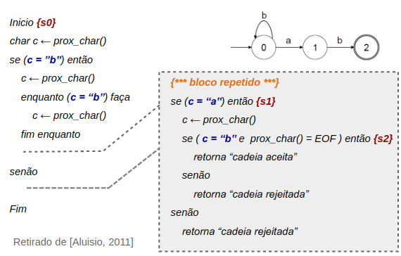

---

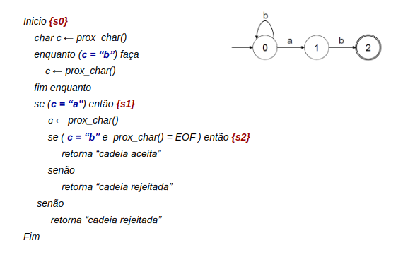

#### Codificação Direta

Reflete diretamente o autômato finito

Estados do autômato são implementados explicitamente

- Estado atual é armazenado em uma variável

Incorpora as transições no código do programa

- Verificação externa trata o estado corrente
  - Leva ao código para cada um dos possíveis estados
- Verificação interna trata o símbolo lido
  - Implementa as ações de um estado
  - Envolve mudanças de estado e leitura do próximo caractere da entrada

Ainda é uma implementação personalizada

- Código permanece sensível a mudanças no autômato

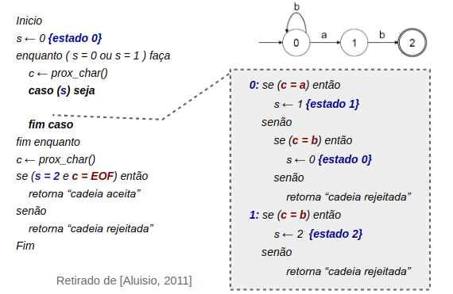

---


#### Tabela de Transição

Autômato representado como uma estrutura de dados

- Tipo Abstrato de Dados (TAD)
- Atributos: descrevem as características do autômato finito
  - Conjunto de transições representado por uma tabela
  - Deve indicar o estado inicial e os finais
  - Precisa representar as entradas não previstas em um estado
- Operações: possiblitam acesso aos atributos do TAD

Permite a implementação de um código genérico

- Especificidades do autômato estão restritas ao TAD

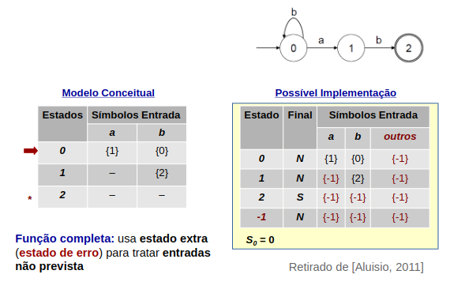
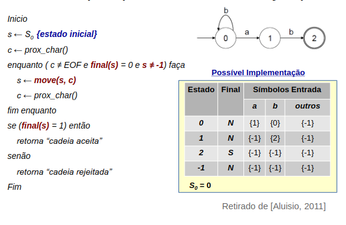
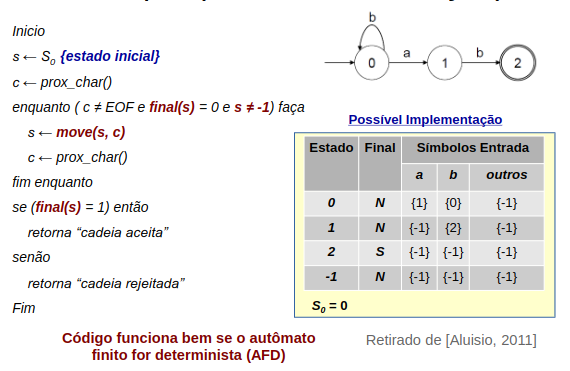

---

Vantagens:

- Código reduzido (elegância)
- Mesmo código atende a várias linguagens (generalidade)

Desvantagem:

- Tabelas estáticas: pode demandas/desperdiçar muito espaço de memória
  - Alfabeto grande ou autômato com muitos estados no autômato
- Tabelas dinâmicas: torna o processamento mais lento

#### Análise Baseada em Diagramas

Analisador léxico precisa executar o código de todos os diagramas para determinar o token a ser retornado

Possíveis estratégias:

- Executar os diagramas sequencialemente
- Executar os diagramas em paralelo
- Combinar todos os diagramas em um único

#### Execução Sequencial

Tokens são verificados em sequência

- Permite diagramas específicos para palavras-chave
- Ordem de execução define a prioridade de reconhecimento entre os tokens
  - Ex: palavras-chave vs. identificadores

Falha no reconhecimento de um diagrama provoca troca de diagrama

- Reinicialização do campo prox
- Inicialização do próximo diagrama

#### Execução Paralela

Tokens são analisados ao mesmo tempo

- Caractere é tratado por todos os diagramas ativos
  - Diagrama ativo: capaz de processar a entrada
- Cada diagrama controla suas transições
  - Se símbolo está previsto então realiza a transição, senão desativa o diagrama

Precisa de regras para tratar ambiguidades

- Define o que fazer quando um padrão é atendido mas ainda existem outros diagramas ativos
  - Ex: thenext ou then ? "->" ou "-" ? "<=" ou "<" ?
- Estratégia mais usual é pegar o lexema mais longo
  - Uso da palavra reservada para priorizar palavras-chave

#### Diagrama Combinado

Todos os diagramas representados em um só

Diagrama gerado deve:

- Ler entrada até não existir transição possível
- Retornar lexema mais longo que casou com um padrão

Tarefa é geralmente complexa:

- Problema: tratar diagramas com a mesma transição
- Solução: usar um autômato finito não determinístico com transições $\sigma$ (AFND$\sigma$)

### Geradores Automáticos de Analisadores Léxicos (LEX / FLEX)

#### Geradores Automático

Gerador de analisadores léxicos

> "Programa que recebe como entrada a especificação léxia para uma linguagem e produz como saída um programa que faz a análise léxica dessa linguagem"

Por que usar um gerador de analisadores?

- Menos trabalho
- Garante a geração de um analisador léxico correto

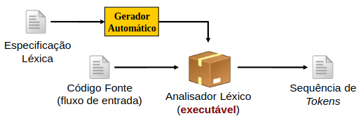

#### Gerador Automático Flex

Flex (Fast Lexical Analyzer Generator)

- Versão GNU do gerador Lex (software livre)

Especificação léxica envolve a descrição dos padrões para os tokens (expressões regulares)

- Usa notação da linguagem Lex (arquivo .l ou .lex)

Compilador Lex gera um programa que simla o diagrama de transição criado a partir dos padrões

- Programa gerado em linguagem C
- Sintaxe: flex -o lexer.c lexer.lex

Compilador C usado para gerar o código executável

- Ex: gcc -o lexer lexer.c

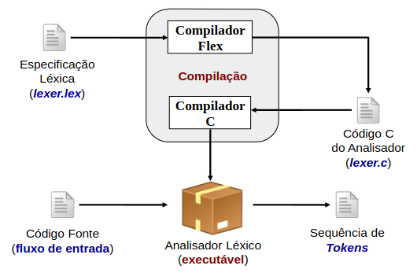

#### Estrutura de Programas Lex

- Expecificação é dividida em 3 partes

```lex
Declarações

%%

Regras de tradução

%%

Código
```

---

Declarações: especifica variáveis globais, constantes manifestas e definições regulares

- Constantes manifestas:
  - Identificadores para constantes (ex: nome dos tokens)
  - Conjunto de diretivas #define do C
- Definições regulares
  - Expressões regulares usadas como símbolos pelos padrões
- Variáveis e constantes manifestas são declaradas dentro de delimitadores especiais %{ e %}
  - Copia o conteúdo diretamente para o arquivo lex.yy.c

---

Regras de tradução: especifica os padrões e suas ações

- Parte principal da especificação léxica (única obrigatória)

Sintaxe: padrão { ação }

- Padrão: expressão regular que descreve um token da linguagem
- Ação: fragmento de código C que determina o que fazer quando um lexema casa com o padrão especificado
  - Mais comum: instanciar um token para o lexema encontrado
  - Pode utilizar funções auxiliares descritas na seção código ou arq. externo

Código: especifica funções auxiliares usadas nas ações

- Também podem ser especificadas em arquivos separados
- Geralmente usadas para manipular a tabela de símbolos

---

Quando nenhum padrão for casado, uma regra padrão do Flex imprime os caracteres não reconhecidos

Precedência na solução de conflitos

1. Preferência pelo prefixo mais longo
2. Ordem de descrição dos padrões no programa Lex

Operador lookahead:

- Padrão: sempre lê o próximo caractere após o casamento do padrão e depois recua a entrada para consumir apenas o lexema
- O que fazer quando o casamento exige que o padrão seja seguindo por um certo conjunto de caracteres?
  - Solução: uso da barra condicional (/)
  - Inclui um padrão adicional após a barra que não faz parte do lexema

---

Exemplo: IF / \\(.\*\\) {letter}

- Padrão permite diferenciar o comando IF de uma variável indexada IF(x, y) no Fortran

  - IF(I, J) = 3
  - IF (condição) THEN

- Necessita que a entrada seja pré-processada para a remoção dos espaços em branco

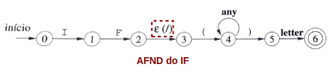

#### Integração com o Programa Usuário

O analisador léxico gerado a partir de um programa lex.

- Usa a rotina yylex() para chamada do analisador pelo usuário

  - Não possui argumento de entrada e retorna um inteiro (padrão)
    - Retorno geralmente é associado pelo usuário ao tipo do token
    - Tipo do retorno pode ser alterado por tipo definido pelo usuário

- Interface realizada por 2 variáveis globais do tipo FILE:

  - Entrada é lida do arquivo endereçado por yyin
    - Padrão é o ponteiro stdin (teclado)
  - Resultado é enviado para o arquivo endereçado por yyout
    - Padrão é o ponteiro stdout (tela)
  - Ambas podem ser modificadas na seção de código do prog .lex

- Variável yytext aponta para a última cadeia reconhecida
  - Variável global do tipo ponteiro para caracteres (string)

## Análise Sintática

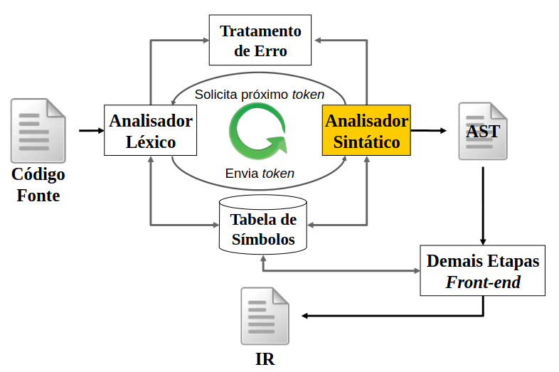

Determina se a estrutura sintática do programa (cadeia de tokens) é aceita na linguagem

- Especificação usa gramáticas livre de contexto (GLC)

  - Tokens são os símbolos terminais da gramática

- GLC descrever maior parte da sintaxe das linguagens
- Fases subsequentes devem analisar a AST para garantir a compatibilidade com as regras que não foram contempladas

Reconhecimento baseado
