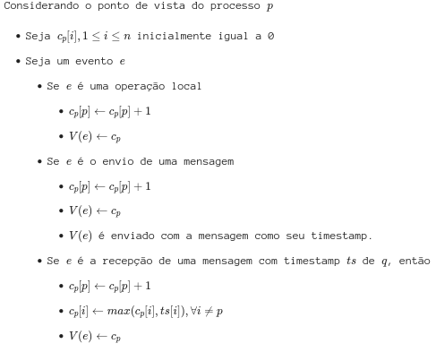
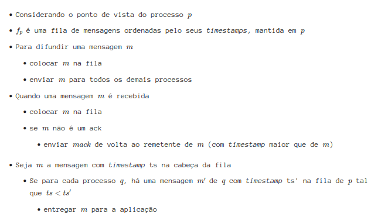
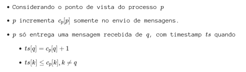
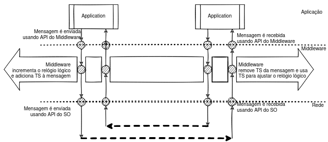

# Sistemas Distribuídos

## Revisão

### Definição

- Um sistema distribuído é um conjunto de computadores independentes, interligados por uma rede de comunicação, que cooperam para realizar uma tarefa.
- Coleção de sistemas computacionais autônomos que se apresentam ao usuário como um sistema único coerente.

### Características

- Sistemas computacionais autônomos ou nós
  - dispositivos de hardware ou processos de software
- Sistema único coerente
  - percebido como um único sistema => nós colaboram na execução da tarefa

### Nós autônomos

- Comportamento independente
- Cada nó tem sua própria noção de tempo
  - sem relógio global
  - problemas fundamentais de sicronização e coordenação
- Comunicação
  - memória compartilhada
  - mensagens
- Em uma coleção de nós:
  - como se faz o gerenciamento de grupos
  - como se garante comunicação com um membro não autorizado

### Sistemas Distribuídos e o Middleware

- Equivalente ao "sistema operacional" de um sistema distribuído
- Oferece diversos serviços:
  - comunicação
  - segurança
  - métricas
  - recuperação de falhas
  - transações
  - composição de serviços

### Escalabilidade em Sistemas Distribuídos

- Pelo menos 3 componentes a considerar

1. Número de usuários ou processos (escalabilidade de tamanho)
2. Distância máxima entre nós (escalabilidade geográfica)
3. Número de domínios administrativos (escalabilidade administrativa)

- Maioria dos sistemas se preocupam apenas com o primeiro caso

---

#### Soluções
  
1. Scale up (vertical scaling): aumentar a capacidade de um dispositivo
   - custo exponencial
   - limitado
2. Scale out: agregar o poder computacional de diversos computadores "baratos"
   - capacidade limitada de crescimento (em teoria)
   - diversos desafios teóricos

---

- Scale Out - desafios:
  - Escalabilidade:
    - Necessidade de aplicar as técnicas de computação distribuída e superar barreiras para conseguir atender o número crescente de clientes
  - Tolerância a falhas:
    - Capacidade de um sistema se manter no ar
    - Implica em redundância, o que fatadicamente implica em distribuição e em Sistemas Distribuídos
- Conclusão:
  - principais razões para se desenvolver sistemas distribuídos são alcançar escalabilidade e tolerância a falhas, ambas resultantes da agregação do poder computacional de múltiplos componentes

### Técnicas para prover escalabilidade

- Mover a computação para o cliente
  - antigamente verificações de formulários eram feitas nos servidores
  - atualmente verificações são realizadas no navegador do cliente utilizando javascript
    - diminui quantidade de requisições ao servidor, evitando sobrecarga do mesmo
- Particionar dados e computação em diversas máquinas
  - DNS é um exemplo, pois funciona de forma hierárquica
- Outros exemplos de técnicas:
  - Bancos de dados e servidores de arquivos replicados
  - Web sites espelhados
  - Caches em navegadores e proxies
  - Caches de arquivos (servidores e clientes)

### Desafios relacionados à replicação

- Principais dificuldades
  - Múltiplas cópias levam a inconsistências: como lidar com escritas e caches
  - Manter cópias consistentes requer sincronização global a cada modificação do estado
  - Sincronização global previne soluções de larga escala
- Observação
  - Se um sistema pode tolerar inconsistências, a necessidade de sincronização global pode ser reduzida:
    - Depende da aplicação

### Desafios no desenvolvimento de sistemas distribuídos

- Muitos sistemas se tornam complexos sem necessidade:
  - Muitas vezes devido a "consertos" de erros detectados
- Algumas suposições falsas durante o desenvolvimento
  - A rede é confiável
  - A rede é segura
  - A rede é homogênea
  - A topologia não muda
  - A latência é zero
  - A banda é infinita
  - Existe apenas um administrador

### Tipos de sistemas distribuídos

- Sistemas de computação (de alta performance)
- Sistemas de informação
- Sistemas de computação pervasiva

### Sistemas de Computação (de alta perf.)

- Teve início com a computação paralela
  - Computadores multiprocessadores
- Memória compartilhada
- Memória privada
- Nunca atingiu expectativa dos programadores
  - pouco usado hoje em dia

#### Clusters

- Coleção de nós similares
- Mesmo sistema operacional

#### Grids

- Federação de sistemas computacionais
- Diferente domínios administrativos
- Componentes fracamente acoplados
- Muito usadas até meados da década passada
- Membros de uma associação disponibilizam capacidade computacional a um pool
- Hardware, software e tecnologias de rede podem ser diferente entre os componentes da grade
- Exemplo
  - SETI@home: pessoas doavam tempo ocioso do seu computador para analisar sinais de rádio recebidos do espaço

#### Cloud

- Modelo de computação utilitária:
  - Fornecimento de recursos computacionais por provedores em troca de um pagamento proporcional à quantidade de recursos utilizados
  - Similar a fornecimento de água ou eletricidade
  - Facilidade para construir infraestrutura
- Infraestrutura para outros sistemas distribuídos
- Complexas peças de engenharia com diversos subsistemas:
  - sincronização de relógios
  - monitoração de falhas, tolerância a falhas e coleta de logs
  - roteamento eficiente

### Socket

- Conexão direta entre dois hosts
- Definição do protocolo:
  - Camada 3: AF_INET ou PF_INET - identifica unicamente o host a se conectar
  - Camada 4: SOCK_STREAM - TCP

### Arquiteturas baseadas em micro serviços

- Partes do sistema são separados em servidores diferentes
  - autenticação dos usuários
  - catologo de produtos
  - serviço de pedidos
  - carrinho

### Organização do Middleware

- prove algum nível de transparência de distro
- camada independente do sistema ou aplicação
- 2 importantes padrões (design patterns)
  - wrappers (enapsuladores)
  - interceptors (interceptadores)

#### Wrappers

- interfaces oferecidas por aplicações legadas inadequadas para todas as aplicações
- Bem mais do transformar interfaces
  - Ex1: adaptadores de objeto: necessidade de invocar objetos remotos
  - Ex2: Amazon S3: servidor web é um adaptador para o serviço real
- sistema com diversos componentes em colaboração
- o(n²) wrappers para N componentes

---

- Alternativa: Brokers
  - componente centralizado que manipula acesso entre componentes o(N)

#### Interceptors

- Quebra o fluxo de controle
- Permite execução de outro código (app specific)
- melhora gerência do software
  - transparência
  - instrumentação
- Ex
  - invocação de objeto remoto

---

- software adaptativo - desafios
  - wrappers e interceptors: adaptam-se a mudanças na mobilidade, QoS na rede, falhas, descarregamento de bateria, etc
- modificar o sistema on-the-fly
- abordagem possível: design baseado em componentes
  - modificável via composição
  - ex: módulos do sistema operacional

## P2P estruturado

- indexação de informação
  - cada item é associado a uma chave
  - chave é o índice para efeitos de localização
  - geralmente utiliza-se uma função hash
    - `key(data item) = hash(data item's value)`
  - sistema P2P: responsável pelo armazenamento dos pares (chave, valor). Exemplo simples: hypercube

### Chord

- nós estruturados em anel lógico
- cada nó possui identificador (id) de m bits
- hash de item gera chave k de tamanho m
- item de dados com chave k é armazenado no nó com menor identificador id >= k
  - nó é denominado sucessor da chave k
- anel é estendido com links de atalho para outros nós

## P2P não-estruturado

- cada nó mantém uma lista ad hoc de vizinhos
- rede overlay resultante semelhante a um grafo randômico:
  - borda (u, v) existe com probabilidade P[(u, v)]
- busca
  - inundação (flooding)
    - nó requisitante u envia requisição para d a cada vizinho v
    - requisição recebida múltiplas vezes é ignorada
    - nó v busca localmente por d (recursivamente)
    - pode ser limitado por um ttl
  - caminhada aleatória (random walk)
    - nó requisitante u envia requisição para d a um vizinho v escolhido aleatoriamente
    - se v não tem d, encaminha requisição ao outro v' escolhido aleatoriamente, e assim por diante

## Redes de super peers

- necessidade de quebrar simetria em redes p2p7

> Skype realiza esse procedimento

## Arquitetura Edge-server

- Sistemas em que servidores são posicionados na borda da rede:
  - fronteiras entre redes da empresa e a internet

## Arquiteturas Híbridas

- bittorrent: busca por arquivo F
  - pesquisa em um diretório global => retorna arquivo Torrent
  - arquivo torrent contém referência para tracker
  - processo P pode ser juntar ao swarm, obter um pedaço (chunk) de graça e trocar o chunk por um outro com um par

## Threads Servidor

- Aumento no paralelismo de processamento de clientes
- A estratégia mais simples é a single threaded

### Single Threaded Server

- Apenas um cliente é atendido por vez
- Servidor é bloqueado enquanto atende um cliente
- É criado uma thread que atende um cliente de cada vez, dessa forma há uma fila de espera para os clientes
- Problema: não explora o paralelismo de máquina e perde performance

### Multi Threaded Server

- Cada cliente é atendido por uma thread
- Quando um cliente estabeleçe conexão, é criada uma thread para atendê-lo
- Problema: podem ser criadas milhares de threads, o que pode causar problemas de escalabilidade no SO. Isso ocorre pois pode haver uma quantidade muito grande de clientes e cada um deles pode abrir uma thread, o que pode causar um problema de escalabilidade no SO

### Thread Pool Server

- Cria um pool de threads, do tamanho ideal para o servidor e o SO em que está sendo executado
- O processo principal trata a conexão com o cliente e coloca o cliente na fila de espera
- Se uma thread estiver livre, ela é acordada e atende o cliente que foi colocado na fila de espera
- Dessa forma, o servidor não precisa criar uma thread para cada cliente, mas sim criar um pool de threads e utilizar as threads do pool para atender os clientes

## Servidores e o estado

- Sem estado
  - Nunca mantêm informações sobre clientes
  - Não grava se algum arquivo foi aberto/acessado (fecha após acesso)
  - Não valida cache
  - Não mantém sessão

- Com estado
  - Mantém informações sobre clientes
  - Grava se algum arquivo foi aberto/acessado (mantém aberto), pre-fetching
  - Valida cache
  - Mantém sessão
  - Obs: a performance é melhorada

## MOM (Message Oriented Middleware)

- Focados nas mensagens trocadas entre precessos em um nível mais alto do que sockets
- Há variações
  - Message Passing Interface (MPI): usada em aplicações HPC (High Performance Computing)
  - MQ (Message Queue): usada em aplicações de negócios
  - Publisher/Subscriber: usada em aplicações de streaming de dados

### MPI

- Usada para coordenar a distribuição e agregação de dados em aplicações em HPC
- Implementações se concentram em c++ e fortran

---

- Paradigma Single Program Multiple Data
  - mesmo binário é executado em vários computadores diferentes, simultaneamente
  - processos recebem parte do volume total de dados a serem processados
    - paralelismo de dados
    - paralelismo de tarefas
  - Quatro das operações providas pelas implementações de MPI:
    - Broadcast
    - Scatter
    - Gather
    - Reduce

### MQ

- Forma de encaminhar dados para nós específicos sem a necessidade de conexão direta
- Uso de caixas de entrada: semelhante a serviço de e-mail/redes sociais para trocas de mensagens
- Permitem enfrentar uma das dificuldades de se implementar sistemas distribuídos hojem em dia: a saída/entrada constante de componentes
  - Desacoplamento temporal
  - Brokers devem se manter online para permitir a comunicação
- Notoriedade recente:
  - Expanção de seu uso em sistema com arquiteturas microsserviços

---

- Problema
  - Como fazer com que todos se conheçam e que cada um saiba exatamente qual informação deve disponibilizar para cada outro?
    - Contactar individualmente cada um dos usuários da mesma rede para perguntar se está interessado?

### Publish/Subscribe

- Modelo de comunicação assíncrona
- Demais mecanismos exigem que os processos se identifiquem
- Na comunicação publish/subscribe, os processos não se identificam
- Processo que envia uma mensagem, publisher, não envia mensagens para um destinatário
  - Em vez disso, publica mensagens com um tópico, aos quais os subscribers podem se inscrever
- A comunicação não acontece diretamente, mas via brokers
- Publishers e subscribers não precisam executar ao mesmo tempo ou sequer saber da existência um do outro
- Exemplo: MQTT

---

- Desaclopamento em várias dimensões das partes envolvidas

## Coordenação

- Coordenação é a habilidade de um sistema de computador de sincronizar a execução de processos

### Exclusão mútua

- Exclusão mútua é a habilidade de um sistema de computador de garantir que apenas um processo tenha acesso a uma seção crítica por vez
- Em um sistema monolítico:
  - uma variável global, um lock, ou outra primitiva de sincronização podem ser usadas na sincronização
- Em um sistema distribuído:
  - a sincronização é feita por meio de mensagens
  - não se torna trivial a sincronização de processos em diferentes máquinas

---

- Propriedades:
  1. Mutual exclusion
  2. Ausência de deadlock
  3. Não há starvation
  4. Espera limitada

---

Soluções para exclusão mútua:

- Servidor centralizado (coordenador)
  - centralizado é um único ponto de falha
  - centralizado pode ser um gargalo
  - centralizado pode ser um ponto de ataque
  - utiliza uma fila de espera

#### Anel

- Cada processo envia uma mensagem para o próximo processo no anel
- na mensagem, o processo envia o token, o qual permite que o processo receba a mensagem e uso um recurso crítico

#### Lidando com falhas

- Em ambos algoritmos, centralizado e do anel, se um processo falha, o algoritmo falha
  - No algoritmo centralizado, se o coordenador falha antes de liberar o acesso para algum processo, ele leva consigo a permissão
  - Em ambos os algoritmos, se o processo acessando o recurso falha, a permissão é perdida e os demais processos sofrerão inanição
  - No algoritmo do anel, se qualquer outro processo falha, o anel é interrompido o anel não conseguirá circular

---

- Timeout
  - qual deve ser um timeout razoável?
    - depende de quanto tempo o processo demora para executar
    - depende de quanto tempo o processo demora para enviar uma mensagem
    - depende de quanto tempo o processo demora para receber uma mensagem
  - O custo esperado por causa dos erros, isto é, a esperança matemática da variável aleatória que representa o tempo de espera, deve ser menor que o tempo de espera máximo
    - C * p < T

---

- Quóruns
  - Número de pessoas imprescindíveis para que uma decisão seja tomada
  - decisão = liberação de acesso ao recurso crítico
- Abordagem semelhante à coordenada:
  - Papel do coordenador é distribuído entre os processos
  - No entanto
    - Participante precisa obter m autorizações antes de acessar o recurso
    - m é o quórum do sistema
- Quórum
  - n coordenadores
  - Participante precisa da autorização de pelo menos m coordenadores
  - Qual o valor adequado para m?
    - m = n/2 + 1
    - m = n - f
      - f é o número máximo de falhas toleradas
      - n é o número de processos
- Algoritmo: Coordenador
  - inicializa o recurso como livre
  - ao receber uma requisição, a enfileira
  - ao receber uma liberação
    - se do processo a quem autorizou, marca o recurso como livre
    - senão e se de um processo na fila, remove o processo da fila
    - senão, ignore mensagem
  - sempre que recurso estiver marcado como livre E a fila não estiver vazia
    - remove o processo da fila
    - envia liberação para o processo removido
    - marca o recurso como ocupado

## Uso de relógios sincronizados

- Necessidade de sincronização do tempo entre máquinas, pois as mesmas possuem um atraso relativo ao seu relógio de quartzo
- São atualizados em relação aos relógios atômicos
- ntp é principal protocolo de atualização de tempo físico em máquinas
- Servidores mantêm e distribuem um tempo físico, sendo que, quanto mais próximos estão dos servidores dos relógios atômicos, mais precisam são seu tempo
- Calculo, ro = 0,1 s/s (atraso de uma máquina por segundos)
  - se quero manter no máximo um erro delta = 1 s
  - devemos atualizar o relógio de delta/ro = 1/0,1 = 10 segundos em 10 segundos

### Ordenação de mensagens por timestamp

- Apenas a ordenação de mensagens não é suficiente se tivermos servidores replicados com distâncias significativas entre si
- É necessário que servidor espere um tempo conhecido (descoberto durante a excução da aplicação) de tempo máximo de latência entre um servidor e outro cliente
- Toda mensagem que é recebida, é colocada em uma fila e é esperado um tempo para que se possa executar os elementos dessa fila

### Tempo Lógico

- Não há necessidade de se utilizar um tempo físico, se eventos possuem entre si uma causalidade
- Causalidade:
  - processos na mesma máquina são eventos que precedem entre si
  - envio e recebimento são eventos que precedem entre si
  - transitividade permite que eventos precedam também
- Dessa forma, é possível apenas utilizar números inteiros representando a causalidade entre eventos, permitindo uma ordenação nas mensagens
  - Relógio lógico de Lamport

### Relógio vetorial

- São relógios lógicos que possuem um vetor de relógios lógicos de cada processo envolvido na comunicação
- Seguem a seguinte especificação:



## Comunicação em Grupo

- Um processo envia mensagens para um conjunto de processos
- Difusão totalmente ordenada
  - mesagens são enviadas de 1 para n
  - todos os processos entregam as mensagens na mesma ordem
- Difusão casualmente ordenada
  - uma mensagem só é entregue se todas as que casualmente precedem já foram entregues

> como resolver o problema do cloud-drive com estas abstrações

### Replicação de máquinas de estado

- Programa se comporta de forma determinística
- O que acontece se tivermos várias cópias deste programa, executando em locais distintos, mas garantirmos que cada cópia veja exatamente a mesma entrada de dados
- Ao utilizar D.T.O (Difusão totalmente ordenada), garantimos a igualdade entre as cópias, pois os comandos foram entregues para todas as cópias na mesma ordem

### Difusão totalmente ordenada

- Canais devem ser FIFO e entrega garantida



### Difusão casualmente ordenada



### Comunicação em grupo - Middleware

- Implementação de forma transparente para a aplicação
- Clientes enviam requisições como faziam antes do serviço ser replicado
- Como então as mensagens tem seus relógios lógicos atualizados e usados para a geração de timestamps?
  - Interceptadores em uma camada de middleware



## Falhas

### Classificação de problemas

- Falta(defect, fault, falha):
  - Erro no desenvolvimento do Sistema: bug, defeito de fabricação
  - Existem mesmo se for raramente ativada e mesmo se seus efeitos nunca forem percebidos
- Erro
  - manifestação da falha
- Falha
  - erro percebido pelo usuário
  - pode afetar componentes

### Classificação de faltas

- quebra
  - componente para de funcionar
  - comunicação é interrompida
- sistemas fail-stop
  - parada forçada quando percebem uma falha
  - outros componentes sabem (são informados) da falha
- sistemas fail-recover
  - processo falho pode ser forçado a recuperar o estado em que estava logo antes do problema se manifestar
  - necessidade de capacidade de armazenar estado
- omissão (omission failure)
  - componente deixa de executar alguma ação
  - exemplo
    - requisição recebida por um servidor não é processada
    - disco não armazena os dados no meio magnético
    - mensagem não é transmitida
  - difícil de ser identificado
  - quebra é uma omissão contínua (na quebra o servidor não responde para sempre)
- temporização
  - violação de limites de tempo
  - exemplo
    - se o meio de comunicação se recusou a entregar uma mensagem que deveria ser entregue dentro de 3ms, houve falha de omissão
  - omissão é uma temporização contínua (na omissão o servidor não respondeu, tempo infinito de demora de entrega)
- arbitrário (bizantino)
  - qualquer comportamento pode acontecer
  - exemplos
    - mensagem modificada
    - servidor pode reiniciar-se constantemente
    - dados podem ser apagados
    - acesso pode ser dado a quem não é devido
  - causadas por faltas no software/hardware, hackers e vírus
- hierarquia de falhas
  - fail stop C quebra C omissão C temporização C arbitrária

### Lidando com falhas (failures)

- prevenção
  - por meio de técnicas bem estabelecidas de engenharia
  - uso de linguagens de programação fortemente tipadas
  - análise estática, especificação formal, teste e prova
    - TLA+, Promela
- remoção
  - tradução de especificações formais para código é um passo complexo
  - testes e manutenção do sistema permitem a remoçao de faltas
- tolerância
  - mesmo se faltas ainda estiverem presentes, seus efeitos não devem ser percebidos como falhas
  - necessário detectar e se recuperar de erros
  - exemplo
    - sistema de arquivos que mantenha um journal, como o ext3

---

- redundância como ferramenta de melhoria
  - para previnir faltas, redundância de tempo para refinar projetos
  - para remover faltas, redundância de tempo para testar e manter o sistema
    - remover os pontos únicos de falha (SPOF, Single Point of Failure)
- no caso de um sistema distribuído
  - redundância = cópias ou réplicas
  - quando um apresenta erro, outros processos podem continuar a operar

### Replicação

- ideia simples
  - criar cópias de um componente (serviço) para garantir disponibilidade
- implementação complexa
  - diversas possibilidades
  - diferentes níveis de "consistência" e corretude
    - cada um com prós e contras

### Replicação - Multi-escritores

- clientes enviam modificações (escritas) e recuperações (leituras) para qualquer réplica
- encaminhamento de mensagens
  - udp
  - tcp
  - ordem?
- anti-entropia
  - combinação de gossiping e usando relógios vetoriais para concordar nas versões de dados conflitantes
  - em algum momento replicas estarão consistentes, eventula consistency
  - exemplos: Cassandra, Redis, Dynamo
  - estado alcançado não necessariamente faz sentido

### Replicação - Soluções

- Único-escritor
  - Operações de escrita direcionadas para uma única réplica
  - Operações de leitura podem ser direcionadas à mesma réplica ou a quaisquer das replicas
    - depende da consistência dos clientes
  - primário/cópias (primary/backup)
    - operações x estado
      - o que o primário deve passar para as cópias?
    - cópias desatualizadas
      - operações de leituras podem ser feitas nas cópias?
  - replicação em cadeia (chain replication)
    - generalização do primário
    - processos se organizam em uma sequência
    - atualizações sempre direcionadas ao primário (cabeça)
    - leituras
      - se necessidade de dados escritos mais recentemente, também direcionadas à cabeça
      - caso contrário, podem ser direcionadas aos processos na cauda
        - diminui a carga de trabalho na cabeça
        - quanto mais relaxado for a exigência de "frescor" dos dados, mais para o fim da cauda a replicação pode ser enviada
  - identificação de falhas é crítico para bordagens baseadas em um primário
  - primeiro desafio está em identificar a falha
    - tarefa não trivial ou impossível em algumas situações
  - identificação perfeita de falhas
    - e as operações que já foram entregues para o primário mas que ainda não foram propagadas para as réplicas
    - se esta situação for inaceitável, replicação ativa pode ser usada

### Replicação ativa

- Todas as cópias executam todos os comandos
- Todas aptas a continuar a executar o serviço a qualquer instante
- exemplo - replicação de máquinas de estados
  - utiliza primitivas de comunicação em grupo
  - primitivas vistas anteriormente não são funcionais
    - não toleram falhas

### Dependabilidade

- sistema ter a propriedade de se poder depender do mesmo
- componente C depende de um componente C' se a corretude do comportamento de C depende da corretude do componente C'
- propriedade pode ser dividida em outras propriedades mais "simples"
  - disponibilidade (availability) - prontidão para uso
  - confiabilidade/fiabilidade (reliability) - capacidade de funcionar corretamente
  - segurança (safety) - capacidade de evitar danos
  - integridade (integrity) - capacidade de manter dados consistentes
  - manutenibilidade (maintainability) - capacidade de ser mantido

- disponibilidade
  - (tempo de disponiblidade acordado - tempo de indisponibilidade) / tempo de disponibilidade acordado

- confiabilidade
  - tempo médio para falha, MTTF (mean time to failure)
    - expectativa de quanto tempo resta até que o sistema apresente o próximo defeito (relevante)
  - tempo médio para diagnóstico, MTTD (mean time to diagnosis)
    - expectativa de quanto tempo resta até que o sistema seja diagnosticado
  - tempo médio para reparo, MTTR
  - tempo médio entre falhas, MTBF (mean time between failures)
    - expectativa de quanto tempo resta até que o sistema apresente o próximo defeito (relevante)

### Detectores (não confiáveis) de falha

- necessidade de perceber quando problemas acontecem
  - exemplo, componente não funcional pode necessitar manutenção
    - reinicialização, troca de disco ou uma fonte, etc
- detectores de falhas
  - introduzidos por Chandra e Toueg
  - forma de encapsular a percepção do estado funcional dos outros processos

---

- detectores de falhas
  - podem ser confiáveis ou não confiáveis
- normalmente implementados por meio de trocas de mensagens de heartbeat
- mensagens são esperadas em momentos específicos
  - recebimento sugere que remetente continua funcional

---

- propriedades
  - completude (completeness)
    - capacidade de suspeitar de um processo defeituoso
  - acurácia (accuracy)
    - capacidade de não suspeitar de um processo correto
  - processo correto:
    - não falha durante execução do protocolo

---

- Classificação: captura combinações de eventos apresentadas
  - Completude Forte
    - A partir de algum instante, todo processo falho é suspeito permanentemente por todos os processos corretos
  - Completude Fraca
    - A partir de algum instante, todo processo falho é suspeito permanentemente por algum processo correto
  - Precisão Forte
    - Todos os processos são suspeitos somente após terem falhado
  - Precisão Fraca
    - Algum processo correto nunca é suspeito de ter falhado
  - Precisão Eventual Forte
    - A partir de algum instante, todos os processos são suspeitos somente após terem falhado
  - Precisão Eventual Fraca
    - A partir de algum instante, algum processo correto nunca é suspeitado

---

- Detector ideal
  - Completude Forte e Precisão Forte
  - Conhecidocomo P ou Perfeito
  - Só podem ser implementados em sistema síncronos
    - ausência de uma mensagem significa que mensagem não será entregue
  - Em ambientes parcialmente síncronos
    - É possível implementar detectores não confiáveis
    - Se os processo dispõem de temporizadores precisos
      - Detector pode considerar um limite de tempo para tentar determinar processos encontram-se defeituosos ou não, como nas figuras apresentadas acima
    - Detectores podem voltar atrás em suas suspeitas
    - Informação provida já pode ser suficiente para que se resolve diversos problemas em computação distribuído

### Consistência

- Modelos
  - Surgiram em dois mundos diferentes
    - Sistemas distribuídos: diz respeito à execução de conjuntos de operações individuais sobre objetos simples, como uma variável
    - Bancos de dados: se refere às garantias dadas por transações
  - Apesar do ponto de partida disjunto, os dois pontos de vista podem ser unificados

---

- Modelos - simplificação
  - Considere um banco de dados para falar tanto sobre modelos para operações simples quanto para transições
  - Tabela do tipo chave/valor
    - Podem ser associadas a comandos
      - X recebe 'João' e qual o valor de Y
    - Várias partes:
      - `{"Endereço": "Av1, número2", "Profissão": "Computeiro"}`
  - Simplificação poderosa (bancos NOSQL)

---

- Expectativa x Realidade
  - Esta expectativa é o que denominamos um modelo de consistência
  - Processos esperam um certo comportamento quanto ao funcionamento deste banco
    - Exemplo, ao escrever um dado no banco, o cliente geralmente espera que as escritas aconteçam na ordme em que as disparou e que, ao ler, lhe seja retornado o "último" valor escrito

- Níveis de Consistência
  - Forte: leituras sempre retornam versão mais recente do dado sendo lido
    - Propagação instantânea ou locks dos dados sendo manipulados enquanto a propagação acontece
  - Fraca: leituras podem retornar versões mais antigas

---

- Implementação de modelo de consistência
- Dificuldades:
  - Operações não são atõmicas
  - Processo em máquinas distintas
  - Tempo de propagação para os comandos e respostas
  - O problema se agrava com banco de dados distribuído

### Modelos centrados nos dados

- Linearizabilidade (linearizability)
  - Modelo mais forte de consistência
  - Operações aparentem executar atomicamente
  - Respeitam a ordem temporal das ações
  - Mesmo comportamento de um sistema centralizado
  - Execução é equivalente a uma thread executando, onde não há concorrência entre as operações

---

- Consistência Sequencial (sequential consistency)
  - permite leituras de versões antigas
  - permite escritas em ordens diferentes
  - mesma sequência de escritas em todo o banco

---

- Consistência Causal (causal consistency)
  - Escritas com potencial relação causal são vistas por todos os processo na mesma ordem
  - Escritas concorrentes (não casualmente relacionadas) podem ser vistas em ordem diferentes por processos diferentes

---

- Consistência FIFO (FIFO consistency)
  - Escritas de um processo são vistas por todos os outros processos na ordem em que foram feitas
  - Escritas de diferentes processos podem ser vistos em ordem diferentes

---

- Consistência de Entrada
  - Efeitos de operações individuais em um grupo não são visíveis
  - Variáveis de sincronização
    - Acesso às variáveis de sincronização da datastore é sequencialmente consistente
    - Acesso à variável de sincronização não é permitido até que todas as escritas das anteriores tenham sido executadas em todos os lugares
    - Acesso aos dados não são permitidos até que sejam liberados

---

- Objetivo
  - Evitar sincronização global
  - Se para os clientes parecer consistente, tudo bem
- Consistência Eventual
  - Se nenhuma escrita ocorrer em período considerável de tempo, os clientes gradualmente se sincronizarão e ficarão consistentes
  - Se clientes sempre acessarem as mesmas réplicas, terão impressão de consistência
- Garantias são do ponto de vista de um cliente
  - Leituras monotônicas
  - Escritas monotônicas
  - Leia suas escritas
  - Escritas seguem leituras

---

- Leituras Monotônicas
  - Garantia
    - Se um processo lê o valor de um item x, qualquer leitura sucessiva de x retornará o mesmo valor ou um mais recente
  - Exemplo:
    - Toda vez que se conecta a um servidor de e-mail, seu cliente lê novas mensagens, caso haja
    - O cliente nunca esquece uma mensagem, mesmo que ainda não esteja no servidor conectado por último

---

- Escritas Monotônicas
  - Garantia
    - Se um processo escreve em item x, então esta operação deve terminar antes que qualquer escrita sucessiva em x possa ser executada pelo mesmo processo
  - Exemplo
    - Sistema de arquivos na rede:
      - escrita do conteúdo de um arquivo, em certa posição, só pode ser feita se escritas anteriores já estão registradas no arquivo

---

- Leia suas escritas
  - Garantia
    - Se um processo escreve um item x, então leituras sucessivas no mesmo item pelo mesmo processo devem refletir tal escrita
  - Exemplo
    - Atualizar código fonte de uma página e exigir que o navegador carrega a nova versão

---

- Escritas seguem leituras
  - Garantia
    - Se um processo lê um item x, então escritas sucessivas no mesmo item só podem ser completadas se o mesmo reflete o valor lido anteriormente
  - Exemplo
    - Só é permitido enviar uma resposta a uma mensagem se a mensagem em si é vista, independentemente do cliente ter se movimentado

## Consenso

- Replicação de processos
  - Processo devem entrar em acorodo quanto a uma sequência de comandos a serem processados por todos
- Problemas de acordo
  - Processos devem concordar em alguma coisa
  - Solução depende do modelo computacional
    - De triviais a impossíveis
- Difusão atômica e consenso distribuído são problemas equivalentes

### Modelo

- Considere um conjunto sigma = {p1, ..., pn} de n processos
- Processos se comunicam exclusivamente por meio de troca de mensagens
  - Primitivas send(m) and receive(m)
- Assume-se o modelo crash failure
  - Um processo correto nunca falha
  - Um processo faltoso eventualmente falha
- Existem f processos faltosos

### Especificação

- Propriedades
  - Integridade uniforme: se um processo decide um valor v, então v foi previamente proposto por algum processo
  - Acordo uniforme: dois processo não podem deciddir de modo diverso
  - Terminação: todo processo correto eventualmente decide exatamente um valor

### Consenso em sistema síncronos

- Velocidade relativa dos processos e atrasos de mensagens são delimitados
- Execução procede em sequência de rodadas
  - Em cada rodada:
    - Processos geram nova mensagem a partir do estado atual e a enviam a todos os processos
    - Ao final, aplicam função de transição de estado utilizando o estado atual e mensagens obtidas para definir novo estado
    - Se um processo falhar no meio de envio de mensagem, apenas um subconjunto dos processos pode receber a mensagem

---

- Algoritmo 1:
  - Cada processo mantém variável W contendo subconjunto de V, o conjunto de todos os valores possíveis
  - Inicialmente, cada processo pi possui apenas seu próprio valor inicial em W
  - Em cada rodada, cada processo pi difunde (broadcasts) sua variável W e, ao final, adiciona todos os elementos recebidos ao seu próprio W
  - Depois de f + 1 rodadas, pi escolhe um elemento v de W de maneira
- Exemplo de execução
  - Por que precisamos de f + 1 rodadas
    - para garantir que todos os processos receberão os mesmos valores propostos, pois se f + 1 processos falharem, processos terão comandos diferentes

### Consenso em sistemas assíncronos

- Sem limite para velocidade relativa dos processos e atrasos na mensagens
- Execução em sequência de rodadas
  - Em cada rodada
    - Processos geram nova mensagem a partir do estado atual e a enviam a todos os processos
    - Experam por n - f respostas e aplicam função de transição de estado utilizando o estado atual e mensagens obtidas para definir novo estado
    - Se um processo falhar no meio do envio de mensagem, apenas um subconjunto dos processos pode receber a mensagem

---

- Resultado de impossibilidade de FLP
  - "Impossibility of distributed consensus with one faulty process", by Fischer, Lynch, and Paterson, JACM 1985
  - Nenhum algoritmo consegue resolver consenso em um sistema assíncrono sujeito a falhas
  - Resultado fundamental em computação distribuída
  - Válido para f >= 1, independente do valor de n

### Resolvendo consenso

- Sistemas síncronos são muito fortes, e assíncronos não possuem uma solução
- Para resolver consenso, pode-se
  - Fortalecer as considerações sobre o modelo
  - Enfraquecer a definição do problema
  - Fazer as 2 coisas acima

#### Fortalecendo o modelo

- Sistema parcialmente síncrono
  - Sistema assíncrono que eventualmente se torna síncrono
  - Global Stabilization Time (GST)
    - Tempo a partir do qual sistema se torna síncrono
    - Desconhecido para os processos
  - Questão fundamental
    - É possível criar um algoritmo de consenso que nunca viola safety enquanto o sistema é assíncrono e garante liveness quando condições adicionais são satisfeitas?

#### Consenso com GST

- Dwork, Lynch and Stockmeyer, "Consensus in the presens of partial synchrony", JACM 1988
  - Modelo de rodadas sobre sistemas parcialmente síncronos

---

- n = 3*f + 1

```portugol
Initialization
v <- process p's proposed value

Round r:
send v to all processes

if messagens received >= n - f then
  v <- most often received value, if not unique take the smallest
  if at least n - f values received equal to x and not decided then
    decide x
```

#### Consenso com detectores de falhas

- Consenso também pode ser resolvido em sistemas assíncronos com detectores de falhas
  - Classes de detectores de falhas

---

- Chandra e Toueg: resolvendo consenso com S
  - n = 2*f + 1 processos

```portugal
Initialization
  v = proposed value
  r = 0
  t = 0

While undecided do
  c = (r mod N) + 1
  r = r + 1
  send (p, r, v, t) to c

  c waits for first ceil((n + 1) / 2) estimates
  c chooses the estimate w with the largest timestamp
  c proposes (c, r, w)

  p wait for a proposal or suspects c
  if proposal (c, r, w) is received then
    v = w
    t = r
    send (r, ACK) to c
  else
    send (r, NACK) to c
  

upon receiving (decide, w)
  p sends (decide, w) to all
  p decides on w and halts
```

#### Consenso com eleição de líderes

- Sistema assíncrono com eleição de líderes
- n = 2 * f + 1
- Paxos (Lamport)
  - Quatro papéis:
    - Proposers
    - Acceptors, um quorum Qa de acceptors, onde |Qa| > n/2
    - Learners
    - Coordinator/Leader

---

- Paxos
  - Oráculo de eleição de líder
    - Cada processo p tem acesso a um oráculo de eleição de líder que retorna um processo denominado leaderp tal que existe
  - Se não houver eleição de líder, os proposers irão "brigar" entre sí para decidir seu valor
    - Ficam incrementando alternadamente as rodadas entre si

#### Enfraquecendo a definição e fortalecendo o modelo

- Algoritmos randomizados
  - Mais forte que mdoelo assíncrono
    - processos podem fazer escolhas aleatórias

- k-set agreement
  - Acordo: no máximo k valores diferentes são decididos
  - Validade: um valor decidido é um valor proposto
  - se f < k
    - Primeiros f + 1 processos enviam valores iniciais para todos
    - Um processo decide no primeiro valor que receber

## Difusão tolerante a falhas

- A ideia é utilizar um middleware entre a camada de aplicação e a de transporte com funções
  - broadcast(m), enviar mensagem para todas as máquinas
  - deliver(m), entregar mensagem para a aplicação

### Especificação (DTF)

- Modelo
  - Considere um conjunto com n processos
  - Assuma o mdelo crash failure
    - um processo correto nunca falha

### Difusão confiável

> garante entrega

- Difusão confiável (Reliable broadcast)
  - Validade: se um processo correto faz a difusão de uma mensagem m (broadcast(m)), então todos os processos corretos eventualmente entregam m (deliver(m))
  - Acordo: se um processo correto entrega m, então eventualmente todos os processo corretos entregam m
  - Integridade: para qualquer mensagem m, todos processo correto entrega m no máximo uma vez, e somente se m já foi previamente difundida

#### Difusão confiável uniforme

- O que muda é o acordo
  - acordo uniforme: se um processo ~~correto~~ entrega m, então eventualmente todos os processos corretos entregam m

### Difusão FIFO

- Difusão FIFO (FIFO broadcast)
  - Garante a difusão confiável
  - Ordem FIFO: se um processo correto difunte m antes de m', então nenhum processo correto entrega m' a menos que tenha feito a entrega de m

#### Difusão FIFO uniforme

- Ordem FIFO: se um processo ~~correto~~ difunte m antes de m', então nenhum processo ~~correto~~ entrega m' a menos que tenha feito a entrega de m

### Difusão causal

- Difusão causal (Causal broadcast)
  - Garante a difusão confiável e a difusão FIFO
  - Exemplo:
    - Em uma aplicação de envio de notícias, se usuários difundem seus artigos com difusão FIFO, o seguinte pode ocorrer:
      1. Usuário A difunde um artigo
      2. Usuário B entrega o artigo e difunde uma resposta ao artigo
      3. Usuário C entrega a resposta de B antes do artigo de A
  - Ordem causal: se a difusão de uma mensagem m precede a difusão de uma mensagem m', então nenhum processo correto entrega m' a menos que tenha feito a entrega de m

#### Difusão causal uniforme

- Ordem causal: se a difusão de uma mensagem m precede a difusão de uma mensagem m', então nenhum processo ~~correto~~ entrega m' a menos que tenha feito a entrega de m
