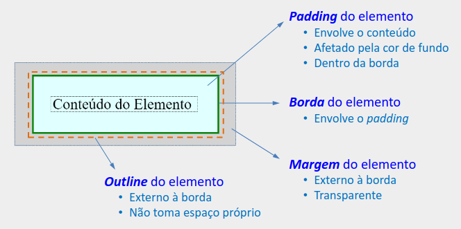
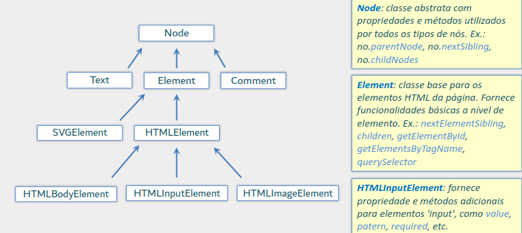

# Programação para Internet

## HTML

- Inicialmente havia HTML e XHTML desenvolvidos pela W3C e a WHATWG, respectivamente.

### Elementos HTML

-`<nomedoElemento>conteúdo</nomeDoElemento>`: elemento com tag de abertura e fechamento

- Há elementos que não possuem tag de fechamento (fechamento implícito)
  - tag ``
- Inicia com a tag `<!DOCTYPE html>`, que especifica o tipo de documento e sua versão (HTML5)
- `<html>`: elemento raiz
- `<head>`: cabeçalho do documento
- `<title>`: título do documento
- `<meta>`: metadados do documento
- `<link>`: link para outros documentos
- `<style></style>`: especificação de estilo
- `<body></body>`: corpo do documento
- `<h1></h1>`: título de nível 1
- `<h2>`: subtítulos de nível 2
- `<h3>`, `<h4>`, `<h5>` e `<h6>`: subtítulos menores
- `<p>`: parágrafo
  - começam em uma nova linha
  - espaçamento antes e depois (padrão)
- `<abbr>`: abreviação ou acrônimos
- `<address>`: endereço e contato em geral
- `<pre>`: texto pré-formatado
  - preserva espaços e quebras de linha
- `<br>`: quebra de linha
- `<q>`: citações curtas
  - apresentada com aspas
- `<blockquote></blockquote>`: citações longas
  - apresentada com recuo
- `<cite>`: citações de títulos de trabalhos criativos
  - apresentada com itálico
- `<b></b>`: adicionar importância sem destacar
- `<strong></strong>`: conteúdo tem forte importância ou urgência
  - lido com entonação forte
- `<i>`: historicamente usado para itálico
  - termos ténicos ou estrangeiros
- `<em>`: enfatizar um termo
  - lido com entonação
- `<ul>`: lista não ordenada
- `<ol>`: lista ordenada
- `<li>`: item de lista
- `<dl>`: lista de definições
- `<dt>`: termo a ser definido
- `<dd>`: definição do termo
- ``: inserir imagem
  - atributo `src`: caminho da imagem
  - atributo `alt`: texto alternativo
  - atributo `title`: título da imagem
  - atributo `width`: largura da imagem (evita mudanças de layout durante carregamento da página)
  - atributo `height`: altura da imagem (evita mudanças de layout durante carregamento da página)
- `<figure>`: figura (conjunto de imagens, gráficos, diagramas, códigos, etc.)
  - imagem exibida com recuo
  - pode ser figuras geradas por programas (js)
  - `<figcaption>`: legenda da figura

### Árvore DOM

- Árvore que é construída quando um documento é carregado em um navegador, permitindo que o navegador acesse e manipule os elementos do documento de forma dinâmica.

### Hyperlinks

- `<a href="http://www.ufu.br> UFU </a>`: link para o site da UFU
  - atributo `href`: endereço do link
  - atributo `target`: onde o link será aberto
    - `_blank`: abre em uma nova janela
    - `_self`: abre na mesma janela
    - `_parent`: abre no frame pai
    - `_top`: abre na janela principal

### Tabelas

- `<table>`: tabela
  - `<thead>`: cabeçalho
    - `<th>`: célula de cabeçalho
  - `<tbody>`: corpo
    - `<td>`: célula de dados
  - `<tfoot>`: rodapé
  - `<tr>`: linha da tabela

### HTML5 e classificação de conteudo

- HTML5 agrupa os tipos de elemento pelas características de seus conteúdos (imagem, vídeo, texto, etc...)

- Porém anteriormente os elementos eram separados em grupos como: elementos de bloco e elementos de linha

#### Elementos de bloco

- Começam e terminam com uma quebra de linha
- Ocupam toda a largura disponível
- Pode conter outros elementos de bloco ou de linha

#### Elementos de linha

- Não iniciam e nem terminam com uma quebra de linha
- São categorizados como elementos inline

### Elementos div e span

- `<div>`: divisão de conteúdo
  - agrupa elementos
  - não possui significado semântico
  - é generico em nível de bloco
  - muito utilizado com css ou javascript
  - usar apenas quando não houver elemento semântico mais adequado

- `<span>`: agrupa elementos
  - não possui significado semântico
  - é generico em nível de linha
  - muito utilizado com css ou javascript
  - usar apenas quando não houver elemento semântico mais adequado

### Conteúdo Embutido (iframe)

- `<iframe>`: inserir conteúdo externo
  - atributo `src`: endereço do conteúdo
  - atributo `width`: largura do conteúdo
  - atributo `height`: altura do conteúdo
  - atributo `frameborder`: borda do conteúdo
  - atributo `scrolling`: barra de rolagem
  - atributo `allowfullscreen`: permite tela cheia
  - atributo `allow`: permite acesso a recursos do conteúdo
  - atributo `sandbox`: permite acesso a recursos do conteúdo
  - atributo `name`: nome do conteúdo

### Exibição e Arquivos de Vídeo

- `<video>`: inserir vídeo
  - atributo `src`: endereço do vídeo
  - atributo `width`: largura do vídeo
  - atributo `height`: altura do vídeo
  - atributo `controls`: controles de reprodução
  - atributo `autoplay`: reprodução automática
  - atributo `loop`: reprodução em loop
  - atributo `muted`: áudio silenciado
  - atributo `poster`: imagem de pré-visualização
  - atributo `preload`: pré-carregamento do vídeo
  - atributo `crossorigin`: acesso a recursos de vídeo de outro domínio

### Atributos Globais

- `id`: identificador único do elemento
- `title`: título do elemento (mostra uma dica para o usuário um tooltip com o texto)
- `lang`: idioma do conteúdo
- `data-*`: atributo personalizado
  - atributo de dado costumizado
  - permite ao desenvolvedor criar seu próprio atributo
- `contenteditable`: permite a edição do conteúdo
- `class`: permite referenciar uma classe CSS
- `style`: permite especificar estilos CSS

### Validação da Página HTML

- Existem validadores de HTML online
  - validator.w3.org
- Para garantir um HTML consistente e correto, é importante validar o código
  - Pode gerar inconsistências entre navegadores

### Entidades HTML

- Códigos que representam caracteres especiais
- `&nbsp;`: espaço em branco que evita quebra de linha

### Elementos Semânticos de Estrutura e Layout

- `<header>`: cabeçalho
- `<nav>`: menu de navegação
- `<main>`: conteúdo principal
- `<aside>`: conteúdo secundário (barras laterais ao site)
- `<footer>`: rodapé
- `<section>`: seção de conteúdo, agrupa conteúdos relacionados
- `<article>`: conteúdo independente (exibição de conteúdos diferentes entre si)

### Descrição da Página com o Elemento `<meta>`

- `<meta>`: metadados
  - atributo `name`: nome do metadado
  - atributo `content`: conteúdo do metadado
- Exemplos:
  - `<meta name="description" content="Site de notícias sobre tecnologia">`
  - `<meta property="og:image" content="URL-da-imagem">`
  - `<meta property="og:title" content="título">`

### Formulários

- `<form>`: formulário
  - atributo `action`: endereço para onde os dados serão enviados
  - atributo `method`: método de envio dos dados
    - `get`: envia os dados pela URL
    - `post`: envia os dados de forma oculta
  - atributo `target`: onde o formulário será aberto
    - `_blank`: abre em uma nova janela
    - `_self`: abre na mesma janela
    - `_parent`: abre no frame pai
    - `_top`: abre na janela principal
  - atributo `enctype`: tipo de codificação dos dados
    - só utilizado quando método for igual a `post`
    - `application/x-www-form-urlencoded`: codificação padrão
    - `multipart/form-data`: codificação para envio de arquivos
    - `text/plain`: codificação para envio de texto
  - atributo `autocomplete`: indica se o formulário deve ser preenchido automaticamente
    - `on`: preenchimento automático
    - `off`: preenchimento manual
  - atributo `novalidate`: indica se o formulário deve ser validado
    - `novalidate`: não valida o formulário
  - atributo `accept-charset`: indica os caracteres aceitos no formulário
  - atributo `name`: nome do formulário
  - atributo `id`: identificador único do formulário
  - atributo `class`: permite referenciar uma classe CSS
  - atributo `style`: permite especificar estilos CSS
  - atributo `lang`: idioma do conteúdo
  - atributo `dir`: direção do texto
    - `ltr`: esquerda para direita
    - `rtl`: direita para esquerda
  - atributo `title`: título do formulário
  - atributo `tabindex`: ordem de tabulação
  - atributo `accesskey`: atalho de teclado
  - atributo `hidden`: oculta o formulário
  - atributo `contenteditable`: permite a edição do conteúdo
  - atributo `draggable`: permite arrastar o formulário
  - atributo `dropzone`: permite soltar o formulário
  - atributo `spellcheck`: permite a verificação ortográfica do formulário
- `<input>`: campo de entrada usado no formulário
  - atributo `name`: nome do campo
  - atributo `id`: identificador único do campo (pode ser utilizado em conjunto com atributo `for` do elemento `<label>`)
  - atributo `type`: identifica o tipo de input
- `<label>`: rótulo do campo
  - atributo `for`: identifica o campo que o rótulo se refere
  - atributo `id`: identificador único do rótulo
  - atributo `name`: nome do rótulo
  - atributo `class`: permite referenciar uma classe CSS
  - atributo `style`: permite especificar estilos CSS
  - atributo `lang`: idioma do conteúdo
  - atributo `dir`: direção do texto
    - `ltr`: esquerda para direita
    - `rtl`: direita para esquerda
  - atributo `title`: título do rótulo
  - atributo `tabindex`: ordem de tabulação
  - atributo `accesskey`: atalho de teclado
  - atributo `hidden`: oculta o rótulo
  - atributo `contenteditable`: permite a edição do conteúdo
  - atributo `draggable`: permite arrastar o rótulo
  - atributo `dropzone`: permite soltar o rótulo
  - atributo `spellcheck`: permite a verificação ortográfica do rótulo
- `button`: utilizado para submissão do formulário
  - atributo `type`: tipo de botão
    - `submit`: envia os dados do formulário
    - `reset`: limpa os dados do formulário
    - `button`: botão genérico
  - atributo `name`: nome do botão

### Métodos GET e POST do form

- GET é melhor para buscar dados e insere informações do formulário na URL
- POST é melhor para enviar dados e não insere informações do formulário na URL, e sim no corpo da requisição HTTP

### Observações sobre botões

- `<button>`: botão genérico para formulários
  - submissão padrão
  - equivalente à "`<button type="submit">`"
  - dentro de um form enviará o formulário
  - possibilidade de ter outros elementos como conteúdo (como ``)
- `<button type="button">`
  - botão para uso geral
  - não envia um formulário automaticamente

---

- `input type="submit"`: botão de submissão
  - equivalente à "`<button type="submit">`"
  - atributo `value`: texto do botão
  - dentro de um form enviará o formulário
  - não possui conteúdo
- `<input type="reset" value="Limpar">`
  - Botão do tipo reset
  - Dentro de um form, limpará os dados do formulário (restaurará os valores iniciais)

---

- Botão está associado a uma ação
- Link está associado a um direcionamento
- Use botões como botões e links como links
  - Não utilize `<div>`, `<span>` ou `<a>` para criar botões
  - Não utilize `<button>` como link

### Campo radio - `<input type="radio">`

- Permite a seleção de um único item dentre vários itens
- Utiliza-se `label` para associar o rótulo ao campo, e o atributo `for` para identificar o campo
- Utilize o atributo `name` para agrupar os itens
- Utilize o atributo `value` para definir o valor do item que será enviado no item da seleção (valor do input se marcado)
- O atributo `checked` indica que o item está selecionado
- Utilize-se o `<fieldset>` para agrupar os campos de de formulários
  - `<legend>`: título do grupo de campos

### Campo checkbox - `<input type="checkbox">`

- Permite a seleção de um ou mais itens dentre vários itens
- O atributo value deve conter o valor do item
- O atributo name deve conter o nome do grupo de itens
- O atributo checked pré-seleciona o item

### Campos para Data e Hora

- `<input type="date">`: campo para data
  - são enviados no padrão ISO 8601
  - Ex: 2018-12-31
- `<input type="time">`: campo para hora
- `<input type="datetime-local">`: campo para data e hora
  - são enviados no padrão ISO 8601
  - Ex: 2018-12-31T23:59:59
  - atributo min: define o valor mínimo
  - atributo max: define o valor máximo

### Campo para E-mail

- `<input type="email">`
  - navegador exige @
  - Teclado com @ em smartphones

### Campo para Número de Telefone

- `<input type="tel">`
  - Teclado com números e símbolos
  - Facilita preenchimento para o usuário

### Campos number e range

- `<input type="number">`: campo para números
  - atributo `min`: define o valor mínimo
  - atributo `max`: define o valor máximo
  - atributo `step`: define o intervalo entre os valores
- `<input type="range">`: campo para números
  - atributo `min`: define o valor mínimo
  - atributo `max`: define o valor máximo
  - atributo `step`: define o intervalo entre os valores
  - atributo `value`: define o valor inicial

### Campo Oculto hidden

- `<input type="hidden">`: campo oculto
  - não é exibido ao usuário
  - comumente utilizado para enviar informações que não devem ser exibidas ao usuário
  - atributo `value`: define o valor do campo

### Campo de Cor

- `<input type="color">`: campo para cor
  - atributo `value`: define o valor inicial
  - atributo `list`: define a lista de cores

### Campo select

- `<select>`: agrupa options
  - atributo `multiple`: permite a seleção de múltiplos itens
  - se necessário, utilize o atributo `label` para definir um rótulo para o grupo de opções
- `<option>`: define uma opção
  - atributo `value`: define o valor do campo
  - atributo `selected`: define a opção selecionada

### Campo textarea

- `<textarea>`: campo de texto
  - atributo `name`: define o nome do campo
  - atributo `id`: define o identificador do campo
  - atributo `cols`: define a largura do campo
  - atributo `rows`: define a altura do campo
  - atributo `placeholder`: define um texto de exemplo
  - atributo `disabled`: desabilita o campo
  - atributo `readonly`: define o campo como somente leitura
  - atributo `required`: define o campo como obrigatório
  - atributo `autofocus`: define o campo como focado automaticamente
  - atributo `wrap`: define o comportamento do texto
    - `hard`: quebra de linha
    - `soft`: não quebra de linha
  - atributo `maxlength`: define o número máximo de caracteres

### Campo para Arquivo

- `<input type="file">`: campo para arquivo
  - deve-se utilizar `enctype="multipart/form-data"` no form
  - atributo `accept`: define o tipo de arquivo aceito
  - atributo `multiple`: permite a seleção de múltiplos arquivos
  - atributo `capture`: define a fonte de captura
    - `user`: captura de imagem do usuário
    - `environment`: captura de imagem do ambiente
    - possui baixa compatibilidade
  - atributo `files`: permite resgatar informações dos arquivos selecionados

### Outros atributos booleanos

- `disabled`: desabilita o campo (não será enviado no formulário)
- `autofocus`: define o campo como focado automaticamente
- `readonly`: define o campo como somente leitura
- `required`: define o campo como obrigatório

### Outros atributos para campos textuais

- `pattern`: define um padrão para o campo para filtrar valores permitidos
- `minlength`: define o número mínimo de caracteres
- `maxlength`: define o número máximo de caracteres
- `size`: define o tamanho do campo

### Observação sobre validação de formulários

- Validação de formulários é feita no lado do cliente
- Nunca se deve confiar apenas na validação do lado do cliente
- Servidor deve validar os dados enviados

## CSS - Cascading Style Sheets

- CSS é uma linguagem de estilo
- preocupa-se com a aparência dos elementos

### Formas de incluir CSS

- Inline
  - Atributo style de um elemento
  - uso deve ser evitado
- Interno
  - Utiliza o elemento `<style></style>` dentro do `<head>`
  - Estilos específicos da página, não compartilhados
- Externo
  - Utiliza o elemento `<link>` dentro do `<head>`, referenciando um arquivo externo
  - Várias paginas podem utilizar o mesmo arquivo de estilo
  - Melhor separação entre conteúdo e estilo (melhor prática)

### Regra, Seletores e Propriedades

- Regra: conjunto de propriedades
- Seletores: define quais elementos serão afetados pela regra
- Propriedades: define o estilo dos elementos selecionados

---

- Agrupando seletores
  - `h1, h2, h3 { color: red; }`

### Seletores

#### ID (#idDoElemento)

- Seleciona um elemento com base no seu ID
- Exemplo: `#titulo { color: red; }`

#### Filho (x > y)

- Seleciona um elemento filho de outro elemento

#### Descedente (x y)

- Afeta os elementos `<y>` que estão dentro de `<x>`

#### Irmão Adjacente (x + y)

- Seleciona o elemento `<y>` que está imediatamente após o elemento `<x>`

#### Irmão Geral (x ~ y)

- Seleciona todos os elementos `<y>` que estão após o elemento `<x>`

#### Atributo

- Seleciona elementos com base em um atributo do html

#### Classe (.classeDoElemento)

- Seleciona elementos com base em uma classe
- Exemplo: `.titulo { color: red; }`

#### x.classeDoElemento

- Seleciona elementos com base em uma classe e no nome do elemento
- Exemplo: `h1.titulo { color: red; }`

#### Múltiplas Classes

- Seleciona elementos com base em múltiplas classes
- Exemplo: `.titulo.vermelho { color: red; }`

### Propriedades CSS

#### Ajuste de fonte

- font-family: define a fonte do texto
  - exemplo: `font-family: Arial, Helvetica, sans-serif;`
- font-style: define o estilo da fonte
  - exemplo: `font-style: italic;`
- font-size: define o tamanho da fonte
  - exemplo: `font-size: 12px;`
- font-weight: define a espessura da fonte
  - exemplo: `font-weight: bold;`
- font-variant: define a variação da fonte
  - exemplo: `font-variant: small-caps;`
- font-strecht: define a esticagem da fonte
  - exemplo: `font-strecht: condensed;`
- line-height: define a altura da linha
  - exemplo: `line-height: 1.5;`

#### Ajuste de texto

- text-align: define o alinhamento do texto
  - exemplo: `text-align: center;`
- text-decoration: define a decoração do texto
  - exemplo: `text-decoration: underline;`
- text-indent: define a indentação do texto
  - exemplo: `text-indent: 50px;`
- text-transform: define a transformação do texto
  - exemplo: `text-transform: uppercase;`
- vertical-align: define a alinhamento vertical do texto
  - exemplo: `vertical-align: middle;`
- color: define a cor do texto
  - exemplo: `color: #ff0000;`

#### Ajuste de cor

- Utiliza a notação RGB
  - `rgb(red, green, blue)`
  - `rgb(255, 0, 0)`
- também pode utilizar a notação hexadecimal
  - `#ff0000`
- Cor HSL(Hue, Saturation, Lightness)
  - hsl(120, 100%, 50%)

#### Tamanho de Fonte

- Valor absoluto
  - Valor em pixel (px)
  - Valor em pontos (pt)
  - Valor em polegadas (in)
  - Valor em centímetros (cm)
  - Valor em milímetros (mm)
  - Palavras chave: xx-small, x-small, small, medium, large, x-large, xx-large
- Valor relativo
  - pode depender do tamanho da fonte do elemento pai
  - exemplos: em, rem, %, larger, smaller

---

- Tamanho relativo em
  - relativo ao tamanho da fonte do elemento pai
  - 2em = 2 vezes o tamanho da fonte do elemento pai
- Tamanho relativo rem
  - relativo ao tamanho da fonte do elemento raiz (html)
- Outros relativos
  - larger, smaller, %
  - relativo ao tamanho da fonte do elemento pai

#### Propriedade font

- font: shorthand para as propriedades font-family, font-size, font-style, font-variant, font-weight e line-height
  - exemplo: `font: italic small-caps bold 12px/30px Georgia, serif;`

#### Ajuste de Fundo

- background-color: define a cor de fundo
  - exemplo: `background-color: #ff0000;`
- background-image: define a imagem de fundo
  - exemplo: `background-image: url("imagem.jpg");`
- background-repeat: define a repetição da imagem de fundo
  - exemplo: `background-repeat: no-repeat;`
- background-size: define o tamanho da imagem de fundo
  - exemplo: `background-size: cover;`
- background-position: define a posição da imagem de fundo
  - exemplo: `background-position: center;`
- background-attachment: define o comportamento da imagem de fundo
  - exemplo: `background-attachment: fixed;`

#### Contéudo, Padding, Borda e Margem



#### Padding

- Abreviado
  - `padding: 20px 10px 20px 10px;` (top, right, bottom, left)
  - `padding: 20px 10px 20px;` (top, right/left, bottom)
  - `padding: 20px 10px;` (top/bottom, right/left)
  - `padding: 20px;` (top, right, bottom, left)
- Individuais
  - `padding-top: 20px;`
  - `padding-right: 10px;`
  - `padding-bottom: 20px;`
  - `padding-left: 10px;`

#### Margin

- Abreviado
  - `margin: 20px 10px 20px 10px;` (top, right, bottom, left)
  - `margin: 20px 10px 20px;` (top, right/left, bottom)
  - `margin: 20px 10px;` (top/bottom, right/left)
  - `margin: 20px;` (top, right, bottom, left)
- Individuais
  - `margin-top: 20px;`
  - `margin-right: 10px;`
  - `margin-bottom: 20px;`
  - `margin-left: 10px;`

##### Observação

- Margens entre elementos vizinhos não se somam
- Prevalece o máximo entre as margens
- margin collapsing

#### Borda

- Abreviada
  - `border: 1px solid #ff0000;` (width, style, color)
  - a ordem dos valores não importa
  - estilos: solid, dotted, dashed, double, groove, ridge, inset, outset, none, hidden
- Individual
  - `border-top: 1px solid #ff0000;`
  - `border-right: 1px solid #ff0000;`
  - `border-bottom: 1px solid #ff0000;`
  - `border-left: 1px solid #ff0000;`

---

- Definindo aspectos específicos das bordas
  - `border-color: #ff0000;`
  - `border-style: solid;`
  - `border-width: 1px;`

#### Border Radius

- `border-radius: 10px;` (top-left, top-right, bottom-right, bottom-left)
- `border-radius: 10px 20px;` (top-left/bottom-right, top-right/bottom-left)
- `border-radius: 10px 20px 30px 40px;` (top-left, top-right, bottom-right, bottom-left)

#### Box Shadow

- `box-shadow: 10px 10px 5px #ff0000;` (offset-x, offset-y, blur-radius, color)

#### Box-sizing

- `box-sizing: content-box;`
  - valor padrão
  - width e height definem o tamanho do conteúdo (width + padding + border + margins)
- `box-sizing: border-box;`
  - width e height definem o tamanho total da caixa (tamanho contando conteúdo, padding e borda)

#### Display

- `display: inline;`
  - width e height não funcionam
  - margins e paddings superiores e inferiores não funcionam
- `display: block;`
- `display: inline-block;`
  - permite usar width e height
  - margins e paddings superiores e inferiores funcionam
- `display: none;`
- `display: flex;`
- `display: grid;`
- `display: inline-flex;`
- `display: inline-grid;`

#### Visibility

- `visibility: hidden;`
  - oculta o elemento, mas mantém o espaço reservado
- `visibility: collapse;`
  - oculta o elemento e remove o espaço reservado sem alterar o layout (utilizado em tabelas)
- `visibility: visible;`
  - valor padrão

#### Float

- `float: left;`
  - elemento flutua para a esquerda do elemento pai, elementos inline se posicionam em volta
- `float: right;`
  - elemento flutua para a direita do elemento pai, elementos inline se posicionam em volta
- `float: none;`
  - valor padrão
  - elemento não flutua

#### Overflow

- `overflow: visible;`
  - valor padrão
  - conteúdo não é cortado
- `overflow: hidden;`
  - conteúdo é cortado
- `overflow: scroll;`
  - conteúdo é cortado e é exibido uma barra de rolagem
- `overflow: auto;`
  - conteúdo é cortado e é exibido uma barra de rolagem se necessário
- variações
  - `overflow-x`
  - `overflow-y`

#### Position

- `position: static;`
  - valor padrão
  - posicionamento padrão
- `position: relative;`
  - posicionamento relativo
  - o elemento é posicionado de acordo com o seu posicionamento padrão
  - pode ser movido com as propriedades top, right, bottom e left
- `position: absolute;`
  - posicionamento absoluto
  - o elemento é posicionado de acordo com o elemento pai mais próximo que tenha a propriedade position diferente de static
  - pode ser movido com as propriedades top, right, bottom e left
- `position: fixed;`
  - posicionamento fixo
  - o elemento é posicionado de acordo com a janela do navegador
  - pode ser movido com as propriedades top, right, bottom e left
- `position: sticky;`
  - posicionamento fixo
  - o elemento é posicionado de acordo com a janela do navegador
  - pode ser movido com as propriedades top, right, bottom e let

#### transform

- `transform: translate(10px, 20px);`
- `transform: translateX(10px);`
- `transform: translateY(20px);`
- `transform: rotate(45deg)`
- `transform: scale(2)`

### Centralizando elementos

- Centralizando com transform e position
  - `position: absolute;`
  - `top: 50%;`
  - `left: 50%;`
  - `transform: translate(-50%, -50%);`

- Centralizando com flexbox
  - `display: flex;`
  - `justify-content: center;`
  - `align-items: center;`

- Centralinzado na horizontal com width e margin
  - `width: 200px;`
  - `margin: 0 auto;`

- Centralizando na vertical com height e margin
  - `height: 200px;`
  - `margin: auto 0;`

### Pseudo-classes

- define estilo para elementos quando eles estão em um estado particular
- `:visited`
  - para links já visitados
- `:invalid`
  - para campos inválidos
- `:link`
  - para links não visitados
- `:hover`
  - para elementos quando o mouse está sobre eles
- `:active`
  - para elementos quando estão sendo clicados
- `:valid`
  - para campos válidos
- `:checked`
  - para elementos que estão marcados
- `:focus`
  - para elementos que estão com o foco
- `:first-child`
  - para o primeiro elemento filho
- `:last-child`
  - para o último elemento filho
- `:nth-child(n)`
  - para o n'ésimo elemento filho

### Pseudo-elementos

- define estilo para partes específicas de um elemento
- `::first-line`
  - para a primeira linha de um elemento
- `::selected`
  - para elementos que estão selecionados (usuário selecionou o texto com o mouse)
- `::after`
  - para inserir conteúdo após o elemento
  - não pode ser usado em elementos sem conteúdo
- `::before`
  - para inserir conteúdo antes do elemento
  - não pode ser usado em elementos sem conteúdo
- `::placeholder`
  - para o placeholder de um elemento
  
## JavaScript

- Linguagem de programação dinâmica

### JavaScript e ECMAScript

- Ecma International - organização que desenvolve padrões
- ECMAScript é uma linguagem padronizada, uma especificação
  - ECMA-262 é o nome do padrão propriamente dito
- Javascript é uma implementação da ECMAScript

### Manipulação da Árvore DOM

- Adicionar/modificar o conteúdo dos elementos HTML
- Adicionar novos elementos
- Modificar atributos de elementos
- Modificar estilos CSS
- Ocultar/mostrar elementos
- Remover elementos

### Javascript no HTML

- em arquivo separado
  - `<script src="script.js"></script>`
  - permite reuso de código
  - arquivos js podem ser mantidos em cache pelo navegador
    - maior agilidade no carregamento
- no html
  - usar tag script no final do body ou dentro do header

### Execução do Código Javascript no Navegador

- Fase 1 - Execução durante carregamento - síncrona
  - O código JS inserido com `<script>` é executado durante a fase de carregamento do HTML
  - Operações comuns: resgistro de **event handlers** a serem executadas na 2º fase
  - Em geral, vários script inseridos com `<script>` são executados na ordem em que aparecem no documento HTML*
- Fase 2 - Execução em resposta a eventos - assíncrona
  - Código executado na ocorrência de eventos como click de botão, rolagem de página, etc.
  - As funções a serem executadas geralmente são registradas na Fase 1

> Obs: esse comportamento pode ser alterado usando o atributo async ou defer

### Javascript no navegador - Threading

- Javascript no navegador executa em modo de thread-única (single-threaded)
  - O navegador para de responder a interface do usuário enquanto o codigo js é executado
  - pode causar uma experiência ruim para o usuário
- É possível executar um código em outra thread (background) usando web workers , mas com acesso limitado ao contexto da thread principal  

### Recursos da lingugagem

- var:
  - Pode ser declarada em qualquer lugar do código
  - Pode ser redeclarada
  - variáveis globais podem ser acessadas 
- let:
  - Pode ser declarada em qualquer lugar do código
  - Não pode ser redeclarada
  - variáveis globais não podem ser acessadas
- const:
  - Pode ser declarada em qualquer lugar do código
  - Não pode ser redeclarada
  - deve ser inicializada no momento da declaração

### Manipulando a Árvore DOM

- Tipo de elementos na árvore DOM
  
  

- Hierarquia de Nós na estrutura DOM
  - Nó Root: nó representando o elemento raiz `<html>`
  - Nó Filho: nó representando um elemento diretamente dentro de outro
  - Nó Pai: nó representando o elemento que contém o nó filho
  - Nós Irmãos: nós representando elementos filhos do mesmo pai

#### Busca na Árvore DOM

- `document.querySelector()`
  - retorna o primeiro elemento que corresponde ao seletor CSS
  - retorna o primeiro nó na árvore DOM (do tipo Element) que atende à seleção
  - Ou retorna null caso não haja correspondência
  - Nenhum elemento é retornado caso o seletor incluia pseudo-elementos
- `document.querySelectorAll()`
  - aceita uma string contendo um seletor CSS
  - retorna uma lista com todos os nós da árvore DOM que atendem a seleção
  - ou retorna uma lista vazia caso não haja correspondência

## PHP (PHP: Hypertext Processor)

- Gratuito e Open Source
- Pode ser executado em várias plataformas
  - windows, linux, mac, etc
- Compatível com vários servidores HTTP
  - Apache, NGINX, IIS, etc
- Suporta vários bancos de dados
- Há vários frameworks para desenvolvimento web
  - Laravel, Symfony, Zend, etc
- Serviços gratuitos de hospedagem com suporte a php
- Muito popular e de fácil aprendizado

### Comunicação PHP com MySQL

- MySQLi Extension (MySQL Improved)
  - Interface específica para o MySQL
  - Desempenho otimizado
  - Suporta alguns recursos espcíficos do MySQL
- PHP Data Objects (PDO) Extension
  - Provê interface única e consistente para vários SGBDs
  - Incluindo MySQL, PostgreSQL, Firebird, IBM DB2, etc.t

## AJAX

### XHR

1. Criar objeto XMLHttpRequest(XHR)
2. Indicar a URL da requisição - método open
3. Indicar função para tratar resposta - propriedade onload
4. Enviar a requisição - método send

---

- Exemplo

```js
let xhr = new XMLHttpRequest()

xhr.open("GET", "filmes.txt", true)

xhr.onload() = function () {
  if(xhr.status === 200)
    console.log(xhr.responseText)
  else
    console.log("Falha: " + xhr.status + xhr.responseText)
}

xhr.onerror = function() {
  console.log("Erro ao nível de rede")
}

xhr.send()
```

---

- Propriedades de Evento do XHR
  - onloadstart
  - onloadend
  - onprogress
  - onreadystatechange
  - ontimeout

#### XHR req retornando imagem

```js
let xhr = new XMLHttpRequest();
xhr.open("GET", "imagemMuitoGrande.jpg");
xhr.responseType = "blob";
xhr.onload = function () {
  const blob = xhr.response;

  const img = document.createElement("img");
  img.src = window.URL.createObjectURL(blob);
  document.body.appendChild(img);
};

xhr.send();
```

#### XHR req retornando HTML como Document

```js
let xhr = new XMLHttpRequest();
xhr.open("GET", "conteudoAdicional.html");
xhr.responseType = "document";

xhr.onload = function () {
  const doc = xhr.response;
  alert(doc.querySelector("h1").textContent);
};

xhr.send();
```

#### XHR req retornando JSON

```js
let xhr = new XMLHttpRequest();
xhr.open("GET", "endereco.php?cep=38400-100");
xhr.responseType = 'json';

xhr.onload = function () {
  if (xhr.response === null) {
    console.log("Resposta não obtida");
    return;
  }

  const endereco = xhr.response;
  form.bairro.value = endereco.bairro;
  form.cidade.value = endereco.cidade;
};
xhr.send();
```

#### XHR req enviando JSON

```js
let objetoJS = {
  modelo : "Fusca",
  ano : "1970"
};
let xhr = new XMLHttpRequest();
xhr.open("POST", "cadastra.php");

xhr.onload = function () { ... }

xhr.setRequestHeader("Content-Type", "application/json");

xhr.send(JSON.stringify(objetoJS));
```

#### Submetendo Formulário com FormData

```js
let meuForm = document.querySelector("meuForm");

let formData = new FormData(meuForm);
let xhr = new XMLHttpRequest();
xhr.open("POST", "cadastra.php");
xhr.send(formData);
```