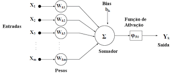

# Mineração de Dados

## Introdução

### Motivação

> O que é mineração de dados?

- é o processo de preparação de dados para uso eficiente em modelos/processos de inteligência artificial
- um dos assuntos mais exitantes da atualidade
- estão presentes nos mais diversos momentos da nossa vida

> Onde é utilizado?

- Pesquisas na internet
- Reconhecimento facial de pessoas em redes sociais...
- Filtrando spans da sua caixa de emails...

> Por que é tão predominante hoje?

- Grandes avanços na coleta de dados e tecnologia de armazenamento permitem que organizações acumulem um vasto conjunto de dados
- Mineração de dados, diferente das técnicas tradicionais de análises de dados, permitem extrair informação úteis desses grandes conjuntos

### Sitemas de Informação e Mineração de Dados

- SI
  - coleta, processa, armazena, analisa e dissemina informações para um objetivo específico
- MD
  - processo de descobrir informações úteis em grandes repositórios de dados de maneira automática

### Visão Geral MD

- Técnicas são desenvolvidas para limpar grandes bases de dados de modo a encontrar padrões novos e úteis que podem, caso contrário, permanecer desconhecidos

- Esquema geral: dados => informação
  - Input Data => Pre-processamento de dados => Mineração de dados => Pos-processamento de dados => Informação

### Surgimento da área

Desafios colocados pelas novas bases de dados que motivaram o surgimento da mineração de dados:

- Escalabilidade
  - bases de dados com gigabytes ou terabytes de dados
- Alta dimensionalidade de dados
  - bases de dados com centenas ou milhares de atributos
- Dados complexos e heterogêneos
  - bases podem conter atributos contínuos, categórigos, textos semi-estruturados, etc;
- Propriedades dos dados e distribuição
- Análises não tradicionais

### Áreas Relacionadas à MD

- Amostragem, estimação e testes de hipótese a partir da Estatística
- Busca, técnicas de modelagem e teorias de aprendizado a partir da Inteligẽncia Artificial

### Etapas do Processo de Descoberta do Conhecimento

#### Dados de entrada

- podem ser armazenados em uma variedade de formatos (tabelas relacionais, planilhas, etc)

#### Pré-processamento dos dados

- etapa que visa colocar os dados de entrada em um formato apropriado para análise subsequente
- tarefas relacionadas à esta etapa incluem união de dados de várias fontes, limpeza dos dados a fima de remover ruídos e observações duplicadas e seleção manual de registros e características que são relevantes para a tarefa de mineração de dados
- devido às muitas formas que dados podem ser coletados e armazenados, **esta etapa é talvez a mais trabalhosa** e a que consome mais tempo dentro do processo de descoberta de conhecimento

#### Pós-processamento de dados

- integração dos resultados de mineração de dados aos sistemas de apoio à decisão
- essa etapa assegura que somente resultados válidos e úteis são incorporados ao sistema de apoio à decisão
- medidas estatísticas ou métodos de teste de hipótese podem ser aplicados durantes a fase para eliminar reultados de MD falsos

#### Tarefas de Mineração de Dados

Normalmente, são divididas em duas categorias

- Tarefas preditivas
  - almejam prever os valores de um atributo particular tendo baseado ns valores de outros atributos
  - o atributo a ser predito é denominad alvo (target) ou variável depedente, enquanto os atributo usados para fazer a predição são chamados de explicativos ou variáveis independentes.

- Tarefas descritivas
  - almejam derivar padrões (correlação, agrupamentos, anomalilas, etc) que resumam as relações subjacentes nos dados
  - tarefas descritivas e francamente requerem téncicas de pós-processamento para validar e explicar os resultados

Exemplos de tarefas de mineração de dados bastante comuns e que serão estudadas na disciplina:

- modelagem preditiva
  - modelo para predição da variável alvo em função as variáveis independentes: regressão e classificação
- análises de associação
  - descoberta de padrões que descrevem atributos fortemente associados na base dados
- agrupamento
  - busca por grupos de observações com alguma similaridade
- detecção de anomalia
  - identificação de observações com caraterísticas que distoam do padrão

## Dados

> Objetivos?

- Compreender conceitos relacionados aos tipos de dados e entender bases de dados podem ser formadas por diferentes tipos de dados
- Analisar a importância da qualidade dos dados no processo de mineração e aprender técnicas que podem ajudar a melhorar a qualidade dos dados
- Estudar as principais etapas de pré-processamento dos dados

### Bases de dados

- uma base de dados pode ser vista como uma coleção de objetos de dados
- objetos de dados são descritos por um número de atributos que capturam as caraterísticas básicas de um objeto

> Frequentemente, uma base de dados é um arquivo, no qual os objetos são linhas no arquivo e cada coluna corresponde a um atributo

### Tipos de dados

#### Atributos e medidas

- Atributos é uma propriedade ou caracterísitca de um objeto que pode variar, ou de um objeto para outro ou de um tempo para outro

- Medida de escala é uma função que assoca um valor numérico ou simbólico ao atributo de um objeto
  - Fazemos o processo de atribuir medidas em vários momentos
    - pesando
    - classificando as pessoas em homens e mulher
    - contando
  - Em todos esses casos, o valor físico de um atributo de um objeto é mapeado para um valor simbolico ou numérico

#### Tipo de um atributo

- Aponta quais propriedades dos atributos são refletidas nos valores para medí-lo

- Pode-se definir quatro tipos de atributos:
  - nominal, ordinal, intervalo, frequência
- Obs: Atributos nominais e ordinais são denominados atributos categóricos, enquanto atributos de intervalos e frequência são denominados atributos numéricos

#### Descrição de atributos pelo número de valores

- Atributos podem ser divididos pelo número de valores que podem ter:
  - Discreto: atributos que possuem um conjunto de valores finitos ou "contavelmente" infinito
    - Binário: um caso especial do atributo discreto, onde apenas 2 valores são assumidos, p. ex: verd/false
  - Contínuo: valores reais

#### Tipos de bases de dados

- Características gerais:
  - Dimensionalidade
  - Esparsidade
  - Resolução
- Três grupos* de bases de dados:
  - Dados de registros
  - Dados baseados em grafo
  - Dados ordenados

> Esses grupos não cobrem todas as possibilidades de bases de dados

### Qualidade dos dados

#### Medidas e erros na coleta de dados

- Erros de medida referem-se a qualquer problema resultante do processo de medida dos dados
- Erro de coleta dos dados referem-se a erros tais como, omissão de objetos de dados ou valores de atributos, ou inapropriadamente incluir um objeto de dado

#### Ruídos

- É o componente aleatório de um erro de medida. Ele pode envolver distorção de um valor ou a adição de um objeto sujo
  - Eliminação de ruído costuma ser difícil
  - Muitas pesquisas focam no desenvolvimento de algoritmos robutos
    - produzem resultados aceitáveis mesmo quando há presença de ruídos

#### Outlier

- São objetos de dado que, de alguma forma, tem características diferentes da maioria dos outros objetos de dados na base de dados ou ainda valores de um atributo que não são comuns em relação aos valores típicos para aquele atributo

#### Ausência de valores

- Ausência de um ou mais valores de atributos em um objeto
  - Há várias estratégias para lidar com esse problema, sendo cada uma delas adequada para uma situação distinta
    - Eliminar objetos de dados ou atributos
    - Estimar os valores ausente
    - Ignorar os valores ausentes durante a análise

---

Outros problemas que podem comprometer a qualidade dos dados são:

- Dados inconsistentes
  - Dados que estão errados, P.ex: Valor do atributo peso negativo, ou valor do campo CEP com 2 dígitos
  - Dados duplicados, P.ex: email duplicado

### Pré-processamento dos dados (Métodos)

#### Agregação

> consiste na combinação de dois ou mais objetos em um único objeto

- Segue o princípio de "menos é mais"
- Atributos quantitativos podem ser agregados através de uma soma ou média
- Atributos qualitativos, como um produto p. ex, podem ser omitidos ou sumarizados como o conjunto de todos os produtos vendidos
- Ex: ao invés de usar registros de 365 dias, agrega-se esses registros para 12 meses
- Motivações para agregação
  - menores bases de dados
  - mudança de escala
  - comportamento mais estável dos objetos dos dados e atributos
- Desvantagem: potencial perda de detalhes interessantes

#### Amostragem

> Seleção de um subconjunto dos objetos de dados para ser analisada

- Na estatística, amostragem é utilizada porque trabalhar para obter todo o conjunto de dados inteiro é muito caro ou consome muito tempo
- Na mineração de dados, amostragem é utilizada porque é muito caro ou consome muito tempo para processar todos os dados
- Princípio da amostragem: usar uma amostra funcionará quase tão bem quanto usando um conjunto de dados inteiro se a amostra é representativa

- amostragem aleatória simples?
  - selecionar uma amostra de forma aleatória com probabilidade uniforme
- com recolocação?
- estratificada?

#### Redução de dimensionalidade

> Técnicas que reduzem a dimensionalidade de uma base de dados por criar novos atributos que são uma combinação dos velhos atributos

#### Seleção de subconjunto de features

> Seleção de novos atributos que são um subconjunto dos velhos atributos

- Exemplos: Filtros, wrapper, entre outros

#### Criação de características

- Extração de características
  - Criação de um novo conjunto a partir dos dados originais crús
- Mapeamento dos dados para um novo espaço
  - aplicação de transformada de Fourier em séries temporais com ruídos
- Construção de características
  - base de dados massa e volume

#### Discretização de Binarização

- Discretização
  - processo de transformar atributos contínuos em categóricos
- Binarização
  - processo de transformar atributos contínuos e discretos em atributos binários

#### Transformação de variáveis

> Refere-se a transformação que é aplicada a todos os valores de um atributo

- Transformações funcionais simples
  - uma função matemática simples é aplicada para cada valor individualmente
  - devem ser aplicadas com cautela, pois mudam a natureza dos dados
- Normalização
  - o objetivo dessa transformação é fazer um conjunto inteiro de valores ter uma propriedade particular

## Similaridade

### Para atributos simples

- proximidade entre objetos com apenas um atributo
- atributo nominal
- atributo ordinal
  - ruim, regular, OK, bom, maravilhoso
- atributo intervalar ou de razão

### Dissimilaridade entre objetos de dados

- Normalmente, medidas que calcular a distância entre objetos costumam ser denominadas medidas de dissimilaridade
- Exemplos:
  - Distância Euclidiana
  - Distância de Manhatan
  - Distância de Minkowski

#### Euclideana

- positividade
- simetria
- desigualdade triangular

#### Minkowski

- positividade
- generalização da euclidiana e de manhatan

### Similaridade entre objetos de dados

- Similaridade é o oposto de dissimilaridade

#### Coeficiente de igualdade simples

- Denominado também de SMC
- Similaridade para Dados binários
- SMC = $\frac{f_{11}+f_{00}}{f_{01}+f_{10}f_{11}+f_{00}}$

#### Coeficiente de Jaccard

- Similaridade para Dados binários*
- J = $\frac{f_{11}}{f_{01}+f_{10} + f_{11}}$

#### Similaridade do Cosseno

- Muito usado para calcular similaridade entre documentos
- $\cos(x,y) = \frac{x . y}{||x|| ||y||}$
- ||x|| = $\sqrt{x_1^2 + x_2^2 + ... + x_n^2}$

## Exploração dos Dados

- Aprender a importancia de uma investigação preliminar dos dados a fima de melhor entender algumas características específicas
- Entender que tal investigação pode auxiliar na seleção do pré-processamento e de algorimos de análise mais apropriados

### Estatísticas resumidas

- números que resumem propriedados dos dados
- capturam várias características de um grande conjunto de valores através de um único número ou um pequeno conjunto deles
  
#### Frequência e Moda

- A frequência de um valor de atributo é o percentual de vezes que o valor ocorre na base de dados
- A moda é o valor mais frequente de um atributo

#### Porcentagem

- Para dados contínuos, a noção de porcentagem é mais útil
- Dado um atributo x ordinal ou contínuo e um número p entre 0 e 100, a porcentagem p de x é o valor de x que divide a base de dados em duas partes, uma contendo p% dos objetos de dados e a outra contendo 100-p% dos objetos de dados

#### Medidas de localização: média a mediana

- A média é a medida mais comum de localização de um conjunto de pontos
- Contudo, ela é muito sensível a outliers
- Logo, a mediana é uma medida de localização mais robusta

#### Medidas de localização: variação e variância

- Variação
  - é a diferença entre o maior e o menor valor de um conjunto de pontos
- Variância
  - é uma medida de dispersão que indica o quão distantes os pontos estão da média
  - $\sigma^2 = \frac{\sum_{i=1}^n (x_i - \mu)^2}{n}$
  - $\sigma = \sqrt{\sigma^2}$
  - é a medida mais comum

### Visualização

- Conversão dos dados em um formato visual ou tabular que caracterize os dados
- É uma das técnicas mais salientes e eficazes para a exploração de dados
  - habilidade natural dos seres humanos para entender grandes volumes de dados apresentados visualmente
  - pode detectar tendências
  - pode detectar outliers e padrões incomuns

#### Representação

- Geralmente objetos são representados como pontos
  - os atributos podem ser representados como coordenadas, cores, tamanhos, etc

#### Arranjo

- Arranjo dos pontos em um espaço bidimensional ou tridimensional
- Auxilia no entendimento dos dados

#### Seleção

- Seleção de um subconjunto de atributos de dados para serem visualizados
  - redução de dimensionalidade é comumente utilizado para selecionar os atributos a serem visualizados
- Da enfase a objetos de dados que são mais interessantes
- Seleção de um subconjunto de objetos de dados para serem visualizados
  - pode ser feito de forma aleatória ou de forma estratificada

#### Técnicas

- Histogramas
  - mostra a distribuição de valores de uma única variável
  - mostra a frequência dos objetos em uma faixa de valores
  - pode ser usado para dados contínuos ou discretos
  - ajuda a identificar outliers, valores atípicos, valores faltantes e identificar agrupamentos

- Histogramas bidimensionais
  - mostra a distribuição de valores de duas variáveis
  - mostra a frequência dos objetos em uma faixa de valores
  - pode ser usado para dados contínuos ou discretos
  - ajuda a identificar outliers, valores atípicos, valores faltantes e identificar agrupamentos

- Box Plots
  - mostra distribuição de dados de uma variável
  - ajuda identificar outliers e comparar atributos

- Scatter plots
  - determina a posição através dos valores dos atributos
  - podem ser tridimensionais
  - podem ser usados para dados contínuos ou discretos
  - útil para conjuntos de gráficos que mostram a relação entre pares de atributos

- Countour Plots
  - particiona em regiões o espaço de atributos, utilizando linhas

- Matrix Plots
  - útil quando objetos estão ordenados de acordo com a classe
  - agrupa de forma ordenada os objetos de dados de acordo com a classe
  - pode ser feito no formato de matriz de correlação, mostrando similaridade entre as amostras

### Processamento analítico online - OLAP

- OLAP é um conjunto de técnicas que permitem a análise de dados multidimensionais
- Muitas operações de exploração dos dados são mais fáceis a partir de tal representação
- Há dois passos chaves para converter dados tabulares (relacionais) em multidimensionais
  - Definição de dimensões
  - Definição de medidas

## Classificação de Dados

> Aprender conceitos básicos sobre classificação de dados
---
> Conhecer dois métodos de classificação da literatura: k-vizinhos mais próximos e árvore de decisão

- É tarefa de organizar objetos em diversas categorias pré-definidas;
- Engloba muitas aplicações distintas:
  - Detecção de spam
  - Diagnóstico de doenças
  - Classificação de imagens
  - ...

---

- Classificação
  - Entrada
    - conjunto de atributos
  - Modelo de classificação
    - classificador que aprende a partir dos dados de treinamento como mapear um conjunto de atributos x no seu rótulo de classe y
  - Saída
    - Rótulo de classe (Y)

---

- Formalmente:
  - Dados de entrada de uma tarefa e classificação é uma conjunto de instâncias, cada uma delas denotada pela tupla(x, y)
    - x denota os atributos
    - y a classe
  - Se y é discreto -> Classificação
  - Se y é contínuo -> Regressão

- Modelagem descritiva: serve como uma ferramenta explicativa para distinguir entre objetos e classes diferentes
  - Exemplo: Quais características definem um mamífero?
- Modelagem preditiva: Utilizado para prever o rótulo de uma classe de registraos não conhecida
  - Exemplo: Tendo as características, como determinar a classe à qual uma criatura pertence (e.g. mamífero ou réptil)

### Processo de Classificação

- Dados são separados em dados de teste e dados de treinamento
- Dados de treino
  - São alimentados em um algoritmo de aprendizagem
  - então o modelo de classificação converge
- Dados de teste
  - Utiliza o modelo pronto
  - Cálcula a acurácia do modelo em relação aos dados de teste

### Críterios de Comparação dos Métodos

- Acurácia: capacidade de classificar corretamente novas tuplas em uma base de dados
- Rapidez: mede o tempo gasto na classificação dos dados
- Robustez: habilidade de classificar corretamente mesmo na presença de ruídos e valores desconhecidos
- Escalabilidade: eficiência de um classificador ou método em grandes volumes de dados
- Interpretabilidade: facilidade de um usuário entender ou compreender as regras produzidas pelo classificador

### Avaliação de Desempenho

- É baseada nas contagens de registros de testes previstos corretamente e incorretamente pelo modelo
- Acurácia = mede a porcentagem das tuplas dos dados de teste que são corretamente classificados
- Erro = 1 - Acurácia
- Estas contagens são tabuladas em uma tabela conhecida como Matriz de Confusão

Matriz confusão  | C1 | C2 
-------|----------|--------
C1 | Positivos verdadeiros | Falsos Negativos
C2 | Falsos negativos | Negativos verdadeiros

### Outras Medidas de Desempenho

- Sensitividade: capacidade de um classificador de detectar todos os exemplos positivos
  - Sensitividade = Positivos verdadeiros / (Positivos verdadeiros + Falsos negativos)

- Especificidade: capacidade de um classificador de detectar todos os exemplos negativos
  - Especificidade = Negativos verdadeiros / (Negativos verdadeiros + Falsos positivos)

- Precisão: capacidade de um classificador de não classificar como positivo exemplos negativos
  - Precisão = Positivos verdadeiros / (Positivos verdadeiros + Falsos positivos)

### k-vizinhos mais próximos (kNN)

- Tipo de aprendizado denominado Lazy Learning
- "If it walks like a duck, and quacks like a duck, looks like a duck, then it must be a duck"
- kNN atribui uma classe a um dado objeto por considerar a classe mais frequente entre seus k objetos mais próximos
- Informalmente, o algoritmo pode ser descrito nos passos a seguir:
  - Armazene a base de dados (atributos e classe) na memória
  - Para cada novo objeto, calcule a proximidade dele com os objetos armazenados em memória
  - Classifique o novo objeto na classe mais frequente entre seus k vizinhos mais próximos

---

- Dados: DB de m tuplas classificadas de treino (a1, a2, ..., an, C)
- Determinar o parâmetro K = nº de vizinhos mais próximos
- Uma tupla X = (x1, x2, ..., xn) não classificada (dados teste)
- Os valores dos atributos são normalizados
  - valor normalizado = (valorReal - Min-a1) / (Max-a1 - Min-a1)
- Calcula distância euclidiana de X e todas as tuplas do DB (treino)
- Ordena a distância e determina os vizinhos mais próximos com base na distância mínima k-ésimo
- Obtém-se as k-tuplas do DB mais próximas de X
- A classe de X é a classe que aparecer com maior frequência

---

- É preciso estar atento com as etapas de pré-processamento e as medidas de proximidade escolhidas
- A etapa de teste pode ser um pouco mais lenta que a de outros algoritmos
- Considera informações locais para realizar a predição, o que pode ser uma limitação em bases de dados com muitos ruídos
- Pode produzir fronteiras de forma arbitrária devido a representação mais flexível do modelo

### Árvore de Decisão

- Árvore de decisão são uma das formas mais simples (e mais bem sucedidas) de aprendizagem automática
- Basicamente, elas tomam como entrada um objeto ou situação descritos por um conjunto de atributos e retorna uma decisão (classe) executando uma sequência de testes
  - Cada nó interno da árvore corresponde a uma teste do valor de uma das propriedades, e as ramificações a partir do nó são identificadas com os valores possíveis do teste
  - Cada nó folha especifica o valor a ser retornado se aquela folha for alcançada

#### Como construir uma árvore de decisão

- Encontrar uma árvore ótima é computacionalmente inviável por causa do espaço de busca (pesquisa) a ser realizada
- Apesar disso, diversos algoritmos eficientes têm sido desenvolvidos para induzir uma AD razoável, embora não perfeita, em uma quantidade adequada de tempo
- Estes algoritmos usam uma estratégia que cresce AD tomando decisões ótimas, a fima de particionar os dados
- Existem diversos algoritmos de AD que adotam essa estratégia de particionar, tais como ID3, C4.5, C5.0, CART, CHAID, etc.

#### Algoritmo ID3

- Constrói AD a partir do nó raiz e começa perguntando, Qual atributo deveria ser testado na raiz da árvore?
- Cada atributo é avaliado usando um teste estatístico para determinar como este classifica dados de treino
- O melhor atributo é utilizado como o nodo raiz
- Um descendente do nodo raiz é criado, então para cada valor deste atributo, os dados de treino são particionados

#### Algoritmo de Aprendizagem de Árvores de Decisão (informal)

- Se exitem alguns exemplos positivos e alguns negativos, escolha o melhor atributo para dividí-los
- Se todos os exemplos restantes são positivos, então crie um nó folha com a classe positiva

---

- Se não resta nenhum atributo, mas há exemplos e negativos, temos um problema
- Isso acontece quando
  - alguns dados estão incorretos, dizemos que existe ruído nos dados
  - os atributos não fornecem informações suficientes
  - o domínio não é completamente determinístico
- Saída simples: utilizar uma votação pela maioria

#### Escolha de atributos

- Idéia: um bom atributo divide os exemplos em subconjuntos que (preferivelmente) são "todos positivos" ou "todos negativos"

- Como definir o que é um atributo melhor?
  - A escolha de atributos deve minimizar a profundidade da árvore de decisão
    - Escolher um atributo que vá o mais longe possível na classificação dos dados

#### Ganho de informação na divisão

- Entropia é o cálculo do Ganho de Informação baseado em uma medida utilizada na teoria da informação
- Entropia (Entropia) caracteriza a impureza dos dados: em um dataset, é uma medida da falta de homogeneidade dos dados de entrada em relação a sua classificação
- Entrop(A) = -p1 log2 p1 - p2 log2 p2
  - p1 = probabilidade de um exemplo ser positivo
  - p2 = probabilidade de um exemplo ser negativo
- Entrop(D)

### Redes neurais

- Aprender conceitos básicos sobre redes neurais
- Entender o funcionamento de um neurônio
- Entender a arquitetura e principais aplicações de tais modelos

---

- Um neurônio é uma célula no cérebro cuja principal função é coletar, processar e disseminar sinais elétricos
  - A capacidade de processamento de informações no cérebro emerge de redes de neurônios
- Parte do trabalho incial em IA teve como objetivo tentar criar redes neurais artificiais
- Cérebro:
  - 10¹¹ neurônios de 20 tipos diferentes
  - 10¹⁴ sinapses
  - Sinais são sequências de pulsos elétricos com ciclos de 1ms-10ms

---

#### "Neurônio" de McCulloch e Pitts (1943)

- Modelo matemático de um neurônio
- O neurônio "dispara" quando uma combinação linear de suas entradas excede um certo limiar
- Modelo simplificado de um neurônio real, serve para estudar propriedades abstratas de redes neurais
- A área de neurociência computacional estuda modelos mais detalhados

#### Unidades em redes neurais

- Uma ligação da unidade j para unidade i serve para propagar a ativação ai desde j até i
- Cada ligação tem um peso numérico wij, que determina a sua intensidade
- Cada unidade calcula uma soma

#### Funções de Ativação

- A função de ativação tem que atender a dois critérios:
  - Deve estar ativa (próxima de +1) para entradas "corretas" e inativa (próxima a 0) para entradas "erradas"
  - Deve ser não linear para que a rede como um todo possa representar funções não-lineares

#### Estruturas de Rede

- Existem duas categorias principais de redes neurais:
  - Redes acíclicas ou de alimentação direta
    - Representam uma função de sua entrada atual
    - Não têm nenhum estado interno além de pesos
  - Redes cíclicas ou recorrentes
    - Utilizam suas saídas para realimentar suas entradas
    - Níveis de ativação da rede formam um sistema dinâmico
    - Podem adimitir memória de curto prazo, tornando-se mais interessantes como modelos do cérebro

#### Exemplo: Rede de Alimentação Direta

- Uma rede de alimentação direta representa uma função não-linear de suas entradas
- O aprendizado ocorre através do ajuste dos pesos das ligações

#### Unidades de Saída

- Uma rede neural pode ser usada para classificação ou regressão
- Para regressão:
  - Utiliza-se diretamente o valor na unidade de saída
- Para classificação binária:
  - Um valor acima de 0,5 na unidade de saída é interpretado como uma classe e abaixo de 0,5 como a outra
- Para classificação multi-classe (k classes):
  - Utiliza-se k unidades de saída, como o valor de cada unidade representando a probabilidade de pertencer a uma classe

#### Camadas

- As redes de alimentação direta normalmente são organizadas em camadas
- Cada unidade recebe a entrada de unidades situadas na cama imediatamente precedente
- A rede abaixo possui uma camada de entrada, uma camada oculta e uma camada de saída

#### Espaço de Hipóteses de um Perceptron

- Com uma funçã ode ativação de limiar, a função de saída do perceptron é dada por:
  - Somatório (Wj xj) > 0 ou W . x > 0
- Isso equivale a um separador linear

#### Aprendizado de Perceptrons

- O aprendizado é formulado como uma busca de otimização no espaçao de pesos
  - Ajusta-se os pesos da rede para minimizar alguma medida de erro no conjunto de treinamento
- A médida "clássica" de erro é a soma dos erros quadráticos
- O erro quadrático para um único exemplo com entrada x e saída verdadeira y é dado por:
  - E = Err²/2 = (y - hw(x))²/2
- onde hw(x) é a saída do perceptron

---

- O algoritmo executa os exemplos de treinamento através da rede, um de cada vez, ajustando os pesos depois de cada exemplo
- Um ciclo através dos exemplos é chamado de época
- As épocas são repetidas até ser alcançado um critério de parada
  - Em geral, o fato de as mudanças de pesos se tornarem muito pequenas

#### Curvas de Aprendizado

- O perceptron converge para uma função consistente se ela pode ser representada linearmente

#### Redes Neurais de Alimentação Direta de Várias Camadas

- O caso mais comum usa única camada oculta
  - Com uma única camada podemos representar qualquer função contínua
  - Com duas, até mesmo funções discontínuas podem ser representadas
- O número de unidades ocultas tem que ser escolhido "manualmente"
  - Normalmente utiliza-se validação cruzada

#### Expressividade de Redes Neurais

- Para representar qualquer função precisamos ir aumentando exponencialmente o número de unidades ocultas

## Avaliação de desempenho

- Usada quando o modelo de classificação já está construído
- Pode ser aplicado um conjunto de teste para prever os rótulos de classe de registros não vistos anteriormente
- Muitas vezes é importante para medir o desempenho do modelo no conjunto de teste, porque tal medição fornece uma avaliação imparcial do seu erro e generalização
- A precisão é calculada do conjunto de teste para comparar o desempenho de diferentes classificadores no mesmo domínio. Então, os rótulos (as saídas) devem ser conhecidas

### Treinamento e Teste

#### Método Holdout

- Neste métodos os dados originais são particionados em dois conjuntos disjuntos, D1(Treinamento) e D2(Teste)
- Um modelo de classificação é induzaido a partir do D1 e seu desempenho é avaliado em D2
- A proporção dos dados reservados para D1 e D2 fica na análise de discretização (e.g. 50-50 ou 2/3 = D1 e 1/3 = D2)
- Este método possui algumas limitações
  - Caso tenha menos exemplos para D1, o modelo pode não ser tão bom, diferente se tivesse mais exemplos para o conjunto D1

#### Cross-Validation (k-fold Cross-validation)

- No método de validação cruzada, os dados iniciais são particionados em k partes, D1, ..., Dk de tamanhos iguais:
  - Durante cada execução i (i = 1...k) Di é escolhido para teste e o restante das partições são utilizadas para treino
  - Este processo é repetido k vezes, cada vez com uma partição diferente para teste

- O erro total é a soma dos de todas as k execuções. Outra forma, pode-se obter acurácia = nº total de tuplas bem classificadas nas k iterações dividido pelo total de tuplas no DB

### Medidas para Classificadores (classes não-balanceadas)

- Sensitividade (recall) = TP / (TP + FN)
  - pacientes classificados como positivos dentre todos os que realmente são positivos
- Precisão (precision) = TP / (TP + FP)
  - pacientes classificados como positivos dentre todos os que foram classificados como positivos
- Precisão e Recall: medidas originadas em **Recuperação de Informação** utilizadas em Classificação, quando se lida com "classes não-balanceadas"
  - Medida F = 2p / (p + r)
    - p = precisão
    - r = recall

#### Curva ROC (Receiver Operating Characteristic)

- Técnica para visualizar, avaliar e selecionar classificadores baseado em seus desempenhos (Caract, Operacionais Receptor)
- Para realizar estas análises, gráficos ROC podem mostrar o limite de decisão de um classificador em diferentes níveis de sensibilidade e especificidade

---

- A curva ROC é um gráfico da taxa de verdadeiros positivos (TPR) contra a taxa de falsos positivos (FPR) para diferentes valores de limite de decisão