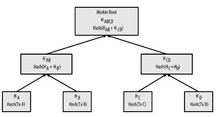
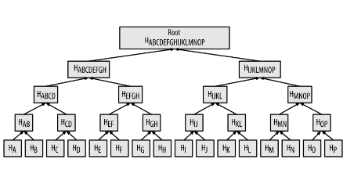
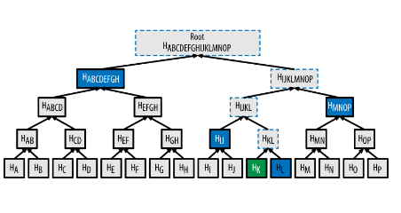

# Tópicos Especiais em Segurança da Informação (Smart Contracts)

> O que são Smart Contracts

- Ethereum é uma plataforma para contratos inteligentes, usa uma blockchain, define um token e uma EVM (Ethereum Virtual Machine)
- Principal linguagem: Solidity

```solidity
contract Leilao {
enum EstadosLeilao { LancesEstado, FinalizadoEstado}
EstadosLeilao meuEstado;

mapping (address => uint) lances;
uint blocklimit;
address vencedor;
address payable dono;
uint vencedorval;
bool pagou;

constructor(address payable d,uint tempo) public {
  blocklimit= block.number + tempo;
  meuEstado = EstadosLeilao.LancesEstado;
  vencedorval = 0;
  dono =d;
  pagou = false;
}
```

## Criptografia

### Exponencial e Polinomial

- Polinomial: factível, tratável
- Exponencial: intratável
- 2^160 esta além do poder computacional mundial
- NP é fácil verificar
- certificado/informação/solução
- máquina não determinística
- quase todos os problemas estudados são NP
- verificar se um numero é par, verficiar se um grafo é um ciclo

---

- Grande parte da criptografia só funciona com número grandes, só é segura dessa forma
- Fatoração x Multiplicação
- trapdoor
- CPU: 64 bits

---

- Biblioteca de Números Grandes
- Limite: memória e CPU
- Os numeros são armazenados como vetores
- As bibliotecas implementam as operações usuais: +, -, *, /, ehPrimo, etc

### Exponenciação

```portugol
int potencia(b,e):

  Se o expoente é par
    temp = potencia(b,e/2)
    retorna temp*temp

  temp = potencia(b,e/2)
  retorna temp*temp*b
```

### O problema do Logaritmo

- Dado um número x, b com x = b^e, determinar e
- Busca exaustiva: O(n), Busca exponencial: O(log n)

### O problema do Logaritmo Discreto

- Dados x, b e n com x = b^e mod n, determinar e
- mod n faz x ser circular, sendo n escolhido adequadamente

### Estabelecimento de Chaves

- Alice e Bob querem conversar de forma privada
- Eva (eavesdropper) fica escutando tudo
- Alice e Bob conhecem um bom cifrador
- mas não compartilham nenhum segredo
- Todos envolvidos conhecem o básico de matemática: multiplicação, (exponenciação)
- Este é um cenário razoável na Internet

---

- Alice, Bob e Eva conhecem uma base g
- (Alice pode escolher um número aleatório e colocar no blog dela...)
- Alise escolhe uma chave a e calcula g^a
- Bob escolher uma chave b e calcula g^b
- Alice faz um broadcast de g^a, Bob faz de g^b
- Alice conhece: g, a, g^a, g^b
- Bob conhece: g, b, g^a, g^b
- Eva conhece: g, g^a, g^b

---

- Alice conhece: g, a, g^a, g^b
- Alice faz (g^b)^a, obtendo g^(ab)
- Bob conhece: g, b, g^b, g^a
- Bob faz (g^a)^b, obtendo g^(ba) = g^(ab)
- Eva conhece: g, g^a, g^b
- Eva faz o que??
- Eva não consegue calcular g^(ab)
- Alice e Bob podem usar g^(ab) como chave secreta
- Eva não consegue calcular g^(ab) mesmo que saiba g, g^a e g^b (g^(a+b) somente)

## Hash

- Espalhamento ou dispersão
- Estrutura de Dados (Banco de Dados)
- Transforma uma lista grande em muitas listas pequenas/unitárias
- O(1)
  - o mundo real não funciona assim
- São uma informação pequena que representa uma informação grande

### Hashing Criptográfico - Propriedades

- h = H(x)
  - Compressão: |h| é muito menor que |x| (h possui tamanho fixo)
  - Eficiência
  - (Algoritmo Público)
  - Difícil de inverter = computacionalmente inviável, com probabilidade desprezível
  - Unidirecionais
    - Dado x, calcular h é fácil
    - dado h deve ser difícil determinar x' tal que H(x') = h
  - x' pode ser diferente de x
  - Difícil de colidir
    - Dado x, é difícil encontrar x' tal que H(x) = H(x')
    - Colisão: x != x' e H(x) = H(x')

---

- Há um algoritmo para inverter o hash

- Resistência a segunda pré-imagem
  - Dado x1
  - É difícil encontrar x2, (x1 != x2) tal que H(x1) = H(x2)
- Alguma informação de x1 pode ser usada...
- No exemplo de hash $\sum mod 10$, basta trocar 2 dígitos de x1 para obter H(x1) = H(x2)

### Algumas funções de hash

- MD5 (message digest)
  - Ron Rivest
  - MD2, MD4, ...
  - hash de 128 bits
  - Atualmente não é considerado seguro (colisões)

- Família SHA
  - Secure Hash Algorithm
  - SHA-0, SHA-1, SHA-2, SHA-3
  - até 512 bits
  - SHA-0 é insegura (criptoanálise)
- RIPEMD
  - 160 bits
- SHA3 e RIPEMD são as mais usadas no mundo das criptomoedas

### Aplicações

#### Compromissos - Commitments

- Eu preciso me comprometer com uma informação: M
- Eu não posso/quero revelar a informação M agora
- Eu publico um hash H(M)

---

- Alice conhece M (e h = H(M))
- Alice envia h para Bob
- Bob consegue determinar M?
- Em algum momento do futuro Alice envia M' para Bob
- Bob tem condições de saber se M == M'?
  - Bob calcula h' = H(M') e compara com h enviado por Alice

---

- Bom consegue determinar M?
  - Não, propriedade de unidirecionalidade de H
- Alice tem condições de gerar M' != M com H(M') == H(M)?
  - Não, propriedade de resistência a colisão de H
- Alguém tem condições de gerar M' != M com H(M') == H(M)?
  - Não, propriedade de resistência a segunda pré-imagem de H
- Bob tem condições de saber se M == M'?
  - Sim, basta comparar h com h'

---

##### Aplicações dos compromissos

- Leilão de Envelope fechado
- Os candidatos enviam envelopes fechados e lacrados até uma data limite
- No dia do leilão, o leiloeiro abre os envelopes e anuncia o vencedor (maior lance)
- (comum em licitações/privatizações)

---

- Leilão de Envelope fechado
  - O candidato i envia hi = H(Mi)
  - Cada hi é publicado
  - Após a fase de compromisso, os candidatos revelam Mi
  - O leiloeiro e os demais candidatos podem verificar se a legitimidade de cada Mi
  - (Diferente do sistema de envelope o candidato pode desistir de revelar Mi)

---

- O uso de commits é muito frequente em Smart Contracts
- O algoritmo é executado por todos os mineradores
- Execução confiável, porém sem confidencialidade
- Solução: compromissos e Zero Knowledge Proofs

#### Filtros de Bloom

- Estrutura de dados probabilística
- Dado uma função de hashing H podemos criar um número arbitrariamente grande de funções de hashing
  - H1, H2, H3, ...

---

- Definimos:
  - Hi(x) := H(i || x)
  - Concatenamos o identificador de função na mensagem (salting)
  - (Pode ser antes, depois, envelopando, ...)
  - Hi(x) != Hj(x) para i != j
  - (É o que esperamos ...)
  
---

- Um filtro de Bloom é uma ED com a seguinte interface:

```portugol
void insert(k)
contains(k) -> boolean
```

- contains(k) é probabilístico e retorna:
  - true: k **talvez** está no filtro
  - false: k não está no filtro
  - (não melhora se perguntar de novo!)

---

- O construtor de um Filtro de Bloom recebe dois parâmetros:
  - n que determina o tamanho de um vetor V de booleanos (inicializado em false)
  - h que determina o número de funções de hashing a serem utilizadas: h1, h2, ..., hh

---

- Ideia das funções

```python

def insert(k):
  for i in range(1, h+1):
    t = hi(k) 
    V[t % n] = True

def contains(k):
  for i in range(1, h+1):
    t = hi(k)
    if V[t % n] == False:
      return False
  return True
```

---

- O que acontece se k não foi inserido?
  - Todas as posições de V serão false
  - contains(k) sempre retorna false
  - (não há falsos negativos)
- O que acontece se k foi inserido?
  - Todas as posições de V serão true
  - porém outro k' pode ter colidido com k
  - por isso quando contains(k) retorna true, **talvez** ele esteja no filtro

---

- É possível calcular a probabilidade de falsos positivos
- É possível estimar o tamanho do conjunto
- União e intersecção (probabilística) de conjuntos
- Consulta confidencial a uma base de dados grande!! (bitcoin)
- (O cliente pede o filtro e faz a consulta localmente...)

#### Árvore de Merkle

- é uma forma eficintes de fazer um compromisso com diversos "documentos"
- Espaço constante!!! Rede P2P é cara
- Custo log para revelar os valores

---

- Um banco precisa publicar informações das transações do dia
- Tx1, Tx2, Tx3, ..., Txn
- Verificação posterior...
- Txk?? (como fazer isso de forma eficiente?)

---

- Solução 1: publicar as transações
- Custo?
  - $\sum_{1}^{n} |t_xn|$
- Vantagem?
  - Fácil...direto...

- Solução 2: publica o hash das transações...
- Custo?
  - |h| x n
- Vantagem?
  - Fácil..Fixo...direto...

---

- Uma solução simples seria publicar H(Tx1 | Tx2 | Tx3 | Tx4)
- Como verificar ser Tx1', Tx2', Tx3', Tx4' são as transações corretas?
  - H(Tx1' | Tx2' | Tx3' | Tx4') == H(Tx1 | Tx2 | Tx3 | Tx4)

---

- Como verificar se Tx1'?
- Recuperar todas as outras transações...
- H(Tx1', Tx2', Tx3', Tx4')
- Proibitivo para muitas transações...

---

Como publicar apenas um hash e não usar todas as transações para verificar uma Txk

- Montar uma árvore de hashes
- e armazenar apenas a raiz



---

- Folhas impares são solucionadas com duplicação
- Como todo árvore, a altura e dada por log



---

- A raiz é pública
- Data uma transação k como eu verifico se ela é válidas (= esta na árvore)



---

- Usada no bitcoin/blockchain
- Cada bloco do blockchain armazena a raíz da merkle tree das transações "validadas" neste bloco
- Quando alguém quer provar que uma determinada Tx pertence a um determinado bloco...
- ... envia ao verificador apenas as informações necessárias O(lg n)

### Hash + Blockchain

- Existem dois usos de hashing que viabilizam a existência da Blockchain
- Uma cadeia de blocos
- Append
- Conteúdo imutável
- Quanto mais antigo o bloco, mais difícil altera-lo
- (Alterar o último bloco é "fácil", acontece o tempo todo)
- Os blocos contém um campo que contém os dados da aplicação, no nosso caso uma criptomoeda Hyperledger (Exemplo: Cadeia de Produção)
- Ledger = Livro-Razão

#### Timestamp

- "Timestamp" em documentos digitais Impede o gasto duplo de dinheiro (digital)
- (Implícito: Impedir a modificação)
- Várias soluções... até chegar próximo à Blockchain de hoje

#### Ingênua

- Time Stamp Service (cartório?)
- (Trusted Third Party)
- Usuário envia x para TSS
- TSS diz "O Documento x existe desde d"
- Privacidade, Banda/Armazenamento, Incompetência e confiança

#### Melhoria

- Usuário envia h = H(x) para o TSS
- TSS assina "O hash h existe desde d"
- Propriedades do hash
- Confiança

#### Melhoria - Encadeamento

- Usuário envia hn = H(x) para o TSS
- TSS Produz:
  - Cn = (n, timestampn, hn, H(Cn-1))
- Confiança distribuída
- Sel alguém me envia um Ck eu posso confiar??

---

- Se eu tenho razões para desconfiar da veracidade de Ck
- Eu procuro o "dono" do docuemento k + 1
- Ck+1 atesta que Ck é verdadeiro pelo encadeamento do hash que aponta para o bloco anterior...
- Ck+2 atesta que Ck+1 e Ck são verdadeiros
- Ck+3
- Quanto mais "antigo" for Ck, mais difícil falsificar .... existem mais testemunhas

---

- Uma Blockchain é uma cadeia de blocos
- Cada bloco contém informações do negócio
- Cada bloco "aponta" para o anterior
- Este aponta não é uma ponta de localização
- É um aponta de confiança

---

- Se alguém for falsificar o Bn...
- precisará falsificar todos os blocos Bn+1, Bn+2, ..., Bu
- No modelo timestamp, cada bloco está sob os cuidados de um usuário...essa falsificação exigiria um complô
- A Blockchain/Bitcoin estão distribuídos em uma rede P2P
- Falsificar alguns milhares de blocos é trivial...pelo menos por enquanto

#### Prova de trabalho

- Proposta de usar de colisões parciais para evitar spam
- Serviços gratuitos podem cobrar colisões/inversões parciais, evitando abusos
- parciais = número de bits reduzido
- Obtidos por força bruta: gastando tempo e CPU

---

No header do e-mail existiria um campo X-Hashcash: hfalkjkhldkjhl
- O texto hfalkjkhldkjhl é a prova de trabalho
- "faz" com que o hash do email seja, por exemplo 000FCAB834C....
- Os servidores de email somente aceitariam um email se o hash seguir este padrão (iniciar com k zeros)
- Bitcoin usa inversão para determinar minerador de um bloco

```python
import hashlib

pre = "Informacoes do negocio, hash do bloco anterior,etc..."
x = 1
mined = False

while not mined:
  temp = pre + str(x)
  h = hashlib.sha256(temp.encode()).hexdigest()
  if h[:6] == '000000':
    mined = True
  x+=1
  
print(h)
```

---

- O Bloco é composto por informações como: transações, timestamp, altura, hash do bloco anterior...
- e uma área de nonce
- O hash do bloco deve ter algumas características específicas para ser aceito pelo protocolo
- Prova de trabalho (PoW)
- Falsificar blocos ficou mais difícil...quanto mais velho mais difícil

---

- E a famosa remuneração dos mineradores???
  - esta no campo transações!
- A primeira transação (coinbase) é uma transação de criação de moedas, então cada minerador coloca os seus endereços com destinatórios desta transação
- Além disso cada transação "normal" também paga uma taxa(tip)..o minerador coleta estes valores e também redireciona para um endereço dele

## Primeiro Contrato

### Ethereum - Somente o necessário

- Blockchain
- Mineradores além de validar as transações (simples) também executam os contratos
- As contas possuem saldo
- Os contratos são imutáveis
- Os contratos possuem um endereço
  - Padrão de desenvolvimento pode ajudar, botão de pânico
- Ambiente de desenvolvimento é mais complexo

---

- Os contratos são desenvolvidos em Solidity
- Ethereum bytecode
- São "entregues ao Ethereum" (deploy)
  - Gera um identificador único (hash)
  - Uma vez entregue o contrato esta autônomo
- Decentralized App (DApp)
  - Envia transações para Contratos
  - GUI, IPFS, ...
- Iteração pela ABI - Application Binary Interface
  - bytes4(sha3("funcao1(bytes, bool uint256[])"))
- web3.js
  - Nó ethereum (local ou remoto) via HTTP, IPC ou WebSocket

### Doces Ferramentas

- Ambiente de desenvolvimento complexo
- Vários usuários interagindo com o SC
- bugs...dinheiro
- Existem redes paralelas ao Ethereum que não usam dinheiro de verdade
- Você pode usar ferramentas para trabalhar localmente
- Doces

#### Ganache

- One Click Blockchain
- Blockchain Log Output
- Built-in Block Explorer
- Advanced MIning Controls
- "AppImage"

#### Truffle

- Framework para interagir com o Ethereum(Ganache)
- init
- build, compile
- deploy/migrate
- console
- unbox

#### Brownie

- python + Solidity (Vyper)
- web3.py
- Console e biblioteca

### Finalmente um SC

```solidity
pragma solidity >= 0.4.25 < 0.6.0

contract AlmostSmartAuction {
  enum AuctionStates { BidState, FinishedState }
  AuctionStates myState;

  mapping (address => uint) bids;
  uint blocklimit;
  adddress winner;
  uint winnerBid;

  constructor(uint auctionTime) public {
    blocklimit = block.number + auctionTime;
    myState = AuctionStates.BidState;
    winnerBid = 0;
  }

  function bid(uing bidValue) public {
    verifyFinished();
    require (myState == AuctionStates.BidState, "Bids closet...);

    if (bidValue > winnerBid) {
      winnerBid = bidValue;
      winner = msg.sender;
    }
  }

  function isWinner(address who) public returns (bool) {
    verifyFinished();
    require ( myState == AuctionStates.FinishedState, "Be patient...");
    return who == winner;
  }
}
```

```python
from brownie import *
import brownie

def main():
  auction = AlmostSmartAuction.deploy(4,{'from': accounts[0]})

  auction.bid(10,{'from': accounts[1]})
  auction.bid(12,{'from': accounts[2]})
  auction.bid(13,{'from': accounts[1]})
  auction.bid(14,{'from': accounts[3]})
  try:
    auction.bid(16,{'from': accounts[4]})
  except:
    print('Fail...')

  print(auction.isWinner.call(accounts[1].address,{'from': accounts[1]}))
  print(auction.isWinner.call(accounts[2].address,{'from': accounts[0]}))
  print(auction.isWinner.call(accounts[3].address,{'from': accounts[5]}))
```

#### Token

```solidity
pragma solidity >= 0.4.25 < 0.6.0

contract VerySimpleToken {
  string name;
  address tokenOwner;

  constructor(string memory _n) public {
    tokenOwner = msg.sender;
    name = _n;
  }

  function transfer(address to) public {
    require(msg.sender == tokenOwner);
    tokenOwner = to;
  }

  function isOwner(address d) public returns (bool) {
    return (d == tokenOwner);
  }
}
```

- Vamos leiloar um token... o contrato consegue entregar o token
- Vamos exigir uma garantia (colateral) para os participantes
- Para deixar mais interessante o contrato poderá lidar com vários leilões
- O contrato cobrará uma taxa pelo uso (monetização)

```solidity
pragma solidity >= 0.4.25 < 0.6.0

import "./VerySimpleToken.sol";

contract TokenAuction {
  enum AuctionStates { Prep, Bid, Finished }

  address payable owner;

  struct OneAuction {
    AuctionStates myState;
    mapping (address => bool) collateral;
    uing blocklimit;
    address winner;
    addres payable tokenOwner;
    uint winnerBid;
    bool payment;
    VerySimpleToken token;
  }

  uint collateralValue;
  uint contractFee;

  mapping (string => OneAuction) myAuctions;

  constructor(uint c, uint fee) public {
    owner = msg.sender
    collateralValue = c;
    contractFee = fee;
  }

  function createAuction(string memory name, uint time, VerySimpleToken t) public {
    require(t.isOwner(msg.sender), "You must own the token to create one auction!");
    OneAuction memory l;

    l.blocklimit = block.number + time;
    l.myState = AuctionStates.Prep;
    l.winnerBit = 0;
    l.tokenOwner = msg.sender;
    l.payment = false;
    l.token = t;

    //Bug1
    myAuctions[name] = l;
  }

  function initAuction(string memory name) public {
    require(myAuctions[name].myState == AuctionStates.Prep, "The auction should be in Prep state")

    require (myAuctions[name].token.isOwner(address(this)), "The contract should own the token");

    myAuctions[name].myState = AuctionStates.Bid;
  }

  function verifyFinished(OneAuction a) private {
    if (block.number > a.bloclimit) {
      a.myState = AuctionStates.Finished;
    }
  }

  function sendCollateral(string memory name) public payable {
    require(myAuctions[name].myState == AuctionStates.Bid, "The auction should be in Bid state");

    require(msg.value == collateralValue, "You shoud send the correct value!");

    myAuctions[name].collateral[msg.sender] = true;
  }

  function bid(string memory name, uint v) public payable {
    OneAuction storage a = myAuctions[name];
    verifyFinished(a);

    require (a.myState == AuctionStates.Bid, "The auction should be in Bid state");

    require (a.collateral[msg.sender], "Send the collateral value before bidding");

    if (v > a.winnerBid) {
      a.winnerBid = v;
      a.winner = msg.sender;
    }

  }

  function claimToken(string memory name) public payable {
    //Bug2

    OneAuction storage a = myAuctions[name];
    verifyFinished(a);

    require (a.myState == AuctionSates.Finished, "Wait a minute, boys, this one is not over yet!");
    require (msg.value == a.winnerBid - collateralValue, "Pay First....");

    a.token.transfer(msg.sender);
    a.collateral[a.winner] = false; // just to flag claimToken
  }

  function claimCollateral(string memory name) public {
    OneAuction storage a = myAuctions[name];
  }
}
```

## ECC com Assinaturas

- Dada uma curva a, b e um ponto gerador G e um módulo p...
- Público/Sistema...sempre as partes conhecem
- calcular P = 2G
- calcular Q = 1024G
- calcular R = P + Q = 1026G
  - R = (1024 + 2)G

- Dado R, encontrar n tal que R = nG -> não
- As operações + e x "funcionam"
  - Associativa, distributiva e comutativa!

### Claus-Peter Schnorr

- Conheço k (de um K = kG) sem revelar k
- P gera alpha aleatório e envia alphaG ao V
- V gera um desafio c e envia para P
- P responde R = alpha + c*k
- V calcula R = rG e R' = alphaG + c*K e verifica se R == R'
- Tente provar sem conhecer o k

### Fiat-Shamir

- Não iterativo/ Mesmo objetivo
- P
  - Gera alpha aleatório e alphaG
  - Gera o desafio c = H(alphG)
  - Faz r = alpha + c * k
  - Publica (alphaG, r)
- V
  - Gera o desafio c' = H(alphaG)
  - Calcula R = rG e R' = alphaG + c'*K e verifica se R == R'

---

- Alice ka = Ka = kaG e m
- Ka é a chave pública de Alice (endereço!)
- m é uma mensagem "Pague 10 Ether para 0xabcdef"
- Gera alpha aleatório e alphaG
- Gera o desafio c = H(m | alphaG)
- Faz r = alpha - c * ka
- Publica (c, r, m) (Ka já é publico)

---

- Público: (c, r, m), Ka, e curva
- Qualquer pessoa pode calcular
- c' = H(m | (rG + cKa))
- E verificar se c == c'
- Se H(m | alphaG) == H(m | rG + cKa)
  - rG + cKa == (alphaG - c*kaG) + cKa == (alphaG - c*Ka) + cKa == alphaG
  - então c = c' e sabemos que o dono da Ka gerou (c, r, m)

- c e r é assinatura de Ka sobre m!
- O minerador diminui o saldo de Ka, aumenta de Oxabcdef, atualiza Árvore de Merkle

---

- Este é um processo de assinatura e verificação de assinatura
- Somente A pode gerar (c, r, m)
- Que seja verificável por qualquer outra pessoa
- A assinou m
- ECDSA - Elliptic Curve Digital Signature Algorithm

## Solidity

### GAS

- O seu SC (Smart Contract) roda nos computadores espalhados pelo mundo
  - De forma redundante
  - Diferente de uma nuvem
- Alguém precisa pagar por isso
- GAS
- Cotação GAS x Ether (X US$)
- Esta moeda "separada" (cotação separada) permite uma dissociação

---

- Cada instrução da EVM tem um custo
  - Boas práticas do programação
- Computação off chain
- Cada byte armazenado também storage/memory
- A "carteira" cuida do pagamento
- A carteira paga para rodar o contrato A, que chama um contrato B, que chama tudo por conta de quem iniciou a transação
- Define um Gas Máximo para a transação
  - Por enquanto tudo escondido/default
- O gas não é revertido no rollback

---

- Pode pagar mais
- pressa
- Inúmeras possibilidades de ataques

### Mapping

- Estrutura chave/valor
- Todas as chaves estão inicializadas com "zero"
- Pode exigir algum esforço de programação mapping(address => uint) balances;
- Sem iterator!!!

### Modifiers

```solidity
function XYZ(<param types>)
{internal|external} [constant] [payable] [returns(<ret types>)]
```

- Existem outros
- Podem ser definidos pelos usuários

---

