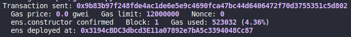
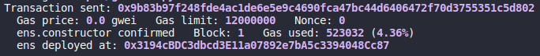
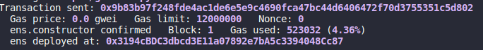
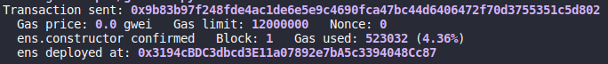
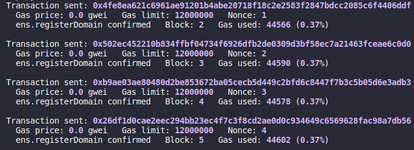
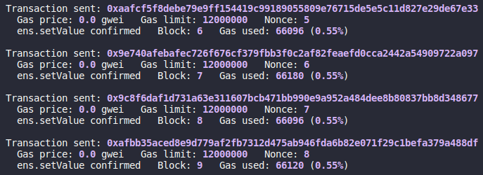

# Tarefa ENS - Tópicos Especiais em Segurança da Informação

> 11921BCC016 - Guilherme Alves Carvalho

## Código Fonte

### solidity contract

```solidity
// SPDX-License-Identifier: UNLICENSED
pragma solidity ^0.8.19;

contract ens {
    address owner;
    mapping(string => mapping(string => address)) public enses;
    mapping(string => mapping(address => string)) public addressesSubdomains;

    constructor() {
        owner = msg.sender;
    }

    modifier onlyOwner() {
        require(msg.sender == owner, "You must be the owner");
        _;
    }

    // registra um "dominio" para msg.sender
    // registerDomain(string newDomain) onlyOwner;
    function registerDomain(string memory newDomain) public onlyOwner {
        string memory addr = string(abi.encodePacked(msg.sender));
        enses[newDomain][addr] = msg.sender;
    }

    // O msg.sender define um par chave-valor em domain
    // setValue("TOPICOS","ivan") faz ENS["TOPICOS"]["ivan"] = msg.sender
    // setValue(string domain, string v)
    // OBS: should domain owner register the subdomains? this way anyone can register a subdomain
    function setValue(string memory domain, string memory v) public {
        enses[domain][v] = msg.sender;
        addressesSubdomains[domain][msg.sender] = v;
    }

    // getValue("TOPICOS","ivan") retorna  o endereço ADDRESS  quando ENS["TOPICOS"]["ivan"] = ADDRESS
    // getValue(string domain, string v) returns (address)
    function getValue(
        string memory domain,
        string memory v
    ) public view returns (address) {
        return enses[domain][v];
    }

    // getValue("TOPICOS") retorna  a string RET quando ENS["TOPICOS"][RET] = msg.sender
    // getValue(string domain) returns (string)
    function getValue(
        string memory domain
    ) public view returns (string memory) {
        return addressesSubdomains[domain][msg.sender];
    }
}

// deployment: 0x9A4ec17378F5128F62849edF460145667CFb551c
```

### gas calculator python script

```python
from brownie import *
from brownie import ens, accounts

def main():
    acc = accounts[0]
    contract = ens.deploy({'from': acc})
    print(f'Deployer address {acc.address}')

    # testing registerDomain(newDomain)
    contract.registerDomain('google', {'from': acc})
    contract.registerDomain('facebook', {'from': acc})
    contract.registerDomain('twitter', {'from': acc})
    contract.registerDomain('instagram', {'from': acc})

    # testing setValue(domain, v)
    contract.setValue('google', 'docs', {'from': acc})
    contract.setValue('facebook', 'messenger', {'from': acc})
    contract.setValue('twitter', 'api', {'from': acc})
    contract.setValue('instagram', 'api', {'from': acc})

    # testing getValue(domain)
    g = contract.getValue('google')
    f = contract.getValue('facebook')
    t = contract.getValue('twitter')
    i = contract.getValue('instagram')

    print(g)
    print(f)
    print(t)
    print(i)

    # getValue(domain, v)
    gd = contract.getValue('google', 'docs')
    fm = contract.getValue('facebook', 'messenger')
    ta = contract.getValue('twitter', 'api')
    ia = contract.getValue('instagram', 'api')

    print(gd)
    print(fm)
    print(ta)
    print(ia)

```

## Análise de GAS

Análise realizada localmente utilizado a média de quatro chamadas para cada função do contrato.

### constructor()






Média dos resultados acima: 523032 gas.

### registerDomain(string memory newDomain) public onlyOwner



Média dos resultados acima: 44584 gas.

### setValue(string memory domain, string memory v) public



Média dos resultados acima: 66123 gas.

### getValue(string memory domain, string memory v) public view returns (address)

A função não gastou gas.

### getValue(string memory domain) public view returns (string memory)

A função não gastou gas.

## Deploy

[deployment link on etherscan](https://sepolia.etherscan.io/address/0x9A4ec17378F5128F62849edF460145667CFb551c)
